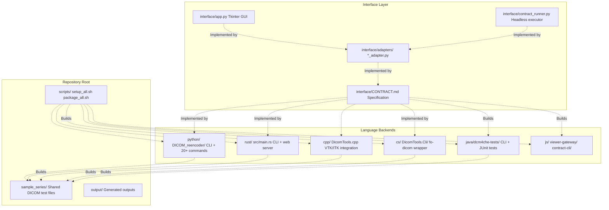
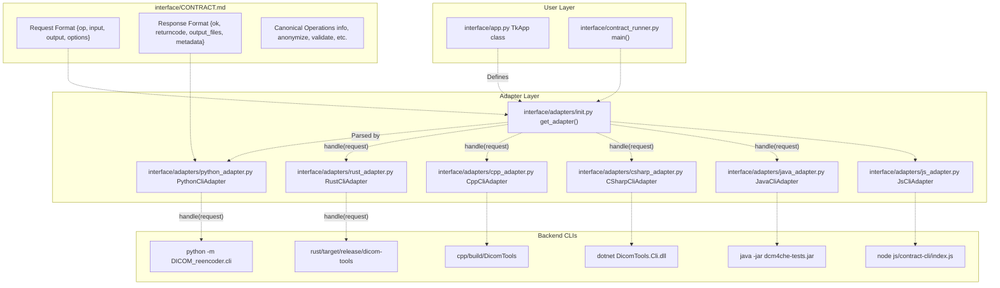
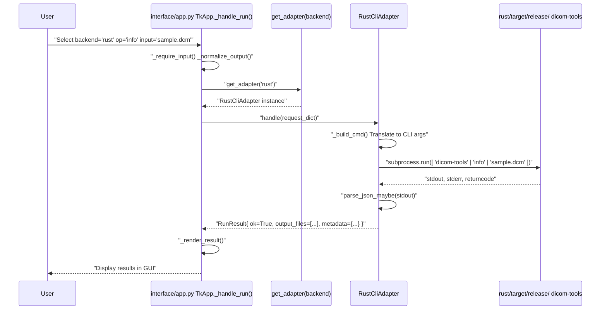
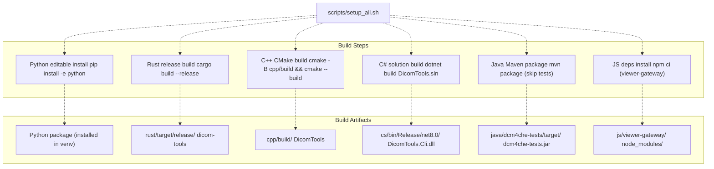
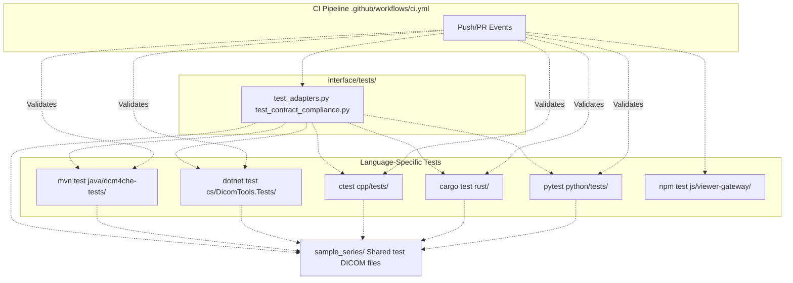

# Overview

> **Relevant source files**
> * [BUILD.md](https://github.com/ThalesMMS/Dicom-Tools/blob/c7b4cbd8/BUILD.md)
> * [README.md](https://github.com/ThalesMMS/Dicom-Tools/blob/c7b4cbd8/README.md)
> * [scripts/setup_all.sh](https://github.com/ThalesMMS/Dicom-Tools/blob/c7b4cbd8/scripts/setup_all.sh)

This document introduces the Dicom-Tools repository, a multi-language DICOM processing toolkit that provides unified interfaces across six programming language implementations. It covers the repository structure, core architectural patterns, and the key components that enable cross-language interoperability.

For step-by-step installation instructions, see [Installation and Setup](#1.2). For hands-on usage examples, see [Quick Start Guide](#1.3). For detailed information about individual language backends, see [Language Implementations](#4).

## Purpose and Scope

Dicom-Tools is a unified DICOM processing toolkit with command-line interfaces and utilities implemented in Python, Rust, C++, C#, Java, and JavaScript. The repository provides:

* **Six complete language backends** for DICOM file processing, network operations, and visualization
* **Unified CLI contract** that enables cross-language interoperability through a standardized request/response format
* **Multiple user interfaces**: Tkinter desktop GUI, headless contract runner, and web-based medical image viewer
* **Shared test data** in `sample_series/` used across all backends and tests
* **Adapter pattern** that isolates UI components from backend implementation details

Each language implementation leverages ecosystem-specific DICOM libraries while conforming to the same interface contract defined in `interface/CONTRACT.md`.

**Sources:** [README.md L1-L43](https://github.com/ThalesMMS/Dicom-Tools/blob/c7b4cbd8/README.md#L1-L43)

## Repository Structure

The repository is organized with each language backend in its own top-level directory, plus shared components for interfaces and sample data:



**Sources:** [README.md L1-L43](https://github.com/ThalesMMS/Dicom-Tools/blob/c7b4cbd8/README.md#L1-L43)

 [scripts/setup_all.sh L1-L60](https://github.com/ThalesMMS/Dicom-Tools/blob/c7b4cbd8/scripts/setup_all.sh#L1-L60)

### Directory Layout

| Directory | Purpose | Key Files |
| --- | --- | --- |
| `python/` | Python backend with pydicom, pynetdicom, GDCM, SimpleITK | `DICOM_reencoder/cli.py`, `DICOM_reencoder/commands/` |
| `rust/` | Rust backend with dicom-rs stack | `src/main.rs`, `src/cli/`, `src/web/` |
| `cpp/` | C++ backend with DCMTK, GDCM, ITK, VTK | `DicomTools.cpp`, `modules/` |
| `cs/` | C# backend with fo-dicom (.NET 8) | `DicomTools.Cli/Program.cs`, `DicomTools.Tests/` |
| `java/dcm4che-tests/` | Java backend with dcm4che3 | `src/main/java/com/dicomtools/cli/DicomToolsCli.java` |
| `js/viewer-gateway/` | Web viewer with Cornerstone3D | `src/main.ts`, `src/viewerGateway.ts` |
| `js/contract-cli/` | Node.js contract shim | `index.js` (delegates to Python) |
| `interface/` | Unified UI and adapter layer | `app.py`, `contract_runner.py`, `adapters/` |
| `sample_series/` | Shared DICOM test files | `IM-0001-0001.dcm` through `IM-0001-0190.dcm` |
| `scripts/` | Build and setup automation | `setup_all.sh`, `package_all.sh` |

**Sources:** [README.md L15-L22](https://github.com/ThalesMMS/Dicom-Tools/blob/c7b4cbd8/README.md#L15-L22)

 [BUILD.md L1-L48](https://github.com/ThalesMMS/Dicom-Tools/blob/c7b4cbd8/BUILD.md#L1-L48)

## Core Architecture Concepts

### CLI Contract System

The CLI contract is the central abstraction that enables cross-language interoperability. It defines a standardized JSON request/response format that all backends must implement.



The contract defines operations like `info`, `anonymize`, `validate`, `transcode`, `to_image`, `echo`, `store_scu`, and many others. Each backend CLI receives JSON-formatted requests and returns JSON responses conforming to the specification.

For complete contract details, see [CLI Contract System](#3) and [Contract Specification](#3.1).

**Sources:** [README.md L41-L42](https://github.com/ThalesMMS/Dicom-Tools/blob/c7b4cbd8/README.md#L41-L42)

 [BUILD.md L34-L41](https://github.com/ThalesMMS/Dicom-Tools/blob/c7b4cbd8/BUILD.md#L34-L41)

### Adapter Pattern Implementation

The adapter pattern isolates user interfaces from backend-specific CLI invocations. Each adapter translates generic contract requests into language-specific command-line arguments.



Each adapter class implements a `handle(request: dict) -> RunResult` method and manages environment variable resolution for CLI paths.

For adapter implementation details, see [Adapter Pattern](#3.2).

**Sources:** [README.md L22](https://github.com/ThalesMMS/Dicom-Tools/blob/c7b4cbd8/README.md#L22-L22)

 [BUILD.md L34-L41](https://github.com/ThalesMMS/Dicom-Tools/blob/c7b4cbd8/BUILD.md#L34-L41)

## Language Backend Capabilities

The following table summarizes the capabilities and unique strengths of each language backend:

| Backend | Primary Libraries | CLI Commands | Unique Capabilities | Build Output |
| --- | --- | --- | --- | --- |
| **Python** | pydicom, pynetdicom, GDCM, SimpleITK, dicom-numpy | 20+ | Most comprehensive, network operations (echo/query/retrieve), NIfTI export, batch processing | Editable install via pip |
| **Rust** | dicom-rs | 15+ | JSON round-trip, web server mode, modern async networking, histogram analysis | `rust/target/release/dicom-tools` |
| **C++** | DCMTK, GDCM, ITK, VTK | 12+ | Advanced visualization (MPR, volume rendering), SR/RT support, VTK integration | `cpp/build/DicomTools` |
| **C#** | fo-dicom | 10+ | .NET ecosystem, DICOMweb (QIDO/STOW/WADO), network services, xUnit test suite | `cs/bin/Release/net8.0/DicomTools.Cli.dll` |
| **Java** | dcm4che3 | 9+ | Enterprise Java, Maven integration, DICOM conformance testing | `java/dcm4che-tests/target/dcm4che-tests.jar` |
| **JavaScript** | contract-cli shim → Python | Delegates to Python | Node.js compatibility, web viewer (Cornerstone3D), browser-based visualization | `js/contract-cli/index.js` |

### Operation Support Matrix

| Operation | Python | Rust | C++ | C# | Java | JS |
| --- | --- | --- | --- | --- | --- | --- |
| `info` | ✓ | ✓ | ✓ | ✓ | ✓ | ✓ (via Python) |
| `anonymize` | ✓ | ✓ | ✓ | ✓ | ✓ | ✓ (via Python) |
| `validate` | ✓ | ✓ | ✗ | ✓ | ✓ | ✓ (via Python) |
| `transcode` | ✓ | ✓ | ✓ | ✓ | ✓ | ✓ (via Python) |
| `to_image` | ✓ | ✓ | ✓ | ✓ | ✓ | ✓ (via Python) |
| `volume`/`nifti` | ✓ | ✗ | ✓ | ✗ | ✗ | ✗ |
| `echo` | ✓ | ✓ | ✓ | ✓ | ✓ | ✗ |
| `store_scu` | ✓ | ✗ | ✗ | ✓ | ✓ | ✗ |
| `qido`/`stow`/`wado` | ✓ | ✓ | ✗ | ✓ | ✓ | ✗ |
| VTK operations | ✗ | ✗ | ✓ | ✗ | ✗ | ✗ |
| Web server | ✗ | ✓ | ✗ | ✗ | ✗ | ✗ |

For detailed information on each backend, see [Language Implementations](#4).

**Sources:** [README.md L7-L22](https://github.com/ThalesMMS/Dicom-Tools/blob/c7b4cbd8/README.md#L7-L22)

## Key Components

### User Interfaces

Dicom-Tools provides three primary user interfaces:

1. **TkApp Desktop GUI** (`interface/app.py`) - Tkinter-based graphical interface for interactive DICOM processing. Provides backend selection, operation configuration, and result visualization. See [TkApp Desktop GUI](#2.1).
2. **Contract Runner** (`interface/contract_runner.py`) - Headless command-line executor for automated, scriptable DICOM processing. Accepts JSON request files or command-line arguments. See [Contract Runner (Headless CLI)](#2.2).
3. **Web Viewer** (`js/viewer-gateway/`) - Browser-based medical image viewer built on Cornerstone3D. Supports 2D stack viewing, 3D volume rendering, and DICOMweb integration. See [Web Viewer (JavaScript)](#2.3).

**Sources:** [README.md L22](https://github.com/ThalesMMS/Dicom-Tools/blob/c7b4cbd8/README.md#L22-L22)

### Build System

The `scripts/setup_all.sh` script provides one-command setup for all language backends:



Environment variables can override default CLI paths:

* `PYTHON_DICOM_TOOLS_CMD` - Python CLI path
* `RUST_DICOM_TOOLS_BIN` - Rust binary path
* `CPP_DICOM_TOOLS_BIN` - C++ binary path
* `CS_DICOM_TOOLS_CMD` - C# CLI command
* `JAVA_DICOM_TOOLS_CMD` - Java CLI command
* `JS_DICOM_TOOLS_CMD` - JavaScript CLI path
* `BACKING_CMD` - Backend command for JS contract-cli shim

For complete build system details, see [Build System](#8.1).

**Sources:** [scripts/setup_all.sh L1-L60](https://github.com/ThalesMMS/Dicom-Tools/blob/c7b4cbd8/scripts/setup_all.sh#L1-L60)

 [BUILD.md L1-L48](https://github.com/ThalesMMS/Dicom-Tools/blob/c7b4cbd8/BUILD.md#L1-L48)

### Testing Infrastructure

Testing follows a two-tier strategy:

1. **Language-specific tests** - Unit and integration tests within each backend directory using language-native frameworks (pytest, cargo test, ctest, xUnit, JUnit, Vitest)
2. **Interface/contract tests** - Cross-language integration tests in `interface/tests/` that validate contract compliance and ensure all backends produce equivalent results



All tests use the shared `sample_series/` directory for consistent test data across languages.

For detailed testing information, see [Testing](#7) and [Testing Strategy](#7.1).

**Sources:** [README.md L32-L40](https://github.com/ThalesMMS/Dicom-Tools/blob/c7b4cbd8/README.md#L32-L40)

 [BUILD.md L24-L32](https://github.com/ThalesMMS/Dicom-Tools/blob/c7b4cbd8/BUILD.md#L24-L32)

## Getting Started

### Prerequisites

To use Dicom-Tools, you need:

* Python 3.10+ with pip
* Rust stable (1.75+) with cargo
* CMake ≥3.15 and C++17 compiler
* .NET SDK 8.0+
* JDK 17+ and Maven
* Node.js 18+

### Quick Setup

```
# Clone repositorygit clone https://github.com/ThalesMMS/Dicom-Tools.gitcd Dicom-Tools# One-command setup (builds all backends)./scripts/setup_all.sh# Launch GUIpython -m interface.app# Or use headless contract runnerpython -m interface.contract_runner --backend python --op info --input sample_series/IM-0001-0001.dcm
```

For detailed setup instructions, see [Installation and Setup](#1.2). For usage examples, see [Quick Start Guide](#1.3).

**Sources:** [README.md L27-L31](https://github.com/ThalesMMS/Dicom-Tools/blob/c7b4cbd8/README.md#L27-L31)

 [scripts/setup_all.sh L1-L60](https://github.com/ThalesMMS/Dicom-Tools/blob/c7b4cbd8/scripts/setup_all.sh#L1-L60)

 [BUILD.md L1-L48](https://github.com/ThalesMMS/Dicom-Tools/blob/c7b4cbd8/BUILD.md#L1-L48)

Refresh this wiki

Last indexed: 5 January 2026 ([c7b4cb](https://github.com/ThalesMMS/Dicom-Tools/commit/c7b4cbd8))

### On this page

* [Overview](#1-overview)
* [Purpose and Scope](#1-purpose-and-scope)
* [Repository Structure](#1-repository-structure)
* [Directory Layout](#1-directory-layout)
* [Core Architecture Concepts](#1-core-architecture-concepts)
* [CLI Contract System](#1-cli-contract-system)
* [Adapter Pattern Implementation](#1-adapter-pattern-implementation)
* [Language Backend Capabilities](#1-language-backend-capabilities)
* [Operation Support Matrix](#1-operation-support-matrix)
* [Key Components](#1-key-components)
* [User Interfaces](#1-user-interfaces)
* [Build System](#1-build-system)
* [Testing Infrastructure](#1-testing-infrastructure)
* [Getting Started](#1-getting-started)
* [Prerequisites](#1-prerequisites)
* [Quick Setup](#1-quick-setup)

Ask Devin about Dicom-Tools