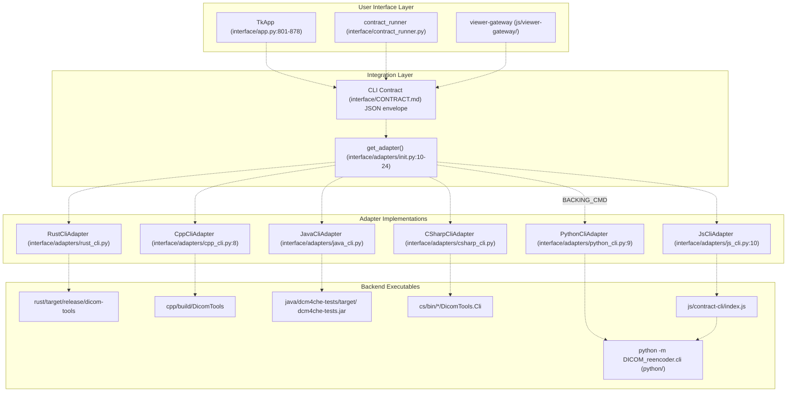
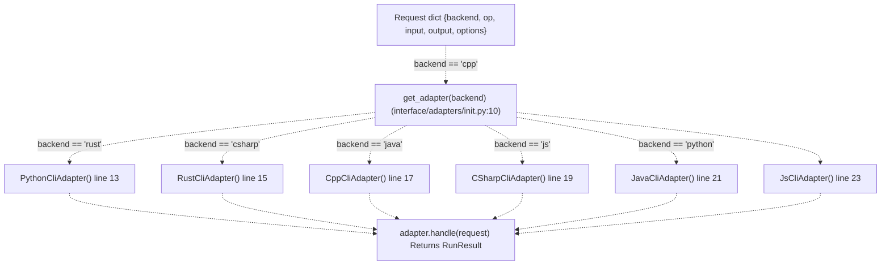
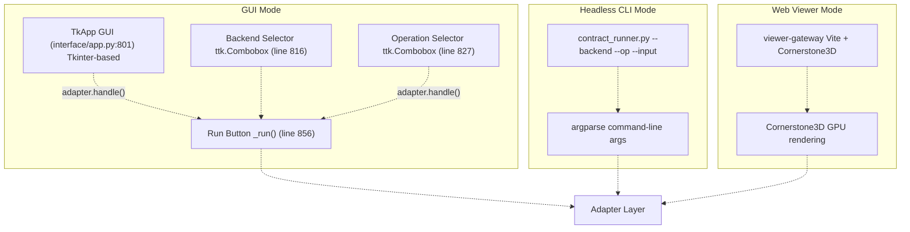
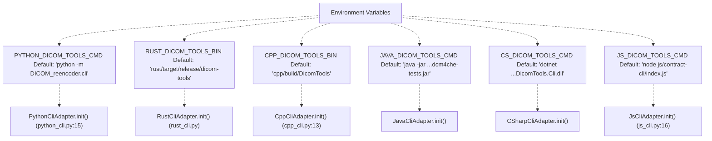
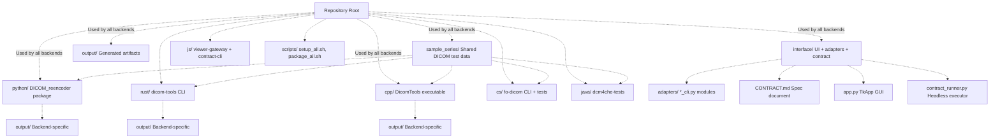
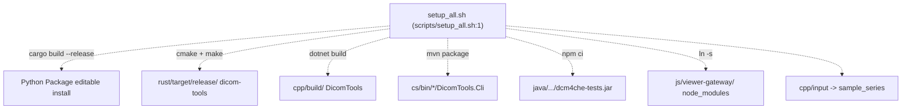

# 1a Architecture Overview

> **Relevant source files**
> * [BUILD.md](https://github.com/ThalesMMS/Dicom-Tools/blob/c7b4cbd8/BUILD.md)
> * [README.md](https://github.com/ThalesMMS/Dicom-Tools/blob/c7b4cbd8/README.md)
> * [interface/CONTRACT.md](https://github.com/ThalesMMS/Dicom-Tools/blob/c7b4cbd8/interface/CONTRACT.md)
> * [interface/adapters/__init__.py](https://github.com/ThalesMMS/Dicom-Tools/blob/c7b4cbd8/interface/adapters/__init__.py)
> * [interface/adapters/cpp_cli.py](https://github.com/ThalesMMS/Dicom-Tools/blob/c7b4cbd8/interface/adapters/cpp_cli.py)
> * [interface/adapters/js_cli.py](https://github.com/ThalesMMS/Dicom-Tools/blob/c7b4cbd8/interface/adapters/js_cli.py)
> * [interface/adapters/python_cli.py](https://github.com/ThalesMMS/Dicom-Tools/blob/c7b4cbd8/interface/adapters/python_cli.py)
> * [interface/app.py](https://github.com/ThalesMMS/Dicom-Tools/blob/c7b4cbd8/interface/app.py)
> * [scripts/setup_all.sh](https://github.com/ThalesMMS/Dicom-Tools/blob/c7b4cbd8/scripts/setup_all.sh)

## Purpose and Scope

This document describes the high-level architecture of the Dicom-Tools repository, explaining how six language implementations (Python, Rust, C++, C#, Java, JavaScript) are unified through a contract-based abstraction layer. It covers the adapter pattern, CLI contract system, user interface components, and environment configuration mechanisms.

For detailed information about specific backends, see sections [4a](4a%20Python-Backend.md) through [4f](4f%20JavaScript-Backend.md). For the CLI contract specification, see [3a](3a%20Contract-Specification.md). For user interface details, see sections [2a](2a%20TkApp-Desktop-GUI.md) through [2c](2c%20Web-Viewer-%28JavaScript%29.md).

---

## Hub-and-Spoke Architecture

Dicom-Tools implements a **hub-and-spoke** design where the CLI Contract serves as the universal abstraction, enabling any user interface to invoke any backend without coupling to implementation details.

### Contract-Based Integration Layer



**Sources:** [interface/app.py L1-L878](https://github.com/ThalesMMS/Dicom-Tools/blob/c7b4cbd8/interface/app.py#L1-L878)

 [interface/adapters/__init__.py L1-L25](https://github.com/ThalesMMS/Dicom-Tools/blob/c7b4cbd8/interface/adapters/__init__.py#L1-L25)

 [interface/CONTRACT.md L1-L112](https://github.com/ThalesMMS/Dicom-Tools/blob/c7b4cbd8/interface/CONTRACT.md#L1-L112)

### Request/Response Envelope

The CLI Contract defines a standard JSON envelope for all operations:

| Field | Description | Example |
| --- | --- | --- |
| `backend` | Target implementation | `"python"`, `"rust"`, `"cpp"`, `"java"`, `"csharp"`, `"js"` |
| `op` | Canonical operation name | `"info"`, `"anonymize"`, `"to_image"`, `"transcode"`, `"validate"` |
| `input` | File or directory path | `"sample_series/IM-0001-0001.dcm"` |
| `output` | Optional output path | `"output/result.dcm"` |
| `options` | Operation-specific parameters | `{"format": "png", "frame": 0}` |

Response envelope:

| Field | Description |
| --- | --- |
| `ok` | Operation success boolean |
| `returncode` | Process exit code |
| `stdout` | Standard output text |
| `stderr` | Standard error text |
| `output_files` | List of generated files |
| `metadata` | Optional structured data (JSON) |

**Sources:** [interface/CONTRACT.md L6-L26](https://github.com/ThalesMMS/Dicom-Tools/blob/c7b4cbd8/interface/CONTRACT.md#L6-L26)

---

## Adapter Pattern Implementation

Each backend adapter implements the `handle(request: dict) -> RunResult` method, translating generic requests into backend-specific CLI invocations.

### Adapter Factory and Dispatch



**Sources:** [interface/adapters/__init__.py L1-L25](https://github.com/ThalesMMS/Dicom-Tools/blob/c7b4cbd8/interface/adapters/__init__.py#L1-L25)

### Adapter Responsibilities

Each adapter class implements three core responsibilities:

1. **Command Construction** - The `_build_cmd()` method translates canonical operations to backend-specific CLI arguments
2. **Process Execution** - Invokes the backend executable using `run_process()` from `runner.py`
3. **Result Parsing** - Extracts `output_files` and optional `metadata` from stdout/stderr

#### Example: PythonCliAdapter Command Translation

The Python adapter's `_build_cmd()` method maps operations:

```
info → ["python", "-m", "DICOM_reencoder.cli", "summary", input, "--json"]
anonymize → ["python", "-m", "DICOM_reencoder.cli", "anonymize", input, "-o", output]
to_image → ["python", "-m", "DICOM_reencoder.cli", "png", input, "-o", output, "--frame", frame]
transcode → ["python", "-m", "DICOM_reencoder.cli", "transcode", input, "-o", output, "--syntax", syntax]
```

**Sources:** [interface/adapters/python_cli.py L45-L165](https://github.com/ThalesMMS/Dicom-Tools/blob/c7b4cbd8/interface/adapters/python_cli.py#L45-L165)

#### Example: CppCliAdapter Command Translation

The C++ adapter maps operations to GDCM/DCMTK/VTK modules:

```
info → ["DicomTools", "gdcm:dump", "-i", input, "-o", output_dir]
anonymize → ["DicomTools", "gdcm:anonymize", "-i", input, "-o", output_dir]
to_image → ["DicomTools", "gdcm:preview", "-i", input, "-o", output_dir]
transcode → ["DicomTools", "gdcm:transcode-j2k", "-i", input, "-o", output_dir]
vtk_volume_render → ["DicomTools", "vtk:volume-render", "-i", series_dir, "-o", output_dir]
```

**Sources:** [interface/adapters/cpp_cli.py L55-L144](https://github.com/ThalesMMS/Dicom-Tools/blob/c7b4cbd8/interface/adapters/cpp_cli.py#L55-L144)

#### Example: JsCliAdapter Delegation

The JavaScript adapter is unique—it's a shim that delegates to Python:

```
// js/contract-cli/index.jsconst BACKING_CMD = process.env.BACKING_CMD || 'python -m DICOM_reencoder.cli'
```

The `JsCliAdapter` invokes `node js/contract-cli/index.js`, which internally calls the Python backend.

**Sources:** [interface/adapters/js_cli.py L10-L68](https://github.com/ThalesMMS/Dicom-Tools/blob/c7b4cbd8/interface/adapters/js_cli.py#L10-L68)

---

## Language Backend Ecosystem

### Backend Comparison Matrix

| Backend | Primary Library | Unique Capabilities | Operation Count | Artifact Location |
| --- | --- | --- | --- | --- |
| **Python** | pydicom, pynetdicom, GDCM, SimpleITK | Broadest operation set (20+), batch processing, volume reconstruction | 20+ | `python -m DICOM_reencoder.cli` |
| **Rust** | dicom-rs | JSON round-trip, web server mode, modern API | 11 | `rust/target/release/dicom-tools` |
| **C++** | DCMTK, GDCM, ITK, VTK | Advanced visualization (MPR, volume render), SR/RT support | 15 core + 14 VTK + 9 tests | `cpp/build/DicomTools` |
| **C#** | fo-dicom | .NET ecosystem, DICOMweb, network operations | 15 core + 11 tests | `cs/bin/*/DicomTools.Cli` |
| **Java** | dcm4che3 | Enterprise PACS integration, comprehensive network suite | 15 core + 6 tests | `java/dcm4che-tests/target/*.jar` |
| **JavaScript** | Shim (delegates to Python) | Node.js integration | 10 | `js/contract-cli/index.js` |

**Sources:** [interface/app.py L16-L129](https://github.com/ThalesMMS/Dicom-Tools/blob/c7b4cbd8/interface/app.py#L16-L129)

 [README.md L7-L22](https://github.com/ThalesMMS/Dicom-Tools/blob/c7b4cbd8/README.md#L7-L22)

### Backend Selection Configuration

The TkApp GUI exposes backend selection via the `BACKENDS` list and per-backend operation mappings:

```css
BACKENDS = ["python", "rust", "cpp", "java", "csharp", "js"]  # interface/app.py:9BACKEND_OPS = {    "python": ["info", "anonymize", "to_image", ..., "batch_validate"],    "rust": ["info", "anonymize", ..., "to_json", "from_json"],    "cpp": ["info", ..., "vtk_volume_render", ..., "run_cpp_tests"],    # ... etc}  # interface/app.py:17-129
```

**Sources:** [interface/app.py L9-L129](https://github.com/ThalesMMS/Dicom-Tools/blob/c7b4cbd8/interface/app.py#L9-L129)

---

## User Interface Layer

### Three Interaction Modes



**Sources:** [interface/app.py L801-L878](https://github.com/ThalesMMS/Dicom-Tools/blob/c7b4cbd8/interface/app.py#L801-L878)

 [README.md L22](https://github.com/ThalesMMS/Dicom-Tools/blob/c7b4cbd8/README.md#L22-L22)

### TkApp GUI Component Structure

The `TkApp` class (`interface/app.py:801`) provides the primary user interface:

| Component | Widget Type | Purpose | Line Reference |
| --- | --- | --- | --- |
| `self.backend` | `ttk.Combobox` | Backend selection | [interface/app.py L816](https://github.com/ThalesMMS/Dicom-Tools/blob/c7b4cbd8/interface/app.py#L816-L816) |
| `self.library` | `ttk.Combobox` | Library filter (e.g., "pydicom", "GDCM") | [interface/app.py L822](https://github.com/ThalesMMS/Dicom-Tools/blob/c7b4cbd8/interface/app.py#L822-L822) |
| `self.operation` | `ttk.Combobox` | Operation selection | [interface/app.py L827](https://github.com/ThalesMMS/Dicom-Tools/blob/c7b4cbd8/interface/app.py#L827-L827) |
| `self.input_entry` | `ttk.Entry` | Input file/directory path | [interface/app.py L833](https://github.com/ThalesMMS/Dicom-Tools/blob/c7b4cbd8/interface/app.py#L833-L833) |
| `self.output_entry` | `ttk.Entry` | Output file/directory path | [interface/app.py L840](https://github.com/ThalesMMS/Dicom-Tools/blob/c7b4cbd8/interface/app.py#L840-L840) |
| `self.options_text` | `tk.Text` | JSON options editor | [interface/app.py L847](https://github.com/ThalesMMS/Dicom-Tools/blob/c7b4cbd8/interface/app.py#L847-L847) |
| `self.result_text` | `tk.Text` | Operation results display | [interface/app.py L864](https://github.com/ThalesMMS/Dicom-Tools/blob/c7b4cbd8/interface/app.py#L864-L864) |

**Sources:** [interface/app.py L801-L878](https://github.com/ThalesMMS/Dicom-Tools/blob/c7b4cbd8/interface/app.py#L801-L878)

### Operation Specification System

The GUI dynamically adapts based on operation specifications defined in `CANONICAL_OP_SPECS` and `BACKEND_SPEC_OVERRIDES`:

```css
CANONICAL_OP_SPECS = {    "info": {        "input": "file",        "output": "display",        "description": "Reads and prints DICOM metadata.",        "option_keys": ["json", "verbose"],        "has_options": True,    },    "to_image": {        "input": "file",        "output": "file",        "description": "Exports a frame as an image (PNG/JPEG).",        "option_keys": ["format", "frame"],        "has_options": True,    },    # ... etc}  # interface/app.py:548-697
```

The `get_operation_spec()` function merges canonical specs with backend-specific overrides to determine UI behavior.

**Sources:** [interface/app.py L548-L798](https://github.com/ThalesMMS/Dicom-Tools/blob/c7b4cbd8/interface/app.py#L548-L798)

---

## Environment Configuration System

### Runtime Configuration via Environment Variables

Each backend adapter checks for environment variables to override default command paths:



**Sources:** [interface/adapters/python_cli.py L12-L16](https://github.com/ThalesMMS/Dicom-Tools/blob/c7b4cbd8/interface/adapters/python_cli.py#L12-L16)

 [interface/adapters/cpp_cli.py L11-L17](https://github.com/ThalesMMS/Dicom-Tools/blob/c7b4cbd8/interface/adapters/cpp_cli.py#L11-L17)

 [interface/adapters/js_cli.py L13-L17](https://github.com/ThalesMMS/Dicom-Tools/blob/c7b4cbd8/interface/adapters/js_cli.py#L13-L17)

 [interface/CONTRACT.md L84-L89](https://github.com/ThalesMMS/Dicom-Tools/blob/c7b4cbd8/interface/CONTRACT.md#L84-L89)

### Adapter Initialization Pattern

All adapters follow a consistent initialization pattern:

```
class PythonCliAdapter:    def __init__(self) -> None:        self.root = Path(__file__).resolve().parents[2]        self.cwd = self.root / "python"        default_cmd = os.environ.get("PYTHON_DICOM_TOOLS_CMD",                                      f"{sys.executable} -m DICOM_reencoder.cli")        self.base_cmd: List[str] = split_cmd(default_cmd)
```

This pattern allows:

1. **Development** - Use local builds: `CPP_DICOM_TOOLS_BIN=./cpp/build/DicomTools`
2. **CI/CD** - Point to installed binaries: `RUST_DICOM_TOOLS_BIN=/usr/local/bin/dicom-tools`
3. **Testing** - Override with mocks: `PYTHON_DICOM_TOOLS_CMD=./test_doubles/fake_cli`

**Sources:** [interface/adapters/python_cli.py L12-L16](https://github.com/ThalesMMS/Dicom-Tools/blob/c7b4cbd8/interface/adapters/python_cli.py#L12-L16)

 [interface/adapters/cpp_cli.py L11-L17](https://github.com/ThalesMMS/Dicom-Tools/blob/c7b4cbd8/interface/adapters/cpp_cli.py#L11-L17)

---

## Shared Resources and Directory Structure

### Repository Layout



**Sources:** [interface/app.py L11-L14](https://github.com/ThalesMMS/Dicom-Tools/blob/c7b4cbd8/interface/app.py#L11-L14)

 [README.md L24-L26](https://github.com/ThalesMMS/Dicom-Tools/blob/c7b4cbd8/README.md#L24-L26)

### Shared Sample Data

The `sample_series/` directory contains reference DICOM files used across all backends for testing and demonstrations:

```
ROOT_DIR = Path(__file__).resolve().parent.parentDEFAULT_FILE = ROOT_DIR / "sample_series" / "IM-0001-0001.dcm"DEFAULT_SERIES = ROOT_DIR / "sample_series"OUTPUT_DIR = ROOT_DIR / "output"
```

This ensures:

* **Consistent test data** across all language implementations
* **Reproducible results** when comparing backend behavior
* **Self-contained examples** that work immediately after setup

**Sources:** [interface/app.py L11-L14](https://github.com/ThalesMMS/Dicom-Tools/blob/c7b4cbd8/interface/app.py#L11-L14)

### Output Directory Convention

Each backend writes to predictable locations:

| Backend | Default Output Location | Override Method |
| --- | --- | --- |
| Python | `output/` or `python/output/` | `--output` CLI arg |
| Rust | `output/` | `--output` CLI arg |
| C++ | `cpp/build/output/` or specified dir | `-o` CLI arg |
| C# | `output/` | `--output` CLI arg |
| Java | `output/` | `--output` CLI arg |
| JS | Delegates to Python | `--output` CLI arg |

**Sources:** [interface/app.py L14](https://github.com/ThalesMMS/Dicom-Tools/blob/c7b4cbd8/interface/app.py#L14-L14)

 [interface/adapters/cpp_cli.py L58-L59](https://github.com/ThalesMMS/Dicom-Tools/blob/c7b4cbd8/interface/adapters/cpp_cli.py#L58-L59)

---

## Build and Setup Integration

### Unified Setup Process

The `scripts/setup_all.sh` script orchestrates building all backends:



**Sources:** [scripts/setup_all.sh L1-L60](https://github.com/ThalesMMS/Dicom-Tools/blob/c7b4cbd8/scripts/setup_all.sh#L1-L60)

 [BUILD.md L20-L23](https://github.com/ThalesMMS/Dicom-Tools/blob/c7b4cbd8/BUILD.md#L20-L23)

### Build Artifact Locations

After running `./scripts/setup_all.sh`, artifacts are located at:

* **Python:** Installed as editable package (accessible via `python -m DICOM_reencoder.cli`)
* **Rust:** `rust/target/release/dicom-tools` (executable binary)
* **C++:** `cpp/build/DicomTools` (executable binary)
* **C#:** `cs/DicomTools.Cli/bin/Release/net8.0/DicomTools.Cli.dll` (requires `dotnet`)
* **Java:** `java/dcm4che-tests/target/dcm4che-tests.jar` (requires `java -jar`)
* **JS:** `js/viewer-gateway/dist/` (bundled web app) + `js/contract-cli/index.js` (Node shim)

**Sources:** [scripts/setup_all.sh L53-L59](https://github.com/ThalesMMS/Dicom-Tools/blob/c7b4cbd8/scripts/setup_all.sh#L53-L59)

 [BUILD.md L36-L41](https://github.com/ThalesMMS/Dicom-Tools/blob/c7b4cbd8/BUILD.md#L36-L41)

---

## Summary

The Dicom-Tools architecture achieves multi-language interoperability through:

1. **Contract-based abstraction** - A universal JSON envelope enables any UI to invoke any backend
2. **Adapter pattern** - Six adapter classes translate generic requests to backend-specific CLI calls
3. **Environment-driven configuration** - Runtime behavior controlled via `*_DICOM_TOOLS_*` environment variables
4. **Shared resources** - Common test data (`sample_series/`) and output conventions
5. **Unified build system** - Single script (`setup_all.sh`) builds all backends

This design allows adding new backends (e.g., Go, Swift) by implementing a single adapter class without modifying existing UI or contract logic.

**Sources:** [interface/app.py L1-L878](https://github.com/ThalesMMS/Dicom-Tools/blob/c7b4cbd8/interface/app.py#L1-L878)

 [interface/CONTRACT.md L1-L112](https://github.com/ThalesMMS/Dicom-Tools/blob/c7b4cbd8/interface/CONTRACT.md#L1-L112)

 [interface/adapters/__init__.py L1-L25](https://github.com/ThalesMMS/Dicom-Tools/blob/c7b4cbd8/interface/adapters/__init__.py#L1-L25)

 [README.md L1-L43](https://github.com/ThalesMMS/Dicom-Tools/blob/c7b4cbd8/README.md#L1-L43)

 [BUILD.md L1-L48](https://github.com/ThalesMMS/Dicom-Tools/blob/c7b4cbd8/BUILD.md#L1-L48)


### On this page

- [Architecture Overview](#architecture-overview)
  - [Purpose and Scope](#purpose-and-scope)
  - [Hub-and-Spoke Architecture](#hub-and-spoke-architecture)
    - [Contract-Based Integration Layer](#contract-based-integration-layer)
    - [Request/Response Envelope](#requestresponse-envelope)
  - [Adapter Pattern Implementation](#adapter-pattern-implementation)
    - [Adapter Factory and Dispatch](#adapter-factory-and-dispatch)
    - [Adapter Responsibilities](#adapter-responsibilities)
      - [Example: PythonCliAdapter Command Translation](#example-pythoncliadapter-command-translation)
      - [Example: CppCliAdapter Command Translation](#example-cppcliadapter-command-translation)
      - [Example: JsCliAdapter Delegation](#example-jscliadapter-delegation)
  - [Language Backend Ecosystem](#language-backend-ecosystem)
    - [Backend Comparison Matrix](#backend-comparison-matrix)
    - [Backend Selection Configuration](#backend-selection-configuration)
  - [User Interface Layer](#user-interface-layer)
    - [Three Interaction Modes](#three-interaction-modes)
    - [TkApp GUI Component Structure](#tkapp-gui-component-structure)
    - [Operation Specification System](#operation-specification-system)
  - [Environment Configuration System](#environment-configuration-system)
    - [Runtime Configuration via Environment Variables](#runtime-configuration-via-environment-variables)
    - [Adapter Initialization Pattern](#adapter-initialization-pattern)
  - [Shared Resources and Directory Structure](#shared-resources-and-directory-structure)
    - [Repository Layout](#repository-layout)
    - [Shared Sample Data](#shared-sample-data)
    - [Output Directory Convention](#output-directory-convention)
  - [Build and Setup Integration](#build-and-setup-integration)
    - [Unified Setup Process](#unified-setup-process)
    - [Build Artifact Locations](#build-artifact-locations)
  - [Summary](#summary)
    - [On this page](#on-this-page)

Ask Devin about Dicom-Tools