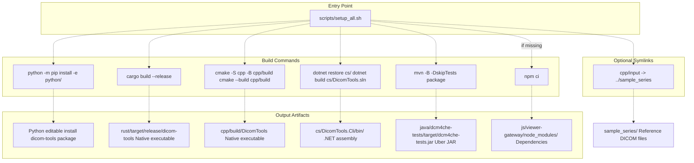
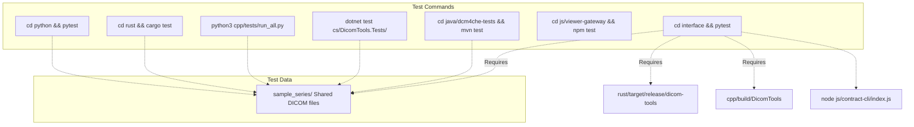
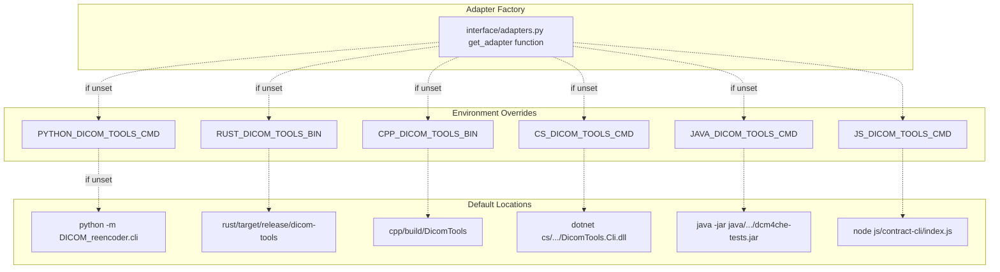

# 1b Installation and Setup

> **Relevant source files**
> * [.github/workflows/ci.yml](https://github.com/ThalesMMS/Dicom-Tools/blob/c7b4cbd8/.github/workflows/ci.yml)
> * [BUILD.md](https://github.com/ThalesMMS/Dicom-Tools/blob/c7b4cbd8/BUILD.md)
> * [README.md](https://github.com/ThalesMMS/Dicom-Tools/blob/c7b4cbd8/README.md)
> * [java/dcm4che-tests/pom.xml](https://github.com/ThalesMMS/Dicom-Tools/blob/c7b4cbd8/java/dcm4che-tests/pom.xml)
> * [scripts/setup_all.sh](https://github.com/ThalesMMS/Dicom-Tools/blob/c7b4cbd8/scripts/setup_all.sh)

This document provides step-by-step instructions for installing and building the Dicom-Tools multi-language toolkit. It covers system prerequisites, the one-shot setup script, individual language build processes, and environment variable configuration for runtime customization.

For architectural context on how these components interact, see [Architecture Overview](1a%20Architecture-Overview.md). For immediate usage examples after installation, see [Quick Start Guide](1c%20Quick-Start-Guide.md).

---

## Prerequisites by Language

The Dicom-Tools repository requires different toolchains for each language backend. The following table summarizes the minimum versions required:

| Language | Required Tools | Minimum Version | Notes |
| --- | --- | --- | --- |
| **Python** | `python3`, `pip` | Python 3.10+ | Core backend with 20+ commands |
| **Rust** | `cargo`, `rustc` | Rust 1.75+ | Stable toolchain recommended |
| **C++** | `cmake`, C++ compiler | CMake 3.15+, C++17 | GCC 7+ or Clang 6+ |
| **C#** | `dotnet` | .NET SDK 8.0+ | Can roll forward to .NET 10 with `DOTNET_ROLL_FORWARD=Major` |
| **Java** | `javac`, `mvn` | Java 17, Maven 3.6+ | Downloads dcm4che artifacts from dcm4che.org |
| **JavaScript** | `node`, `npm` | Node 18+ | For viewer-gateway and contract-cli |

**Sources:** [README.md L1-L43](https://github.com/ThalesMMS/Dicom-Tools/blob/c7b4cbd8/README.md#L1-L43)

 [BUILD.md L3-L8](https://github.com/ThalesMMS/Dicom-Tools/blob/c7b4cbd8/BUILD.md#L3-L8)

 [scripts/setup_all.sh L6-L7](https://github.com/ThalesMMS/Dicom-Tools/blob/c7b4cbd8/scripts/setup_all.sh#L6-L7)

---

## Setup Workflow and Artifact Locations



**Diagram: Build Artifact Generation Flow**

The setup process produces executable binaries or packages at predictable locations. The script [scripts/setup_all.sh L1-L60](https://github.com/ThalesMMS/Dicom-Tools/blob/c7b4cbd8/scripts/setup_all.sh#L1-L60)

 orchestrates all builds and creates a symbolic link from `cpp/input` to `sample_series/` for C++ test data access.

**Sources:** [scripts/setup_all.sh L1-L60](https://github.com/ThalesMMS/Dicom-Tools/blob/c7b4cbd8/scripts/setup_all.sh#L1-L60)

 [BUILD.md L10-L23](https://github.com/ThalesMMS/Dicom-Tools/blob/c7b4cbd8/BUILD.md#L10-L23)

---

## One-Shot Setup

The fastest way to install all backends is using the universal setup script:

```
./scripts/setup_all.sh
```

### What the Script Does

The script performs the following actions in sequence:

1. **Python**: Installs development dependencies from [python/requirements-dev.txt](https://github.com/ThalesMMS/Dicom-Tools/blob/c7b4cbd8/python/requirements-dev.txt)  and installs the `dicom-tools` package in editable mode
2. **Rust**: Builds the release binary with `cargo build --release`
3. **C++**: Configures CMake with `BUILD_TYPE` (defaults to `Release`) and builds the `DicomTools` executable
4. **C#**: Restores NuGet packages and builds [cs/DicomTools.sln](https://github.com/ThalesMMS/Dicom-Tools/blob/c7b4cbd8/cs/DicomTools.sln)
5. **Java**: Runs `mvn package` to create the uber JAR with all dcm4che dependencies
6. **JavaScript**: Installs npm dependencies for [js/viewer-gateway/](https://github.com/ThalesMMS/Dicom-Tools/blob/c7b4cbd8/js/viewer-gateway/)

### Customization Options

The script respects the following environment variables:

| Variable | Default | Purpose |
| --- | --- | --- |
| `PYTHON` | `python3` | Python interpreter to use |
| `BUILD_TYPE` | `Release` | CMake build type (`Debug` or `Release`) |

**Example:** Debug C++ build with Python 3.11:

```
PYTHON=python3.11 BUILD_TYPE=Debug ./scripts/setup_all.sh
```

**Sources:** [scripts/setup_all.sh L6-L60](https://github.com/ThalesMMS/Dicom-Tools/blob/c7b4cbd8/scripts/setup_all.sh#L6-L60)

 [README.md L27-L30](https://github.com/ThalesMMS/Dicom-Tools/blob/c7b4cbd8/README.md#L27-L30)

---

## Language-Specific Setup

If you only need specific backends, you can build them individually. This section provides the exact commands used by CI and the setup script.

### Python Backend

```
# Install development dependenciespython3 -m pip install -r python/requirements-dev.txt# Install package in editable modepython3 -m pip install -e python/
```

**Optional Extras:**

* `pip install python-gdcm` — GDCM bindings for advanced codec support
* `pip install SimpleITK` — ITK integration for volume processing
* `pip install dicom-numpy` — NumPy interoperability for pixel arrays

The Python backend installs a package named `dicom-tools` with the main CLI entry point at [python/DICOM_reencoder/cli.py](https://github.com/ThalesMMS/Dicom-Tools/blob/c7b4cbd8/python/DICOM_reencoder/cli.py)

**Sources:** [README.md L16](https://github.com/ThalesMMS/Dicom-Tools/blob/c7b4cbd8/README.md#L16-L16)

 [.github/workflows/ci.yml L15-L19](https://github.com/ThalesMMS/Dicom-Tools/blob/c7b4cbd8/.github/workflows/ci.yml#L15-L19)

 [scripts/setup_all.sh L18-L23](https://github.com/ThalesMMS/Dicom-Tools/blob/c7b4cbd8/scripts/setup_all.sh#L18-L23)

### Rust Backend

```
cd rust# Build release binarycargo build --release# Verify./target/release/dicom-tools --help
```

The compiled executable is located at [rust/target/release/dicom-tools](https://github.com/ThalesMMS/Dicom-Tools/blob/c7b4cbd8/rust/target/release/dicom-tools)

 You can also use `cargo run --release -- <args>` to build and run in one step.

**Sources:** [README.md L17](https://github.com/ThalesMMS/Dicom-Tools/blob/c7b4cbd8/README.md#L17-L17)

 [.github/workflows/ci.yml L33-L36](https://github.com/ThalesMMS/Dicom-Tools/blob/c7b4cbd8/.github/workflows/ci.yml#L33-L36)

 [scripts/setup_all.sh L25-L27](https://github.com/ThalesMMS/Dicom-Tools/blob/c7b4cbd8/scripts/setup_all.sh#L25-L27)

### C++ Backend

```sql
# Create build directorymkdir -p cpp/buildcd cpp/build# Configure CMakecmake -DCMAKE_BUILD_TYPE=Release ..# Buildcmake --build .# Result: cpp/build/DicomTools
```

**Optional:** Build external dependencies (DCMTK, GDCM, ITK, VTK) locally using `./scripts/build_deps.sh` if system packages are unavailable.

**Sources:** [README.md L18](https://github.com/ThalesMMS/Dicom-Tools/blob/c7b4cbd8/README.md#L18-L18)

 [.github/workflows/ci.yml L70-L73](https://github.com/ThalesMMS/Dicom-Tools/blob/c7b4cbd8/.github/workflows/ci.yml#L70-L73)

 [scripts/setup_all.sh L29-L38](https://github.com/ThalesMMS/Dicom-Tools/blob/c7b4cbd8/scripts/setup_all.sh#L29-L38)

### C# Backend

```
cd cs# Restore NuGet packagesdotnet restore# Build solution (CLI + Tests)dotnet build DicomTools.sln
```

The CLI executable is generated at [cs/DicomTools.Cli/bin/Debug/net8.0/DicomTools.Cli.dll](https://github.com/ThalesMMS/Dicom-Tools/blob/c7b4cbd8/cs/DicomTools.Cli/bin/Debug/net8.0/DicomTools.Cli.dll)

 (or `Release` depending on configuration).

**Note:** If only .NET 10 is installed, set `DOTNET_ROLL_FORWARD=Major` to allow the .NET 8 application to run.

**Sources:** [README.md L19](https://github.com/ThalesMMS/Dicom-Tools/blob/c7b4cbd8/README.md#L19-L19)

 [.github/workflows/ci.yml L48-L50](https://github.com/ThalesMMS/Dicom-Tools/blob/c7b4cbd8/.github/workflows/ci.yml#L48-L50)

 [scripts/setup_all.sh L40-L43](https://github.com/ThalesMMS/Dicom-Tools/blob/c7b4cbd8/scripts/setup_all.sh#L40-L43)

### Java Backend

```sql
cd java/dcm4che-tests# Run testsmvn test# Create uber JAR with all dependenciesmvn package
```

This produces [java/dcm4che-tests/target/dcm4che-tests.jar](https://github.com/ThalesMMS/Dicom-Tools/blob/c7b4cbd8/java/dcm4che-tests/target/dcm4che-tests.jar)

 with `com.dicomtools.cli.DicomToolsCli` as the main class. The Maven configuration downloads dcm4che artifacts from `https://www.dcm4che.org/maven2`.

**Sources:** [README.md L20](https://github.com/ThalesMMS/Dicom-Tools/blob/c7b4cbd8/README.md#L20-L20)

 [java/dcm4che-tests/pom.xml L1-L209](https://github.com/ThalesMMS/Dicom-Tools/blob/c7b4cbd8/java/dcm4che-tests/pom.xml#L1-L209)

 [scripts/setup_all.sh L45-L47](https://github.com/ThalesMMS/Dicom-Tools/blob/c7b4cbd8/scripts/setup_all.sh#L45-L47)

### JavaScript Viewer

```
cd js/viewer-gateway# Install dependencies (uses package-lock.json)npm ci# Development servernpm run dev# Production buildnpm run build# Run testsnpm test
```

The contract-cli shim requires no build step — it's a Node.js script that delegates to the Python backend by default. Override with `BACKING_CMD` environment variable.

**Sources:** [README.md L21](https://github.com/ThalesMMS/Dicom-Tools/blob/c7b4cbd8/README.md#L21-L21)

 [.github/workflows/ci.yml L85-L93](https://github.com/ThalesMMS/Dicom-Tools/blob/c7b4cbd8/.github/workflows/ci.yml#L85-L93)

 [scripts/setup_all.sh L49-L51](https://github.com/ThalesMMS/Dicom-Tools/blob/c7b4cbd8/scripts/setup_all.sh#L49-L51)

---

## Verification and Testing

After installation, verify each backend by running its test suite:



**Diagram: Test Suite Dependencies**

All tests use DICOM files from [sample_series/](https://github.com/ThalesMMS/Dicom-Tools/blob/c7b4cbd8/sample_series/)

 for consistency. The interface tests validate cross-language contract compliance and require multiple backends to be built.

### Quick Smoke Test

Execute a simple operation with each backend:

```
# Pythonpython -m DICOM_reencoder.cli info sample_series/IM-0001-0001.dcm# Rust./rust/target/release/dicom-tools info sample_series/IM-0001-0001.dcm# C++./cpp/build/DicomTools info -i sample_series/IM-0001-0001.dcm# C#dotnet cs/DicomTools.Cli/bin/Debug/net8.0/DicomTools.Cli.dll --op info --input sample_series/IM-0001-0001.dcm# Javajava -jar java/dcm4che-tests/target/dcm4che-tests.jar --op info --input sample_series/IM-0001-0001.dcm# JS (delegates to Python)node js/contract-cli/index.js --op info --input sample_series/IM-0001-0001.dcm --options '{}'
```

Each command should output DICOM metadata including Patient ID, Study Date, and Modality.

**Sources:** [README.md L32-L42](https://github.com/ThalesMMS/Dicom-Tools/blob/c7b4cbd8/README.md#L32-L42)

 [BUILD.md L24-L32](https://github.com/ThalesMMS/Dicom-Tools/blob/c7b4cbd8/BUILD.md#L24-L32)

---

## Environment Variable Configuration

The adapter layer uses environment variables to locate CLI executables at runtime. This allows flexible deployment without modifying code.

### Adapter Environment Variables



**Diagram: Adapter Resolution Logic**

The `get_adapter()` function in [interface/adapters.py](https://github.com/ThalesMMS/Dicom-Tools/blob/c7b4cbd8/interface/adapters.py)

 checks environment variables first, then falls back to default paths relative to the repository root.

### Configuration Reference

| Variable | Default | Example Override |
| --- | --- | --- |
| `PYTHON_DICOM_TOOLS_CMD` | `python -m DICOM_reencoder.cli` | `/usr/local/bin/dicom-tools` |
| `RUST_DICOM_TOOLS_BIN` | `rust/target/release/dicom-tools` | `/opt/dicom-tools/bin/dicom-tools` |
| `CPP_DICOM_TOOLS_BIN` | `cpp/build/DicomTools` | `/usr/local/bin/DicomTools` |
| `CS_DICOM_TOOLS_CMD` | `dotnet cs/...` | `dotnet /opt/dicom-tools/DicomTools.Cli.dll` |
| `JAVA_DICOM_TOOLS_CMD` | `java -jar java/...` | `java -jar /opt/dicom-tools/dcm4che-tests.jar` |
| `JS_DICOM_TOOLS_CMD` | `node js/contract-cli/index.js` | `node /opt/dicom-tools/contract-cli.js` |

### JavaScript Backend Delegation

The JavaScript contract-cli is unique — it's a shim that delegates to another backend (Python by default):

```
# Use Rust as backing implementationBACKING_CMD="rust/target/release/dicom-tools" node js/contract-cli/index.js --op info --input sample_series/IM-0001-0001.dcm
```

The `BACKING_CMD` environment variable specifies which CLI to invoke for actual DICOM processing.

**Sources:** [BUILD.md L34-L40](https://github.com/ThalesMMS/Dicom-Tools/blob/c7b4cbd8/BUILD.md#L34-L40)

 [README.md L21](https://github.com/ThalesMMS/Dicom-Tools/blob/c7b4cbd8/README.md#L21-L21)

 [.github/workflows/ci.yml L132-L136](https://github.com/ThalesMMS/Dicom-Tools/blob/c7b4cbd8/.github/workflows/ci.yml#L132-L136)

---

## Continuous Integration Reference

The GitHub Actions workflow at [.github/workflows/ci.yml](https://github.com/ThalesMMS/Dicom-Tools/blob/c7b4cbd8/.github/workflows/ci.yml)

 provides a canonical reference for building each backend in a clean environment. The CI pipeline tests:

* **Python**: pytest on core modules
* **Rust**: cargo test with stable toolchain
* **C++**: CMake configure + build (Release, no external deps)
* **C#**: dotnet test with .NET 8, roll-forward enabled
* **Java**: mvn test with JDK 17
* **JavaScript**: npm ci, build, and Vitest coverage
* **Interface**: Cross-language tests with Rust, C++, and JS backends

The interface job demonstrates how to set environment variables for multi-backend testing:

```yaml
env:  RUST_DICOM_TOOLS_BIN: rust/target/release/dicom-tools  CPP_DICOM_TOOLS_BIN: cpp/build/DicomTools  JS_DICOM_TOOLS_CMD: node js/contract-cli/index.js
```

**Sources:** [.github/workflows/ci.yml L1-L138](https://github.com/ThalesMMS/Dicom-Tools/blob/c7b4cbd8/.github/workflows/ci.yml#L1-L138)

 [BUILD.md L46-L47](https://github.com/ThalesMMS/Dicom-Tools/blob/c7b4cbd8/BUILD.md#L46-L47)

---

## Troubleshooting

### Common Issues

**Problem:** `ModuleNotFoundError: No module named 'DICOM_reencoder'` (Python)
**Solution:** Ensure you ran `pip install -e python/` from the repository root.

**Problem:** `cargo: command not found` (Rust)
**Solution:** Install Rust via [rustup.rs](https://rustup.rs) and ensure `~/.cargo/bin` is in your PATH.

**Problem:** `CMake Error: Could not find CMAKE_BUILD_TYPE` (C++)
**Solution:** Explicitly set build type: `cmake -DCMAKE_BUILD_TYPE=Release ..`

**Problem:** `The framework 'Microsoft.NETCore.App', version '8.0.0' was not found` (C#)
**Solution:** Install .NET 8 SDK or set `DOTNET_ROLL_FORWARD=Major` if using .NET 10+.

**Problem:** Maven downloads fail for dcm4che artifacts (Java)
**Solution:** The dcm4che repository at `https://www.dcm4che.org/maven2` may be temporarily unavailable. Check [java/dcm4che-tests/pom.xml L98-L109](https://github.com/ThalesMMS/Dicom-Tools/blob/c7b4cbd8/java/dcm4che-tests/pom.xml#L98-L109)

 for repository configuration.

**Problem:** Interface tests fail with "Backend not found" errors
**Solution:** Build required backends (Rust, C++) and set environment variables as shown in [.github/workflows/ci.yml L132-L136](https://github.com/ThalesMMS/Dicom-Tools/blob/c7b4cbd8/.github/workflows/ci.yml#L132-L136)

### Build Optimization

For faster C++ builds, use parallel jobs:

```
cmake --build cpp/build -- -j4  # 4 parallel jobs
```

For Rust, enable incremental compilation in development:

```
export CARGO_INCREMENTAL=1cargo build
```

**Sources:** [README.md L1-L43](https://github.com/ThalesMMS/Dicom-Tools/blob/c7b4cbd8/README.md#L1-L43)

 [BUILD.md L1-L48](https://github.com/ThalesMMS/Dicom-Tools/blob/c7b4cbd8/BUILD.md#L1-L48)


### On this page

* [Installation and Setup](#1.2-installation-and-setup)
* [Prerequisites by Language](#1.2-prerequisites-by-language)
* [Setup Workflow and Artifact Locations](#1.2-setup-workflow-and-artifact-locations)
* [One-Shot Setup](#1.2-one-shot-setup)
* [What the Script Does](#1.2-what-the-script-does)
* [Customization Options](#1.2-customization-options)
* [Language-Specific Setup](#1.2-language-specific-setup)
* [Python Backend](#1.2-python-backend)
* [Rust Backend](#1.2-rust-backend)
* [C++ Backend](#1.2-c-backend)
* [C# Backend](#1.2-c-backend-1)
* [Java Backend](#1.2-java-backend)
* [JavaScript Viewer](#1.2-javascript-viewer)
* [Verification and Testing](#1.2-verification-and-testing)
* [Quick Smoke Test](#1.2-quick-smoke-test)
* [Environment Variable Configuration](#1.2-environment-variable-configuration)
* [Adapter Environment Variables](#1.2-adapter-environment-variables)
* [Configuration Reference](#1.2-configuration-reference)
* [JavaScript Backend Delegation](#1.2-javascript-backend-delegation)
* [Continuous Integration Reference](#1.2-continuous-integration-reference)
* [Troubleshooting](#1.2-troubleshooting)
* [Common Issues](#1.2-common-issues)
* [Build Optimization](#1.2-build-optimization)

Ask Devin about Dicom-Tools