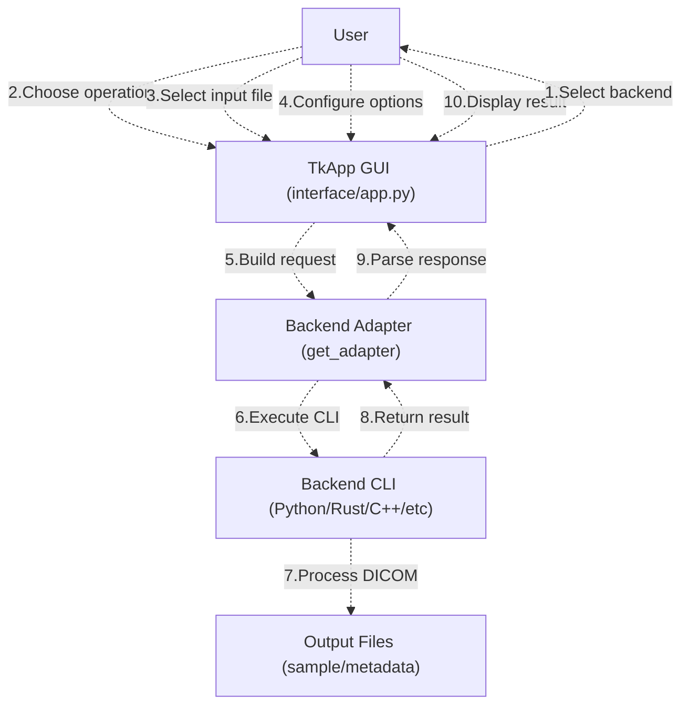
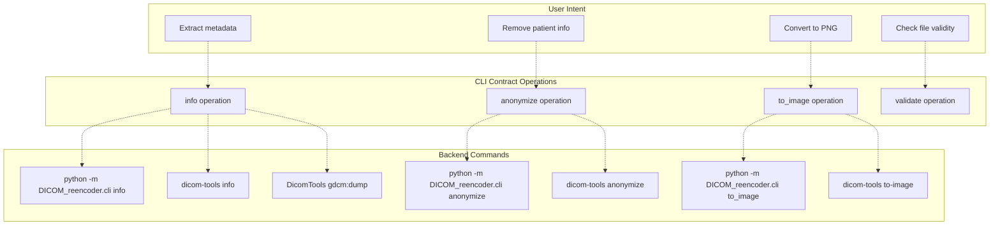
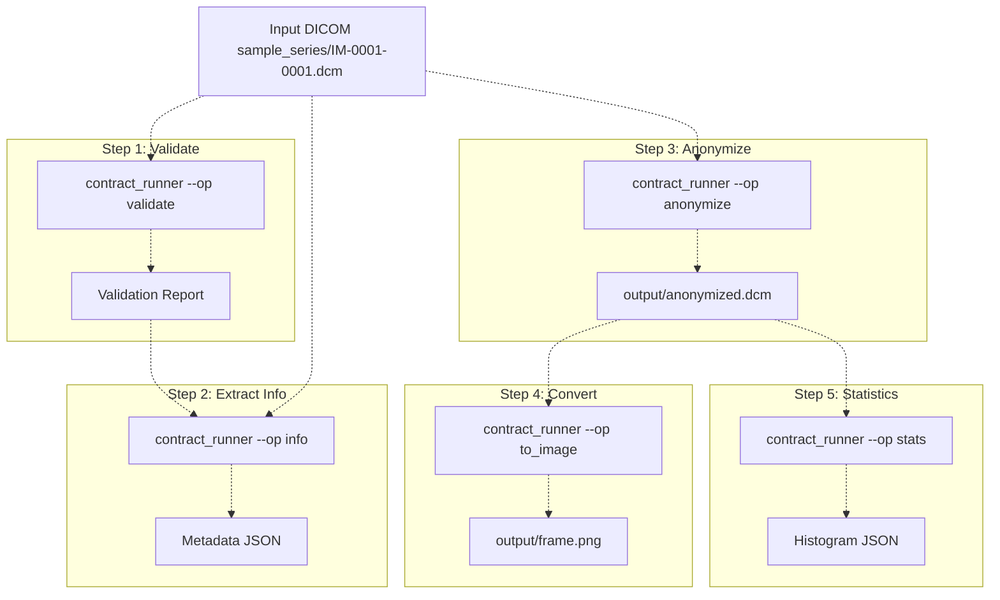

# 1c Quick Start Guide

> **Relevant source files**
> * [BUILD.md](https://github.com/ThalesMMS/Dicom-Tools/blob/c7b4cbd8/BUILD.md)
> * [README.md](https://github.com/ThalesMMS/Dicom-Tools/blob/c7b4cbd8/README.md)
> * [interface/adapters/cpp_cli.py](https://github.com/ThalesMMS/Dicom-Tools/blob/c7b4cbd8/interface/adapters/cpp_cli.py)
> * [interface/app.py](https://github.com/ThalesMMS/Dicom-Tools/blob/c7b4cbd8/interface/app.py)
> * [scripts/setup_all.sh](https://github.com/ThalesMMS/Dicom-Tools/blob/c7b4cbd8/scripts/setup_all.sh)

## Purpose and Scope

This guide provides immediate, hands-on examples for using Dicom-Tools to perform common DICOM operations. It demonstrates both the graphical interface (TkApp) and command-line usage (contract runner and direct backend access) with concrete examples and expected outputs.

For complete installation instructions, see [Installation and Setup](1b%20Installation-and-Setup.md). For detailed GUI features, see [TkApp Desktop GUI](2a%20TkApp-Desktop-GUI.md). For the underlying architecture, see [Architecture Overview](1a%20Architecture-Overview.md).

---

## Prerequisites

Before following this guide, ensure you have completed the installation:

```
# One-command setup./scripts/setup_all.sh
```

This builds all backends (Python, Rust, C++, C#, Java, JS) and installs dependencies. The script creates these key artifacts:

| Backend | Artifact Location | Environment Variable Override |
| --- | --- | --- |
| Python | Editable package installed | `PYTHON_DICOM_TOOLS_CMD` |
| Rust | `rust/target/release/dicom-tools` | `RUST_DICOM_TOOLS_BIN` |
| C++ | `cpp/build/DicomTools` | `CPP_DICOM_TOOLS_BIN` |
| C# | `cs/DicomTools.Cli/bin/` | `CS_DICOM_TOOLS_CMD` |
| Java | `java/dcm4che-tests/target/dcm4che-tests.jar` | `JAVA_DICOM_TOOLS_CMD` |
| JavaScript | `js/contract-cli/index.js` | `JS_DICOM_TOOLS_CMD` |

**Sources:** [scripts/setup_all.sh L1-L60](https://github.com/ThalesMMS/Dicom-Tools/blob/c7b4cbd8/scripts/setup_all.sh#L1-L60)

 [README.md L27-L31](https://github.com/ThalesMMS/Dicom-Tools/blob/c7b4cbd8/README.md#L27-L31)

---

## Quick Start with TkApp GUI

### Launching the GUI

The TkApp provides a unified graphical interface to all backends:

```
# From repository rootpython -m interface.app
```

This launches the Tkinter application defined in [interface/app.py L801-L878](https://github.com/ThalesMMS/Dicom-Tools/blob/c7b4cbd8/interface/app.py#L801-L878)

### Basic Workflow Diagram



**Sources:** [interface/app.py L801-L878](https://github.com/ThalesMMS/Dicom-Tools/blob/c7b4cbd8/interface/app.py#L801-L878)

### Step-by-Step Example: Extract Metadata

1. **Launch TkApp:** ``` python -m interface.app ```
2. **Configure the operation:** * Backend: Select `python` from dropdown [interface/app.py L816-L819](https://github.com/ThalesMMS/Dicom-Tools/blob/c7b4cbd8/interface/app.py#L816-L819) * Operation: Select `info` from operation list [interface/app.py L826-L829](https://github.com/ThalesMMS/Dicom-Tools/blob/c7b4cbd8/interface/app.py#L826-L829) * Input: Click "Browse" and select `sample_series/IM-0001-0001.dcm` [interface/app.py L831-L836](https://github.com/ThalesMMS/Dicom-Tools/blob/c7b4cbd8/interface/app.py#L831-L836) * Options: Leave as default `{"json": true}` [interface/app.py L845-L849](https://github.com/ThalesMMS/Dicom-Tools/blob/c7b4cbd8/interface/app.py#L845-L849)
3. **Execute:** * Click "Run" button [interface/app.py L856-L857](https://github.com/ThalesMMS/Dicom-Tools/blob/c7b4cbd8/interface/app.py#L856-L857) * The GUI invokes [interface/app.py L1166-L1194](https://github.com/ThalesMMS/Dicom-Tools/blob/c7b4cbd8/interface/app.py#L1166-L1194)  which calls the adapter
4. **View results:** * Result text area displays metadata [interface/app.py L863-L865](https://github.com/ThalesMMS/Dicom-Tools/blob/c7b4cbd8/interface/app.py#L863-L865) * Status label shows success/failure [interface/app.py L867-L869](https://github.com/ThalesMMS/Dicom-Tools/blob/c7b4cbd8/interface/app.py#L867-L869)

### Default Operation Configurations

TkApp provides pre-configured defaults for each backend and operation in the `DEFAULTS` dictionary [interface/app.py L330-L466](https://github.com/ThalesMMS/Dicom-Tools/blob/c7b4cbd8/interface/app.py#L330-L466)

 For example:

| Backend | Operation | Default Input | Default Output | Default Options |
| --- | --- | --- | --- | --- |
| python | info | `sample_series/IM-0001-0001.dcm` | (display) | `{"json": true}` |
| python | anonymize | `sample_series/IM-0001-0001.dcm` | `output/ui_python_anon.dcm` | `{}` |
| rust | to_image | `sample_series/IM-0001-0001.dcm` | `output/ui_rust.png` | `{"format": "png"}` |
| cpp | transcode | `sample_series/IM-0001-0001.dcm` | `output/cpp_transcode` | `{"syntax": "j2k"}` |

**Sources:** [interface/app.py L330-L466](https://github.com/ThalesMMS/Dicom-Tools/blob/c7b4cbd8/interface/app.py#L330-L466)

 [interface/app.py L856-L857](https://github.com/ThalesMMS/Dicom-Tools/blob/c7b4cbd8/interface/app.py#L856-L857)

 [interface/app.py L1166-L1194](https://github.com/ThalesMMS/Dicom-Tools/blob/c7b4cbd8/interface/app.py#L1166-L1194)

---

## Quick Start with CLI (Contract Runner)

### Command Structure

The contract runner provides headless execution of any operation across all backends:

```html
python -m interface.contract_runner \    --backend <backend> \    --op <operation> \    --input <path> \    [--output <path>] \    [--options '<json>']
```

The contract runner is implemented in [interface/contract_runner.py L1-L90](https://github.com/ThalesMMS/Dicom-Tools/blob/c7b4cbd8/interface/contract_runner.py#L1-L90)

 and uses the adapter factory [interface/adapters/__init__.py L1-L50](https://github.com/ThalesMMS/Dicom-Tools/blob/c7b4cbd8/interface/adapters/__init__.py#L1-L50)

### Operation to CLI Command Mapping



**Sources:** [interface/contract_runner.py L1-L90](https://github.com/ThalesMMS/Dicom-Tools/blob/c7b4cbd8/interface/contract_runner.py#L1-L90)

 [interface/adapters/__init__.py L1-L50](https://github.com/ThalesMMS/Dicom-Tools/blob/c7b4cbd8/interface/adapters/__init__.py#L1-L50)

### Example Commands

#### 1. Extract DICOM Metadata (Python Backend)

```
python -m interface.contract_runner \    --backend python \    --op info \    --input sample_series/IM-0001-0001.dcm \    --options '{"json": true}'
```

**Expected output:**

```
{  "ok": true,  "returncode": 0,  "metadata": {    "PatientName": "...",    "StudyInstanceUID": "...",    "Modality": "CT",    "Rows": 512,    "Columns": 512  }}
```

#### 2. Anonymize DICOM File (Rust Backend)

```
python -m interface.contract_runner \    --backend rust \    --op anonymize \    --input sample_series/IM-0001-0001.dcm \    --output output/anonymized.dcm
```

The Rust adapter [interface/adapters/rust_cli.py L1-L145](https://github.com/ThalesMMS/Dicom-Tools/blob/c7b4cbd8/interface/adapters/rust_cli.py#L1-L145)

 translates this to:

```
dicom-tools anonymize sample_series/IM-0001-0001.dcm -o output/anonymized.dcm
```

#### 3. Convert to PNG Image (Any Backend)

```css
# Python backendpython -m interface.contract_runner \    --backend python \    --op to_image \    --input sample_series/IM-0001-0001.dcm \    --output output/frame.png \    --options '{"format": "png", "frame": 0}'# Rust backend with windowingpython -m interface.contract_runner \    --backend rust \    --op to_image \    --input sample_series/IM-0001-0001.dcm \    --output output/windowed.png \    --options '{"format": "png", "window_center": 40, "window_width": 400}'
```

#### 4. Validate DICOM File (C# Backend)

```
python -m interface.contract_runner \    --backend csharp \    --op validate \    --input sample_series/IM-0001-0001.dcm
```

**Sources:** [interface/contract_runner.py L1-L90](https://github.com/ThalesMMS/Dicom-Tools/blob/c7b4cbd8/interface/contract_runner.py#L1-L90)

 [interface/adapters/rust_cli.py L1-L145](https://github.com/ThalesMMS/Dicom-Tools/blob/c7b4cbd8/interface/adapters/rust_cli.py#L1-L145)

 [interface/adapters/cpp_cli.py L1-L145](https://github.com/ThalesMMS/Dicom-Tools/blob/c7b4cbd8/interface/adapters/cpp_cli.py#L1-L145)

---

## Direct Backend Usage

For advanced users, each backend can be invoked directly without the contract layer. This provides access to backend-specific features not exposed through the contract.

### Python Backend Direct Access

```
# Info with JSON outputpython -m DICOM_reencoder.cli info sample_series/IM-0001-0001.dcm --json# Anonymizepython -m DICOM_reencoder.cli anonymize \    sample_series/IM-0001-0001.dcm \    output/anon.dcm# Convert to image with specific framepython -m DICOM_reencoder.cli to_image \    sample_series/IM-0001-0001.dcm \    output/frame.png \    --format png \    --frame 0# Reconstruct 3D volume from seriespython -m DICOM_reencoder.cli volume \    sample_series/ \    output/volume.npy \    --preview# Network echo testpython -m DICOM_reencoder.cli echo \    --host 127.0.0.1 \    --port 11112
```

**Sources:** [README.md L16](https://github.com/ThalesMMS/Dicom-Tools/blob/c7b4cbd8/README.md#L16-L16)

 [interface/adapters/python_cli.py L1-L200](https://github.com/ThalesMMS/Dicom-Tools/blob/c7b4cbd8/interface/adapters/python_cli.py#L1-L200)

### Rust Backend Direct Access

```
# Build first (if not already built)cd rust && cargo build --release# Info operation./target/release/dicom-tools info sample_series/IM-0001-0001.dcm --json# Anonymize./target/release/dicom-tools anonymize \    sample_series/IM-0001-0001.dcm \    -o output/anon.dcm# Convert to image with advanced options./target/release/dicom-tools to-image \    sample_series/IM-0001-0001.dcm \    --format png \    --window-center 40 \    --window-width 400 \    --output output/windowed.png# Export to DICOM JSON./target/release/dicom-tools to-json \    sample_series/IM-0001-0001.dcm \    -o output/metadata.json# Web server mode./target/release/dicom-tools web \    --host 127.0.0.1 \    --port 3000
```

**Sources:** [README.md L17](https://github.com/ThalesMMS/Dicom-Tools/blob/c7b4cbd8/README.md#L17-L17)

 [interface/adapters/rust_cli.py L19-L145](https://github.com/ThalesMMS/Dicom-Tools/blob/c7b4cbd8/interface/adapters/rust_cli.py#L19-L145)

### C++ Backend Direct Access

The C++ backend uses a module-based command structure [interface/adapters/cpp_cli.py L55-L144](https://github.com/ThalesMMS/Dicom-Tools/blob/c7b4cbd8/interface/adapters/cpp_cli.py#L55-L144)

:

```
# Build firstcd cpp && mkdir -p build && cd buildcmake -DCMAKE_BUILD_TYPE=Release .. && cmake --build .# GDCM operations./DicomTools gdcm:dump -i ../input/IM-0001-0001.dcm -o ../output./DicomTools gdcm:anonymize -i ../input/IM-0001-0001.dcm -o ../output./DicomTools gdcm:preview -i ../input/IM-0001-0001.dcm -o ../output./DicomTools gdcm:stats -i ../input/IM-0001-0001.dcm -o ../output# Transcode operations./DicomTools gdcm:transcode-j2k -i ../input/IM-0001-0001.dcm -o ../output./DicomTools gdcm:transcode-rle -i ../input/IM-0001-0001.dcm -o ../output# VTK visualization (requires series directory)./DicomTools vtk:export -i ../input -o ../output./DicomTools vtk:nifti -i ../input -o ../output./DicomTools vtk:volume-render -i ../input -o ../output./DicomTools vtk:mpr-multi -i ../input -o ../output
```

**Sources:** [README.md L18](https://github.com/ThalesMMS/Dicom-Tools/blob/c7b4cbd8/README.md#L18-L18)

 [interface/adapters/cpp_cli.py L55-L144](https://github.com/ThalesMMS/Dicom-Tools/blob/c7b4cbd8/interface/adapters/cpp_cli.py#L55-L144)

### C# Backend Direct Access

```
# Build firstcd cs && dotnet build DicomTools.sln# Run CLIdotnet cs/DicomTools.Cli/bin/Debug/net8.0/DicomTools.Cli.dll \    --op info \    --input sample_series/IM-0001-0001.dcm \    --jsondotnet cs/DicomTools.Cli/bin/Debug/net8.0/DicomTools.Cli.dll \    --op anonymize \    --input sample_series/IM-0001-0001.dcm \    --output output/anon.dcm# Network operationsdotnet cs/DicomTools.Cli/bin/Debug/net8.0/DicomTools.Cli.dll \    --op echo \    --host 127.0.0.1 \    --port 11112
```

**Sources:** [README.md L19](https://github.com/ThalesMMS/Dicom-Tools/blob/c7b4cbd8/README.md#L19-L19)

 [interface/adapters/csharp_cli.py L1-L150](https://github.com/ThalesMMS/Dicom-Tools/blob/c7b4cbd8/interface/adapters/csharp_cli.py#L1-L150)

### Java Backend Direct Access

```
# Build firstcd java/dcm4che-tests && mvn package# Run CLIjava -jar target/dcm4che-tests.jar \    --op info \    --input ../../sample_series/IM-0001-0001.dcm \    --jsonjava -jar target/dcm4che-tests.jar \    --op anonymize \    --input ../../sample_series/IM-0001-0001.dcm \    --output ../../output/anon.dcm
```

**Sources:** [README.md L20](https://github.com/ThalesMMS/Dicom-Tools/blob/c7b4cbd8/README.md#L20-L20)

 [interface/adapters/java_cli.py L1-L150](https://github.com/ThalesMMS/Dicom-Tools/blob/c7b4cbd8/interface/adapters/java_cli.py#L1-L150)

---

## Common Operation Examples

### Operation Support Matrix

The following table shows which operations are supported by each backend:

| Operation | Python | Rust | C++ | C# | Java | JS |
| --- | --- | --- | --- | --- | --- | --- |
| info | ✓ | ✓ | ✓ | ✓ | ✓ | ✓ |
| anonymize | ✓ | ✓ | ✓ | ✓ | ✓ | ✓ |
| to_image | ✓ | ✓ | ✓ | ✓ | ✓ | ✓ |
| transcode | ✓ | ✓ | ✓ | ✓ | ✓ | ✓ |
| validate | ✓ | ✓ | ✓ | ✓ | ✓ | ✓ |
| stats | ✓ | ✓ | ✓ | ✓ | ✓ | ✓ |
| dump | ✓ | ✓ | ✓ | ✓ | ✓ | ✓ |
| volume | ✓ | - | - | - | - | ✓(shim) |
| nifti | ✓ | - | - | - | - | ✓(shim) |
| echo | ✓ | ✓ | - | ✓ | ✓ | ✓(shim) |
| histogram | - | ✓ | - | ✓ | ✓ | - |
| store_scu | - | - | - | ✓ | ✓ | - |
| qido/stow/wado | - | ✓ | - | ✓ | ✓ | - |
| vtk_* | - | - | ✓ | - | - | - |

**Sources:** [interface/app.py L17-L129](https://github.com/ThalesMMS/Dicom-Tools/blob/c7b4cbd8/interface/app.py#L17-L129)

### 1. Extract and Display Metadata

```css
# Using contract runner (Python backend)python -m interface.contract_runner \    --backend python \    --op info \    --input sample_series/IM-0001-0001.dcm \    --options '{"json": true}'# Direct Python CLIpython -m DICOM_reencoder.cli info sample_series/IM-0001-0001.dcm --json
```

**Expected JSON output structure:**

```
{  "PatientName": "ANON^PATIENT",  "PatientID": "12345",  "StudyInstanceUID": "1.2.840...",  "SeriesInstanceUID": "1.2.840...",  "SOPInstanceUID": "1.2.840...",  "Modality": "CT",  "Rows": 512,  "Columns": 512,  "BitsAllocated": 16,  "BitsStored": 12}
```

### 2. Anonymize Patient Data

```
# Using contract runner (Rust backend)python -m interface.contract_runner \    --backend rust \    --op anonymize \    --input sample_series/IM-0001-0001.dcm \    --output output/anonymized.dcm
```

This operation removes Protected Health Information (PHI) including:

* PatientName → "ANONYMOUS"
* PatientID → random UID
* Study/Series/Instance UIDs → regenerated
* Dates → shifted or removed

### 3. Convert DICOM to Image

```css
# PNG export (Python)python -m interface.contract_runner \    --backend python \    --op to_image \    --input sample_series/IM-0001-0001.dcm \    --output output/frame.png \    --options '{"format": "png", "frame": 0}'# With windowing (Rust)python -m interface.contract_runner \    --backend rust \    --op to_image \    --input sample_series/IM-0001-0001.dcm \    --output output/windowed.png \    --options '{"format": "png", "window_center": 40, "window_width": 400}'
```

The output image files are written to the specified path. The Rust backend supports additional windowing options [interface/app.py L706-L721](https://github.com/ThalesMMS/Dicom-Tools/blob/c7b4cbd8/interface/app.py#L706-L721)

### 4. Transcode Transfer Syntax

```css
# Convert to JPEG 2000 (Python)python -m interface.contract_runner \    --backend python \    --op transcode \    --input sample_series/IM-0001-0001.dcm \    --output output/j2k.dcm \    --options '{"syntax": "1.2.840.10008.1.2.4.90"}'# Convert to RLE (C++)python -m interface.contract_runner \    --backend cpp \    --op transcode \    --input sample_series/IM-0001-0001.dcm \    --output output/rle_dir \    --options '{"syntax": "rle"}'
```

Common transfer syntax options:

* `"explicit"` - Explicit VR Little Endian
* `"1.2.840.10008.1.2.4.90"` - JPEG 2000 Lossless
* `"j2k"` or `"jpeg2000"` - JPEG 2000 (C++ backend)
* `"rle"` - RLE Lossless

### 5. Validate DICOM Conformance

```
# Basic validation (all backends)python -m interface.contract_runner \    --backend python \    --op validate \    --input sample_series/IM-0001-0001.dcm
```

**Expected output:**

```
Valid DICOM file
File Meta Information Version: 00 01
Transfer Syntax: 1.2.840.10008.1.2.1
```

### 6. Calculate Pixel Statistics

```css
# Histogram with 16 bins (Python)python -m interface.contract_runner \    --backend python \    --op stats \    --input sample_series/IM-0001-0001.dcm \    --options '{"bins": 16}'# Detailed stats (Rust)python -m interface.contract_runner \    --backend rust \    --op stats \    --input sample_series/IM-0001-0001.dcm
```

**Expected output:**

```
{  "min": -1024,  "max": 3071,  "mean": 145.3,  "stddev": 234.5,  "histogram": [12, 45, 123, ...]}
```

### 7. Reconstruct 3D Volume

```sql
# Create NumPy volume (Python)python -m interface.contract_runner \    --backend python \    --op volume \    --input sample_series/ \    --output output/volume.npy \    --options '{"preview": true}'# Export to NIfTI (Python)python -m interface.contract_runner \    --backend python \    --op nifti \    --input sample_series/ \    --output output/volume.nii.gz
```

The `volume` operation produces:

* `volume.npy` - 3D NumPy array (Z, Y, X)
* `metadata.json` - affine matrix and spacing information

**Sources:** [interface/app.py L330-L466](https://github.com/ThalesMMS/Dicom-Tools/blob/c7b4cbd8/interface/app.py#L330-L466)

 [interface/adapters/python_cli.py L1-L200](https://github.com/ThalesMMS/Dicom-Tools/blob/c7b4cbd8/interface/adapters/python_cli.py#L1-L200)

---

## Common Workflows

### Complete Workflow: Process and Visualize



**Implementation:**

```python
#!/bin/bashINPUT="sample_series/IM-0001-0001.dcm"BACKEND="python"# 1. Validatepython -m interface.contract_runner \    --backend $BACKEND --op validate --input $INPUT# 2. Extract metadatapython -m interface.contract_runner \    --backend $BACKEND --op info --input $INPUT \    --options '{"json": true}' > output/metadata.json# 3. Anonymizepython -m interface.contract_runner \    --backend $BACKEND --op anonymize --input $INPUT \    --output output/anonymized.dcm# 4. Convert to PNGpython -m interface.contract_runner \    --backend $BACKEND --op to_image \    --input output/anonymized.dcm \    --output output/frame.png \    --options '{"format": "png"}'# 5. Calculate statisticspython -m interface.contract_runner \    --backend $BACKEND --op stats \    --input output/anonymized.dcm \    --options '{"bins": 16}' > output/stats.json
```

**Sources:** [interface/contract_runner.py L1-L90](https://github.com/ThalesMMS/Dicom-Tools/blob/c7b4cbd8/interface/contract_runner.py#L1-L90)

 [interface/app.py L330-L466](https://github.com/ThalesMMS/Dicom-Tools/blob/c7b4cbd8/interface/app.py#L330-L466)

---

## Troubleshooting

### Backend Not Found

If you get errors about missing backends:

```python
# Verify Python installationpython -c "import DICOM_reencoder; print(DICOM_reencoder.__file__)"# Verify Rust binaryls -l rust/target/release/dicom-tools# Verify C++ binaryls -l cpp/build/DicomTools# Override with environment variables if neededexport RUST_DICOM_TOOLS_BIN=/custom/path/to/dicom-toolsexport CPP_DICOM_TOOLS_BIN=/custom/path/to/DicomTools
```

### Sample Data Not Found

The repository includes sample DICOM files in `sample_series/`:

```
# Verify sample data existsls -l sample_series/IM-0001-0001.dcm# If missing, the folder should contain test DICOM files# You can use your own DICOM files by providing custom paths
```

### Operation Not Supported

Check the operation support matrix above. Not all backends implement all operations. For example:

* VTK operations (`vtk_*`) are C++ only [interface/adapters/cpp_cli.py L95-L114](https://github.com/ThalesMMS/Dicom-Tools/blob/c7b4cbd8/interface/adapters/cpp_cli.py#L95-L114)
* Volume/NIfTI are Python only (JS delegates to Python) [interface/app.py L128-L129](https://github.com/ThalesMMS/Dicom-Tools/blob/c7b4cbd8/interface/app.py#L128-L129)
* DICOMweb operations are Rust/C#/Java only [interface/app.py L98-L127](https://github.com/ThalesMMS/Dicom-Tools/blob/c7b4cbd8/interface/app.py#L98-L127)

**Sources:** [interface/adapters/cpp_cli.py L1-L145](https://github.com/ThalesMMS/Dicom-Tools/blob/c7b4cbd8/interface/adapters/cpp_cli.py#L1-L145)

 [interface/adapters/python_cli.py L1-L200](https://github.com/ThalesMMS/Dicom-Tools/blob/c7b4cbd8/interface/adapters/python_cli.py#L1-L200)

 [interface/app.py L17-L129](https://github.com/ThalesMMS/Dicom-Tools/blob/c7b4cbd8/interface/app.py#L17-L129)

---

## Next Steps

Now that you've completed the quick start:

* **For GUI usage:** See [TkApp Desktop GUI](2a%20TkApp-Desktop-GUI.md) for complete feature documentation
* **For CLI automation:** See [Contract Runner](2b%20Contract-Runner-%28Headless-CLI%29.md) for headless scripting
* **For web viewing:** See [Web Viewer (JavaScript)](2c%20Web-Viewer-%28JavaScript%29.md) for browser-based visualization
* **For specific operations:** See [DICOM Operations](5%20DICOM-Operations.md) for comprehensive operation reference
* **For backend details:** See [Language Implementations](4%20Language-Implementations.md) for language-specific features
* **For development:** See [Development](8%20Development.md) for contribution guidelines

**Sources:** [README.md L1-L43](https://github.com/ThalesMMS/Dicom-Tools/blob/c7b4cbd8/README.md#L1-L43)

 [BUILD.md L1-L48](https://github.com/ThalesMMS/Dicom-Tools/blob/c7b4cbd8/BUILD.md#L1-L48)


### On this page

* [Quick Start Guide](#1.3-quick-start-guide)
* [Purpose and Scope](#1.3-purpose-and-scope)
* [Prerequisites](#1.3-prerequisites)
* [Quick Start with TkApp GUI](#1.3-quick-start-with-tkapp-gui)
* [Launching the GUI](#1.3-launching-the-gui)
* [Basic Workflow Diagram](#1.3-basic-workflow-diagram)
* [Step-by-Step Example: Extract Metadata](#1.3-step-by-step-example-extract-metadata)
* [Default Operation Configurations](#1.3-default-operation-configurations)
* [Quick Start with CLI (Contract Runner)](#1.3-quick-start-with-cli-contract-runner)
* [Command Structure](#1.3-command-structure)
* [Operation to CLI Command Mapping](#1.3-operation-to-cli-command-mapping)
* [Example Commands](#1.3-example-commands)
* [Direct Backend Usage](#1.3-direct-backend-usage)
* [Python Backend Direct Access](#1.3-python-backend-direct-access)
* [Rust Backend Direct Access](#1.3-rust-backend-direct-access)
* [C++ Backend Direct Access](#1.3-c-backend-direct-access)
* [C# Backend Direct Access](#1.3-c-backend-direct-access-1)
* [Java Backend Direct Access](#1.3-java-backend-direct-access)
* [Common Operation Examples](#1.3-common-operation-examples)
* [Operation Support Matrix](#1.3-operation-support-matrix)
* [1. Extract and Display Metadata](#1.3-1-extract-and-display-metadata)
* [2. Anonymize Patient Data](#1.3-2-anonymize-patient-data)
* [3. Convert DICOM to Image](#1.3-3-convert-dicom-to-image)
* [4. Transcode Transfer Syntax](#1.3-4-transcode-transfer-syntax)
* [5. Validate DICOM Conformance](#1.3-5-validate-dicom-conformance)
* [6. Calculate Pixel Statistics](#1.3-6-calculate-pixel-statistics)
* [7. Reconstruct 3D Volume](#1.3-7-reconstruct-3d-volume)
* [Common Workflows](#1.3-common-workflows)
* [Complete Workflow: Process and Visualize](#1.3-complete-workflow-process-and-visualize)
* [Troubleshooting](#1.3-troubleshooting)
* [Backend Not Found](#1.3-backend-not-found)
* [Sample Data Not Found](#1.3-sample-data-not-found)
* [Operation Not Supported](#1.3-operation-not-supported)
* [Next Steps](#1.3-next-steps)

Ask Devin about Dicom-Tools