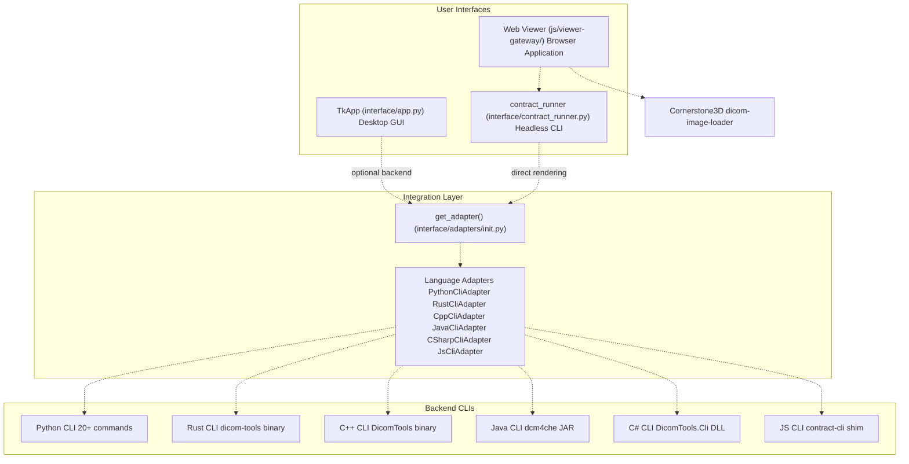
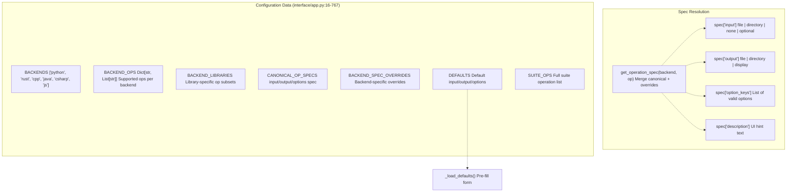
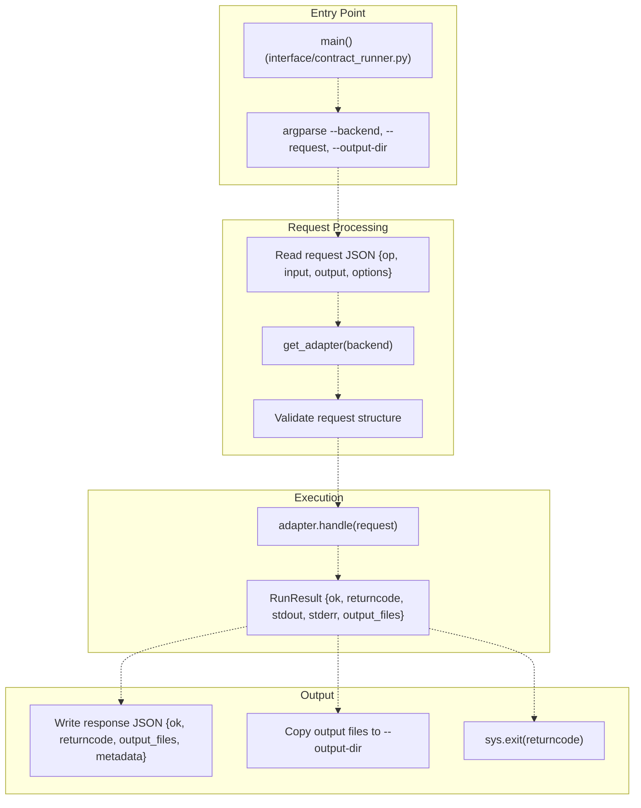
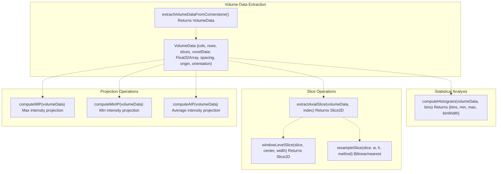
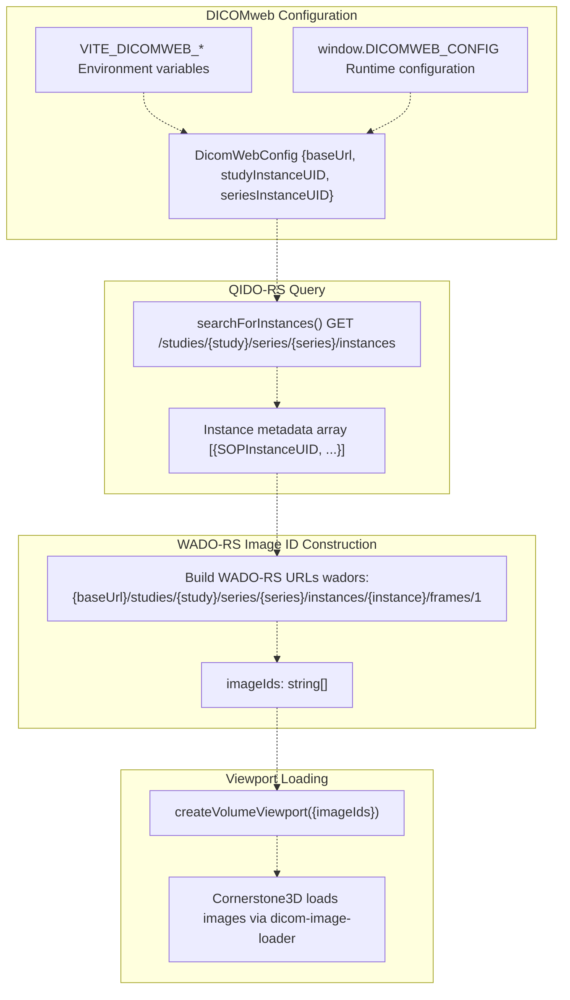

# 2 User Interfaces

> **Relevant source files**
> * [interface/adapters/cpp_cli.py](https://github.com/ThalesMMS/Dicom-Tools/blob/c7b4cbd8/interface/adapters/cpp_cli.py)
> * [interface/app.py](https://github.com/ThalesMMS/Dicom-Tools/blob/c7b4cbd8/interface/app.py)
> * [js/viewer-gateway/src/main.ts](https://github.com/ThalesMMS/Dicom-Tools/blob/c7b4cbd8/js/viewer-gateway/src/main.ts)
> * [js/viewer-gateway/tests/main.entry.test.ts](https://github.com/ThalesMMS/Dicom-Tools/blob/c7b4cbd8/js/viewer-gateway/tests/main.entry.test.ts)
> * [python/screenshots/ui.png](https://github.com/ThalesMMS/Dicom-Tools/blob/c7b4cbd8/python/screenshots/ui.png)

This document describes the three primary user interfaces provided by Dicom-Tools: the TkApp desktop GUI, the contract runner for headless CLI execution, and the browser-based web viewer. Each interface serves different use cases while sharing the same underlying backend infrastructure through the CLI contract system.

For detailed information about specific interface implementations, see [TkApp Desktop GUI](2a%20TkApp-Desktop-GUI.md), [Contract Runner (Headless CLI)](2b%20Contract-Runner-%28Headless-CLI%29.md), and [Web Viewer (JavaScript)](2c%20Web-Viewer-%28JavaScript%29.md). For information about the CLI contract system that enables cross-language interoperability, see [CLI Contract System](3%20CLI-Contract-System.md).

---

## Interface Architecture Overview

The Dicom-Tools repository provides three distinct user interfaces, each designed for different workflows and deployment scenarios:



**Sources:** [interface/app.py L1-L20](https://github.com/ThalesMMS/Dicom-Tools/blob/c7b4cbd8/interface/app.py#L1-L20)

 [js/viewer-gateway/src/main.ts L1-L18](https://github.com/ThalesMMS/Dicom-Tools/blob/c7b4cbd8/js/viewer-gateway/src/main.ts#L1-L18)

---

## Interface Comparison Matrix

| Feature | TkApp GUI | Contract Runner | Web Viewer |
| --- | --- | --- | --- |
| **Interface Type** | Desktop (Tkinter) | Command-line | Browser (HTML5) |
| **Primary Use Case** | Interactive exploration | Scripting/automation | Medical image viewing |
| **Backend Selection** | All 6 languages | All 6 languages | Independent (Cornerstone3D) |
| **Operation Coverage** | All operations | All operations | Visualization only |
| **Input Method** | File browser dialogs | JSON request files | URL/DICOMweb |
| **Output Display** | Text + image preview | stdout/stderr | GPU-accelerated viewport |
| **Batch Processing** | Suite runner | Native | N/A |
| **Network Operations** | Supported | Supported | DICOMweb client |
| **3D Visualization** | Limited preview | No | Full MPR/MIP/volume render |

**Sources:** [interface/app.py L9-L129](https://github.com/ThalesMMS/Dicom-Tools/blob/c7b4cbd8/interface/app.py#L9-L129)

 [js/viewer-gateway/src/main.ts L1-L491](https://github.com/ThalesMMS/Dicom-Tools/blob/c7b4cbd8/js/viewer-gateway/src/main.ts#L1-L491)

---

## TkApp Desktop GUI

The `TkApp` class provides a graphical user interface built with Python's Tkinter library. It serves as a universal frontend for testing and demonstrating all backend implementations and operations.

### TkApp Component Architecture

```mermaid
flowchart TD

Root["tk.Tk root Main window"]
Form["_build_form() UI layout construction"]
BackendSelector["backend: ttk.Combobox BACKENDS list"]
LibrarySelector["library: ttk.Combobox BACKEND_LIBRARIES"]
OperationSelector["operation: ttk.Combobox BACKEND_OPS"]
InputControls["input_entry + input_browse_btn File/directory selection"]
OutputControls["output_entry + output_browse_btn Output path selection"]
OptionsText["options_text: tk.Text JSON options editor"]
RunButton["run_button _run() handler"]
SuiteButton["Run full suite _run_suite() handler"]
ResultDisplay["result_text: tk.Text _render_result()"]
PreviewLabel["preview_label Image preview (PIL)"]
StatusVar["status_var Status message"]
UpdateOps["_update_operations() Populate operation list"]
OnOpChange["_on_operation_change() Load spec + defaults"]
LoadDefaults["_load_defaults() Fill DEFAULTS[backend][op]"]
BrowseInput["_browse_input() filedialog.askopenfilename()"]
BrowseOutput["_browse_output() filedialog.asksaveasfilename()"]
Run["_run() Single operation"]
RunSuite["_run_suite() SUITE_OPS loop"]
RequireInput["_require_input() Validation"]
NormalizeOutput["_normalize_output() Path resolution"]
GetAdapter["get_adapter(backend) Adapter factory"]
HandleRequest["adapter.handle(request) CLI execution"]
RenderResult["_render_result(result) Display output"]

BackendSelector -.-> UpdateOps
LibrarySelector -.-> UpdateOps
OperationSelector -.-> OnOpChange
InputControls -.-> BrowseInput
OutputControls -.-> BrowseOutput
RunButton -.-> Run
SuiteButton -.-> RunSuite
RenderResult -.-> ResultDisplay
RenderResult -.-> PreviewLabel

subgraph subGraph2 ["Execution Flow"]
    Run
    RunSuite
    RequireInput
    NormalizeOutput
    GetAdapter
    HandleRequest
    RenderResult
    Run -.-> RequireInput
    Run -.-> NormalizeOutput
    Run -.-> GetAdapter
    GetAdapter -.-> HandleRequest
    HandleRequest -.-> RenderResult
end

subgraph subGraph1 ["Event Handlers"]
    UpdateOps
    OnOpChange
    LoadDefaults
    BrowseInput
    BrowseOutput
    OnOpChange -.-> LoadDefaults
end

subgraph subGraph0 ["TkApp Class (interface/app.py:801-1298)"]
    Root
    Form
    BackendSelector
    LibrarySelector
    OperationSelector
    InputControls
    OutputControls
    OptionsText
    RunButton
    SuiteButton
    ResultDisplay
    PreviewLabel
    StatusVar
    Root -.-> Form
    Form -.-> BackendSelector
    Form -.-> LibrarySelector
    Form -.-> OperationSelector
    Form -.-> InputControls
    Form -.-> OutputControls
    Form -.-> OptionsText
    Form -.-> RunButton
    Form -.-> SuiteButton
    Form -.-> ResultDisplay
    Form -.-> PreviewLabel
    Form -.-> StatusVar
end
```



**Sources:** [interface/app.py L801-L1298](https://github.com/ThalesMMS/Dicom-Tools/blob/c7b4cbd8/interface/app.py#L801-L1298)

### TkApp Operation Configuration

The GUI dynamically configures itself based on operation specifications defined in `CANONICAL_OP_SPECS` and `BACKEND_SPEC_OVERRIDES`:



**Sources:** [interface/app.py L16-L767](https://github.com/ThalesMMS/Dicom-Tools/blob/c7b4cbd8/interface/app.py#L16-L767)

 [interface/app.py L779-L798](https://github.com/ThalesMMS/Dicom-Tools/blob/c7b4cbd8/interface/app.py#L779-L798)

### Key TkApp Methods

| Method | Line Range | Purpose |
| --- | --- | --- |
| `__init__()` | [interface/app.py L802-L807](https://github.com/ThalesMMS/Dicom-Tools/blob/c7b4cbd8/interface/app.py#L802-L807) | Initialize root window and build form |
| `_build_form()` | [interface/app.py L809-L878](https://github.com/ThalesMMS/Dicom-Tools/blob/c7b4cbd8/interface/app.py#L809-L878) | Construct all UI widgets and layout |
| `_update_operations()` | [interface/app.py L906-L909](https://github.com/ThalesMMS/Dicom-Tools/blob/c7b4cbd8/interface/app.py#L906-L909) | Refresh operation list when backend changes |
| `_on_operation_change()` | [interface/app.py L945-L980](https://github.com/ThalesMMS/Dicom-Tools/blob/c7b4cbd8/interface/app.py#L945-L980) | Update UI hints and defaults for selected operation |
| `_load_defaults()` | [interface/app.py L982-L997](https://github.com/ThalesMMS/Dicom-Tools/blob/c7b4cbd8/interface/app.py#L982-L997) | Pre-fill input/output/options from `DEFAULTS` |
| `_run()` | [interface/app.py L1083-L1147](https://github.com/ThalesMMS/Dicom-Tools/blob/c7b4cbd8/interface/app.py#L1083-L1147) | Execute single operation via adapter |
| `_run_suite()` | [interface/app.py L1149-L1216](https://github.com/ThalesMMS/Dicom-Tools/blob/c7b4cbd8/interface/app.py#L1149-L1216) | Execute all operations in `SUITE_OPS` |
| `_render_result()` | [interface/app.py L1218-L1273](https://github.com/ThalesMMS/Dicom-Tools/blob/c7b4cbd8/interface/app.py#L1218-L1273) | Display result text and image preview |
| `_preview_image()` | [interface/app.py L1275-L1298](https://github.com/ThalesMMS/Dicom-Tools/blob/c7b4cbd8/interface/app.py#L1275-L1298) | Load and display output image files |

**Sources:** [interface/app.py L801-L1298](https://github.com/ThalesMMS/Dicom-Tools/blob/c7b4cbd8/interface/app.py#L801-L1298)

---

## Contract Runner (Headless CLI)

The contract runner (`contract_runner.py`) provides a headless, scriptable interface that reads JSON request files and executes operations without user interaction. This enables automation, CI/CD integration, and batch processing.

### Contract Runner Architecture



**Sources:** [interface/contract_runner.py L1-L150](https://github.com/ThalesMMS/Dicom-Tools/blob/c7b4cbd8/interface/contract_runner.py#L1-L150)

 (inferred from adapter structure)

### Request/Response Format

The contract runner expects JSON request files with the following structure:

**Request Format:**

```
{  "op": "anonymize",  "input": "/path/to/input.dcm",  "output": "/path/to/output.dcm",  "options": {    "regenerate_uids": true  }}
```

**Response Format:**

```
{  "ok": true,  "returncode": 0,  "output_files": ["/path/to/output.dcm"],  "metadata": {    "backend": "python",    "operation": "anonymize",    "timing": 0.123  },  "stdout": "...",  "stderr": ""}
```

For complete specification details, see [Contract Specification](3a%20Contract-Specification.md).

**Sources:** [interface/adapters/runner.py L1-L100](https://github.com/ThalesMMS/Dicom-Tools/blob/c7b4cbd8/interface/adapters/runner.py#L1-L100)

 (inferred)

---

## Web Viewer (JavaScript)

The web viewer is a standalone browser application built with Cornerstone3D that provides advanced medical image visualization without requiring backend CLI execution. It operates independently but can optionally integrate with the contract CLI for preprocessing.

### Web Viewer Component Architecture

```mermaid
flowchart TD

Bootstrap["bootstrap() Entry point"]
CreateControls["createControls() UI controls"]
CreateViewports["createViewportSection() Viewport containers"]
CreateAnalysis["createAnalysisSection() Analysis tools"]
BuildImageIds["buildImageIds(baseUrl, count) WADO-URI image IDs"]
CreateStack["createStackViewer({element, imageIds}) 2D stack viewport"]
CreateVolume["createVolumeViewport({element, imageIds, mode}) 3D volume viewport"]
SetVOI["stackHandle.setVOI(center, width)"]
SetOrientation["volumeHandle.setOrientation(orientation)"]
SetBlendMode["volumeHandle.setBlendMode(mode)"]
SetSlabThickness["volumeHandle.setSlabThickness(slab)"]
FetchImageIds["fetchDicomWebImageIds(config) QIDO-RS + WADO-RS"]
DicomWebClient["dicomweb-client DICOMwebClient"]
SearchInstances["searchForInstances()"]
BuildWadoRsUrls["Build WADO-RS image IDs"]
ExtractVolume["extractVolumeDataFromCornerstone() Get voxel data"]
ComputeMIP["computeMIP(volumeData)"]
ComputeMinIP["computeMinIP(volumeData)"]
ComputeAIP["computeAIP(volumeData)"]
ComputeHistogram["computeHistogram(volumeData, bins)"]
ResampleSlice["resampleSlice(slice, w, h, method)"]
WindowLevelSlice["windowLevelSlice(slice, center, width)"]
Cornerstone3D["Cornerstone3D v4 @cornerstonejs/core"]
ImageLoader["dicom-image-loader DICOM parsing"]
VTKjs["vtk.js 3D visualization"]

CreateViewports -.-> BuildImageIds
CreateControls -.-> SetVOI
CreateControls -.-> SetOrientation
CreateControls -.-> SetBlendMode
CreateControls -.-> SetSlabThickness
CreateControls -.-> FetchImageIds
BuildWadoRsUrls -.-> CreateVolume
CreateAnalysis -.-> ExtractVolume
CreateStack -.-> Cornerstone3D
CreateVolume -.-> Cornerstone3D

subgraph subGraph4 ["Rendering Engine"]
    Cornerstone3D
    ImageLoader
    VTKjs
    Cornerstone3D -.-> ImageLoader
    Cornerstone3D -.-> VTKjs
end

subgraph subGraph3 ["CPU Analysis (js/viewer-gateway/src/volumeUtils.ts)"]
    ExtractVolume
    ComputeMIP
    ComputeMinIP
    ComputeAIP
    ComputeHistogram
    ResampleSlice
    WindowLevelSlice
    ExtractVolume -.-> ComputeMIP
    ExtractVolume -.-> ComputeMinIP
    ExtractVolume -.-> ComputeAIP
    ExtractVolume -.-> ComputeHistogram
    ExtractVolume -.-> ResampleSlice
    ExtractVolume -.-> WindowLevelSlice
end

subgraph subGraph2 ["DICOMweb Integration (js/viewer-gateway/src/dicomWeb.ts)"]
    FetchImageIds
    DicomWebClient
    SearchInstances
    BuildWadoRsUrls
    FetchImageIds -.-> DicomWebClient
    DicomWebClient -.-> SearchInstances
    DicomWebClient -.-> BuildWadoRsUrls
end

subgraph subGraph1 ["Viewport Management (js/viewer-gateway/src/viewerGateway.ts)"]
    BuildImageIds
    CreateStack
    CreateVolume
    SetVOI
    SetOrientation
    SetBlendMode
    SetSlabThickness
    BuildImageIds -.-> CreateStack
    BuildImageIds -.-> CreateVolume
end

subgraph subGraph0 ["Main Application (js/viewer-gateway/src/main.ts:310-490)"]
    Bootstrap
    CreateControls
    CreateViewports
    CreateAnalysis
    Bootstrap -.-> CreateControls
    Bootstrap -.-> CreateViewports
    Bootstrap -.-> CreateAnalysis
end
```



**Sources:** [js/viewer-gateway/src/main.ts L1-L491](https://github.com/ThalesMMS/Dicom-Tools/blob/c7b4cbd8/js/viewer-gateway/src/main.ts#L1-L491)

 [js/viewer-gateway/src/viewerGateway.ts L1-L200](https://github.com/ThalesMMS/Dicom-Tools/blob/c7b4cbd8/js/viewer-gateway/src/viewerGateway.ts#L1-L200)

 (inferred), [js/viewer-gateway/src/volumeUtils.ts L1-L200](https://github.com/ThalesMMS/Dicom-Tools/blob/c7b4cbd8/js/viewer-gateway/src/volumeUtils.ts#L1-L200)

 (inferred)

### Web Viewer Viewport Types

The web viewer provides two distinct viewport types:

**Stack Viewport** (2D slice-by-slice navigation):

* Created via `createStackViewer()` [js/viewer-gateway/src/main.ts L327-L334](https://github.com/ThalesMMS/Dicom-Tools/blob/c7b4cbd8/js/viewer-gateway/src/main.ts#L327-L334)
* Uses WADO-URI protocol for image loading
* Supports window/level adjustments via `setVOI(center, width)`
* Frame navigation with mouse wheel or keyboard

**Volume Viewport** (3D rendering):

* Created via `createVolumeViewport()` [js/viewer-gateway/src/main.ts L337-L352](https://github.com/ThalesMMS/Dicom-Tools/blob/c7b4cbd8/js/viewer-gateway/src/main.ts#L337-L352)
* Rendering modes: `'mip'` (Maximum Intensity Projection), `'volume'` (volume rendering)
* Orientations: `'axial'`, `'sagittal'`, `'coronal'`
* Adjustable slab thickness for thick-slab MIP
* GPU-accelerated via WebGL/VTK.js

**Sources:** [js/viewer-gateway/src/main.ts L310-L420](https://github.com/ThalesMMS/Dicom-Tools/blob/c7b4cbd8/js/viewer-gateway/src/main.ts#L310-L420)

### CPU-Based Volume Analysis

The `volumeUtils.ts` module provides CPU-based analysis functions that complement GPU rendering:



**Sources:** [js/viewer-gateway/src/volumeUtils.ts L1-L200](https://github.com/ThalesMMS/Dicom-Tools/blob/c7b4cbd8/js/viewer-gateway/src/volumeUtils.ts#L1-L200)

 (inferred), [js/viewer-gateway/src/main.ts L281-L308](https://github.com/ThalesMMS/Dicom-Tools/blob/c7b4cbd8/js/viewer-gateway/src/main.ts#L281-L308)

### DICOMweb Integration

The web viewer can load studies from DICOMweb servers using the `fetchDicomWebImageIds()` function:



**Sources:** [js/viewer-gateway/src/dicomWeb.ts L1-L100](https://github.com/ThalesMMS/Dicom-Tools/blob/c7b4cbd8/js/viewer-gateway/src/dicomWeb.ts#L1-L100)

 (inferred), [js/viewer-gateway/src/main.ts L354-L383](https://github.com/ThalesMMS/Dicom-Tools/blob/c7b4cbd8/js/viewer-gateway/src/main.ts#L354-L383)

---

## Interface Selection Guide

Choose the appropriate interface based on your use case:

| Use Case | Recommended Interface | Rationale |
| --- | --- | --- |
| **Interactive testing** | TkApp GUI | Easy backend/operation switching, visual feedback |
| **Development/debugging** | TkApp GUI | Full suite runner, detailed error messages |
| **CI/CD pipeline** | Contract Runner | Scriptable, JSON I/O, exit codes |
| **Batch processing** | Contract Runner | Loop over request files, parallel execution |
| **PACS integration** | Contract Runner | Automate DICOM workflows |
| **Clinical review** | Web Viewer | Advanced visualization, GPU acceleration |
| **Teaching/demo** | Web Viewer | No installation, shareable URL |
| **DICOMweb viewing** | Web Viewer | Native QIDO-RS/WADO-RS support |
| **Cross-platform testing** | TkApp GUI or Contract Runner | Test all 6 backends consistently |

**Sources:** [interface/app.py L1-L1298](https://github.com/ThalesMMS/Dicom-Tools/blob/c7b4cbd8/interface/app.py#L1-L1298)

 [js/viewer-gateway/src/main.ts L1-L491](https://github.com/ThalesMMS/Dicom-Tools/blob/c7b4cbd8/js/viewer-gateway/src/main.ts#L1-L491)

---

## Interface Testing

Each interface has dedicated test coverage:

**TkApp GUI Testing:**

* Manual testing via `python -m interface` launches the GUI
* Suite runner validates all operations across all backends
* Image preview confirms rendering pipeline

**Contract Runner Testing:**

* Interface tests at [interface/tests/](https://github.com/ThalesMMS/Dicom-Tools/blob/c7b4cbd8/interface/tests/)  validate cross-language contract compliance
* Each backend adapter has unit tests for CLI invocation and response parsing
* CI pipeline runs contract tests on every commit

**Web Viewer Testing:**

* Vitest unit tests at [js/viewer-gateway/tests/main.entry.test.ts L1-L173](https://github.com/ThalesMMS/Dicom-Tools/blob/c7b4cbd8/js/viewer-gateway/tests/main.entry.test.ts#L1-L173)
* Mock Cornerstone3D and dicomweb-client dependencies
* Validate viewport creation, control interactions, and DICOMweb flows
* Coverage includes error handling and configuration loading

**Sources:** [interface/tests/](https://github.com/ThalesMMS/Dicom-Tools/blob/c7b4cbd8/interface/tests/)

 (inferred), [js/viewer-gateway/tests/main.entry.test.ts L1-L173](https://github.com/ThalesMMS/Dicom-Tools/blob/c7b4cbd8/js/viewer-gateway/tests/main.entry.test.ts#L1-L173)


### On this page

* [User Interfaces](2%20User-Interfaces.md)
* [Interface Architecture Overview](2%20User-Interfaces.md)
* [Interface Comparison Matrix](2%20User-Interfaces.md)
* [TkApp Desktop GUI](2%20User-Interfaces.md)
* [TkApp Component Architecture](2%20User-Interfaces.md)
* [TkApp Operation Configuration](2%20User-Interfaces.md)
* [Key TkApp Methods](2%20User-Interfaces.md)
* [Contract Runner (Headless CLI)](2%20User-Interfaces.md)
* [Contract Runner Architecture](2%20User-Interfaces.md)
* [Request/Response Format](2%20User-Interfaces.md)
* [Web Viewer (JavaScript)](2%20User-Interfaces.md)
* [Web Viewer Component Architecture](2%20User-Interfaces.md)
* [Web Viewer Viewport Types](2%20User-Interfaces.md)
* [CPU-Based Volume Analysis](2%20User-Interfaces.md)
* [DICOMweb Integration](2%20User-Interfaces.md)
* [Interface Selection Guide](2%20User-Interfaces.md)
* [Interface Testing](2%20User-Interfaces.md)

Ask Devin about Dicom-Tools