# 2a TkApp Desktop GUI

> **Relevant source files**
> * [cs/DicomTools.Cli/CliApp.cs](https://github.com/ThalesMMS/Dicom-Tools/blob/c7b4cbd8/cs/DicomTools.Cli/CliApp.cs)
> * [interface/adapters/cpp_cli.py](https://github.com/ThalesMMS/Dicom-Tools/blob/c7b4cbd8/interface/adapters/cpp_cli.py)
> * [interface/app.py](https://github.com/ThalesMMS/Dicom-Tools/blob/c7b4cbd8/interface/app.py)
> * [interface/tests/test_adapters_build_cmds.py](https://github.com/ThalesMMS/Dicom-Tools/blob/c7b4cbd8/interface/tests/test_adapters_build_cmds.py)
> * [interface/tests/test_app_helpers.py](https://github.com/ThalesMMS/Dicom-Tools/blob/c7b4cbd8/interface/tests/test_app_helpers.py)
> * [js/viewer-gateway/package-lock.json](https://github.com/ThalesMMS/Dicom-Tools/blob/c7b4cbd8/js/viewer-gateway/package-lock.json)

## Purpose and Scope

The TkApp Desktop GUI is a cross-platform graphical interface built with Python's Tkinter library that provides point-and-click access to all DICOM operations across all language backends. It serves as the primary user-friendly entry point for the Dicom-Tools multi-language system, eliminating the need for command-line expertise.

This page covers the GUI architecture, component structure, and interaction patterns. For the underlying CLI contract that the GUI uses to communicate with backends, see [CLI Contract System](3%20CLI-Contract-System.md). For information about running operations in headless/automated mode, see [Contract Runner](2b%20Contract-Runner-%28Headless-CLI%29.md).

**Sources:** [interface/app.py L1-L15](https://github.com/ThalesMMS/Dicom-Tools/blob/c7b4cbd8/interface/app.py#L1-L15)

---

## Architecture and Integration

### Position in System Hierarchy

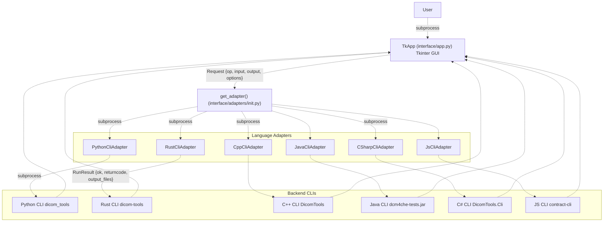

The TkApp GUI sits at the top of the request flow, translating user interactions into standardized requests that are routed through the adapter layer. It is decoupled from backend implementation details—the same UI code handles all six language backends.

**Sources:** [interface/app.py L801-L878](https://github.com/ThalesMMS/Dicom-Tools/blob/c7b4cbd8/interface/app.py#L801-L878)

 [interface/adapters/cpp_cli.py L1-L10](https://github.com/ThalesMMS/Dicom-Tools/blob/c7b4cbd8/interface/adapters/cpp_cli.py#L1-L10)

---

## Main UI Components

### TkApp Class Structure

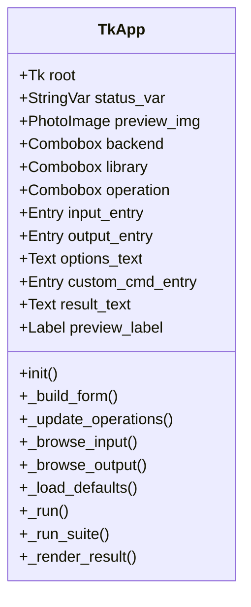

The `TkApp` class manages the entire GUI lifecycle. It creates a single window with a grid-based form layout containing all controls and display areas.

**Sources:** [interface/app.py L801-L808](https://github.com/ThalesMMS/Dicom-Tools/blob/c7b4cbd8/interface/app.py#L801-L808)

---

### Form Layout and Components

```mermaid
flowchart TD

Row0["Row 0: Backend Combobox"]
Row1["Row 1: Library Combobox"]
Row2["Row 2: Operation Combobox"]
Row3["Row 3: Input Entry + Browse Button"]
Row4["Row 4: Output Entry + Browse Button"]
Row5["Row 5: Options JSON Text (multi-line)"]
Row6["Row 6: Custom Command Entry + Buttons"]
Row7["Row 7: Hint Label"]
Row8["Row 8: Result Text (multi-line, scrollable)"]
Row9["Row 9: Status Label"]
Row10["Row 10: Preview Label (image)"]

subgraph subGraph0 ["TkApp Window Layout (grid)"]
    Row0
    Row1
    Row2
    Row3
    Row4
    Row5
    Row6
    Row7
    Row8
    Row9
    Row10
    Row0 -.-> Row1
    Row1 -.-> Row2
    Row2 -.-> Row3
    Row3 -.-> Row4
    Row4 -.-> Row5
    Row5 -.-> Row6
    Row6 -.-> Row7
    Row7 -.-> Row8
    Row8 -.-> Row9
    Row9 -.-> Row10
end
```

The form uses a consistent three-column layout:

* **Column 0:** Labels describing each field
* **Column 1:** Primary input controls (comboboxes, entries, text areas)
* **Column 2:** Secondary controls (browse buttons, action buttons)

**Sources:** [interface/app.py L809-L878](https://github.com/ThalesMMS/Dicom-Tools/blob/c7b4cbd8/interface/app.py#L809-L878)

---

### Key Component Mappings

| Component | Type | Purpose | Row | Column |
| --- | --- | --- | --- | --- |
| `backend` | `ttk.Combobox` | Select language backend (python, rust, cpp, etc.) | 0 | 1 |
| `library` | `ttk.Combobox` | Filter operations by library (pydicom, GDCM, etc.) | 1 | 1 |
| `operation` | `ttk.Combobox` | Select DICOM operation (info, anonymize, etc.) | 2 | 1 |
| `input_entry` | `ttk.Entry` | Path to input file or directory | 3 | 1 |
| `output_entry` | `ttk.Entry` | Path to output file or directory | 4 | 1 |
| `options_text` | `tk.Text` | JSON dictionary of operation options | 5 | 1 |
| `custom_cmd_entry` | `ttk.Entry` | Custom command template with {input}/{output} | 6 | 1-2 |
| `result_text` | `tk.Text` | Display stdout, stderr, and operation results | 8 | 1-2 |
| `status_var` | `tk.StringVar` | Status message ("Ready", "Success", "Failure") | 9 | 1 |
| `preview_label` | `ttk.Label` | Image preview for to_image operations | 10 | 1-2 |

**Sources:** [interface/app.py L809-L878](https://github.com/ThalesMMS/Dicom-Tools/blob/c7b4cbd8/interface/app.py#L809-L878)

---

## Backend and Operation Selection

### Backend Configuration System

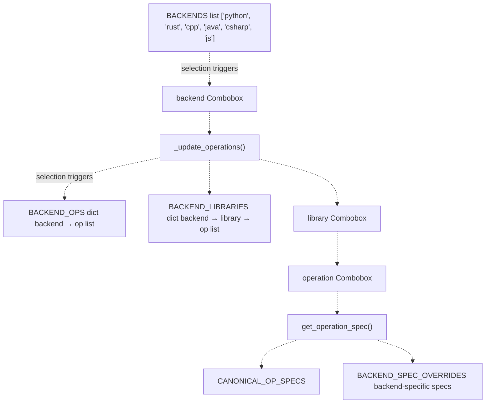

**Sources:** [interface/app.py L9-L129](https://github.com/ThalesMMS/Dicom-Tools/blob/c7b4cbd8/interface/app.py#L9-L129)

 [interface/app.py L779-L798](https://github.com/ThalesMMS/Dicom-Tools/blob/c7b4cbd8/interface/app.py#L779-L798)

---

### Backend Operations Matrix

The `BACKEND_OPS` dictionary defines which operations each backend supports:

| Backend | Core Ops | Advanced Ops | Network Ops | Specialized Ops |
| --- | --- | --- | --- | --- |
| **Python** | info, anonymize, to_image, transcode, validate, stats, dump | volume, nifti, split_multiframe | echo | batch_* operations |
| **Rust** | info, anonymize, to_image, transcode, validate, stats, dump | histogram | echo | to_json, from_json |
| **C++** | info, anonymize, to_image, transcode, validate, stats, dump | vtk_* operations (15 ops) | - | test_* operations (9 ops) |
| **Java** | info, anonymize, to_image, transcode, validate, stats, dump | histogram, sr_summary, rt_check | echo, store_scu, worklist, qido, stow, wado | test_* operations (6 ops) |
| **C#** | info, anonymize, to_image, transcode, validate, stats, dump | histogram, sr_summary, rt_check | echo, store_scu, worklist, qido, stow, wado | test_* operations (10 ops) |
| **JS** | info, anonymize, to_image, transcode, validate, stats, dump | volume, nifti | echo | (shim to Python) |

**Sources:** [interface/app.py L17-L129](https://github.com/ThalesMMS/Dicom-Tools/blob/c7b4cbd8/interface/app.py#L17-L129)

---

### Library Filtering System

The `BACKEND_LIBRARIES` structure provides grouping by underlying library:

```css
# Example: Python backend librariesBACKEND_LIBRARIES = {    "python": {        "Todos": ["all operations"],        "pydicom": ["info", "anonymize", "to_image", ...],        "python-gdcm": ["info", "to_image"],        "simpleitk": ["volume", "nifti"],        "dicom-numpy": ["volume"],        "pynetdicom": ["echo"],        "batch": ["batch_list", "batch_decompress", ...]    }}
```

When a user selects "pydicom" from the library dropdown, only operations implemented with pydicom are shown in the operation combobox.

**Sources:** [interface/app.py L149-L327](https://github.com/ThalesMMS/Dicom-Tools/blob/c7b4cbd8/interface/app.py#L149-L327)

---

### Operation Specification Resolution

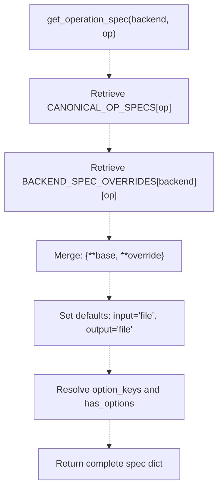

Each operation has a canonical specification that can be overridden per backend. The spec includes:

* **input:** `"file"`, `"directory"`, `"none"`, or `"optional"`
* **output:** `"file"`, `"directory"`, or `"display"`
* **description:** Human-readable operation description
* **option_keys:** List of valid option names
* **has_options:** Boolean indicating if options are supported
* **output_required:** Whether output path must be specified

**Sources:** [interface/app.py L548-L798](https://github.com/ThalesMMS/Dicom-Tools/blob/c7b4cbd8/interface/app.py#L548-L798)

 [interface/app.py L779-L798](https://github.com/ThalesMMS/Dicom-Tools/blob/c7b4cbd8/interface/app.py#L779-L798)

---

## Input and Output Handling

### File/Directory Selection Flow

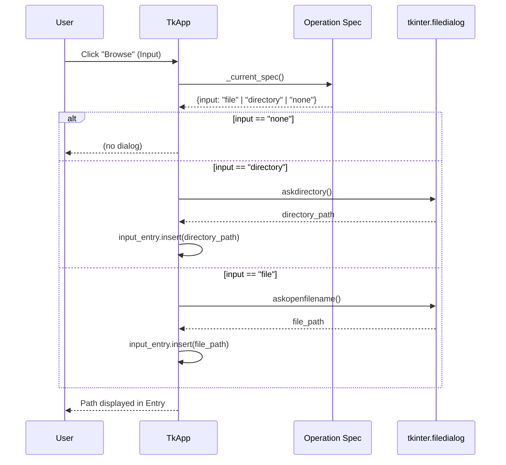

The browse buttons are context-aware—clicking the input browse button opens a file picker for file-based operations and a directory picker for directory-based operations (e.g., `volume`, `nifti`).

**Sources:** [interface/app.py L880-L904](https://github.com/ThalesMMS/Dicom-Tools/blob/c7b4cbd8/interface/app.py#L880-L904)

---

### Output Path Normalization

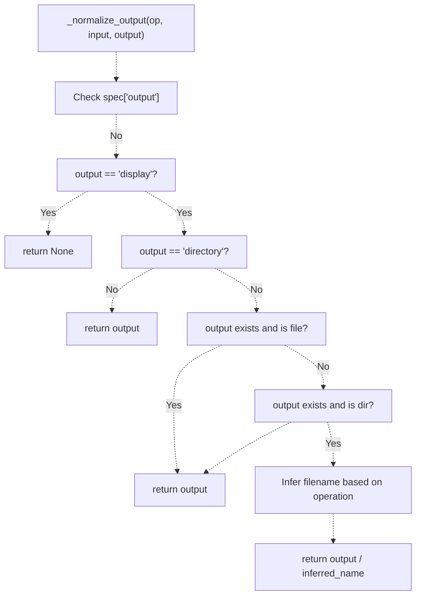

The `_normalize_output()` method intelligently handles various output scenarios:

* **to_image:** Adds `.png` extension if directory provided
* **anonymize:** Adds `_anon.dcm` suffix
* **transcode:** Adds `_transcoded.dcm` suffix
* **volume:** Adds `_volume.npy` suffix
* **nifti:** Adds `_volume.nii.gz` suffix

**Sources:** [interface/app.py L1044-L1088](https://github.com/ThalesMMS/Dicom-Tools/blob/c7b4cbd8/interface/app.py#L1044-L1088)

---

### Input Validation

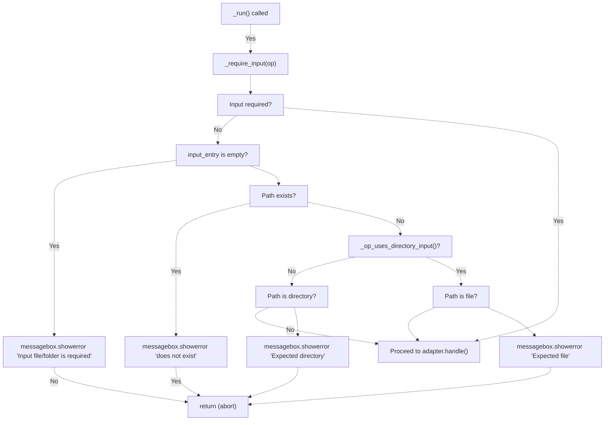

**Sources:** [interface/app.py L1090-L1135](https://github.com/ThalesMMS/Dicom-Tools/blob/c7b4cbd8/interface/app.py#L1090-L1135)

---

## Options Configuration

### JSON Options Parsing

The `options_text` widget accepts a JSON dictionary. The `_parse_options()` method validates and parses this:

```
def _parse_options(self) -> dict:    """Parse options from the JSON text widget."""    raw = self.options_text.get("1.0", tk.END).strip()    if not raw or raw == "{}":        return {}    try:        parsed = json.loads(raw)        if not isinstance(parsed, dict):            messagebox.showwarning("Invalid options", "Options must be a JSON object")            return {}        return parsed    except json.JSONDecodeError:        messagebox.showwarning("Invalid JSON", "Could not parse options JSON")        return {}
```

**Sources:** [interface/app.py L995-L1007](https://github.com/ThalesMMS/Dicom-Tools/blob/c7b4cbd8/interface/app.py#L995-L1007)

---

### Common Options by Operation

| Operation | Common Options | Example |
| --- | --- | --- |
| `info` | `json`, `verbose` | `{"json": true, "verbose": false}` |
| `to_image` | `format`, `frame`, `window_center`, `window_width` | `{"format": "png", "frame": 0}` |
| `transcode` | `syntax` | `{"syntax": "1.2.840.10008.1.2.4.90"}` |
| `stats` | `bins`, `frame`, `json`, `pretty` | `{"bins": 16, "json": true}` |
| `histogram` | `bins`, `frame` | `{"bins": 32}` |
| `echo` | `host`, `port`, `calling_aet`, `called_aet`, `timeout` | `{"host": "127.0.0.1", "port": 11112}` |
| `store_scu` | `host`, `port`, `calling_aet`, `called_aet`, `timeout` | `{"host": "pacs.local", "port": 104}` |
| `volume` | `preview`, `metadata` | `{"preview": true}` |
| `nifti` | `series_uid`, `metadata`, `no_compress` | `{"no_compress": false}` |
| `dump` | `depth`, `max_value_len`, `max_width`, `json` | `{"max_value_len": 64}` |

**Sources:** [interface/app.py L548-L696](https://github.com/ThalesMMS/Dicom-Tools/blob/c7b4cbd8/interface/app.py#L548-L696)

---

## Execution Flow

### Run Operation Sequence

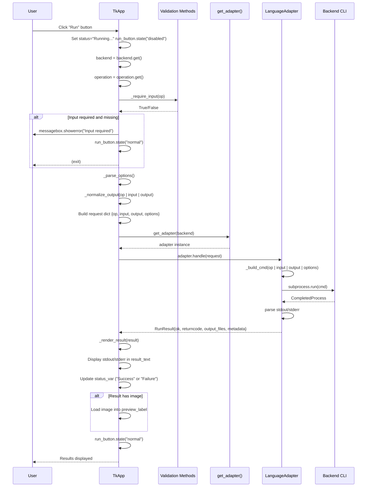

**Sources:** [interface/app.py L1137-L1228](https://github.com/ThalesMMS/Dicom-Tools/blob/c7b4cbd8/interface/app.py#L1137-L1228)

---

### Request Object Structure

The request dictionary sent to adapters follows this structure:

```css
request = {    "op": "anonymize",             # Operation name    "input": "/path/to/input.dcm", # Input file or directory    "output": "/path/to/output.dcm", # Output file or directory (optional)    "options": {                    # Operation-specific options        "json": True,        "verbose": False    }}
```

**Sources:** [interface/app.py L1176-L1181](https://github.com/ThalesMMS/Dicom-Tools/blob/c7b4cbd8/interface/app.py#L1176-L1181)

---

### RunResult Object Structure

Adapters return a `RunResult` object with this structure:

```
class RunResult:    ok: bool                    # True if returncode == 0    returncode: int             # Process exit code    stdout: str                 # Standard output    stderr: str                 # Standard error    output_files: List[str]     # Generated file paths    metadata: Optional[dict]    # Parsed JSON metadata (if available)    backend: Optional[str]      # Backend name    operation: Optional[str]    # Operation name
```

**Sources:** Reference from adapter pattern in architecture diagrams

---

## Result Display System

### Result Rendering Flow

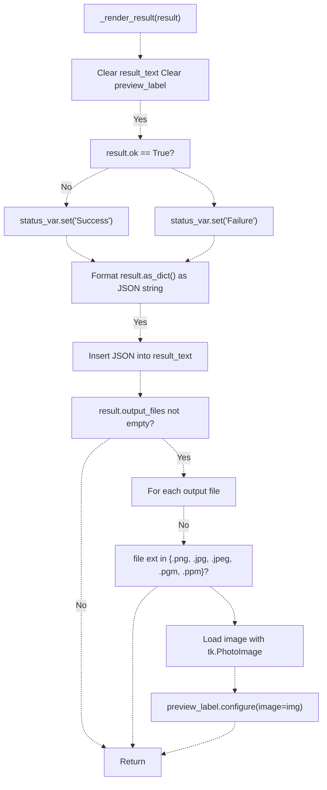

**Sources:** [interface/app.py L1009-L1042](https://github.com/ThalesMMS/Dicom-Tools/blob/c7b4cbd8/interface/app.py#L1009-L1042)

---

### Status Indicators

| Status | Meaning | Trigger |
| --- | --- | --- |
| `"Ready"` | Initial state, waiting for user action | App initialization |
| `"Running..."` | Operation in progress | `_run()` called, before adapter.handle() |
| `"Success"` | Operation completed successfully | `result.ok == True` |
| `"Failure"` | Operation failed or returned non-zero exit code | `result.ok == False` |
| `"Suite completed: X/Y passed"` | Suite execution finished | `_run_suite()` completed |

**Sources:** [interface/app.py L1009-L1042](https://github.com/ThalesMMS/Dicom-Tools/blob/c7b4cbd8/interface/app.py#L1009-L1042)

 [interface/app.py L1230-L1316](https://github.com/ThalesMMS/Dicom-Tools/blob/c7b4cbd8/interface/app.py#L1230-L1316)

---

### Image Preview Feature

The preview system automatically displays images generated by operations:

```css
# Supported image extensionsIMAGE_EXTS = {".png", ".pgm", ".ppm", ".jpg", ".jpeg"}# Preview rendering (simplified)if result.output_files:    for output_file in result.output_files:        ext = Path(output_file).suffix.lower()        if ext in IMAGE_EXTS and Path(output_file).exists():            try:                img = tk.PhotoImage(file=output_file)                self.preview_img = img  # Keep reference                self.preview_label.configure(image=img)                break            except Exception:                pass  # Invalid image format
```

**Sources:** [interface/app.py L10-L11](https://github.com/ThalesMMS/Dicom-Tools/blob/c7b4cbd8/interface/app.py#L10-L11)

 [interface/app.py L1025-L1042](https://github.com/ThalesMMS/Dicom-Tools/blob/c7b4cbd8/interface/app.py#L1025-L1042)

---

## Default Configurations

### DEFAULTS Dictionary Structure

The `DEFAULTS` dictionary provides pre-configured settings for each backend/operation pair:

```css
DEFAULTS = {    "python": {        "info": {            "input": DEFAULT_FILE,  # sample_series/IM-0001-0001.dcm            "options": {"json": True}        },        "anonymize": {            "input": DEFAULT_FILE,            "output": OUTPUT_DIR / "ui_python_anon.dcm"        },        "to_image": {            "input": DEFAULT_FILE,            "output": OUTPUT_DIR / "ui_python.png",            "options": {"format": "png", "frame": 0}        }        # ... more operations    },    "rust": { /* ... */ },    "cpp": { /* ... */ },    "java": { /* ... */ },    "csharp": { /* ... */ },    "js": { /* ... */ }}
```

**Sources:** [interface/app.py L330-L466](https://github.com/ThalesMMS/Dicom-Tools/blob/c7b4cbd8/interface/app.py#L330-L466)

---

### Default File Paths

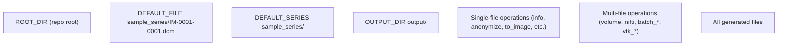

**Sources:** [interface/app.py L11-L14](https://github.com/ThalesMMS/Dicom-Tools/blob/c7b4cbd8/interface/app.py#L11-L14)

---

### Load Defaults Button

The "Load defaults" button populates the form with backend/operation-specific defaults:

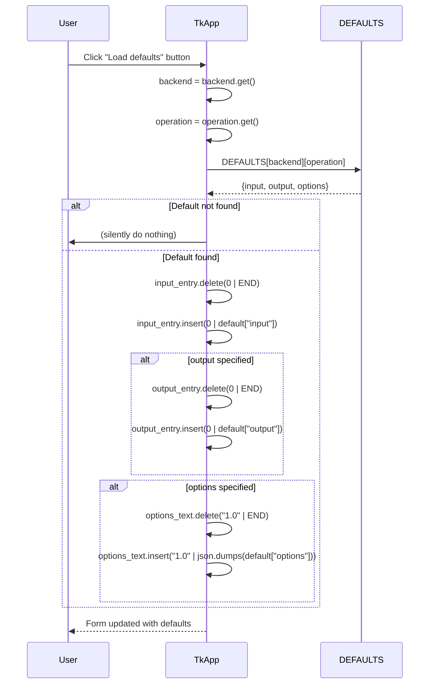

**Sources:** [interface/app.py L969-L993](https://github.com/ThalesMMS/Dicom-Tools/blob/c7b4cbd8/interface/app.py#L969-L993)

---

## Suite Execution System

### Suite Operation Lists

The `SUITE_OPS` dictionary defines curated operation lists for comprehensive backend testing:

```css
SUITE_OPS = {    "python": [        "info", "anonymize", "to_image", "transcode", "validate",        "stats", "dump", "volume", "nifti",        "split_multiframe", "batch_list", "batch_decompress",        "batch_anonymize", "batch_convert", "batch_validate"    ],    "rust": [        "info", "anonymize", "to_image", "transcode", "validate",        "stats", "dump", "histogram", "to_json", "from_json"    ],    "cpp": [        "info", "anonymize", "to_image", "transcode", "validate",        "stats", "dump",        "test_gdcm", "test_dcmtk", "test_itk", "test_vtk_unit",        "test_utils", "test_integration", "test_edge_cases",        "test_validation", "run_cpp_tests"    ]    # ... more backends}
```

Network-dependent operations like `echo`, `store_scu`, and `worklist` are intentionally excluded from suites to keep them self-contained and runnable without external PACS infrastructure.

**Sources:** [interface/app.py L468-L546](https://github.com/ThalesMMS/Dicom-Tools/blob/c7b4cbd8/interface/app.py#L468-L546)

---

### Suite Execution Flow

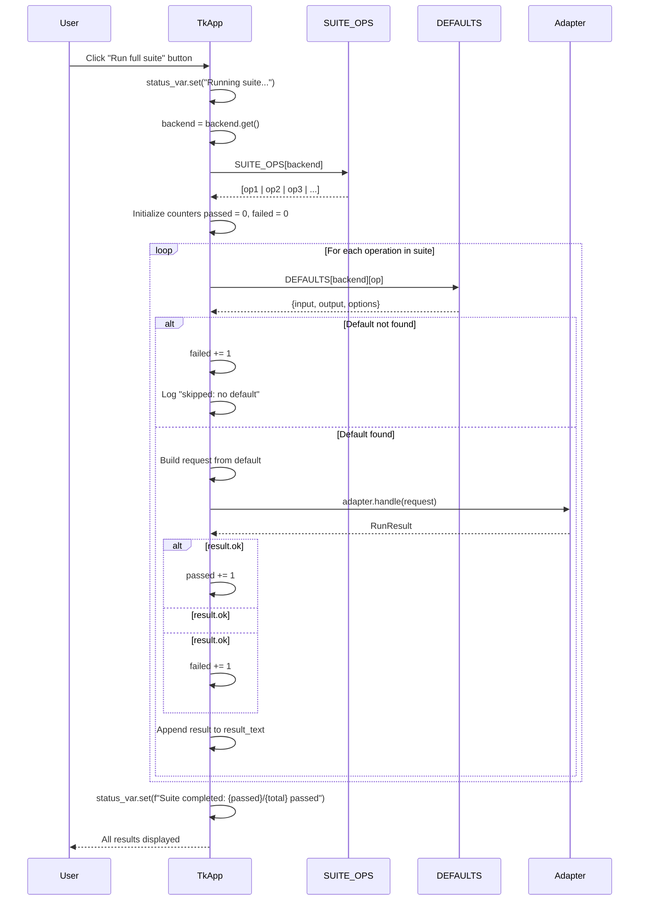

**Sources:** [interface/app.py L1230-L1316](https://github.com/ThalesMMS/Dicom-Tools/blob/c7b4cbd8/interface/app.py#L1230-L1316)

---

### Suite Result Aggregation

Each operation's result is appended to the result text area with a separator:

```
=== info (python) ===
{
  "ok": true,
  "returncode": 0,
  "stdout": "...",
  ...
}

=== anonymize (python) ===
{
  "ok": true,
  "returncode": 0,
  "output_files": ["/path/to/output.dcm"],
  ...
}

...

Suite completed: 14/15 passed
```

**Sources:** [interface/app.py L1285-L1312](https://github.com/ThalesMMS/Dicom-Tools/blob/c7b4cbd8/interface/app.py#L1285-L1312)

---

## Advanced Features

### Custom Command Support

The `custom_cmd_entry` field allows users to execute arbitrary commands using template substitution:

```
# Custom command templatecustom_cmd = "my-tool --input {input} --output {output} --verbose"# Substitution performed in adaptercmd_parts = custom_cmd.split()cmd_parts = [    str(input_path) if part == "{input}" else    str(output_path) if part == "{output}" else    part    for part in cmd_parts]
```

This enables integration with external tools not directly supported by the standard operation set.

**Sources:** [interface/app.py L851-L853](https://github.com/ThalesMMS/Dicom-Tools/blob/c7b4cbd8/interface/app.py#L851-L853)

 Reference from adapter implementations

---

### Operation Hint System

The `hint_label` widget displays operation-specific guidance:

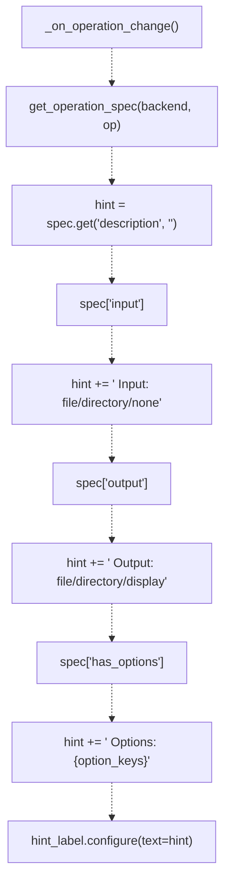

**Sources:** [interface/app.py L938-L967](https://github.com/ThalesMMS/Dicom-Tools/blob/c7b4cbd8/interface/app.py#L938-L967)

---

## Error Handling

### Error Categories

| Error Type | Trigger | Handling | User Feedback |
| --- | --- | --- | --- |
| **Missing Input** | Required input path is empty | `_run()` validation | `messagebox.showerror("Input file/folder is required")` |
| **Invalid Path** | Input path does not exist | `_run()` validation | `messagebox.showerror("Path does not exist")` |
| **Wrong Input Type** | File provided when directory expected (or vice versa) | `_run()` validation | `messagebox.showerror("Expected directory/file")` |
| **Invalid JSON** | Options JSON parsing fails | `_parse_options()` | `messagebox.showwarning("Invalid JSON")` |
| **Adapter Not Found** | Invalid backend name | `get_adapter()` | Exception propagated to result_text |
| **Backend Failure** | CLI returns non-zero exit code | Adapter `handle()` | `result.ok = False`, displayed in result_text |
| **Image Load Error** | Preview image format unsupported | `_render_result()` | Silent failure (no preview shown) |

**Sources:** [interface/app.py L995-L1007](https://github.com/ThalesMMS/Dicom-Tools/blob/c7b4cbd8/interface/app.py#L995-L1007)

 [interface/app.py L1090-L1135](https://github.com/ThalesMMS/Dicom-Tools/blob/c7b4cbd8/interface/app.py#L1090-L1135)

---

### Error Display in Result Text

```css
# Example result for failed operation{  "ok": false,  "returncode": 1,  "stdout": "",  "stderr": "Error: Invalid DICOM file\n",  "output_files": [],  "metadata": null,  "backend": "python",  "operation": "info"}
```

The stderr content is prominently displayed, allowing users to diagnose backend-specific errors.

**Sources:** [interface/app.py L1009-L1042](https://github.com/ThalesMMS/Dicom-Tools/blob/c7b4cbd8/interface/app.py#L1009-L1042)

---

## Testing

### TkApp Test Coverage

The test suite in `interface/tests/test_app_helpers.py` validates core functionality without requiring a real Tkinter environment:

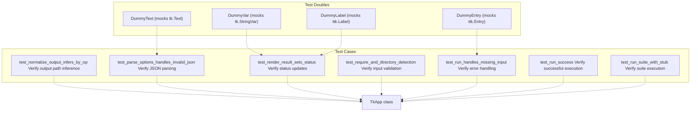

**Sources:** [interface/tests/test_app_helpers.py L1-L175](https://github.com/ThalesMMS/Dicom-Tools/blob/c7b4cbd8/interface/tests/test_app_helpers.py#L1-L175)

---

### Key Test Scenarios

1. **Output Normalization:** Verifies that `_normalize_output()` correctly infers extensions based on operation type
2. **JSON Parsing:** Tests invalid JSON handling with `{bad json` and valid JSON `{"a": 1}`
3. **Result Rendering:** Confirms status_var is set to "Success" or "Failure" based on result.ok
4. **Input Requirements:** Validates that operations like "echo" and "worklist" don't require input files
5. **Missing Input Handling:** Ensures proper error message when input is required but not provided
6. **Suite Execution:** Verifies that suite runs all operations and aggregates pass/fail counts

**Sources:** [interface/tests/test_app_helpers.py L63-L175](https://github.com/ThalesMMS/Dicom-Tools/blob/c7b4cbd8/interface/tests/test_app_helpers.py#L63-L175)

---

## Usage Examples

### Basic Single Operation

1. Select **Backend:** `python`
2. Select **Library:** `pydicom`
3. Select **Operation:** `info`
4. Click **Browse** (Input) → Select `sample_series/IM-0001-0001.dcm`
5. Set **Options JSON:** `{"json": true, "verbose": false}`
6. Click **Run**

Result: DICOM metadata displayed as JSON in result_text

---

### Image Generation

1. Select **Backend:** `rust`
2. Select **Operation:** `to_image`
3. Click **Browse** (Input) → Select DICOM file
4. Set **Output:** `output/preview.png`
5. Set **Options JSON:** `{"format": "png", "frame": 0, "window_center": 40, "window_width": 400}`
6. Click **Run**

Result: PNG image generated and displayed in preview_label

---

### Volume Reconstruction

1. Select **Backend:** `python`
2. Select **Library:** `simpleitk`
3. Select **Operation:** `nifti`
4. Click **Browse** (Input) → Select directory containing DICOM series
5. Set **Output:** `output/volume.nii.gz`
6. Set **Options JSON:** `{"no_compress": false, "metadata": true}`
7. Click **Run**

Result: NIfTI file generated at specified output path

---

### Full Backend Suite

1. Select **Backend:** `cpp`
2. Click **Run full suite**

Result: All C++ operations (17 total) executed sequentially with aggregated pass/fail count

---

## Implementation Notes

### Thread Safety

The TkApp GUI is **single-threaded**. All operations block the main thread during execution. For long-running operations, the UI becomes unresponsive. Future enhancements could use threading or async patterns.

**Sources:** [interface/app.py L1137-L1228](https://github.com/ThalesMMS/Dicom-Tools/blob/c7b4cbd8/interface/app.py#L1137-L1228)

---

### Memory Management

The `preview_img` instance variable holds a reference to the PhotoImage to prevent garbage collection:

```
self.preview_img = tk.PhotoImage(file=output_file)self.preview_label.configure(image=self.preview_img)# Reference must be kept to prevent image from being GC'd
```

**Sources:** [interface/app.py L806](https://github.com/ThalesMMS/Dicom-Tools/blob/c7b4cbd8/interface/app.py#L806-L806)

 [interface/app.py L1025-L1042](https://github.com/ThalesMMS/Dicom-Tools/blob/c7b4cbd8/interface/app.py#L1025-L1042)

---

### Platform Considerations

* **File Dialogs:** Use native OS file pickers via `tkinter.filedialog`
* **Path Handling:** All paths converted to `pathlib.Path` for cross-platform compatibility
* **Line Endings:** No explicit handling; Python's text mode handles CRLF/LF transparently
* **Font Rendering:** Uses system default fonts; no custom font configuration

**Sources:** [interface/app.py L1-L15](https://github.com/ThalesMMS/Dicom-Tools/blob/c7b4cbd8/interface/app.py#L1-L15)

---

## Related Components

* **CLI Contract Specification:** See [Contract Specification](3a%20Contract-Specification.md) for the request/response format
* **Adapter Pattern:** See [Adapter Pattern](3b%20Adapter-Pattern.md) for how requests are translated to CLI invocations
* **Contract Runner:** See [Contract Runner](2b%20Contract-Runner-%28Headless-CLI%29.md) for headless/automated execution
* **Language Backends:** See [Language Implementations](4%20Language-Implementations.md) for backend-specific details


### On this page

* [TkApp Desktop GUI](#2.1-tkapp-desktop-gui)
* [Purpose and Scope](#2.1-purpose-and-scope)
* [Architecture and Integration](#2.1-architecture-and-integration)
* [Position in System Hierarchy](#2.1-position-in-system-hierarchy)
* [Main UI Components](#2.1-main-ui-components)
* [TkApp Class Structure](#2.1-tkapp-class-structure)
* [Form Layout and Components](#2.1-form-layout-and-components)
* [Key Component Mappings](#2.1-key-component-mappings)
* [Backend and Operation Selection](#2.1-backend-and-operation-selection)
* [Backend Configuration System](#2.1-backend-configuration-system)
* [Backend Operations Matrix](#2.1-backend-operations-matrix)
* [Library Filtering System](#2.1-library-filtering-system)
* [Operation Specification Resolution](#2.1-operation-specification-resolution)
* [Input and Output Handling](#2.1-input-and-output-handling)
* [File/Directory Selection Flow](#2.1-filedirectory-selection-flow)
* [Output Path Normalization](#2.1-output-path-normalization)
* [Input Validation](#2.1-input-validation)
* [Options Configuration](#2.1-options-configuration)
* [JSON Options Parsing](#2.1-json-options-parsing)
* [Common Options by Operation](#2.1-common-options-by-operation)
* [Execution Flow](#2.1-execution-flow)
* [Run Operation Sequence](#2.1-run-operation-sequence)
* [Request Object Structure](#2.1-request-object-structure)
* [RunResult Object Structure](#2.1-runresult-object-structure)
* [Result Display System](#2.1-result-display-system)
* [Result Rendering Flow](#2.1-result-rendering-flow)
* [Status Indicators](#2.1-status-indicators)
* [Image Preview Feature](#2.1-image-preview-feature)
* [Default Configurations](#2.1-default-configurations)
* [DEFAULTS Dictionary Structure](#2.1-defaults-dictionary-structure)
* [Default File Paths](#2.1-default-file-paths)
* [Load Defaults Button](#2.1-load-defaults-button)
* [Suite Execution System](#2.1-suite-execution-system)
* [Suite Operation Lists](#2.1-suite-operation-lists)
* [Suite Execution Flow](#2.1-suite-execution-flow)
* [Suite Result Aggregation](#2.1-suite-result-aggregation)
* [Advanced Features](#2.1-advanced-features)
* [Custom Command Support](#2.1-custom-command-support)
* [Operation Hint System](#2.1-operation-hint-system)
* [Error Handling](#2.1-error-handling)
* [Error Categories](#2.1-error-categories)
* [Error Display in Result Text](#2.1-error-display-in-result-text)
* [Testing](#2.1-testing)
* [TkApp Test Coverage](#2.1-tkapp-test-coverage)
* [Key Test Scenarios](#2.1-key-test-scenarios)
* [Usage Examples](#2.1-usage-examples)
* [Basic Single Operation](#2.1-basic-single-operation)
* [Image Generation](#2.1-image-generation)
* [Volume Reconstruction](#2.1-volume-reconstruction)
* [Full Backend Suite](#2.1-full-backend-suite)
* [Implementation Notes](#2.1-implementation-notes)
* [Thread Safety](#2.1-thread-safety)
* [Memory Management](#2.1-memory-management)
* [Platform Considerations](#2.1-platform-considerations)
* [Related Components](#2.1-related-components)

Ask Devin about Dicom-Tools