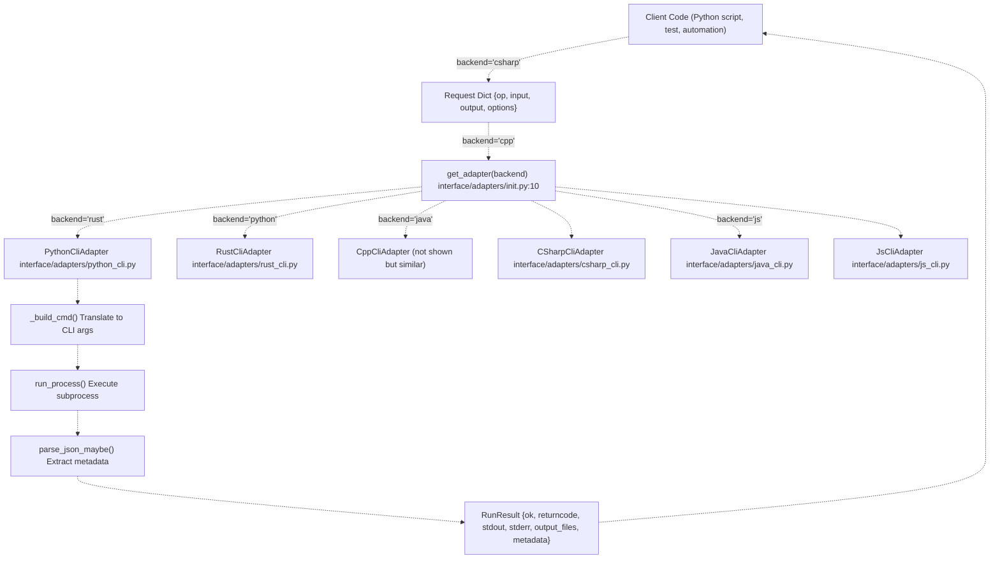
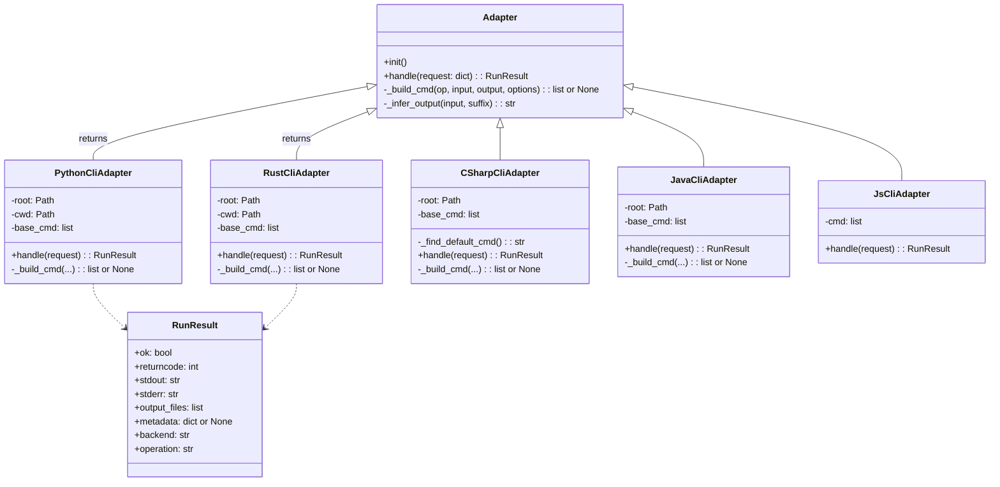
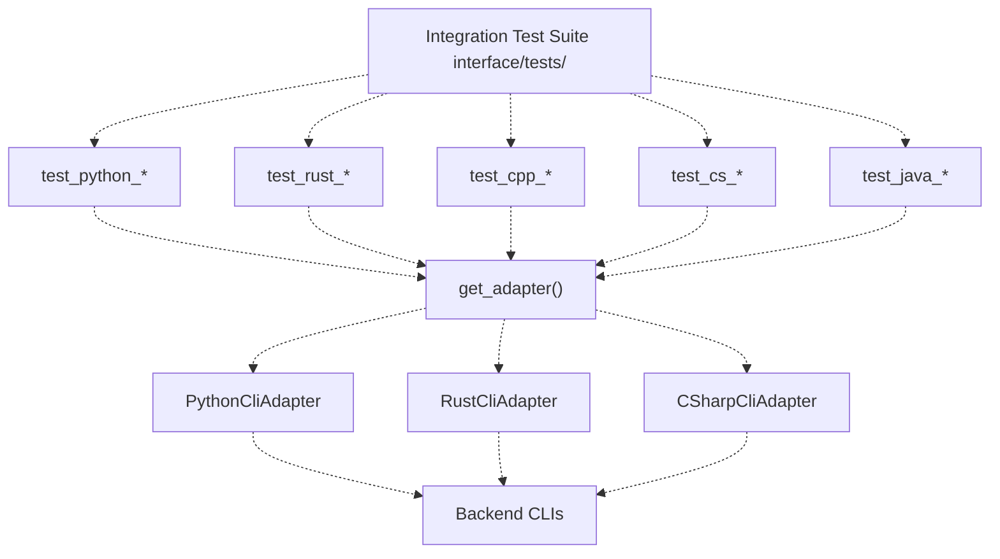
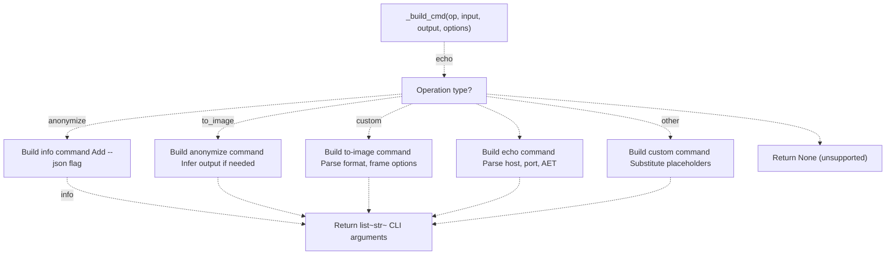

# 2b Contract Runner (Headless CLI)

> **Relevant source files**
> * [interface/CONTRACT.md](https://github.com/ThalesMMS/Dicom-Tools/blob/c7b4cbd8/interface/CONTRACT.md)
> * [interface/adapters/__init__.py](https://github.com/ThalesMMS/Dicom-Tools/blob/c7b4cbd8/interface/adapters/__init__.py)
> * [interface/adapters/csharp_cli.py](https://github.com/ThalesMMS/Dicom-Tools/blob/c7b4cbd8/interface/adapters/csharp_cli.py)
> * [interface/adapters/java_cli.py](https://github.com/ThalesMMS/Dicom-Tools/blob/c7b4cbd8/interface/adapters/java_cli.py)
> * [interface/adapters/js_cli.py](https://github.com/ThalesMMS/Dicom-Tools/blob/c7b4cbd8/interface/adapters/js_cli.py)
> * [interface/adapters/python_cli.py](https://github.com/ThalesMMS/Dicom-Tools/blob/c7b4cbd8/interface/adapters/python_cli.py)
> * [interface/adapters/rust_cli.py](https://github.com/ThalesMMS/Dicom-Tools/blob/c7b4cbd8/interface/adapters/rust_cli.py)
> * [interface/tests/test_operation_specs.py](https://github.com/ThalesMMS/Dicom-Tools/blob/c7b4cbd8/interface/tests/test_operation_specs.py)

## Purpose and Scope

The Contract Runner is a programmatic interface for executing DICOM operations without a graphical user interface. It provides direct access to the CLI contract system, allowing automated scripts, batch processing, and integration with external tools to perform DICOM operations across all language backends.

This page covers the Python-based adapter layer that translates contract requests into backend-specific CLI invocations. For the contract specification itself, see [CLI Contract System](3%20CLI-Contract-System.md). For the desktop GUI interface, see [TkApp Desktop GUI](2a%20TkApp-Desktop-GUI.md). For individual backend implementations, see [Language Implementations](4%20Language-Implementations.md).

**Sources:** [interface/CONTRACT.md L1-L14](https://github.com/ThalesMMS/Dicom-Tools/blob/c7b4cbd8/interface/CONTRACT.md#L1-L14)

---

## Overview

The Contract Runner operates as a headless execution layer that accepts JSON-formatted requests and routes them to the appropriate language backend through language-specific adapters. This architecture enables:

* **Scriptable automation** of DICOM processing workflows
* **Cross-language execution** with a unified interface
* **Programmatic access** from Python code or external tools
* **Batch processing** without GUI overhead
* **CI/CD integration** for automated testing and validation

The system consists of three primary components:

1. **Adapter Factory** - `get_adapter()` function that instantiates backend-specific adapters
2. **Language Adapters** - Classes that translate contract requests to CLI commands
3. **Result Handling** - Standardized `RunResult` objects containing execution outcomes

**Sources:** [interface/adapters/__init__.py L1-L25](https://github.com/ThalesMMS/Dicom-Tools/blob/c7b4cbd8/interface/adapters/__init__.py#L1-L25)

 [interface/CONTRACT.md L1-L14](https://github.com/ThalesMMS/Dicom-Tools/blob/c7b4cbd8/interface/CONTRACT.md#L1-L14)

---

## Architecture: Request Flow



**Sources:** [interface/adapters/__init__.py L10-L24](https://github.com/ThalesMMS/Dicom-Tools/blob/c7b4cbd8/interface/adapters/__init__.py#L10-L24)

 [interface/adapters/python_cli.py L9-L17](https://github.com/ThalesMMS/Dicom-Tools/blob/c7b4cbd8/interface/adapters/python_cli.py#L9-L17)

 [interface/adapters/rust_cli.py L8-L26](https://github.com/ThalesMMS/Dicom-Tools/blob/c7b4cbd8/interface/adapters/rust_cli.py#L8-L26)

---

## Request Envelope Structure

The contract runner accepts requests as Python dictionaries conforming to the CLI contract specification. Each request contains:

| Field | Type | Required | Description |
| --- | --- | --- | --- |
| `backend` | `str` | No* | Backend identifier: `python`, `rust`, `cpp`, `csharp`, `java`, `js` |
| `op` | `str` | Yes | Operation name (e.g., `info`, `anonymize`, `to_image`) |
| `input` | `str` | Conditional | Input file or directory path (required for most operations) |
| `output` | `str` | No | Output file or directory path (adapter infers if omitted) |
| `options` | `dict` | No | Operation-specific parameters |

* The `backend` field is used by the TkApp GUI but typically omitted when calling adapters directly.

### Operations Not Requiring Input

Certain operations do not require an `input` field:

* **Network operations**: `echo`, `worklist`, `qido`, `wado`
* **Test operations**: All `test_*` and `run_*_tests` operations
* **Custom operations**: `custom` (uses `options.custom_cmd`)

**Sources:** [interface/CONTRACT.md L5-L14](https://github.com/ThalesMMS/Dicom-Tools/blob/c7b4cbd8/interface/CONTRACT.md#L5-L14)

 [interface/adapters/python_cli.py L24-L26](https://github.com/ThalesMMS/Dicom-Tools/blob/c7b4cbd8/interface/adapters/python_cli.py#L24-L26)

 [interface/adapters/csharp_cli.py L37-L54](https://github.com/ThalesMMS/Dicom-Tools/blob/c7b4cbd8/interface/adapters/csharp_cli.py#L37-L54)

---

## Response Envelope Structure

All adapters return a `RunResult` object with standardized fields:

| Field | Type | Description |
| --- | --- | --- |
| `ok` | `bool` | Operation success status |
| `returncode` | `int` | Process exit code (0 = success) |
| `stdout` | `str` | Standard output from CLI process |
| `stderr` | `str` | Standard error from CLI process |
| `output_files` | `list[str]` | Paths to generated files |
| `metadata` | `dict \| None` | Parsed JSON metadata (when available) |
| `backend` | `str` | Backend that executed the operation |
| `operation` | `str` | Operation name that was executed |

### Metadata Extraction

Adapters automatically attempt to parse JSON from `stdout` for operations that return structured data (e.g., `info`, `stats`, `histogram`). The parsed result is stored in the `metadata` field.

**Sources:** [interface/CONTRACT.md L16-L26](https://github.com/ThalesMMS/Dicom-Tools/blob/c7b4cbd8/interface/CONTRACT.md#L16-L26)

 [interface/adapters/python_cli.py L34-L38](https://github.com/ThalesMMS/Dicom-Tools/blob/c7b4cbd8/interface/adapters/python_cli.py#L34-L38)

 [interface/adapters/rust_cli.py L43-L47](https://github.com/ThalesMMS/Dicom-Tools/blob/c7b4cbd8/interface/adapters/rust_cli.py#L43-L47)

---

## Using the Adapter Factory

### Basic Usage Pattern

```python
from interface.adapters import get_adapter# Get adapter for desired backendadapter = get_adapter("rust")# Construct requestrequest = {    "op": "anonymize",    "input": "sample_series/CT000001.dcm",    "output": "output/anonymous.dcm"}# Execute operationresult = adapter.handle(request)# Check resultif result.ok:    print(f"Success! Output: {result.output_files}")else:    print(f"Failed with code {result.returncode}: {result.stderr}")
```

### Supported Backend Identifiers

The `get_adapter()` function accepts the following backend strings:

| Backend | Identifiers | Adapter Class |
| --- | --- | --- |
| Python | `python` | `PythonCliAdapter` |
| Rust | `rust` | `RustCliAdapter` |
| C++ | `cpp` | `CppCliAdapter` |
| C# | `csharp`, `cs`, `dotnet` | `CSharpCliAdapter` |
| Java | `java` | `JavaCliAdapter` |
| JavaScript | `js` | `JsCliAdapter` |

**Sources:** [interface/adapters/__init__.py L10-L24](https://github.com/ThalesMMS/Dicom-Tools/blob/c7b4cbd8/interface/adapters/__init__.py#L10-L24)

---

## Adapter Implementation Pattern



### Common Adapter Methods

All adapters implement a consistent interface:

#### __init__()

Initializes the adapter by:

1. Resolving repository root path
2. Checking for environment variable overrides
3. Setting default CLI command or binary path
4. Configuring working directory

#### handle(request: dict) -> RunResult

Main execution method that:

1. Validates required fields (`op`, `input` when needed)
2. Calls `_build_cmd()` to construct CLI arguments
3. Executes subprocess via `run_process()`
4. Parses JSON metadata from output
5. Returns standardized `RunResult`

#### _build_cmd(op, input_path, output, options) -> list | None

Translates operation name and parameters into backend-specific CLI arguments. Returns `None` if operation is not supported by the backend.

**Sources:** [interface/adapters/python_cli.py L9-L44](https://github.com/ThalesMMS/Dicom-Tools/blob/c7b4cbd8/interface/adapters/python_cli.py#L9-L44)

 [interface/adapters/rust_cli.py L8-L51](https://github.com/ThalesMMS/Dicom-Tools/blob/c7b4cbd8/interface/adapters/rust_cli.py#L8-L51)

 [interface/adapters/csharp_cli.py L8-L67](https://github.com/ThalesMMS/Dicom-Tools/blob/c7b4cbd8/interface/adapters/csharp_cli.py#L8-L67)

---

## Environment Configuration

Each adapter supports environment variable overrides for CLI paths, enabling flexible deployment scenarios:

| Environment Variable | Default | Adapter |
| --- | --- | --- |
| `PYTHON_DICOM_TOOLS_CMD` | `python -m DICOM_reencoder.cli` | Python |
| `RUST_DICOM_TOOLS_BIN` | `rust/target/release/dicom-tools` | Rust |
| `RUST_DICOM_TOOLS_CMD` | (alternative to BIN) | Rust |
| `CPP_DICOM_TOOLS_BIN` | `cpp/build/DicomTools` | C++ |
| `CS_DICOM_TOOLS_CMD` | `cs/bin/Release/net8.0/DicomTools.Cli` | C# |
| `JAVA_DICOM_TOOLS_CMD` | `java/dcm4che-tests/target/dcm4che-tests.jar` | Java |
| `JS_DICOM_TOOLS_CMD` | `node js/contract-cli/index.js` | JavaScript |

### Configuration Examples

```
# Use custom Python installationexport PYTHON_DICOM_TOOLS_CMD="/usr/local/bin/python3.11 -m DICOM_reencoder.cli"# Point to pre-built Rust binaryexport RUST_DICOM_TOOLS_BIN="/opt/dicom-tools/bin/dicom-tools"# Use Debug build for C#export CS_DICOM_TOOLS_CMD="cs/bin/Debug/net8.0/DicomTools.Cli"
```

### Fallback Behavior

**Rust Adapter**: If the binary does not exist at the default or configured path, automatically falls back to `cargo run --quiet --release --` for development environments.

**C# Adapter**: Searches for binary in both `Release/net8.0` and `Debug/net8.0` directories before falling back to PATH resolution.

**Sources:** [interface/CONTRACT.md L84-L89](https://github.com/ThalesMMS/Dicom-Tools/blob/c7b4cbd8/interface/CONTRACT.md#L84-L89)

 [interface/adapters/python_cli.py L12-L16](https://github.com/ThalesMMS/Dicom-Tools/blob/c7b4cbd8/interface/adapters/python_cli.py#L12-L16)

 [interface/adapters/rust_cli.py L11-L26](https://github.com/ThalesMMS/Dicom-Tools/blob/c7b4cbd8/interface/adapters/rust_cli.py#L11-L26)

 [interface/adapters/csharp_cli.py L11-L29](https://github.com/ThalesMMS/Dicom-Tools/blob/c7b4cbd8/interface/adapters/csharp_cli.py#L11-L29)

---

## Operation Examples

### Example 1: Extract Metadata

```python
from interface.adapters import get_adapteradapter = get_adapter("python")result = adapter.handle({    "op": "info",    "input": "sample_series/CT000001.dcm",    "options": {"verbose": True}})if result.ok and result.metadata:    print(f"Patient ID: {result.metadata.get('PatientID')}")    print(f"Modality: {result.metadata.get('Modality')}")
```

### Example 2: Anonymize with Output Inference

```python
adapter = get_adapter("rust")result = adapter.handle({    "op": "anonymize",    "input": "patient_data.dcm"    # output is automatically inferred as "patient_data_anonymized.dcm"})print(f"Anonymized file: {result.output_files[0]}")
```

### Example 3: Convert to Image with Options

```
adapter = get_adapter("rust")result = adapter.handle({    "op": "to_image",    "input": "ct_scan.dcm",    "output": "output/preview.png",    "options": {        "format": "png",        "frame": 0,        "window_center": -600,        "window_width": 1600,        "normalize": True    }})
```

### Example 4: Network Echo Test

```python
adapter = get_adapter("java")result = adapter.handle({    "op": "echo",    "options": {        "host": "pacs.hospital.local",        "port": 104,        "calling_aet": "WORKSTATION",        "called_aet": "PACS_SCP",        "timeout": 5000    }})if result.ok:    print("DICOM echo successful")else:    print(f"Echo failed: {result.stderr}")
```

### Example 5: Batch Processing

```python
adapter = get_adapter("python")result = adapter.handle({    "op": "batch_anonymize",    "input": "dicom_archive/",    "output": "anonymized_archive/",    "options": {        "recursive": True    }})print(f"Processed {len(result.output_files)} files")
```

**Sources:** [interface/adapters/python_cli.py L45-L66](https://github.com/ThalesMMS/Dicom-Tools/blob/c7b4cbd8/interface/adapters/python_cli.py#L45-L66)

 [interface/adapters/rust_cli.py L52-L86](https://github.com/ThalesMMS/Dicom-Tools/blob/c7b4cbd8/interface/adapters/rust_cli.py#L52-L86)

 [interface/adapters/java_cli.py L68-L83](https://github.com/ThalesMMS/Dicom-Tools/blob/c7b4cbd8/interface/adapters/java_cli.py#L68-L83)

---

## Error Handling

### Validation Errors

Adapters perform basic request validation before execution:

```css
# Missing required operationresult = adapter.handle({"input": "file.dcm"})# Returns: RunResult(ok=False, returncode=1, stderr="op e input são obrigatórios")# Missing required input for operationresult = adapter.handle({"op": "anonymize"})# Returns: RunResult(ok=False, returncode=1, stderr="op e input são obrigatórios")# Unsupported operationresult = adapter.handle({"op": "unsupported_op", "input": "file.dcm"})# Returns: RunResult(ok=False, returncode=1, stderr="operação não suportada pelo backend...")
```

### Subprocess Failures

When the CLI subprocess fails:

```python
result = adapter.handle({    "op": "info",    "input": "nonexistent.dcm"})if not result.ok:    print(f"Exit code: {result.returncode}")    print(f"Error: {result.stderr}")    # stderr contains CLI error messages
```

### Metadata Parsing

JSON parsing errors are silently handled - `metadata` field will be `None` if parsing fails:

```css
result = adapter.handle({"op": "info", "input": "file.dcm"})# If backend outputs JSON: result.metadata contains parsed dict# If backend outputs text: result.metadata is None, stdout contains text
```

**Sources:** [interface/adapters/python_cli.py L24-L30](https://github.com/ThalesMMS/Dicom-Tools/blob/c7b4cbd8/interface/adapters/python_cli.py#L24-L30)

 [interface/adapters/rust_cli.py L34-L40](https://github.com/ThalesMMS/Dicom-Tools/blob/c7b4cbd8/interface/adapters/rust_cli.py#L34-L40)

 [interface/adapters/csharp_cli.py L52-L58](https://github.com/ThalesMMS/Dicom-Tools/blob/c7b4cbd8/interface/adapters/csharp_cli.py#L52-L58)

---

## Custom Command Execution

All adapters support a `custom` operation for executing arbitrary backend-specific commands:

```
adapter = get_adapter("python")result = adapter.handle({    "op": "custom",    "input": "input.dcm",    "output": "output.dcm",    "options": {        "custom_cmd": "custom-operation {input} --special-flag --output {output}"    }})
```

The `{input}` and `{output}` placeholders are automatically substituted with actual paths. The command is prepended with the adapter's base command (e.g., `python -m DICOM_reencoder.cli` for Python adapter).

**Sources:** [interface/adapters/python_cli.py L156-L163](https://github.com/ThalesMMS/Dicom-Tools/blob/c7b4cbd8/interface/adapters/python_cli.py#L156-L163)

 [interface/adapters/rust_cli.py L136-L142](https://github.com/ThalesMMS/Dicom-Tools/blob/c7b4cbd8/interface/adapters/rust_cli.py#L136-L142)

 [interface/adapters/csharp_cli.py L174-L180](https://github.com/ThalesMMS/Dicom-Tools/blob/c7b4cbd8/interface/adapters/csharp_cli.py#L174-L180)

---

## Integration with Testing

The contract runner is heavily used in the testing infrastructure for cross-language validation:



### Test Operation Support

Adapters provide dedicated test operations that execute backend-specific unit tests:

| Backend | Test Operations | Example |
| --- | --- | --- |
| Python | (uses pytest directly) | N/A |
| Rust | (uses cargo test) | N/A |
| C++ | `test_gdcm`, `test_dcmtk`, `test_itk`, `test_vtk_unit`, `run_cpp_tests` | All compile-time tests |
| C# | `test_anonymize_cs`, `test_uid_cs`, `run_cs_tests` | xUnit test execution |
| Java | `test_uid`, `test_datetime`, `test_charset`, `run_java_tests` | JUnit via Maven |

**Sources:** [interface/CONTRACT.md L49-L74](https://github.com/ThalesMMS/Dicom-Tools/blob/c7b4cbd8/interface/CONTRACT.md#L49-L74)

 [interface/adapters/csharp_cli.py L157-L173](https://github.com/ThalesMMS/Dicom-Tools/blob/c7b4cbd8/interface/adapters/csharp_cli.py#L157-L173)

 [interface/adapters/java_cli.py L147-L159](https://github.com/ThalesMMS/Dicom-Tools/blob/c7b4cbd8/interface/adapters/java_cli.py#L147-L159)

---

## Implementation Details

### Command Building Strategy

Each adapter implements `_build_cmd()` with operation-specific logic:



### Output Path Inference

When `output` is not provided in the request, adapters infer it using naming conventions:

| Operation | Inferred Output Pattern | Example |
| --- | --- | --- |
| `anonymize` | `{stem}_anonymized.dcm` | `patient.dcm` → `patient_anonymized.dcm` |
| `to_image` | `{stem}.{format}` | `scan.dcm` → `scan.png` |
| `transcode` | `{stem}_explicit.dcm` | `compressed.dcm` → `compressed_explicit.dcm` |
| `to_json` | `{stem}.json` | `file.dcm` → `file.json` |
| `from_json` | `{stem}.dcm` | `data.json` → `data.dcm` |

**Sources:** [interface/adapters/python_cli.py L167-L171](https://github.com/ThalesMMS/Dicom-Tools/blob/c7b4cbd8/interface/adapters/python_cli.py#L167-L171)

 [interface/adapters/rust_cli.py L146-L150](https://github.com/ThalesMMS/Dicom-Tools/blob/c7b4cbd8/interface/adapters/rust_cli.py#L146-L150)

 [interface/adapters/csharp_cli.py L69-L87](https://github.com/ThalesMMS/Dicom-Tools/blob/c7b4cbd8/interface/adapters/csharp_cli.py#L69-L87)

---

## Performance Considerations

### Subprocess Overhead

Each adapter invocation spawns a new subprocess, which incurs:

* **Process creation overhead**: 10-50ms depending on backend
* **Environment setup**: Python imports, JVM startup, .NET runtime initialization
* **No state persistence**: Each operation is isolated

For high-throughput scenarios, consider:

* **Batch operations**: Use `batch_*` operations when available
* **Backend selection**: Rust and C++ have lower startup overhead than Python/Java/C#
* **Direct backend APIs**: For Python, consider using `pydicom` directly instead of CLI

### Memory Management

CLI processes are isolated and automatically cleaned up. Large operations (e.g., volume reconstruction, batch processing) do not accumulate memory in the calling process.

**Sources:** [interface/adapters/runner.py](https://github.com/ThalesMMS/Dicom-Tools/blob/c7b4cbd8/interface/adapters/runner.py)

 (referenced but not provided), [interface/adapters/python_cli.py L18-L43](https://github.com/ThalesMMS/Dicom-Tools/blob/c7b4cbd8/interface/adapters/python_cli.py#L18-L43)


### On this page

* [Contract Runner (Headless CLI)](#2.2-contract-runner-headless-cli)
* [Purpose and Scope](#2.2-purpose-and-scope)
* [Overview](#2.2-overview)
* [Architecture: Request Flow](#2.2-architecture-request-flow)
* [Request Envelope Structure](#2.2-request-envelope-structure)
* [Operations Not Requiring Input](#2.2-operations-not-requiring-input)
* [Response Envelope Structure](#2.2-response-envelope-structure)
* [Metadata Extraction](#2.2-metadata-extraction)
* [Using the Adapter Factory](#2.2-using-the-adapter-factory)
* [Basic Usage Pattern](#2.2-basic-usage-pattern)
* [Supported Backend Identifiers](#2.2-supported-backend-identifiers)
* [Adapter Implementation Pattern](#2.2-adapter-implementation-pattern)
* [Common Adapter Methods](#2.2-common-adapter-methods)
* [Environment Configuration](#2.2-environment-configuration)
* [Configuration Examples](#2.2-configuration-examples)
* [Fallback Behavior](#2.2-fallback-behavior)
* [Operation Examples](#2.2-operation-examples)
* [Example 1: Extract Metadata](#2.2-example-1-extract-metadata)
* [Example 2: Anonymize with Output Inference](#2.2-example-2-anonymize-with-output-inference)
* [Example 3: Convert to Image with Options](#2.2-example-3-convert-to-image-with-options)
* [Example 4: Network Echo Test](#2.2-example-4-network-echo-test)
* [Example 5: Batch Processing](#2.2-example-5-batch-processing)
* [Error Handling](#2.2-error-handling)
* [Validation Errors](#2.2-validation-errors)
* [Subprocess Failures](#2.2-subprocess-failures)
* [Metadata Parsing](#2.2-metadata-parsing)
* [Custom Command Execution](#2.2-custom-command-execution)
* [Integration with Testing](#2.2-integration-with-testing)
* [Test Operation Support](#2.2-test-operation-support)
* [Implementation Details](#2.2-implementation-details)
* [Command Building Strategy](#2.2-command-building-strategy)
* [Output Path Inference](#2.2-output-path-inference)
* [Performance Considerations](#2.2-performance-considerations)
* [Subprocess Overhead](#2.2-subprocess-overhead)
* [Memory Management](#2.2-memory-management)

Ask Devin about Dicom-Tools