# 2c Web Viewer (JavaScript)

> **Relevant source files**
> * [js/INTEGRATION.md](https://github.com/ThalesMMS/Dicom-Tools/blob/c7b4cbd8/js/INTEGRATION.md)
> * [js/viewer-gateway/src/imageIds.ts](https://github.com/ThalesMMS/Dicom-Tools/blob/c7b4cbd8/js/viewer-gateway/src/imageIds.ts)
> * [js/viewer-gateway/src/main.ts](https://github.com/ThalesMMS/Dicom-Tools/blob/c7b4cbd8/js/viewer-gateway/src/main.ts)
> * [js/viewer-gateway/src/viewerGateway.ts](https://github.com/ThalesMMS/Dicom-Tools/blob/c7b4cbd8/js/viewer-gateway/src/viewerGateway.ts)
> * [js/viewer-gateway/tests/main.entry.test.ts](https://github.com/ThalesMMS/Dicom-Tools/blob/c7b4cbd8/js/viewer-gateway/tests/main.entry.test.ts)
> * [js/viewer-gateway/tests/sampleSeries.integration.test.ts](https://github.com/ThalesMMS/Dicom-Tools/blob/c7b4cbd8/js/viewer-gateway/tests/sampleSeries.integration.test.ts)
> * [python/screenshots/ui.png](https://github.com/ThalesMMS/Dicom-Tools/blob/c7b4cbd8/python/screenshots/ui.png)

The Web Viewer is a browser-based medical image viewer built on Cornerstone3D v4 that provides GPU-accelerated 2D stack viewing and 3D volume rendering capabilities. It serves as a standalone demonstration of DICOM visualization using modern web technologies and can load data via WADO-URI (HTTP static files) or DICOMweb (QIDO-RS/WADO-RS) protocols.

This viewer is distinct from the desktop TkApp GUI (see [TkApp Desktop GUI](2a%20TkApp-Desktop-GUI.md)) and the headless contract runner (see [Contract Runner](2b%20Contract-Runner-%28Headless-CLI%29.md)). It operates entirely in the browser and does not interact with the CLI contract system used by other backends.

**Sources:** [js/viewer-gateway/src/main.ts L1-L490](https://github.com/ThalesMMS/Dicom-Tools/blob/c7b4cbd8/js/viewer-gateway/src/main.ts#L1-L490)

 [js/INTEGRATION.md L1-L94](https://github.com/ThalesMMS/Dicom-Tools/blob/c7b4cbd8/js/INTEGRATION.md#L1-L94)

 Diagram 5 from high-level architecture

---

## System Architecture

The viewer is organized as a Vite-based TypeScript application with three main architectural layers: the UI bootstrap layer, the Cornerstone3D abstraction gateway, and optional CPU-based processing utilities.

### Component Structure

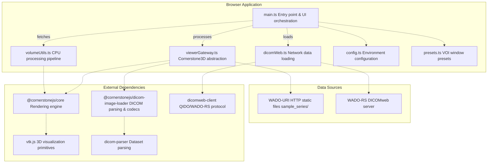

**Sources:** [js/viewer-gateway/src/main.ts L1-L17](https://github.com/ThalesMMS/Dicom-Tools/blob/c7b4cbd8/js/viewer-gateway/src/main.ts#L1-L17)

 [js/viewer-gateway/src/viewerGateway.ts L1-L147](https://github.com/ThalesMMS/Dicom-Tools/blob/c7b4cbd8/js/viewer-gateway/src/viewerGateway.ts#L1-L147)

 [js/viewer-gateway/src/volumeUtils.ts L1-L300](https://github.com/ThalesMMS/Dicom-Tools/blob/c7b4cbd8/js/viewer-gateway/src/volumeUtils.ts#L1-L300)

 [js/viewer-gateway/src/dicomWeb.ts L1-L100](https://github.com/ThalesMMS/Dicom-Tools/blob/c7b4cbd8/js/viewer-gateway/src/dicomWeb.ts#L1-L100)

---

## Main Entry Point

The `main.ts` file bootstraps the viewer application by creating three viewport sections, control panels, and analysis tools. It follows a functional composition pattern where UI elements are created dynamically and event handlers wire user interactions to Cornerstone3D and CPU processing operations.

### Bootstrap Flow

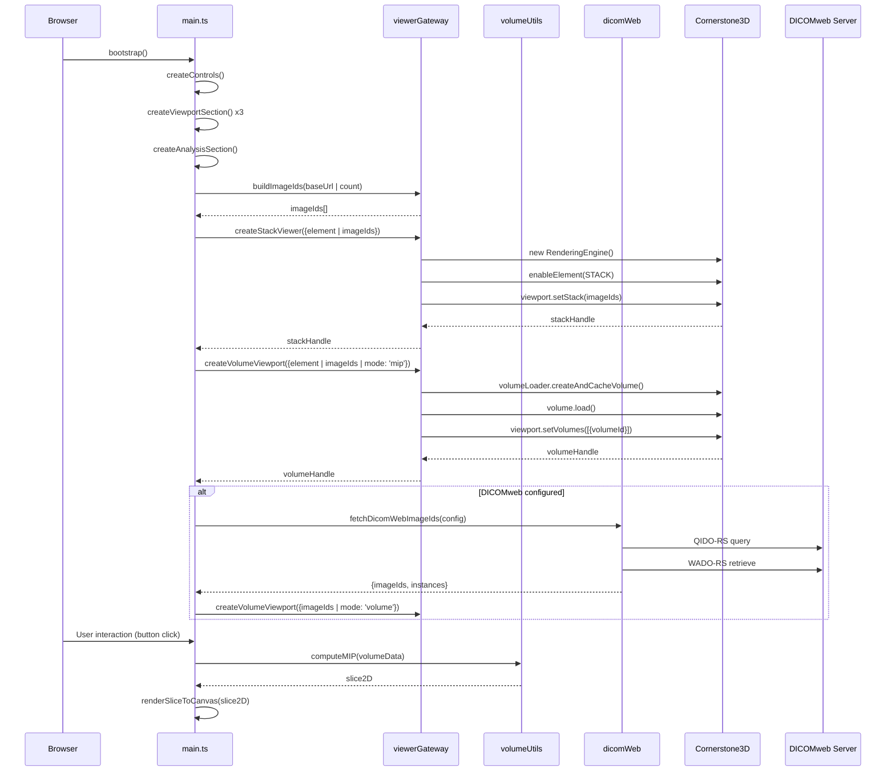

**Sources:** [js/viewer-gateway/src/main.ts L310-L490](https://github.com/ThalesMMS/Dicom-Tools/blob/c7b4cbd8/js/viewer-gateway/src/main.ts#L310-L490)

 [js/viewer-gateway/src/viewerGateway.ts L33-L144](https://github.com/ThalesMMS/Dicom-Tools/blob/c7b4cbd8/js/viewer-gateway/src/viewerGateway.ts#L33-L144)

 [js/viewer-gateway/src/dicomWeb.ts L1-L100](https://github.com/ThalesMMS/Dicom-Tools/blob/c7b4cbd8/js/viewer-gateway/src/dicomWeb.ts#L1-L100)

### UI Component Factory Functions

The bootstrap process uses factory functions to dynamically create UI sections:

| Function | Purpose | Returns |
| --- | --- | --- |
| `createViewportSection()` | Creates viewport container with heading and info paragraph | `{viewport, info}` |
| `createControls()` | Creates control panel with dropdowns, inputs, and buttons | Object with all control elements |
| `createAnalysisSection()` | Creates CPU analysis panel with projection/histogram controls | Object with analysis elements and canvases |

The `createControls()` function at [js/viewer-gateway/src/main.ts L45-L134](https://github.com/ThalesMMS/Dicom-Tools/blob/c7b4cbd8/js/viewer-gateway/src/main.ts#L45-L134)

 generates all interactive controls including:

* Orientation selector (axial/sagittal/coronal)
* Rendering mode selector (MIP/volume render)
* Slab thickness input
* VOI center/width inputs with preset buttons
* DICOMweb connection form

**Sources:** [js/viewer-gateway/src/main.ts L24-L211](https://github.com/ThalesMMS/Dicom-Tools/blob/c7b4cbd8/js/viewer-gateway/src/main.ts#L24-L211)

---

## Viewer Gateway Abstraction

The `viewerGateway.ts` module provides a simplified interface over Cornerstone3D's API, hiding the complexity of rendering engine initialization, loader configuration, and viewport management.

### Gateway API

```mermaid
flowchart TD

CreateStack["createStackViewer(options)"]
CreateVolume["createVolumeViewport(options)"]
BuildIds["buildImageIds(base, count)"]
StackHandle["StackHandle {setSlice, setVOI, destroy}"]
VolumeHandle["VolumeHandle {setBlendMode, setOrientation, setSlabThickness, destroy}"]
ConfigLoaders["configureLoaders() Setup dicomImageLoader"]
SetCPU["setUseCPURendering(bool)"]
CreateEngine["new RenderingEngine(id)"]
EnableElement["renderingEngine.enableElement()"]
SetStack["viewport.setStack(imageIds)"]
LoadVolume["volumeLoader.createAndCacheVolume()"]
SetVolumes["viewport.setVolumes([{volumeId}])"]

CreateStack -.-> ConfigLoaders
CreateStack -.-> SetCPU
CreateStack -.-> CreateEngine
CreateStack -.-> EnableElement
CreateStack -.-> SetStack
CreateStack -.-> StackHandle
CreateVolume -.-> ConfigLoaders
CreateVolume -.-> SetCPU
CreateVolume -.-> CreateEngine
CreateVolume -.-> EnableElement
CreateVolume -.-> LoadVolume
CreateVolume -.-> SetVolumes
CreateVolume -.-> VolumeHandle

subgraph subGraph2 ["Internal Operations"]
    ConfigLoaders
    SetCPU
    CreateEngine
    EnableElement
    SetStack
    LoadVolume
    SetVolumes
end

subgraph subGraph1 ["Returned Handles"]
    StackHandle
    VolumeHandle
end

subgraph subGraph0 ["Public API"]
    CreateStack
    CreateVolume
    BuildIds
end
```

### Stack Viewer Creation

The `createStackViewer()` function at [js/viewer-gateway/src/viewerGateway.ts L33-L63](https://github.com/ThalesMMS/Dicom-Tools/blob/c7b4cbd8/js/viewer-gateway/src/viewerGateway.ts#L33-L63)

 performs the following operations:

1. **Loader configuration**: Assigns `cornerstoneCore` and `dicomParser` to the external dependency injections required by `dicomImageLoader`
2. **CPU/GPU selection**: Calls `setUseCPURendering()` based on the `useCPU` option
3. **Engine initialization**: Creates a `RenderingEngine` with a unique ID
4. **Viewport enablement**: Enables a STACK viewport type on the target element
5. **Stack assignment**: Sets the image IDs and triggers initial render

The returned handle provides these methods:

| Method | Parameters | Description |
| --- | --- | --- |
| `setSlice(index)` | `index: number` | Navigate to a specific slice index |
| `setVOI(center, width)` | `center: number, width: number` | Apply window/level values |
| `destroy()` | None | Clean up rendering engine |

**Sources:** [js/viewer-gateway/src/viewerGateway.ts L33-L63](https://github.com/ThalesMMS/Dicom-Tools/blob/c7b4cbd8/js/viewer-gateway/src/viewerGateway.ts#L33-L63)

### Volume Viewport Creation

The `createVolumeViewport()` function at [js/viewer-gateway/src/viewerGateway.ts L65-L144](https://github.com/ThalesMMS/Dicom-Tools/blob/c7b4cbd8/js/viewer-gateway/src/viewerGateway.ts#L65-L144)

 creates either an ORTHOGRAPHIC or VOLUME_3D viewport depending on the rendering mode:

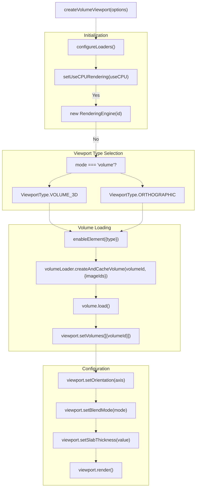

The volume handle returned at [js/viewer-gateway/src/viewerGateway.ts L120-L143](https://github.com/ThalesMMS/Dicom-Tools/blob/c7b4cbd8/js/viewer-gateway/src/viewerGateway.ts#L120-L143)

 provides dynamic control methods:

| Method | Purpose | Updates |
| --- | --- | --- |
| `setBlendMode('mip'\|'volume')` | Switch between MIP and composite rendering | `BlendModes.MAXIMUM_INTENSITY_BLEND` or `COMPOSITE` |
| `setOrientation('axial'\|'sagittal'\|'coronal')` | Change viewing plane | `OrientationAxis` enum value |
| `setSlabThickness(value)` | Adjust MIP slab thickness | Numeric value in mm |
| `destroy()` | Clean up resources | Destroys rendering engine |

**Sources:** [js/viewer-gateway/src/viewerGateway.ts L65-L144](https://github.com/ThalesMMS/Dicom-Tools/blob/c7b4cbd8/js/viewer-gateway/src/viewerGateway.ts#L65-L144)

---

## CPU Volume Processing Utilities

The `volumeUtils.ts` module provides TypeScript implementations of common medical imaging operations that can run on the CPU when GPU processing is unavailable or when intermediate results are needed for analysis.

### Volume Data Structure

The utilities operate on a standardized `VolumeData` structure:

```
interface VolumeData {  cols: number;           // X dimension  rows: number;           // Y dimension    slices: number;         // Z dimension  voxelData: Float32Array; // Linear voxel buffer (cols * rows * slices)  spacing?: { col: number; row: number; slice: number };  origin?: [number, number, number];  orientation?: {     row: [number, number, number];     col: [number, number, number]   };}interface Slice2D<T = Float32Array | Uint8Array> {  width: number;  height: number;  data: T;}
```

**Sources:** [js/viewer-gateway/src/volumeUtils.ts L1-L50](https://github.com/ThalesMMS/Dicom-Tools/blob/c7b4cbd8/js/viewer-gateway/src/volumeUtils.ts#L1-L50)

### Projection Operations

The module implements three projection algorithms at [js/viewer-gateway/src/volumeUtils.ts L100-L200](https://github.com/ThalesMMS/Dicom-Tools/blob/c7b4cbd8/js/viewer-gateway/src/volumeUtils.ts#L100-L200)

:

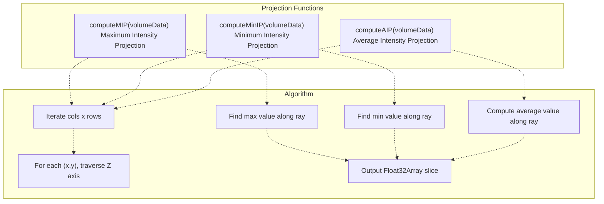

Each projection function:

1. Allocates a `Float32Array` of size `cols × rows`
2. For each (x, y) position, traverses the Z axis through all slices
3. Applies the projection operator (max, min, or mean)
4. Returns a `Slice2D<Float32Array>` representing the projected 2D image

**Sources:** [js/viewer-gateway/src/volumeUtils.ts L100-L200](https://github.com/ThalesMMS/Dicom-Tools/blob/c7b4cbd8/js/viewer-gateway/src/volumeUtils.ts#L100-L200)

### Windowing and Resampling

Additional processing functions provide image manipulation:

| Function | Input | Output | Operation |
| --- | --- | --- | --- |
| `extractAxialSlice(vol, z)` | `VolumeData, z: number` | `Slice2D<Float32Array>` | Extracts single axial slice at Z index |
| `windowLevelSlice(slice, center, width)` | `Slice2D<Float32Array>, center, width` | `Slice2D<Uint8Array>` | Applies window/level transformation to 8-bit range |
| `resampleSlice(slice, w, h, method)` | `Slice2D, targetW, targetH, method` | `Slice2D<Float32Array>` | Bilinear or nearest-neighbor resampling |
| `computeHistogram(vol, bins)` | `VolumeData, bins: number` | `{bins, min, max, binWidth}` | Computes intensity histogram |

The `windowLevelSlice()` function at [js/viewer-gateway/src/volumeUtils.ts L150-L180](https://github.com/ThalesMMS/Dicom-Tools/blob/c7b4cbd8/js/viewer-gateway/src/volumeUtils.ts#L150-L180)

 implements the standard DICOM window/level formula:

```
min = center - (width / 2)
max = center + (width / 2)
normalized = (value - min) / (max - min)
output = clamp(normalized * 255, 0, 255)
```

**Sources:** [js/viewer-gateway/src/volumeUtils.ts L50-L300](https://github.com/ThalesMMS/Dicom-Tools/blob/c7b4cbd8/js/viewer-gateway/src/volumeUtils.ts#L50-L300)

### Integration with Cornerstone3D

The `extractVolumeDataFromCornerstone()` function at [js/viewer-gateway/src/main.ts L281-L308](https://github.com/ThalesMMS/Dicom-Tools/blob/c7b4cbd8/js/viewer-gateway/src/main.ts#L281-L308)

 bridges the gap between Cornerstone3D's internal VTK.js data structures and the CPU processing utilities:

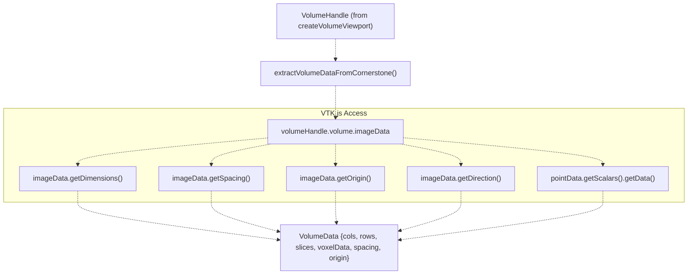

This extraction allows the viewer to perform CPU-based analysis on loaded volumes without requiring a separate data loading pipeline.

**Sources:** [js/viewer-gateway/src/main.ts L281-L308](https://github.com/ThalesMMS/Dicom-Tools/blob/c7b4cbd8/js/viewer-gateway/src/main.ts#L281-L308)

---

## DICOMweb Integration

The `dicomWeb.ts` module provides network-based data loading using the DICOMweb QIDO-RS (query) and WADO-RS (retrieve) protocols via the `dicomweb-client` library.

### DICOMweb Loading Flow

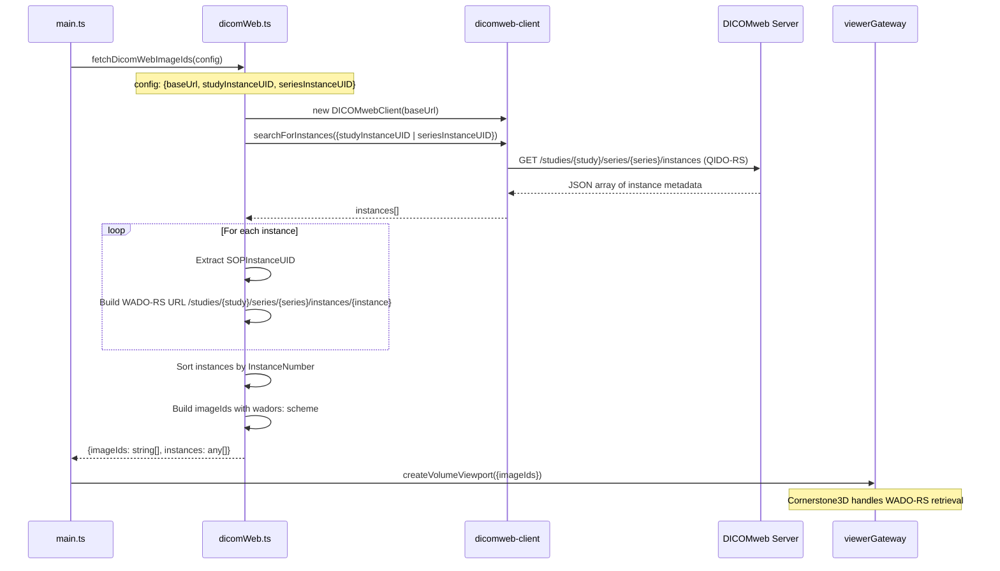

### Configuration Sources

DICOMweb configuration can come from multiple sources with the following precedence:

1. **Programmatic**: `window.DICOMWEB_CONFIG` object set in browser
2. **Environment variables**: `VITE_DICOMWEB_BASE`, `VITE_DICOMWEB_STUDY`, `VITE_DICOMWEB_SERIES`
3. **Runtime input**: User form fields in the UI

The `loadDemoConfig()` function at [js/viewer-gateway/src/config.ts L1-L50](https://github.com/ThalesMMS/Dicom-Tools/blob/c7b4cbd8/js/viewer-gateway/src/config.ts#L1-L50)

 implements this cascading logic.

**Sources:** [js/viewer-gateway/src/dicomWeb.ts L1-L100](https://github.com/ThalesMMS/Dicom-Tools/blob/c7b4cbd8/js/viewer-gateway/src/dicomWeb.ts#L1-L100)

 [js/viewer-gateway/src/config.ts L1-L50](https://github.com/ThalesMMS/Dicom-Tools/blob/c7b4cbd8/js/viewer-gateway/src/config.ts#L1-L50)

 [js/INTEGRATION.md L87-L93](https://github.com/ThalesMMS/Dicom-Tools/blob/c7b4cbd8/js/INTEGRATION.md#L87-L93)

---

## Rendering Modes and Codecs

The viewer supports multiple rendering configurations and DICOM transfer syntaxes through Cornerstone3D's codec system.

### Viewport Types

| Type | Cornerstone3D Enum | Use Case | Created By |
| --- | --- | --- | --- |
| Stack | `ViewportType.STACK` | 2D slice-by-slice navigation | `createStackViewer()` |
| Orthographic | `ViewportType.ORTHOGRAPHIC` | MPR with slab thickness control | `createVolumeViewport({mode: 'mip'})` |
| Volume 3D | `ViewportType.VOLUME_3D` | Full 3D volume rendering | `createVolumeViewport({mode: 'volume'})` |

### Blend Modes

Volume viewports support two blend modes controlled via `setBlendMode()`:

* **MAXIMUM_INTENSITY_BLEND**: Displays maximum intensity along viewing rays (MIP)
* **COMPOSITE**: Standard alpha compositing for volume rendering

### Transfer Syntax Support

The `@cornerstonejs/dicom-image-loader` includes WASM codecs for:

| Transfer Syntax | Codec Package | Description |
| --- | --- | --- |
| JPEG-LS | `@cornerstonejs/codec-charls` | Lossless/near-lossless JPEG |
| JPEG 2000 | `@cornerstonejs/codec-openjpeg` | Wavelet-based compression |
| JPEG Baseline | `@cornerstonejs/codec-libjpeg-turbo` | Standard JPEG |
| RLE | Built-in | Run-length encoding |

These codecs are automatically loaded by the image loader when it encounters encoded pixel data.

**Sources:** [js/viewer-gateway/src/viewerGateway.ts L65-L144](https://github.com/ThalesMMS/Dicom-Tools/blob/c7b4cbd8/js/viewer-gateway/src/viewerGateway.ts#L65-L144)

 Diagram 5 from high-level architecture

---

## Testing Strategy

The viewer includes two categories of tests: unit tests for the gateway API and integration tests for data consistency.

### Gateway API Tests

The `viewerGateway.test.ts` suite at [js/viewer-gateway/tests/viewerGateway.test.ts L1-L200](https://github.com/ThalesMMS/Dicom-Tools/blob/c7b4cbd8/js/viewer-gateway/tests/viewerGateway.test.ts#L1-L200)

 mocks Cornerstone3D to verify:

* Stack viewer creation and handle API
* Volume viewport creation with mode/orientation options
* Image ID building from base URL and count
* Error handling during initialization

### Sample Series Integration

The `sampleSeries.integration.test.ts` suite at [js/viewer-gateway/tests/sampleSeries.integration.test.ts L1-L84](https://github.com/ThalesMMS/Dicom-Tools/blob/c7b4cbd8/js/viewer-gateway/tests/sampleSeries.integration.test.ts#L1-L84)

 validates the integrity of the reference DICOM data:

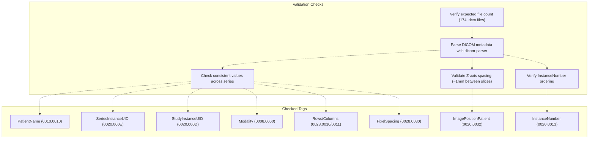

The test suite validates that:

1. All files share the same `PatientName`, `SeriesInstanceUID`, `StudyInstanceUID`, and `Modality`
2. All files have identical `Rows`, `Columns`, and `PixelSpacing` values
3. `InstanceNumber` values are strictly increasing
4. Z-axis spacing between consecutive slices is approximately 1mm

**Sources:** [js/viewer-gateway/tests/sampleSeries.integration.test.ts L24-L83](https://github.com/ThalesMMS/Dicom-Tools/blob/c7b4cbd8/js/viewer-gateway/tests/sampleSeries.integration.test.ts#L24-L83)

### Main Entry Point Tests

The `main.entry.test.ts` suite at [js/viewer-gateway/tests/main.entry.test.ts L1-L172](https://github.com/ThalesMMS/Dicom-Tools/blob/c7b4cbd8/js/viewer-gateway/tests/main.entry.test.ts#L1-L172)

 tests the bootstrap wiring:

* Viewport mounting with default configuration
* Control panel event handler registration
* DICOMweb flow when configuration is provided
* Error handling and status reporting

**Sources:** [js/viewer-gateway/tests/main.entry.test.ts L70-L172](https://github.com/ThalesMMS/Dicom-Tools/blob/c7b4cbd8/js/viewer-gateway/tests/main.entry.test.ts#L70-L172)

---

## Data Loading Patterns

The viewer demonstrates two distinct data loading patterns for different deployment scenarios.

### WADO-URI Pattern (Static Files)

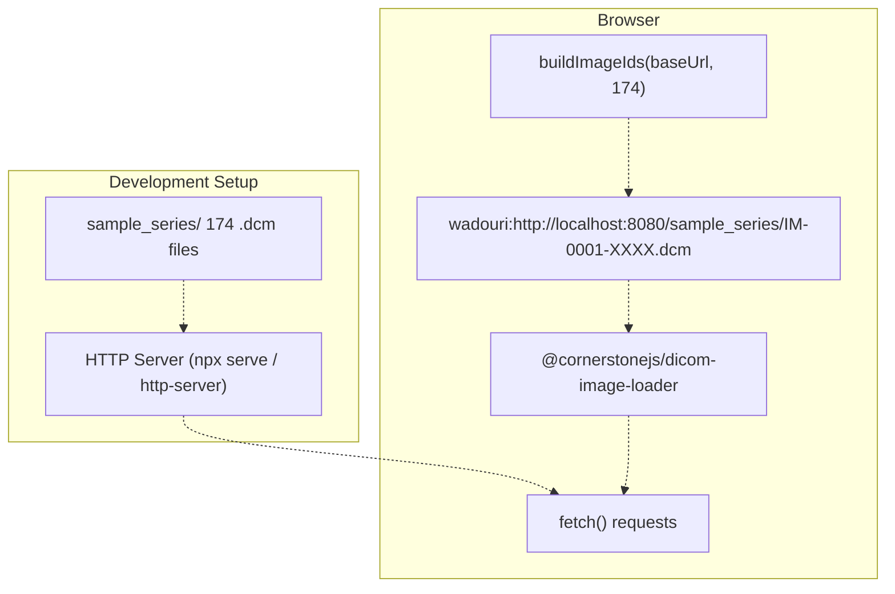

The WADO-URI pattern is used for local development and serves the `sample_series/` directory via HTTP. The `buildImageIds()` function at [js/viewer-gateway/src/imageIds.ts L1-L9](https://github.com/ThalesMMS/Dicom-Tools/blob/c7b4cbd8/js/viewer-gateway/src/imageIds.ts#L1-L9)

 constructs image IDs with the `wadouri:` scheme.

### WADO-RS Pattern (DICOMweb)

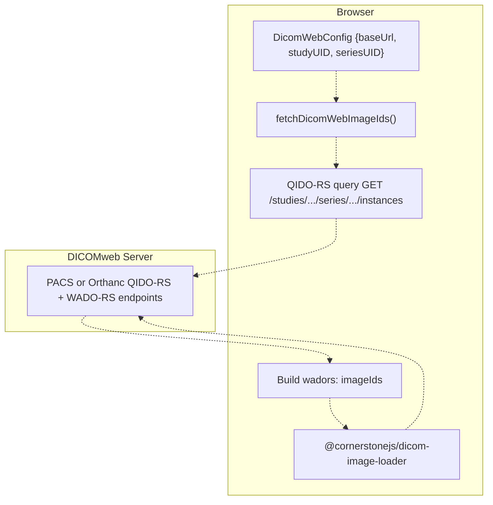

The WADO-RS pattern queries instance metadata via QIDO-RS and constructs `wadors:` scheme image IDs that the Cornerstone loader uses to retrieve pixel data. This pattern is demonstrated at [js/viewer-gateway/src/main.ts L354-L374](https://github.com/ThalesMMS/Dicom-Tools/blob/c7b4cbd8/js/viewer-gateway/src/main.ts#L354-L374)

**Sources:** [js/viewer-gateway/src/imageIds.ts L1-L9](https://github.com/ThalesMMS/Dicom-Tools/blob/c7b4cbd8/js/viewer-gateway/src/imageIds.ts#L1-L9)

 [js/viewer-gateway/src/dicomWeb.ts L1-L100](https://github.com/ThalesMMS/Dicom-Tools/blob/c7b4cbd8/js/viewer-gateway/src/dicomWeb.ts#L1-L100)

 [js/INTEGRATION.md L1-L94](https://github.com/ThalesMMS/Dicom-Tools/blob/c7b4cbd8/js/INTEGRATION.md#L1-L94)

---

## Environment Configuration

The viewer uses Vite's environment variable system to configure runtime behavior without code changes.

### Configuration Variables

| Variable | Purpose | Default | Used By |
| --- | --- | --- | --- |
| `VITE_SAMPLE_BASE_URL` | Base URL for WADO-URI samples | `http://localhost:8080/sample_series` | `buildImageIds()` |
| `VITE_SAMPLE_COUNT` | Number of sample instances | `174` | `buildImageIds()` |
| `VITE_USE_CPU` | Force CPU rendering | `false` | `setUseCPURendering()` |
| `VITE_DICOMWEB_BASE` | DICOMweb server base URL | None | `fetchDicomWebImageIds()` |
| `VITE_DICOMWEB_STUDY` | StudyInstanceUID | None | `fetchDicomWebImageIds()` |
| `VITE_DICOMWEB_SERIES` | SeriesInstanceUID | None | `fetchDicomWebImageIds()` |

### Runtime Override

The viewer also checks `window.DICOMWEB_CONFIG` at runtime, allowing dynamic configuration:

```
// In browser console or injected scriptwindow.DICOMWEB_CONFIG = {  baseUrl: 'http://localhost:8042/dicom-web',  studyInstanceUID: '1.2.3.4.5',  seriesInstanceUID: '1.2.3.4.5.6'};
```

This pattern is implemented in `loadDemoConfig()` at [js/viewer-gateway/src/config.ts L1-L50](https://github.com/ThalesMMS/Dicom-Tools/blob/c7b4cbd8/js/viewer-gateway/src/config.ts#L1-L50)

 which checks `window.DICOMWEB_CONFIG` before falling back to `import.meta.env` variables.

**Sources:** [js/viewer-gateway/src/config.ts L1-L50](https://github.com/ThalesMMS/Dicom-Tools/blob/c7b4cbd8/js/viewer-gateway/src/config.ts#L1-L50)

 [js/INTEGRATION.md L87-L93](https://github.com/ThalesMMS/Dicom-Tools/blob/c7b4cbd8/js/INTEGRATION.md#L87-L93)

---

## UI Components and Event Handling

The UI is constructed programmatically in `main.ts` without a framework, using direct DOM manipulation and event listeners.

### Control Panel Structure

The control panel created by `createControls()` at [js/viewer-gateway/src/main.ts L45-L134](https://github.com/ThalesMMS/Dicom-Tools/blob/c7b4cbd8/js/viewer-gateway/src/main.ts#L45-L134)

 includes:

```mermaid
flowchart TD

Controls["controls section"]
OrientSelect["orientationSelect axial/sagittal/coronal"]
ModeSelect["modeSelect mip/volume"]
SlabInput["slabInput numeric"]
ApplyBtn["applyBtn 'Apply orientation/mode/slab'"]
VoiCenter["voiCenter input"]
VoiWidth["voiWidth input"]
VoiBtn["voiBtn 'Apply VOI'"]
PresetSoft["preset button 'soft'"]
PresetBone["preset button 'bone'"]
PresetLung["preset button 'lung'"]
BaseInput["dicomBase input 'DICOMweb Base URL'"]
StudyInput["dicomStudy input 'StudyInstanceUID'"]
SeriesInput["dicomSeries input 'SeriesInstanceUID'"]
DicomBtn["dicomBtn 'Load DICOMweb'"]

Controls -.-> OrientSelect
Controls -.-> ModeSelect
Controls -.-> SlabInput
Controls -.-> ApplyBtn
Controls -.-> VoiCenter
Controls -.-> VoiWidth
Controls -.-> VoiBtn
Controls -.-> PresetSoft
Controls -.-> PresetBone
Controls -.-> PresetLung
Controls -.-> BaseInput
Controls -.-> StudyInput
Controls -.-> SeriesInput
Controls -.-> DicomBtn

subgraph subGraph2 ["DICOMweb Row"]
    BaseInput
    StudyInput
    SeriesInput
    DicomBtn
end

subgraph subGraph1 ["VOI Controls Row"]
    VoiCenter
    VoiWidth
    VoiBtn
    PresetSoft
    PresetBone
    PresetLung
end

subgraph subGraph0 ["Volume Controls Row"]
    OrientSelect
    ModeSelect
    SlabInput
    ApplyBtn
end
```

### Event Handler Wiring

Event handlers are registered at [js/viewer-gateway/src/main.ts L385-L420](https://github.com/ThalesMMS/Dicom-Tools/blob/c7b4cbd8/js/viewer-gateway/src/main.ts#L385-L420)

:

| Button | Handler | Action |
| --- | --- | --- |
| `applyBtn` | Lines 385-393 | Calls `volumeHandle.setOrientation()`, `setBlendMode()`, `setSlabThickness()` |
| `voiBtn` | Lines 395-400 | Calls `stackHandle.setVOI()` with input values |
| `presetButtons` | Lines 402-411 | Applies preset from `VOI_PRESETS` via `applyVoiPreset()` |
| `dicomBtn` | Lines 413-420 | Calls `loadDicomweb()` with form values |

### Analysis Panel

The analysis section at [js/viewer-gateway/src/main.ts L136-L211](https://github.com/ThalesMMS/Dicom-Tools/blob/c7b4cbd8/js/viewer-gateway/src/main.ts#L136-L211)

 provides CPU-based operations:

* **Projection buttons** (MIP/MinIP/AIP): Call `computeMIP()`, `computeMinIP()`, `computeAIP()` from `volumeUtils`
* **Resample button**: Calls `resampleSlice()` with target dimensions
* **Window/Level button**: Calls `windowLevelSlice()` on extracted axial slice
* **Histogram button**: Calls `computeHistogram()` and draws bar chart to canvas

Results are rendered to canvas elements using `renderSliceToCanvas()` at [js/viewer-gateway/src/main.ts L215-L254](https://github.com/ThalesMMS/Dicom-Tools/blob/c7b4cbd8/js/viewer-gateway/src/main.ts#L215-L254)

 and `drawHistogram()` at [js/viewer-gateway/src/main.ts L256-L279](https://github.com/ThalesMMS/Dicom-Tools/blob/c7b4cbd8/js/viewer-gateway/src/main.ts#L256-L279)

**Sources:** [js/viewer-gateway/src/main.ts L45-L211](https://github.com/ThalesMMS/Dicom-Tools/blob/c7b4cbd8/js/viewer-gateway/src/main.ts#L45-L211)

 [js/viewer-gateway/src/main.ts L385-L487](https://github.com/ThalesMMS/Dicom-Tools/blob/c7b4cbd8/js/viewer-gateway/src/main.ts#L385-L487)

---

## VOI Presets

The `presets.ts` module provides predefined window/level settings for common tissue types.

### Preset Definitions

```
// From presets.tsexport const VOI_PRESETS = {  soft: { center: 40, width: 400 },   // Soft tissue visualization  bone: { center: 300, width: 1500 }, // Bone window  lung: { center: -600, width: 1500 } // Lung window} as const;
```

The `applyVoiPreset()` function at [js/viewer-gateway/src/presets.ts L10-L20](https://github.com/ThalesMMS/Dicom-Tools/blob/c7b4cbd8/js/viewer-gateway/src/presets.ts#L10-L20)

 takes a stack viewer handle and preset, then calls `setVOI()` with the appropriate values. Presets are applied via the preset buttons in the control panel.

**Sources:** [js/viewer-gateway/src/presets.ts L1-L30](https://github.com/ThalesMMS/Dicom-Tools/blob/c7b4cbd8/js/viewer-gateway/src/presets.ts#L1-L30)

 [js/viewer-gateway/src/main.ts L402-L411](https://github.com/ThalesMMS/Dicom-Tools/blob/c7b4cbd8/js/viewer-gateway/src/main.ts#L402-L411)

---

## Development Workflow

The viewer is developed and tested using standard Node.js tooling.

### Build Commands

| Command | Purpose | Tool |
| --- | --- | --- |
| `npm install` | Install dependencies | npm |
| `npm run dev` | Start Vite dev server | Vite |
| `npm run build` | Build production bundle | Vite + TypeScript |
| `npm test` | Run test suite | Vitest |
| `npm run type-check` | TypeScript validation | tsc |

### Serving Sample Data

The viewer expects `sample_series/` to be accessible via HTTP. Recommended approaches:

1. **From repository root**: `npx serve . -p 8080`
2. **From js/ directory**: `npx http-server .. -p 8080`
3. **Using Python**: `python3 -m http.server 8080` (from repository root)

With the HTTP server running, access the viewer at `http://localhost:5173` (Vite default) which will load DICOM files from `http://localhost:8080/sample_series/`.

**Sources:** [js/INTEGRATION.md L1-L10](https://github.com/ThalesMMS/Dicom-Tools/blob/c7b4cbd8/js/INTEGRATION.md#L1-L10)

 [js/INTEGRATION.md L53-L56](https://github.com/ThalesMMS/Dicom-Tools/blob/c7b4cbd8/js/INTEGRATION.md#L53-L56)

---

## Key Dependencies

The viewer relies on the following external packages:

| Package | Version Constraint | Purpose |
| --- | --- | --- |
| `@cornerstonejs/core` | Latest | Core rendering engine and viewport management |
| `@cornerstonejs/dicom-image-loader` | Latest | DICOM parsing and codec support |
| `@cornerstonejs/tools` | Latest | Measurement and annotation tools (future use) |
| `vtk.js` | Transitive via core | 3D visualization primitives |
| `dicom-parser` | Latest | Low-level DICOM tag parsing |
| `dicomweb-client` | Latest | QIDO-RS/WADO-RS protocol client |

Development dependencies:

| Package | Purpose |
| --- | --- |
| `vite` | Build tool and dev server |
| `vitest` | Test runner |
| `typescript` | Type checking and compilation |

**Sources:** [js/viewer-gateway/package.json](https://github.com/ThalesMMS/Dicom-Tools/blob/c7b4cbd8/js/viewer-gateway/package.json)

 [js/viewer-gateway/src/viewerGateway.ts L1-L6](https://github.com/ThalesMMS/Dicom-Tools/blob/c7b4cbd8/js/viewer-gateway/src/viewerGateway.ts#L1-L6)

---

## Relationship to Other Components

The Web Viewer operates independently from the multi-language backend system:

* **No CLI contract usage**: Unlike TkApp and contract_runner (see [CLI Contract System](3%20CLI-Contract-System.md)), the viewer does not interact with backend CLIs
* **Browser-only execution**: All processing happens client-side in JavaScript/WebAssembly
* **Shared sample data**: Uses the same `sample_series/` DICOM files as Python/Rust/C++ backends for consistency
* **Complementary visualization**: Provides GPU-accelerated web-based viewing while backends handle batch processing, anonymization, and network operations

The viewer can be deployed as a standalone web application or embedded into larger medical imaging workflows.

**Sources:** Diagram 1 and Diagram 5 from high-level architecture, [js/INTEGRATION.md L1-L94](https://github.com/ThalesMMS/Dicom-Tools/blob/c7b4cbd8/js/INTEGRATION.md#L1-L94)


### On this page

* [Web Viewer (JavaScript)](#2.3-web-viewer-javascript)
* [System Architecture](#2.3-system-architecture)
* [Component Structure](#2.3-component-structure)
* [Main Entry Point](#2.3-main-entry-point)
* [Bootstrap Flow](#2.3-bootstrap-flow)
* [UI Component Factory Functions](#2.3-ui-component-factory-functions)
* [Viewer Gateway Abstraction](#2.3-viewer-gateway-abstraction)
* [Gateway API](#2.3-gateway-api)
* [Stack Viewer Creation](#2.3-stack-viewer-creation)
* [Volume Viewport Creation](#2.3-volume-viewport-creation)
* [CPU Volume Processing Utilities](#2.3-cpu-volume-processing-utilities)
* [Volume Data Structure](#2.3-volume-data-structure)
* [Projection Operations](#2.3-projection-operations)
* [Windowing and Resampling](#2.3-windowing-and-resampling)
* [Integration with Cornerstone3D](#2.3-integration-with-cornerstone3d)
* [DICOMweb Integration](#2.3-dicomweb-integration)
* [DICOMweb Loading Flow](#2.3-dicomweb-loading-flow)
* [Configuration Sources](#2.3-configuration-sources)
* [Rendering Modes and Codecs](#2.3-rendering-modes-and-codecs)
* [Viewport Types](#2.3-viewport-types)
* [Blend Modes](#2.3-blend-modes)
* [Transfer Syntax Support](#2.3-transfer-syntax-support)
* [Testing Strategy](#2.3-testing-strategy)
* [Gateway API Tests](#2.3-gateway-api-tests)
* [Sample Series Integration](#2.3-sample-series-integration)
* [Main Entry Point Tests](#2.3-main-entry-point-tests)
* [Data Loading Patterns](#2.3-data-loading-patterns)
* [WADO-URI Pattern (Static Files)](#2.3-wado-uri-pattern-static-files)
* [WADO-RS Pattern (DICOMweb)](#2.3-wado-rs-pattern-dicomweb)
* [Environment Configuration](#2.3-environment-configuration)
* [Configuration Variables](#2.3-configuration-variables)
* [Runtime Override](#2.3-runtime-override)
* [UI Components and Event Handling](#2.3-ui-components-and-event-handling)
* [Control Panel Structure](#2.3-control-panel-structure)
* [Event Handler Wiring](#2.3-event-handler-wiring)
* [Analysis Panel](#2.3-analysis-panel)
* [VOI Presets](#2.3-voi-presets)
* [Preset Definitions](#2.3-preset-definitions)
* [Development Workflow](#2.3-development-workflow)
* [Build Commands](#2.3-build-commands)
* [Serving Sample Data](#2.3-serving-sample-data)
* [Key Dependencies](#2.3-key-dependencies)
* [Relationship to Other Components](#2.3-relationship-to-other-components)

Ask Devin about Dicom-Tools