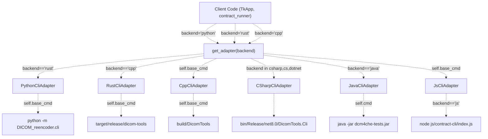
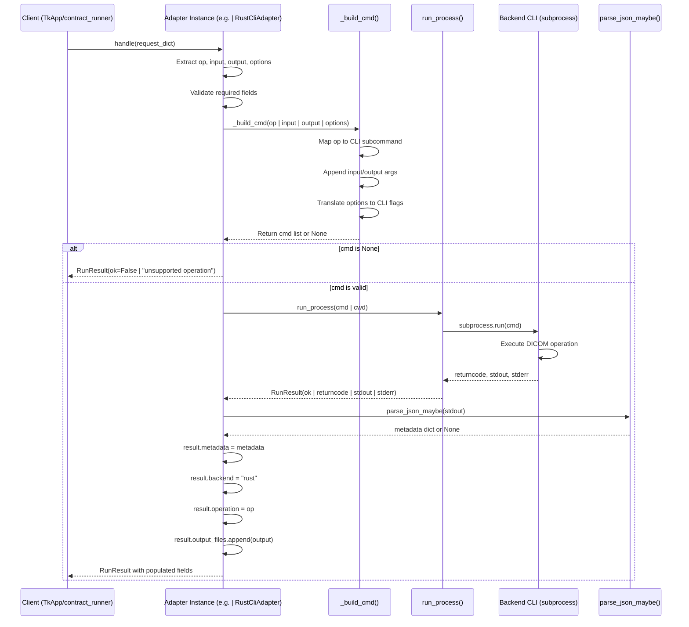
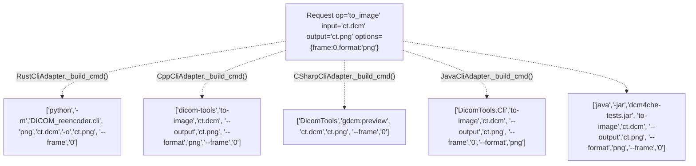
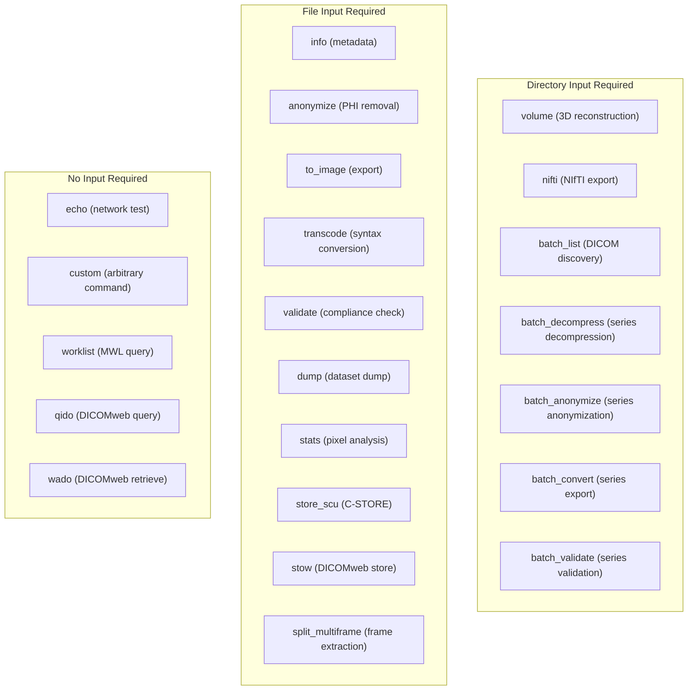
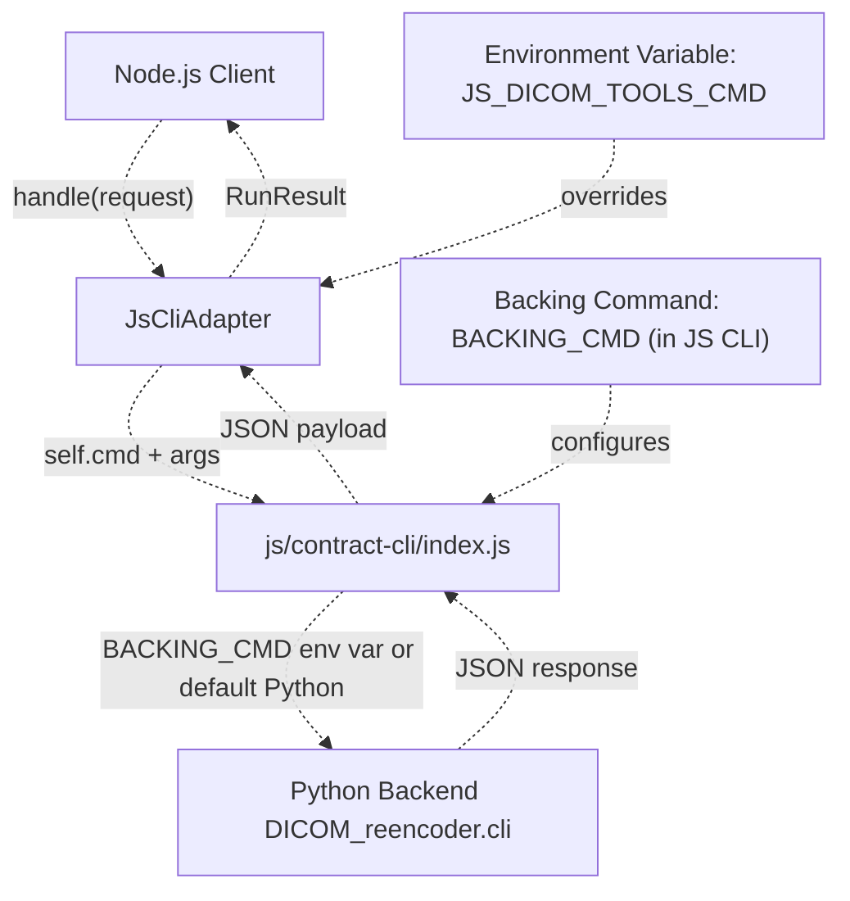

# 3 CLI Contract System

> **Relevant source files**
> * [interface/CONTRACT.md](https://github.com/ThalesMMS/Dicom-Tools/blob/c7b4cbd8/interface/CONTRACT.md)
> * [interface/adapters/__init__.py](https://github.com/ThalesMMS/Dicom-Tools/blob/c7b4cbd8/interface/adapters/__init__.py)
> * [interface/adapters/csharp_cli.py](https://github.com/ThalesMMS/Dicom-Tools/blob/c7b4cbd8/interface/adapters/csharp_cli.py)
> * [interface/adapters/java_cli.py](https://github.com/ThalesMMS/Dicom-Tools/blob/c7b4cbd8/interface/adapters/java_cli.py)
> * [interface/adapters/js_cli.py](https://github.com/ThalesMMS/Dicom-Tools/blob/c7b4cbd8/interface/adapters/js_cli.py)
> * [interface/adapters/python_cli.py](https://github.com/ThalesMMS/Dicom-Tools/blob/c7b4cbd8/interface/adapters/python_cli.py)
> * [interface/adapters/rust_cli.py](https://github.com/ThalesMMS/Dicom-Tools/blob/c7b4cbd8/interface/adapters/rust_cli.py)
> * [interface/tests/test_operation_specs.py](https://github.com/ThalesMMS/Dicom-Tools/blob/c7b4cbd8/interface/tests/test_operation_specs.py)

The CLI Contract System is the central integration mechanism that enables cross-language interoperability in the DICOM Tools repository. It defines a standardized JSON-based request/response protocol that allows multiple programming languages (Python, Rust, C++, C#, Java, JavaScript) to expose DICOM operations through a unified interface. This system decouples user interfaces from backend implementations using an adapter pattern.

For detailed information about the JSON request/response formats and the complete list of canonical operations, see [Contract Specification](3a%20Contract-Specification.md). For implementation details of how adapters translate requests into CLI commands, see [Adapter Pattern](3b%20Adapter-Pattern.md). For configuration options, see [Environment Configuration](3c%20Environment-Configuration.md).

---

## Core Architecture

The CLI Contract System implements a hub-and-spoke architecture where the contract serves as the universal interface between consumers (GUI, scripts) and backend implementations. Each backend exposes its functionality through command-line executables that accept and return data in the contract-defined format.

### Request/Response Envelope

The contract defines a simple JSON envelope structure for both requests and responses.

**Request Envelope Structure**:

```
{  "backend": "python | rust | cpp | csharp | java | js",  "op": "operation_name",  "input": "/path/to/input",  "output": "/path/to/output (optional)",  "options": { "key": "value" }}
```

**Response Envelope Structure**:

```
{  "ok": true,  "returncode": 0,  "stdout": "process output",  "stderr": "errors/warnings",  "output_files": ["/list/of/generated/files"],  "metadata": { "structured_data": "..." }}
```

The `RunResult` dataclass encapsulates response data and is returned by all adapter `handle()` methods [interface/adapters/runner.py L1-L20](https://github.com/ThalesMMS/Dicom-Tools/blob/c7b4cbd8/interface/adapters/runner.py#L1-L20)

Sources: [interface/CONTRACT.md L5-L26](https://github.com/ThalesMMS/Dicom-Tools/blob/c7b4cbd8/interface/CONTRACT.md#L5-L26)

 [interface/adapters/python_cli.py L1-L10](https://github.com/ThalesMMS/Dicom-Tools/blob/c7b4cbd8/interface/adapters/python_cli.py#L1-L10)

 [interface/adapters/rust_cli.py L1-L10](https://github.com/ThalesMMS/Dicom-Tools/blob/c7b4cbd8/interface/adapters/rust_cli.py#L1-L10)

---

## Adapter Factory Pattern

The adapter system uses a factory function to instantiate language-specific adapters based on the requested backend. The `get_adapter()` function provides runtime polymorphism, allowing the same client code to work with any backend implementation.

### Adapter Factory Implementation



The factory function [interface/adapters/__init__.py L10-L24](https://github.com/ThalesMMS/Dicom-Tools/blob/c7b4cbd8/interface/adapters/__init__.py#L10-L24)

 performs case-insensitive backend matching and raises `ValueError` for unsupported backends. Each adapter class initializes its `base_cmd` or `cmd` attribute during `__init__()`, resolving the CLI executable path from environment variables or default locations.

| Backend | Adapter Class | Default Command | Environment Override |
| --- | --- | --- | --- |
| Python | `PythonCliAdapter` | `python -m DICOM_reencoder.cli` | `PYTHON_DICOM_TOOLS_CMD` |
| Rust | `RustCliAdapter` | `rust/target/release/dicom-tools` | `RUST_DICOM_TOOLS_BIN` or `RUST_DICOM_TOOLS_CMD` |
| C++ | `CppCliAdapter` | `cpp/build/DicomTools` | `CPP_DICOM_TOOLS_BIN` |
| C# | `CSharpCliAdapter` | `cs/bin/Release/net8.0/DicomTools.Cli` | `CS_DICOM_TOOLS_CMD` |
| Java | `JavaCliAdapter` | `java -jar java/.../dcm4che-tests.jar` | `JAVA_DICOM_TOOLS_CMD` |
| JavaScript | `JsCliAdapter` | `node js/contract-cli/index.js` | `JS_DICOM_TOOLS_CMD` |

Sources: [interface/adapters/__init__.py L1-L24](https://github.com/ThalesMMS/Dicom-Tools/blob/c7b4cbd8/interface/adapters/__init__.py#L1-L24)

 [interface/adapters/python_cli.py L12-L16](https://github.com/ThalesMMS/Dicom-Tools/blob/c7b4cbd8/interface/adapters/python_cli.py#L12-L16)

 [interface/adapters/rust_cli.py L11-L26](https://github.com/ThalesMMS/Dicom-Tools/blob/c7b4cbd8/interface/adapters/rust_cli.py#L11-L26)

 [interface/adapters/csharp_cli.py L11-L29](https://github.com/ThalesMMS/Dicom-Tools/blob/c7b4cbd8/interface/adapters/csharp_cli.py#L11-L29)

---

## Request Processing Flow

When a client submits a request, the adapter translates the generic contract envelope into backend-specific CLI arguments and executes the command as a subprocess. The adapter then parses the output and constructs a `RunResult` response.

### End-to-End Request Flow



Each adapter's `handle()` method follows this pattern:

1. **Extract request fields**: `op`, `input`, `output`, `options` [interface/adapters/rust_cli.py L29-L32](https://github.com/ThalesMMS/Dicom-Tools/blob/c7b4cbd8/interface/adapters/rust_cli.py#L29-L32)
2. **Validate inputs**: Check for required fields, handle operations that don't need input [interface/adapters/python_cli.py L24-L26](https://github.com/ThalesMMS/Dicom-Tools/blob/c7b4cbd8/interface/adapters/python_cli.py#L24-L26)
3. **Build CLI command**: Call `_build_cmd()` to translate the request into CLI arguments [interface/adapters/rust_cli.py L38](https://github.com/ThalesMMS/Dicom-Tools/blob/c7b4cbd8/interface/adapters/rust_cli.py#L38-L38)
4. **Execute subprocess**: Use `run_process()` helper to spawn the CLI process [interface/adapters/rust_cli.py L42](https://github.com/ThalesMMS/Dicom-Tools/blob/c7b4cbd8/interface/adapters/rust_cli.py#L42-L42)
5. **Parse output**: Extract JSON metadata from stdout if present [interface/adapters/rust_cli.py L43-L45](https://github.com/ThalesMMS/Dicom-Tools/blob/c7b4cbd8/interface/adapters/rust_cli.py#L43-L45)
6. **Populate result**: Set backend/operation identifiers and output file paths [interface/adapters/rust_cli.py L46-L49](https://github.com/ThalesMMS/Dicom-Tools/blob/c7b4cbd8/interface/adapters/rust_cli.py#L46-L49)

Sources: [interface/adapters/rust_cli.py L28-L50](https://github.com/ThalesMMS/Dicom-Tools/blob/c7b4cbd8/interface/adapters/rust_cli.py#L28-L50)

 [interface/adapters/python_cli.py L18-L43](https://github.com/ThalesMMS/Dicom-Tools/blob/c7b4cbd8/interface/adapters/python_cli.py#L18-L43)

 [interface/adapters/runner.py L60-L75](https://github.com/ThalesMMS/Dicom-Tools/blob/c7b4cbd8/interface/adapters/runner.py#L60-L75)

---

## Command Building Strategy

The `_build_cmd()` method is the core translation layer in each adapter. It maps contract operations to backend-specific CLI invocations, handles output path inference, and translates generic options into backend-specific flags.

### Operation Translation Example



**Key translation patterns**:

1. **Operation name mapping**: Contract operations may map to different CLI subcommands * `to_image` → `png` (Python) [interface/adapters/python_cli.py L56-L61](https://github.com/ThalesMMS/Dicom-Tools/blob/c7b4cbd8/interface/adapters/python_cli.py#L56-L61) * `to_image` → `to-image` (Rust, C#, Java) [interface/adapters/rust_cli.py L65-L86](https://github.com/ThalesMMS/Dicom-Tools/blob/c7b4cbd8/interface/adapters/rust_cli.py#L65-L86) * `to_image` → `gdcm:preview` (C++) [interface/adapters/cpp_cli.py L100-L110](https://github.com/ThalesMMS/Dicom-Tools/blob/c7b4cbd8/interface/adapters/cpp_cli.py#L100-L110)
2. **Output path inference**: When `output` is not provided, adapters generate default paths * Python: `_infer_output(input_path, suffix="_anonymized")` [interface/adapters/python_cli.py L167-L171](https://github.com/ThalesMMS/Dicom-Tools/blob/c7b4cbd8/interface/adapters/python_cli.py#L167-L171) * Rust: `_infer_output(input_path, suffix="_anonymized.dcm")` [interface/adapters/rust_cli.py L146-L150](https://github.com/ThalesMMS/Dicom-Tools/blob/c7b4cbd8/interface/adapters/rust_cli.py#L146-L150) * C#: `Path(input_path).with_name(f"{Path(input_path).stem}_anon.dcm")` [interface/adapters/csharp_cli.py L74](https://github.com/ThalesMMS/Dicom-Tools/blob/c7b4cbd8/interface/adapters/csharp_cli.py#L74-L74)
3. **Options translation**: Generic options are converted to backend-specific flags * `options.frame` → `--frame N` (most backends) [interface/adapters/rust_cli.py L70-L71](https://github.com/ThalesMMS/Dicom-Tools/blob/c7b4cbd8/interface/adapters/rust_cli.py#L70-L71) * `options.syntax` → `--transfer-syntax SYNTAX` (Rust) [interface/adapters/rust_cli.py L97-L98](https://github.com/ThalesMMS/Dicom-Tools/blob/c7b4cbd8/interface/adapters/rust_cli.py#L97-L98) * `options.syntax` → `--syntax SYNTAX` (Java) [interface/adapters/java_cli.py L64](https://github.com/ThalesMMS/Dicom-Tools/blob/c7b4cbd8/interface/adapters/java_cli.py#L64-L64)
4. **Unsupported operations**: Return `None` to signal the operation isn't available [interface/adapters/rust_cli.py L144](https://github.com/ThalesMMS/Dicom-Tools/blob/c7b4cbd8/interface/adapters/rust_cli.py#L144-L144)

Sources: [interface/adapters/python_cli.py L45-L165](https://github.com/ThalesMMS/Dicom-Tools/blob/c7b4cbd8/interface/adapters/python_cli.py#L45-L165)

 [interface/adapters/rust_cli.py L52-L144](https://github.com/ThalesMMS/Dicom-Tools/blob/c7b4cbd8/interface/adapters/rust_cli.py#L52-L144)

 [interface/adapters/csharp_cli.py L69-L181](https://github.com/ThalesMMS/Dicom-Tools/blob/c7b4cbd8/interface/adapters/csharp_cli.py#L69-L181)

 [interface/adapters/java_cli.py L47-L167](https://github.com/ThalesMMS/Dicom-Tools/blob/c7b4cbd8/interface/adapters/java_cli.py#L47-L167)

---

## Backend Capability Matrix

Not all backends support all operations. The contract defines a comprehensive set of canonical operations, but each backend implements a subset based on its underlying library capabilities.

### Core Operations Support

| Operation | Python | Rust | C++ | C# | Java | JS |
| --- | --- | --- | --- | --- | --- | --- |
| `info` | ✓ | ✓ | ✓ | ✓ | ✓ | ✓ (via Python) |
| `anonymize` | ✓ | ✓ | ✓ | ✓ | ✓ | ✓ (via Python) |
| `to_image` | ✓ | ✓ | ✓ | ✓ | ✓ | ✓ (via Python) |
| `transcode` | ✓ | ✓ | ✓ | ✓ | ✓ | ✓ (via Python) |
| `validate` | ✓ | ✓ | ✗ | ✓ | ✓ | ✓ (via Python) |
| `echo` | ✓ | ✓ | ✓ | ✓ | ✓ | ✓ (via Python) |
| `dump` | ✓ | ✓ | ✓ | ✓ | ✓ | ✓ (via Python) |
| `stats` | ✓ | ✓ | ✓ | ✓ | ✓ | ✓ (via Python) |
| `histogram` | ✗ | ✓ | ✗ | ✓ | ✓ | ✗ |

### Advanced Operations Support

| Operation | Python | Rust | C++ | C# | Java | JS |
| --- | --- | --- | --- | --- | --- | --- |
| `volume` | ✓ | ✗ | ✗ | ✗ | ✗ | ✓ (via Python) |
| `nifti` | ✓ | ✗ | ✗ | ✗ | ✗ | ✓ (via Python) |
| `to_json` | ✗ | ✓ | ✗ | ✗ | ✗ | ✗ |
| `from_json` | ✗ | ✓ | ✗ | ✗ | ✗ | ✗ |
| `store_scu` | ✗ | ✗ | ✗ | ✓ | ✓ | ✗ |
| `worklist` | ✗ | ✗ | ✗ | ✓ | ✓ | ✗ |
| `qido` | ✗ | ✗ | ✗ | ✓ | ✓ | ✗ |
| `stow` | ✗ | ✗ | ✗ | ✓ | ✓ | ✗ |
| `wado` | ✗ | ✗ | ✗ | ✓ | ✓ | ✗ |
| `sr_summary` | ✗ | ✗ | ✗ | ✓ | ✓ | ✗ |
| `rt_check` | ✗ | ✗ | ✗ | ✓ | ✓ | ✗ |

### Batch Operations Support

| Operation | Python | Rust | C++ | C# | Java | JS |
| --- | --- | --- | --- | --- | --- | --- |
| `batch_list` | ✓ | ✗ | ✗ | ✗ | ✗ | ✗ |
| `batch_decompress` | ✓ | ✗ | ✗ | ✗ | ✗ | ✗ |
| `batch_anonymize` | ✓ | ✗ | ✗ | ✗ | ✗ | ✗ |
| `batch_convert` | ✓ | ✗ | ✗ | ✗ | ✗ | ✗ |
| `batch_validate` | ✓ | ✗ | ✗ | ✗ | ✗ | ✗ |
| `split_multiframe` | ✓ | ✗ | ✗ | ✗ | ✗ | ✗ |

**Key insights**:

* **Python**: Broadest coverage with 20+ operations, including batch processing and volume operations [interface/CONTRACT.md L77](https://github.com/ThalesMMS/Dicom-Tools/blob/c7b4cbd8/interface/CONTRACT.md#L77-L77)
* **Rust**: Modern features like JSON export/import, strong validation [interface/CONTRACT.md L78](https://github.com/ThalesMMS/Dicom-Tools/blob/c7b4cbd8/interface/CONTRACT.md#L78-L78)
* **C++**: Advanced visualization (VTK), specialized test operations [interface/CONTRACT.md L79](https://github.com/ThalesMMS/Dicom-Tools/blob/c7b4cbd8/interface/CONTRACT.md#L79-L79)
* **C#/Java**: Complete network operations (DICOM network, DICOMweb), SR/RT support [interface/CONTRACT.md L80-L81](https://github.com/ThalesMMS/Dicom-Tools/blob/c7b4cbd8/interface/CONTRACT.md#L80-L81)
* **JavaScript**: Shim adapter that delegates to Python for actual processing [interface/CONTRACT.md L82](https://github.com/ThalesMMS/Dicom-Tools/blob/c7b4cbd8/interface/CONTRACT.md#L82-L82)

Sources: [interface/CONTRACT.md L28-L74](https://github.com/ThalesMMS/Dicom-Tools/blob/c7b4cbd8/interface/CONTRACT.md#L28-L74)

 [interface/adapters/python_cli.py L45-L165](https://github.com/ThalesMMS/Dicom-Tools/blob/c7b4cbd8/interface/adapters/python_cli.py#L45-L165)

 [interface/adapters/rust_cli.py L52-L144](https://github.com/ThalesMMS/Dicom-Tools/blob/c7b4cbd8/interface/adapters/rust_cli.py#L52-L144)

 [interface/adapters/csharp_cli.py L69-L181](https://github.com/ThalesMMS/Dicom-Tools/blob/c7b4cbd8/interface/adapters/csharp_cli.py#L69-L181)

 [interface/adapters/java_cli.py L47-L167](https://github.com/ThalesMMS/Dicom-Tools/blob/c7b4cbd8/interface/adapters/java_cli.py#L47-L167)

---

## Operation Requirements

Operations have varying requirements for input, output, and options. The contract system enforces these requirements through validation in adapter `handle()` methods.

### Input Requirements Mapping



**Validation patterns**:

* Operations with no input requirements: `op not in {"echo", "custom", "worklist", "qido", "wado"}` [interface/adapters/java_cli.py L25](https://github.com/ThalesMMS/Dicom-Tools/blob/c7b4cbd8/interface/adapters/java_cli.py#L25-L25)
* Early validation: `if not op or (requires_input and not input_path): return RunResult(...)` [interface/adapters/python_cli.py L25-L26](https://github.com/ThalesMMS/Dicom-Tools/blob/c7b4cbd8/interface/adapters/python_cli.py#L25-L26)
* Operation-specific validation: Custom commands check for `options.custom_cmd` [interface/adapters/rust_cli.py L137-L139](https://github.com/ThalesMMS/Dicom-Tools/blob/c7b4cbd8/interface/adapters/rust_cli.py#L137-L139)

Sources: [interface/adapters/python_cli.py L24-L26](https://github.com/ThalesMMS/Dicom-Tools/blob/c7b4cbd8/interface/adapters/python_cli.py#L24-L26)

 [interface/adapters/rust_cli.py L34-L36](https://github.com/ThalesMMS/Dicom-Tools/blob/c7b4cbd8/interface/adapters/rust_cli.py#L34-L36)

 [interface/adapters/csharp_cli.py L37-L54](https://github.com/ThalesMMS/Dicom-Tools/blob/c7b4cbd8/interface/adapters/csharp_cli.py#L37-L54)

 [interface/adapters/java_cli.py L25-L28](https://github.com/ThalesMMS/Dicom-Tools/blob/c7b4cbd8/interface/adapters/java_cli.py#L25-L28)

 [interface/tests/test_operation_specs.py L1-L56](https://github.com/ThalesMMS/Dicom-Tools/blob/c7b4cbd8/interface/tests/test_operation_specs.py#L1-L56)

---

## JavaScript Shim Adapter

The JavaScript adapter is unique—it implements the contract interface but delegates actual DICOM processing to the Python backend. This enables Node.js environments to use the toolkit without a native JavaScript DICOM implementation.

### JavaScript Delegation Pattern



The JavaScript adapter constructs CLI arguments differently than other adapters:

1. **Direct JSON options**: Pass `--options '{"key": "value"}'` instead of individual flags [interface/adapters/js_cli.py L45-L46](https://github.com/ThalesMMS/Dicom-Tools/blob/c7b4cbd8/interface/adapters/js_cli.py#L45-L46)
2. **Operation flag**: Use `--op OPERATION` syntax [interface/adapters/js_cli.py L38-L39](https://github.com/ThalesMMS/Dicom-Tools/blob/c7b4cbd8/interface/adapters/js_cli.py#L38-L39)
3. **JSON response parsing**: Extract `ok`, `returncode`, `output_files`, `metadata` from stdout JSON [interface/adapters/js_cli.py L49-L64](https://github.com/ThalesMMS/Dicom-Tools/blob/c7b4cbd8/interface/adapters/js_cli.py#L49-L64)

The underlying `js/contract-cli/index.js` script translates these arguments back into a Python CLI invocation, making it a transparent proxy.

Sources: [interface/adapters/js_cli.py L1-L68](https://github.com/ThalesMMS/Dicom-Tools/blob/c7b4cbd8/interface/adapters/js_cli.py#L1-L68)

 [interface/CONTRACT.md L82](https://github.com/ThalesMMS/Dicom-Tools/blob/c7b4cbd8/interface/CONTRACT.md#L82-L82)

---

## Custom Commands

All adapters support a special `custom` operation that allows arbitrary CLI command execution with `{input}` and `{output}` placeholder substitution. This provides an escape hatch for backend-specific functionality not covered by canonical operations.

**Custom command pattern**:

```
if op == "custom":    custom_cmd = options.get("custom_cmd")    if not custom_cmd:        return None    parts = split_cmd(str(custom_cmd))    parts = [str(input_path) if p == "{input}" else str(output) if p == "{output}" else p for p in parts]    return [*self.base_cmd, *parts]
```

This pattern appears in [interface/adapters/python_cli.py L156-L163](https://github.com/ThalesMMS/Dicom-Tools/blob/c7b4cbd8/interface/adapters/python_cli.py#L156-L163)

 [interface/adapters/rust_cli.py L136-L142](https://github.com/ThalesMMS/Dicom-Tools/blob/c7b4cbd8/interface/adapters/rust_cli.py#L136-L142)

 [interface/adapters/csharp_cli.py L174-L180](https://github.com/ThalesMMS/Dicom-Tools/blob/c7b4cbd8/interface/adapters/csharp_cli.py#L174-L180)

 and [interface/adapters/java_cli.py L160-L166](https://github.com/ThalesMMS/Dicom-Tools/blob/c7b4cbd8/interface/adapters/java_cli.py#L160-L166)

Sources: [interface/adapters/python_cli.py L156-L163](https://github.com/ThalesMMS/Dicom-Tools/blob/c7b4cbd8/interface/adapters/python_cli.py#L156-L163)

 [interface/adapters/rust_cli.py L136-L142](https://github.com/ThalesMMS/Dicom-Tools/blob/c7b4cbd8/interface/adapters/rust_cli.py#L136-L142)

 [interface/adapters/csharp_cli.py L174-L180](https://github.com/ThalesMMS/Dicom-Tools/blob/c7b4cbd8/interface/adapters/csharp_cli.py#L174-L180)

 [interface/adapters/java_cli.py L160-L166](https://github.com/ThalesMMS/Dicom-Tools/blob/c7b4cbd8/interface/adapters/java_cli.py#L160-L166)

---

## Error Handling

The contract system uses consistent error handling across all adapters:

1. **Validation errors**: Return `RunResult(ok=False, returncode=1, stderr="error message")` [interface/adapters/python_cli.py L26](https://github.com/ThalesMMS/Dicom-Tools/blob/c7b4cbd8/interface/adapters/python_cli.py#L26-L26)
2. **Unsupported operations**: Return error result when `_build_cmd()` returns `None` [interface/adapters/rust_cli.py L39-L40](https://github.com/ThalesMMS/Dicom-Tools/blob/c7b4cbd8/interface/adapters/rust_cli.py#L39-L40)
3. **Process failures**: Capture subprocess return code and stderr [interface/adapters/runner.py L60-L75](https://github.com/ThalesMMS/Dicom-Tools/blob/c7b4cbd8/interface/adapters/runner.py#L60-L75)
4. **JSON parsing failures**: Gracefully handle non-JSON stdout [interface/adapters/rust_cli.py L43-L45](https://github.com/ThalesMMS/Dicom-Tools/blob/c7b4cbd8/interface/adapters/rust_cli.py#L43-L45)

The `RunResult` dataclass includes `ok` boolean flag for quick success/failure checks, while `returncode` preserves the actual exit status for detailed diagnostics.

Sources: [interface/adapters/python_cli.py L26](https://github.com/ThalesMMS/Dicom-Tools/blob/c7b4cbd8/interface/adapters/python_cli.py#L26-L26)

 [interface/adapters/rust_cli.py L39-L40](https://github.com/ThalesMMS/Dicom-Tools/blob/c7b4cbd8/interface/adapters/rust_cli.py#L39-L40)

 [interface/adapters/runner.py L60-L75](https://github.com/ThalesMMS/Dicom-Tools/blob/c7b4cbd8/interface/adapters/runner.py#L60-L75)

 [interface/adapters/rust_cli.py L43-L45](https://github.com/ThalesMMS/Dicom-Tools/blob/c7b4cbd8/interface/adapters/rust_cli.py#L43-L45)


### On this page

* [CLI Contract System](3%20CLI-Contract-System.md)
* [Core Architecture](3%20CLI-Contract-System.md)
* [Request/Response Envelope](3%20CLI-Contract-System.md)
* [Adapter Factory Pattern](3%20CLI-Contract-System.md)
* [Adapter Factory Implementation](3%20CLI-Contract-System.md)
* [Request Processing Flow](3%20CLI-Contract-System.md)
* [End-to-End Request Flow](3%20CLI-Contract-System.md)
* [Command Building Strategy](3%20CLI-Contract-System.md)
* [Operation Translation Example](3%20CLI-Contract-System.md)
* [Backend Capability Matrix](3%20CLI-Contract-System.md)
* [Core Operations Support](3%20CLI-Contract-System.md)
* [Advanced Operations Support](3%20CLI-Contract-System.md)
* [Batch Operations Support](3%20CLI-Contract-System.md)
* [Operation Requirements](3%20CLI-Contract-System.md)
* [Input Requirements Mapping](3%20CLI-Contract-System.md)
* [JavaScript Shim Adapter](3%20CLI-Contract-System.md)
* [JavaScript Delegation Pattern](3%20CLI-Contract-System.md)
* [Custom Commands](3%20CLI-Contract-System.md)
* [Error Handling](3%20CLI-Contract-System.md)

Ask Devin about Dicom-Tools