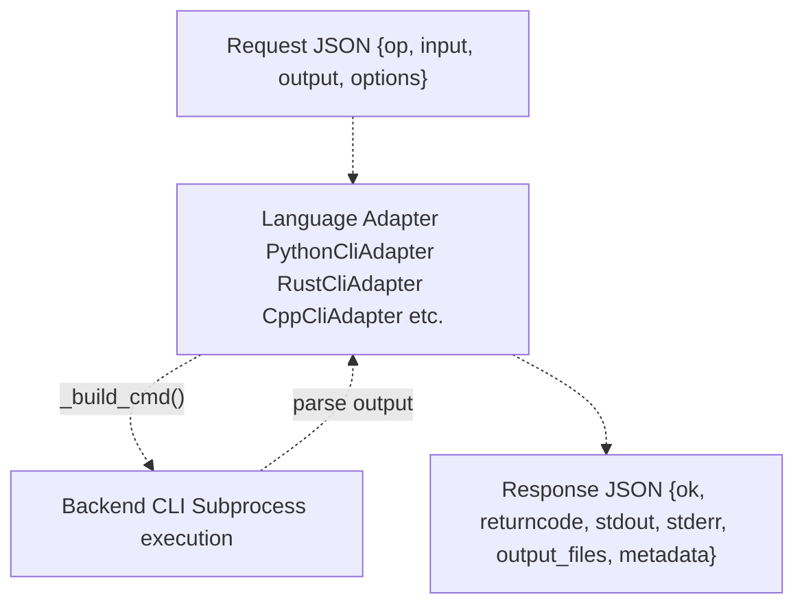
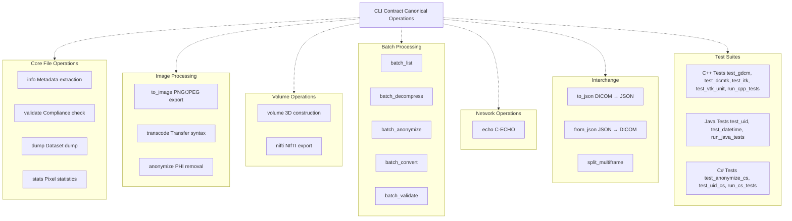
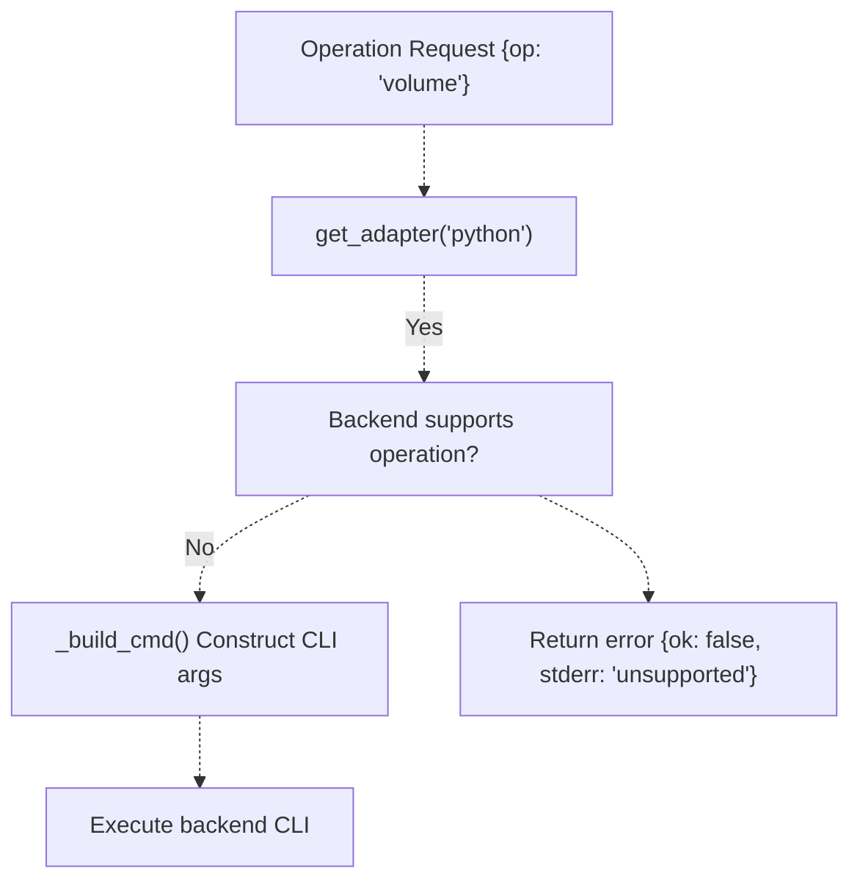
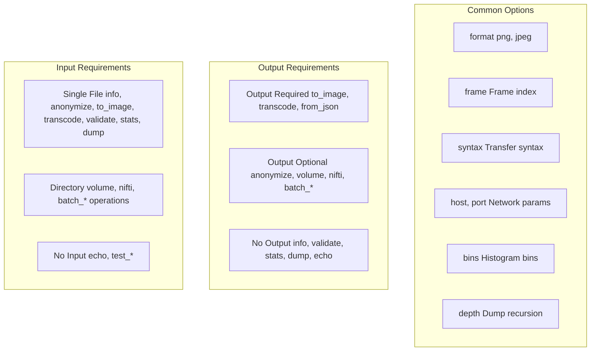

# Contract Specification

> **Relevant source files**
> * [interface/CONTRACT.md](https://github.com/ThalesMMS/Dicom-Tools/blob/c7b4cbd8/interface/CONTRACT.md)
> * [interface/adapters/__init__.py](https://github.com/ThalesMMS/Dicom-Tools/blob/c7b4cbd8/interface/adapters/__init__.py)
> * [interface/adapters/js_cli.py](https://github.com/ThalesMMS/Dicom-Tools/blob/c7b4cbd8/interface/adapters/js_cli.py)
> * [interface/adapters/python_cli.py](https://github.com/ThalesMMS/Dicom-Tools/blob/c7b4cbd8/interface/adapters/python_cli.py)

## Purpose and Scope

This document specifies the CLI contract that enables language-agnostic interoperability across all DICOM Tools backends. The contract defines a standardized JSON-based request/response envelope format and a canonical set of DICOM operations that all backends can implement.

For information about how adapters translate contract requests into backend-specific CLI invocations, see [Adapter Pattern](#3.2). For environment variable configuration of backend executables, see [Environment Configuration](#3.3).

**Sources:** [interface/CONTRACT.md L1-L13](https://github.com/ThalesMMS/Dicom-Tools/blob/c7b4cbd8/interface/CONTRACT.md#L1-L13)

---

## Request Envelope Format

All operations are invoked using a standardized JSON request structure:

```
{  "backend": "python | cpp | rust | java | csharp | js",  "op": "<operation_name>",  "input": "/path/to/input_file_or_directory",  "output": "/path/to/optional_output",  "options": { "key": "value" }}
```

### Request Fields

| Field | Type | Required | Description |
| --- | --- | --- | --- |
| `backend` | string | Yes | Target backend: `python`, `cpp`, `rust`, `java`, `csharp`, or `js` |
| `op` | string | Yes | Canonical operation name (see Operations table below) |
| `input` | string | Conditional | Path to input DICOM file or directory. Required for most operations except `echo` and `custom` |
| `output` | string | No | Path for output file or directory. If omitted, backends infer location |
| `options` | object | No | Operation-specific parameters passed as key-value pairs |

**Sources:** [interface/CONTRACT.md L5-L14](https://github.com/ThalesMMS/Dicom-Tools/blob/c7b4cbd8/interface/CONTRACT.md#L5-L14)

---

## Response Envelope Format

Backends return results using a standardized JSON response structure:

```
{  "ok": true,  "returncode": 0,  "stdout": "process output text",  "stderr": "warnings/errors",  "output_files": ["/list/of/generated/files"],  "metadata": { "normalized_structure_or_null": "..." }}
```

### Response Fields

| Field | Type | Description |
| --- | --- | --- |
| `ok` | boolean | Operation success indicator. `true` if operation completed successfully |
| `returncode` | integer | Process exit code. `0` indicates success |
| `stdout` | string | Standard output from the backend process |
| `stderr` | string | Standard error output, warnings, or error messages |
| `output_files` | array | List of file paths generated by the operation |
| `metadata` | object/null | Structured metadata extracted from DICOM files (format varies by operation) |

**Sources:** [interface/CONTRACT.md L16-L26](https://github.com/ThalesMMS/Dicom-Tools/blob/c7b4cbd8/interface/CONTRACT.md#L16-L26)

---

## Request/Response Flow Diagram



**Sources:** [interface/adapters/python_cli.py L18-L43](https://github.com/ThalesMMS/Dicom-Tools/blob/c7b4cbd8/interface/adapters/python_cli.py#L18-L43)

 [interface/adapters/__init__.py L1-L24](https://github.com/ThalesMMS/Dicom-Tools/blob/c7b4cbd8/interface/adapters/__init__.py#L1-L24)

---

## Canonical Operations

The contract defines a comprehensive set of DICOM operations organized into functional categories. Each operation has a standardized name (`op` field), expected parameters, and output format.

### Core File Operations

| Operation | Description | Required Parameters | Output |
| --- | --- | --- | --- |
| `info` | Extract basic metadata | `input`, `options.verbose?` | `metadata` + `stdout` |
| `validate` | Basic DICOM compliance validation | `input` | `stdout` with validation results |
| `dump` | Complete dataset dump | `input`, `options.depth?`, `options.max_value_len?`, `options.json?` | `stdout` (text or JSON) |
| `stats` | Pixel statistics and histogram | `input`, `options.bins?` | `stdout` + `metadata` (backend-dependent) |

### Image Processing Operations

| Operation | Description | Required Parameters | Output |
| --- | --- | --- | --- |
| `to_image` | Export frame to PNG/JPEG | `input`, `output`, `options.format?`, `options.frame?` | Image file in `output_files` |
| `transcode` | Change transfer syntax | `input`, `output`, `options.syntax` | Transcoded DICOM in `output_files` |
| `anonymize` | Remove PHI from DICOM | `input`, `output?` | Anonymized file in `output_files` |

### Volume Operations

| Operation | Description | Required Parameters | Output |
| --- | --- | --- | --- |
| `volume` | Construct 3D volume | `input` (directory), `output?`, `options.preview?` | `.npy` file + metadata |
| `nifti` | Export series to NIfTI | `input` (directory), `output?`, `options.series_uid?` | `.nii/.nii.gz` + metadata |

### Batch Operations

| Operation | Description | Required Parameters | Output |
| --- | --- | --- | --- |
| `batch_list` | List DICOMs in directory | `input` (directory), `options.recursive?` | `stdout` with file list |
| `batch_decompress` | Decompress DICOM series | `input`, `output?`, `options.recursive?` | Decompressed files |
| `batch_anonymize` | Anonymize DICOM series | `input`, `output?`, `options.recursive?` | Anonymized files |
| `batch_convert` | Convert series to images | `input`, `output?`, `options.format?`, `options.recursive?` | Image files |
| `batch_validate` | Validate DICOM series | `input`, `options.recursive?` | `stdout` with validation status |

### Network Operations

| Operation | Description | Required Parameters | Output |
| --- | --- | --- | --- |
| `echo` | DICOM C-ECHO verification | `options.host`, `options.port` | `stdout` with status |

### Interchange Operations

| Operation | Description | Required Parameters | Output |
| --- | --- | --- | --- |
| `to_json` | Export to DICOM JSON | `input`, `output?` | JSON file or `stdout` |
| `from_json` | Convert DICOM JSON to DICOM | `input` (JSON), `output` (DICOM) | DICOM file |
| `split_multiframe` | Split multi-frame into single frames | `input`, `output?`, `options.prefix?`, `options.frames?`, `options.info?` | Multiple `.dcm` files or info text |

### Test Operations

Test operations execute backend-specific test suites and do not require meaningful `input` values:

| Operation | Backend | Description |
| --- | --- | --- |
| `test_gdcm` | C++ | GDCM unit tests |
| `test_dcmtk` | C++ | DCMTK unit tests |
| `test_itk` | C++ | ITK unit tests |
| `test_vtk_unit` | C++ | VTK unit tests |
| `test_utils` | C++ | C++ utility tests |
| `test_integration` | C++ | GDCM/DCMTK integration tests |
| `test_edge_cases` | C++ | C++ edge case tests |
| `test_validation` | C++ | C++ validation tests |
| `run_cpp_tests` | C++ | All C++ tests |
| `test_uid` | Java | dcm4che UID tests |
| `test_datetime` | Java | dcm4che date/time tests |
| `test_charset` | Java | dcm4che charset tests |
| `test_workflow` | Java | dcm4che workflow tests |
| `test_validation_java` | Java | dcm4che validation tests |
| `run_java_tests` | Java | All Java tests |
| `test_anonymize_cs` | C# | fo-dicom anonymization tests |
| `test_uid_cs` | C# | fo-dicom UID tests |
| `test_datetime_cs` | C# | fo-dicom date/time tests |
| `test_charset_cs` | C# | fo-dicom charset tests |
| `test_dictionary_cs` | C# | fo-dicom dictionary tests |
| `test_file_operations_cs` | C# | fo-dicom file operations tests |
| `test_sequence_cs` | C# | fo-dicom sequence tests |
| `test_value_representation_cs` | C# | fo-dicom VR tests |
| `test_option_parser_cs` | C# | fo-dicom option parser tests |
| `test_stats_helpers_cs` | C# | fo-dicom statistics helpers tests |
| `run_cs_tests` | C# | All C# tests |

**Sources:** [interface/CONTRACT.md L28-L74](https://github.com/ThalesMMS/Dicom-Tools/blob/c7b4cbd8/interface/CONTRACT.md#L28-L74)

---

## Operation Categories Diagram



**Sources:** [interface/CONTRACT.md L28-L74](https://github.com/ThalesMMS/Dicom-Tools/blob/c7b4cbd8/interface/CONTRACT.md#L28-L74)

---

## Backend Operation Support

Different backends implement different subsets of operations based on their library capabilities. The contract allows backends to return errors for unsupported operations.



### Minimum Backend Mappings

Each backend maps canonical operations to its native CLI commands:

**Python** (`python -m DICOM_reencoder.cli`):

* `info` → `summary --json`
* `anonymize` → `anonymize`
* `to_image` → `png`
* `transcode` → `transcode`
* `validate` → `python -m DICOM_reencoder.validate_dicom`
* `echo` → `dicom_echo`
* `volume` → `volume`
* `nifti` → `nifti`
* Batch operations → `python -m DICOM_reencoder.batch_process -o {list|decompress|anonymize|convert|validate}`

**Rust** (`rust/target/release/dicom-tools`):

* `info` → `info [--json]`
* `anonymize` → `anonymize`
* `to_image` → `to-image`
* `transcode` → `transcode`
* `validate` → `validate`
* `echo` → `echo`
* `dump` → `dump [--json]`
* `stats` → `stats` / `histogram`
* `to_json` → `to-json`
* `from_json` → `from-json`

**C++** (`cpp/build/DicomTools`):

* `info/dump` → `gdcm:dump`
* `anonymize` → `gdcm:anonymize`
* `to_image` → `gdcm:preview`
* `stats` → `gdcm:stats`
* `transcode` → `gdcm:transcode-j2k|gdcm:transcode-rle|gdcm:jpegls` (mapped by `options.syntax`)
* Test operations → various test binaries

**Java** (`java -jar java/dcm4che-tests/target/dcm4che-tests.jar`):

* `info` → `info --json`
* `anonymize` → `anonymize --output`
* `to_image` → `to-image --output [--format] [--frame]`
* `transcode` → `transcode --output --syntax`
* `validate` → `validate`
* `dump` → `dump [--max-width]`
* `stats` → `stats --bins [--json|--pretty]`
* `echo` → `echo host:port [--timeout --calling --called]`

**C#** (`cs/bin/Release/net8.0/DicomTools.Cli`):

* `info` → `info --json`
* `anonymize` → `anonymize --output`
* `to_image` → `to-image --output [--frame] [--format]`
* `transcode` → `transcode --output --transfer-syntax`
* `validate` → `validate`
* `echo` → `echo host:port`
* `dump` → `dump [--depth --max-value-length]`
* `stats` → `stats --json [--frame]`
* `histogram` → `histogram --json [--bins] [--frame]`

**JavaScript** (`node js/contract-cli/index.js`):

* Delegates to Python backend using `BACKING_CMD` environment variable
* Supports: `info`, `anonymize`, `to_image`, `transcode`, `validate`, `stats`, `dump`, `volume`, `nifti`, `echo`

**Sources:** [interface/CONTRACT.md L76-L82](https://github.com/ThalesMMS/Dicom-Tools/blob/c7b4cbd8/interface/CONTRACT.md#L76-L82)

 [interface/adapters/python_cli.py L45-L165](https://github.com/ThalesMMS/Dicom-Tools/blob/c7b4cbd8/interface/adapters/python_cli.py#L45-L165)

---

## Request Example: Image Conversion

```
{  "backend": "rust",  "op": "to_image",  "input": "samples/ct.dcm",  "output": "output/ct.png",  "options": {    "format": "png",    "frame": 0,    "window_center": -600,    "window_width": 1600  }}
```

This request:

1. Targets the Rust backend
2. Executes the `to_image` operation
3. Processes a CT DICOM file
4. Exports frame 0 to PNG format
5. Applies windowing parameters (lung window preset)

**Sources:** [interface/CONTRACT.md L90-L99](https://github.com/ThalesMMS/Dicom-Tools/blob/c7b4cbd8/interface/CONTRACT.md#L90-L99)

---

## Response Example: Successful Conversion

```
{  "ok": true,  "returncode": 0,  "stdout": "Saved output/ct.png",  "stderr": "",  "output_files": ["output/ct.png"],  "metadata": null}
```

This response indicates:

* Operation succeeded (`ok: true`)
* Process exited cleanly (`returncode: 0`)
* Backend logged the output path
* Generated one output file
* No metadata extraction was performed (operation type doesn't produce metadata)

**Sources:** [interface/CONTRACT.md L101-L111](https://github.com/ThalesMMS/Dicom-Tools/blob/c7b4cbd8/interface/CONTRACT.md#L101-L111)

---

## Request Example: Metadata Extraction

```
{  "backend": "python",  "op": "info",  "input": "sample_series/CT_small/IM-0001-0001.dcm",  "options": {    "verbose": true  }}
```

Expected response includes structured metadata:

```
{  "ok": true,  "returncode": 0,  "stdout": "{\"PatientName\": \"Test^Patient\", ...}",  "stderr": "",  "output_files": [],  "metadata": {    "PatientName": "Test^Patient",    "StudyInstanceUID": "1.2.840...",    "SeriesInstanceUID": "1.2.840...",    "Modality": "CT",    "ImageType": ["ORIGINAL", "PRIMARY", "AXIAL"]  }}
```

The `metadata` field contains parsed DICOM attributes in a structured format. The exact schema varies by backend implementation.

**Sources:** [interface/adapters/python_cli.py L32-L36](https://github.com/ThalesMMS/Dicom-Tools/blob/c7b4cbd8/interface/adapters/python_cli.py#L32-L36)

 [interface/adapters/js_cli.py L49-L64](https://github.com/ThalesMMS/Dicom-Tools/blob/c7b4cbd8/interface/adapters/js_cli.py#L49-L64)

---

## Custom Operations

The contract supports a special `custom` operation for executing arbitrary backend-specific commands:

```
{  "backend": "python",  "op": "custom",  "input": "sample.dcm",  "output": "output.dcm",  "options": {    "custom_cmd": "some_module {input} --output {output} --flag"  }}
```

The adapter substitutes `{input}` and `{output}` placeholders with actual paths before execution. This enables advanced use cases not covered by canonical operations.

**Sources:** [interface/adapters/python_cli.py L156-L163](https://github.com/ThalesMMS/Dicom-Tools/blob/c7b4cbd8/interface/adapters/python_cli.py#L156-L163)

 [interface/adapters/js_cli.py L29-L35](https://github.com/ThalesMMS/Dicom-Tools/blob/c7b4cbd8/interface/adapters/js_cli.py#L29-L35)

---

## Error Responses

When operations fail, backends return error information in the response envelope:

```
{  "ok": false,  "returncode": 1,  "stdout": "",  "stderr": "Error: File not found: invalid.dcm",  "output_files": [],  "metadata": null}
```

Common error scenarios:

* **Missing required parameters**: `ok: false`, `stderr` contains validation error
* **Unsupported operation**: `returncode: 1`, `stderr` indicates operation not implemented
* **DICOM parsing errors**: `ok: false`, `stderr` contains library-specific error messages
* **File I/O errors**: `returncode: 1`, `stderr` contains filesystem error details

Adapters validate requests before execution and return early for obvious errors (missing `op`, missing required `input`, etc.).

**Sources:** [interface/adapters/python_cli.py L24-L30](https://github.com/ThalesMMS/Dicom-Tools/blob/c7b4cbd8/interface/adapters/python_cli.py#L24-L30)

 [interface/adapters/js_cli.py L25-L27](https://github.com/ThalesMMS/Dicom-Tools/blob/c7b4cbd8/interface/adapters/js_cli.py#L25-L27)

---

## Operation Requirements Matrix



**Sources:** [interface/CONTRACT.md L28-L74](https://github.com/ThalesMMS/Dicom-Tools/blob/c7b4cbd8/interface/CONTRACT.md#L28-L74)

Refresh this wiki

Last indexed: 5 January 2026 ([c7b4cb](https://github.com/ThalesMMS/Dicom-Tools/commit/c7b4cbd8))

### On this page

* [Contract Specification](#3.1-contract-specification)
* [Purpose and Scope](#3.1-purpose-and-scope)
* [Request Envelope Format](#3.1-request-envelope-format)
* [Request Fields](#3.1-request-fields)
* [Response Envelope Format](#3.1-response-envelope-format)
* [Response Fields](#3.1-response-fields)
* [Request/Response Flow Diagram](#3.1-requestresponse-flow-diagram)
* [Canonical Operations](#3.1-canonical-operations)
* [Core File Operations](#3.1-core-file-operations)
* [Image Processing Operations](#3.1-image-processing-operations)
* [Volume Operations](#3.1-volume-operations)
* [Batch Operations](#3.1-batch-operations)
* [Network Operations](#3.1-network-operations)
* [Interchange Operations](#3.1-interchange-operations)
* [Test Operations](#3.1-test-operations)
* [Operation Categories Diagram](#3.1-operation-categories-diagram)
* [Backend Operation Support](#3.1-backend-operation-support)
* [Minimum Backend Mappings](#3.1-minimum-backend-mappings)
* [Request Example: Image Conversion](#3.1-request-example-image-conversion)
* [Response Example: Successful Conversion](#3.1-response-example-successful-conversion)
* [Request Example: Metadata Extraction](#3.1-request-example-metadata-extraction)
* [Custom Operations](#3.1-custom-operations)
* [Error Responses](#3.1-error-responses)
* [Operation Requirements Matrix](#3.1-operation-requirements-matrix)

Ask Devin about Dicom-Tools