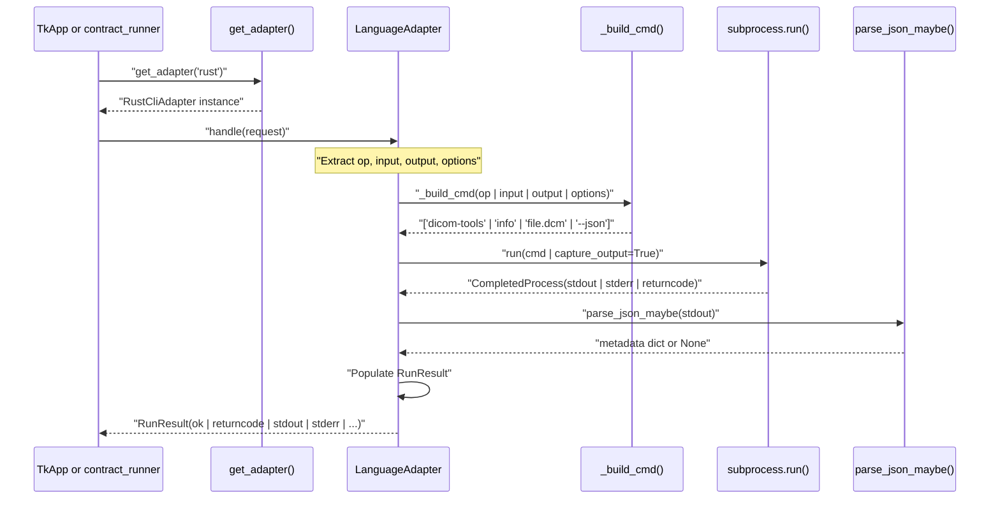
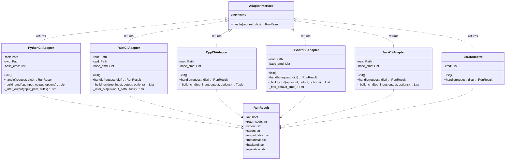

# Adapter Pattern

> **Relevant source files**
> * [interface/CONTRACT.md](https://github.com/ThalesMMS/Dicom-Tools/blob/c7b4cbd8/interface/CONTRACT.md)
> * [interface/adapters/__init__.py](https://github.com/ThalesMMS/Dicom-Tools/blob/c7b4cbd8/interface/adapters/__init__.py)
> * [interface/adapters/cpp_cli.py](https://github.com/ThalesMMS/Dicom-Tools/blob/c7b4cbd8/interface/adapters/cpp_cli.py)
> * [interface/adapters/csharp_cli.py](https://github.com/ThalesMMS/Dicom-Tools/blob/c7b4cbd8/interface/adapters/csharp_cli.py)
> * [interface/adapters/java_cli.py](https://github.com/ThalesMMS/Dicom-Tools/blob/c7b4cbd8/interface/adapters/java_cli.py)
> * [interface/adapters/js_cli.py](https://github.com/ThalesMMS/Dicom-Tools/blob/c7b4cbd8/interface/adapters/js_cli.py)
> * [interface/adapters/python_cli.py](https://github.com/ThalesMMS/Dicom-Tools/blob/c7b4cbd8/interface/adapters/python_cli.py)
> * [interface/adapters/rust_cli.py](https://github.com/ThalesMMS/Dicom-Tools/blob/c7b4cbd8/interface/adapters/rust_cli.py)
> * [interface/app.py](https://github.com/ThalesMMS/Dicom-Tools/blob/c7b4cbd8/interface/app.py)
> * [interface/tests/test_operation_specs.py](https://github.com/ThalesMMS/Dicom-Tools/blob/c7b4cbd8/interface/tests/test_operation_specs.py)

## Purpose and Scope

This page documents the adapter pattern implementation that enables cross-language interoperability in the DICOM Tools repository. The adapter layer translates generic request dictionaries into backend-specific CLI invocations, allowing the TkApp GUI and contract runner to work uniformly with six different language implementations (Python, Rust, C++, C#, Java, JavaScript).

For the complete CLI contract specification that adapters must implement, see [Contract Specification](#3.1). For environment configuration details, see [Environment Configuration](#3.3).

---

## Adapter Architecture

The adapter pattern isolates UI and integration logic from backend CLI implementation details. Each adapter wraps a language-specific command-line tool and translates standardized requests into the appropriate subprocess invocation.

### Factory Function

The `get_adapter()` factory function returns the appropriate adapter instance based on the backend name:

[interface/adapters/__init__.py L10-L24](https://github.com/ThalesMMS/Dicom-Tools/blob/c7b4cbd8/interface/adapters/__init__.py#L10-L24)

```
def get_adapter(backend: str):    backend = backend.lower()    if backend == "python":        return PythonCliAdapter()    if backend == "rust":        return RustCliAdapter()    if backend == "cpp":        return CppCliAdapter()    if backend in {"csharp", "cs", "dotnet"}:        return CSharpCliAdapter()    if backend == "java":        return JavaCliAdapter()    if backend == "js":        return JsCliAdapter()    raise ValueError(f"Backend não suportado: {backend}")
```

**Sources:** [interface/adapters/__init__.py L1-L25](https://github.com/ThalesMMS/Dicom-Tools/blob/c7b4cbd8/interface/adapters/__init__.py#L1-L25)

---

## Adapter Interface

All adapters implement a common interface with a single `handle(request: dict) -> RunResult` method. The request dictionary follows the contract envelope format:

| Field | Type | Description |
| --- | --- | --- |
| `op` | str | Operation name (e.g., "info", "anonymize") |
| `input` | str | Input file or directory path |
| `output` | str \| None | Optional output path |
| `options` | dict | Operation-specific options |

The `RunResult` object contains:

| Field | Type | Description |
| --- | --- | --- |
| `ok` | bool | Overall success status |
| `returncode` | int | Process exit code |
| `stdout` | str | Standard output |
| `stderr` | str | Standard error |
| `output_files` | List[str] | Generated file paths |
| `metadata` | dict \| None | Parsed JSON metadata |
| `backend` | str | Backend identifier |
| `operation` | str | Operation name |

**Sources:** [interface/adapters/python_cli.py L18-L43](https://github.com/ThalesMMS/Dicom-Tools/blob/c7b4cbd8/interface/adapters/python_cli.py#L18-L43)

 [interface/adapters/rust_cli.py L28-L50](https://github.com/ThalesMMS/Dicom-Tools/blob/c7b4cbd8/interface/adapters/rust_cli.py#L28-L50)

---

## Request Flow Sequence



**Sources:** [interface/adapters/rust_cli.py L28-L50](https://github.com/ThalesMMS/Dicom-Tools/blob/c7b4cbd8/interface/adapters/rust_cli.py#L28-L50)

 [interface/adapters/python_cli.py L18-L43](https://github.com/ThalesMMS/Dicom-Tools/blob/c7b4cbd8/interface/adapters/python_cli.py#L18-L43)

---

## Command Translation

Each adapter implements a `_build_cmd()` method that translates generic requests into backend-specific CLI arguments. This is where the adapter pattern's core translation logic resides.

### Example: Python Backend

[interface/adapters/python_cli.py L45-L66](https://github.com/ThalesMMS/Dicom-Tools/blob/c7b4cbd8/interface/adapters/python_cli.py#L45-L66)

The Python adapter constructs commands by:

1. Prefixing with `python -m DICOM_reencoder.cli` (or environment override)
2. Mapping operation names to CLI subcommands (`info` → `summary`)
3. Appending operation-specific flags and options
4. Inferring output paths when not provided

### Example: Rust Backend

[interface/adapters/rust_cli.py L52-L99](https://github.com/ThalesMMS/Dicom-Tools/blob/c7b4cbd8/interface/adapters/rust_cli.py#L52-L99)

The Rust adapter:

1. Uses the compiled binary at `rust/target/release/dicom-tools` or falls back to `cargo run`
2. Translates operation names to Rust CLI format (`to_image` → `to-image`)
3. Supports advanced options like window/level adjustments for imaging operations
4. Appends flags conditionally based on options dictionary

### Example: C++ Backend

[interface/adapters/cpp_cli.py L55-L144](https://github.com/ThalesMMS/Dicom-Tools/blob/c7b4cbd8/interface/adapters/cpp_cli.py#L55-L144)

The C++ adapter has unique characteristics:

1. Maps operations to library-specific subcommands (`info` → `gdcm:dump`)
2. Always outputs to directories rather than individual files
3. Creates output directories automatically via `ensure_dir()`
4. Handles VTK operations with special `vtk:` prefixed commands
5. Maps test operations to individual test executables

**Sources:** [interface/adapters/python_cli.py L45-L172](https://github.com/ThalesMMS/Dicom-Tools/blob/c7b4cbd8/interface/adapters/python_cli.py#L45-L172)

 [interface/adapters/rust_cli.py L52-L151](https://github.com/ThalesMMS/Dicom-Tools/blob/c7b4cbd8/interface/adapters/rust_cli.py#L52-L151)

 [interface/adapters/cpp_cli.py L55-L144](https://github.com/ThalesMMS/Dicom-Tools/blob/c7b4cbd8/interface/adapters/cpp_cli.py#L55-L144)

---

## Adapter Implementation Matrix

| Adapter | Base Command | Working Directory | Output Pattern | Special Features |
| --- | --- | --- | --- | --- |
| `PythonCliAdapter` | `python -m DICOM_reencoder.cli` | `python/` | Single files | Batch operations, volume/NIfTI |
| `RustCliAdapter` | `target/release/dicom-tools` or `cargo run` | `rust/` | Single files | JSON round-trip, window/level |
| `CppCliAdapter` | `cpp/build/DicomTools` | `None` or `cpp/build/` | Directories | VTK demos, test binaries |
| `CSharpCliAdapter` | `cs/bin/Release/net8.0/DicomTools.Cli` | `cs/` | Single files | DICOMweb, network ops |
| `JavaCliAdapter` | `java -jar target/dcm4che-tests.jar` | `java/` | Single files | DICOMweb, SR/RT |
| `JsCliAdapter` | `node js/contract-cli/index.js` | `None` | Delegates to Python | Shim implementation |

**Sources:** [interface/adapters/python_cli.py L9-L16](https://github.com/ThalesMMS/Dicom-Tools/blob/c7b4cbd8/interface/adapters/python_cli.py#L9-L16)

 [interface/adapters/rust_cli.py L10-L26](https://github.com/ThalesMMS/Dicom-Tools/blob/c7b4cbd8/interface/adapters/rust_cli.py#L10-L26)

 [interface/adapters/cpp_cli.py L8-L17](https://github.com/ThalesMMS/Dicom-Tools/blob/c7b4cbd8/interface/adapters/cpp_cli.py#L8-L17)

 [interface/adapters/csharp_cli.py L8-L29](https://github.com/ThalesMMS/Dicom-Tools/blob/c7b4cbd8/interface/adapters/csharp_cli.py#L8-L29)

 [interface/adapters/java_cli.py L8-L17](https://github.com/ThalesMMS/Dicom-Tools/blob/c7b4cbd8/interface/adapters/java_cli.py#L8-L17)

 [interface/adapters/js_cli.py L10-L17](https://github.com/ThalesMMS/Dicom-Tools/blob/c7b4cbd8/interface/adapters/js_cli.py#L10-L17)

---

## Command Building Patterns

### Pattern 1: Direct Mapping

Simple operations map directly to CLI subcommands with minimal transformation:

**Python:**

```
if op == "validate":    return [sys.executable, "-m", "DICOM_reencoder.validate_dicom", input_path]
```

[interface/adapters/python_cli.py L68-L70](https://github.com/ThalesMMS/Dicom-Tools/blob/c7b4cbd8/interface/adapters/python_cli.py#L68-L70)

**Rust:**

```
if op == "validate":    return [*self.base_cmd, "validate", input_path]
```

[interface/adapters/rust_cli.py L101-L102](https://github.com/ThalesMMS/Dicom-Tools/blob/c7b4cbd8/interface/adapters/rust_cli.py#L101-L102)

### Pattern 2: Option Translation

Operations with options require conditional argument building:

**Rust to_image with multiple options:**

```
cmd = [*self.base_cmd, "to-image", input_path, "--output", inferred_output]if options.get("format"):    cmd.extend(["--format", str(options["format"])])if options.get("frame") is not None:    cmd.extend(["--frame", str(options["frame"])])if options.get("window_center") is not None:    cmd.extend(["--window-center", str(options["window_center"])])# ... more conditional flags
```

[interface/adapters/rust_cli.py L65-L86](https://github.com/ThalesMMS/Dicom-Tools/blob/c7b4cbd8/interface/adapters/rust_cli.py#L65-L86)

### Pattern 3: Library-Specific Mapping

C++ maps operations to library namespaces:

```
if op in {"info", "dump"}:    cmd = [*self.base_cmd, "gdcm:dump", "-i", input_path, "-o", str(output_dir)]    return cmd, [str(output_dir / "dump.txt")]
```

[interface/adapters/cpp_cli.py L61-L63](https://github.com/ThalesMMS/Dicom-Tools/blob/c7b4cbd8/interface/adapters/cpp_cli.py#L61-L63)

### Pattern 4: Network Operations

Operations without input files:

**Java echo:**

```
if op == "echo":    host = options.get("host", "127.0.0.1")    port = options.get("port", 104)    timeout = options.get("timeout", 2000)    calling = options.get("calling_aet", "ECHO-SCU")    called = options.get("called_aet", "ANY-SCP")    return [*self.base_cmd, "echo", f"{host}:{port}",             "--timeout", str(timeout), "--calling", calling, "--called", called]
```

[interface/adapters/java_cli.py L67-L83](https://github.com/ThalesMMS/Dicom-Tools/blob/c7b4cbd8/interface/adapters/java_cli.py#L67-L83)

**Sources:** [interface/adapters/python_cli.py L68-L91](https://github.com/ThalesMMS/Dicom-Tools/blob/c7b4cbd8/interface/adapters/python_cli.py#L68-L91)

 [interface/adapters/rust_cli.py L65-L86](https://github.com/ThalesMMS/Dicom-Tools/blob/c7b4cbd8/interface/adapters/rust_cli.py#L65-L86)

 [interface/adapters/cpp_cli.py L61-L63](https://github.com/ThalesMMS/Dicom-Tools/blob/c7b4cbd8/interface/adapters/cpp_cli.py#L61-L63)

 [interface/adapters/java_cli.py L67-L83](https://github.com/ThalesMMS/Dicom-Tools/blob/c7b4cbd8/interface/adapters/java_cli.py#L67-L83)

---

## Adapter Class Diagram



**Sources:** [interface/adapters/python_cli.py L9-L172](https://github.com/ThalesMMS/Dicom-Tools/blob/c7b4cbd8/interface/adapters/python_cli.py#L9-L172)

 [interface/adapters/rust_cli.py L8-L151](https://github.com/ThalesMMS/Dicom-Tools/blob/c7b4cbd8/interface/adapters/rust_cli.py#L8-L151)

 [interface/adapters/cpp_cli.py L8-L144](https://github.com/ThalesMMS/Dicom-Tools/blob/c7b4cbd8/interface/adapters/cpp_cli.py#L8-L144)

 [interface/adapters/csharp_cli.py L8-L182](https://github.com/ThalesMMS/Dicom-Tools/blob/c7b4cbd8/interface/adapters/csharp_cli.py#L8-L182)

 [interface/adapters/java_cli.py L8-L167](https://github.com/ThalesMMS/Dicom-Tools/blob/c7b4cbd8/interface/adapters/java_cli.py#L8-L167)

 [interface/adapters/js_cli.py L10-L67](https://github.com/ThalesMMS/Dicom-Tools/blob/c7b4cbd8/interface/adapters/js_cli.py#L10-L67)

---

## Result Parsing and Metadata Extraction

Adapters parse subprocess output to extract structured metadata, particularly JSON responses. The `parse_json_maybe()` utility function attempts JSON parsing and returns `None` on failure:

```
result = run_process(cmd, cwd=self.cwd)meta = parse_json_maybe(result.stdout)if meta is not None:    result.metadata = metaresult.backend = "rust"result.operation = op
```

[interface/adapters/rust_cli.py L42-L47](https://github.com/ThalesMMS/Dicom-Tools/blob/c7b4cbd8/interface/adapters/rust_cli.py#L42-L47)

### JSON Metadata Examples

**Python info operation:**

```
{  "PatientName": "DOE^JOHN",  "StudyInstanceUID": "1.2.840...",  "Modality": "CT",  "Rows": 512,  "Columns": 512}
```

**Rust stats operation:**

```
{  "min": 0,  "max": 4095,  "mean": 1024.5,  "std": 256.3}
```

Adapters populate `output_files` arrays with generated file paths, either from explicit output parameters or by inferring from input filenames and operation types.

**Sources:** [interface/adapters/rust_cli.py L42-L50](https://github.com/ThalesMMS/Dicom-Tools/blob/c7b4cbd8/interface/adapters/rust_cli.py#L42-L50)

 [interface/adapters/python_cli.py L32-L43](https://github.com/ThalesMMS/Dicom-Tools/blob/c7b4cbd8/interface/adapters/python_cli.py#L32-L43)

---

## Environment Variable Configuration

Each adapter checks for environment variables to override default CLI paths:

| Environment Variable | Default Value | Adapter |
| --- | --- | --- |
| `PYTHON_DICOM_TOOLS_CMD` | `python -m DICOM_reencoder.cli` | Python |
| `RUST_DICOM_TOOLS_BIN` | `rust/target/release/dicom-tools` | Rust |
| `RUST_DICOM_TOOLS_CMD` | (alternative to BIN) | Rust |
| `CPP_DICOM_TOOLS_BIN` | `cpp/build/DicomTools` | C++ |
| `CS_DICOM_TOOLS_CMD` | `cs/bin/Release/net8.0/DicomTools.Cli` | C# |
| `JAVA_DICOM_TOOLS_CMD` | `java/dcm4che-tests/target/dcm4che-tests.jar` | Java |
| `JS_DICOM_TOOLS_CMD` | `node js/contract-cli/index.js` | JavaScript |

### Implementation Pattern

```
def __init__(self) -> None:    self.root = Path(__file__).resolve().parents[2]    default_cmd = os.environ.get("PYTHON_DICOM_TOOLS_CMD",                                   f"{sys.executable} -m DICOM_reencoder.cli")    self.base_cmd: List[str] = split_cmd(default_cmd)
```

[interface/adapters/python_cli.py L12-L16](https://github.com/ThalesMMS/Dicom-Tools/blob/c7b4cbd8/interface/adapters/python_cli.py#L12-L16)

The Rust adapter implements fallback logic when the binary doesn't exist:

```
if bin_path.exists():    self.base_cmd = [str(bin_path)]else:    # Fallback to cargo run --release    self.base_cmd = ["cargo", "run", "--quiet", "--release", "--"]
```

[interface/adapters/rust_cli.py L22-L26](https://github.com/ThalesMMS/Dicom-Tools/blob/c7b4cbd8/interface/adapters/rust_cli.py#L22-L26)

**Sources:** [interface/adapters/python_cli.py L12-L16](https://github.com/ThalesMMS/Dicom-Tools/blob/c7b4cbd8/interface/adapters/python_cli.py#L12-L16)

 [interface/adapters/rust_cli.py L14-L26](https://github.com/ThalesMMS/Dicom-Tools/blob/c7b4cbd8/interface/adapters/rust_cli.py#L14-L26)

 [interface/adapters/cpp_cli.py L12-L17](https://github.com/ThalesMMS/Dicom-Tools/blob/c7b4cbd8/interface/adapters/cpp_cli.py#L12-L17)

 [interface/adapters/csharp_cli.py L13-L18](https://github.com/ThalesMMS/Dicom-Tools/blob/c7b4cbd8/interface/adapters/csharp_cli.py#L13-L18)

 [interface/adapters/java_cli.py L12-L17](https://github.com/ThalesMMS/Dicom-Tools/blob/c7b4cbd8/interface/adapters/java_cli.py#L12-L17)

 [interface/adapters/js_cli.py L14-L17](https://github.com/ThalesMMS/Dicom-Tools/blob/c7b4cbd8/interface/adapters/js_cli.py#L14-L17)

---

## Special Adapter Behaviors

### JavaScript Adapter: Delegation Pattern

The JavaScript adapter is unique—it's a shim that delegates to the Python backend via subprocess:

```
if op == "custom":    # ... custom command handlingelse:    args = self.cmd + [        "--op", op,        "--input", str(input_path),    ]    if output:        args += ["--output", str(output)]    if options:        args += ["--options", json.dumps(options)]
```

[interface/adapters/js_cli.py L29-L46](https://github.com/ThalesMMS/Dicom-Tools/blob/c7b4cbd8/interface/adapters/js_cli.py#L29-L46)

The JavaScript CLI then forwards to Python, allowing Node.js environments to use the toolkit without reimplementing DICOM operations.

**Sources:** [interface/adapters/js_cli.py L19-L67](https://github.com/ThalesMMS/Dicom-Tools/blob/c7b4cbd8/interface/adapters/js_cli.py#L19-L67)

### C++ Adapter: Directory-Based Output

Unlike other adapters that write single files, the C++ adapter always outputs to directories and returns directory paths in `output_files`:

```
output_dir = Path(output) if output else self.root / "cpp" / "output"ensure_dir(output_dir)if op in {"info", "dump"}:    cmd = [*self.base_cmd, "gdcm:dump", "-i", input_path, "-o", str(output_dir)]    return cmd, [str(output_dir / "dump.txt")]
```

[interface/adapters/cpp_cli.py L58-L63](https://github.com/ThalesMMS/Dicom-Tools/blob/c7b4cbd8/interface/adapters/cpp_cli.py#L58-L63)

This pattern accommodates C++ tools that generate multiple artifacts (e.g., VTK operations producing meshes, images, and metadata files).

**Sources:** [interface/adapters/cpp_cli.py L55-L144](https://github.com/ThalesMMS/Dicom-Tools/blob/c7b4cbd8/interface/adapters/cpp_cli.py#L55-L144)

### C# Adapter: Binary Path Resolution

The C# adapter searches multiple build configurations and falls back to PATH resolution:

```
def _find_default_cmd(self) -> str:    candidates = [        self.root / "cs" / "bin" / "Release" / "net8.0" / "DicomTools.Cli",        self.root / "cs" / "bin" / "Debug" / "net8.0" / "DicomTools.Cli",    ]    for path in candidates:        if path.exists():            return str(path)    return "DicomTools.Cli"  # let PATH resolve
```

[interface/adapters/csharp_cli.py L20-L29](https://github.com/ThalesMMS/Dicom-Tools/blob/c7b4cbd8/interface/adapters/csharp_cli.py#L20-L29)

**Sources:** [interface/adapters/csharp_cli.py L20-L29](https://github.com/ThalesMMS/Dicom-Tools/blob/c7b4cbd8/interface/adapters/csharp_cli.py#L20-L29)

---

## Adapter Usage in TkApp

The TkApp GUI demonstrates adapter usage:

```sql
from .adapters import get_adapter# User selects backend and operationbackend = self.backend.get().lower()  # e.g., "rust"op = self.operation.get()              # e.g., "to_image"# Build request dictionaryrequest = {    "op": op,    "input": input_path,    "output": output_path,    "options": json.loads(self.options_text.get("1.0", "end"))}# Get adapter and executeadapter = get_adapter(backend)result = adapter.handle(request)# Display resultsif result.ok:    self.status_var.set(f"Success: {result.operation}")    self.result_text.insert("1.0", result.stdout)
```

[interface/app.py L1-L6](https://github.com/ThalesMMS/Dicom-Tools/blob/c7b4cbd8/interface/app.py#L1-L6)

 [interface/app.py L906-L941](https://github.com/ThalesMMS/Dicom-Tools/blob/c7b4cbd8/interface/app.py#L906-L941)

**Sources:** [interface/app.py L1-L6](https://github.com/ThalesMMS/Dicom-Tools/blob/c7b4cbd8/interface/app.py#L1-L6)

 [interface/app.py L906-L941](https://github.com/ThalesMMS/Dicom-Tools/blob/c7b4cbd8/interface/app.py#L906-L941)

---

## Test Operations Support

Several adapters support test execution operations that don't follow the standard file-processing pattern:

### C++ Test Operations

```
test_map = {    "test_gdcm": "test_gdcm",    "test_dcmtk": "test_dcmtk",    "test_itk": "test_itk",    "test_vtk_unit": "test_vtk",    "test_utils": "test_utils",    "test_integration": "test_integration",    "test_edge_cases": "test_edge_cases",    "test_validation": "test_validation",}if op in test_map:    exe = self.root / "cpp" / "build" / test_map[op]    return [str(exe)], []
```

[interface/adapters/cpp_cli.py L126-L138](https://github.com/ThalesMMS/Dicom-Tools/blob/c7b4cbd8/interface/adapters/cpp_cli.py#L126-L138)

### Java Test Operations

```
test_map = {    "test_uid": "DicomUidTest",    "test_datetime": "DicomDateTimeTest",    "test_charset": "DicomCharsetTests",    "test_workflow": "DicomWorkflowTest",    "test_validation_java": "DicomValidationTest",}test_name = test_map.get(op)return ["mvn", "-q", "-pl", "dcm4che-tests", "-am", "test", f"-Dtest={test_name}"]
```

[interface/adapters/java_cli.py L148-L157](https://github.com/ThalesMMS/Dicom-Tools/blob/c7b4cbd8/interface/adapters/java_cli.py#L148-L157)

### C# Test Operations

```css
test_map = {    "test_anonymize_cs": "DicomTools.Tests.AnonymizeCommandTests",    "test_uid_cs": "DicomTools.Tests.DicomUidTests",    # ... more test classes}if op in test_map:    class_filter = test_map[op]    return ["dotnet", "test", "DicomTools.Tests/DicomTools.Tests.csproj",             "--filter", f"ClassName={class_filter}"]
```

[interface/adapters/csharp_cli.py L157-L171](https://github.com/ThalesMMS/Dicom-Tools/blob/c7b4cbd8/interface/adapters/csharp_cli.py#L157-L171)

**Sources:** [interface/adapters/cpp_cli.py L126-L143](https://github.com/ThalesMMS/Dicom-Tools/blob/c7b4cbd8/interface/adapters/cpp_cli.py#L126-L143)

 [interface/adapters/java_cli.py L147-L159](https://github.com/ThalesMMS/Dicom-Tools/blob/c7b4cbd8/interface/adapters/java_cli.py#L147-L159)

 [interface/adapters/csharp_cli.py L157-L173](https://github.com/ThalesMMS/Dicom-Tools/blob/c7b4cbd8/interface/adapters/csharp_cli.py#L157-L173)

---

## Error Handling

Adapters validate required fields before attempting subprocess execution:

```
no_input_ops = {"echo", "custom", "worklist", "qido", "wado"}requires_input = op not in no_input_opsif not op or (requires_input and not input_path):    return RunResult(False, 1, "", "op e input são obrigatórios", [], None)
```

[interface/adapters/java_cli.py L25-L28](https://github.com/ThalesMMS/Dicom-Tools/blob/c7b4cbd8/interface/adapters/java_cli.py#L25-L28)

If `_build_cmd()` returns `None`, adapters return an error result:

```
cmd = self._build_cmd(op, input_path, output, options)if cmd is None:    return RunResult(False, 1, "", f"operação não suportada pelo backend Java: {op}", [], None)
```

[interface/adapters/java_cli.py L30-L32](https://github.com/ThalesMMS/Dicom-Tools/blob/c7b4cbd8/interface/adapters/java_cli.py#L30-L32)

Subprocess errors are captured in `stderr` and reflected in the `returncode`:

```
result = run_process(cmd, cwd=self.root / "java")# result.ok is set based on returncode == 0# result.stderr contains any error messages
```

[interface/adapters/java_cli.py L34](https://github.com/ThalesMMS/Dicom-Tools/blob/c7b4cbd8/interface/adapters/java_cli.py#L34-L34)

**Sources:** [interface/adapters/java_cli.py L19-L45](https://github.com/ThalesMMS/Dicom-Tools/blob/c7b4cbd8/interface/adapters/java_cli.py#L19-L45)

 [interface/adapters/python_cli.py L24-L30](https://github.com/ThalesMMS/Dicom-Tools/blob/c7b4cbd8/interface/adapters/python_cli.py#L24-L30)

---

## Adapter Extension Points

To add support for a new operation across all backends:

1. **Update CONTRACT.md** with the operation specification
2. **Implement `_build_cmd()` logic** in each adapter
3. **Add operation to `BACKEND_OPS`** in `app.py`
4. **Define `CANONICAL_OP_SPECS`** entry in `app.py`
5. **Add default recipe** to `DEFAULTS` in `app.py`

Example new operation skeleton:

```
def _build_cmd(self, op: str, input_path: str, output: str | None,                options: Dict[str, Any]) -> List[str] | None:    # ... existing operations ...        if op == "new_operation":        cmd = [*self.base_cmd, "backend-specific-subcommand", input_path]        if options.get("some_flag"):            cmd.append("--flag")        return cmd        return None  # unsupported operation
```

**Sources:** [interface/adapters/rust_cli.py L52-L144](https://github.com/ThalesMMS/Dicom-Tools/blob/c7b4cbd8/interface/adapters/rust_cli.py#L52-L144)

 [interface/app.py L16-L129](https://github.com/ThalesMMS/Dicom-Tools/blob/c7b4cbd8/interface/app.py#L16-L129)

 [interface/CONTRACT.md L28-L75](https://github.com/ThalesMMS/Dicom-Tools/blob/c7b4cbd8/interface/CONTRACT.md#L28-L75)

Refresh this wiki

Last indexed: 5 January 2026 ([c7b4cb](https://github.com/ThalesMMS/Dicom-Tools/commit/c7b4cbd8))

### On this page

* [Adapter Pattern](#3.2-adapter-pattern)
* [Purpose and Scope](#3.2-purpose-and-scope)
* [Adapter Architecture](#3.2-adapter-architecture)
* [Factory Function](#3.2-factory-function)
* [Adapter Interface](#3.2-adapter-interface)
* [Request Flow Sequence](#3.2-request-flow-sequence)
* [Command Translation](#3.2-command-translation)
* [Example: Python Backend](#3.2-example-python-backend)
* [Example: Rust Backend](#3.2-example-rust-backend)
* [Example: C++ Backend](#3.2-example-c-backend)
* [Adapter Implementation Matrix](#3.2-adapter-implementation-matrix)
* [Command Building Patterns](#3.2-command-building-patterns)
* [Pattern 1: Direct Mapping](#3.2-pattern-1-direct-mapping)
* [Pattern 2: Option Translation](#3.2-pattern-2-option-translation)
* [Pattern 3: Library-Specific Mapping](#3.2-pattern-3-library-specific-mapping)
* [Pattern 4: Network Operations](#3.2-pattern-4-network-operations)
* [Adapter Class Diagram](#3.2-adapter-class-diagram)
* [Result Parsing and Metadata Extraction](#3.2-result-parsing-and-metadata-extraction)
* [JSON Metadata Examples](#3.2-json-metadata-examples)
* [Environment Variable Configuration](#3.2-environment-variable-configuration)
* [Implementation Pattern](#3.2-implementation-pattern)
* [Special Adapter Behaviors](#3.2-special-adapter-behaviors)
* [JavaScript Adapter: Delegation Pattern](#3.2-javascript-adapter-delegation-pattern)
* [C++ Adapter: Directory-Based Output](#3.2-c-adapter-directory-based-output)
* [C# Adapter: Binary Path Resolution](#3.2-c-adapter-binary-path-resolution)
* [Adapter Usage in TkApp](#3.2-adapter-usage-in-tkapp)
* [Test Operations Support](#3.2-test-operations-support)
* [C++ Test Operations](#3.2-c-test-operations)
* [Java Test Operations](#3.2-java-test-operations)
* [C# Test Operations](#3.2-c-test-operations-1)
* [Error Handling](#3.2-error-handling)
* [Adapter Extension Points](#3.2-adapter-extension-points)

Ask Devin about Dicom-Tools