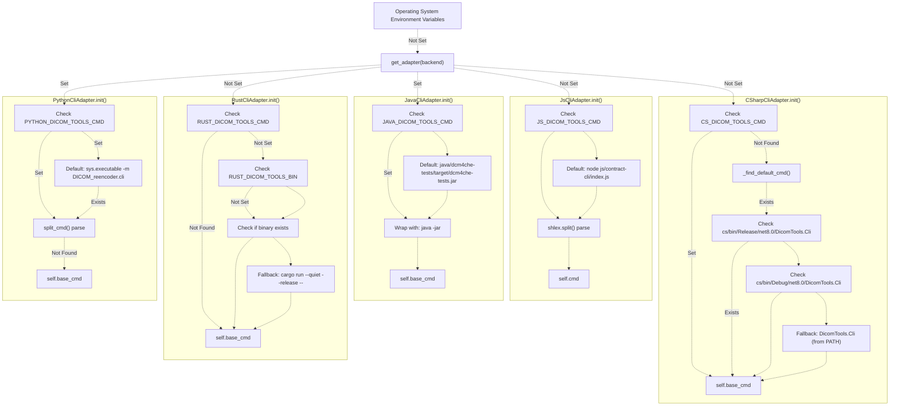
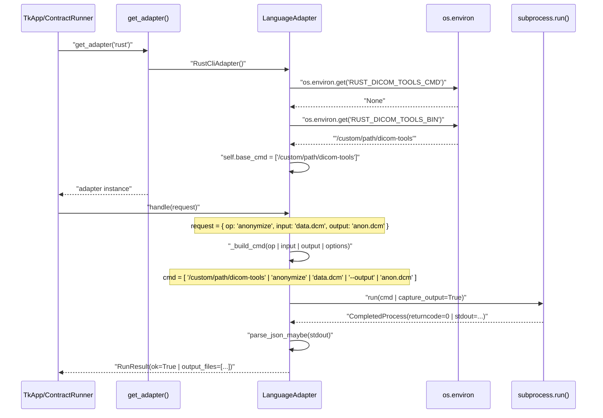

# Environment Configuration

> **Relevant source files**
> * [interface/CONTRACT.md](https://github.com/ThalesMMS/Dicom-Tools/blob/c7b4cbd8/interface/CONTRACT.md)
> * [interface/adapters/__init__.py](https://github.com/ThalesMMS/Dicom-Tools/blob/c7b4cbd8/interface/adapters/__init__.py)
> * [interface/adapters/csharp_cli.py](https://github.com/ThalesMMS/Dicom-Tools/blob/c7b4cbd8/interface/adapters/csharp_cli.py)
> * [interface/adapters/java_cli.py](https://github.com/ThalesMMS/Dicom-Tools/blob/c7b4cbd8/interface/adapters/java_cli.py)
> * [interface/adapters/js_cli.py](https://github.com/ThalesMMS/Dicom-Tools/blob/c7b4cbd8/interface/adapters/js_cli.py)
> * [interface/adapters/python_cli.py](https://github.com/ThalesMMS/Dicom-Tools/blob/c7b4cbd8/interface/adapters/python_cli.py)
> * [interface/adapters/rust_cli.py](https://github.com/ThalesMMS/Dicom-Tools/blob/c7b4cbd8/interface/adapters/rust_cli.py)
> * [interface/tests/test_operation_specs.py](https://github.com/ThalesMMS/Dicom-Tools/blob/c7b4cbd8/interface/tests/test_operation_specs.py)

This page documents the environment variables used to configure and override backend CLI paths in the Dicom-Tools system. These variables enable flexible deployment scenarios including development, continuous integration, and production environments by allowing runtime customization of how the adapter layer locates and invokes backend executables.

For information about the contract specification itself, see [Contract Specification](#3.1). For details on how adapters translate requests into CLI invocations, see [Adapter Pattern](#3.2).

---

## Overview

The Dicom-Tools adapter system supports environment-based configuration to control which executables are invoked for each language backend. This allows developers to:

* Override default build locations during development
* Use custom-built binaries with specific compilation flags
* Point to system-installed versions instead of local builds
* Configure CI environments with different paths
* Test specific backend implementations without modifying code

Each adapter checks for environment variables during initialization ([interface/adapters/python_cli.py L15](https://github.com/ThalesMMS/Dicom-Tools/blob/c7b4cbd8/interface/adapters/python_cli.py#L15-L15)

 [interface/adapters/rust_cli.py L14-L26](https://github.com/ThalesMMS/Dicom-Tools/blob/c7b4cbd8/interface/adapters/rust_cli.py#L14-L26)

 [interface/adapters/csharp_cli.py L13-L18](https://github.com/ThalesMMS/Dicom-Tools/blob/c7b4cbd8/interface/adapters/csharp_cli.py#L13-L18)

 [interface/adapters/java_cli.py L13-L17](https://github.com/ThalesMMS/Dicom-Tools/blob/c7b4cbd8/interface/adapters/java_cli.py#L13-L17)

 [interface/adapters/js_cli.py L16-L17](https://github.com/ThalesMMS/Dicom-Tools/blob/c7b4cbd8/interface/adapters/js_cli.py#L16-L17)

) and falls back to sensible defaults when variables are not set.

**Sources:** [interface/CONTRACT.md L84-L88](https://github.com/ThalesMMS/Dicom-Tools/blob/c7b4cbd8/interface/CONTRACT.md#L84-L88)

 [interface/adapters/__init__.py L1-L25](https://github.com/ThalesMMS/Dicom-Tools/blob/c7b4cbd8/interface/adapters/__init__.py#L1-L25)

---

## Environment Variable Reference

The following table lists all environment variables recognized by the adapter layer:

| Variable | Backend | Type | Default Value | Notes |
| --- | --- | --- | --- | --- |
| `PYTHON_DICOM_TOOLS_CMD` | Python | Command | `python -m DICOM_reencoder.cli` | Full command with arguments |
| `RUST_DICOM_TOOLS_CMD` | Rust | Command | (none) | If set, takes precedence over `RUST_DICOM_TOOLS_BIN` |
| `RUST_DICOM_TOOLS_BIN` | Rust | Binary Path | `rust/target/release/dicom-tools` | Path to compiled binary |
| `CPP_DICOM_TOOLS_BIN` | C++ | Binary Path | `cpp/build/DicomTools` | Path to compiled binary |
| `CS_DICOM_TOOLS_CMD` | C# | Command | (none) | Full command; otherwise searches `cs/bin/Release` or `cs/bin/Debug` |
| `JAVA_DICOM_TOOLS_CMD` | Java | JAR Path | `java/dcm4che-tests/target/dcm4che-tests.jar` | Path to JAR file; invoked with `java -jar` |
| `JS_DICOM_TOOLS_CMD` | JavaScript | Command | `node js/contract-cli/index.js` | Full Node.js command |

**Command vs. Binary Path:**

* **Command** variables (`*_CMD`) accept full shell commands with arguments (e.g., `python -m module` or `node script.js --flag`)
* **Binary Path** variables (`*_BIN`) accept only executable paths; the adapter constructs the full command

**Sources:** [interface/CONTRACT.md L84-L88](https://github.com/ThalesMMS/Dicom-Tools/blob/c7b4cbd8/interface/CONTRACT.md#L84-L88)

 [interface/adapters/python_cli.py L15-L16](https://github.com/ThalesMMS/Dicom-Tools/blob/c7b4cbd8/interface/adapters/python_cli.py#L15-L16)

 [interface/adapters/rust_cli.py L14-L18](https://github.com/ThalesMMS/Dicom-Tools/blob/c7b4cbd8/interface/adapters/rust_cli.py#L14-L18)

 [interface/adapters/csharp_cli.py L13-L18](https://github.com/ThalesMMS/Dicom-Tools/blob/c7b4cbd8/interface/adapters/csharp_cli.py#L13-L18)

 [interface/adapters/java_cli.py L13-L17](https://github.com/ThalesMMS/Dicom-Tools/blob/c7b4cbd8/interface/adapters/java_cli.py#L13-L17)

 [interface/adapters/js_cli.py L16-L17](https://github.com/ThalesMMS/Dicom-Tools/blob/c7b4cbd8/interface/adapters/js_cli.py#L16-L17)

---

## Adapter Initialization Flow

Each adapter follows a specific initialization pattern to resolve its command. The following diagram illustrates how environment variables flow through the system:



**Sources:** [interface/adapters/python_cli.py L12-L16](https://github.com/ThalesMMS/Dicom-Tools/blob/c7b4cbd8/interface/adapters/python_cli.py#L12-L16)

 [interface/adapters/rust_cli.py L11-L26](https://github.com/ThalesMMS/Dicom-Tools/blob/c7b4cbd8/interface/adapters/rust_cli.py#L11-L26)

 [interface/adapters/csharp_cli.py L11-L29](https://github.com/ThalesMMS/Dicom-Tools/blob/c7b4cbd8/interface/adapters/csharp_cli.py#L11-L29)

 [interface/adapters/java_cli.py L11-L17](https://github.com/ThalesMMS/Dicom-Tools/blob/c7b4cbd8/interface/adapters/java_cli.py#L11-L17)

 [interface/adapters/js_cli.py L13-L17](https://github.com/ThalesMMS/Dicom-Tools/blob/c7b4cbd8/interface/adapters/js_cli.py#L13-L17)

---

## Backend-Specific Configuration

### Python Backend

The `PythonCliAdapter` uses `PYTHON_DICOM_TOOLS_CMD` to specify the complete Python command for invoking the DICOM tools CLI:

```css
# interface/adapters/python_cli.py:15-16default_cmd = os.environ.get("PYTHON_DICOM_TOOLS_CMD", f"{sys.executable} -m DICOM_reencoder.cli")self.base_cmd: List[str] = split_cmd(default_cmd)
```

**Default Behavior:**

* Uses the current Python interpreter (`sys.executable`)
* Invokes module: `python -m DICOM_reencoder.cli`
* Working directory: `python/` subdirectory ([interface/adapters/python_cli.py L14](https://github.com/ThalesMMS/Dicom-Tools/blob/c7b4cbd8/interface/adapters/python_cli.py#L14-L14) )

**Override Examples:**

```
# Use specific Python versionexport PYTHON_DICOM_TOOLS_CMD="python3.11 -m DICOM_reencoder.cli"# Use virtual environmentexport PYTHON_DICOM_TOOLS_CMD="/opt/venv/bin/python -m DICOM_reencoder.cli"# Add debugging flagsexport PYTHON_DICOM_TOOLS_CMD="python -u -m DICOM_reencoder.cli"
```

**Sources:** [interface/adapters/python_cli.py L12-L16](https://github.com/ThalesMMS/Dicom-Tools/blob/c7b4cbd8/interface/adapters/python_cli.py#L12-L16)

 [interface/CONTRACT.md L85](https://github.com/ThalesMMS/Dicom-Tools/blob/c7b4cbd8/interface/CONTRACT.md#L85-L85)

---

### Rust Backend

The `RustCliAdapter` supports two environment variables with a priority order:

```
# interface/adapters/rust_cli.py:14-26env_cmd = os.environ.get("RUST_DICOM_TOOLS_CMD")if env_cmd:    self.base_cmd = split_cmd(env_cmd)else:    default_bin = os.environ.get("RUST_DICOM_TOOLS_BIN", str(self.cwd / "target" / "release" / "dicom-tools"))    bin_path = Path(default_bin)    if not bin_path.is_absolute():        bin_path = (self.root / bin_path).resolve()    if bin_path.exists():        self.base_cmd = [str(bin_path)]    else:        # Fallback para cargo run --release -- <args>        self.base_cmd = ["cargo", "run", "--quiet", "--release", "--"]
```

**Resolution Order:**

1. `RUST_DICOM_TOOLS_CMD` - Full command override (highest priority)
2. `RUST_DICOM_TOOLS_BIN` - Binary path (if exists)
3. Default: `rust/target/release/dicom-tools` (if exists)
4. Fallback: `cargo run --quiet --release --` (development mode)

**Override Examples:**

```
# Use prebuilt binary with custom flagsexport RUST_DICOM_TOOLS_CMD="dicom-tools --log-level debug"# Point to system-installed binaryexport RUST_DICOM_TOOLS_BIN="/usr/local/bin/dicom-tools"# Use debug buildexport RUST_DICOM_TOOLS_BIN="rust/target/debug/dicom-tools"# Force cargo run with custom profileexport RUST_DICOM_TOOLS_CMD="cargo run --profile optimized --"
```

**Sources:** [interface/adapters/rust_cli.py L11-L26](https://github.com/ThalesMMS/Dicom-Tools/blob/c7b4cbd8/interface/adapters/rust_cli.py#L11-L26)

 [interface/CONTRACT.md L86](https://github.com/ThalesMMS/Dicom-Tools/blob/c7b4cbd8/interface/CONTRACT.md#L86-L86)

---

### C++ Backend

The `CppCliAdapter` searches for the compiled binary in predictable locations:

```
# interface/adapters/csharp_cli.py:20-29 (similar pattern used by CppCliAdapter)def _find_default_cmd(self) -> str:    candidates = [        self.root / "cpp" / "build" / "DicomTools",        # Additional fallback locations checked    ]    for path in candidates:        if path.exists():            return str(path)    return "DicomTools"  # Let PATH resolve
```

**Default Search Path:**

* `cpp/build/DicomTools` (primary build directory)
* Falls back to `DicomTools` (expects binary in system PATH)

**Override Examples:**

```
# Use specific build configurationexport CPP_DICOM_TOOLS_BIN="cpp/build-debug/DicomTools"# Point to installed versionexport CPP_DICOM_TOOLS_BIN="/opt/dicom-tools/bin/DicomTools"# Use CMake multi-config outputexport CPP_DICOM_TOOLS_BIN="cpp/build/Release/DicomTools"
```

**Sources:** [interface/CONTRACT.md L87](https://github.com/ThalesMMS/Dicom-Tools/blob/c7b4cbd8/interface/CONTRACT.md#L87-L87)

---

### C# Backend

The `CSharpCliAdapter` implements sophisticated fallback logic to handle .NET's multiple build configurations:

```
# interface/adapters/csharp_cli.py:20-29def _find_default_cmd(self) -> str:    candidates = [        self.root / "cs" / "bin" / "Release" / "net8.0" / "DicomTools.Cli",        self.root / "cs" / "bin" / "Debug" / "net8.0" / "DicomTools.Cli",    ]    for path in candidates:        if path.exists():            return str(path)    # fallback: let PATH resolve if not found    return "DicomTools.Cli"
```

**Default Search Order:**

1. `cs/bin/Release/net8.0/DicomTools.Cli` (release build)
2. `cs/bin/Debug/net8.0/DicomTools.Cli` (debug build)
3. `DicomTools.Cli` (from PATH)

**Override Examples:**

```
# Use custom .NET runtimeexport CS_DICOM_TOOLS_CMD="dotnet cs/bin/Release/net8.0/DicomTools.Cli.dll"# Point to published single-file executableexport CS_DICOM_TOOLS_CMD="/app/publish/DicomTools.Cli"# Use different framework versionexport CS_DICOM_TOOLS_CMD="cs/bin/Release/net9.0/DicomTools.Cli"
```

**Sources:** [interface/adapters/csharp_cli.py L11-L29](https://github.com/ThalesMMS/Dicom-Tools/blob/c7b4cbd8/interface/adapters/csharp_cli.py#L11-L29)

 [interface/CONTRACT.md L88](https://github.com/ThalesMMS/Dicom-Tools/blob/c7b4cbd8/interface/CONTRACT.md#L88-L88)

---

### Java Backend

The `JavaCliAdapter` wraps the JAR path with the `java -jar` command:

```
# interface/adapters/java_cli.py:13-17default_cmd = os.environ.get("JAVA_DICOM_TOOLS_CMD") or str(    self.root / "java" / "dcm4che-tests" / "target" / "dcm4che-tests.jar")# Assume java -jar <jar> <args>self.base_cmd: List[str] = ["java", "-jar", default_cmd]
```

**Default Behavior:**

* Path: `java/dcm4che-tests/target/dcm4che-tests.jar`
* Invocation: `java -jar <path> <args>`

**Override Examples:**

```
# Use specific Java versionexport JAVA_DICOM_TOOLS_CMD="/opt/jdk-17/bin/java -jar java/dcm4che-tests/target/dcm4che-tests.jar"# Add JVM optionsexport JAVA_DICOM_TOOLS_CMD="java -Xmx2g -jar java/dcm4che-tests/target/dcm4che-tests.jar"# Point to alternative JARexport JAVA_DICOM_TOOLS_CMD="java/dcm4che-tests/target/dcm4che-tests-1.2.0.jar"
```

**Note:** The variable specifies the JAR path only; the adapter always prepends `java -jar`.

**Sources:** [interface/adapters/java_cli.py L11-L17](https://github.com/ThalesMMS/Dicom-Tools/blob/c7b4cbd8/interface/adapters/java_cli.py#L11-L17)

 [interface/CONTRACT.md L88](https://github.com/ThalesMMS/Dicom-Tools/blob/c7b4cbd8/interface/CONTRACT.md#L88-L88)

---

### JavaScript Backend

The `JsCliAdapter` supports full command override with proper shell parsing:

```
# interface/adapters/js_cli.py:14-17root = Path(__file__).resolve().parent.parent.parentdefault_cmd = ["node", str(root / "js" / "contract-cli" / "index.js")]env_cmd = os.environ.get("JS_DICOM_TOOLS_CMD")self.cmd = shlex.split(env_cmd) if env_cmd else default_cmd
```

**Default Behavior:**

* Command: `node js/contract-cli/index.js`
* Uses `shlex.split()` for proper shell tokenization

**Override Examples:**

```
# Use alternative Node.js runtimeexport JS_DICOM_TOOLS_CMD="node --experimental-modules js/contract-cli/index.js"# Use Bun instead of Nodeexport JS_DICOM_TOOLS_CMD="bun run js/contract-cli/index.js"# Add debuggingexport JS_DICOM_TOOLS_CMD="node --inspect js/contract-cli/index.js"
```

**Sources:** [interface/adapters/js_cli.py L13-L17](https://github.com/ThalesMMS/Dicom-Tools/blob/c7b4cbd8/interface/adapters/js_cli.py#L13-L17)

 [interface/CONTRACT.md L88](https://github.com/ThalesMMS/Dicom-Tools/blob/c7b4cbd8/interface/CONTRACT.md#L88-L88)

---

## Command Construction and Invocation

Once an adapter resolves its base command, it constructs the full command by appending operation-specific arguments. The following diagram shows the runtime flow:



**Key Points:**

* Environment variables are read once during adapter initialization
* The `base_cmd` is stored as a list of command parts
* Operation handlers append arguments to `base_cmd` ([interface/adapters/rust_cli.py L63](https://github.com/ThalesMMS/Dicom-Tools/blob/c7b4cbd8/interface/adapters/rust_cli.py#L63-L63)  [interface/adapters/python_cli.py L54](https://github.com/ThalesMMS/Dicom-Tools/blob/c7b4cbd8/interface/adapters/python_cli.py#L54-L54) )
* Full command is passed to `subprocess.run()` via the `run_process()` helper

**Sources:** [interface/adapters/rust_cli.py L28-L50](https://github.com/ThalesMMS/Dicom-Tools/blob/c7b4cbd8/interface/adapters/rust_cli.py#L28-L50)

 [interface/adapters/python_cli.py L18-L43](https://github.com/ThalesMMS/Dicom-Tools/blob/c7b4cbd8/interface/adapters/python_cli.py#L18-L43)

 [interface/adapters/__init__.py L10-L24](https://github.com/ThalesMMS/Dicom-Tools/blob/c7b4cbd8/interface/adapters/__init__.py#L10-L24)

---

## Deployment Scenarios

### Development Environment

In local development, environment variables are typically unset, allowing adapters to use default relative paths:

```
# No environment variables neededpython -m interface.app  # Uses defaults from code
```

**Adapter Behavior:**

* Python: `python -m DICOM_reencoder.cli`
* Rust: `rust/target/release/dicom-tools` or `cargo run`
* C++: `cpp/build/DicomTools`
* C#: `cs/bin/Release/net8.0/DicomTools.Cli`
* Java: `java -jar java/dcm4che-tests/target/dcm4che-tests.jar`
* JavaScript: `node js/contract-cli/index.js`

---

### Continuous Integration

CI environments often require explicit paths due to different build directories:

```css
# .github/workflows/ci.yml exampleenv:  RUST_DICOM_TOOLS_BIN: ${{ github.workspace }}/rust/target/release/dicom-tools  CPP_DICOM_TOOLS_BIN: ${{ github.workspace }}/cpp/build/DicomTools  PYTHON_DICOM_TOOLS_CMD: python -m DICOM_reencoder.cli  CS_DICOM_TOOLS_CMD: ${{ github.workspace }}/cs/bin/Release/net8.0/DicomTools.Cli  JAVA_DICOM_TOOLS_CMD: ${{ github.workspace }}/java/dcm4che-tests/target/dcm4che-tests.jar
```

**Sources:** Referenced pattern from CI workflows and adapter initialization logic

---

### Production Deployment

Production deployments may use system-installed binaries or containerized paths:

```
# System-wide installationexport RUST_DICOM_TOOLS_BIN=/usr/local/bin/dicom-toolsexport CPP_DICOM_TOOLS_BIN=/usr/local/bin/DicomToolsexport PYTHON_DICOM_TOOLS_CMD="/opt/venv/bin/python -m DICOM_reencoder.cli"# Docker container pathsexport RUST_DICOM_TOOLS_BIN=/app/bin/dicom-toolsexport CPP_DICOM_TOOLS_BIN=/app/bin/DicomToolsexport CS_DICOM_TOOLS_CMD=/app/cs/DicomTools.Cli
```

---

## Command Parsing Utilities

Adapters use helper functions from `interface/adapters/runner.py` to parse environment variables:

| Function | Purpose | Example Input | Example Output |
| --- | --- | --- | --- |
| `split_cmd(cmd)` | Split shell command into list | `"python -m module --flag"` | `["python", "-m", "module", "--flag"]` |
| `run_process(cmd, cwd)` | Execute command and capture output | `["rustc", "--version"]` | `RunResult(...)` |
| `parse_json_maybe(text)` | Parse JSON from stdout if present | `'{"ok": true}'` | `{"ok": true}` |

The `split_cmd()` function handles quoted arguments and special characters properly using Python's `shlex.split()`.

**Sources:** [interface/adapters/python_cli.py L6](https://github.com/ThalesMMS/Dicom-Tools/blob/c7b4cbd8/interface/adapters/python_cli.py#L6-L6)

 [interface/adapters/rust_cli.py L5](https://github.com/ThalesMMS/Dicom-Tools/blob/c7b4cbd8/interface/adapters/rust_cli.py#L5-L5)

---

## Debugging Configuration Issues

To verify which commands are being used at runtime:

### Enable Verbose Logging

```python
# Add to adapter initializationimport osprint(f"RUST_DICOM_TOOLS_CMD: {os.environ.get('RUST_DICOM_TOOLS_CMD')}")print(f"RUST_DICOM_TOOLS_BIN: {os.environ.get('RUST_DICOM_TOOLS_BIN')}")print(f"Resolved command: {self.base_cmd}")
```

### Check Default Resolution

```python
# Test command resolution manuallypython -c "from interface.adapters import get_adapteradapter = get_adapter('rust')print(f'Base command: {adapter.base_cmd}')"
```

### Verify Binary Existence

```
# interface/adapters/rust_cli.py:20-22bin_path = Path(default_bin)if not bin_path.is_absolute():    bin_path = (self.root / bin_path).resolve()if bin_path.exists():  # Check here
```

### Common Issues

| Issue | Cause | Solution |
| --- | --- | --- |
| "Command not found" | Binary not built or wrong path | Build backend or set `*_BIN` variable |
| "Permission denied" | Binary not executable | `chmod +x <binary>` |
| Wrong version used | System PATH conflict | Set explicit `*_CMD` or `*_BIN` |
| Arguments not parsed | Spaces in command | Use quoted strings in env vars |

**Sources:** [interface/adapters/rust_cli.py L19-L26](https://github.com/ThalesMMS/Dicom-Tools/blob/c7b4cbd8/interface/adapters/rust_cli.py#L19-L26)

 [interface/adapters/csharp_cli.py L20-L29](https://github.com/ThalesMMS/Dicom-Tools/blob/c7b4cbd8/interface/adapters/csharp_cli.py#L20-L29)

---

## Integration with Adapter Factory

The `get_adapter()` function in [interface/adapters/__init__.py L10-L24](https://github.com/ThalesMMS/Dicom-Tools/blob/c7b4cbd8/interface/adapters/__init__.py#L10-L24)

 instantiates adapters, triggering environment variable resolution:

```css
def get_adapter(backend: str):    backend = backend.lower()    if backend == "python":        return PythonCliAdapter()  # Reads PYTHON_DICOM_TOOLS_CMD    if backend == "rust":        return RustCliAdapter()     # Reads RUST_DICOM_TOOLS_CMD/BIN    if backend == "cpp":        return CppCliAdapter()      # Reads CPP_DICOM_TOOLS_BIN    if backend in {"csharp", "cs", "dotnet"}:        return CSharpCliAdapter()   # Reads CS_DICOM_TOOLS_CMD    if backend == "java":        return JavaCliAdapter()     # Reads JAVA_DICOM_TOOLS_CMD    if backend == "js":        return JsCliAdapter()       # Reads JS_DICOM_TOOLS_CMD
```

This factory pattern ensures:

* Environment variables are read exactly once per adapter instance
* Configuration is isolated to adapter initialization
* UI code remains independent of backend configuration details

**Sources:** [interface/adapters/__init__.py L10-L24](https://github.com/ThalesMMS/Dicom-Tools/blob/c7b4cbd8/interface/adapters/__init__.py#L10-L24)

---

## Summary

Environment configuration in Dicom-Tools provides flexible runtime control over backend executable locations through a standardized set of environment variables. Each adapter implements its own resolution logic with sensible defaults while supporting override for development, CI, and production scenarios. The system's design ensures that configuration complexity is encapsulated within adapters, maintaining clean separation between the UI layer and backend implementation details.

For information on how these configured commands are invoked during operation handling, see [Adapter Pattern](#3.2). For the complete list of operations supported by each backend, see [Contract Specification](#3.1).

Refresh this wiki

Last indexed: 5 January 2026 ([c7b4cb](https://github.com/ThalesMMS/Dicom-Tools/commit/c7b4cbd8))

### On this page

* [Environment Configuration](#3.3-environment-configuration)
* [Overview](#3.3-overview)
* [Environment Variable Reference](#3.3-environment-variable-reference)
* [Adapter Initialization Flow](#3.3-adapter-initialization-flow)
* [Backend-Specific Configuration](#3.3-backend-specific-configuration)
* [Python Backend](#3.3-python-backend)
* [Rust Backend](#3.3-rust-backend)
* [C++ Backend](#3.3-c-backend)
* [C# Backend](#3.3-c-backend-1)
* [Java Backend](#3.3-java-backend)
* [JavaScript Backend](#3.3-javascript-backend)
* [Command Construction and Invocation](#3.3-command-construction-and-invocation)
* [Deployment Scenarios](#3.3-deployment-scenarios)
* [Development Environment](#3.3-development-environment)
* [Continuous Integration](#3.3-continuous-integration)
* [Production Deployment](#3.3-production-deployment)
* [Command Parsing Utilities](#3.3-command-parsing-utilities)
* [Debugging Configuration Issues](#3.3-debugging-configuration-issues)
* [Enable Verbose Logging](#3.3-enable-verbose-logging)
* [Check Default Resolution](#3.3-check-default-resolution)
* [Verify Binary Existence](#3.3-verify-binary-existence)
* [Common Issues](#3.3-common-issues)
* [Integration with Adapter Factory](#3.3-integration-with-adapter-factory)
* [Summary](#3.3-summary)

Ask Devin about Dicom-Tools