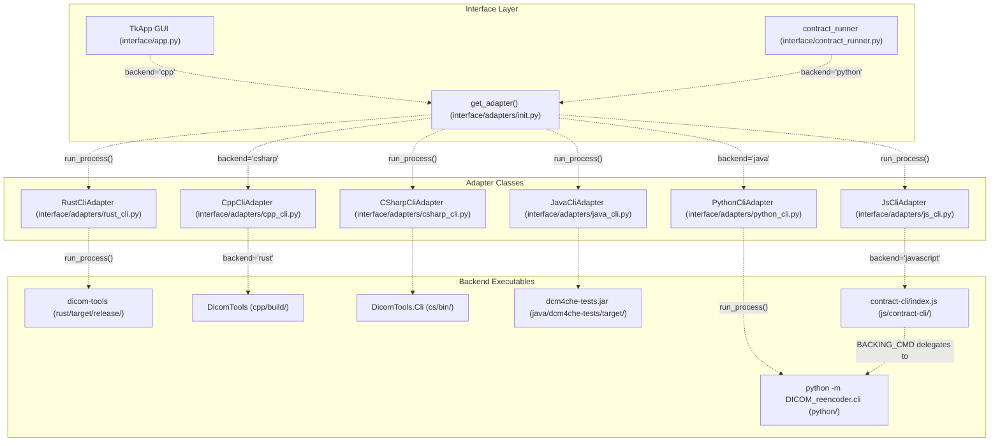
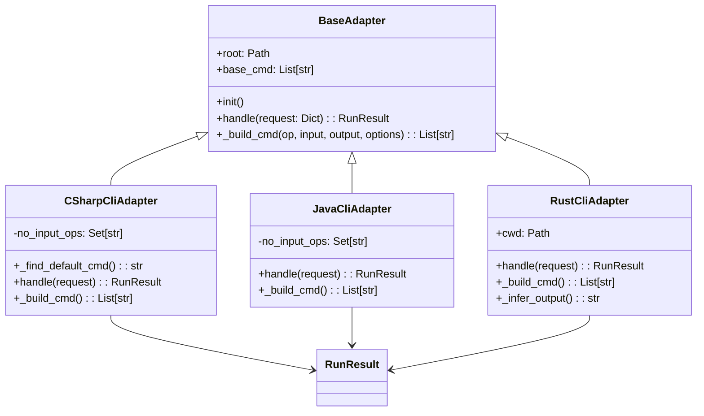
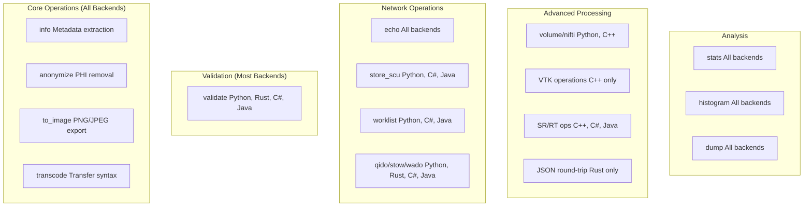
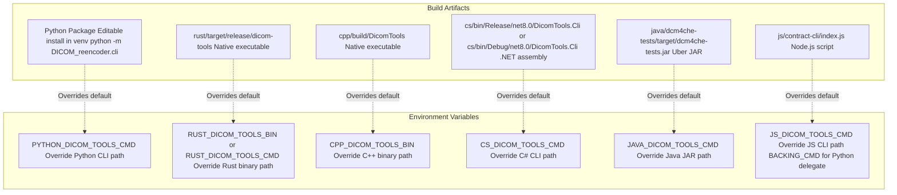
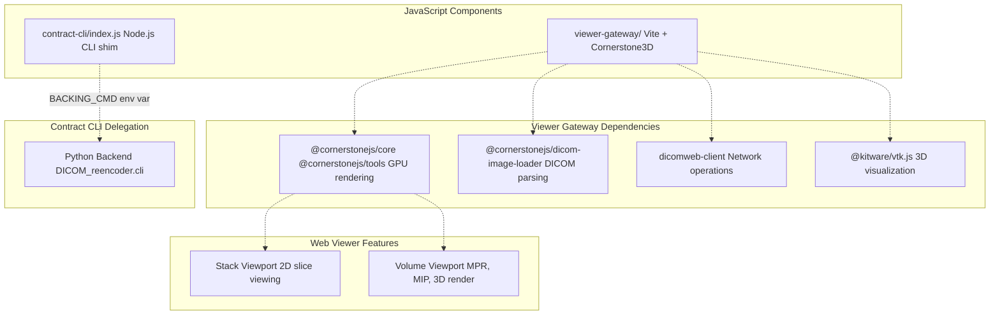

# 4 Language Implementations

> **Relevant source files**
> * [BUILD.md](https://github.com/ThalesMMS/Dicom-Tools/blob/c7b4cbd8/BUILD.md)
> * [README.md](https://github.com/ThalesMMS/Dicom-Tools/blob/c7b4cbd8/README.md)
> * [interface/adapters/csharp_cli.py](https://github.com/ThalesMMS/Dicom-Tools/blob/c7b4cbd8/interface/adapters/csharp_cli.py)
> * [interface/adapters/java_cli.py](https://github.com/ThalesMMS/Dicom-Tools/blob/c7b4cbd8/interface/adapters/java_cli.py)
> * [interface/adapters/rust_cli.py](https://github.com/ThalesMMS/Dicom-Tools/blob/c7b4cbd8/interface/adapters/rust_cli.py)
> * [interface/tests/test_operation_specs.py](https://github.com/ThalesMMS/Dicom-Tools/blob/c7b4cbd8/interface/tests/test_operation_specs.py)
> * [scripts/setup_all.sh](https://github.com/ThalesMMS/Dicom-Tools/blob/c7b4cbd8/scripts/setup_all.sh)

## Purpose and Scope

This document provides an overview of the six language backends that power the Dicom-Tools repository: Python, Rust, C++, C#, Java, and JavaScript. Each backend implements a subset of DICOM operations using native libraries and ecosystems, all accessible through a unified CLI contract interface.

For detailed documentation on individual backends, see:

* Python implementation: [4a](4a%20Python-Backend.md)
* Rust implementation: [4b](4b%20Rust-Backend.md)
* C++ implementation: [4c](4c%20C++-Backend.md)
* C# implementation: [4d](4d%20C%23-Backend.md)
* Java implementation: [4e](4e%20Java-Backend.md)
* JavaScript implementation: [4f](4f%20JavaScript-Backend.md)

For the adapter pattern that enables cross-language integration, see [3b](3b%20Adapter-Pattern.md).

---

## Backend Architecture Overview

The Dicom-Tools repository implements a multi-language architecture where each backend is a standalone CLI application integrated through adapter classes. The adapters translate generic request structures into backend-specific command-line invocations.

### Adapter Integration Pattern



**Sources:** [interface/adapters/csharp_cli.py L1-L182](https://github.com/ThalesMMS/Dicom-Tools/blob/c7b4cbd8/interface/adapters/csharp_cli.py#L1-L182)

 [interface/adapters/java_cli.py L1-L168](https://github.com/ThalesMMS/Dicom-Tools/blob/c7b4cbd8/interface/adapters/java_cli.py#L1-L168)

 [interface/adapters/rust_cli.py L1-L151](https://github.com/ThalesMMS/Dicom-Tools/blob/c7b4cbd8/interface/adapters/rust_cli.py#L1-L151)

 [README.md L1-L43](https://github.com/ThalesMMS/Dicom-Tools/blob/c7b4cbd8/README.md#L1-L43)

---

## Library Ecosystem

Each backend leverages mature DICOM libraries from its respective ecosystem:

```mermaid
flowchart TD

JsCLI["contract-cli"]
ViewerGW["viewer-gateway"]
cs3d["Cornerstone3D GPU rendering"]
csloader["dicom-image-loader DICOM parsing"]
dwclient["dicomweb-client Network ops"]
JavaCLI["DicomToolsCli"]
dcm4che["dcm4che3 dcm4che-core dcm4che-net dcm4che-image"]
CSharpCLI["DicomTools.Cli"]
fodicom["fo-dicom .NET DICOM library"]
CppCLI["DicomTools"]
dcmtk["DCMTK DICOM toolkit"]
gdcmcpp["GDCM Codecs"]
itk["ITK Registration"]
vtk["VTK 3D rendering"]
RustCLI["dicom-tools"]
dicomrs["dicom-rs dicom-core, dicom-object dicom-pixeldata, dicom-transfer-syntax"]
PythonCLI["DICOM_reencoder.cli"]
pydicom["pydicom Core DICOM I/O"]
pynetdicom["pynetdicom Network services"]
gdcm["python-gdcm Codec support"]
sitk["SimpleITK Image processing"]
dnumpy["dicom-numpy Volume ops"]

subgraph subGraph5 ["JavaScript Backend"]
    JsCLI
    ViewerGW
    cs3d
    csloader
    dwclient
    JsCLI -.-> ViewerGW
    ViewerGW -.-> cs3d
    ViewerGW -.-> csloader
    ViewerGW -.-> dwclient
end

subgraph subGraph4 ["Java Backend"]
    JavaCLI
    dcm4che
    JavaCLI -.-> dcm4che
end

subgraph subGraph3 ["C# Backend"]
    CSharpCLI
    fodicom
    CSharpCLI -.-> fodicom
end

subgraph subGraph2 ["C++ Backend"]
    CppCLI
    dcmtk
    gdcmcpp
    itk
    vtk
    CppCLI -.-> dcmtk
    CppCLI -.-> gdcmcpp
    CppCLI -.-> itk
    CppCLI -.-> vtk
end

subgraph subGraph1 ["Rust Backend"]
    RustCLI
    dicomrs
    RustCLI -.-> dicomrs
end

subgraph subGraph0 ["Python Backend"]
    PythonCLI
    pydicom
    pynetdicom
    gdcm
    sitk
    dnumpy
    PythonCLI -.-> pydicom
    PythonCLI -.-> pynetdicom
    PythonCLI -.-> gdcm
    PythonCLI -.-> sitk
    PythonCLI -.-> dnumpy
end
```



**Sources:** [README.md L7-L13](https://github.com/ThalesMMS/Dicom-Tools/blob/c7b4cbd8/README.md#L7-L13)

 [README.md L16-L22](https://github.com/ThalesMMS/Dicom-Tools/blob/c7b4cbd8/README.md#L16-L22)

---

## Backend Comparison Matrix

| Feature | Python | Rust | C++ | C# | Java | JavaScript |
| --- | --- | --- | --- | --- | --- | --- |
| **Primary Libraries** | pydicom, pynetdicom, GDCM | dicom-rs | DCMTK, GDCM, ITK, VTK | fo-dicom | dcm4che3 | Cornerstone3D |
| **CLI Commands** | 20+ | ~15 | ~12 | ~15 | ~12 | Shim to Python |
| **Network Services** | C-ECHO, C-STORE, C-FIND, C-MOVE, MWL, DICOMweb | C-ECHO, experimental | C-ECHO | C-ECHO, C-STORE, MWL, DICOMweb | C-ECHO, C-STORE, MWL, DICOMweb | N/A |
| **3D Visualization** | SimpleITK/matplotlib | No | VTK (MPR, volume rendering) | No | No | Cornerstone3D (web) |
| **Specialized Formats** | NIfTI, batch ops | JSON round-trip | SR, RT, NRRD | SR, RT | SR, RT | N/A |
| **Web Server Mode** | No | Yes | No | No | No | Yes (viewer) |
| **Build System** | pip/setuptools | Cargo | CMake | dotnet | Maven | npm |
| **Runtime** | Python 3.10+ | Native binary | Native binary | .NET 8 | Java 17 | Node 18+ |

**Sources:** [README.md L7-L22](https://github.com/ThalesMMS/Dicom-Tools/blob/c7b4cbd8/README.md#L7-L22)

 [BUILD.md L1-L48](https://github.com/ThalesMMS/Dicom-Tools/blob/c7b4cbd8/BUILD.md#L1-L48)

---

## Adapter Implementation Details

Each adapter class follows a consistent pattern:

### Adapter Class Structure



**Sources:** [interface/adapters/csharp_cli.py L8-L30](https://github.com/ThalesMMS/Dicom-Tools/blob/c7b4cbd8/interface/adapters/csharp_cli.py#L8-L30)

 [interface/adapters/java_cli.py L8-L18](https://github.com/ThalesMMS/Dicom-Tools/blob/c7b4cbd8/interface/adapters/java_cli.py#L8-L18)

 [interface/adapters/rust_cli.py L8-L27](https://github.com/ThalesMMS/Dicom-Tools/blob/c7b4cbd8/interface/adapters/rust_cli.py#L8-L27)

### Common Adapter Methods

All adapters implement these key methods:

| Method | Purpose | Returns |
| --- | --- | --- |
| `__init__()` | Initialize adapter, resolve CLI path from environment or defaults | None |
| `handle(request: Dict)` | Main entry point; validates request, builds command, executes, parses result | `RunResult` |
| `_build_cmd(op, input, output, options)` | Translate operation and options into backend-specific CLI arguments | `List[str]` or `None` |

**Example: C# adapter initialization and command building**

[interface/adapters/csharp_cli.py L11-L30](https://github.com/ThalesMMS/Dicom-Tools/blob/c7b4cbd8/interface/adapters/csharp_cli.py#L11-L30)

```
def __init__(self) -> None:    self.root = Path(__file__).resolve().parents[2]    env_cmd = os.environ.get("CS_DICOM_TOOLS_CMD")    if env_cmd:        self.base_cmd = split_cmd(env_cmd)    else:        default_cmd = self._find_default_cmd()        self.base_cmd = [default_cmd]def _find_default_cmd(self) -> str:    candidates = [        self.root / "cs" / "bin" / "Release" / "net8.0" / "DicomTools.Cli",        self.root / "cs" / "bin" / "Debug" / "net8.0" / "DicomTools.Cli",    ]    for path in candidates:        if path.exists():            return str(path)    return "DicomTools.Cli"
```

**Sources:** [interface/adapters/csharp_cli.py L11-L30](https://github.com/ThalesMMS/Dicom-Tools/blob/c7b4cbd8/interface/adapters/csharp_cli.py#L11-L30)

---

## Operation Support by Backend

Different backends support different subsets of operations based on their underlying library capabilities:



**Example: Operation support check in C# adapter**

[interface/adapters/csharp_cli.py L69-L102](https://github.com/ThalesMMS/Dicom-Tools/blob/c7b4cbd8/interface/adapters/csharp_cli.py#L69-L102)

 shows how the adapter maps operations to CLI commands:

* `info`: [interface/adapters/csharp_cli.py L71-L72](https://github.com/ThalesMMS/Dicom-Tools/blob/c7b4cbd8/interface/adapters/csharp_cli.py#L71-L72)
* `anonymize`: [interface/adapters/csharp_cli.py L73-L75](https://github.com/ThalesMMS/Dicom-Tools/blob/c7b4cbd8/interface/adapters/csharp_cli.py#L73-L75)
* `to_image`: [interface/adapters/csharp_cli.py L76-L83](https://github.com/ThalesMMS/Dicom-Tools/blob/c7b4cbd8/interface/adapters/csharp_cli.py#L76-L83)
* `transcode`: [interface/adapters/csharp_cli.py L84-L87](https://github.com/ThalesMMS/Dicom-Tools/blob/c7b4cbd8/interface/adapters/csharp_cli.py#L84-L87)
* `validate`: [interface/adapters/csharp_cli.py L88-L89](https://github.com/ThalesMMS/Dicom-Tools/blob/c7b4cbd8/interface/adapters/csharp_cli.py#L88-L89)

**Sources:** [interface/adapters/csharp_cli.py L69-L181](https://github.com/ThalesMMS/Dicom-Tools/blob/c7b4cbd8/interface/adapters/csharp_cli.py#L69-L181)

 [interface/adapters/java_cli.py L47-L167](https://github.com/ThalesMMS/Dicom-Tools/blob/c7b4cbd8/interface/adapters/java_cli.py#L47-L167)

 [README.md L16-L22](https://github.com/ThalesMMS/Dicom-Tools/blob/c7b4cbd8/README.md#L16-L22)

---

## Backend Selection Guide

### When to Use Each Backend

| Backend | Best For | Avoid If |
| --- | --- | --- |
| **Python** | General-purpose scripting, maximum operation coverage, network services, batch processing | Performance-critical applications, need minimal dependencies |
| **Rust** | Modern JSON workflows, web server integration, production deployments needing type safety | Need VTK visualization, legacy DICOM formats |
| **C++** | Advanced 3D visualization (MPR, volume rendering), SR/RT processing, maximum performance | Simple file operations, need rapid prototyping |
| **C#** | Windows environments, .NET integration, enterprise DICOMweb services | Unix-only deployments, need VTK features |
| **Java** | Enterprise environments, Maven-based workflows, dcm4che ecosystem integration | Need modern language features, advanced visualization |
| **JavaScript** | Web-based viewers, browser deployment, GPU-accelerated rendering | Backend processing, batch operations, server-side analysis |

**Sources:** [README.md L7-L22](https://github.com/ThalesMMS/Dicom-Tools/blob/c7b4cbd8/README.md#L7-L22)

---

## Build Artifacts and Configuration

### Default Binary Locations



**Sources:** [interface/adapters/csharp_cli.py L11-L29](https://github.com/ThalesMMS/Dicom-Tools/blob/c7b4cbd8/interface/adapters/csharp_cli.py#L11-L29)

 [interface/adapters/java_cli.py L11-L18](https://github.com/ThalesMMS/Dicom-Tools/blob/c7b4cbd8/interface/adapters/java_cli.py#L11-L18)

 [interface/adapters/rust_cli.py L11-L26](https://github.com/ThalesMMS/Dicom-Tools/blob/c7b4cbd8/interface/adapters/rust_cli.py#L11-L26)

 [BUILD.md L34-L41](https://github.com/ThalesMMS/Dicom-Tools/blob/c7b4cbd8/BUILD.md#L34-L41)

### Build Commands

| Backend | Build Command | Test Command | Artifact Location |
| --- | --- | --- | --- |
| **Python** | `pip install -e python` | `cd python && pytest` | Editable package install |
| **Rust** | `cd rust && cargo build --release` | `cargo test` | `rust/target/release/dicom-tools` |
| **C++** | `cd cpp && cmake -B build && cmake --build build` | `python3 cpp/tests/run_all.py` | `cpp/build/DicomTools` |
| **C#** | `cd cs && dotnet build` | `dotnet test` | `cs/bin/Release/net8.0/DicomTools.Cli` |
| **Java** | `cd java/dcm4che-tests && mvn package` | `mvn test` | `java/dcm4che-tests/target/dcm4che-tests.jar` |
| **JavaScript** | `cd js/viewer-gateway && npm ci` | `npm test` | `js/viewer-gateway/node_modules/` |

**Unified Setup Script:** [scripts/setup_all.sh L1-L60](https://github.com/ThalesMMS/Dicom-Tools/blob/c7b4cbd8/scripts/setup_all.sh#L1-L60)

 automates installation of all backends with a single command:

```
./scripts/setup_all.sh
```

The script:

1. Installs Python package in editable mode [scripts/setup_all.sh L17-L23](https://github.com/ThalesMMS/Dicom-Tools/blob/c7b4cbd8/scripts/setup_all.sh#L17-L23)
2. Builds Rust release binary [scripts/setup_all.sh L25-L27](https://github.com/ThalesMMS/Dicom-Tools/blob/c7b4cbd8/scripts/setup_all.sh#L25-L27)
3. Configures and builds C++ with CMake [scripts/setup_all.sh L29-L38](https://github.com/ThalesMMS/Dicom-Tools/blob/c7b4cbd8/scripts/setup_all.sh#L29-L38)
4. Restores and builds C# solution [scripts/setup_all.sh L40-L43](https://github.com/ThalesMMS/Dicom-Tools/blob/c7b4cbd8/scripts/setup_all.sh#L40-L43)
5. Packages Java JAR with Maven [scripts/setup_all.sh L45-L47](https://github.com/ThalesMMS/Dicom-Tools/blob/c7b4cbd8/scripts/setup_all.sh#L45-L47)
6. Installs JavaScript dependencies [scripts/setup_all.sh L49-L51](https://github.com/ThalesMMS/Dicom-Tools/blob/c7b4cbd8/scripts/setup_all.sh#L49-L51)

**Sources:** [scripts/setup_all.sh L1-L60](https://github.com/ThalesMMS/Dicom-Tools/blob/c7b4cbd8/scripts/setup_all.sh#L1-L60)

 [BUILD.md L1-L48](https://github.com/ThalesMMS/Dicom-Tools/blob/c7b4cbd8/BUILD.md#L1-L48)

---

## Environment Variable Configuration

Adapters use environment variables to allow runtime override of CLI paths, enabling flexible deployment:

### C# Adapter Example

[interface/adapters/csharp_cli.py L11-L18](https://github.com/ThalesMMS/Dicom-Tools/blob/c7b4cbd8/interface/adapters/csharp_cli.py#L11-L18)

:

```
env_cmd = os.environ.get("CS_DICOM_TOOLS_CMD")if env_cmd:    self.base_cmd = split_cmd(env_cmd)else:    default_cmd = self._find_default_cmd()    self.base_cmd = [default_cmd]
```

The adapter tries Release build first, then Debug build, then falls back to PATH resolution [interface/adapters/csharp_cli.py L20-L29](https://github.com/ThalesMMS/Dicom-Tools/blob/c7b4cbd8/interface/adapters/csharp_cli.py#L20-L29)

### Java Adapter Example

[interface/adapters/java_cli.py L13-L17](https://github.com/ThalesMMS/Dicom-Tools/blob/c7b4cbd8/interface/adapters/java_cli.py#L13-L17)

:

```
default_cmd = os.environ.get("JAVA_DICOM_TOOLS_CMD") or str(    self.root / "java" / "dcm4che-tests" / "target" / "dcm4che-tests.jar")self.base_cmd: List[str] = ["java", "-jar", default_cmd]
```

### Rust Adapter Example

[interface/adapters/rust_cli.py L14-L26](https://github.com/ThalesMMS/Dicom-Tools/blob/c7b4cbd8/interface/adapters/rust_cli.py#L14-L26)

 demonstrates multiple fallback strategies:

1. Check `RUST_DICOM_TOOLS_CMD` environment variable
2. Check `RUST_DICOM_TOOLS_BIN` for explicit binary path
3. Look for release binary at `rust/target/release/dicom-tools`
4. Fall back to `cargo run --quiet --release --`

**Sources:** [interface/adapters/csharp_cli.py L11-L30](https://github.com/ThalesMMS/Dicom-Tools/blob/c7b4cbd8/interface/adapters/csharp_cli.py#L11-L30)

 [interface/adapters/java_cli.py L11-L18](https://github.com/ThalesMMS/Dicom-Tools/blob/c7b4cbd8/interface/adapters/java_cli.py#L11-L18)

 [interface/adapters/rust_cli.py L11-L27](https://github.com/ThalesMMS/Dicom-Tools/blob/c7b4cbd8/interface/adapters/rust_cli.py#L11-L27)

---

## JavaScript Backend Architecture

The JavaScript backend is unique—it consists of two components:

1. **contract-cli**: A Node.js shim that delegates to the Python backend
2. **viewer-gateway**: A standalone web application for DICOM visualization



The contract-cli does not implement DICOM operations itself—it translates contract requests to Python CLI invocations, allowing Node.js environments to use the toolkit without native DICOM libraries.

**Sources:** [README.md L21-L22](https://github.com/ThalesMMS/Dicom-Tools/blob/c7b4cbd8/README.md#L21-L22)

 [BUILD.md L32-L33](https://github.com/ThalesMMS/Dicom-Tools/blob/c7b4cbd8/BUILD.md#L32-L33)

 [BUILD.md L40-L41](https://github.com/ThalesMMS/Dicom-Tools/blob/c7b4cbd8/BUILD.md#L40-L41)

---

## Testing Strategy

Each backend includes its own test suite while also participating in cross-language interface tests:

| Backend | Test Framework | Test Location | Coverage |
| --- | --- | --- | --- |
| Python | pytest | `python/tests/` | Core modules, network ops, GDCM, dicom-numpy |
| Rust | cargo test | `rust/tests/` | dicom-rs validation, CLI operations |
| C++ | ctest + run_all.py | `cpp/tests/` | DCMTK, GDCM, ITK, VTK modules |
| C# | xUnit | `cs/DicomTools.Tests/` | CLI ops, network, DICOMweb |
| Java | JUnit | `java/dcm4che-tests/src/test/` | CLI ops, dcm4che integration |
| JavaScript | Vitest | `js/viewer-gateway/tests/` | Cornerstone3D, viewer components |
| Interface | pytest | `interface/tests/` | Cross-language contract validation |

**Example: Operation spec tests verify backend capabilities**

[interface/tests/test_operation_specs.py L1-L56](https://github.com/ThalesMMS/Dicom-Tools/blob/c7b4cbd8/interface/tests/test_operation_specs.py#L1-L56)

 validates that backends correctly declare their supported operations and I/O requirements:

* C++ info operation uses directory output [interface/tests/test_operation_specs.py L4-L7](https://github.com/ThalesMMS/Dicom-Tools/blob/c7b4cbd8/interface/tests/test_operation_specs.py#L4-L7)
* Rust to_image exposes window/level options [interface/tests/test_operation_specs.py L16-L19](https://github.com/ThalesMMS/Dicom-Tools/blob/c7b4cbd8/interface/tests/test_operation_specs.py#L16-L19)
* Echo operations have no input [interface/tests/test_operation_specs.py L22-L25](https://github.com/ThalesMMS/Dicom-Tools/blob/c7b4cbd8/interface/tests/test_operation_specs.py#L22-L25)
* VTK operations use directory I/O [interface/tests/test_operation_specs.py L36-L39](https://github.com/ThalesMMS/Dicom-Tools/blob/c7b4cbd8/interface/tests/test_operation_specs.py#L36-L39)

**Sources:** [interface/tests/test_operation_specs.py L1-L56](https://github.com/ThalesMMS/Dicom-Tools/blob/c7b4cbd8/interface/tests/test_operation_specs.py#L1-L56)

 [README.md L32-L39](https://github.com/ThalesMMS/Dicom-Tools/blob/c7b4cbd8/README.md#L32-L39)

 [BUILD.md L24-L32](https://github.com/ThalesMMS/Dicom-Tools/blob/c7b4cbd8/BUILD.md#L24-L32)


### On this page

* [Language Implementations](4%20Language-Implementations.md)
* [Purpose and Scope](4%20Language-Implementations.md)
* [Backend Architecture Overview](4%20Language-Implementations.md)
* [Adapter Integration Pattern](4%20Language-Implementations.md)
* [Library Ecosystem](4%20Language-Implementations.md)
* [Backend Comparison Matrix](4%20Language-Implementations.md)
* [Adapter Implementation Details](4%20Language-Implementations.md)
* [Adapter Class Structure](4%20Language-Implementations.md)
* [Common Adapter Methods](4%20Language-Implementations.md)
* [Operation Support by Backend](4%20Language-Implementations.md)
* [Backend Selection Guide](4%20Language-Implementations.md)
* [When to Use Each Backend](4%20Language-Implementations.md)
* [Build Artifacts and Configuration](4%20Language-Implementations.md)
* [Default Binary Locations](4%20Language-Implementations.md)
* [Build Commands](4%20Language-Implementations.md)
* [Environment Variable Configuration](4%20Language-Implementations.md)
* [C# Adapter Example](4%20Language-Implementations.md)
* [Java Adapter Example](4%20Language-Implementations.md)
* [Rust Adapter Example](4%20Language-Implementations.md)
* [JavaScript Backend Architecture](4%20Language-Implementations.md)
* [Testing Strategy](4%20Language-Implementations.md)

Ask Devin about Dicom-Tools