# Python Backend

> **Relevant source files**
> * [BUILD.md](https://github.com/ThalesMMS/Dicom-Tools/blob/c7b4cbd8/BUILD.md)
> * [README.md](https://github.com/ThalesMMS/Dicom-Tools/blob/c7b4cbd8/README.md)
> * [python/DICOM_reencoder/core/factories.py](https://github.com/ThalesMMS/Dicom-Tools/blob/c7b4cbd8/python/DICOM_reencoder/core/factories.py)
> * [python/tests/test_anonymize_dicom.py](https://github.com/ThalesMMS/Dicom-Tools/blob/c7b4cbd8/python/tests/test_anonymize_dicom.py)
> * [python/tests/test_batch_process.py](https://github.com/ThalesMMS/Dicom-Tools/blob/c7b4cbd8/python/tests/test_batch_process.py)
> * [python/tests/test_convert_to_image.py](https://github.com/ThalesMMS/Dicom-Tools/blob/c7b4cbd8/python/tests/test_convert_to_image.py)
> * [python/tests/test_core_modules.py](https://github.com/ThalesMMS/Dicom-Tools/blob/c7b4cbd8/python/tests/test_core_modules.py)
> * [python/tests/test_dicom_numpy_advanced.py](https://github.com/ThalesMMS/Dicom-Tools/blob/c7b4cbd8/python/tests/test_dicom_numpy_advanced.py)
> * [python/tests/test_extract_metadata.py](https://github.com/ThalesMMS/Dicom-Tools/blob/c7b4cbd8/python/tests/test_extract_metadata.py)
> * [python/tests/test_gdcm_advanced.py](https://github.com/ThalesMMS/Dicom-Tools/blob/c7b4cbd8/python/tests/test_gdcm_advanced.py)
> * [python/tests/test_modify_tags.py](https://github.com/ThalesMMS/Dicom-Tools/blob/c7b4cbd8/python/tests/test_modify_tags.py)
> * [python/tests/test_organize_dicom.py](https://github.com/ThalesMMS/Dicom-Tools/blob/c7b4cbd8/python/tests/test_organize_dicom.py)
> * [python/tests/test_pixel_stats.py](https://github.com/ThalesMMS/Dicom-Tools/blob/c7b4cbd8/python/tests/test_pixel_stats.py)
> * [python/tests/test_pydicom_advanced.py](https://github.com/ThalesMMS/Dicom-Tools/blob/c7b4cbd8/python/tests/test_pydicom_advanced.py)
> * [python/tests/test_pynetdicom_advanced.py](https://github.com/ThalesMMS/Dicom-Tools/blob/c7b4cbd8/python/tests/test_pynetdicom_advanced.py)
> * [scripts/setup_all.sh](https://github.com/ThalesMMS/Dicom-Tools/blob/c7b4cbd8/scripts/setup_all.sh)

## Purpose and Scope

The Python backend is the most comprehensive DICOM processing implementation in the Dicom-Tools repository, providing 20+ CLI commands for file manipulation, network operations, and 3D volume reconstruction. This page documents the Python-specific architecture, core libraries, CLI interface, and operational capabilities. For details on how the Python backend integrates with the unified CLI contract system, see [CLI Contract System](#3). For information about specific DICOM operations, see [DICOM Operations](#5).

---

## Architecture Overview

The Python backend is organized into three primary layers: core modules providing fundamental DICOM operations, specialized operation modules implementing specific workflows, and a CLI interface exposing all functionality through standardized commands.

### Module Structure

```mermaid
flowchart TD

CLI["DICOM_reencoder.cli Typer-based CLI"]
Anon["anonymize_dicom.py PHI removal + UID regen"]
Convert["convert_to_image.py PNG/JPEG export"]
Transcode["transcode_dicom.py Codec conversion"]
Volume["volume_operations.py NIfTI export"]
Batch["batch_process.py Multi-file workflows"]
Organize["organize_dicom.py File hierarchy"]
Modify["modify_tags.py Tag editing"]
Stats["pixel_stats.py Statistics"]
Extract["extract_metadata.py Metadata dump"]
Datasets["core/datasets.py load_dataset() save_dataset() dataset_to_dicom_json()"]
Images["core/images.py get_frame() window_frame() calculate_statistics()"]
Metadata["core/metadata.py summarize_metadata()"]
Factories["core/factories.py build_synthetic_series() build_secondary_capture()"]
Network["network/scu.py echo_scu() store_scu() find_scu()"]
SCP["network/scp.py StorageSCP QueryRetrieveSCP"]
Worklist["network/worklist.py MWL operations"]
PyDicom["pydicom Core DICOM I/O"]
PyNetDicom["pynetdicom Network protocol"]
GDCM["python-gdcm Advanced codecs"]
SimpleITK["SimpleITK Volume operations"]
DicomNumpy["dicom-numpy 3D reconstruction"]

CLI -.-> Anon
CLI -.-> Convert
CLI -.-> Transcode
CLI -.-> Volume
CLI -.-> Batch
CLI -.-> Organize
CLI -.-> Modify
CLI -.-> Stats
CLI -.-> Extract
CLI -.-> Network
Anon -.-> Datasets
Convert -.-> Images
Transcode -.-> Datasets
Volume -.-> Images
Organize -.-> Datasets
Modify -.-> Datasets
Stats -.-> Images
Extract -.-> Metadata
Network -.-> PyNetDicom
Datasets -.-> PyDicom
Images -.-> PyDicom
Metadata -.-> PyDicom
Transcode -.-> GDCM
Volume -.-> SimpleITK
Volume -.-> DicomNumpy
Factories -.-> PyDicom

subgraph subGraph4 ["External Libraries"]
    PyDicom
    PyNetDicom
    GDCM
    SimpleITK
    DicomNumpy
end

subgraph subGraph3 ["Network Layer"]
    Network
    SCP
    Worklist
end

subgraph subGraph2 ["Core Modules"]
    Datasets
    Images
    Metadata
    Factories
end

subgraph subGraph1 ["Operation Modules"]
    Anon
    Convert
    Transcode
    Volume
    Batch
    Organize
    Modify
    Stats
    Extract
    Batch -.-> Anon
    Batch -.-> Convert
end

subgraph subGraph0 ["CLI Layer"]
    CLI
end
```

**Sources:** [python/DICOM_reencoder/core/datasets.py L1-L362](https://github.com/ThalesMMS/Dicom-Tools/blob/c7b4cbd8/python/DICOM_reencoder/core/datasets.py#L1-L362)

 [python/DICOM_reencoder/core/images.py L1-L180](https://github.com/ThalesMMS/Dicom-Tools/blob/c7b4cbd8/python/DICOM_reencoder/core/images.py#L1-L180)

 [README.md L16-L17](https://github.com/ThalesMMS/Dicom-Tools/blob/c7b4cbd8/README.md#L16-L17)

---

## Core Library Dependencies

The Python backend integrates five major DICOM libraries, each providing specialized capabilities.

| Library | Purpose | Key Operations | Optional |
| --- | --- | --- | --- |
| `pydicom` | Core DICOM file I/O, tag manipulation, pixel data access | `dcmread()`, `Dataset`, `UID`, value representations | No |
| `pynetdicom` | DICOM network protocol (DIMSE services) | C-ECHO, C-STORE, C-FIND, C-MOVE, C-GET, Worklist | Yes |
| `python-gdcm` | Advanced codec support, high-performance transcoding | JPEG-LS, JPEG 2000, RLE, anonymization | Yes |
| `SimpleITK` | Medical image processing, volume operations | Resampling, filtering, registration | Yes |
| `dicom-numpy` | 3D volume reconstruction with affine matrices | `combine_slices()`, NIfTI compatibility | Yes |

### Pydicom Integration

Pydicom serves as the foundation for all file operations. The [core/datasets.py L18-L100](https://github.com/ThalesMMS/Dicom-Tools/blob/c7b4cbd8/core/datasets.py#L18-L100)

 module wraps pydicom's `dcmread()` and `dcmwrite()` functions with consistent error handling and metadata validation.

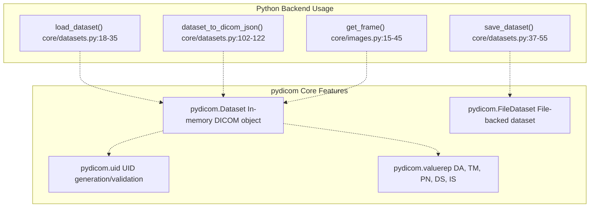

**Sources:** [python/DICOM_reencoder/core/datasets.py L18-L122](https://github.com/ThalesMMS/Dicom-Tools/blob/c7b4cbd8/python/DICOM_reencoder/core/datasets.py#L18-L122)

 [python/tests/test_pydicom_advanced.py L38-L75](https://github.com/ThalesMMS/Dicom-Tools/blob/c7b4cbd8/python/tests/test_pydicom_advanced.py#L38-L75)

### Pynetdicom Network Stack

Pynetdicom implements the DICOM network protocol, enabling SCU (Service Class User) and SCP (Service Class Provider) roles. The [network/](https://github.com/ThalesMMS/Dicom-Tools/blob/c7b4cbd8/network/)

 modules provide high-level interfaces for all DIMSE services.

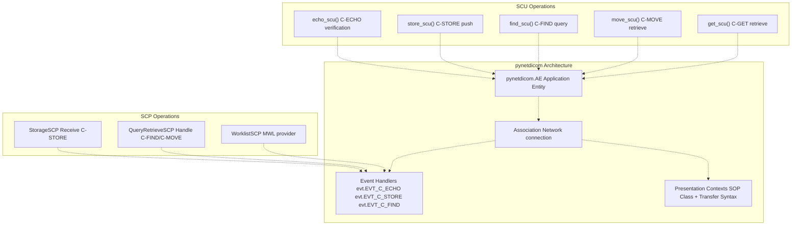

**Sources:** [python/tests/test_pynetdicom_advanced.py L53-L97](https://github.com/ThalesMMS/Dicom-Tools/blob/c7b4cbd8/python/tests/test_pynetdicom_advanced.py#L53-L97)

 [python/tests/test_pynetdicom_advanced.py L200-L234](https://github.com/ThalesMMS/Dicom-Tools/blob/c7b4cbd8/python/tests/test_pynetdicom_advanced.py#L200-L234)

### GDCM Codec Support

GDCM provides optimized implementations for advanced transfer syntaxes. The [transcode_dicom.py](https://github.com/ThalesMMS/Dicom-Tools/blob/c7b4cbd8/transcode_dicom.py)

 module uses GDCM's `ImageChangeTransferSyntax` class for lossless and lossy compression.

| Transfer Syntax | GDCM Codec | Use Case |
| --- | --- | --- |
| JPEG-LS Lossless | `JPEGLSCodec` | Medical imaging compression |
| JPEG 2000 Lossless | `JPEG2000Codec` | High-quality compression |
| JPEG 2000 Lossy | `JPEG2000Codec` | Archival with controlled loss |
| RLE Lossless | `RLECodec` | Fast compression for monochrome |
| JPEG Baseline | `JPEGCodec` | Legacy compatibility |

**Sources:** [python/tests/test_gdcm_advanced.py L35-L67](https://github.com/ThalesMMS/Dicom-Tools/blob/c7b4cbd8/python/tests/test_gdcm_advanced.py#L35-L67)

 [python/tests/test_gdcm_advanced.py L262-L299](https://github.com/ThalesMMS/Dicom-Tools/blob/c7b4cbd8/python/tests/test_gdcm_advanced.py#L262-L299)

### Volume Reconstruction with dicom-numpy

The `dicom-numpy` library converts series of 2D DICOM slices into 3D NumPy arrays with correct spatial orientation. The `combine_slices()` function returns both the volume and a 4x4 affine transformation matrix for NIfTI export.

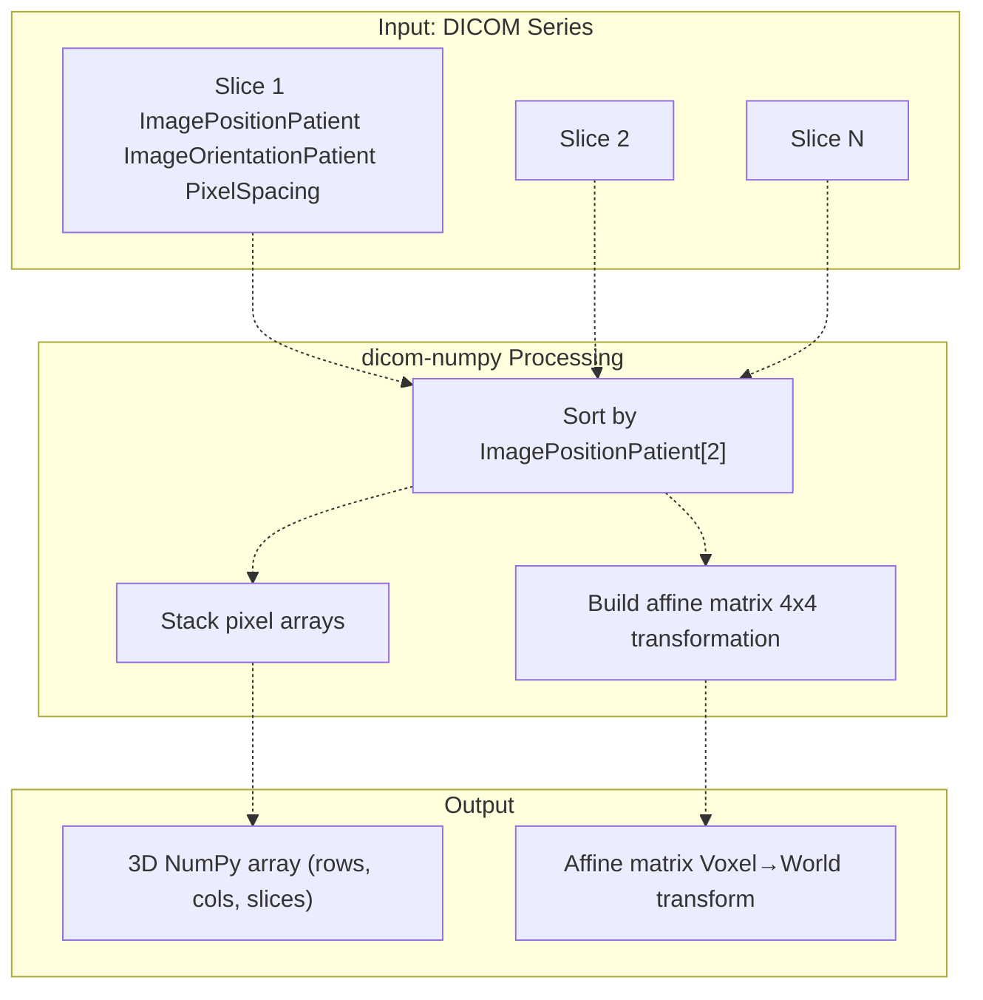

**Sources:** [python/tests/test_dicom_numpy_advanced.py L19-L70](https://github.com/ThalesMMS/Dicom-Tools/blob/c7b4cbd8/python/tests/test_dicom_numpy_advanced.py#L19-L70)

 [python/tests/test_dicom_numpy_advanced.py L354-L385](https://github.com/ThalesMMS/Dicom-Tools/blob/c7b4cbd8/python/tests/test_dicom_numpy_advanced.py#L354-L385)

---

## CLI Command Reference

The Python backend exposes 20+ commands through a Typer-based CLI interface. Each command follows the CLI contract specification for adapter integration.

### File Operations

| Command | Function | Key Parameters | Output |
| --- | --- | --- | --- |
| `info` | Extract metadata | `--input FILE` | JSON metadata dump |
| `dump` | Dataset dump | `--input FILE` | Full tag listing |
| `validate` | DICOM conformance check | `--input FILE` | Validation report |
| `stats` | Pixel statistics | `--input FILE [--frame N]` | Min/max/mean/percentiles |
| `histogram` | Pixel histogram | `--input FILE [--bins N]` | Value distribution |

### Image Processing

| Command | Function | Key Parameters | Output |
| --- | --- | --- | --- |
| `to_image` | PNG/JPEG export | `--input FILE --format png\|jpg [--window-center N] [--window-width N]` | Image file |
| `transcode` | Codec conversion | `--input FILE --syntax explicit\|rle\|jpeg\|j2k` | Transcoded DICOM |
| `anonymize` | PHI removal | `--input FILE [--patient-prefix PREFIX]` | Anonymized DICOM |

### Volume Operations

| Command | Function | Key Parameters | Output |
| --- | --- | --- | --- |
| `volume` | 3D reconstruction | `--input DIR [--output FILE.nii.gz]` | NIfTI file + affine |
| `nifti` | NIfTI export | `--input DIR --output FILE.nii.gz` | NIfTI volume |

### Tag Manipulation

| Command | Function | Key Parameters | Output |
| --- | --- | --- | --- |
| `modify_tag` | Single tag edit | `--input FILE --tag PatientName --value "New^Name"` | Modified DICOM |
| `modify_tags_batch` | Batch tag edit | `--input FILE --modifications JSON` | Modified DICOM |
| `list_tags` | Tag enumeration | `--input FILE` | Tag listing |

### Network Operations

| Command | Function | Key Parameters | Output |
| --- | --- | --- | --- |
| `echo` | C-ECHO verification | `--host ADDR --port PORT [--ae-title AET]` | Connection status |
| `store` | C-STORE push | `--input FILE --host ADDR --port PORT` | Transfer status |
| `find` | C-FIND query | `--host ADDR --port PORT --query JSON` | Query results |
| `move` | C-MOVE retrieve | `--host ADDR --port PORT --query JSON --dest AET` | Move status |
| `worklist` | MWL query | `--host ADDR --port PORT [--query JSON]` | Worklist entries |
| `storage_scp` | Storage receiver | `--port PORT [--output-dir DIR]` | Runs SCP server |

### Batch Operations

| Command | Function | Key Parameters | Output |
| --- | --- | --- | --- |
| `batch_anonymize` | Batch PHI removal | `--input DIR --output DIR` | Multiple anonymized files |
| `batch_convert` | Batch image export | `--input DIR --output DIR --format png\|jpg` | Multiple image files |
| `batch_decompress` | Batch decompression | `--input DIR --output DIR` | Multiple decompressed files |
| `batch_validate` | Batch validation | `--input DIR` | Validation report |

### Organization

| Command | Function | Key Parameters | Output |
| --- | --- | --- | --- |
| `organize_by_patient` | Patient hierarchy | `--input DIR --output DIR [--copy]` | Organized directory |
| `organize_by_study` | Study hierarchy | `--input DIR --output DIR [--copy]` | Organized directory |
| `organize_by_series` | Series hierarchy | `--input DIR --output DIR [--copy]` | Organized directory |
| `organize_by_modality` | Modality grouping | `--input DIR --output DIR [--copy]` | Organized directory |

**Sources:** [README.md L16-L17](https://github.com/ThalesMMS/Dicom-Tools/blob/c7b4cbd8/README.md#L16-L17)

 [BUILD.md L35-L36](https://github.com/ThalesMMS/Dicom-Tools/blob/c7b4cbd8/BUILD.md#L35-L36)

---

## Core Module Architecture

The `DICOM_reencoder.core` package provides foundational operations used by all higher-level modules.

### datasets.py - DICOM I/O

The [core/datasets.py](https://github.com/ThalesMMS/Dicom-Tools/blob/c7b4cbd8/core/datasets.py)

 module centralizes all file loading and saving operations with consistent error handling.

**Key Functions:**

* `load_dataset(path: Path) -> Dataset` [core/datasets.py L18-L35](https://github.com/ThalesMMS/Dicom-Tools/blob/c7b4cbd8/core/datasets.py#L18-L35)  - Loads DICOM file with `force=True` for corrupted files
* `save_dataset(ds: Dataset, path: Path) -> Path` [core/datasets.py L37-L55](https://github.com/ThalesMMS/Dicom-Tools/blob/c7b4cbd8/core/datasets.py#L37-L55)  - Saves with parent directory creation
* `dataset_to_dicom_json(ds: Dataset) -> str` [core/datasets.py L102-L122](https://github.com/ThalesMMS/Dicom-Tools/blob/c7b4cbd8/core/datasets.py#L102-L122)  - DICOM JSON Model serialization
* `dataset_from_dicom_json(json_data: str | dict) -> Dataset` [core/datasets.py L124-L145](https://github.com/ThalesMMS/Dicom-Tools/blob/c7b4cbd8/core/datasets.py#L124-L145)  - Deserializes from JSON
* `ensure_pixel_data(ds: Dataset)` [core/datasets.py L57-L64](https://github.com/ThalesMMS/Dicom-Tools/blob/c7b4cbd8/core/datasets.py#L57-L64)  - Validates pixel data presence

**Sources:** [python/DICOM_reencoder/core/datasets.py L1-L362](https://github.com/ThalesMMS/Dicom-Tools/blob/c7b4cbd8/python/DICOM_reencoder/core/datasets.py#L1-L362)

 [python/tests/test_core_modules.py L33-L82](https://github.com/ThalesMMS/Dicom-Tools/blob/c7b4cbd8/python/tests/test_core_modules.py#L33-L82)

### images.py - Pixel Operations

The [core/images.py](https://github.com/ThalesMMS/Dicom-Tools/blob/c7b4cbd8/core/images.py)

 module handles pixel data extraction, windowing, and format conversion.

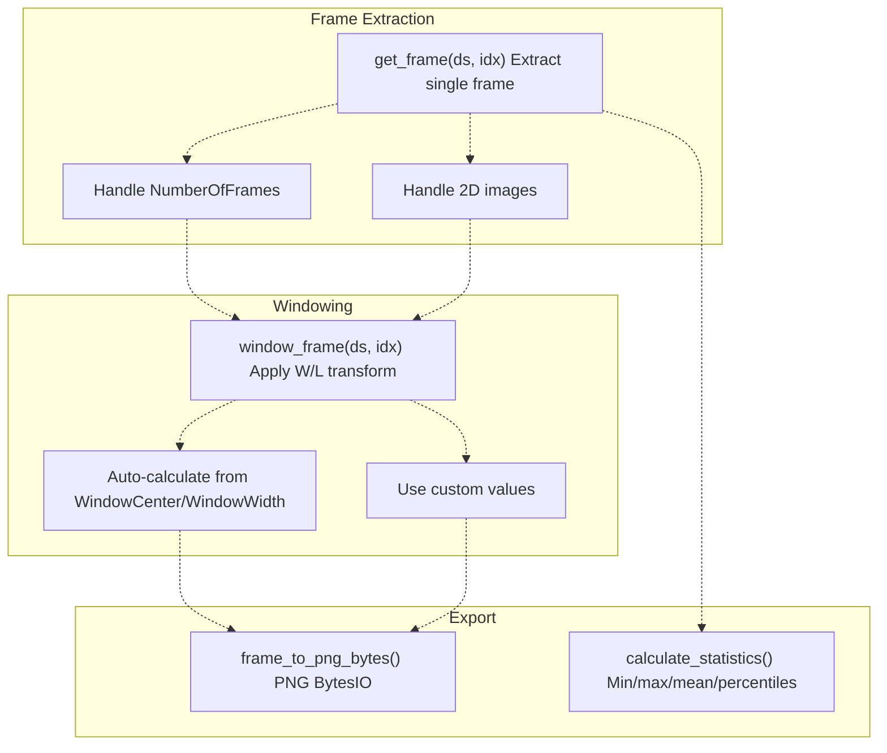

**Key Functions:**

* `get_frame(ds: Dataset, frame_idx: int) -> np.ndarray` [core/images.py L15-L45](https://github.com/ThalesMMS/Dicom-Tools/blob/c7b4cbd8/core/images.py#L15-L45)  - Extracts 2D frame
* `window_frame(ds: Dataset, frame_idx: int, window_center=None, window_width=None) -> np.ndarray` [core/images.py L47-L85](https://github.com/ThalesMMS/Dicom-Tools/blob/c7b4cbd8/core/images.py#L47-L85)  - Applies windowing
* `frame_to_png_bytes(ds: Dataset, frame_idx: int) -> BytesIO` [core/images.py L87-L115](https://github.com/ThalesMMS/Dicom-Tools/blob/c7b4cbd8/core/images.py#L87-L115)  - PNG export
* `calculate_statistics(pixels: np.ndarray) -> dict` [core/images.py L117-L145](https://github.com/ThalesMMS/Dicom-Tools/blob/c7b4cbd8/core/images.py#L117-L145)  - Computes statistics

**Sources:** [python/DICOM_reencoder/core/images.py L1-L180](https://github.com/ThalesMMS/Dicom-Tools/blob/c7b4cbd8/python/DICOM_reencoder/core/images.py#L1-L180)

 [python/tests/test_core_modules.py L114-L180](https://github.com/ThalesMMS/Dicom-Tools/blob/c7b4cbd8/python/tests/test_core_modules.py#L114-L180)

### metadata.py - Metadata Extraction

The [core/metadata.py](https://github.com/ThalesMMS/Dicom-Tools/blob/c7b4cbd8/core/metadata.py)

 module structures DICOM metadata into standardized hierarchical dictionaries.

**Metadata Hierarchy:**

```
{    "patient": {"name", "id", "birth_date", "sex", "age", "weight"},    "study": {"description", "date", "time", "instance_uid", "id"},    "series": {"description", "number", "modality", "instance_uid"},    "image": {"rows", "columns", "bits_allocated", "bits_stored", "photometric_interpretation"},    "acquisition": {"date", "time", "number"},    "equipment": {"manufacturer", "model", "station_name", "software_version"}}
```

**Sources:** [python/DICOM_reencoder/core/metadata.py L1-L150](https://github.com/ThalesMMS/Dicom-Tools/blob/c7b4cbd8/python/DICOM_reencoder/core/metadata.py#L1-L150)

 [python/tests/test_core_modules.py L182-L235](https://github.com/ThalesMMS/Dicom-Tools/blob/c7b4cbd8/python/tests/test_core_modules.py#L182-L235)

### factories.py - Synthetic Dataset Generation

The [core/factories.py](https://github.com/ThalesMMS/Dicom-Tools/blob/c7b4cbd8/core/factories.py)

 module creates synthetic DICOM datasets for testing and demonstration.

**Factory Functions:**

| Function | Output | Use Case |
| --- | --- | --- |
| `build_slice(rows, cols, position, ...)` | Single CT slice | Series generation |
| `build_synthetic_series(output_dir, slices=4)` | Multi-file series | Volume reconstruction tests |
| `build_secondary_capture(shape=(16,16))` | SC dataset | Minimal DICOM testing |
| `build_multiframe_dataset(frames=3)` | Enhanced CT | Multi-frame tests |
| `build_basic_text_sr()` | SR document | Structured report tests |
| `build_segmentation(source, mask)` | SEG object | Segmentation tests |
| `build_nested_sequence_dataset()` | Complex sequences | Sequence handling tests |
| `build_special_vr_dataset()` | Uncommon VRs | VR round-trip tests |

**Sources:** [python/DICOM_reencoder/core/factories.py L1-L362](https://github.com/ThalesMMS/Dicom-Tools/blob/c7b4cbd8/python/DICOM_reencoder/core/factories.py#L1-L362)

 [python/tests/test_core_modules.py L1-L40](https://github.com/ThalesMMS/Dicom-Tools/blob/c7b4cbd8/python/tests/test_core_modules.py#L1-L40)

---

## Anonymization Implementation

The [anonymize_dicom.py](https://github.com/ThalesMMS/Dicom-Tools/blob/c7b4cbd8/anonymize_dicom.py)

 module removes Protected Health Information (PHI) while preserving diagnostic utility.

### Anonymization Strategy

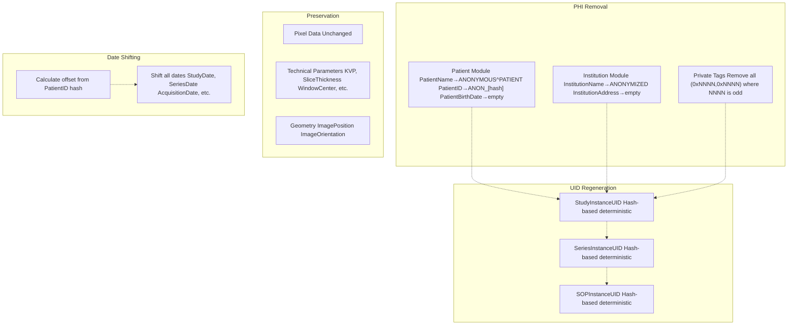

**Key Functions:**

* `anonymize_dicom(input_path, output_path, patient_prefix="ANON")` [anonymize_dicom.py L100-L180](https://github.com/ThalesMMS/Dicom-Tools/blob/c7b4cbd8/anonymize_dicom.py#L100-L180)  - Main anonymization
* `generate_anonymous_id(original_id: str) -> str` [anonymize_dicom.py L15-L25](https://github.com/ThalesMMS/Dicom-Tools/blob/c7b4cbd8/anonymize_dicom.py#L15-L25)  - Deterministic hash-based ID
* `shift_date(date_str: str, days_offset: int) -> str` [anonymize_dicom.py L27-L40](https://github.com/ThalesMMS/Dicom-Tools/blob/c7b4cbd8/anonymize_dicom.py#L27-L40)  - Date shifting

**Anonymized Tags:**

| Tag | Action | Result |
| --- | --- | --- |
| (0010,0010) PatientName | Replace | "ANONYMOUS^PATIENT" |
| (0010,0020) PatientID | Hash | "ANON_[16-char hex]" |
| (0010,0030) PatientBirthDate | Clear | "" |
| (0010,0040) PatientSex | Keep | Unchanged |
| (0010,1040) PatientAddress | Clear | "" |
| (0008,0080) InstitutionName | Replace | "ANONYMIZED" |
| (0020,000D) StudyInstanceUID | Regenerate | Hash-based UID |
| (0020,000E) SeriesInstanceUID | Regenerate | Hash-based UID |
| (0008,0020) StudyDate | Shift | Original + offset |

**Sources:** [python/DICOM_reencoder/anonymize_dicom.py L1-L200](https://github.com/ThalesMMS/Dicom-Tools/blob/c7b4cbd8/python/DICOM_reencoder/anonymize_dicom.py#L1-L200)

 [python/tests/test_anonymize_dicom.py L1-L327](https://github.com/ThalesMMS/Dicom-Tools/blob/c7b4cbd8/python/tests/test_anonymize_dicom.py#L1-L327)

---

## Transcoding and Codec Support

The [transcode_dicom.py](https://github.com/ThalesMMS/Dicom-Tools/blob/c7b4cbd8/transcode_dicom.py)

 module converts between transfer syntaxes using GDCM's high-performance codecs.

### Supported Transfer Syntaxes

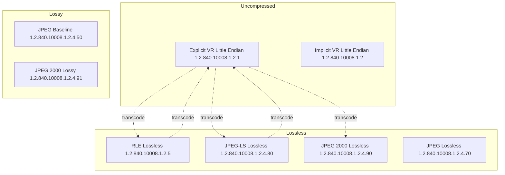

**Transcoding Function:**

```
transcode(input_path, output=None, syntax="explicit") -> Path
```

**Syntax Aliases:**

| Alias | Transfer Syntax UID | Description |
| --- | --- | --- |
| `explicit` | 1.2.840.10008.1.2.1 | Explicit VR Little Endian (uncompressed) |
| `implicit` | 1.2.840.10008.1.2 | Implicit VR Little Endian (uncompressed) |
| `rle` | 1.2.840.10008.1.2.5 | RLE Lossless (fast compression) |
| `jpegls` | 1.2.840.10008.1.2.4.80 | JPEG-LS Lossless (best compression) |
| `jpeg` | 1.2.840.10008.1.2.4.50 | JPEG Baseline (lossy) |
| `j2k` | 1.2.840.10008.1.2.4.90 | JPEG 2000 Lossless |
| `j2k_lossy` | 1.2.840.10008.1.2.4.91 | JPEG 2000 Lossy |

**Sources:** [python/DICOM_reencoder/transcode_dicom.py L1-L150](https://github.com/ThalesMMS/Dicom-Tools/blob/c7b4cbd8/python/DICOM_reencoder/transcode_dicom.py#L1-L150)

 [python/tests/test_gdcm_advanced.py L262-L299](https://github.com/ThalesMMS/Dicom-Tools/blob/c7b4cbd8/python/tests/test_gdcm_advanced.py#L262-L299)

---

## Volume Reconstruction and NIfTI Export

The [volume_operations.py](https://github.com/ThalesMMS/Dicom-Tools/blob/c7b4cbd8/volume_operations.py)

 module converts DICOM series into 3D volumes with correct spatial orientation.

### Volume Pipeline

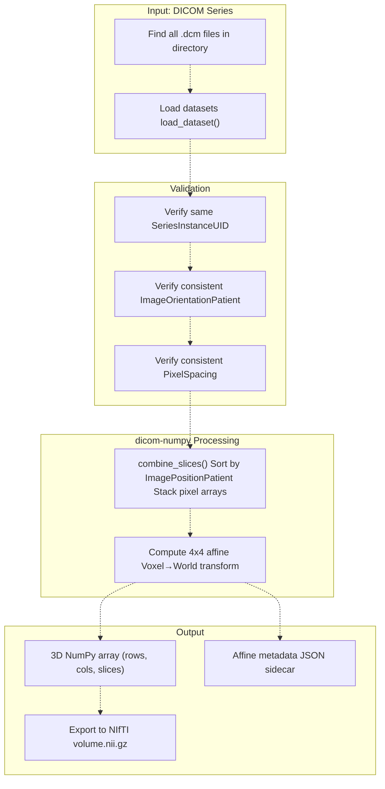

**Affine Matrix Structure:**

The 4x4 affine matrix maps voxel coordinates (i, j, k) to world coordinates (x, y, z):

```
[R11*sx  R12*sy  R13*sz  x0]   [i]   [x]
[R21*sx  R22*sy  R23*sz  y0] × [j] = [y]
[R31*sx  R32*sy  R33*sz  z0]   [k]   [z]
[0       0       0       1 ]   [1]   [1]
```

Where:

* R = rotation matrix from ImageOrientationPatient
* sx, sy, sz = spacing from PixelSpacing and SliceThickness
* x0, y0, z0 = origin from ImagePositionPatient of first slice

**Sources:** [python/DICOM_reencoder/volume_operations.py L1-L180](https://github.com/ThalesMMS/Dicom-Tools/blob/c7b4cbd8/python/DICOM_reencoder/volume_operations.py#L1-L180)

 [python/tests/test_dicom_numpy_advanced.py L19-L70](https://github.com/ThalesMMS/Dicom-Tools/blob/c7b4cbd8/python/tests/test_dicom_numpy_advanced.py#L19-L70)

 [python/tests/test_dicom_numpy_advanced.py L354-L385](https://github.com/ThalesMMS/Dicom-Tools/blob/c7b4cbd8/python/tests/test_dicom_numpy_advanced.py#L354-L385)

---

## Network Operations

The Python backend implements both SCU (client) and SCP (server) roles for DICOM network operations.

### Service Class User (SCU)

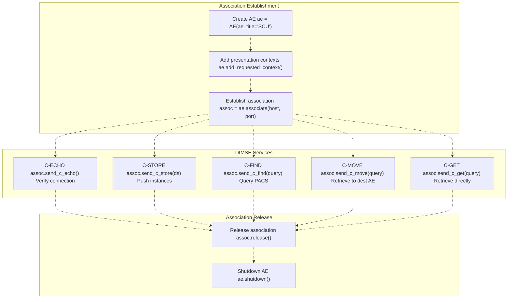

**SCU Functions:**

* `echo_scu(host, port, ae_title="DICOM_TOOLS_SCU")` - C-ECHO verification
* `store_scu(file_path, host, port, ae_title="DICOM_TOOLS_SCU")` - C-STORE push
* `find_scu(query_dict, host, port, ae_title="DICOM_TOOLS_SCU")` - C-FIND query
* `move_scu(query_dict, dest_ae, host, port, ae_title="DICOM_TOOLS_SCU")` - C-MOVE retrieve

**Sources:** [python/tests/test_pynetdicom_advanced.py L53-L97](https://github.com/ThalesMMS/Dicom-Tools/blob/c7b4cbd8/python/tests/test_pynetdicom_advanced.py#L53-L97)

 [python/tests/test_pynetdicom_advanced.py L202-L234](https://github.com/ThalesMMS/Dicom-Tools/blob/c7b4cbd8/python/tests/test_pynetdicom_advanced.py#L202-L234)

### Service Class Provider (SCP)

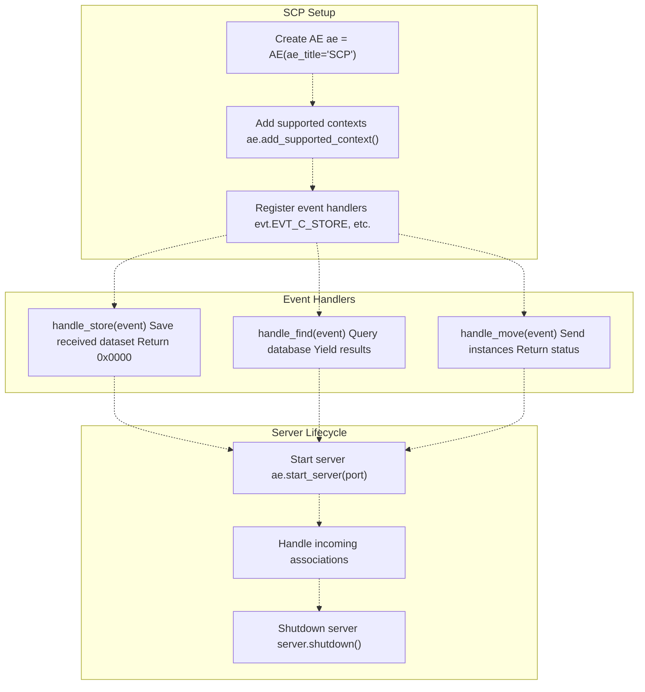

**Event Handler Signatures:**

```
def handle_store(event) -> int:    """C-STORE handler"""    ds = event.dataset    ds.file_meta = event.file_meta    # Save to disk    return 0x0000  # Successdef handle_find(event) -> Iterator[tuple[int, Dataset]]:    """C-FIND handler"""    query = event.identifier    for result in search_database(query):        yield 0xFF00, result  # Pending    yield 0x0000, None  # Successdef handle_echo(event) -> int:    """C-ECHO handler"""    return 0x0000  # Success
```

**Sources:** [python/tests/test_pynetdicom_advanced.py L200-L317](https://github.com/ThalesMMS/Dicom-Tools/blob/c7b4cbd8/python/tests/test_pynetdicom_advanced.py#L200-L317)

 [python/tests/test_pynetdicom_advanced.py L320-L340](https://github.com/ThalesMMS/Dicom-Tools/blob/c7b4cbd8/python/tests/test_pynetdicom_advanced.py#L320-L340)

---

## Batch Processing Architecture

The [batch_process.py](https://github.com/ThalesMMS/Dicom-Tools/blob/c7b4cbd8/batch_process.py)

 module provides parallel processing capabilities for large DICOM datasets.

### Batch Operations

| Operation | Function | Parallelization | Output |
| --- | --- | --- | --- |
| Discovery | `find_dicom_files(dir, recursive=True)` | N/A | List of paths |
| Anonymization | `anonymize_batch(files, output_dir)` | ThreadPoolExecutor | Anonymized files |
| Conversion | `convert_batch(files, output_dir, format)` | ThreadPoolExecutor | Image files |
| Decompression | `decompress_batch(files, output_dir)` | ThreadPoolExecutor | Uncompressed files |
| Validation | `validate_batch(files)` | ThreadPoolExecutor | Validation reports |

**Batch Processing Pattern:**

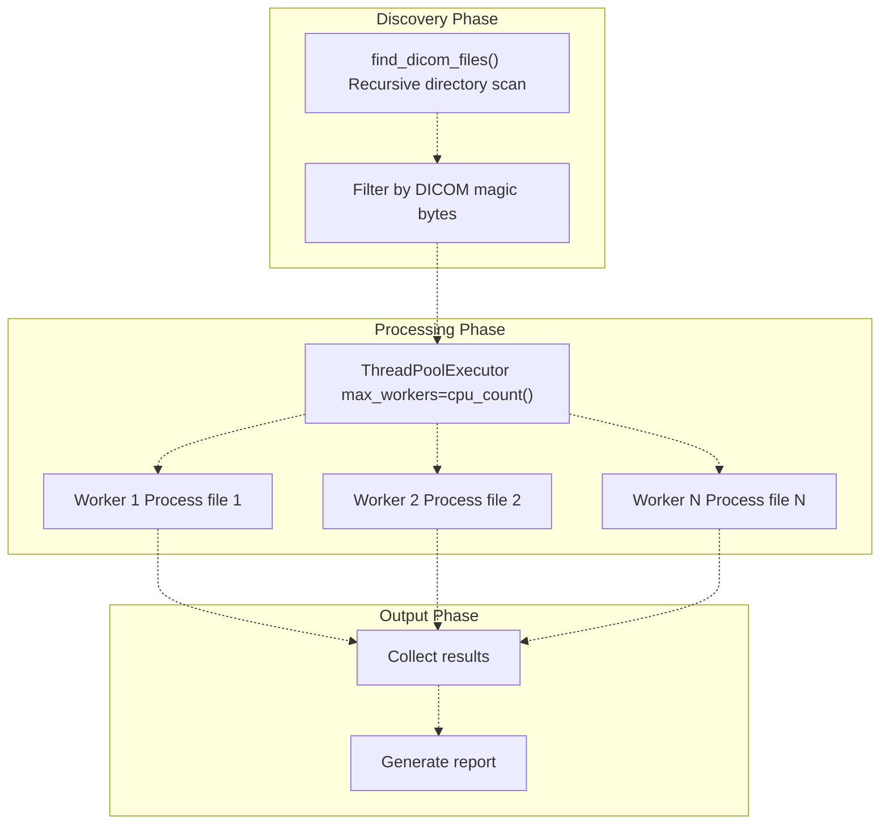

**Sources:** [python/DICOM_reencoder/batch_process.py L1-L200](https://github.com/ThalesMMS/Dicom-Tools/blob/c7b4cbd8/python/DICOM_reencoder/batch_process.py#L1-L200)

 [python/tests/test_batch_process.py L1-L263](https://github.com/ThalesMMS/Dicom-Tools/blob/c7b4cbd8/python/tests/test_batch_process.py#L1-L263)

---

## Testing Infrastructure

The Python backend includes comprehensive test coverage across multiple categories.

### Test Organization

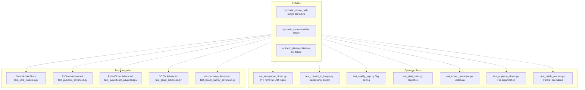

### Test Fixtures

The [core/factories.py](https://github.com/ThalesMMS/Dicom-Tools/blob/c7b4cbd8/core/factories.py)

 module provides pytest fixtures for consistent test data:

**Key Fixtures:**

* `synthetic_dicom_path(tmp_path)` - Returns path to single CT slice (32×32 pixels)
* `synthetic_series(tmp_path)` - Returns (paths, datasets) tuple for 4-slice series
* `synthetic_datasets(tmp_path)` - Returns list of Dataset objects

**Usage Example:**

```
def test_operation(synthetic_dicom_path):    ds = load_dataset(synthetic_dicom_path)    # Test operation on ds
```

### Test Coverage by Module

| Module | Test File | Test Count | Coverage Areas |
| --- | --- | --- | --- |
| Core datasets | test_core_modules.py | 15+ | I/O, JSON, pixel data |
| Core images | test_core_modules.py | 10+ | Frames, windowing, stats |
| PyDicom | test_pydicom_advanced.py | 30+ | UIDs, VRs, sequences, encoding |
| PyNetDicom | test_pynetdicom_advanced.py | 25+ | Associations, services, handlers |
| GDCM | test_gdcm_advanced.py | 20+ | Codecs, anonymization, transcoding |
| dicom-numpy | test_dicom_numpy_advanced.py | 35+ | Affine, orientations, spacing |
| Anonymization | test_anonymize_dicom.py | 20+ | PHI removal, UIDs, dates |
| Conversion | test_convert_to_image.py | 12+ | PNG/JPEG, windowing |
| Tag modification | test_modify_tags.py | 15+ | Single/batch editing |
| Statistics | test_pixel_stats.py | 10+ | Statistics, histograms |
| Metadata | test_extract_metadata.py | 12+ | Extraction, formatting |
| Organization | test_organize_dicom.py | 15+ | Patient/study/series/modality |
| Batch | test_batch_process.py | 15+ | Discovery, parallel processing |

**Running Tests:**

```
cd pythonpytest -q                    # Run all testspytest test_core_modules.py  # Run specific filepytest -k "anonymize"        # Run tests matching patternpytest --cov=DICOM_reencoder # Coverage report
```

**Sources:** [python/tests/test_core_modules.py L1-L40](https://github.com/ThalesMMS/Dicom-Tools/blob/c7b4cbd8/python/tests/test_core_modules.py#L1-L40)

 [python/tests/test_pydicom_advanced.py L1-L75](https://github.com/ThalesMMS/Dicom-Tools/blob/c7b4cbd8/python/tests/test_pydicom_advanced.py#L1-L75)

 [python/tests/test_pynetdicom_advanced.py L1-L97](https://github.com/ThalesMMS/Dicom-Tools/blob/c7b4cbd8/python/tests/test_pynetdicom_advanced.py#L1-L97)

 [python/tests/test_gdcm_advanced.py L1-L67](https://github.com/ThalesMMS/Dicom-Tools/blob/c7b4cbd8/python/tests/test_gdcm_advanced.py#L1-L67)

 [python/tests/test_dicom_numpy_advanced.py L1-L70](https://github.com/ThalesMMS/Dicom-Tools/blob/c7b4cbd8/python/tests/test_dicom_numpy_advanced.py#L1-L70)

---

## Installation and Configuration

### Installation Methods

**Standard Installation:**

```
cd pythonpip install -e .
```

**With Optional Dependencies:**

```
pip install -e .[gdcm]      # GDCM codecspip install -e .[sitk]      # SimpleITK volume opspip install -e .[numpy]     # dicom-numpy reconstructionpip install -e .[network]   # pynetdicompip install -e .[all]       # All optional deps
```

**Development Installation:**

```
pip install -r requirements-dev.txtpip install -e .
```

### Environment Variables

The Python backend can be configured through environment variables for adapter integration:

| Variable | Default | Purpose |
| --- | --- | --- |
| `PYTHON_DICOM_TOOLS_CMD` | `python -m DICOM_reencoder.cli` | Override CLI entry point |
| `DICOM_TOOLS_OUTPUT` | `./output` | Default output directory |
| `DICOM_TOOLS_TEMP` | System temp | Temporary file directory |

### Adapter Integration

The Python backend is accessible through the adapter pattern via `PythonCliAdapter`:

```
from interface.adapters import get_adapteradapter = get_adapter("python")result = adapter.handle({    "op": "info",    "input": "sample.dcm",    "output": "sample_info.json",    "options": {}})
```

**Sources:** [README.md L16-L17](https://github.com/ThalesMMS/Dicom-Tools/blob/c7b4cbd8/README.md#L16-L17)

 [BUILD.md L24-L26](https://github.com/ThalesMMS/Dicom-Tools/blob/c7b4cbd8/BUILD.md#L24-L26)

 [scripts/setup_all.sh L18-L23](https://github.com/ThalesMMS/Dicom-Tools/blob/c7b4cbd8/scripts/setup_all.sh#L18-L23)

Refresh this wiki

Last indexed: 5 January 2026 ([c7b4cb](https://github.com/ThalesMMS/Dicom-Tools/commit/c7b4cbd8))

### On this page

* [Python Backend](#4.1-python-backend)
* [Purpose and Scope](#4.1-purpose-and-scope)
* [Architecture Overview](#4.1-architecture-overview)
* [Module Structure](#4.1-module-structure)
* [Core Library Dependencies](#4.1-core-library-dependencies)
* [Pydicom Integration](#4.1-pydicom-integration)
* [Pynetdicom Network Stack](#4.1-pynetdicom-network-stack)
* [GDCM Codec Support](#4.1-gdcm-codec-support)
* [Volume Reconstruction with dicom-numpy](#4.1-volume-reconstruction-with-dicom-numpy)
* [CLI Command Reference](#4.1-cli-command-reference)
* [File Operations](#4.1-file-operations)
* [Image Processing](#4.1-image-processing)
* [Volume Operations](#4.1-volume-operations)
* [Tag Manipulation](#4.1-tag-manipulation)
* [Network Operations](#4.1-network-operations)
* [Batch Operations](#4.1-batch-operations)
* [Organization](#4.1-organization)
* [Core Module Architecture](#4.1-core-module-architecture)
* [datasets.py - DICOM I/O](#4.1-datasetspy---dicom-io)
* [images.py - Pixel Operations](#4.1-imagespy---pixel-operations)
* [metadata.py - Metadata Extraction](#4.1-metadatapy---metadata-extraction)
* [factories.py - Synthetic Dataset Generation](#4.1-factoriespy---synthetic-dataset-generation)
* [Anonymization Implementation](#4.1-anonymization-implementation)
* [Anonymization Strategy](#4.1-anonymization-strategy)
* [Transcoding and Codec Support](#4.1-transcoding-and-codec-support)
* [Supported Transfer Syntaxes](#4.1-supported-transfer-syntaxes)
* [Volume Reconstruction and NIfTI Export](#4.1-volume-reconstruction-and-nifti-export)
* [Volume Pipeline](#4.1-volume-pipeline)
* [Network Operations](#4.1-network-operations-1)
* [Service Class User (SCU)](#4.1-service-class-user-scu)
* [Service Class Provider (SCP)](#4.1-service-class-provider-scp)
* [Batch Processing Architecture](#4.1-batch-processing-architecture)
* [Batch Operations](#4.1-batch-operations-1)
* [Testing Infrastructure](#4.1-testing-infrastructure)
* [Test Organization](#4.1-test-organization)
* [Test Fixtures](#4.1-test-fixtures)
* [Test Coverage by Module](#4.1-test-coverage-by-module)
* [Installation and Configuration](#4.1-installation-and-configuration)
* [Installation Methods](#4.1-installation-methods)
* [Environment Variables](#4.1-environment-variables)
* [Adapter Integration](#4.1-adapter-integration)

Ask Devin about Dicom-Tools