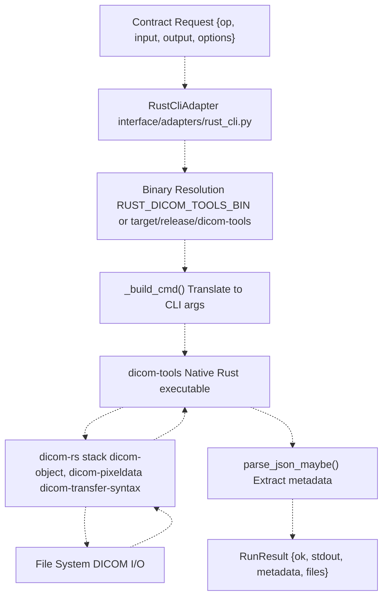
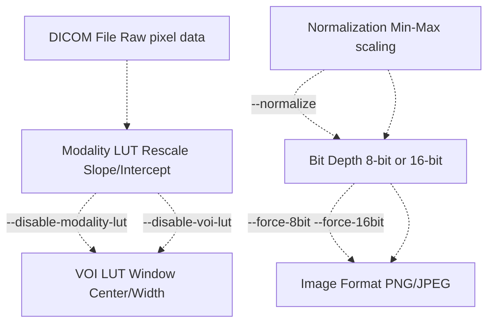
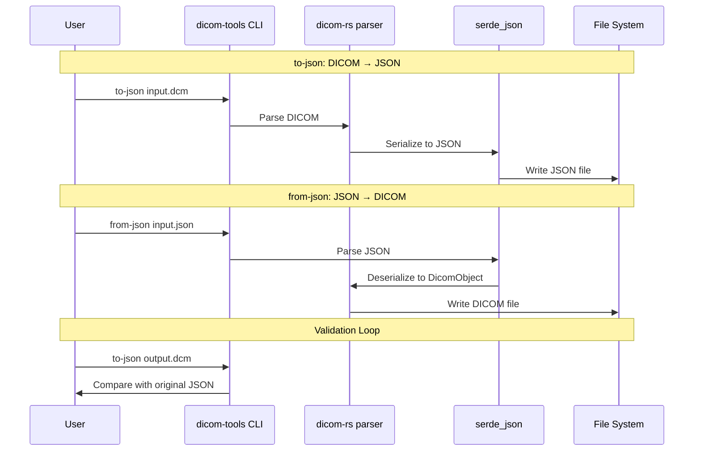
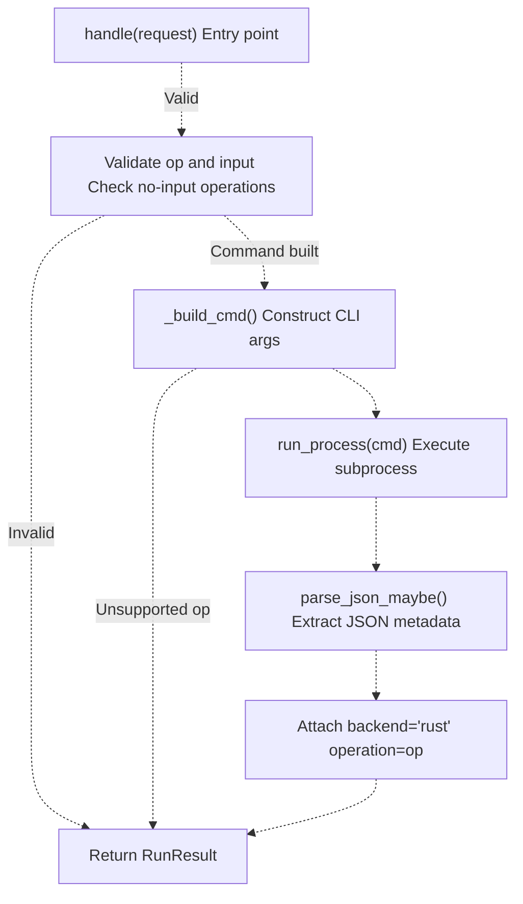

# Rust Backend

> **Relevant source files**
> * [BUILD.md](https://github.com/ThalesMMS/Dicom-Tools/blob/c7b4cbd8/BUILD.md)
> * [README.md](https://github.com/ThalesMMS/Dicom-Tools/blob/c7b4cbd8/README.md)
> * [interface/adapters/csharp_cli.py](https://github.com/ThalesMMS/Dicom-Tools/blob/c7b4cbd8/interface/adapters/csharp_cli.py)
> * [interface/adapters/java_cli.py](https://github.com/ThalesMMS/Dicom-Tools/blob/c7b4cbd8/interface/adapters/java_cli.py)
> * [interface/adapters/rust_cli.py](https://github.com/ThalesMMS/Dicom-Tools/blob/c7b4cbd8/interface/adapters/rust_cli.py)
> * [interface/tests/test_operation_specs.py](https://github.com/ThalesMMS/Dicom-Tools/blob/c7b4cbd8/interface/tests/test_operation_specs.py)
> * [scripts/setup_all.sh](https://github.com/ThalesMMS/Dicom-Tools/blob/c7b4cbd8/scripts/setup_all.sh)

## Purpose and Scope

The Rust backend is a modern DICOM processing implementation built on the [dicom-rs](https://github.com/ThalesMMS/Dicom-Tools/blob/c7b4cbd8/dicom-rs)

 ecosystem. It provides a native CLI executable and optional web server mode, with unique features including JSON round-trip serialization and GPU-accelerated image processing support. This page documents the Rust implementation's architecture, CLI interface, and integration with the unified contract system.

For information about:

* Using the Rust backend through the GUI or headless runner: see [User Interfaces](#2)
* The CLI contract that all backends implement: see [CLI Contract System](#3)
* Other language implementations: see [Language Implementations](#4)
* Specific DICOM operations: see [DICOM Operations](#5)

## Architecture and Integration

The Rust backend integrates into the Dicom-Tools system through the `RustCliAdapter`, which translates standardized contract requests into Rust-specific command-line invocations.

**Diagram: Rust Backend Integration Flow**



Sources: [interface/adapters/rust_cli.py L1-L151](https://github.com/ThalesMMS/Dicom-Tools/blob/c7b4cbd8/interface/adapters/rust_cli.py#L1-L151)

 [README.md L17-L18](https://github.com/ThalesMMS/Dicom-Tools/blob/c7b4cbd8/README.md#L17-L18)

### Binary Resolution Strategy

The adapter locates the Rust binary using a cascading resolution process:

1. **Environment Override**: `RUST_DICOM_TOOLS_CMD` (full command with args)
2. **Binary Path**: `RUST_DICOM_TOOLS_BIN` (path to executable)
3. **Default Release Build**: `rust/target/release/dicom-tools`
4. **Cargo Fallback**: `cargo run --quiet --release --` (if binary not found)

Sources: [interface/adapters/rust_cli.py L11-L26](https://github.com/ThalesMMS/Dicom-Tools/blob/c7b4cbd8/interface/adapters/rust_cli.py#L11-L26)

## Supported Operations

The Rust backend implements a comprehensive set of DICOM operations through its CLI interface. The following table maps contract operations to Rust CLI commands:

| Contract Operation | Rust CLI Command | Output Type | Key Options |
| --- | --- | --- | --- |
| `info` | `info <input>` | JSON metadata | `--verbose`, `--json` |
| `anonymize` | `anonymize <input> --output <output>` | DICOM file | None |
| `to_image` | `to-image <input> --output <output>` | PNG/JPEG | `--format`, `--frame`, `--window-center`, `--window-width`, `--normalize`, `--disable-modality-lut`, `--disable-voi-lut`, `--force-8bit`, `--force-16bit` |
| `transcode` | `transcode <input> --output <output>` | DICOM file | `--transfer-syntax` |
| `validate` | `validate <input>` | Status output | None |
| `dump` | `dump <input>` | Text/JSON | `--max-depth`, `--max-value-len`, `--json` |
| `stats` | `stats <input>` | Statistics | None |
| `histogram` | `histogram <input>` | Histogram data | `--bins` |
| `echo` | `echo <host>:<port>` | Network status | None |
| `to_json` | `to-json <input> --output <output>` | JSON file | None |
| `from_json` | `from-json <input> --output <output>` | DICOM file | None |

Sources: [interface/adapters/rust_cli.py L52-L144](https://github.com/ThalesMMS/Dicom-Tools/blob/c7b4cbd8/interface/adapters/rust_cli.py#L52-L144)

 [README.md L17](https://github.com/ThalesMMS/Dicom-Tools/blob/c7b4cbd8/README.md#L17-L17)

### Advanced to_image Options

The Rust backend's `to_image` command exposes fine-grained control over the rendering pipeline, unique among backends:

**Diagram: to_image Rendering Pipeline**



Sources: [interface/adapters/rust_cli.py L65-L86](https://github.com/ThalesMMS/Dicom-Tools/blob/c7b4cbd8/interface/adapters/rust_cli.py#L65-L86)

 [interface/tests/test_operation_specs.py L16-L19](https://github.com/ThalesMMS/Dicom-Tools/blob/c7b4cbd8/interface/tests/test_operation_specs.py#L16-L19)

## JSON Round-Trip Features

The Rust backend provides unique JSON serialization capabilities not available in other backends, enabling DICOM-to-JSON conversion for analysis and JSON-to-DICOM reconstruction for synthetic data generation.

### to_json Operation

Converts a DICOM file to a complete JSON representation, preserving all elements including sequences and binary data (encoded as base64).

```
dicom-tools to-json input.dcm --output output.json
```

**Use Cases:**

* Data analysis with standard JSON tools (jq, Python json module)
* Human-readable DICOM inspection
* Version control of medical data (excluding pixel data)
* Cross-platform data exchange

Sources: [interface/adapters/rust_cli.py L128-L130](https://github.com/ThalesMMS/Dicom-Tools/blob/c7b4cbd8/interface/adapters/rust_cli.py#L128-L130)

 [README.md L17](https://github.com/ThalesMMS/Dicom-Tools/blob/c7b4cbd8/README.md#L17-L17)

### from_json Operation

Reconstructs a DICOM file from JSON representation, enabling programmatic DICOM generation.

```
dicom-tools from-json input.json --output output.dcm
```

**Use Cases:**

* Synthetic DICOM generation for testing
* Templated DICOM creation
* Programmatic tag modification via JSON editing
* Round-trip validation of DICOM parsers

Sources: [interface/adapters/rust_cli.py L132-L134](https://github.com/ThalesMMS/Dicom-Tools/blob/c7b4cbd8/interface/adapters/rust_cli.py#L132-L134)

**Diagram: JSON Round-Trip Workflow**



Sources: [interface/adapters/rust_cli.py L128-L134](https://github.com/ThalesMMS/Dicom-Tools/blob/c7b4cbd8/interface/adapters/rust_cli.py#L128-L134)

## Web Server Mode

The Rust backend includes an optional web server mode (experimental) for HTTP-based DICOM operations, mentioned in the README but not directly exposed through the contract adapter.

```
cargo run -- web --host 127.0.0.1 --port 3000
```

This mode is designed for:

* RESTful DICOM APIs
* Integration with web-based viewers
* Microservice deployments
* DICOMweb protocol implementations

Sources: [README.md L17](https://github.com/ThalesMMS/Dicom-Tools/blob/c7b4cbd8/README.md#L17-L17)

## Build System

### Standard Build Process

The Rust backend uses Cargo for dependency management and compilation:

```
# Development buildcd rustcargo build# Release build (optimized)cargo build --release# Run testscargo test# Run directly without installingcargo run -- info sample.dcm
```

Sources: [README.md L17](https://github.com/ThalesMMS/Dicom-Tools/blob/c7b4cbd8/README.md#L17-L17)

 [BUILD.md L13-L14](https://github.com/ThalesMMS/Dicom-Tools/blob/c7b4cbd8/BUILD.md#L13-L14)

### Build Artifacts

**Build Output Locations:**

| Configuration | Binary Path | Used By |
| --- | --- | --- |
| Release (default) | `rust/target/release/dicom-tools` | Production, adapters |
| Debug | `rust/target/debug/dicom-tools` | Development, testing |

The release build is preferred for performance-critical operations, especially multi-frame image conversion and large dataset processing.

Sources: [interface/adapters/rust_cli.py L18](https://github.com/ThalesMMS/Dicom-Tools/blob/c7b4cbd8/interface/adapters/rust_cli.py#L18-L18)

 [scripts/setup_all.sh L25-L27](https://github.com/ThalesMMS/Dicom-Tools/blob/c7b4cbd8/scripts/setup_all.sh#L25-L27)

### Automated Setup

The repository-wide setup script builds the Rust backend automatically:

```
./scripts/setup_all.sh
```

This script:

1. Verifies `cargo` is installed
2. Runs `cargo build --release` in the `rust/` directory
3. Reports the binary location: `rust/target/release/dicom-tools`

Sources: [scripts/setup_all.sh L25-L27](https://github.com/ThalesMMS/Dicom-Tools/blob/c7b4cbd8/scripts/setup_all.sh#L25-L27)

 [scripts/setup_all.sh L54](https://github.com/ThalesMMS/Dicom-Tools/blob/c7b4cbd8/scripts/setup_all.sh#L54-L54)

## Adapter Implementation

The `RustCliAdapter` class translates generic contract requests into Rust-specific CLI invocations. This section details the translation logic.

**Diagram: RustCliAdapter Request Processing**



Sources: [interface/adapters/rust_cli.py L28-L50](https://github.com/ThalesMMS/Dicom-Tools/blob/c7b4cbd8/interface/adapters/rust_cli.py#L28-L50)

### Command Construction Logic

The `_build_cmd()` method implements per-operation translation. Key patterns:

**Pattern 1: Simple Operations (info, validate, stats)**

```
[base_cmd, operation, input_path, ...flags]
```

**Pattern 2: Output-Required Operations (anonymize, to_image, transcode)**

```
[base_cmd, operation, input_path, "--output", inferred_output, ...options]
```

**Pattern 3: Network Operations (echo)**

```
[base_cmd, operation, "host:port"]
```

Sources: [interface/adapters/rust_cli.py L52-L144](https://github.com/ThalesMMS/Dicom-Tools/blob/c7b4cbd8/interface/adapters/rust_cli.py#L52-L144)

### Output Path Inference

The adapter automatically infers output paths when not provided:

| Operation | Inference Strategy | Example |
| --- | --- | --- |
| `anonymize` | `_infer_output(..., suffix="_anonymized.dcm")` | `input.dcm` → `input_anonymized.dcm` |
| `to_image` | `_infer_output(..., suffix=".png")` | `input.dcm` → `input.png` |
| `transcode` | `_infer_output(..., suffix="_explicit.dcm")` | `input.dcm` → `input_explicit.dcm` |
| `to_json` | `_infer_output(..., suffix=".json")` | `input.dcm` → `input.json` |
| `from_json` | `_infer_output(..., suffix=".dcm")` | `input.json` → `input.dcm` |

Sources: [interface/adapters/rust_cli.py L62-L63](https://github.com/ThalesMMS/Dicom-Tools/blob/c7b4cbd8/interface/adapters/rust_cli.py#L62-L63)

 [interface/adapters/rust_cli.py L146-L150](https://github.com/ThalesMMS/Dicom-Tools/blob/c7b4cbd8/interface/adapters/rust_cli.py#L146-L150)

### Options Translation

Complex options are translated into Rust CLI flags:

```
# to_image with window/levelif options.get("window_center") is not None:    cmd.extend(["--window-center", str(options["window_center"])])if options.get("window_width") is not None:    cmd.extend(["--window-width", str(options["window_width"])])if options.get("normalize"):    cmd.append("--normalize")
```

Sources: [interface/adapters/rust_cli.py L72-L77](https://github.com/ThalesMMS/Dicom-Tools/blob/c7b4cbd8/interface/adapters/rust_cli.py#L72-L77)

## Comparison with Other Backends

The Rust backend occupies a unique position in the multi-language ecosystem:

**Feature Comparison Matrix:**

| Feature | Python | Rust | C++ | C# | Java |
| --- | --- | --- | --- | --- | --- |
| Core Operations | ★★★★★ | ★★★★ | ★★★★ | ★★★ | ★★★ |
| JSON Round-Trip | ✗ | ✓ | ✗ | ✗ | ✗ |
| Web Server Mode | ✗ | ✓ | ✗ | ✗ | ✗ |
| Advanced Rendering | ✓ | ★★★★ | ★★★★★ | ★★★ | ★★ |
| Network Operations | ★★★★★ | ★★ | ★★★ | ★★★★ | ★★★★ |
| 3D Volume Support | ★★★★ | ✗ | ★★★★★ | ✗ | ✗ |
| Performance | ★★★ | ★★★★★ | ★★★★★ | ★★★★ | ★★★ |

**When to Use Rust Backend:**

* **JSON workflows**: Need DICOM-to-JSON conversion or synthetic DICOM generation
* **Modern tooling**: Prefer modern language features and type safety
* **Performance**: Require fast processing for batch operations
* **Web integration**: Building HTTP APIs for DICOM operations
* **Embedded scenarios**: Need a single native binary with no runtime dependencies

**When to Use Other Backends:**

* **Python**: Comprehensive operations, network features, rapid prototyping ([Python Backend](#4.1))
* **C++**: Advanced visualization (VTK), specialized formats (SR/RT) ([C++ Backend](#4.3))
* **C#/Java**: Enterprise environments, DICOMweb integration ([C# Backend](#4.4), [Java Backend](#4.5))

Sources: [README.md L7-L22](https://github.com/ThalesMMS/Dicom-Tools/blob/c7b4cbd8/README.md#L7-L22)

## Configuration and Environment Variables

The Rust backend supports multiple configuration methods for flexible deployment:

### Environment Variables

| Variable | Purpose | Example |
| --- | --- | --- |
| `RUST_DICOM_TOOLS_CMD` | Full command override | `"/opt/dicom-tools --verbose"` |
| `RUST_DICOM_TOOLS_BIN` | Binary path (relative or absolute) | `"./target/debug/dicom-tools"` |
| `BUILD_TYPE` | CMake build type (setup script) | `"Debug"` (default: `"Release"`) |

**Precedence Order:**

1. `RUST_DICOM_TOOLS_CMD` (highest priority, includes args)
2. `RUST_DICOM_TOOLS_BIN` (binary path only)
3. `rust/target/release/dicom-tools` (default)
4. `cargo run --quiet --release --` (fallback)

Sources: [interface/adapters/rust_cli.py L14-L26](https://github.com/ThalesMMS/Dicom-Tools/blob/c7b4cbd8/interface/adapters/rust_cli.py#L14-L26)

 [BUILD.md L36](https://github.com/ThalesMMS/Dicom-Tools/blob/c7b4cbd8/BUILD.md#L36-L36)

### Working Directory

The adapter executes all commands from `rust/` as the working directory, ensuring relative paths in Rust code resolve correctly:

```
result = run_process(cmd, cwd=self.cwd)  # self.cwd = root / "rust"
```

Sources: [interface/adapters/rust_cli.py L13](https://github.com/ThalesMMS/Dicom-Tools/blob/c7b4cbd8/interface/adapters/rust_cli.py#L13-L13)

 [interface/adapters/rust_cli.py L42](https://github.com/ThalesMMS/Dicom-Tools/blob/c7b4cbd8/interface/adapters/rust_cli.py#L42-L42)

## Error Handling and Metadata

The adapter provides structured error handling and metadata extraction:

### Metadata Parsing

JSON output from the Rust CLI is automatically parsed and attached to results:

```
meta = parse_json_maybe(result.stdout)if meta is not None:    result.metadata = meta
```

**Operations with JSON Output:**

* `info --json`: Patient/study/series metadata
* `dump --json`: Complete dataset dump
* `stats`: Pixel statistics (min, max, mean, std)
* `histogram`: Bin counts and distribution

Sources: [interface/adapters/rust_cli.py L43-L45](https://github.com/ThalesMMS/Dicom-Tools/blob/c7b4cbd8/interface/adapters/rust_cli.py#L43-L45)

### Result Structure

Every operation returns a `RunResult` with:

| Field | Type | Description |
| --- | --- | --- |
| `ok` | `bool` | Operation success status |
| `returncode` | `int` | Process exit code |
| `stdout` | `str` | Standard output |
| `stderr` | `str` | Error messages |
| `output_files` | `list[str]` | Generated file paths |
| `metadata` | `dict` or `None` | Parsed JSON data |
| `backend` | `str` | Always `"rust"` |
| `operation` | `str` | Original operation name |

Sources: [interface/adapters/rust_cli.py L42-L50](https://github.com/ThalesMMS/Dicom-Tools/blob/c7b4cbd8/interface/adapters/rust_cli.py#L42-L50)

## Testing

The Rust backend includes comprehensive unit tests and integration tests through the contract validation system.

### Unit Tests

Run Rust-specific tests:

```
cd rustcargo test
```

Sources: [README.md L17](https://github.com/ThalesMMS/Dicom-Tools/blob/c7b4cbd8/README.md#L17-L17)

 [BUILD.md L14](https://github.com/ThalesMMS/Dicom-Tools/blob/c7b4cbd8/BUILD.md#L14-L14)

### Contract Compliance Tests

The interface test suite validates that the Rust backend conforms to the shared contract:

```
cd interfacepytest tests/test_operation_specs.py::test_rust_to_image_exposes_window_level_options
```

This test verifies that the Rust backend's `to_image` operation correctly exposes window/level options in its spec.

Sources: [interface/tests/test_operation_specs.py L16-L19](https://github.com/ThalesMMS/Dicom-Tools/blob/c7b4cbd8/interface/tests/test_operation_specs.py#L16-L19)

### CI/CD Integration

The GitHub Actions workflow builds and tests the Rust backend on every push:

```
# .github/workflows/ci.yml- name: Build Rust  run: cd rust && cargo build --release- name: Test Rust  run: cd rust && cargo test
```

Sources: [BUILD.md L47-L48](https://github.com/ThalesMMS/Dicom-Tools/blob/c7b4cbd8/BUILD.md#L47-L48)

Refresh this wiki

Last indexed: 5 January 2026 ([c7b4cb](https://github.com/ThalesMMS/Dicom-Tools/commit/c7b4cbd8))

### On this page

* [Rust Backend](#4.2-rust-backend)
* [Purpose and Scope](#4.2-purpose-and-scope)
* [Architecture and Integration](#4.2-architecture-and-integration)
* [Binary Resolution Strategy](#4.2-binary-resolution-strategy)
* [Supported Operations](#4.2-supported-operations)
* [Advanced to_image Options](#4.2-advanced-to_image-options)
* [JSON Round-Trip Features](#4.2-json-round-trip-features)
* [to_json Operation](#4.2-to_json-operation)
* [from_json Operation](#4.2-from_json-operation)
* [Web Server Mode](#4.2-web-server-mode)
* [Build System](#4.2-build-system)
* [Standard Build Process](#4.2-standard-build-process)
* [Build Artifacts](#4.2-build-artifacts)
* [Automated Setup](#4.2-automated-setup)
* [Adapter Implementation](#4.2-adapter-implementation)
* [Command Construction Logic](#4.2-command-construction-logic)
* [Output Path Inference](#4.2-output-path-inference)
* [Options Translation](#4.2-options-translation)
* [Comparison with Other Backends](#4.2-comparison-with-other-backends)
* [Configuration and Environment Variables](#4.2-configuration-and-environment-variables)
* [Environment Variables](#4.2-environment-variables)
* [Working Directory](#4.2-working-directory)
* [Error Handling and Metadata](#4.2-error-handling-and-metadata)
* [Metadata Parsing](#4.2-metadata-parsing)
* [Result Structure](#4.2-result-structure)
* [Testing](#4.2-testing)
* [Unit Tests](#4.2-unit-tests)
* [Contract Compliance Tests](#4.2-contract-compliance-tests)
* [CI/CD Integration](#4.2-cicd-integration)

Ask Devin about Dicom-Tools