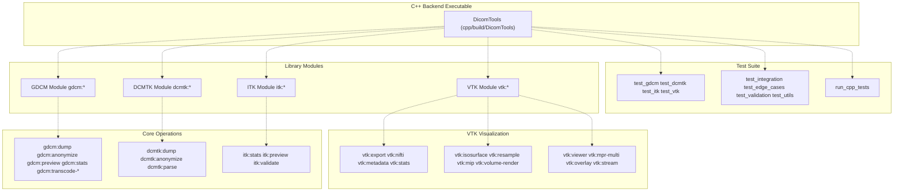
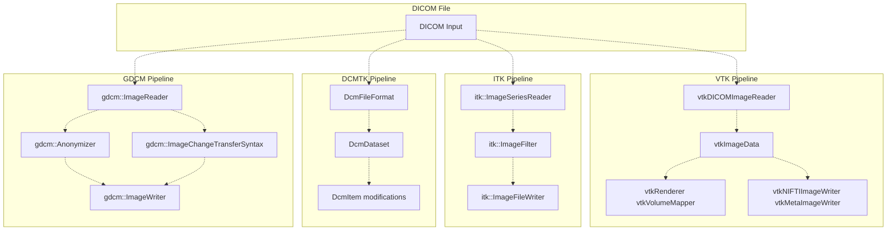
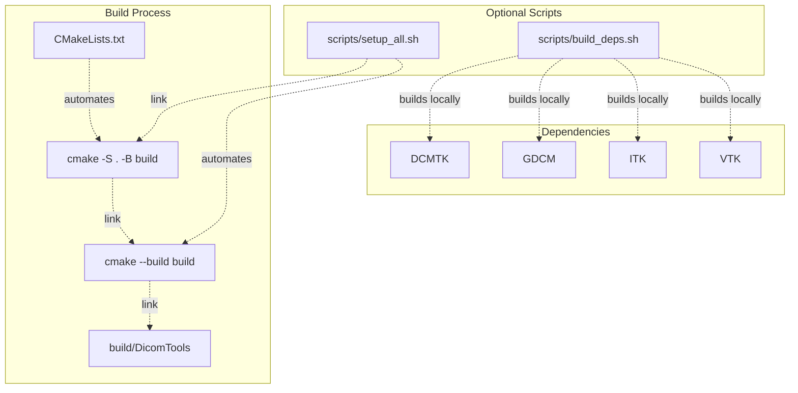
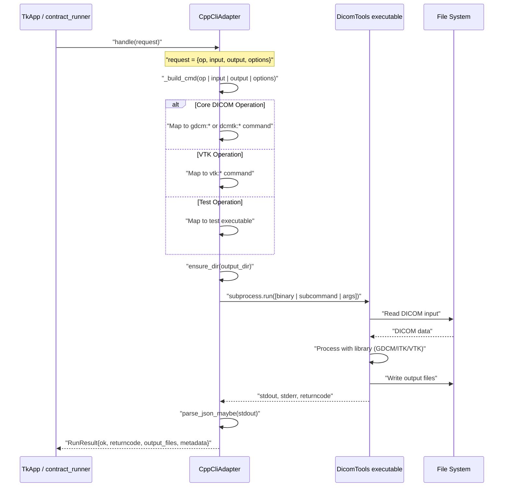
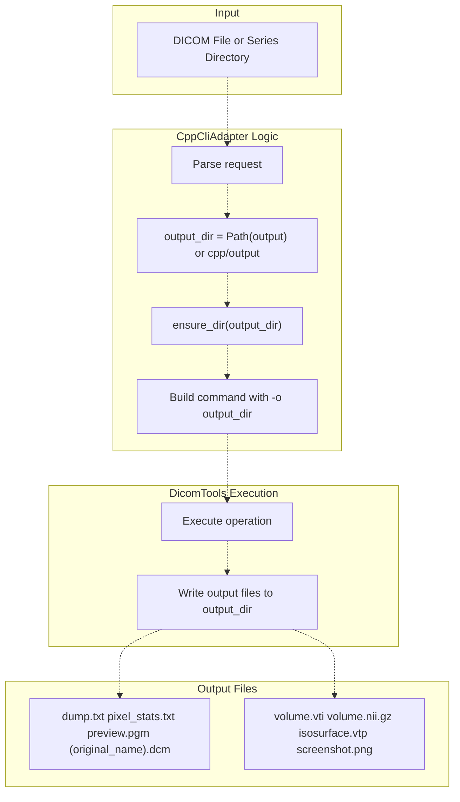
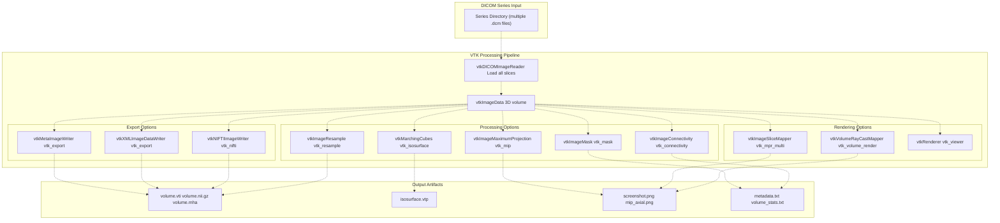
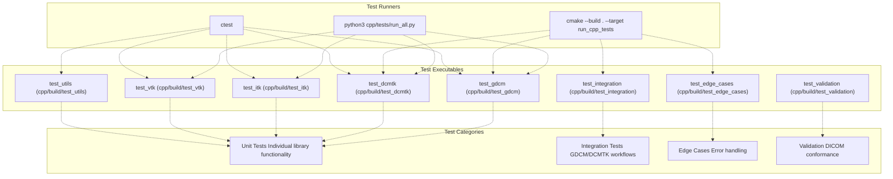
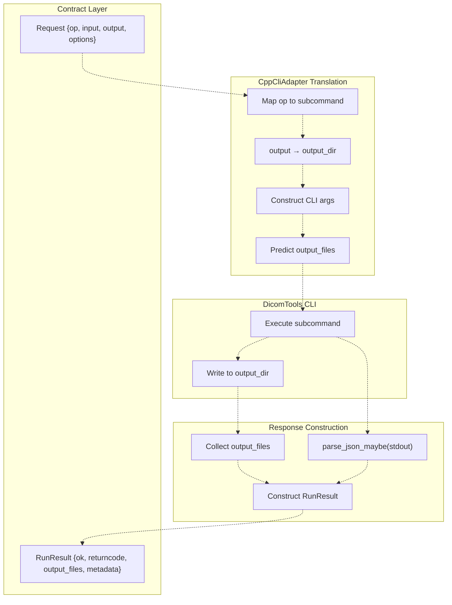

# C++ Backend

> **Relevant source files**
> * [BUILD.md](https://github.com/ThalesMMS/Dicom-Tools/blob/c7b4cbd8/BUILD.md)
> * [README.md](https://github.com/ThalesMMS/Dicom-Tools/blob/c7b4cbd8/README.md)
> * [interface/adapters/cpp_cli.py](https://github.com/ThalesMMS/Dicom-Tools/blob/c7b4cbd8/interface/adapters/cpp_cli.py)
> * [interface/app.py](https://github.com/ThalesMMS/Dicom-Tools/blob/c7b4cbd8/interface/app.py)
> * [scripts/setup_all.sh](https://github.com/ThalesMMS/Dicom-Tools/blob/c7b4cbd8/scripts/setup_all.sh)

## Purpose and Scope

This page documents the C++ backend implementation of the Dicom-Tools toolkit. The C++ backend leverages four major medical imaging libraries (DCMTK, GDCM, ITK, VTK) to provide DICOM file processing, advanced visualization, and specialized medical format support. It is particularly distinguished by its VTK-based 3D visualization capabilities and support for Structured Reports (SR) and Radiotherapy (RT) data structures.

For information about building all backends including C++, see [Build System](#8.1). For details on the CLI contract that the C++ backend implements, see [CLI Contract System](#3). For operation-specific documentation, see [DICOM Operations](#5).

---

## Architecture Overview

The C++ backend is built as a single executable (`DicomTools`) that provides multiple subcommands for different libraries and operations. Unlike the Python backend which uses separate commands, the C++ implementation uses a namespace-prefixed command structure (e.g., `gdcm:dump`, `vtk:export`).



**Sources:** [interface/app.py L162-L179](https://github.com/ThalesMMS/Dicom-Tools/blob/c7b4cbd8/interface/app.py#L162-L179)

 [interface/adapters/cpp_cli.py L55-L144](https://github.com/ThalesMMS/Dicom-Tools/blob/c7b4cbd8/interface/adapters/cpp_cli.py#L55-L144)

---

## Library Roles and Capabilities

The C++ backend integrates four major medical imaging libraries, each with distinct responsibilities:

| Library | Primary Use Cases | Operations Supported |
| --- | --- | --- |
| **GDCM** | DICOM parsing, transcoding, anonymization | `info`, `anonymize`, `to_image`, `transcode`, `validate`, `stats`, `dump` |
| **DCMTK** | Alternative DICOM parsing, network operations | `info`, `anonymize`, `to_image`, `transcode`, `validate`, `dump` |
| **ITK** | Image processing, format conversion | `to_image`, `validate`, `stats` |
| **VTK** | 3D visualization, volume rendering, MPR | All `vtk:*` operations (15+ visualization commands) |



**Sources:** [interface/app.py L162-L179](https://github.com/ThalesMMS/Dicom-Tools/blob/c7b4cbd8/interface/app.py#L162-L179)

 [README.md L8-L13](https://github.com/ThalesMMS/Dicom-Tools/blob/c7b4cbd8/README.md#L8-L13)

---

## Build System

The C++ backend uses CMake as its build system with a minimum version requirement of 3.15 and C++17 compiler support.

### Build Configuration

The build process is centralized through CMake configuration:

**Build Location:** `cpp/build/DicomTools`
**Environment Variable:** `CPP_DICOM_TOOLS_BIN` (override for custom binary location)



### Build Commands

Standard build sequence:

```
mkdir -p cpp/buildcd cpp/buildcmake -DCMAKE_BUILD_TYPE=Release ..cmake --build .
```

Using the unified setup script:

```
./scripts/setup_all.sh  # Builds C++ along with other backends
```

The build type can be controlled via the `BUILD_TYPE` environment variable (default: `Release`).

**Sources:** [scripts/setup_all.sh L29-L38](https://github.com/ThalesMMS/Dicom-Tools/blob/c7b4cbd8/scripts/setup_all.sh#L29-L38)

 [README.md L18](https://github.com/ThalesMMS/Dicom-Tools/blob/c7b4cbd8/README.md#L18-L18)

 [BUILD.md L16-L17](https://github.com/ThalesMMS/Dicom-Tools/blob/c7b4cbd8/BUILD.md#L16-L17)

---

## CLI Structure and Adapter Integration

The C++ backend is invoked through the `CppCliAdapter` class, which translates generic contract requests into backend-specific command invocations.



### Command Building Logic

The adapter implements operation-to-command mapping in `_build_cmd()`:

**Core Operations (GDCM-based):**

* `info` / `dump` → `gdcm:dump -i <input> -o <output_dir>`
* `anonymize` → `gdcm:anonymize -i <input> -o <output_dir>`
* `to_image` → `gdcm:preview -i <input> -o <output_dir>`
* `stats` → `gdcm:stats -i <input> -o <output_dir>`
* `transcode` → `gdcm:transcode-j2k` or `gdcm:transcode-rle` or `gdcm:jpegls` (based on `syntax` option)

**VTK Operations:**

* `vtk_export` → `vtk:export -i <series_dir> -o <output_dir>`
* `vtk_nifti` → `vtk:nifti -i <series_dir> -o <output_dir>`
* `vtk_volume_render` → `vtk:volume-render -i <series_dir> -o <output_dir>`
* And 12 more VTK visualization commands

**Test Executables:**

* `test_gdcm` → Execute `cpp/build/test_gdcm`
* `test_dcmtk` → Execute `cpp/build/test_dcmtk`
* `run_cpp_tests` → `cmake --build . --target run_cpp_tests`

**Sources:** [interface/adapters/cpp_cli.py L55-L144](https://github.com/ThalesMMS/Dicom-Tools/blob/c7b4cbd8/interface/adapters/cpp_cli.py#L55-L144)

---

## Output Directory Behavior

Unlike other backends that allow flexible output file paths, the C++ backend uses a directory-based output model:



**Key Differences from Other Backends:**

| Backend | Output Style | Example |
| --- | --- | --- |
| Python | File path | `--output /path/to/output.dcm` |
| Rust | File path | `-o /path/to/output.png` |
| C++ | **Directory** | `-o /path/to/output_dir/` |

The adapter handles this automatically by:

1. Accepting output path from the request
2. Treating it as a directory (creating if needed)
3. Predicting output file names based on operation type
4. Returning these paths in `RunResult.output_files`

**Sources:** [interface/adapters/cpp_cli.py L55-L92](https://github.com/ThalesMMS/Dicom-Tools/blob/c7b4cbd8/interface/adapters/cpp_cli.py#L55-L92)

 [interface/app.py L728-L735](https://github.com/ThalesMMS/Dicom-Tools/blob/c7b4cbd8/interface/app.py#L728-L735)

---

## VTK Visualization Capabilities

The C++ backend's most distinctive feature is its comprehensive VTK-based visualization toolkit, supporting 15+ specialized operations unavailable in other language backends.

### VTK Operations Catalog

| Category | Operations | Output Artifacts |
| --- | --- | --- |
| **Export & Conversion** | `vtk_export`, `vtk_nifti` | `.vti`, `.nii.gz`, `.mha`, `.nrrd` |
| **Volume Processing** | `vtk_resample`, `vtk_mask`, `vtk_connectivity` | Processed volume files |
| **Projections** | `vtk_mip` (Maximum Intensity Projection) | MIP images, MinIP, AIP |
| **3D Reconstruction** | `vtk_isosurface` | `.vtp` surface meshes |
| **Visualization** | `vtk_viewer`, `vtk_volume_render`, `vtk_mpr_multi` | Interactive windows, screenshots |
| **Analysis** | `vtk_metadata`, `vtk_stats` | Text reports with volume info |
| **Advanced** | `vtk_overlay`, `vtk_stream` | Multi-dataset visualization |



### VTK Command Mapping

The adapter maps VTK operations to CLI subcommands:

```
vtk_map = {    "vtk_export": "vtk:export",    "vtk_nifti": "vtk:nifti",    "vtk_isosurface": "vtk:isosurface",    "vtk_resample": "vtk:resample",    "vtk_mask": "vtk:mask",    "vtk_connectivity": "vtk:connectivity",    "vtk_mip": "vtk:mip",    "vtk_metadata": "vtk:metadata",    "vtk_stats": "vtk:stats",    "vtk_viewer": "vtk:viewer",    "vtk_volume_render": "vtk:volume-render",    "vtk_mpr_multi": "vtk:mpr-multi",    "vtk_overlay": "vtk:overlay",    "vtk_stream": "vtk:stream",}
```

All VTK operations:

* Require a series directory as input (not a single file)
* Output to a directory (not a single file)
* Return the output directory path in `RunResult.output_files`

**Sources:** [interface/adapters/cpp_cli.py L95-L114](https://github.com/ThalesMMS/Dicom-Tools/blob/c7b4cbd8/interface/adapters/cpp_cli.py#L95-L114)

 [interface/app.py L131-L147](https://github.com/ThalesMMS/Dicom-Tools/blob/c7b4cbd8/interface/app.py#L131-L147)

 [interface/app.py L769-L776](https://github.com/ThalesMMS/Dicom-Tools/blob/c7b4cbd8/interface/app.py#L769-L776)

---

## Testing Infrastructure

The C++ backend includes a comprehensive test suite covering unit tests, integration tests, and edge case validation.

### Test Organization



### Test Operations in the Contract

The adapter exposes test operations through the CLI contract, allowing them to be invoked via the TkApp GUI or contract runner:

| Operation | Executable | Working Directory | Description |
| --- | --- | --- | --- |
| `test_gdcm` | `cpp/build/test_gdcm` | `cpp/build` | GDCM unit tests |
| `test_dcmtk` | `cpp/build/test_dcmtk` | `cpp/build` | DCMTK unit tests |
| `test_itk` | `cpp/build/test_itk` | `cpp/build` | ITK unit tests |
| `test_vtk_unit` | `cpp/build/test_vtk` | `cpp/build` | VTK unit tests |
| `test_utils` | `cpp/build/test_utils` | `cpp/build` | Utility function tests |
| `test_integration` | `cpp/build/test_integration` | `cpp/build` | Integration tests |
| `test_edge_cases` | `cpp/build/test_edge_cases` | `cpp/build` | Edge case tests |
| `test_validation` | `cpp/build/test_validation` | `cpp/build` | Validation tests |
| `run_cpp_tests` | `cmake --build . --target run_cpp_tests` | `cpp/build` | Run all tests |

The adapter sets the working directory to `cpp/build` for all test operations to ensure they can find linked libraries and test data.

**Sources:** [interface/adapters/cpp_cli.py L33-L44](https://github.com/ThalesMMS/Dicom-Tools/blob/c7b4cbd8/interface/adapters/cpp_cli.py#L33-L44)

 [interface/adapters/cpp_cli.py L126-L143](https://github.com/ThalesMMS/Dicom-Tools/blob/c7b4cbd8/interface/adapters/cpp_cli.py#L126-L143)

 [interface/app.py L168-L178](https://github.com/ThalesMMS/Dicom-Tools/blob/c7b4cbd8/interface/app.py#L168-L178)

### Running Tests

Three methods to execute the test suite:

**1. Python Test Runner:**

```
python3 cpp/tests/run_all.py
```

**2. CMake Target:**

```
cd cpp/buildcmake --build . --target run_cpp_tests
```

**3. CTest:**

```
cd cpp/buildctest
```

**Sources:** [README.md L18](https://github.com/ThalesMMS/Dicom-Tools/blob/c7b4cbd8/README.md#L18-L18)

 [BUILD.md L27](https://github.com/ThalesMMS/Dicom-Tools/blob/c7b4cbd8/BUILD.md#L27-L27)

---

## Operation Reference

### Core DICOM Operations

| Operation | Command | Input | Output | Description |
| --- | --- | --- | --- | --- |
| `info` | `gdcm:dump` | DICOM file | `dump.txt` | Metadata extraction |
| `dump` | `gdcm:dump` | DICOM file | `dump.txt` | Complete dataset dump |
| `anonymize` | `gdcm:anonymize` | DICOM file | `(original_name).dcm` | PHI removal |
| `to_image` | `gdcm:preview` | DICOM file | `preview.pgm` | Frame extraction |
| `stats` | `gdcm:stats` | DICOM file | `pixel_stats.txt` | Pixel statistics |
| `transcode` | `gdcm:transcode-*` | DICOM file | `(original_name).dcm` | Transfer syntax conversion |
| `validate` | `gdcm:dump` | DICOM file | `dump.txt` | DICOM validation (proxy) |

### Transcode Syntax Options

The `transcode` operation supports multiple transfer syntaxes via the `syntax` option:

* `j2k`, `jpeg2000`, `jpeg2000-lossless`, `jpeg2000_lossless` → `gdcm:transcode-j2k`
* `rle`, `rle-lossless`, `rle_lossless` → `gdcm:transcode-rle`
* Other values (fallback) → `gdcm:jpegls`

**Sources:** [interface/adapters/cpp_cli.py L61-L92](https://github.com/ThalesMMS/Dicom-Tools/blob/c7b4cbd8/interface/adapters/cpp_cli.py#L61-L92)

 [interface/app.py L362-L394](https://github.com/ThalesMMS/Dicom-Tools/blob/c7b4cbd8/interface/app.py#L362-L394)

---

## Environment Configuration

The C++ backend supports runtime configuration through environment variables:

| Variable | Purpose | Default Value |
| --- | --- | --- |
| `CPP_DICOM_TOOLS_BIN` | Override path to DicomTools executable | `cpp/build/DicomTools` |
| `BUILD_TYPE` | CMake build configuration (during build) | `Release` |

### Binary Path Resolution

The adapter resolves the binary path with the following logic:

```
default_bin = os.environ.get("CPP_DICOM_TOOLS_BIN",                              str(root / "cpp" / "build" / "DicomTools"))bin_path = Path(default_bin)if not bin_path.is_absolute():    bin_path = (root / bin_path).resolve()
```

This allows for:

1. Absolute paths: `/usr/local/bin/DicomTools`
2. Relative paths from repo root: `cpp/build-debug/DicomTools`
3. Default fallback: `cpp/build/DicomTools`

**Sources:** [interface/adapters/cpp_cli.py L11-L17](https://github.com/ThalesMMS/Dicom-Tools/blob/c7b4cbd8/interface/adapters/cpp_cli.py#L11-L17)

 [BUILD.md L38](https://github.com/ThalesMMS/Dicom-Tools/blob/c7b4cbd8/BUILD.md#L38-L38)

---

## Integration with Contract System

The C++ backend fully implements the CLI contract specification, with adapter-specific translations for its directory-based output model.



### Contract Compliance

**Standard Contract Fields:**

* `op`: Mapped to subcommand (e.g., `anonymize` → `gdcm:anonymize`)
* `input`: Passed as `-i` argument
* `output`: Converted to directory, passed as `-o` argument
* `options`: Interpreted per-operation (e.g., `syntax` for transcode)

**Backend-Specific Behavior:**

* All operations output to directories, not individual files
* File names are predetermined (e.g., `dump.txt`, `preview.pgm`)
* Test operations ignore input/output and run in `cpp/build` directory

**Sources:** [interface/adapters/cpp_cli.py L19-L53](https://github.com/ThalesMMS/Dicom-Tools/blob/c7b4cbd8/interface/adapters/cpp_cli.py#L19-L53)

 [interface/app.py L728-L735](https://github.com/ThalesMMS/Dicom-Tools/blob/c7b4cbd8/interface/app.py#L728-L735)

---

## Comparison with Other Backends

The C++ backend fills a unique niche in the multi-language toolkit:

| Capability | Python | Rust | **C++** | C# | Java |
| --- | --- | --- | --- | --- | --- |
| Core operations | ✓✓✓ | ✓✓ | ✓✓ | ✓✓ | ✓✓ |
| VTK visualization | ✗ | ✗ | **✓✓✓** | ✗ | ✗ |
| 3D volume rendering | Basic | ✗ | **Advanced** | ✗ | ✗ |
| SR/RT support | Limited | ✗ | **✓** | ✓ | ✓ |
| Network operations | ✓✓ | Basic | ✗ | ✓✓ | ✓✓ |
| Build complexity | Low | Low | **High** | Low | Medium |
| Performance | Medium | High | **High** | Medium | Medium |

**C++ Advantages:**

* Only backend with full VTK integration (15+ visualization operations)
* Native performance for computationally intensive operations
* Access to four major medical imaging libraries
* Advanced 3D rendering and volume processing

**C++ Disadvantages:**

* Complex build dependencies (CMake, DCMTK, GDCM, ITK, VTK)
* Directory-based output model less flexible than file-based
* No network operations (use Python/C#/Java for PACS integration)
* Higher maintenance burden for dependency management

**Sources:** [README.md L8-L13](https://github.com/ThalesMMS/Dicom-Tools/blob/c7b4cbd8/README.md#L8-L13)

 [interface/app.py L149-L187](https://github.com/ThalesMMS/Dicom-Tools/blob/c7b4cbd8/interface/app.py#L149-L187)

Refresh this wiki

Last indexed: 5 January 2026 ([c7b4cb](https://github.com/ThalesMMS/Dicom-Tools/commit/c7b4cbd8))

### On this page

* [C++ Backend](#4.3-c-backend)
* [Purpose and Scope](#4.3-purpose-and-scope)
* [Architecture Overview](#4.3-architecture-overview)
* [Library Roles and Capabilities](#4.3-library-roles-and-capabilities)
* [Build System](#4.3-build-system)
* [Build Configuration](#4.3-build-configuration)
* [Build Commands](#4.3-build-commands)
* [CLI Structure and Adapter Integration](#4.3-cli-structure-and-adapter-integration)
* [Command Building Logic](#4.3-command-building-logic)
* [Output Directory Behavior](#4.3-output-directory-behavior)
* [VTK Visualization Capabilities](#4.3-vtk-visualization-capabilities)
* [VTK Operations Catalog](#4.3-vtk-operations-catalog)
* [VTK Command Mapping](#4.3-vtk-command-mapping)
* [Testing Infrastructure](#4.3-testing-infrastructure)
* [Test Organization](#4.3-test-organization)
* [Test Operations in the Contract](#4.3-test-operations-in-the-contract)
* [Running Tests](#4.3-running-tests)
* [Operation Reference](#4.3-operation-reference)
* [Core DICOM Operations](#4.3-core-dicom-operations)
* [Transcode Syntax Options](#4.3-transcode-syntax-options)
* [Environment Configuration](#4.3-environment-configuration)
* [Binary Path Resolution](#4.3-binary-path-resolution)
* [Integration with Contract System](#4.3-integration-with-contract-system)
* [Contract Compliance](#4.3-contract-compliance)
* [Comparison with Other Backends](#4.3-comparison-with-other-backends)

Ask Devin about Dicom-Tools