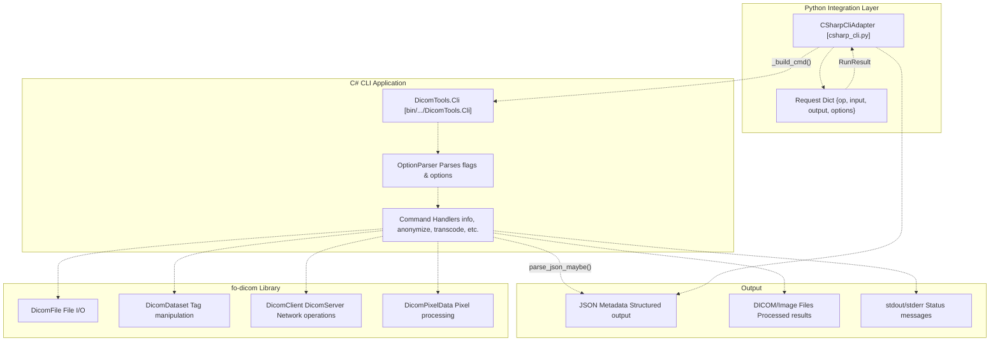
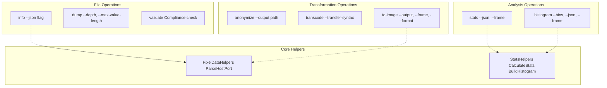
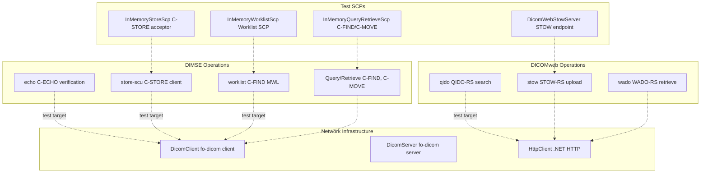
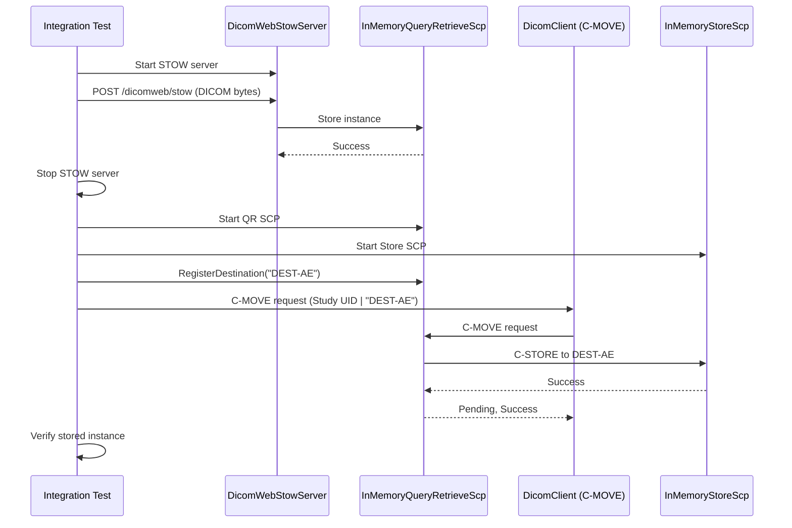

# C# Backend

> **Relevant source files**
> * [cs/DicomTools.Tests/CiEnvironment.cs](https://github.com/ThalesMMS/Dicom-Tools/blob/c7b4cbd8/cs/DicomTools.Tests/CiEnvironment.cs)
> * [cs/DicomTools.Tests/CliContractTests.cs](https://github.com/ThalesMMS/Dicom-Tools/blob/c7b4cbd8/cs/DicomTools.Tests/CliContractTests.cs)
> * [cs/DicomTools.Tests/CliHelpersTests.cs](https://github.com/ThalesMMS/Dicom-Tools/blob/c7b4cbd8/cs/DicomTools.Tests/CliHelpersTests.cs)
> * [cs/DicomTools.Tests/CliUnitTests.cs](https://github.com/ThalesMMS/Dicom-Tools/blob/c7b4cbd8/cs/DicomTools.Tests/CliUnitTests.cs)
> * [cs/DicomTools.Tests/DicomWebIntegrationTests.cs](https://github.com/ThalesMMS/Dicom-Tools/blob/c7b4cbd8/cs/DicomTools.Tests/DicomWebIntegrationTests.cs)
> * [cs/DicomTools.Tests/NetworkStoreTests.cs](https://github.com/ThalesMMS/Dicom-Tools/blob/c7b4cbd8/cs/DicomTools.Tests/NetworkStoreTests.cs)
> * [cs/DicomTools.Tests/QueryRetrieveTests.cs](https://github.com/ThalesMMS/Dicom-Tools/blob/c7b4cbd8/cs/DicomTools.Tests/QueryRetrieveTests.cs)
> * [cs/DicomTools.Tests/WorklistTests.cs](https://github.com/ThalesMMS/Dicom-Tools/blob/c7b4cbd8/cs/DicomTools.Tests/WorklistTests.cs)
> * [interface/adapters/csharp_cli.py](https://github.com/ThalesMMS/Dicom-Tools/blob/c7b4cbd8/interface/adapters/csharp_cli.py)
> * [interface/adapters/java_cli.py](https://github.com/ThalesMMS/Dicom-Tools/blob/c7b4cbd8/interface/adapters/java_cli.py)
> * [interface/adapters/rust_cli.py](https://github.com/ThalesMMS/Dicom-Tools/blob/c7b4cbd8/interface/adapters/rust_cli.py)
> * [interface/tests/test_meta_docs.py](https://github.com/ThalesMMS/Dicom-Tools/blob/c7b4cbd8/interface/tests/test_meta_docs.py)
> * [interface/tests/test_operation_specs.py](https://github.com/ThalesMMS/Dicom-Tools/blob/c7b4cbd8/interface/tests/test_operation_specs.py)

## Purpose and Scope

This document describes the C# implementation of DICOM Tools, which provides a command-line interface built on the fo-dicom library for .NET 8. The C# backend implements core DICOM file operations, comprehensive network services (DIMSE and DICOMweb), and specialized support for Structured Reports (SR) and Radiotherapy (RT) objects.

For information about how the C# backend integrates with the multi-language system, see [CLI Contract System](#3). For details on specific operations like anonymization and network services, see [DICOM Operations](#5). For testing strategies, see [C# Tests](#7.3).

## Architecture Overview

The C# backend consists of a command-line tool (`DicomTools.Cli`) that implements the standardized CLI contract. The Python adapter layer invokes this CLI tool through subprocess execution, translating generic requests into C#-specific command invocations.



**Sources:** [interface/adapters/csharp_cli.py L8-L182](https://github.com/ThalesMMS/Dicom-Tools/blob/c7b4cbd8/interface/adapters/csharp_cli.py#L8-L182)

The adapter locates the C# CLI executable using an environment variable fallback pattern:

| Priority | Source | Default Path |
| --- | --- | --- |
| 1 | `CS_DICOM_TOOLS_CMD` environment variable | - |
| 2 | Release build | `cs/bin/Release/net8.0/DicomTools.Cli` |
| 3 | Debug build | `cs/bin/Debug/net8.0/DicomTools.Cli` |
| 4 | System PATH | `DicomTools.Cli` |

**Sources:** [interface/adapters/csharp_cli.py L12-L29](https://github.com/ThalesMMS/Dicom-Tools/blob/c7b4cbd8/interface/adapters/csharp_cli.py#L12-L29)

## Core CLI Operations

The C# backend implements standard DICOM file operations through a consistent command-line interface. Each operation is mapped to a specific command handler within the CLI application.



**Sources:** [interface/adapters/csharp_cli.py L69-L181](https://github.com/ThalesMMS/Dicom-Tools/blob/c7b4cbd8/interface/adapters/csharp_cli.py#L69-L181)

 [cs/DicomTools.Tests/CliHelpersTests.cs L1-L91](https://github.com/ThalesMMS/Dicom-Tools/blob/c7b4cbd8/cs/DicomTools.Tests/CliHelpersTests.cs#L1-L91)

### Info Operation

The `info` command extracts metadata from DICOM files and outputs it as JSON when the `--json` flag is provided. The JSON output includes standard DICOM attributes such as dimensions, study/series/instance UIDs, and photometric interpretation.

**Command structure:**

```
DicomTools.Cli info <input_path> --json
```

**Adapter mapping:** [interface/adapters/csharp_cli.py L71-L72](https://github.com/ThalesMMS/Dicom-Tools/blob/c7b4cbd8/interface/adapters/csharp_cli.py#L71-L72)

**Output schema validation:** [cs/DicomTools.Tests/CliContractTests.cs L16-L29](https://github.com/ThalesMMS/Dicom-Tools/blob/c7b4cbd8/cs/DicomTools.Tests/CliContractTests.cs#L16-L29)

### Anonymize Operation

The `anonymize` command removes Protected Health Information (PHI) from DICOM files while preserving pixel data. It regenerates UIDs and replaces patient identifying information.

**Command structure:**

```
DicomTools.Cli anonymize <input_path> --output <output_path>
```

The adapter infers output path if not provided: [interface/adapters/csharp_cli.py L73-L75](https://github.com/ThalesMMS/Dicom-Tools/blob/c7b4cbd8/interface/adapters/csharp_cli.py#L73-L75)

**Verification test:** [cs/DicomTools.Tests/CliContractTests.cs L32-L62](https://github.com/ThalesMMS/Dicom-Tools/blob/c7b4cbd8/cs/DicomTools.Tests/CliContractTests.cs#L32-L62)

### Transcode Operation

The `transcode` command converts DICOM files between transfer syntaxes. It supports multiple transfer syntax aliases (e.g., "explicit", "implicit", "jpeg2000", "rle", "jpegls").

**Command structure:**

```
DicomTools.Cli transcode <input_path> --output <output_path> --transfer-syntax <syntax>
```

**Transfer syntax mapping:**

| Alias | DICOM UID |
| --- | --- |
| explicit | 1.2.840.10008.1.2.1 |
| implicit | 1.2.840.10008.1.2 |
| big | 1.2.840.10008.1.2.2 |
| jpeg2000 | 1.2.840.10008.1.2.4.90 |
| rle | 1.2.840.10008.1.2.5 |
| jpegls | 1.2.840.10008.1.2.4.80 |
| jpeg-lossless | 1.2.840.10008.1.2.4.70 |

**Sources:** [interface/adapters/csharp_cli.py L84-L87](https://github.com/ThalesMMS/Dicom-Tools/blob/c7b4cbd8/interface/adapters/csharp_cli.py#L84-L87)

 [cs/DicomTools.Tests/CliUnitTests.cs L7-L38](https://github.com/ThalesMMS/Dicom-Tools/blob/c7b4cbd8/cs/DicomTools.Tests/CliUnitTests.cs#L7-L38)

### Stats and Histogram Operations

The `stats` command computes pixel value statistics (min, max, mean, count) for a specified frame. The `histogram` command generates frequency distributions with configurable bin counts.

**Command structure:**

```
DicomTools.Cli stats <input_path> [--frame <n>] --json
DicomTools.Cli histogram <input_path> --bins <count> [--frame <n>] --json
```

Both operations leverage the `StatsHelpers` utility class for calculations:

**Sources:** [interface/adapters/csharp_cli.py L103-L114](https://github.com/ThalesMMS/Dicom-Tools/blob/c7b4cbd8/interface/adapters/csharp_cli.py#L103-L114)

 [cs/DicomTools.Tests/CliHelpersTests.cs L78-L90](https://github.com/ThalesMMS/Dicom-Tools/blob/c7b4cbd8/cs/DicomTools.Tests/CliHelpersTests.cs#L78-L90)

 [cs/DicomTools.Tests/CliContractTests.cs L131-L165](https://github.com/ThalesMMS/Dicom-Tools/blob/c7b4cbd8/cs/DicomTools.Tests/CliContractTests.cs#L131-L165)

## Network Operations

The C# backend provides comprehensive DICOM network services, including both traditional DIMSE operations (C-ECHO, C-STORE, C-FIND, C-MOVE) and modern DICOMweb RESTful APIs (QIDO-RS, STOW-RS, WADO-RS).



**Sources:** [interface/adapters/csharp_cli.py L90-L144](https://github.com/ThalesMMS/Dicom-Tools/blob/c7b4cbd8/interface/adapters/csharp_cli.py#L90-L144)

 [cs/DicomTools.Tests/NetworkStoreTests.cs L1-L90](https://github.com/ThalesMMS/Dicom-Tools/blob/c7b4cbd8/cs/DicomTools.Tests/NetworkStoreTests.cs#L1-L90)

 [cs/DicomTools.Tests/QueryRetrieveTests.cs L1-L120](https://github.com/ThalesMMS/Dicom-Tools/blob/c7b4cbd8/cs/DicomTools.Tests/QueryRetrieveTests.cs#L1-L120)

 [cs/DicomTools.Tests/WorklistTests.cs L1-L88](https://github.com/ThalesMMS/Dicom-Tools/blob/c7b4cbd8/cs/DicomTools.Tests/WorklistTests.cs#L1-L88)

 [cs/DicomTools.Tests/DicomWebIntegrationTests.cs L1-L75](https://github.com/ThalesMMS/Dicom-Tools/blob/c7b4cbd8/cs/DicomTools.Tests/DicomWebIntegrationTests.cs#L1-L75)

### DIMSE Services

#### C-ECHO (echo)

Verifies connectivity to a DICOM SCP by sending a C-ECHO request.

**Command structure:**

```html
DicomTools.Cli echo <host>:<port>
```

**Adapter parameters:**

* `host` (default: "127.0.0.1")
* `port` (default: 104)

**Sources:** [interface/adapters/csharp_cli.py L90-L93](https://github.com/ThalesMMS/Dicom-Tools/blob/c7b4cbd8/interface/adapters/csharp_cli.py#L90-L93)

 [cs/DicomTools.Tests/CliContractTests.cs L168-L181](https://github.com/ThalesMMS/Dicom-Tools/blob/c7b4cbd8/cs/DicomTools.Tests/CliContractTests.cs#L168-L181)

#### C-STORE (store-scu)

Sends DICOM instances to a Storage SCP using the C-STORE service.

**Command structure:**

```html
DicomTools.Cli store-scu <input_path> --host <host> --port <port> --calling <ae> --called <ae> [--timeout <ms>]
```

**Parameter mapping:**

| Adapter Option | CLI Flag | Default |
| --- | --- | --- |
| host | --host | 127.0.0.1 |
| port | --port | 11112 |
| calling_aet | --calling | STORE-SCU |
| called_aet | --called | STORE-SCP |
| timeout | --timeout | 5000 |

**Sources:** [interface/adapters/csharp_cli.py L115-L124](https://github.com/ThalesMMS/Dicom-Tools/blob/c7b4cbd8/interface/adapters/csharp_cli.py#L115-L124)

 [cs/DicomTools.Tests/NetworkStoreTests.cs L13-L89](https://github.com/ThalesMMS/Dicom-Tools/blob/c7b4cbd8/cs/DicomTools.Tests/NetworkStoreTests.cs#L13-L89)

The network store tests verify both single and multiple instance transfers, ensuring pixel data integrity through the network transmission:

**Sources:** [cs/DicomTools.Tests/NetworkStoreTests.cs L47-L49](https://github.com/ThalesMMS/Dicom-Tools/blob/c7b4cbd8/cs/DicomTools.Tests/NetworkStoreTests.cs#L47-L49)

#### Modality Worklist (worklist)

Queries a Modality Worklist SCP for scheduled procedure steps using C-FIND.

**Command structure:**

```html
DicomTools.Cli worklist --host <host> --port <port> --calling <ae> --called <ae> [--patient <id>]
```

The worklist query returns matching scheduled procedure steps with patient demographics, accession numbers, and procedure details.

**Sources:** [interface/adapters/csharp_cli.py L125-L134](https://github.com/ThalesMMS/Dicom-Tools/blob/c7b4cbd8/interface/adapters/csharp_cli.py#L125-L134)

 [cs/DicomTools.Tests/WorklistTests.cs L13-L87](https://github.com/ThalesMMS/Dicom-Tools/blob/c7b4cbd8/cs/DicomTools.Tests/WorklistTests.cs#L13-L87)

#### Query/Retrieve (C-FIND, C-MOVE)

While not exposed as separate CLI commands in the adapter, the C# backend includes full Query/Retrieve SCP implementations for testing:

* `InMemoryQueryRetrieveScp` handles C-FIND requests at Study, Series, and Image levels
* C-MOVE requests trigger C-STORE operations to destination AE titles

**Sources:** [cs/DicomTools.Tests/QueryRetrieveTests.cs L13-L119](https://github.com/ThalesMMS/Dicom-Tools/blob/c7b4cbd8/cs/DicomTools.Tests/QueryRetrieveTests.cs#L13-L119)

### DICOMweb Services

The C# backend implements RESTful DICOMweb services for web-based DICOM interchange.

#### QIDO-RS (qido)

Searches for DICOM studies, series, or instances using HTTP GET requests.

**Command structure:**

```
DicomTools.Cli qido --url <base_url>
```

**Default URL:** `http://localhost:8080/dicomweb`

**Sources:** [interface/adapters/csharp_cli.py L135-L137](https://github.com/ThalesMMS/Dicom-Tools/blob/c7b4cbd8/interface/adapters/csharp_cli.py#L135-L137)

#### STOW-RS (stow)

Uploads DICOM instances to a DICOMweb server using HTTP POST with multipart/related content.

**Command structure:**

```
DicomTools.Cli stow --url <base_url> <input_path>
```

**Sources:** [interface/adapters/csharp_cli.py L138-L140](https://github.com/ThalesMMS/Dicom-Tools/blob/c7b4cbd8/interface/adapters/csharp_cli.py#L138-L140)

#### WADO-RS (wado)

Retrieves DICOM instances from a DICOMweb server using HTTP GET.

**Command structure:**

```
DicomTools.Cli wado --url <wado_url> --output <output_path>
```

**Sources:** [interface/adapters/csharp_cli.py L141-L144](https://github.com/ThalesMMS/Dicom-Tools/blob/c7b4cbd8/interface/adapters/csharp_cli.py#L141-L144)

### DICOMweb Integration Test

The integration test suite includes a comprehensive workflow that bridges DICOMweb STOW uploads with traditional DIMSE C-MOVE retrievals, demonstrating interoperability between modern and legacy protocols:



**Sources:** [cs/DicomTools.Tests/DicomWebIntegrationTests.cs L17-L74](https://github.com/ThalesMMS/Dicom-Tools/blob/c7b4cbd8/cs/DicomTools.Tests/DicomWebIntegrationTests.cs#L17-L74)

This test demonstrates that instances uploaded via STOW can be immediately retrieved via DIMSE C-MOVE, validating the bridge between protocols.

## Specialized Operations

The C# backend includes support for specialized DICOM object types beyond standard images.

### Structured Reports (sr-summary)

The `sr-summary` command parses DICOM Structured Report (SR) objects and extracts key content in a human-readable format.

**Command structure:**

```
DicomTools.Cli sr-summary <input_path>
```

**Sources:** [interface/adapters/csharp_cli.py L145-L146](https://github.com/ThalesMMS/Dicom-Tools/blob/c7b4cbd8/interface/adapters/csharp_cli.py#L145-L146)

### Radiotherapy Check (rt-check)

The `rt-check` command validates relationships between RT Plan, RT Dose, and RT Structure Set objects, ensuring geometric and reference consistency.

**Command structure:**

```
DicomTools.Cli rt-check --plan <rt_plan_path> [--dose <rt_dose_path>] [--struct <rt_struct_path>]
```

**Sources:** [interface/adapters/csharp_cli.py L147-L156](https://github.com/ThalesMMS/Dicom-Tools/blob/c7b4cbd8/interface/adapters/csharp_cli.py#L147-L156)

## Testing Infrastructure

The C# backend includes a comprehensive test suite using xUnit, with specialized infrastructure for network testing and CLI validation.

```mermaid
flowchart TD

CliContract["CliContractTests Contract compliance"]
CliUnit["CliUnitTests CLI behavior"]
CliHelpers["CliHelpersTests Helper utilities"]
NetworkStore["NetworkStoreTests C-STORE"]
QueryRetrieve["QueryRetrieveTests C-FIND/C-MOVE"]
WorklistTests["WorklistTests MWL C-FIND"]
DicomWebTests["DicomWebIntegrationTests STOW/C-MOVE bridge"]
CliRunner["CliRunner Execute CLI commands"]
SampleHelper["SampleSeriesHelper Test DICOM data"]
TcpHelper["TcpPortHelper Free port allocation"]
CiEnv["CiEnvironment CI detection"]
InMemStore["InMemoryStoreScp"]
InMemQR["InMemoryQueryRetrieveScp"]
InMemMWL["InMemoryWorklistScp"]
StowSrv["DicomWebStowServer"]

CliContract -.-> CliRunner
CliUnit -.-> CliRunner
CliHelpers -.-> CliRunner
NetworkStore -.-> CliRunner
QueryRetrieve -.-> CliRunner
WorklistTests -.-> CliRunner
DicomWebTests -.-> CliRunner
CliContract -.-> SampleHelper
CliUnit -.-> SampleHelper
NetworkStore -.-> SampleHelper
QueryRetrieve -.-> SampleHelper
WorklistTests -.-> SampleHelper
NetworkStore -.-> TcpHelper
QueryRetrieve -.-> TcpHelper
WorklistTests -.-> TcpHelper
DicomWebTests -.-> TcpHelper
NetworkStore -.-> CiEnv
QueryRetrieve -.-> CiEnv
WorklistTests -.-> CiEnv
DicomWebTests -.-> CiEnv
NetworkStore -.-> InMemStore
QueryRetrieve -.-> InMemStore
QueryRetrieve -.-> InMemQR
WorklistTests -.-> InMemMWL
DicomWebTests -.-> InMemStore
DicomWebTests -.-> InMemQR
DicomWebTests -.-> StowSrv

subgraph subGraph2 ["Mock SCPs"]
    InMemStore
    InMemQR
    InMemMWL
    StowSrv
end

subgraph subGraph1 ["Test Utilities"]
    CliRunner
    SampleHelper
    TcpHelper
    CiEnv
end

subgraph subGraph0 ["Test Categories"]
    CliContract
    CliUnit
    CliHelpers
    NetworkStore
    QueryRetrieve
    WorklistTests
    DicomWebTests
end
```



**Sources:** [cs/DicomTools.Tests/CliContractTests.cs L1-L183](https://github.com/ThalesMMS/Dicom-Tools/blob/c7b4cbd8/cs/DicomTools.Tests/CliContractTests.cs#L1-L183)

 [cs/DicomTools.Tests/CliUnitTests.cs L1-L182](https://github.com/ThalesMMS/Dicom-Tools/blob/c7b4cbd8/cs/DicomTools.Tests/CliUnitTests.cs#L1-L182)

 [cs/DicomTools.Tests/CliHelpersTests.cs L1-L91](https://github.com/ThalesMMS/Dicom-Tools/blob/c7b4cbd8/cs/DicomTools.Tests/CliHelpersTests.cs#L1-L91)

 [cs/DicomTools.Tests/NetworkStoreTests.cs L1-L90](https://github.com/ThalesMMS/Dicom-Tools/blob/c7b4cbd8/cs/DicomTools.Tests/NetworkStoreTests.cs#L1-L90)

 [cs/DicomTools.Tests/QueryRetrieveTests.cs L1-L120](https://github.com/ThalesMMS/Dicom-Tools/blob/c7b4cbd8/cs/DicomTools.Tests/QueryRetrieveTests.cs#L1-L120)

 [cs/DicomTools.Tests/WorklistTests.cs L1-L88](https://github.com/ThalesMMS/Dicom-Tools/blob/c7b4cbd8/cs/DicomTools.Tests/WorklistTests.cs#L1-L88)

 [cs/DicomTools.Tests/DicomWebIntegrationTests.cs L1-L75](https://github.com/ThalesMMS/Dicom-Tools/blob/c7b4cbd8/cs/DicomTools.Tests/DicomWebIntegrationTests.cs#L1-L75)

### Test Execution Through Adapter

The adapter includes support for running specific test classes or the entire test suite:

**Test operation mapping:**

| Adapter Operation | Test Class |
| --- | --- |
| test_anonymize_cs | AnonymizeCommandTests |
| test_uid_cs | DicomUidTests |
| test_datetime_cs | DicomDateTimeTests |
| test_charset_cs | DicomCharsetTests |
| test_dictionary_cs | DicomDictionaryTests |
| test_file_operations_cs | DicomFileOperationsTests |
| test_sequence_cs | DicomSequenceTests |
| test_value_representation_cs | DicomValueRepresentationTests |
| test_option_parser_cs | OptionParserTests |
| test_stats_helpers_cs | StatsHelpersTests |
| run_cs_tests | (all tests) |

**Sources:** [interface/adapters/csharp_cli.py L157-L173](https://github.com/ThalesMMS/Dicom-Tools/blob/c7b4cbd8/interface/adapters/csharp_cli.py#L157-L173)

### CI Environment Detection

The test suite includes CI-aware test skipping to avoid network restrictions in continuous integration environments:

**Sources:** [cs/DicomTools.Tests/CiEnvironment.cs L1-L9](https://github.com/ThalesMMS/Dicom-Tools/blob/c7b4cbd8/cs/DicomTools.Tests/CiEnvironment.cs#L1-L9)

Network tests check `CiEnvironment.ShouldSkip()` before executing, ensuring tests run locally but skip gracefully in CI pipelines that restrict socket operations.

### CliRunner Utility

The `CliRunner` class provides a simplified interface for executing CLI commands and capturing output in tests. It abstracts the process invocation and output capture into a single method call.

**Sources:** [cs/DicomTools.Tests/CliUnitTests.cs L24-L38](https://github.com/ThalesMMS/Dicom-Tools/blob/c7b4cbd8/cs/DicomTools.Tests/CliUnitTests.cs#L24-L38)

 [cs/DicomTools.Tests/CliContractTests.cs L18-L29](https://github.com/ThalesMMS/Dicom-Tools/blob/c7b4cbd8/cs/DicomTools.Tests/CliContractTests.cs#L18-L29)

### Mock SCP Implementations

The test suite includes in-memory SCP implementations that maintain state across requests:

* `InMemoryStoreScp.Clear()` / `InMemoryStoreScp.StoredFiles` - tracks C-STORE operations
* `InMemoryQueryRetrieveScp.Reset()` / `ConfigureSources()` / `RegisterDestination()` - manages query/retrieve state
* `InMemoryWorklistScp.Reset()` / `ConfigureEntries()` - configures worklist responses

**Sources:** [cs/DicomTools.Tests/NetworkStoreTests.cs L20-L40](https://github.com/ThalesMMS/Dicom-Tools/blob/c7b4cbd8/cs/DicomTools.Tests/NetworkStoreTests.cs#L20-L40)

 [cs/DicomTools.Tests/QueryRetrieveTests.cs L20-L78](https://github.com/ThalesMMS/Dicom-Tools/blob/c7b4cbd8/cs/DicomTools.Tests/QueryRetrieveTests.cs#L20-L78)

 [cs/DicomTools.Tests/WorklistTests.cs L20-L26](https://github.com/ThalesMMS/Dicom-Tools/blob/c7b4cbd8/cs/DicomTools.Tests/WorklistTests.cs#L20-L26)

## Build and Deployment

The C# backend is built using the .NET 8 SDK and produces native executables for the target platform.

**Build process:**

```
cd csdotnet build --configuration Release
```

**Output location:** `cs/bin/Release/net8.0/DicomTools.Cli`

**Test execution:**

```
dotnet test DicomTools.Tests/DicomTools.Tests.csproj
```

**Specific test class:**

```
dotnet test DicomTools.Tests/DicomTools.Tests.csproj --filter "ClassName=DicomTools.Tests.AnonymizeCommandTests"
```

**Environment configuration:**

The adapter respects the `CS_DICOM_TOOLS_CMD` environment variable for specifying a custom CLI path, enabling flexible deployment scenarios:

```
export CS_DICOM_TOOLS_CMD="dotnet /path/to/DicomTools.Cli.dll"
```

or for native executable:

```
export CS_DICOM_TOOLS_CMD="/usr/local/bin/DicomTools.Cli"
```

**Sources:** [interface/adapters/csharp_cli.py L13-L18](https://github.com/ThalesMMS/Dicom-Tools/blob/c7b4cbd8/interface/adapters/csharp_cli.py#L13-L18)

The C# backend integrates seamlessly with the universal setup script for automated builds. See [Build System](#8.1) for details on the multi-language build process.

Refresh this wiki

Last indexed: 5 January 2026 ([c7b4cb](https://github.com/ThalesMMS/Dicom-Tools/commit/c7b4cbd8))

### On this page

* [C# Backend](#4.4-c-backend)
* [Purpose and Scope](#4.4-purpose-and-scope)
* [Architecture Overview](#4.4-architecture-overview)
* [Core CLI Operations](#4.4-core-cli-operations)
* [Info Operation](#4.4-info-operation)
* [Anonymize Operation](#4.4-anonymize-operation)
* [Transcode Operation](#4.4-transcode-operation)
* [Stats and Histogram Operations](#4.4-stats-and-histogram-operations)
* [Network Operations](#4.4-network-operations)
* [DIMSE Services](#4.4-dimse-services)
* [DICOMweb Services](#4.4-dicomweb-services)
* [DICOMweb Integration Test](#4.4-dicomweb-integration-test)
* [Specialized Operations](#4.4-specialized-operations)
* [Structured Reports (sr-summary)](#4.4-structured-reports-sr-summary)
* [Radiotherapy Check (rt-check)](#4.4-radiotherapy-check-rt-check)
* [Testing Infrastructure](#4.4-testing-infrastructure)
* [Test Execution Through Adapter](#4.4-test-execution-through-adapter)
* [CI Environment Detection](#4.4-ci-environment-detection)
* [CliRunner Utility](#4.4-clirunner-utility)
* [Mock SCP Implementations](#4.4-mock-scp-implementations)
* [Build and Deployment](#4.4-build-and-deployment)

Ask Devin about Dicom-Tools