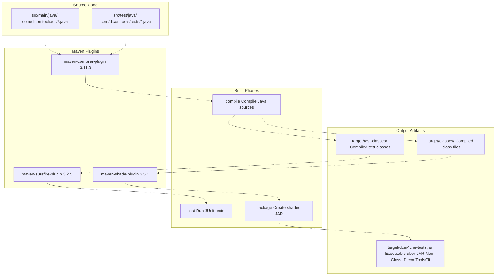
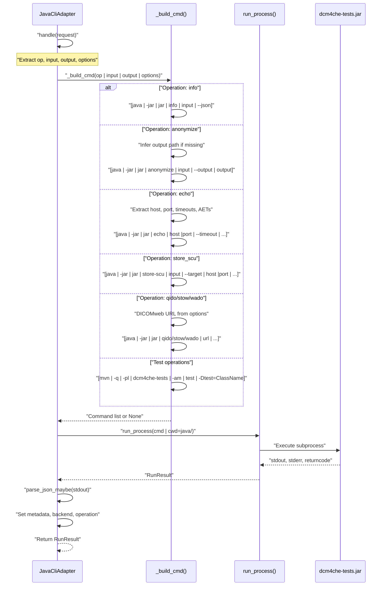
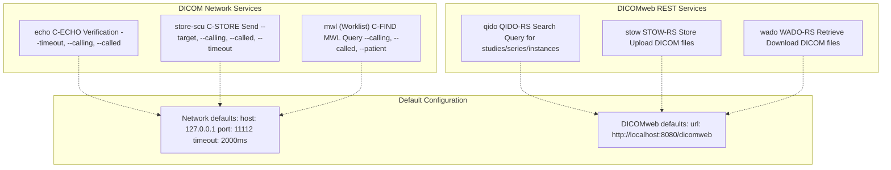
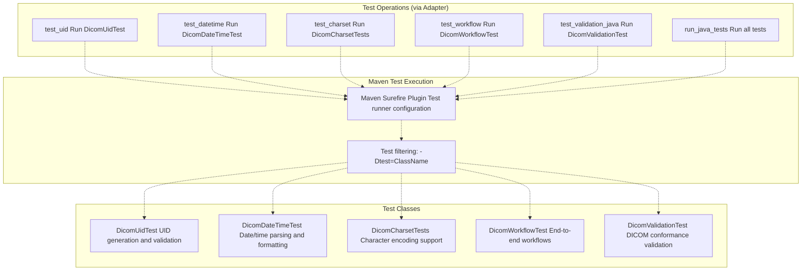
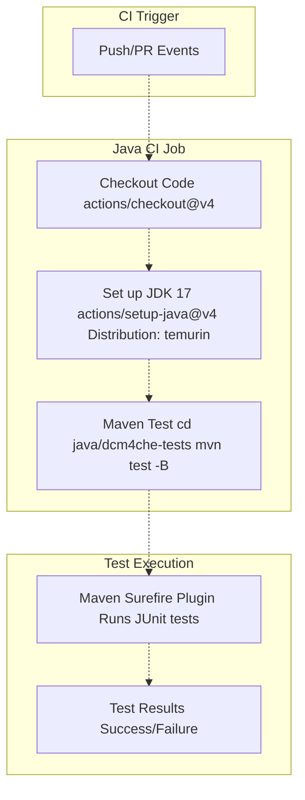
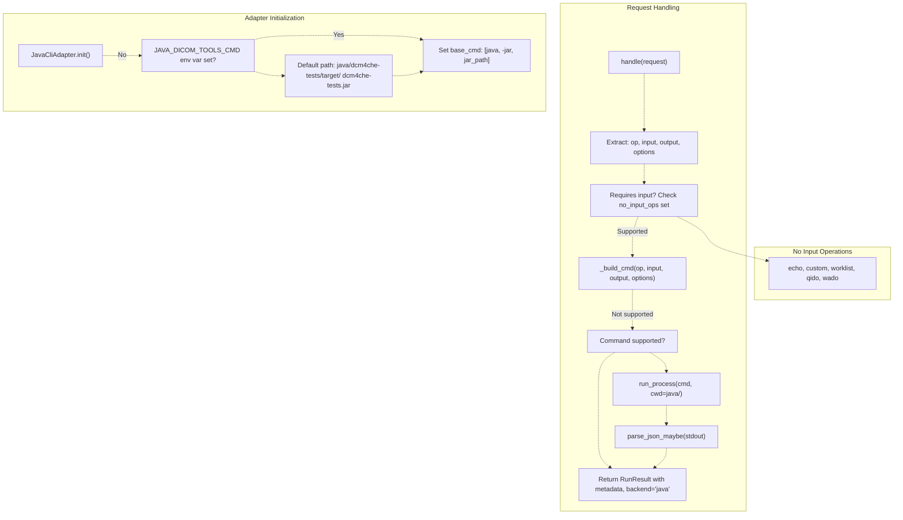

# 4e Java Backend

> **Relevant source files**
> * [.github/workflows/ci.yml](https://github.com/ThalesMMS/Dicom-Tools/blob/c7b4cbd8/.github/workflows/ci.yml)
> * [interface/adapters/csharp_cli.py](https://github.com/ThalesMMS/Dicom-Tools/blob/c7b4cbd8/interface/adapters/csharp_cli.py)
> * [interface/adapters/java_cli.py](https://github.com/ThalesMMS/Dicom-Tools/blob/c7b4cbd8/interface/adapters/java_cli.py)
> * [interface/adapters/rust_cli.py](https://github.com/ThalesMMS/Dicom-Tools/blob/c7b4cbd8/interface/adapters/rust_cli.py)
> * [interface/tests/test_operation_specs.py](https://github.com/ThalesMMS/Dicom-Tools/blob/c7b4cbd8/interface/tests/test_operation_specs.py)
> * [java/dcm4che-tests/pom.xml](https://github.com/ThalesMMS/Dicom-Tools/blob/c7b4cbd8/java/dcm4che-tests/pom.xml)

## Purpose and Scope

The Java backend provides DICOM processing capabilities using the **dcm4che3** library (version 5.34.1), a mature and comprehensive Java implementation of the DICOM standard. This backend is built with Maven and packaged as an executable uber JAR, offering core file operations, network services, DICOMweb support, and specialized medical imaging features including Structured Reports (SR) and Radiotherapy (RT) operations.

For general backend architecture and the CLI contract system, see [Architecture Overview](1a%20Architecture-Overview.md). For information about other language implementations, see [Language Implementations](4%20Language-Implementations.md). For details on specific DICOM operations, see [DICOM Operations](5%20DICOM-Operations.md).

**Sources:** [java/dcm4che-tests/pom.xml L1-L209](https://github.com/ThalesMMS/Dicom-Tools/blob/c7b4cbd8/java/dcm4che-tests/pom.xml#L1-L209)

 [interface/adapters/java_cli.py L1-L168](https://github.com/ThalesMMS/Dicom-Tools/blob/c7b4cbd8/interface/adapters/java_cli.py#L1-L168)

---

## Architecture Overview

The Java backend is organized as a single Maven module that produces an executable JAR with all dependencies bundled:

```mermaid
flowchart TD

POM["pom.xml Maven Project Configuration"]
Compiler["Maven Compiler Plugin Java 17 target"]
Shade["Maven Shade Plugin Uber JAR packaging"]
Surefire["Maven Surefire Plugin Test execution"]
CLI["DicomToolsCli Main entry point"]
Commands["Command Implementations info, anonymize, to-image, etc."]
Tests["JUnit Test Classes DicomUidTest, DicomWorkflowTest, etc."]
Core["dcm4che-core 5.34.1 Core DICOM data structures"]
Image["dcm4che-image Image processing"]
ImageIO["dcm4che-imageio Image format support"]
JSON["dcm4che-json JSON conversion"]
Deident["dcm4che-deident Anonymization"]
Net["dcm4che-net Network operations"]
WsRs["dcm4che-ws-rs DICOMweb REST services"]
StowRsTool["dcm4che-tool-stowrs STOW-RS client"]
WadoRsTool["dcm4che-tool-wadors WADO-RS client"]
JAI["jai-imageio-core 1.4.0 Advanced image codecs"]
JAI2K["jai-imageio-jpeg2000 JPEG 2000 support"]
Jakarta["jakarta.json-api 2.1.3 JSON API"]
Parsson["parsson 1.1.7 JSON implementation"]
JUnit["JUnit Jupiter 5.10.2 Testing framework"]
UberJar["dcm4che-tests.jar target/ Executable JAR with all dependencies"]

CLI -.-> Core
Commands -.-> Image
Commands -.-> ImageIO
Commands -.-> JSON
Commands -.-> Deident
Commands -.-> Net
Commands -.-> WsRs
Commands -.-> StowRsTool
Commands -.-> WadoRsTool
Core -.-> Jakarta
JSON -.-> Parsson
ImageIO -.-> JAI
ImageIO -.-> JAI2K
Tests -.-> JUnit
Shade -.-> UberJar
Compiler -.-> UberJar

subgraph subGraph4 ["Build Artifacts"]
    UberJar
end

subgraph subGraph3 ["External Dependencies"]
    JAI
    JAI2K
    Jakarta
    Parsson
    JUnit
end

subgraph subGraph2 ["dcm4che3 Dependencies"]
    Core
    Image
    ImageIO
    JSON
    Deident
    Net
    WsRs
    StowRsTool
    WadoRsTool
end

subgraph subGraph1 ["Application Code"]
    CLI
    Commands
    Tests
    CLI -.-> Commands
end

subgraph subGraph0 ["Build System"]
    POM
    Compiler
    Shade
    Surefire
    POM -.-> Compiler
    POM -.-> Shade
    POM -.-> Surefire
end
```



**Sources:** [java/dcm4che-tests/pom.xml L1-L209](https://github.com/ThalesMMS/Dicom-Tools/blob/c7b4cbd8/java/dcm4che-tests/pom.xml#L1-L209)

 [interface/adapters/java_cli.py L8-L17](https://github.com/ThalesMMS/Dicom-Tools/blob/c7b4cbd8/interface/adapters/java_cli.py#L8-L17)

---

## Maven Configuration

The project uses Maven 4.0.0 with Java 17 as the compilation target. Key configuration details:

| Property | Value | Purpose |
| --- | --- | --- |
| `groupId` | `com.dicomtools` | Organization identifier |
| `artifactId` | `dcm4che-tests` | Module identifier |
| `version` | `0.1.0-SNAPSHOT` | Development version |
| `maven.compiler.source` | `17` | Source compatibility |
| `maven.compiler.target` | `17` | Target bytecode version |
| `dcm4che.version` | `5.34.1` | dcm4che dependency version |
| `junit.version` | `5.10.2` | JUnit testing framework version |

### Repository Configuration

The project declares the dcm4che Maven repository for accessing dcm4che artifacts and tools:

* **Repository URL**: `https://www.dcm4che.org/maven2`
* **Releases**: Enabled
* **Snapshots**: Enabled

**Sources:** [java/dcm4che-tests/pom.xml L1-L123](https://github.com/ThalesMMS/Dicom-Tools/blob/c7b4cbd8/java/dcm4che-tests/pom.xml#L1-L123)

---

## Build Process and Artifacts

The Java backend uses three key Maven plugins to produce the executable CLI:



### Maven Shade Plugin Configuration

The Shade Plugin creates an uber JAR (fat JAR) containing all dependencies with the main class set to `com.dicomtools.cli.DicomToolsCli`. This allows execution via:

```
java -jar dcm4che-tests.jar <command> <args>
```

The plugin configuration:

* Sets `finalName` to `dcm4che-tests` (without `.jar` extension)
* Disables dependency-reduced POM generation
* Configures `ManifestResourceTransformer` to set `Main-Class` attribute

**Sources:** [java/dcm4che-tests/pom.xml L125-L171](https://github.com/ThalesMMS/Dicom-Tools/blob/c7b4cbd8/java/dcm4che-tests/pom.xml#L125-L171)

---

## CLI Interface Structure

The Java backend is invoked through the `JavaCliAdapter`, which constructs commands following the pattern:

```html
java -jar <path-to-jar> <operation> [<input>] [options]
```

### Adapter Command Building Flow



### Environment Configuration

The adapter locates the JAR using the `JAVA_DICOM_TOOLS_CMD` environment variable, falling back to the default path:

```
java/dcm4che-tests/target/dcm4che-tests.jar
```

The base command is constructed as `["java", "-jar", <jar_path>]`.

**Sources:** [interface/adapters/java_cli.py L8-L45](https://github.com/ThalesMMS/Dicom-Tools/blob/c7b4cbd8/interface/adapters/java_cli.py#L8-L45)

---

## Supported Operations

The Java backend implements the following DICOM operations:

### Core File Operations

| Operation | Command | Description | Output Inference |
| --- | --- | --- | --- |
| `info` | `info <input> --json` | Extract DICOM metadata as JSON | Display (stdout) |
| `dump` | `dump <input> [--max-width <n>]` | Human-readable dataset dump | Display (stdout) |
| `validate` | `validate <input>` | Validate DICOM conformance | Display (stdout) |
| `stats` | `stats <input> --bins <n> [--json] [--pretty]` | Pixel statistics and histogram | Display (stdout) |
| `histogram` | `stats <input> --bins <n> --json` | Alias for stats with JSON output | Display (stdout) |

**Note:** The `histogram` operation internally uses the `stats` command with JSON output enabled.

**Sources:** [interface/adapters/java_cli.py L47-L102](https://github.com/ThalesMMS/Dicom-Tools/blob/c7b4cbd8/interface/adapters/java_cli.py#L47-L102)

### Image Processing Operations

| Operation | Command Syntax | Options Supported | Output Default |
| --- | --- | --- | --- |
| `anonymize` | `anonymize <input> --output <output>` | None | `{stem}_anon.dcm` |
| `to_image` | `to-image <input> --output <output>` | `--format`, `--frame` | `{input}.png` |
| `transcode` | `transcode <input> --output <output> --syntax <ts>` | `syntax` (default: "explicit") | `{stem}_explicit.dcm` |

**Sources:** [interface/adapters/java_cli.py L50-L64](https://github.com/ThalesMMS/Dicom-Tools/blob/c7b4cbd8/interface/adapters/java_cli.py#L50-L64)

### Network Operations



**Network Operations Command Structure:**

* **C-ECHO**: `echo <host:port> --timeout <ms> --calling <aet> --called <aet>`
* **C-STORE**: `store-scu <input> --target <host:port> --calling <aet> --called <aet> --timeout <ms>`
* **Worklist**: `mwl <host:port> --calling <aet> --called <aet> [--patient <name>]`

**DICOMweb Operations Command Structure:**

* **QIDO-RS**: `qido <url>`
* **STOW-RS**: `stow <url> <input>`
* **WADO-RS**: `wado <url> --output <output>`

**Sources:** [interface/adapters/java_cli.py L67-L134](https://github.com/ThalesMMS/Dicom-Tools/blob/c7b4cbd8/interface/adapters/java_cli.py#L67-L134)

### Specialized Medical Imaging Operations

The Java backend supports advanced medical imaging formats:

| Operation | Command | Purpose | Input Requirements |
| --- | --- | --- | --- |
| `sr_summary` | `sr-summary <input>` | Summarize DICOM Structured Report | DICOM SR file |
| `rt_check` | `rt-check --plan <file> [--dose <file>] [--struct <file>]` | Validate Radiotherapy plan consistency | RT Plan, optionally RT Dose and RT Structure Set |

**Sources:** [interface/adapters/java_cli.py L135-L146](https://github.com/ThalesMMS/Dicom-Tools/blob/c7b4cbd8/interface/adapters/java_cli.py#L135-L146)

---

## Testing Infrastructure

The Java backend includes comprehensive JUnit 5 tests organized into specialized test classes:

### Test Class Organization



### Maven Surefire Configuration

The test execution is controlled by the Maven Surefire Plugin with the following configuration:

* **Version**: 3.2.5
* **Module Path**: Disabled (`useModulePath: false`)
* **Excluded Groups**: `integration` (configurable via property)
* **Test Selection**: Individual test classes can be run using `-Dtest=ClassName`

### Test Execution Commands

Individual test classes are executed via Maven rather than the CLI JAR:

```
# Run specific test classmvn -q -pl dcm4che-tests -am test -Dtest=DicomUidTest# Run all testsmvn -q -pl dcm4che-tests -am test
```

The adapter maps test operations to Maven commands:

| Operation ID | Test Class | Maven Command |
| --- | --- | --- |
| `test_uid` | `DicomUidTest` | `mvn -q -pl dcm4che-tests -am test -Dtest=DicomUidTest` |
| `test_datetime` | `DicomDateTimeTest` | `mvn -q -pl dcm4che-tests -am test -Dtest=DicomDateTimeTest` |
| `test_charset` | `DicomCharsetTests` | `mvn -q -pl dcm4che-tests -am test -Dtest=DicomCharsetTests` |
| `test_workflow` | `DicomWorkflowTest` | `mvn -q -pl dcm4che-tests -am test -Dtest=DicomWorkflowTest` |
| `test_validation_java` | `DicomValidationTest` | `mvn -q -pl dcm4che-tests -am test -Dtest=DicomValidationTest` |
| `run_java_tests` | All tests | `mvn -q -pl dcm4che-tests -am test` |

**Sources:** [interface/adapters/java_cli.py L147-L159](https://github.com/ThalesMMS/Dicom-Tools/blob/c7b4cbd8/interface/adapters/java_cli.py#L147-L159)

 [java/dcm4che-tests/pom.xml L139-L147](https://github.com/ThalesMMS/Dicom-Tools/blob/c7b4cbd8/java/dcm4che-tests/pom.xml#L139-L147)

---

## CI/CD Integration

The Java backend is integrated into the GitHub Actions CI pipeline:



### CI Configuration Details

* **Runner**: `ubuntu-latest`
* **JDK Version**: 17
* **JDK Distribution**: Eclipse Temurin
* **Build Command**: `mvn test -B` (batch mode, non-interactive)
* **Working Directory**: `java/dcm4che-tests`

The `-B` flag runs Maven in batch mode, which is optimized for CI environments by reducing interactive output and using sensible defaults.

**Sources:** [.github/workflows/ci.yml L52-L64](https://github.com/ThalesMMS/Dicom-Tools/blob/c7b4cbd8/.github/workflows/ci.yml#L52-L64)

---

## Adapter Integration

The `JavaCliAdapter` class bridges the CLI contract system with the Java backend:

### Adapter Initialization and Command Resolution



### Operations Not Requiring Input

The adapter defines a set of operations that don't require an input file:

```
no_input_ops = {"echo", "custom", "worklist", "qido", "wado"}
```

These operations either perform network queries or use custom commands that may not operate on files.

### Output Path Inference

For operations that produce files, the adapter infers output paths when not explicitly provided:

| Operation | Input | Inferred Output |
| --- | --- | --- |
| `anonymize` | `scan.dcm` | `scan_anon.dcm` |
| `to_image` | `scan.dcm` | `scan.png` |
| `transcode` | `scan.dcm` | `scan_explicit.dcm` |
| `wado` | `wado` (or any) | `wado.dcm` |

### JSON Metadata Parsing

After executing commands, the adapter attempts to parse JSON output from stdout using `parse_json_maybe()`. If successful, the parsed metadata is attached to the `RunResult` object, enabling rich data exchange between the Java backend and other system components.

**Sources:** [interface/adapters/java_cli.py L8-L168](https://github.com/ThalesMMS/Dicom-Tools/blob/c7b4cbd8/interface/adapters/java_cli.py#L8-L168)

---

## Coverage and Test Profile

The Java backend includes a Maven profile for code coverage analysis:

### Coverage Profile Configuration

```html
<profile>  <id>coverage</id>  <properties>    <excludedGroups></excludedGroups>  </properties>  <build>    <plugins>      <plugin>        <groupId>org.jacoco</groupId>        <artifactId>jacoco-maven-plugin</artifactId>        <version>0.8.11</version>        <configuration>          <includes>            <include>com/dicomtools/**</include>          </includes>        </configuration>        <executions>          <execution>            <goals>              <goal>prepare-agent</goal>            </goals>          </execution>          <execution>            <id>report</id>            <phase>verify</phase>            <goals>              <goal>report</goal>            </goals>          </execution>        </executions>      </plugin>    </plugins>  </build></profile>
```

To run tests with coverage:

```
mvn clean verify -Pcoverage
```

This profile:

* Enables all test groups (removes `excludedGroups` filter)
* Configures JaCoCo agent to instrument `com/dicomtools/**` classes
* Generates coverage reports in the `verify` phase

**Sources:** [java/dcm4che-tests/pom.xml L173-L208](https://github.com/ThalesMMS/Dicom-Tools/blob/c7b4cbd8/java/dcm4che-tests/pom.xml#L173-L208)

---

## Operation Specifications in Interface Layer

The interface layer defines operation specifications that control how the Java backend operations are presented in the UI:

### Example Specifications

From the test suite, we can observe operation behavior:

* **`wado`**: Requires no input but requires output (downloads from URL)
* **`worklist`**: No input required, has options for network parameters
* **`store_scu`**: Requires file input, has options for network parameters
* **`sr_summary`**: Requires file input (SR DICOM file)
* **`rt_check`**: Requires file input (RT Plan file), supports optional dose/struct files

The operation specifications ensure that the TkApp GUI correctly validates inputs and presents appropriate UI controls for each operation.

**Sources:** [interface/tests/test_operation_specs.py L42-L56](https://github.com/ThalesMMS/Dicom-Tools/blob/c7b4cbd8/interface/tests/test_operation_specs.py#L42-L56)

---

## Summary

The Java backend leverages dcm4che3, a mature and feature-rich DICOM library, to provide:

* **Comprehensive DICOM support**: Core file operations, validation, and metadata extraction
* **Network capabilities**: C-ECHO, C-STORE, Modality Worklist
* **DICOMweb services**: QIDO-RS, STOW-RS, WADO-RS implementations
* **Specialized formats**: Structured Reports and Radiotherapy object validation
* **Production-ready packaging**: Uber JAR with all dependencies included
* **Enterprise build system**: Maven-based with standardized dependency management
* **Robust testing**: JUnit 5 test suite with CI integration

The Java backend is particularly well-suited for environments requiring enterprise-grade DICOM conformance, network services, and integration with existing Java-based medical imaging systems.


### On this page

* [Java Backend](#4.5-java-backend)
* [Purpose and Scope](#4.5-purpose-and-scope)
* [Architecture Overview](#4.5-architecture-overview)
* [Maven Configuration](#4.5-maven-configuration)
* [Repository Configuration](#4.5-repository-configuration)
* [Build Process and Artifacts](#4.5-build-process-and-artifacts)
* [Maven Shade Plugin Configuration](#4.5-maven-shade-plugin-configuration)
* [CLI Interface Structure](#4.5-cli-interface-structure)
* [Adapter Command Building Flow](#4.5-adapter-command-building-flow)
* [Environment Configuration](#4.5-environment-configuration)
* [Supported Operations](#4.5-supported-operations)
* [Core File Operations](#4.5-core-file-operations)
* [Image Processing Operations](#4.5-image-processing-operations)
* [Network Operations](#4.5-network-operations)
* [Specialized Medical Imaging Operations](#4.5-specialized-medical-imaging-operations)
* [Testing Infrastructure](#4.5-testing-infrastructure)
* [Test Class Organization](#4.5-test-class-organization)
* [Maven Surefire Configuration](#4.5-maven-surefire-configuration)
* [Test Execution Commands](#4.5-test-execution-commands)
* [CI/CD Integration](#4.5-cicd-integration)
* [CI Configuration Details](#4.5-ci-configuration-details)
* [Adapter Integration](#4.5-adapter-integration)
* [Adapter Initialization and Command Resolution](#4.5-adapter-initialization-and-command-resolution)
* [Operations Not Requiring Input](#4.5-operations-not-requiring-input)
* [Output Path Inference](#4.5-output-path-inference)
* [JSON Metadata Parsing](#4.5-json-metadata-parsing)
* [Coverage and Test Profile](#4.5-coverage-and-test-profile)
* [Coverage Profile Configuration](#4.5-coverage-profile-configuration)
* [Operation Specifications in Interface Layer](#4.5-operation-specifications-in-interface-layer)
* [Example Specifications](#4.5-example-specifications)
* [Summary](#4.5-summary)

Ask Devin about Dicom-Tools