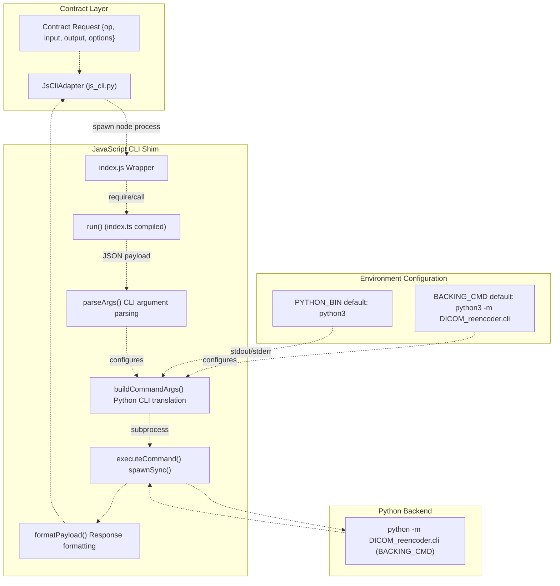
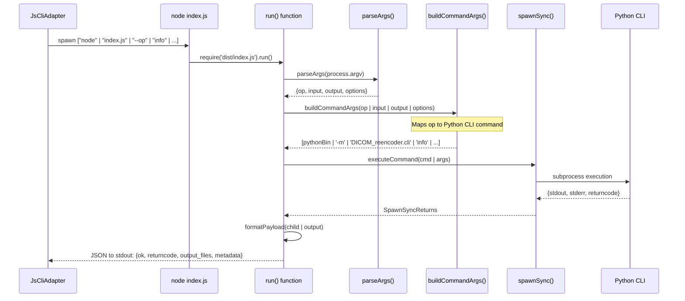
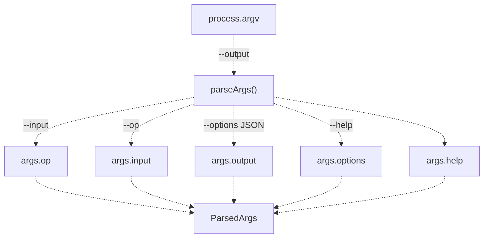
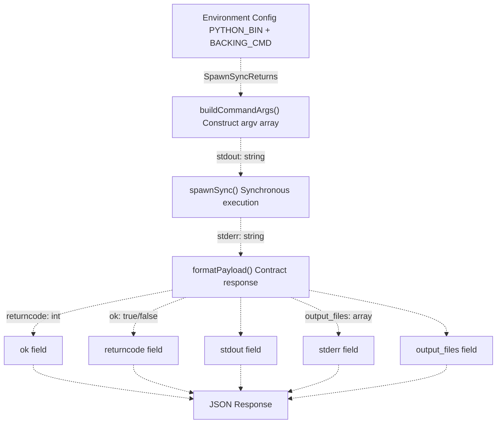
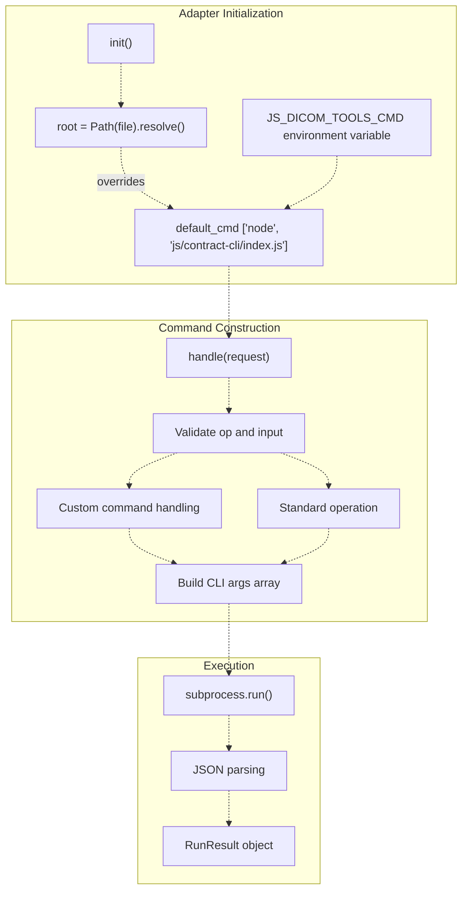
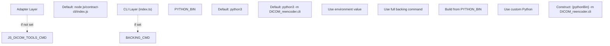
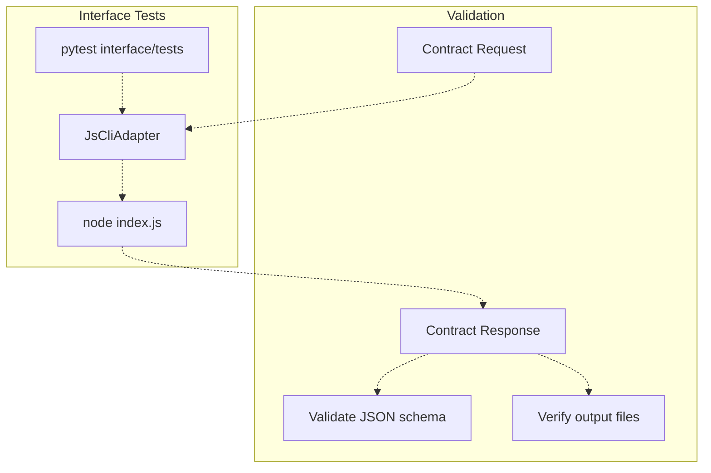
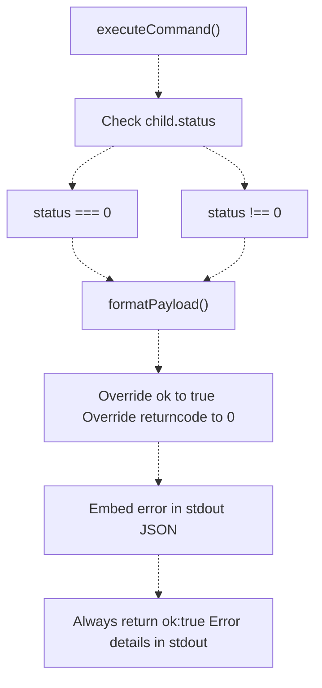

# 4f JavaScript Backend

> **Relevant source files**
> * [interface/CONTRACT.md](https://github.com/ThalesMMS/Dicom-Tools/blob/c7b4cbd8/interface/CONTRACT.md)
> * [interface/adapters/__init__.py](https://github.com/ThalesMMS/Dicom-Tools/blob/c7b4cbd8/interface/adapters/__init__.py)
> * [interface/adapters/js_cli.py](https://github.com/ThalesMMS/Dicom-Tools/blob/c7b4cbd8/interface/adapters/js_cli.py)
> * [interface/adapters/python_cli.py](https://github.com/ThalesMMS/Dicom-Tools/blob/c7b4cbd8/interface/adapters/python_cli.py)
> * [js/contract-cli/README.md](https://github.com/ThalesMMS/Dicom-Tools/blob/c7b4cbd8/js/contract-cli/README.md)
> * [js/contract-cli/index.js](https://github.com/ThalesMMS/Dicom-Tools/blob/c7b4cbd8/js/contract-cli/index.js)
> * [js/contract-cli/index.ts](https://github.com/ThalesMMS/Dicom-Tools/blob/c7b4cbd8/js/contract-cli/index.ts)
> * [js/contract-cli/package-lock.json](https://github.com/ThalesMMS/Dicom-Tools/blob/c7b4cbd8/js/contract-cli/package-lock.json)

## Purpose and Scope

This document describes the JavaScript backend implementation for Dicom-Tools. Unlike other language backends that directly implement DICOM operations, the JavaScript backend is a **CLI shim** that delegates all operations to the Python backend while maintaining contract compliance. This enables Node.js environments to integrate with the Dicom-Tools toolkit without reimplementing DICOM processing logic.

For information about the Python backend that handles the actual DICOM operations, see [Python Backend](4a%20Python-Backend.md). For details about the CLI contract specification, see [Contract Specification](3a%20Contract-Specification.md). For the web-based medical image viewer built with JavaScript, see [Web Viewer (JavaScript)](2c%20Web-Viewer-%28JavaScript%29.md).

---

## Architecture Overview

The JavaScript backend acts as a translation layer between the contract interface and the Python backend, providing a Node.js-compatible CLI that maintains the same request/response envelope format as all other backends.

### Shim Architecture



**Sources:** [js/contract-cli/index.ts L1-L199](https://github.com/ThalesMMS/Dicom-Tools/blob/c7b4cbd8/js/contract-cli/index.ts#L1-L199)

 [interface/adapters/js_cli.py L10-L67](https://github.com/ThalesMMS/Dicom-Tools/blob/c7b4cbd8/interface/adapters/js_cli.py#L10-L67)

 [interface/CONTRACT.md L82](https://github.com/ThalesMMS/Dicom-Tools/blob/c7b4cbd8/interface/CONTRACT.md#L82-L82)

---

## Entry Points and CLI Structure

The JavaScript backend has two entry points that work together to provide a contract-compliant CLI:

| File | Purpose | Key Functions |
| --- | --- | --- |
| `index.js` | Wrapper script, delegates to compiled TypeScript | Requires `dist/index.js` and calls `run()` |
| `index.ts` | TypeScript source, contains all implementation logic | `run()`, `parseArgs()`, `buildCommandArgs()`, `executeCommand()`, `formatPayload()` |
| `dist/index.js` | Compiled output from TypeScript build process | Same as `index.ts` but in JavaScript |

### CLI Invocation Flow



**Sources:** [js/contract-cli/index.js L1-L14](https://github.com/ThalesMMS/Dicom-Tools/blob/c7b4cbd8/js/contract-cli/index.js#L1-L14)

 [js/contract-cli/index.ts L157-L199](https://github.com/ThalesMMS/Dicom-Tools/blob/c7b4cbd8/js/contract-cli/index.ts#L157-L199)

 [interface/adapters/js_cli.py L19-L67](https://github.com/ThalesMMS/Dicom-Tools/blob/c7b4cbd8/interface/adapters/js_cli.py#L19-L67)

---

## Implementation Details

### Argument Parsing

The `parseArgs()` function extracts contract-compliant arguments from the command line:



The function handles JSON parsing for the `--options` parameter and validates that required parameters are present.

**Sources:** [js/contract-cli/index.ts L38-L63](https://github.com/ThalesMMS/Dicom-Tools/blob/c7b4cbd8/js/contract-cli/index.ts#L38-L63)

### Operation Mapping

The `buildCommandArgs()` function translates contract operations into Python CLI invocations:

| Contract Operation | Python CLI Command | Output Inference |
| --- | --- | --- |
| `info` | `['info', input, '--json']` | None (returns JSON metadata) |
| `anonymize` | `['anonymize', input, '-o', output]` | `_anon.dcm` suffix |
| `to_image` | `['to_image', input, '--format', fmt, '-o', output]` | `.png` or `.jpg` based on format |
| `transcode` | `['transcode', input, '--syntax', syntax, '-o', output]` | `_transcoded.dcm` suffix |
| `validate` | `['validate', input, '--json']` | None (returns JSON result) |
| `stats` | `['stats', input]` | None (returns text output) |
| `dump` | `['info', input, '--json', '--verbose']` | None (returns JSON dump) |
| `volume` | `['volume', input, '-o', output]` | `output/volume.npy` |
| `nifti` | `['nifti', input, '-o', output]` | `output/volume.nii.gz` |
| `echo` | `['echo', host, '--port', port]` | None (returns connection status) |

The function includes logic for output path inference when no explicit output is provided:

**Sources:** [js/contract-cli/index.ts L76-L126](https://github.com/ThalesMMS/Dicom-Tools/blob/c7b4cbd8/js/contract-cli/index.ts#L76-L126)

### Command Execution

The execution pipeline uses Node.js's `child_process.spawnSync()` for synchronous subprocess execution:



**Sources:** [js/contract-cli/index.ts L128-L155](https://github.com/ThalesMMS/Dicom-Tools/blob/c7b4cbd8/js/contract-cli/index.ts#L128-L155)

 [js/contract-cli/index.ts L157-L193](https://github.com/ThalesMMS/Dicom-Tools/blob/c7b4cbd8/js/contract-cli/index.ts#L157-L193)

---

## Adapter Integration

The Python adapter `JsCliAdapter` provides the bridge between the contract runner and the JavaScript CLI:

### Adapter Configuration



**Sources:** [interface/adapters/js_cli.py L10-L67](https://github.com/ThalesMMS/Dicom-Tools/blob/c7b4cbd8/interface/adapters/js_cli.py#L10-L67)

### Request Translation

The adapter translates contract requests into CLI arguments:

**Sources:** [interface/adapters/js_cli.py L19-L46](https://github.com/ThalesMMS/Dicom-Tools/blob/c7b4cbd8/interface/adapters/js_cli.py#L19-L46)

---

## Supported Operations

The JavaScript backend supports the following contract operations, all delegated to Python:

### Core File Operations

| Operation | Description | Parameters | Output |
| --- | --- | --- | --- |
| `info` | Extract DICOM metadata | `input` | JSON metadata to stdout |
| `validate` | Validate DICOM file | `input` | JSON validation result |
| `dump` | Complete dataset dump | `input` | JSON dump to stdout |
| `stats` | Pixel statistics | `input` | Statistics text |

### Transformation Operations

| Operation | Description | Parameters | Output |
| --- | --- | --- | --- |
| `anonymize` | Remove PHI from DICOM | `input`, `output` | Anonymized DICOM file |
| `to_image` | Export frame to image | `input`, `output`, `options.format`, `options.frame` | PNG/JPEG image |
| `transcode` | Change transfer syntax | `input`, `output`, `options.syntax` | Transcoded DICOM |

### Volume Operations

| Operation | Description | Parameters | Output |
| --- | --- | --- | --- |
| `volume` | Build 3D volume | `input` (directory), `output`, `options.preview` | `.npy` volume file |
| `nifti` | Export to NIfTI | `input` (directory), `output`, `options.series_uid` | `.nii.gz` file |

### Network Operations

| Operation | Description | Parameters | Output |
| --- | --- | --- | --- |
| `echo` | C-ECHO connectivity test | `options.host`, `options.port` | Connection status |

**Sources:** [js/contract-cli/index.ts L76-L126](https://github.com/ThalesMMS/Dicom-Tools/blob/c7b4cbd8/js/contract-cli/index.ts#L76-L126)

 [js/contract-cli/README.md L35-L47](https://github.com/ThalesMMS/Dicom-Tools/blob/c7b4cbd8/js/contract-cli/README.md#L35-L47)

---

## Configuration and Environment

### Environment Variables

The JavaScript backend uses two environment variables for configuration:

| Variable | Default Value | Purpose |
| --- | --- | --- |
| `PYTHON_BIN` | `python3` | Path to Python interpreter |
| `BACKING_CMD` | `python3 -m DICOM_reencoder.cli` | Complete command for Python backend |
| `JS_DICOM_TOOLS_CMD` | `node js/contract-cli/index.js` | Override entire JS CLI invocation (adapter side) |

**Configuration Resolution:**



**Sources:** [interface/adapters/js_cli.py L13-L17](https://github.com/ThalesMMS/Dicom-Tools/blob/c7b4cbd8/interface/adapters/js_cli.py#L13-L17)

 [js/contract-cli/index.ts L161-L166](https://github.com/ThalesMMS/Dicom-Tools/blob/c7b4cbd8/js/contract-cli/index.ts#L161-L166)

---

## Build and Deployment

### Build Process

The JavaScript backend requires TypeScript compilation before use:

```

```

**Build Commands:**

| Command | Purpose |
| --- | --- |
| `npm install` | Install dependencies (`typescript`, `@types/node`, `vitest`) |
| `npm run build` | Compile TypeScript to `dist/index.js` |
| `npm test` | Run unit tests with Vitest |
| `npm run test:coverage` | Generate test coverage report |

**Sources:** [js/contract-cli/README.md L12-L27](https://github.com/ThalesMMS/Dicom-Tools/blob/c7b4cbd8/js/contract-cli/README.md#L12-L27)

### Integration Testing

The JavaScript backend is tested through the interface test suite, which validates contract compliance across all backends:



**Sources:** [interface/adapters/js_cli.py L1-L68](https://github.com/ThalesMMS/Dicom-Tools/blob/c7b4cbd8/interface/adapters/js_cli.py#L1-L68)

 [interface/CONTRACT.md L1-L112](https://github.com/ThalesMMS/Dicom-Tools/blob/c7b4cbd8/interface/CONTRACT.md#L1-L112)

---

## Error Handling and Edge Cases

### Error Response Transformation

The JavaScript CLI includes special error handling logic to ensure contract compliance even when the Python backend is unavailable:

**Error Handling Flow:**



This design ensures that the adapter layer always receives a parseable response, even if the Python backend is missing or fails catastrophically.

**Sources:** [js/contract-cli/index.ts L180-L189](https://github.com/ThalesMMS/Dicom-Tools/blob/c7b4cbd8/js/contract-cli/index.ts#L180-L189)

### Custom Command Support

The adapter supports custom commands for extensibility:

**Sources:** [interface/adapters/js_cli.py L29-L36](https://github.com/ThalesMMS/Dicom-Tools/blob/c7b4cbd8/interface/adapters/js_cli.py#L29-L36)

---

## Design Rationale

### Why a Shim Instead of Native Implementation?

The JavaScript backend is implemented as a shim rather than a native DICOM processor for several architectural reasons:

| Consideration | Rationale |
| --- | --- |
| **Code Reuse** | Leverages the mature Python implementation (20+ operations) without duplication |
| **Maintenance** | Single implementation to maintain for DICOM processing logic |
| **Node.js Integration** | Provides a Node.js-compatible CLI for environments that need it |
| **Consistency** | Guarantees identical behavior across backends by delegating to the same Python core |
| **Development Speed** | Enables Node.js integration without reimplementing DICOM libraries |

### When to Use the JavaScript Backend

| Use Case | Appropriate? | Alternative |
| --- | --- | --- |
| Node.js CLI automation | ✓ Yes | - |
| Integrating with JavaScript build tools | ✓ Yes | - |
| Web browser DICOM processing | ✗ No | Use [Web Viewer](2c%20Web-Viewer-%28JavaScript%29.md) with Cornerstone3D |
| High-performance batch processing | ✗ No | Use [Python Backend](4a%20Python-Backend.md) directly |
| Cross-platform CLI distribution | ✓ Yes | Bundle with Node.js runtime |

**Sources:** [interface/CONTRACT.md L82](https://github.com/ThalesMMS/Dicom-Tools/blob/c7b4cbd8/interface/CONTRACT.md#L82-L82)

 [js/contract-cli/README.md L1-L48](https://github.com/ThalesMMS/Dicom-Tools/blob/c7b4cbd8/js/contract-cli/README.md#L1-L48)


### On this page

* [JavaScript Backend](#4.6-javascript-backend)
* [Purpose and Scope](#4.6-purpose-and-scope)
* [Architecture Overview](#4.6-architecture-overview)
* [Shim Architecture](#4.6-shim-architecture)
* [Entry Points and CLI Structure](#4.6-entry-points-and-cli-structure)
* [CLI Invocation Flow](#4.6-cli-invocation-flow)
* [Implementation Details](#4.6-implementation-details)
* [Argument Parsing](#4.6-argument-parsing)
* [Operation Mapping](#4.6-operation-mapping)
* [Command Execution](#4.6-command-execution)
* [Adapter Integration](#4.6-adapter-integration)
* [Adapter Configuration](#4.6-adapter-configuration)
* [Request Translation](#4.6-request-translation)
* [Supported Operations](#4.6-supported-operations)
* [Core File Operations](#4.6-core-file-operations)
* [Transformation Operations](#4.6-transformation-operations)
* [Volume Operations](#4.6-volume-operations)
* [Network Operations](#4.6-network-operations)
* [Configuration and Environment](#4.6-configuration-and-environment)
* [Environment Variables](#4.6-environment-variables)
* [Build and Deployment](#4.6-build-and-deployment)
* [Build Process](#4.6-build-process)
* [Integration Testing](#4.6-integration-testing)
* [Error Handling and Edge Cases](#4.6-error-handling-and-edge-cases)
* [Error Response Transformation](#4.6-error-response-transformation)
* [Custom Command Support](#4.6-custom-command-support)
* [Design Rationale](#4.6-design-rationale)
* [Why a Shim Instead of Native Implementation?](#4.6-why-a-shim-instead-of-native-implementation)
* [When to Use the JavaScript Backend](#4.6-when-to-use-the-javascript-backend)

Ask Devin about Dicom-Tools