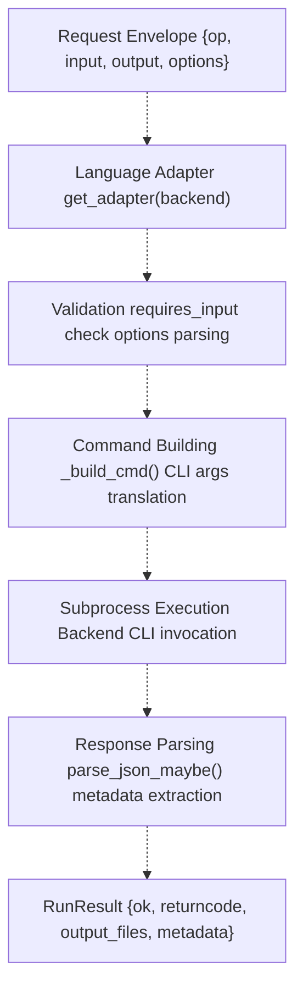
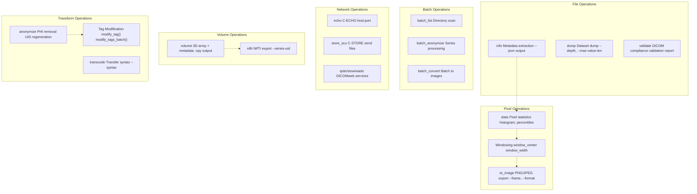
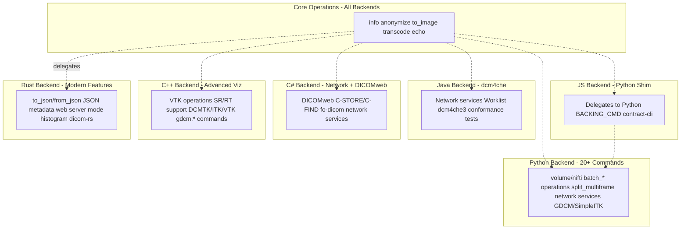
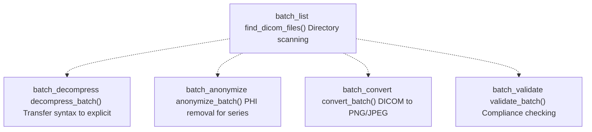
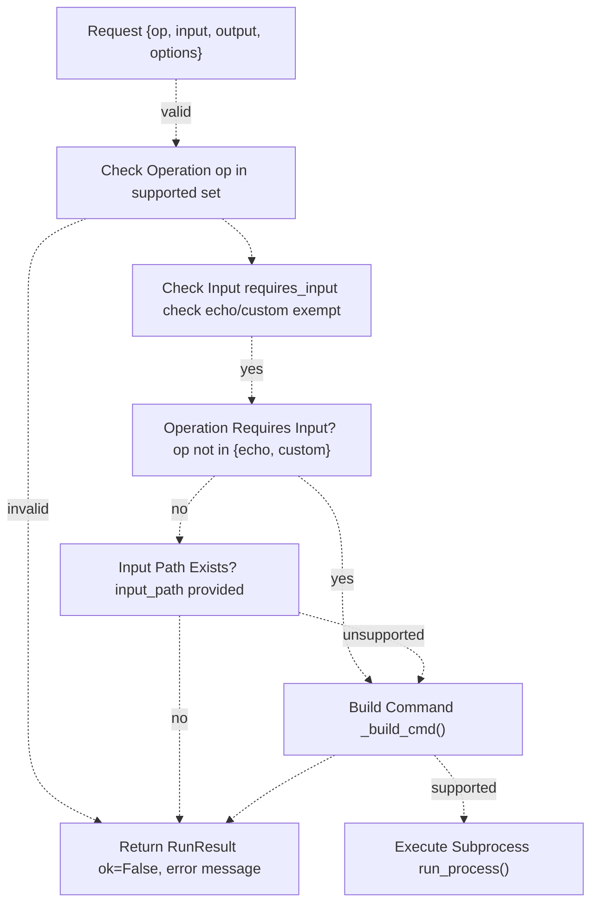

# DICOM Operations

> **Relevant source files**
> * [interface/CONTRACT.md](https://github.com/ThalesMMS/Dicom-Tools/blob/c7b4cbd8/interface/CONTRACT.md)
> * [interface/adapters/__init__.py](https://github.com/ThalesMMS/Dicom-Tools/blob/c7b4cbd8/interface/adapters/__init__.py)
> * [interface/adapters/js_cli.py](https://github.com/ThalesMMS/Dicom-Tools/blob/c7b4cbd8/interface/adapters/js_cli.py)
> * [interface/adapters/python_cli.py](https://github.com/ThalesMMS/Dicom-Tools/blob/c7b4cbd8/interface/adapters/python_cli.py)
> * [python/tests/test_anonymize_dicom.py](https://github.com/ThalesMMS/Dicom-Tools/blob/c7b4cbd8/python/tests/test_anonymize_dicom.py)
> * [python/tests/test_batch_process.py](https://github.com/ThalesMMS/Dicom-Tools/blob/c7b4cbd8/python/tests/test_batch_process.py)
> * [python/tests/test_convert_to_image.py](https://github.com/ThalesMMS/Dicom-Tools/blob/c7b4cbd8/python/tests/test_convert_to_image.py)
> * [python/tests/test_core_modules.py](https://github.com/ThalesMMS/Dicom-Tools/blob/c7b4cbd8/python/tests/test_core_modules.py)
> * [python/tests/test_extract_metadata.py](https://github.com/ThalesMMS/Dicom-Tools/blob/c7b4cbd8/python/tests/test_extract_metadata.py)
> * [python/tests/test_modify_tags.py](https://github.com/ThalesMMS/Dicom-Tools/blob/c7b4cbd8/python/tests/test_modify_tags.py)
> * [python/tests/test_organize_dicom.py](https://github.com/ThalesMMS/Dicom-Tools/blob/c7b4cbd8/python/tests/test_organize_dicom.py)
> * [python/tests/test_pixel_stats.py](https://github.com/ThalesMMS/Dicom-Tools/blob/c7b4cbd8/python/tests/test_pixel_stats.py)

This page provides a comprehensive reference for all DICOM operations supported by Dicom-Tools. Operations are the fundamental units of functionality that can be invoked across any language backend through the unified CLI contract system. Each operation performs a specific DICOM-related task such as extracting metadata, anonymizing files, converting to images, or performing network services.

For implementation details on specific operation categories, see [Core File Operations](#5.1), [Image Conversion and Processing](#5.2), [Tag Modification and Anonymization](#5.3), [3D Volume Reconstruction](#5.4), [Network Operations](#5.5), and [Batch Processing](#5.6). For the adapter pattern that routes operations to backends, see [Adapter Pattern](#3.2).

## Operation Architecture

Operations are defined in the CLI contract and implemented independently by each language backend. The system maintains a canonical operation set that all backends should support, though individual backends may implement subsets based on their library capabilities.

### Operation Request Structure



**Diagram: Operation Request Flow**

An operation request flows through validation, command building, execution, and response parsing stages. Each adapter translates the generic request format into backend-specific CLI invocations.

Sources: [interface/adapters/python_cli.py L18-L43](https://github.com/ThalesMMS/Dicom-Tools/blob/c7b4cbd8/interface/adapters/python_cli.py#L18-L43)

 [interface/adapters/js_cli.py L19-L67](https://github.com/ThalesMMS/Dicom-Tools/blob/c7b4cbd8/interface/adapters/js_cli.py#L19-L67)

 [interface/CONTRACT.md L6-L26](https://github.com/ThalesMMS/Dicom-Tools/blob/c7b4cbd8/interface/CONTRACT.md#L6-L26)

### Canonical Operation Set

The complete list of operations is defined in `interface/CONTRACT.md`. Operations are categorized by functionality:

| Category | Operations | Description |
| --- | --- | --- |
| **Metadata** | `info`, `dump`, `stats` | Extract and display DICOM metadata |
| **Validation** | `validate` | Verify DICOM file compliance |
| **Transformation** | `anonymize`, `transcode`, `to_image` | Modify or convert DICOM files |
| **Conversion** | `to_json`, `from_json`, `to_image` | Convert between DICOM and other formats |
| **Volume** | `volume`, `nifti` | Construct 3D volumes from series |
| **Network** | `echo`, `store_scu`, `worklist` | DICOM network services |
| **Batch** | `batch_list`, `batch_decompress`, `batch_anonymize`, `batch_convert`, `batch_validate` | Process multiple files |
| **Multiframe** | `split_multiframe` | Split multi-frame DICOM files |
| **Testing** | `test_*`, `run_*_tests` | Backend unit and integration tests |

Sources: [interface/CONTRACT.md L28-L74](https://github.com/ThalesMMS/Dicom-Tools/blob/c7b4cbd8/interface/CONTRACT.md#L28-L74)

## Operation Categories



**Diagram: Operation Categories and Relationships**

Operations are organized into functional categories. Some operations build on others (e.g., `to_image` uses windowing calculations from `stats`).

Sources: [interface/CONTRACT.md L28-L46](https://github.com/ThalesMMS/Dicom-Tools/blob/c7b4cbd8/interface/CONTRACT.md#L28-L46)

 [python/tests/test_pixel_stats.py L20-L85](https://github.com/ThalesMMS/Dicom-Tools/blob/c7b4cbd8/python/tests/test_pixel_stats.py#L20-L85)

 [python/tests/test_convert_to_image.py L22-L57](https://github.com/ThalesMMS/Dicom-Tools/blob/c7b4cbd8/python/tests/test_convert_to_image.py#L22-L57)

## Backend Support Matrix



**Diagram: Backend Capabilities**

All backends support core operations, but each has unique strengths. Python is most comprehensive, Rust adds modern features, C++ provides advanced visualization, and C#/Java excel at network operations.

Sources: [interface/CONTRACT.md L76-L82](https://github.com/ThalesMMS/Dicom-Tools/blob/c7b4cbd8/interface/CONTRACT.md#L76-L82)

 [interface/adapters/__init__.py L10-L24](https://github.com/ThalesMMS/Dicom-Tools/blob/c7b4cbd8/interface/adapters/__init__.py#L10-L24)

## Operation Specification Format

### Request Envelope

Every operation request follows this structure:

```
{  "backend": "python | cpp | rust | java | csharp | js",  "op": "operation_name",  "input": "/path/to/file_or_directory",  "output": "/path/to/output_optional",  "options": {    "key": "value"  }}
```

**Key Fields:**

* `backend`: Target language implementation
* `op`: Operation name from canonical set
* `input`: Source DICOM file or directory (required for most operations)
* `output`: Destination path (optional, inferred if not provided)
* `options`: Operation-specific parameters as key-value pairs

Sources: [interface/CONTRACT.md L6-L13](https://github.com/ThalesMMS/Dicom-Tools/blob/c7b4cbd8/interface/CONTRACT.md#L6-L13)

### Response Envelope

Every operation returns this structure:

```
{  "ok": true,  "returncode": 0,  "stdout": "process output text",  "stderr": "warnings or errors",  "output_files": ["/list/of/generated/files"],  "metadata": {    "structured_data": "when_available"  }}
```

**Key Fields:**

* `ok`: Boolean success indicator
* `returncode`: Exit code from subprocess (0 = success)
* `stdout`: Standard output from backend CLI
* `stderr`: Error messages and warnings
* `output_files`: List of generated file paths
* `metadata`: Structured data (e.g., JSON metadata from `info` operation)

Sources: [interface/CONTRACT.md L16-L26](https://github.com/ThalesMMS/Dicom-Tools/blob/c7b4cbd8/interface/CONTRACT.md#L16-L26)

 [interface/adapters/python_cli.py L32-L42](https://github.com/ThalesMMS/Dicom-Tools/blob/c7b4cbd8/interface/adapters/python_cli.py#L32-L42)

## Common Operation Patterns

### Metadata Extraction (info)

Extracts structured metadata from a DICOM file. The Python backend uses the `summary` command with `--json` flag:

```
# Python adapter implementationcmd = [*self.base_cmd, "summary", input_path, "--json"]if options.get("verbose"):    cmd.append("--verbose")
```

The response includes structured patient, study, series, and image information in the `metadata` field.

Sources: [interface/adapters/python_cli.py L46-L50](https://github.com/ThalesMMS/Dicom-Tools/blob/c7b4cbd8/interface/adapters/python_cli.py#L46-L50)

 [python/tests/test_extract_metadata.py L45-L140](https://github.com/ThalesMMS/Dicom-Tools/blob/c7b4cbd8/python/tests/test_extract_metadata.py#L45-L140)

### Anonymization (anonymize)

Removes Protected Health Information (PHI) from DICOM files. Key anonymization steps include:

1. **Patient Data Removal**: PatientName, PatientID, PatientBirthDate, PatientAddress
2. **UID Regeneration**: StudyInstanceUID, SeriesInstanceUID, SOPInstanceUID
3. **Date Shifting**: Consistent offset applied to all dates
4. **Private Tag Removal**: All private tags are deleted
5. **Technical Data Preservation**: Pixel data, image dimensions, modality retained

```
# Python adapter anonymize commandinferred_output = output or self._infer_output(input_path, suffix="_anonymized")return [*self.base_cmd, "anonymize", input_path, "-o", inferred_output]
```

Sources: [interface/adapters/python_cli.py L52-L54](https://github.com/ThalesMMS/Dicom-Tools/blob/c7b4cbd8/interface/adapters/python_cli.py#L52-L54)

 [python/tests/test_anonymize_dicom.py L17-L327](https://github.com/ThalesMMS/Dicom-Tools/blob/c7b4cbd8/python/tests/test_anonymize_dicom.py#L17-L327)

### Image Conversion (to_image)

Exports DICOM pixel data to PNG or JPEG format with optional windowing:

**Options:**

* `format`: "png" or "jpeg"
* `frame`: Frame number for multi-frame images
* `window_center`: Manual window center value
* `window_width`: Manual window width value

If windowing parameters are not provided, automatic windowing is calculated based on pixel value percentiles.

```
# Python adapter to_image commandinferred_output = output or self._infer_output(input_path, suffix=".png")cmd = [*self.base_cmd, "png", input_path, "-o", inferred_output]if options.get("frame") is not None:    cmd.extend(["--frame", str(options["frame"])])
```

Sources: [interface/adapters/python_cli.py L56-L61](https://github.com/ThalesMMS/Dicom-Tools/blob/c7b4cbd8/interface/adapters/python_cli.py#L56-L61)

 [python/tests/test_convert_to_image.py L22-L184](https://github.com/ThalesMMS/Dicom-Tools/blob/c7b4cbd8/python/tests/test_convert_to_image.py#L22-L184)

### Transfer Syntax Conversion (transcode)

Changes the DICOM transfer syntax (compression):

**Common Syntaxes:**

* `explicit`: Explicit VR Little Endian (uncompressed)
* `jpeg`: JPEG Lossy compression
* `jpeg2000`: JPEG 2000 compression
* `jpegls`: JPEG-LS lossless compression
* `rle`: RLE Lossless compression

```
# Python adapter transcode commandinferred_output = output or self._infer_output(input_path, suffix="_explicit.dcm")syntax = options.get("syntax", "explicit")return [*self.base_cmd, "transcode", input_path, "-o", inferred_output, "--syntax", str(syntax)]
```

Sources: [interface/adapters/python_cli.py L63-L66](https://github.com/ThalesMMS/Dicom-Tools/blob/c7b4cbd8/interface/adapters/python_cli.py#L63-L66)

 [interface/CONTRACT.md L34](https://github.com/ThalesMMS/Dicom-Tools/blob/c7b4cbd8/interface/CONTRACT.md#L34-L34)

### Statistics Generation (stats)

Calculates pixel value statistics including:

* Min, max, mean, median, standard deviation
* Percentiles (1st, 5th, 25th, 75th, 95th, 99th)
* Range and interquartile range (IQR)
* Zero pixels count and percentage
* Unique values count
* Histogram with configurable bins

```
# Python adapter stats commandreturn [*self.base_cmd, "stats", input_path]
```

Sources: [interface/adapters/python_cli.py L112-L113](https://github.com/ThalesMMS/Dicom-Tools/blob/c7b4cbd8/interface/adapters/python_cli.py#L112-L113)

 [python/tests/test_pixel_stats.py L20-L85](https://github.com/ThalesMMS/Dicom-Tools/blob/c7b4cbd8/python/tests/test_pixel_stats.py#L20-L85)

## Operation Options

Operations accept configuration through the `options` dictionary. Common option patterns:

| Option Key | Used By | Values | Description |
| --- | --- | --- | --- |
| `format` | `to_image`, `batch_convert` | "png", "jpeg" | Output image format |
| `frame` | `to_image`, `stats`, `histogram` | integer | Frame index for multi-frame files |
| `window_center` | `to_image` | integer | Manual window level |
| `window_width` | `to_image` | integer | Manual window width |
| `syntax` | `transcode` | "explicit", "jpeg", etc. | Target transfer syntax |
| `verbose` | `info` | boolean | Extended metadata output |
| `recursive` | `batch_*` | boolean | Recurse into subdirectories |
| `bins` | `stats`, `histogram` | integer | Number of histogram bins |
| `series_uid` | `nifti` | string | Specific series UID to export |
| `preview` | `volume` | boolean | Generate preview visualization |
| `host` | `echo`, network ops | string | Server hostname |
| `port` | `echo`, network ops | integer | Server port |
| `timeout` | `echo` | integer | Connection timeout seconds |
| `calling_aet` | `echo` | string | Calling AE Title |
| `called_aet` | `echo` | string | Called AE Title |

Sources: [interface/CONTRACT.md L28-L46](https://github.com/ThalesMMS/Dicom-Tools/blob/c7b4cbd8/interface/CONTRACT.md#L28-L46)

 [interface/adapters/python_cli.py L45-L154](https://github.com/ThalesMMS/Dicom-Tools/blob/c7b4cbd8/interface/adapters/python_cli.py#L45-L154)

## Batch Operations

Batch operations process multiple DICOM files in a directory. All batch operations support the `recursive` option to process subdirectories.

### Batch Operation Types



**Diagram: Batch Operation Flow**

Batch operations start with discovery (`batch_list`) then apply transformations to all found files.

**Common Pattern:**

1. Discover DICOM files in input directory
2. Apply operation to each file
3. Save results to output directory with modified names

```
# Python adapter batch operation exampledirectory = input_path or "."sub_op = op_map[op]  # e.g., "anonymize"cmd = [sys.executable, "-m", "DICOM_reencoder.batch_process", "-d", directory, "-o", sub_op]if options.get("recursive"):    cmd.append("-r")if output:    cmd.extend(["--output-dir", str(output)])
```

Sources: [interface/adapters/python_cli.py L130-L154](https://github.com/ThalesMMS/Dicom-Tools/blob/c7b4cbd8/interface/adapters/python_cli.py#L130-L154)

 [python/tests/test_batch_process.py L1-L263](https://github.com/ThalesMMS/Dicom-Tools/blob/c7b4cbd8/python/tests/test_batch_process.py#L1-L263)

## Network Operations

Network operations implement DICOM network services using the DIMSE protocol.

### C-ECHO Operation

Verifies network connectivity with a DICOM server:

```
# Python adapter echo commandhost = options.get("host", "127.0.0.1")port = options.get("port", 11112)timeout = options.get("timeout", 5)calling = options.get("calling_aet", "DICOMTOOLS_SCU")called = options.get("called_aet", "DICOMTOOLS_SCP")return [    "python", "-m", "DICOM_reencoder.dicom_echo", host,    "--port", str(port), "--timeout", str(timeout),    "--calling-aet", calling, "--called-aet", called,]
```

**Required Options:**

* `host`: Server IP address or hostname
* `port`: Server port (default 11112)

**Optional Options:**

* `timeout`: Connection timeout in seconds
* `calling_aet`: Client AE Title
* `called_aet`: Server AE Title

Sources: [interface/adapters/python_cli.py L72-L91](https://github.com/ThalesMMS/Dicom-Tools/blob/c7b4cbd8/interface/adapters/python_cli.py#L72-L91)

 [interface/CONTRACT.md L36](https://github.com/ThalesMMS/Dicom-Tools/blob/c7b4cbd8/interface/CONTRACT.md#L36-L36)

## Volume Operations

Volume operations construct 3D arrays from DICOM series.

### Volume Construction (volume)

Creates a 3D NumPy array from a directory of DICOM slices:

**Output:**

* `.npy` file containing 3D array
* `.json` metadata file with affine matrix, spacing, orientation

**Options:**

* `preview`: Generate visualization
* `metadata`: Custom metadata output path

```
# Python adapter volume commandinferred_output = output or str((self.cwd / "output" / "volume.npy").resolve())meta_path = options.get("metadata") or str(Path(inferred_output).with_suffix(".json"))cmd = [*self.base_cmd, "volume", input_path, "-o", inferred_output, "--metadata", meta_path]if options.get("preview"):    cmd.append("--preview")
```

Sources: [interface/adapters/python_cli.py L93-L99](https://github.com/ThalesMMS/Dicom-Tools/blob/c7b4cbd8/interface/adapters/python_cli.py#L93-L99)

 [interface/CONTRACT.md L39](https://github.com/ThalesMMS/Dicom-Tools/blob/c7b4cbd8/interface/CONTRACT.md#L39-L39)

### NIfTI Export (nifti)

Exports a DICOM series to NIfTI format with proper orientation and spacing:

**Options:**

* `series_uid`: Specific series to export
* `no_compress`: Output uncompressed `.nii` instead of `.nii.gz`
* `metadata`: JSON metadata output path

```
# Python adapter nifti commandinferred_output = output or self._infer_output(input_path, suffix=".nii.gz")cmd = [*self.base_cmd, "nifti", input_path, "-o", inferred_output]if options.get("series_uid"):    cmd.extend(["--series-uid", options["series_uid"]])if options.get("no_compress"):    cmd.append("--no-compress")
```

Sources: [interface/adapters/python_cli.py L101-L110](https://github.com/ThalesMMS/Dicom-Tools/blob/c7b4cbd8/interface/adapters/python_cli.py#L101-L110)

 [interface/CONTRACT.md L40](https://github.com/ThalesMMS/Dicom-Tools/blob/c7b4cbd8/interface/CONTRACT.md#L40-L40)

## Testing Operations

Each backend provides test operations that execute unit and integration tests:

### Python Backend Tests

* Core module tests via pytest
* GDCM integration tests
* Network service tests
* dicom-numpy tests

### C++ Backend Tests

* `test_gdcm`: GDCM unit tests
* `test_dcmtk`: DCMTK unit tests
* `test_itk`: ITK unit tests
* `test_vtk_unit`: VTK unit tests
* `test_utils`: Utility tests
* `test_integration`: Cross-library integration tests
* `test_edge_cases`: Edge case handling
* `test_validation`: Validation tests
* `run_cpp_tests`: Execute all C++ tests

### Java Backend Tests

* `test_uid`: UID handling tests
* `test_datetime`: Date/time tests
* `test_charset`: Character set tests
* `test_workflow`: End-to-end workflow tests
* `test_validation_java`: Validation tests
* `run_java_tests`: Execute all Java tests

### C# Backend Tests

* `test_anonymize_cs`: Anonymization tests
* `test_uid_cs`: UID tests
* `test_datetime_cs`: Date/time tests
* `test_charset_cs`: Character set tests
* `test_dictionary_cs`: Data dictionary tests
* `test_file_operations_cs`: File I/O tests
* `test_sequence_cs`: Sequence tests
* `test_value_representation_cs`: VR tests
* `test_option_parser_cs`: Option parsing tests
* `test_stats_helpers_cs`: Statistics helper tests
* `run_cs_tests`: Execute all C# tests

Sources: [interface/CONTRACT.md L49-L74](https://github.com/ThalesMMS/Dicom-Tools/blob/c7b4cbd8/interface/CONTRACT.md#L49-L74)

## Custom Commands

The `custom` operation allows executing arbitrary backend commands with template substitution:

**Options:**

* `custom_cmd`: Command string with `{input}` and `{output}` placeholders

```css
# Python adapter custom commandif op == "custom":    custom_cmd = options.get("custom_cmd")    if not custom_cmd:        return None    parts = split_cmd(str(custom_cmd))    parts = [str(input_path) if p == "{input}" else str(output) if p == "{output}" else p for p in parts]    cmd = [*self.base_cmd, *parts]    return cmd
```

This enables extending functionality without modifying the contract specification.

Sources: [interface/adapters/python_cli.py L156-L163](https://github.com/ThalesMMS/Dicom-Tools/blob/c7b4cbd8/interface/adapters/python_cli.py#L156-L163)

## Output File Inference

When `output` is not specified, adapters infer output paths based on operation type:

**Suffix Patterns:**

* `anonymize`: `_anonymized.dcm`
* `to_image`: `.png` or `.jpg`
* `transcode`: `_explicit.dcm`
* `volume`: `volume.npy`
* `nifti`: `.nii.gz`

```
def _infer_output(self, input_path: str, *, suffix: str) -> str:    path = Path(input_path)    if suffix.startswith("."):        return str(path.with_suffix(suffix))    return str(path.with_name(path.stem + suffix + path.suffix))
```

This provides sensible defaults while allowing explicit control when needed.

Sources: [interface/adapters/python_cli.py L167-L172](https://github.com/ThalesMMS/Dicom-Tools/blob/c7b4cbd8/interface/adapters/python_cli.py#L167-L172)

## Operation Validation

Adapters validate requests before execution:



**Diagram: Operation Validation Flow**

Requests are validated before execution. Most operations require an input path, except `echo` and `custom`.

Sources: [interface/adapters/python_cli.py L18-L30](https://github.com/ThalesMMS/Dicom-Tools/blob/c7b4cbd8/interface/adapters/python_cli.py#L18-L30)

 [interface/adapters/js_cli.py L24-L27](https://github.com/ThalesMMS/Dicom-Tools/blob/c7b4cbd8/interface/adapters/js_cli.py#L24-L27)

Refresh this wiki

Last indexed: 5 January 2026 ([c7b4cb](https://github.com/ThalesMMS/Dicom-Tools/commit/c7b4cbd8))

### On this page

* [DICOM Operations](#5-dicom-operations)
* [Operation Architecture](#5-operation-architecture)
* [Operation Request Structure](#5-operation-request-structure)
* [Canonical Operation Set](#5-canonical-operation-set)
* [Operation Categories](#5-operation-categories)
* [Backend Support Matrix](#5-backend-support-matrix)
* [Operation Specification Format](#5-operation-specification-format)
* [Request Envelope](#5-request-envelope)
* [Response Envelope](#5-response-envelope)
* [Common Operation Patterns](#5-common-operation-patterns)
* [Metadata Extraction ( info )](#5-metadata-extraction-object-object)
* [Anonymization ( anonymize )](#5-anonymization-object-object)
* [Image Conversion ( to_image )](#5-image-conversion-object-object)
* [Transfer Syntax Conversion ( transcode )](#5-transfer-syntax-conversion-object-object)
* [Statistics Generation ( stats )](#5-statistics-generation-object-object)
* [Operation Options](#5-operation-options)
* [Batch Operations](#5-batch-operations)
* [Batch Operation Types](#5-batch-operation-types)
* [Network Operations](#5-network-operations)
* [C-ECHO Operation](#5-c-echo-operation)
* [Volume Operations](#5-volume-operations)
* [Volume Construction ( volume )](#5-volume-construction-object-object)
* [NIfTI Export ( nifti )](#5-nifti-export-object-object)
* [Testing Operations](#5-testing-operations)
* [Python Backend Tests](#5-python-backend-tests)
* [C++ Backend Tests](#5-c-backend-tests)
* [Java Backend Tests](#5-java-backend-tests)
* [C# Backend Tests](#5-c-backend-tests-1)
* [Custom Commands](#5-custom-commands)
* [Output File Inference](#5-output-file-inference)
* [Operation Validation](#5-operation-validation)

Ask Devin about Dicom-Tools