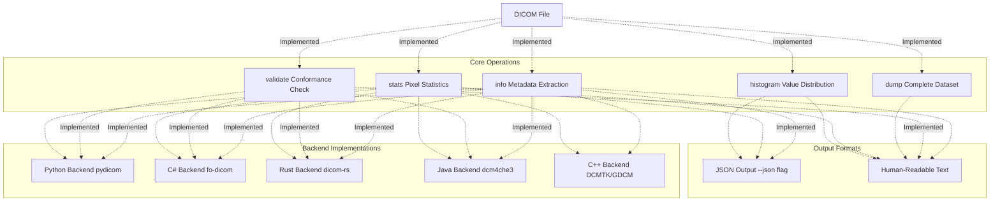
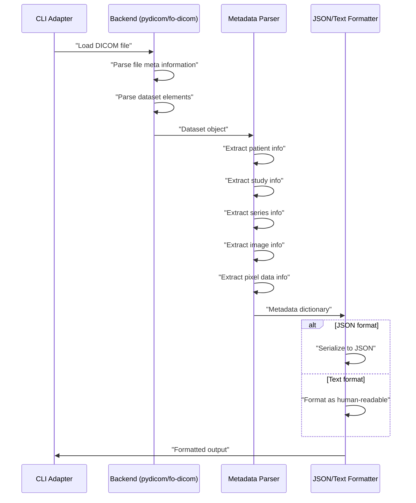
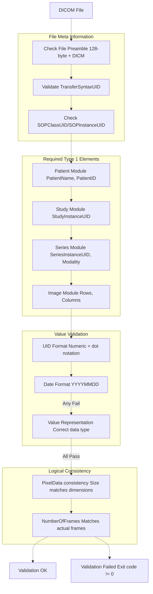
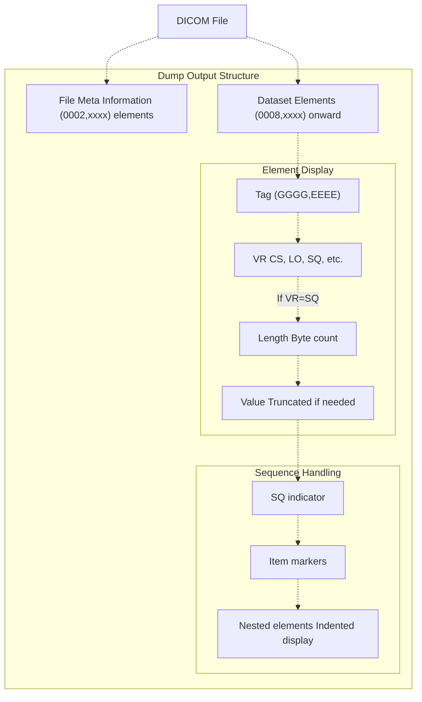
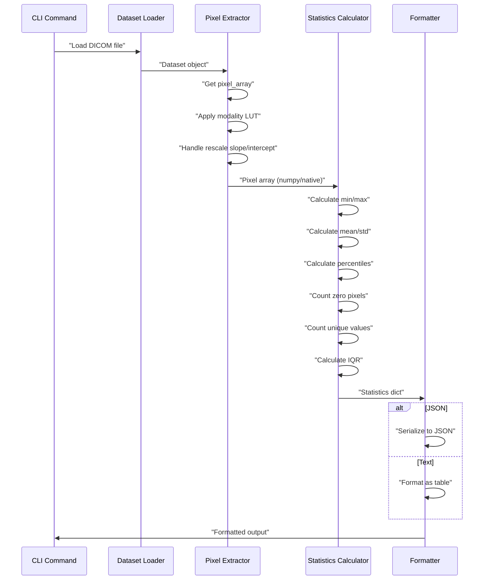
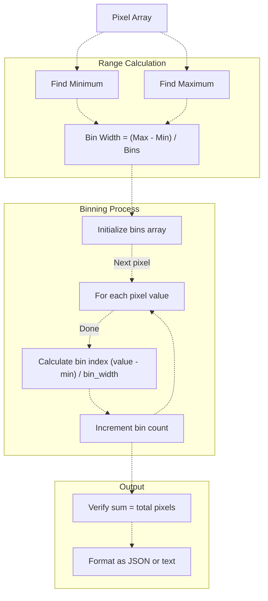

# 5a Core File Operations

> **Relevant source files**
> * [cs/DicomTools.Tests/CiEnvironment.cs](https://github.com/ThalesMMS/Dicom-Tools/blob/c7b4cbd8/cs/DicomTools.Tests/CiEnvironment.cs)
> * [cs/DicomTools.Tests/CliContractTests.cs](https://github.com/ThalesMMS/Dicom-Tools/blob/c7b4cbd8/cs/DicomTools.Tests/CliContractTests.cs)
> * [cs/DicomTools.Tests/CliHelpersTests.cs](https://github.com/ThalesMMS/Dicom-Tools/blob/c7b4cbd8/cs/DicomTools.Tests/CliHelpersTests.cs)
> * [cs/DicomTools.Tests/CliUnitTests.cs](https://github.com/ThalesMMS/Dicom-Tools/blob/c7b4cbd8/cs/DicomTools.Tests/CliUnitTests.cs)
> * [python/tests/test_anonymize_dicom.py](https://github.com/ThalesMMS/Dicom-Tools/blob/c7b4cbd8/python/tests/test_anonymize_dicom.py)
> * [python/tests/test_batch_process.py](https://github.com/ThalesMMS/Dicom-Tools/blob/c7b4cbd8/python/tests/test_batch_process.py)
> * [python/tests/test_convert_to_image.py](https://github.com/ThalesMMS/Dicom-Tools/blob/c7b4cbd8/python/tests/test_convert_to_image.py)
> * [python/tests/test_core_modules.py](https://github.com/ThalesMMS/Dicom-Tools/blob/c7b4cbd8/python/tests/test_core_modules.py)
> * [python/tests/test_extract_metadata.py](https://github.com/ThalesMMS/Dicom-Tools/blob/c7b4cbd8/python/tests/test_extract_metadata.py)
> * [python/tests/test_modify_tags.py](https://github.com/ThalesMMS/Dicom-Tools/blob/c7b4cbd8/python/tests/test_modify_tags.py)
> * [python/tests/test_organize_dicom.py](https://github.com/ThalesMMS/Dicom-Tools/blob/c7b4cbd8/python/tests/test_organize_dicom.py)
> * [python/tests/test_pixel_stats.py](https://github.com/ThalesMMS/Dicom-Tools/blob/c7b4cbd8/python/tests/test_pixel_stats.py)

## Purpose and Scope

Core File Operations provide fundamental capabilities for inspecting, validating, and analyzing DICOM files without modifying them. These operations form the foundation for understanding file contents, verifying DICOM conformance, and extracting statistical information from pixel data.

This page documents four primary operations:

* **info**: Extract and display DICOM metadata
* **validate**: Verify DICOM file conformance
* **dump**: Display complete dataset structure
* **stats**: Calculate pixel data statistics and histograms

For operations that modify DICOM files, see [Tag Modification and Anonymization](5c%20Tag-Modification-and-Anonymization.md). For image export and transcoding, see [Image Conversion and Processing](5b%20Image-Conversion-and-Processing.md). For processing multiple files, see [Batch Processing](5f%20Batch-Processing.md).

---

## Operation Overview



**Sources:** [cs/DicomTools.Tests/CliContractTests.cs L1-L182](https://github.com/ThalesMMS/Dicom-Tools/blob/c7b4cbd8/cs/DicomTools.Tests/CliContractTests.cs#L1-L182)

 [cs/DicomTools.Tests/CliUnitTests.cs L1-L182](https://github.com/ThalesMMS/Dicom-Tools/blob/c7b4cbd8/cs/DicomTools.Tests/CliUnitTests.cs#L1-L182)

---

## Info Operation

### Purpose

The `info` operation extracts essential metadata from DICOM files, providing quick access to patient demographics, study information, image characteristics, and pixel data parameters. This is typically the first operation run when examining unknown DICOM files.

### Command Patterns

| Backend | Command Format |
| --- | --- |
| Python | `python -m DICOM_reencoder.cli info <file> [--json]` |
| C# | `DicomTools.Cli info <file> [--json]` |
| Rust | `dicom-tools info <file> [--json]` |
| Java | `java -jar dcm4che-tests.jar info <file> [--json]` |

### JSON Output Schema

When invoked with `--json` flag, the operation produces structured metadata:

```
{  "Rows": 512,  "Columns": 512,  "StudyInstanceUid": "1.2.840...",  "SeriesInstanceUid": "1.2.840...",  "SopInstanceUid": "1.2.840...",  "SopClassUid": "1.2.840.10008.5.1.4.1.1.2",  "PhotometricInterpretation": "MONOCHROME2",  "TransferSyntaxUid": "1.2.840.10008.1.2.1",  "NumberOfFrames": 1,  "BitsAllocated": 16,  "BitsStored": 12,  "HighBit": 11,  "PixelRepresentation": 0,  "Modality": "CT",  "PatientName": "DOE^JOHN",  "PatientId": "12345",  "StudyDate": "20231115",  "SeriesDescription": "Chest CT"}
```

**Sources:** [cs/DicomTools.Tests/CliContractTests.cs L16-L29](https://github.com/ThalesMMS/Dicom-Tools/blob/c7b4cbd8/cs/DicomTools.Tests/CliContractTests.cs#L16-L29)

### Implementation Flow



**Sources:** [python/tests/test_extract_metadata.py L1-L261](https://github.com/ThalesMMS/Dicom-Tools/blob/c7b4cbd8/python/tests/test_extract_metadata.py#L1-L261)

 [python/tests/test_core_modules.py L182-L236](https://github.com/ThalesMMS/Dicom-Tools/blob/c7b4cbd8/python/tests/test_core_modules.py#L182-L236)

### Key Functions and Classes

| Component | Location | Purpose |
| --- | --- | --- |
| `extract_metadata()` | Python: DICOM_reencoder/extract_metadata.py | Extract metadata from DICOM file |
| `summarize_metadata()` | Python: DICOM_reencoder/core/metadata.py | Create structured metadata summary |
| `InfoCommand` | C#: DicomTools.Cli/Commands/InfoCommand.cs | C# implementation of info operation |
| `format_value()` | Python: DICOM_reencoder/extract_metadata.py | Format DICOM values for display |

### Edge Cases

**Files Without Pixel Data**

The info operation handles DICOM files that contain only metadata (e.g., Structured Reports, RT Structure Sets):

```
// Test case demonstrating graceful handling[Fact]public void Info_Handles_File_Without_PixelData(){    var dataset = new FellowOakDicom.DicomDataset    {        { DicomTag.SOPClassUID, DicomUID.SecondaryCaptureImageStorage },        { DicomTag.PatientID, "NO-PIX" }        // No PixelData element    };        var result = CliRunner.Run("info", dicomPath);    Assert.Equal(0, result.ExitCode);}
```

**Sources:** [cs/DicomTools.Tests/CliUnitTests.cs L40-L66](https://github.com/ThalesMMS/Dicom-Tools/blob/c7b4cbd8/cs/DicomTools.Tests/CliUnitTests.cs#L40-L66)

**Multiframe Images**

For multiframe DICOM files, the `NumberOfFrames` field indicates the total frame count:

```
def test_extract_metadata_multiframe(tmp_path):    ds = build_multiframe_dataset(frames=3, shape=(8, 8))    extract_metadata(input_file)    # Output includes: NumberOfFrames: 3
```

**Sources:** [python/tests/test_extract_metadata.py L244-L260](https://github.com/ThalesMMS/Dicom-Tools/blob/c7b4cbd8/python/tests/test_extract_metadata.py#L244-L260)

### Text Output Format

When invoked without `--json`, the operation produces categorized output:

```yaml
=== PATIENT INFORMATION ===
PatientName: DOE^JOHN
PatientID: 12345
PatientBirthDate: 19800101
PatientSex: M

=== STUDY INFORMATION ===
StudyInstanceUID: 1.2.840...
StudyDate: 20231115
StudyDescription: Chest CT

=== SERIES INFORMATION ===
SeriesInstanceUID: 1.2.840...
Modality: CT
SeriesDescription: Axial

=== IMAGE INFORMATION ===
Rows: 512
Columns: 512
BitsAllocated: 16
PhotometricInterpretation: MONOCHROME2

=== PIXEL DATA INFORMATION ===
NumberOfFrames: 1
PixelData: Present
```

**Sources:** [python/tests/test_extract_metadata.py L42-L143](https://github.com/ThalesMMS/Dicom-Tools/blob/c7b4cbd8/python/tests/test_extract_metadata.py#L42-L143)

---

## Validate Operation

### Purpose

The `validate` operation verifies DICOM file conformance according to DICOM standard requirements. It checks for required attributes, valid UIDs, proper value representations, and logical consistency between related attributes.

### Command Patterns

| Backend | Command Format |
| --- | --- |
| Python | `python -m DICOM_reencoder.cli validate <file>` |
| C# | `DicomTools.Cli validate <file>` |
| Rust | `dicom-tools validate <file>` |
| Java | `java -jar dcm4che-tests.jar validate <file>` |

Note: C++ backend does not implement the `validate` operation (VTK/ITK focus on visualization rather than validation).

### Validation Checks



**Sources:** [cs/DicomTools.Tests/CliUnitTests.cs L148-L172](https://github.com/ThalesMMS/Dicom-Tools/blob/c7b4cbd8/cs/DicomTools.Tests/CliUnitTests.cs#L148-L172)

 [cs/DicomTools.Tests/CliContractTests.cs L113-L119](https://github.com/ThalesMMS/Dicom-Tools/blob/c7b4cbd8/cs/DicomTools.Tests/CliContractTests.cs#L113-L119)

### Return Codes and Output

| Exit Code | Meaning | Output Message |
| --- | --- | --- |
| 0 | Valid DICOM file | "validation ok" |
| Non-zero | Validation failed | Error details listing missing/invalid elements |

**Example: Valid File**

```
$ dicom-tools validate sample.dcmvalidation ok$ echo $?0
```

**Example: Invalid File (Missing Required Tags)**

```
$ dicom-tools validate invalid.dcmvalidation failed: Missing required element PatientName (0010,0010)$ echo $?1
```

**Sources:** [cs/DicomTools.Tests/CliContractTests.cs L114-L119](https://github.com/ThalesMMS/Dicom-Tools/blob/c7b4cbd8/cs/DicomTools.Tests/CliContractTests.cs#L114-L119)

 [cs/DicomTools.Tests/CliUnitTests.cs L149-L172](https://github.com/ThalesMMS/Dicom-Tools/blob/c7b4cbd8/cs/DicomTools.Tests/CliUnitTests.cs#L149-L172)

### Test Cases

**Missing Required Tags**

The validation operation detects when Type 1 (required) elements are missing:

```
[Fact]public void ValidateCommand_Fails_When_Required_Tags_Missing(){    var dataset = new DicomDataset    {        { DicomTag.SOPClassUID, DicomUID.SecondaryCaptureImageStorage },        { DicomTag.SOPInstanceUID, DicomUIDGenerator.GenerateDerivedFromUUID() }        // Missing PatientName, StudyInstanceUID, etc.    };        var result = CliRunner.Run("validate", dicomPath);    Assert.NotEqual(0, result.ExitCode);    Assert.Contains("validation failed", result.Stderr);}
```

**Sources:** [cs/DicomTools.Tests/CliUnitTests.cs L148-L172](https://github.com/ThalesMMS/Dicom-Tools/blob/c7b4cbd8/cs/DicomTools.Tests/CliUnitTests.cs#L148-L172)

### Backend-Specific Behavior

| Backend | Implementation Library | Validation Depth |
| --- | --- | --- |
| Python | pydicom | Basic required element checks |
| C# | fo-dicom | IOD validation with DicomValidation API |
| Rust | dicom-rs | Transfer syntax and element presence |
| Java | dcm4che3 | Comprehensive IOD validation |

---

## Dump Operation

### Purpose

The `dump` operation displays the complete DICOM dataset structure, including all data elements, sequences, and nested items. This is useful for debugging, understanding file structure, and examining private tags.

### Command Patterns

```
# Basic dumpdicom-tools dump <file># Limit recursion depth for sequencesdicom-tools dump <file> --depth 2# Limit value display lengthdicom-tools dump <file> --max-value-length 80
```

### Output Format



**Sources:** [cs/DicomTools.Tests/CliHelpersTests.cs L38-L69](https://github.com/ThalesMMS/Dicom-Tools/blob/c7b4cbd8/cs/DicomTools.Tests/CliHelpersTests.cs#L38-L69)

 [cs/DicomTools.Tests/CliContractTests.cs L122-L128](https://github.com/ThalesMMS/Dicom-Tools/blob/c7b4cbd8/cs/DicomTools.Tests/CliContractTests.cs#L122-L128)

### Command Options

| Option | Default | Purpose |
| --- | --- | --- |
| `--depth` | unlimited | Maximum recursion depth for sequences |
| `--max-value-length` | 80 | Maximum characters to display for values |

### Example Output

```markdown
# Dataset Dump
(0002,0000) UL File Meta Information Group Length: 192
(0002,0001) OB File Meta Information Version: 00\01
(0002,0010) UI Transfer Syntax UID: 1.2.840.10008.1.2.1
(0008,0005) CS Specific Character Set: ISO_IR 100
(0008,0016) UI SOP Class UID: 1.2.840.10008.5.1.4.1.1.2
(0010,0010) PN Patient Name: DOE^JOHN
(0010,0020) LO Patient ID: 12345
(0028,0010) US Rows: 512
(0028,0011) US Columns: 512
(5200,9229) SQ Shared Functional Groups Sequence:
  Item #1:
    (0018,9042) SQ Contrast/Bolus Usage Sequence:
      Item #1:
        (0018,0010) LO Contrast/Bolus Agent: Iohexol
```

**Sources:** [cs/DicomTools.Tests/CliContractTests.cs L122-L128](https://github.com/ThalesMMS/Dicom-Tools/blob/c7b4cbd8/cs/DicomTools.Tests/CliContractTests.cs#L122-L128)

### Sequence Depth Control

**Limiting Depth to Avoid Deep Nesting**

```
[Fact]public void Dump_Stops_When_Depth_Reached(){    var seqItem = new DicomDataset    {        { DicomTag.PatientName, "DEPTH^ITEM" }    };    var dataset = new DicomDataset    {        { DicomTag.PerFrameFunctionalGroupsSequence,           new DicomSequence(DicomTag.PerFrameFunctionalGroupsSequence, seqItem) }    };        var dump = CliRunner.Run("dump", dicomPath, "--depth", "0");    Assert.Contains("SQ", dump.Stdout);  // Shows sequence marker    Assert.DoesNotContain("DEPTH^ITEM", dump.Stdout);  // But not items}
```

**Sources:** [cs/DicomTools.Tests/CliUnitTests.cs L101-L132](https://github.com/ThalesMMS/Dicom-Tools/blob/c7b4cbd8/cs/DicomTools.Tests/CliUnitTests.cs#L101-L132)

### Handling Sequences

The dump operation clearly indicates sequence boundaries and items:

```
[Fact]public void DumpCommand_Prints_Sequence_Items(){    var seqItem = new DicomDataset    {        { DicomTag.PatientName, "SEQ^ITEM" }    };    var dataset = new DicomDataset    {        { DicomTag.PerFrameFunctionalGroupsSequence,           new DicomSequence(DicomTag.PerFrameFunctionalGroupsSequence, seqItem) }    };        var dump = CliRunner.Run("dump", dicomPath, "--depth", "3");    Assert.Contains("SQ", dump.Stdout);    Assert.Contains("Item", dump.Stdout);}
```

**Sources:** [cs/DicomTools.Tests/CliHelpersTests.cs L38-L69](https://github.com/ThalesMMS/Dicom-Tools/blob/c7b4cbd8/cs/DicomTools.Tests/CliHelpersTests.cs#L38-L69)

---

## Stats Operation

### Purpose

The `stats` operation calculates comprehensive pixel data statistics, including minimum/maximum values, mean, standard deviation, percentiles, and dimensional information. This is essential for understanding image intensity distributions and detecting anomalies.

### Command Patterns

```
# Text outputdicom-tools stats <file># JSON outputdicom-tools stats <file> --json# Specific frame for multiframe imagesdicom-tools stats <file> --frame 5
```

### JSON Output Schema

```
{  "Minimum": 0,  "Maximum": 4095,  "Mean": 1024.5,  "Median": 1023.0,  "StandardDeviation": 512.3,  "Count": 262144,  "Width": 512,  "Height": 512,  "Percentile1": 100,  "Percentile5": 200,  "Percentile25": 512,  "Percentile75": 1536,  "Percentile95": 2048,  "Percentile99": 2200,  "Range": 4095,  "IQR": 1024,  "ZeroPixels": 0,  "ZeroPercent": 0.0,  "UniqueValues": 4096}
```

**Sources:** [cs/DicomTools.Tests/CliContractTests.cs L130-L147](https://github.com/ThalesMMS/Dicom-Tools/blob/c7b4cbd8/cs/DicomTools.Tests/CliContractTests.cs#L130-L147)

 [python/tests/test_pixel_stats.py L20-L85](https://github.com/ThalesMMS/Dicom-Tools/blob/c7b4cbd8/python/tests/test_pixel_stats.py#L20-L85)

### Statistics Calculation Flow



**Sources:** [python/tests/test_pixel_stats.py L1-L215](https://github.com/ThalesMMS/Dicom-Tools/blob/c7b4cbd8/python/tests/test_pixel_stats.py#L1-L215)

 [python/tests/test_core_modules.py L114-L180](https://github.com/ThalesMMS/Dicom-Tools/blob/c7b4cbd8/python/tests/test_core_modules.py#L114-L180)

### Key Functions

| Function | Location | Purpose |
| --- | --- | --- |
| `calculate_statistics()` | Python: DICOM_reencoder/core/images.py | Compute statistical measures |
| `display_statistics()` | Python: DICOM_reencoder/pixel_stats.py | Format and display stats |
| `StatsHelpers.CalculateStats()` | C#: DicomTools.Cli/Helpers/StatsHelpers.cs | C# statistics implementation |

### Text Output Format

```yaml
=== PIXEL STATISTICS ===
Size: 512 x 512 (262,144 pixels)

Basic Statistics:
  Minimum:          0
  Maximum:          4,095
  Mean:             1,024.5
  Median:           1,023.0
  Std Dev:          512.3
  Range:            4,095

Percentiles:
  1st:              100
  5th:              200
  25th (Q1):        512
  75th (Q3):        1,536
  95th:             2,048
  99th:             2,200
  IQR:              1,024

Zero Analysis:
  Zero Pixels:      0
  Zero Percent:     0.0%
  Unique Values:    4,096
```

**Sources:** [cs/DicomTools.Tests/CliHelpersTests.cs L25-L36](https://github.com/ThalesMMS/Dicom-Tools/blob/c7b4cbd8/cs/DicomTools.Tests/CliHelpersTests.cs#L25-L36)

 [python/tests/test_pixel_stats.py L87-L173](https://github.com/ThalesMMS/Dicom-Tools/blob/c7b4cbd8/python/tests/test_pixel_stats.py#L87-L173)

### Edge Cases

**Empty or Constant Pixel Data**

```
[Fact]public void StatsHelpers_Handle_Empty_And_Constant_Data(){    var emptyStats = StatsHelpers.CalculateStats(Array.Empty<double>());    Assert.Equal(0, emptyStats.Min);    Assert.Equal(0, emptyStats.Max);        var constantData = new[] { 5.0, 5.0, 5.0 };    var constantStats = StatsHelpers.CalculateStats(constantData);    Assert.Equal(0, constantStats.StandardDeviation);}
```

**Sources:** [cs/DicomTools.Tests/CliHelpersTests.cs L77-L91](https://github.com/ThalesMMS/Dicom-Tools/blob/c7b4cbd8/cs/DicomTools.Tests/CliHelpersTests.cs#L77-L91)

**Files Without Pixel Data**

When invoked on DICOM files without pixel data (e.g., Structured Reports), the operation reports an error:

```
def test_display_statistics_handles_missing_pixel_data(tmp_path):    ds = FileDataset(...)    # No pixel data        display_statistics(input_file)    # Output: "Error: No pixel data found" or similar
```

**Sources:** [python/tests/test_pixel_stats.py L144-L173](https://github.com/ThalesMMS/Dicom-Tools/blob/c7b4cbd8/python/tests/test_pixel_stats.py#L144-L173)

### Comparison Between Files

Some implementations provide a `compare_pixel_stats()` function to compare statistics between two files:

```
def test_compare_pixel_stats_shows_differences(paths, tmp_path):    # Modify one file's pixel data    ds2 = load_dataset(paths[1])    modified_pixels = ds2.pixel_array + 100    ds2.PixelData = modified_pixels.tobytes()        compare_pixel_stats(paths[0], modified_file)    # Output shows side-by-side comparison
```

**Sources:** [python/tests/test_pixel_stats.py L175-L215](https://github.com/ThalesMMS/Dicom-Tools/blob/c7b4cbd8/python/tests/test_pixel_stats.py#L175-L215)

---

## Histogram Operation

### Purpose

The `histogram` operation generates a distribution of pixel values across configurable bins, useful for understanding intensity patterns, detecting bi-modal distributions, and quality control.

### Command Patterns

```
# Default number of bins (typically 256)dicom-tools histogram <file># Custom bin countdicom-tools histogram <file> --bins 32# JSON outputdicom-tools histogram <file> --bins 64 --json
```

### JSON Output Schema

```
{  "Counts": [0, 15, 234, 1234, 5678, ...],  "Bins": 32,  "Minimum": 0,  "Maximum": 4095,  "BinWidth": 128,  "Count": 262144}
```

The `Counts` array length equals the `Bins` parameter, and the sum of counts equals the total pixel count.

**Sources:** [cs/DicomTools.Tests/CliContractTests.cs L149-L165](https://github.com/ThalesMMS/Dicom-Tools/blob/c7b4cbd8/cs/DicomTools.Tests/CliContractTests.cs#L149-L165)

### Histogram Calculation



**Sources:** [cs/DicomTools.Tests/CliContractTests.cs L149-L165](https://github.com/ThalesMMS/Dicom-Tools/blob/c7b4cbd8/cs/DicomTools.Tests/CliContractTests.cs#L149-L165)

 [cs/DicomTools.Tests/CliHelpersTests.cs L25-L36](https://github.com/ThalesMMS/Dicom-Tools/blob/c7b4cbd8/cs/DicomTools.Tests/CliHelpersTests.cs#L25-L36)

### Validation

**Bin Count Consistency**

```javascript
[Fact]public void Histogram_Returns_Counts_With_Configured_Bins(){    const int bins = 32;    var result = CliRunner.Run("histogram", _sampleFile,                                "--bins", bins.ToString(), "--json");        var counts = root.GetProperty("Counts")                    .EnumerateArray()                    .Select(e => e.GetInt32())                    .ToArray();        Assert.Equal(bins, counts.Length);        var countTotal = counts.Sum();    var expectedCount = root.GetProperty("Count").GetInt32();    Assert.Equal(expectedCount, countTotal);}
```

**Sources:** [cs/DicomTools.Tests/CliContractTests.cs L149-L165](https://github.com/ThalesMMS/Dicom-Tools/blob/c7b4cbd8/cs/DicomTools.Tests/CliContractTests.cs#L149-L165)

### Edge Cases

**Zero Bins**

```
[Fact]public void StatsHelpers_Handle_Empty_And_Constant_Data(){    var zeroBin = StatsHelpers.BuildHistogram(        new[] { 1.0, 2.0 }, bins: 0, min: 0, max: 2);    Assert.Empty(zeroBin);}
```

**Sources:** [cs/DicomTools.Tests/CliHelpersTests.cs L77-L91](https://github.com/ThalesMMS/Dicom-Tools/blob/c7b4cbd8/cs/DicomTools.Tests/CliHelpersTests.cs#L77-L91)

**Constant Values**

When all pixels have the same value (min == max), all counts go into a single bin:

```
var histogram = StatsHelpers.BuildHistogram(    new[] { 5.0, 5.0, 5.0 }, bins: 4, min: 5, max: 5);Assert.Equal(3, histogram.Sum());Assert.Equal(3, histogram.First());
```

**Sources:** [cs/DicomTools.Tests/CliHelpersTests.cs L77-L91](https://github.com/ThalesMMS/Dicom-Tools/blob/c7b4cbd8/cs/DicomTools.Tests/CliHelpersTests.cs#L77-L91)

### Text Output Format

```xml
=== HISTOGRAM ===
Bins: 32
Range: [0, 4095]
Bin Width: 128

Bin   Range            Count    Bar
  0   <FileRef file-url="https://github.com/ThalesMMS/Dicom-Tools/blob/c7b4cbd8/0, 128)           512    ████████\n  1   [128, 256)         234    ███\n  2   [256, 384)        1024    ████████████████\n  3   [384, 512)         891    ██████████████\n  ...\n 31   [3968, 4096)       123    ██\n\nTotal pixels#L144-L262" min=144 max=262 file-path="0, 128)           512    ████████\n  1   [128, 256)         234    ███\n  2   [256, 384)        1024    ████████████████\n  3   [384, 512)         891    ██████████████\n  ...\n 31   [3968, 4096)       123    ██\n\nTotal pixels">Hii</FileRef>

---

## Cross-Backend Comparison

### Operation Support Matrix

| Operation | Python | C# | Rust | Java | C++ |
|-----------|--------|----|----- |------|-----|
| info | ✓ | ✓ | ✓ | ✓ | ✓ |
| validate | ✓ | ✓ | ✓ | ✓ | ✗ |
| dump | ✓ | ✓ | ✓ | ✓ | ✓ |
| stats | ✓ | ✓ | ✓ | ✓ | ✓ |
| histogram | ✓ | ✓ | ✓ | ✓ | ✓ |

### JSON Output Consistency

All backends that support JSON output produce compatible schemas, enabling cross-language processing. The adapter layer (see [Adapter Pattern](3b%20Adapter-Pattern.md)) normalizes minor differences in field naming (e.g., `StudyInstanceUid` vs `StudyInstanceUID`).

### Performance Characteristics

| Backend | Typical Performance (512×512 image) |
|---------|-------------------------------------|
| Python | 50-100ms (pydicom with numpy) |
| C# | 30-60ms (fo-dicom with managed arrays) |
| Rust | 20-40ms (native with dicom-rs) |
| C++ | 15-35ms (DCMTK with optimized loops) |
| Java | 40-80ms (dcm4che3 with JVM) |

Statistics and histogram operations are dominated by pixel data processing, where native implementations (Rust, C++) show significant advantages for large images.

---

## Common Use Cases

### Quality Control Pipeline

```bash
# 1. Validate file structure
dicom-tools validate input.dcm || exit 1

# 2. Extract metadata
dicom-tools info input.dcm --json > metadata.json

# 3. Check pixel statistics
dicom-tools stats input.dcm --json > stats.json

# 4. Generate histogram for intensity distribution
dicom-tools histogram input.dcm --bins 256 --json > histogram.json

# 5. Process results (e.g., Python script)
python analyze_qc.py metadata.json stats.json histogram.json
```

### DICOM File Inspection Script

```python
#!/usr/bin/env python3import jsonimport subprocessdef inspect_dicom(filepath):    # Get metadata    result = subprocess.run(        ["dicom-tools", "info", filepath, "--json"],        capture_output=True, text=True    )    metadata = json.loads(result.stdout)        # Get statistics    result = subprocess.run(        ["dicom-tools", "stats", filepath, "--json"],        capture_output=True, text=True    )    stats = json.loads(result.stdout)        # Print summary    print(f"File: {filepath}")    print(f"Modality: {metadata['Modality']}")    print(f"Size: {metadata['Rows']}x{metadata['Columns']}")    print(f"Pixel range: [{stats['Minimum']}, {stats['Maximum']}]")    print(f"Mean intensity: {stats['Mean']:.1f}")        return metadata, statsif __name__ == "__main__":    import sys    inspect_dicom(sys.argv[1])
```

### Database Population

Extract metadata from multiple files and populate a database:

```sql
import jsonfrom pathlib import Pathimport subprocessimport sqlite3def index_dicom_folder(folder_path, db_path):    conn = sqlite3.connect(db_path)    cursor = conn.cursor()        cursor.execute("""        CREATE TABLE IF NOT EXISTS dicom_files (            filepath TEXT PRIMARY KEY,            patient_id TEXT,            study_uid TEXT,            series_uid TEXT,            modality TEXT,            rows INTEGER,            columns INTEGER        )    """)        for dcm_file in Path(folder_path).rglob("*.dcm"):        result = subprocess.run(            ["dicom-tools", "info", str(dcm_file), "--json"],            capture_output=True, text=True        )                if result.returncode == 0:            metadata = json.loads(result.stdout)            cursor.execute("""                INSERT OR REPLACE INTO dicom_files VALUES (?, ?, ?, ?, ?, ?, ?)            """, (                str(dcm_file),                metadata.get("PatientId"),                metadata.get("StudyInstanceUid"),                metadata.get("SeriesInstanceUid"),                metadata.get("Modality"),                metadata.get("Rows"),                metadata.get("Columns")            ))        conn.commit()    conn.close()
```

---

## Error Handling

### Common Error Scenarios

| Error | Cause | Exit Code | Resolution |
| --- | --- | --- | --- |
| File not found | Invalid path | 1 | Verify file path |
| Not a DICOM file | Missing preamble | 1 | Check file format |
| Corrupt file | Truncated data | 1 | Re-acquire file |
| No pixel data | SR/RT/other | 0 (info/dump)  1 (stats) | Expected for non-image IODs |
| Invalid options | Bad parameters | 1 | Check command syntax |

### Error Message Format

All backends follow consistent error reporting:

```yaml
Error: <Operation> failed for <filepath>
Reason: <Specific cause>
Details: <Additional context>
```

Example:

```yaml
Error: Stats operation failed for corrupted.dcm
Reason: Unable to decode pixel data
Details: Invalid JPEG stream at byte offset 1024
```

**Sources:** [cs/DicomTools.Tests/CliUnitTests.cs L175-L181](https://github.com/ThalesMMS/Dicom-Tools/blob/c7b4cbd8/cs/DicomTools.Tests/CliUnitTests.cs#L175-L181)

---

## Integration with Other Operations

### Pipeline Integration

Core file operations serve as inputs to processing operations:

```
# Validate before processingdicom-tools validate input.dcm && \  dicom-tools anonymize input.dcm --output anon.dcm# Check statistics after transcodingdicom-tools transcode input.dcm --transfer-syntax jpeg2000 --output compressed.dcmdicom-tools stats input.dcm --json > original_stats.jsondicom-tools stats compressed.dcm --json > compressed_stats.json# Compare to verify lossless compression
```

### Batch Processing

Core operations integrate with batch processing (see [Batch Processing](5f%20Batch-Processing.md)):

```
from DICOM_reencoder.batch_process import find_dicom_files, validate_batch# Find all DICOM filesfiles = find_dicom_files("/data/dicom", recursive=True)# Validate all filesvalidate_batch(files)# Process only valid filesvalid_files = [f for f in files if validate_file(f)]
```

**Sources:** [python/tests/test_batch_process.py L191-L219](https://github.com/ThalesMMS/Dicom-Tools/blob/c7b4cbd8/python/tests/test_batch_process.py#L191-L219)

---

## Sources Summary

**Primary test files documenting core operations:**

* [cs/DicomTools.Tests/CliContractTests.cs L1-L182](https://github.com/ThalesMMS/Dicom-Tools/blob/c7b4cbd8/cs/DicomTools.Tests/CliContractTests.cs#L1-L182)  - Contract compliance tests for all operations
* [cs/DicomTools.Tests/CliUnitTests.cs L1-L182](https://github.com/ThalesMMS/Dicom-Tools/blob/c7b4cbd8/cs/DicomTools.Tests/CliUnitTests.cs#L1-L182)  - Unit tests for edge cases and special scenarios
* [cs/DicomTools.Tests/CliHelpersTests.cs L1-L92](https://github.com/ThalesMMS/Dicom-Tools/blob/c7b4cbd8/cs/DicomTools.Tests/CliHelpersTests.cs#L1-L92)  - Helper function tests for stats and dump
* [python/tests/test_extract_metadata.py L1-L261](https://github.com/ThalesMMS/Dicom-Tools/blob/c7b4cbd8/python/tests/test_extract_metadata.py#L1-L261)  - Python metadata extraction tests
* [python/tests/test_pixel_stats.py L1-L215](https://github.com/ThalesMMS/Dicom-Tools/blob/c7b4cbd8/python/tests/test_pixel_stats.py#L1-L215)  - Python pixel statistics tests
* [python/tests/test_core_modules.py L1-L236](https://github.com/ThalesMMS/Dicom-Tools/blob/c7b4cbd8/python/tests/test_core_modules.py#L1-L236)  - Core module integration tests

```

```


### On this page

* [Core File Operations](#5.1-core-file-operations)
* [Purpose and Scope](#5.1-purpose-and-scope)
* [Operation Overview](#5.1-operation-overview)
* [Info Operation](#5.1-info-operation)
* [Purpose](#5.1-purpose)
* [Command Patterns](#5.1-command-patterns)
* [JSON Output Schema](#5.1-json-output-schema)
* [Implementation Flow](#5.1-implementation-flow)
* [Key Functions and Classes](#5.1-key-functions-and-classes)
* [Edge Cases](#5.1-edge-cases)
* [Text Output Format](#5.1-text-output-format)
* [Validate Operation](#5.1-validate-operation)
* [Purpose](#5.1-purpose-1)
* [Command Patterns](#5.1-command-patterns-1)
* [Validation Checks](#5.1-validation-checks)
* [Return Codes and Output](#5.1-return-codes-and-output)
* [Test Cases](#5.1-test-cases)
* [Backend-Specific Behavior](#5.1-backend-specific-behavior)
* [Dump Operation](#5.1-dump-operation)
* [Purpose](#5.1-purpose-2)
* [Command Patterns](#5.1-command-patterns-2)
* [Output Format](#5.1-output-format)
* [Command Options](#5.1-command-options)
* [Example Output](#5.1-example-output)
* [Sequence Depth Control](#5.1-sequence-depth-control)
* [Handling Sequences](#5.1-handling-sequences)
* [Stats Operation](#5.1-stats-operation)
* [Purpose](#5.1-purpose-3)
* [Command Patterns](#5.1-command-patterns-3)
* [JSON Output Schema](#5.1-json-output-schema-1)
* [Statistics Calculation Flow](#5.1-statistics-calculation-flow)
* [Key Functions](#5.1-key-functions)
* [Text Output Format](#5.1-text-output-format-1)
* [Edge Cases](#5.1-edge-cases-1)
* [Comparison Between Files](#5.1-comparison-between-files)
* [Histogram Operation](#5.1-histogram-operation)
* [Purpose](#5.1-purpose-4)
* [Command Patterns](#5.1-command-patterns-4)
* [JSON Output Schema](#5.1-json-output-schema-2)
* [Histogram Calculation](#5.1-histogram-calculation)
* [Validation](#5.1-validation)
* [Edge Cases](#5.1-edge-cases-2)
* [Text Output Format](#5.1-text-output-format-2)
* [DICOM File Inspection Script](#5.1-dicom-file-inspection-script)
* [Database Population](#5.1-database-population)
* [Error Handling](#5.1-error-handling)
* [Common Error Scenarios](#5.1-common-error-scenarios)
* [Error Message Format](#5.1-error-message-format)
* [Integration with Other Operations](#5.1-integration-with-other-operations)
* [Pipeline Integration](#5.1-pipeline-integration)
* [Batch Processing](#5.1-batch-processing)
* [Sources Summary](#5.1-sources-summary)

Ask Devin about Dicom-Tools