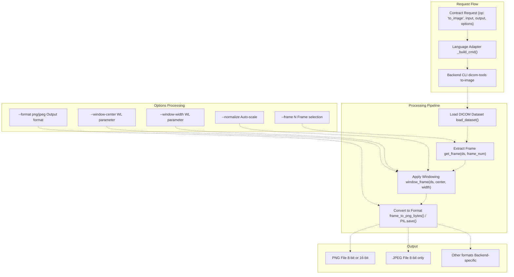
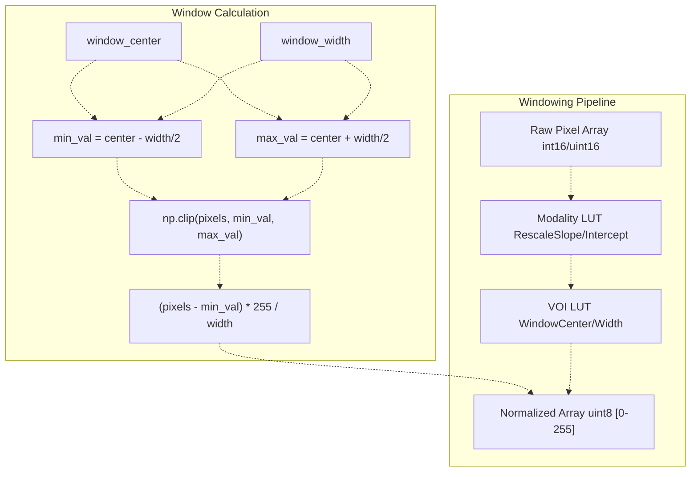
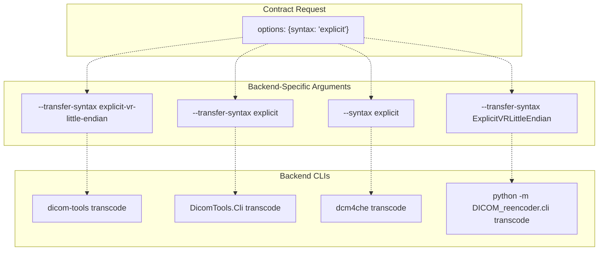
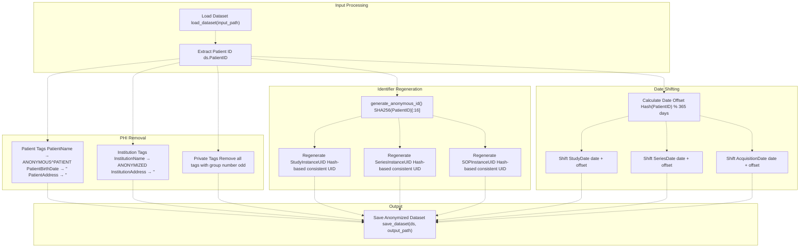

# Image Conversion and Processing

> **Relevant source files**
> * [interface/adapters/csharp_cli.py](https://github.com/ThalesMMS/Dicom-Tools/blob/c7b4cbd8/interface/adapters/csharp_cli.py)
> * [interface/adapters/java_cli.py](https://github.com/ThalesMMS/Dicom-Tools/blob/c7b4cbd8/interface/adapters/java_cli.py)
> * [interface/adapters/rust_cli.py](https://github.com/ThalesMMS/Dicom-Tools/blob/c7b4cbd8/interface/adapters/rust_cli.py)
> * [interface/tests/test_operation_specs.py](https://github.com/ThalesMMS/Dicom-Tools/blob/c7b4cbd8/interface/tests/test_operation_specs.py)
> * [python/tests/test_anonymize_dicom.py](https://github.com/ThalesMMS/Dicom-Tools/blob/c7b4cbd8/python/tests/test_anonymize_dicom.py)
> * [python/tests/test_batch_process.py](https://github.com/ThalesMMS/Dicom-Tools/blob/c7b4cbd8/python/tests/test_batch_process.py)
> * [python/tests/test_convert_to_image.py](https://github.com/ThalesMMS/Dicom-Tools/blob/c7b4cbd8/python/tests/test_convert_to_image.py)
> * [python/tests/test_core_modules.py](https://github.com/ThalesMMS/Dicom-Tools/blob/c7b4cbd8/python/tests/test_core_modules.py)
> * [python/tests/test_extract_metadata.py](https://github.com/ThalesMMS/Dicom-Tools/blob/c7b4cbd8/python/tests/test_extract_metadata.py)
> * [python/tests/test_modify_tags.py](https://github.com/ThalesMMS/Dicom-Tools/blob/c7b4cbd8/python/tests/test_modify_tags.py)
> * [python/tests/test_organize_dicom.py](https://github.com/ThalesMMS/Dicom-Tools/blob/c7b4cbd8/python/tests/test_organize_dicom.py)
> * [python/tests/test_pixel_stats.py](https://github.com/ThalesMMS/Dicom-Tools/blob/c7b4cbd8/python/tests/test_pixel_stats.py)

This page documents the image conversion and processing operations in Dicom-Tools: converting DICOM files to standard image formats (`to_image`), transcoding between transfer syntaxes (`transcode`), and anonymizing patient information (`anonymize`). These operations manipulate pixel data and file metadata while preserving or transforming the DICOM structure.

For detailed information about tag modification strategies and batch PHI removal, see [Tag Modification and Anonymization](#5.3). For statistics and validation operations that don't modify files, see [Core File Operations](#5.1).

---

## Overview

The three primary operations covered by this page are:

| Operation | Purpose | Modifies File | Output Format |
| --- | --- | --- | --- |
| `to_image` | Export DICOM pixel data to PNG/JPEG | No | PNG, JPEG, other image formats |
| `transcode` | Change transfer syntax (compression) | Yes | DICOM |
| `anonymize` | Remove PHI and regenerate UIDs | Yes | DICOM |

All three operations are implemented across multiple language backends with varying feature support. The CLI contract defines a standardized interface for these operations.

**Sources:** [interface/adapters/rust_cli.py L52-L151](https://github.com/ThalesMMS/Dicom-Tools/blob/c7b4cbd8/interface/adapters/rust_cli.py#L52-L151)

 [interface/adapters/csharp_cli.py L69-L181](https://github.com/ThalesMMS/Dicom-Tools/blob/c7b4cbd8/interface/adapters/csharp_cli.py#L69-L181)

 [interface/adapters/java_cli.py L47-L167](https://github.com/ThalesMMS/Dicom-Tools/blob/c7b4cbd8/interface/adapters/java_cli.py#L47-L167)

---

## Image Conversion Architecture



**Diagram: Image Conversion Request Flow and Processing Pipeline**

The image conversion process begins with a contract request specifying the operation, input file, and optional parameters. Each backend adapter translates this into language-specific CLI arguments. The processing pipeline extracts the requested frame, applies windowing transformations, and converts the pixel data to the target image format.

**Sources:** [interface/adapters/rust_cli.py L65-L86](https://github.com/ThalesMMS/Dicom-Tools/blob/c7b4cbd8/interface/adapters/rust_cli.py#L65-L86)

 [python/tests/test_convert_to_image.py L22-L88](https://github.com/ThalesMMS/Dicom-Tools/blob/c7b4cbd8/python/tests/test_convert_to_image.py#L22-L88)

 [python/tests/test_core_modules.py L114-L180](https://github.com/ThalesMMS/Dicom-Tools/blob/c7b4cbd8/python/tests/test_core_modules.py#L114-L180)

---

## to_image Operation

### Basic Conversion

The `to_image` operation extracts pixel data from a DICOM file and exports it to a standard image format. Each backend implements this with varying feature support:

**Python Implementation:**

```
python -m DICOM_reencoder.cli to-image input.dcm --output output.png
```

**Rust Implementation:**

```
dicom-tools to-image input.dcm --output output.png --format png
```

**C# Implementation:**

```
DicomTools.Cli to-image input.dcm --output output.png --format png
```

**Java Implementation:**

```
java -jar dcm4che-tests.jar to-image input.dcm --output output.png --format png
```

**Sources:** [interface/adapters/rust_cli.py L65-L86](https://github.com/ThalesMMS/Dicom-Tools/blob/c7b4cbd8/interface/adapters/rust_cli.py#L65-L86)

 [interface/adapters/csharp_cli.py L76-L83](https://github.com/ThalesMMS/Dicom-Tools/blob/c7b4cbd8/interface/adapters/csharp_cli.py#L76-L83)

 [interface/adapters/java_cli.py L53-L60](https://github.com/ThalesMMS/Dicom-Tools/blob/c7b4cbd8/interface/adapters/java_cli.py#L53-L60)

### Windowing and Frame Selection

The Rust backend provides the most comprehensive windowing options:

| Option | Type | Purpose |
| --- | --- | --- |
| `--frame` | Integer | Select specific frame in multiframe images |
| `--format` | String | Output format (png, jpeg, bmp, etc.) |
| `--window-center` | Float | Window level center value |
| `--window-width` | Float | Window level width value |
| `--normalize` | Flag | Auto-scale to full intensity range |
| `--disable-modality-lut` | Flag | Skip modality LUT transformation |
| `--disable-voi-lut` | Flag | Skip VOI LUT transformation |
| `--force-8bit` | Flag | Force 8-bit output |
| `--force-16bit` | Flag | Force 16-bit output |

**Example with windowing:**

```
dicom-tools to-image ct_scan.dcm --output windowed.png \
  --window-center 40 --window-width 400 --format png
```

**Sources:** [interface/adapters/rust_cli.py L65-L86](https://github.com/ThalesMMS/Dicom-Tools/blob/c7b4cbd8/interface/adapters/rust_cli.py#L65-L86)

 [interface/tests/test_operation_specs.py L16-L19](https://github.com/ThalesMMS/Dicom-Tools/blob/c7b4cbd8/interface/tests/test_operation_specs.py#L16-L19)

### Windowing Algorithm



**Diagram: Pixel Data Windowing Transformation**

The windowing process transforms raw pixel values into display-ready intensities. The modality LUT applies rescale slope and intercept, the VOI LUT applies window/level settings, and finally values are normalized to 8-bit range for image formats.

**Sources:** [python/tests/test_convert_to_image.py L22-L57](https://github.com/ThalesMMS/Dicom-Tools/blob/c7b4cbd8/python/tests/test_convert_to_image.py#L22-L57)

 [python/tests/test_core_modules.py L151-L168](https://github.com/ThalesMMS/Dicom-Tools/blob/c7b4cbd8/python/tests/test_core_modules.py#L151-L168)

### Auto-Windowing

The Python implementation includes automatic window calculation based on pixel statistics:

**Function:** `auto_window(pixel_array)` in [DICOM_reencoder/convert_to_image.py](https://github.com/ThalesMMS/Dicom-Tools/blob/c7b4cbd8/DICOM_reencoder/convert_to_image.py)

The algorithm uses percentile-based windowing:

* **Center:** Median pixel value (50th percentile)
* **Width:** Range between 5th and 95th percentiles, expanded by 20%

This approach provides good default visualization while avoiding outliers that could skew the window.

**Sources:** [python/tests/test_convert_to_image.py L59-L87](https://github.com/ThalesMMS/Dicom-Tools/blob/c7b4cbd8/python/tests/test_convert_to_image.py#L59-L87)

---

## Transcode Operation

### Transfer Syntax Conversion

The `transcode` operation changes a DICOM file's transfer syntax, typically for compression/decompression:

**Rust Implementation:**

```
dicom-tools transcode input.dcm --output output.dcm \
  --transfer-syntax explicit-vr-little-endian
```

**C# Implementation:**

```
DicomTools.Cli transcode input.dcm --output output.dcm \
  --transfer-syntax explicit
```

**Java Implementation:**

```
java -jar dcm4che-tests.jar transcode input.dcm --output output.dcm \
  --syntax explicit
```

**Sources:** [interface/adapters/rust_cli.py L88-L99](https://github.com/ThalesMMS/Dicom-Tools/blob/c7b4cbd8/interface/adapters/rust_cli.py#L88-L99)

 [interface/adapters/csharp_cli.py L84-L87](https://github.com/ThalesMMS/Dicom-Tools/blob/c7b4cbd8/interface/adapters/csharp_cli.py#L84-L87)

 [interface/adapters/java_cli.py L61-L64](https://github.com/ThalesMMS/Dicom-Tools/blob/c7b4cbd8/interface/adapters/java_cli.py#L61-L64)

### Common Transfer Syntaxes

| Syntax | UID | Purpose |
| --- | --- | --- |
| Explicit VR Little Endian | 1.2.840.10008.1.2.1 | Uncompressed, most compatible |
| Implicit VR Little Endian | 1.2.840.10008.1.2 | Uncompressed, legacy |
| JPEG Lossless | 1.2.840.10008.1.2.4.70 | Lossless compression |
| JPEG 2000 Lossless | 1.2.840.10008.1.2.4.90 | Modern lossless |
| RLE Lossless | 1.2.840.10008.1.2.5 | Run-length encoding |

### Adapter Translation Matrix



**Diagram: Transfer Syntax Option Translation Across Backends**

Each backend adapter translates the generic `syntax` option into its specific command-line format. This abstraction allows the same contract request to work across all implementations.

**Sources:** [interface/adapters/rust_cli.py L88-L99](https://github.com/ThalesMMS/Dicom-Tools/blob/c7b4cbd8/interface/adapters/rust_cli.py#L88-L99)

 [interface/adapters/csharp_cli.py L84-L87](https://github.com/ThalesMMS/Dicom-Tools/blob/c7b4cbd8/interface/adapters/csharp_cli.py#L84-L87)

 [interface/adapters/java_cli.py L61-L64](https://github.com/ThalesMMS/Dicom-Tools/blob/c7b4cbd8/interface/adapters/java_cli.py#L61-L64)

---

## Anonymize Operation

### Basic Anonymization

The `anonymize` operation removes Protected Health Information (PHI) and regenerates identifiers:

**All Backends:**

```
<backend-cli> anonymize input.dcm --output anonymized.dcm
```

### Anonymization Process



**Diagram: Anonymization Process Flow**

Anonymization is a multi-stage process that removes PHI, regenerates identifiers consistently based on hashing, shifts dates by a consistent offset, and removes private tags. The hash-based approach ensures that files from the same patient/study are anonymized consistently.

**Sources:** [python/tests/test_anonymize_dicom.py L21-L269](https://github.com/ThalesMMS/Dicom-Tools/blob/c7b4cbd8/python/tests/test_anonymize_dicom.py#L21-L269)

 [interface/adapters/rust_cli.py L61-L63](https://github.com/ThalesMMS/Dicom-Tools/blob/c7b4cbd8/interface/adapters/rust_cli.py#L61-L63)

### UID Regeneration Strategy

The Python implementation uses deterministic UID generation based on hashing:

**Function:** `generate_anonymous_id(original_id)` in [DICOM_reencoder/anonymize_dicom.py](https://github.com/ThalesMMS/Dicom-Tools/blob/c7b4cbd8/DICOM_reencoder/anonymize_dicom.py)

**Algorithm:**

1. Compute SHA256 hash of the original patient ID
2. Take first 16 hexadecimal characters as anonymous ID
3. Generate UIDs using pydicom's `generate_uid()` with consistent prefix

This ensures:

* **Consistency:** Same patient always gets same anonymous ID
* **Uniqueness:** Different patients get different anonymous IDs
* **Irreversibility:** Cannot derive original ID from anonymous ID
* **Linkability:** Files from same patient/study remain linked

**Sources:** [python/tests/test_anonymize_dicom.py L21-L46](https://github.com/ThalesMMS/Dicom-Tools/blob/c7b4cbd8/python/tests/test_anonymize_dicom.py#L21-L46)

 [python/tests/test_anonymize_dicom.py L106-L154](https://github.com/ThalesMMS/Dicom-Tools/blob/c7b4cbd8/python/tests/test_anonymize_dicom.py#L106-L154)

### Date Shifting

Date shifting maintains temporal relationships while preventing identification:

**Algorithm:**

1. Hash patient ID to generate consistent offset (0-365 days)
2. Apply offset to all date tags (StudyDate, SeriesDate, AcquisitionDate)
3. Preserve time intervals between dates

**Example:**

* Original StudyDate: 20231115
* Patient ID hash: 0x3A7F... → offset = 127 days
* Shifted StudyDate: 20240321 (115 days + 127 day offset)

**Sources:** [python/tests/test_anonymize_dicom.py L156-L199](https://github.com/ThalesMMS/Dicom-Tools/blob/c7b4cbd8/python/tests/test_anonymize_dicom.py#L156-L199)

### Private Tag Removal

Private tags (odd group numbers like 0x0009, 0x0011) often contain vendor-specific PHI:

**Implementation:**

```
# Remove all tags with odd group numberfor tag in list(ds.keys()):    if tag.group % 2 == 1:  # Odd group = private        del ds[tag]
```

**Sources:** [python/tests/test_anonymize_dicom.py L201-L218](https://github.com/ThalesMMS/Dicom-Tools/blob/c7b4cbd8/python/tests/test_anonymize_dicom.py#L201-L218)

---

## Pixel Statistics and Histogram

### Statistics Calculation

The `stats` operation computes comprehensive pixel statistics:

**Computed Metrics:**

| Metric | Description |
| --- | --- |
| `min` | Minimum pixel value |
| `max` | Maximum pixel value |
| `mean` | Average pixel value |
| `median` | Median pixel value (50th percentile) |
| `std` | Standard deviation |
| `range` | max - min |
| `iqr` | Interquartile range (p75 - p25) |
| `p1`, `p5`, `p25`, `p75`, `p95`, `p99` | Percentile values |
| `zero_pixels` | Count of zero-valued pixels |
| `zero_percent` | Percentage of zero pixels |
| `unique_values` | Number of unique intensity values |
| `total_pixels` | Total pixel count |

**Function:** `calculate_statistics(pixel_array)` in [DICOM_reencoder/core/images.py](https://github.com/ThalesMMS/Dicom-Tools/blob/c7b4cbd8/DICOM_reencoder/core/images.py)

**Sources:** [python/tests/test_pixel_stats.py L20-L85](https://github.com/ThalesMMS/Dicom-Tools/blob/c7b4cbd8/python/tests/test_pixel_stats.py#L20-L85)

 [python/tests/test_core_modules.py L114-L180](https://github.com/ThalesMMS/Dicom-Tools/blob/c7b4cbd8/python/tests/test_core_modules.py#L114-L180)

### Histogram Generation

The `histogram` operation computes intensity distribution:

**Rust Implementation:**

```
dicom-tools histogram input.dcm --bins 256
```

**C# Implementation:**

```
DicomTools.Cli histogram input.dcm --bins 256 --json
```

**Java Implementation:**

```
java -jar dcm4che-tests.jar stats input.dcm --bins 256 --json
```

The histogram output includes:

* Array of bin counts
* Bin edges (intensity ranges)
* Statistical summary (min, max, mean, std)

**Sources:** [interface/adapters/rust_cli.py L122-L126](https://github.com/ThalesMMS/Dicom-Tools/blob/c7b4cbd8/interface/adapters/rust_cli.py#L122-L126)

 [interface/adapters/csharp_cli.py L109-L114](https://github.com/ThalesMMS/Dicom-Tools/blob/c7b4cbd8/interface/adapters/csharp_cli.py#L109-L114)

 [interface/adapters/java_cli.py L98-L102](https://github.com/ThalesMMS/Dicom-Tools/blob/c7b4cbd8/interface/adapters/java_cli.py#L98-L102)

---

## Cross-Backend Feature Matrix

### Operation Support

| Operation | Python | Rust | C++ | C# | Java |
| --- | --- | --- | --- | --- | --- |
| **to_image** | ✓ | ✓ | ✓ | ✓ | ✓ |
| Frame selection | ✓ | ✓ | ✓ | ✓ | ✓ |
| Format options | ✓ | ✓ | ✓ | ✓ | ✓ |
| Custom windowing | ✓ | ✓ | ✗ | ✗ | ✗ |
| Auto-windowing | ✓ | ✗ | ✗ | ✗ | ✗ |
| LUT control | ✗ | ✓ | ✗ | ✗ | ✗ |
| Bit depth control | ✗ | ✓ | ✗ | ✗ | ✗ |
| **transcode** | ✓ | ✓ | ✓ | ✓ | ✓ |
| All transfer syntaxes | ✓ | ✓ | ✓ | ✓ | ✓ |
| **anonymize** | ✓ | ✓ | ✓ | ✓ | ✓ |
| PHI removal | ✓ | ✓ | ✓ | ✓ | ✓ |
| UID regeneration | ✓ | ✓ | ✓ | ✓ | ✓ |
| Date shifting | ✓ | ✗ | ✗ | ✗ | ✗ |
| Custom prefix | ✓ | ✗ | ✗ | ✗ | ✗ |
| **stats** | ✓ | ✓ | ✓ | ✓ | ✓ |
| Percentiles | ✓ | ✓ | ✓ | ✓ | ✓ |
| JSON output | ✓ | ✓ | ✓ | ✓ | ✓ |
| **histogram** | ✓ | ✓ | ✓ | ✓ | ✓ |
| Configurable bins | ✓ | ✓ | ✓ | ✓ | ✓ |

### Format Support by Backend

**Image Formats (to_image):**

* **Python:** PNG, JPEG, BMP, TIFF (via PIL)
* **Rust:** PNG, JPEG, BMP, GIF, ICO, TIFF (via image crate)
* **C++:** PNG, JPEG, BMP (via GDCM/ITK)
* **C#:** PNG, JPEG, BMP (via fo-dicom)
* **Java:** PNG, JPEG, BMP (via dcm4che3)

**Transfer Syntaxes (transcode):**
All backends support standard DICOM transfer syntaxes including:

* Explicit/Implicit VR Little Endian
* JPEG Baseline, Extended, Lossless
* JPEG 2000 Lossless/Lossy
* RLE Lossless
* JPEG-LS (backend-dependent)

**Sources:** [interface/adapters/rust_cli.py L52-L151](https://github.com/ThalesMMS/Dicom-Tools/blob/c7b4cbd8/interface/adapters/rust_cli.py#L52-L151)

 [interface/adapters/csharp_cli.py L69-L181](https://github.com/ThalesMMS/Dicom-Tools/blob/c7b4cbd8/interface/adapters/csharp_cli.py#L69-L181)

 [interface/adapters/java_cli.py L47-L167](https://github.com/ThalesMMS/Dicom-Tools/blob/c7b4cbd8/interface/adapters/java_cli.py#L47-L167)

---

## Multiframe and Multi-Instance Support

### Frame Selection

All backends support frame selection for multiframe DICOM images:

**Syntax:**

```
<backend-cli> to-image multiframe.dcm --output frame5.png --frame 5
```

**Frame Indexing:**

* Zero-based indexing (first frame = 0)
* Out-of-range errors handled gracefully
* Default: frame 0 if not specified

**Implementation:** `get_frame(ds, frame_number)` in [DICOM_reencoder/core/images.py](https://github.com/ThalesMMS/Dicom-Tools/blob/c7b4cbd8/DICOM_reencoder/core/images.py)

**Sources:** [python/tests/test_core_modules.py L125-L149](https://github.com/ThalesMMS/Dicom-Tools/blob/c7b4cbd8/python/tests/test_core_modules.py#L125-L149)

 [python/tests/test_convert_to_image.py L131-L143](https://github.com/ThalesMMS/Dicom-Tools/blob/c7b4cbd8/python/tests/test_convert_to_image.py#L131-L143)

### Batch Processing Integration

For processing multiple files or all frames in a multiframe image, see [Batch Processing](#5.6).

**Sources:** [python/tests/test_batch_process.py L156-L189](https://github.com/ThalesMMS/Dicom-Tools/blob/c7b4cbd8/python/tests/test_batch_process.py#L156-L189)

---

## Implementation Details

### Python Core Functions

Key functions in the Python implementation:

| Function | Module | Purpose |
| --- | --- | --- |
| `convert_dicom_to_image()` | DICOM_reencoder.convert_to_image | Main conversion entry point |
| `apply_windowing()` | DICOM_reencoder.convert_to_image | Apply window/level transformation |
| `auto_window()` | DICOM_reencoder.convert_to_image | Calculate automatic window |
| `window_frame()` | DICOM_reencoder.core.images | Window a single frame |
| `frame_to_png_bytes()` | DICOM_reencoder.core.images | Convert frame to PNG bytes |
| `get_frame()` | DICOM_reencoder.core.images | Extract specific frame |
| `calculate_statistics()` | DICOM_reencoder.core.images | Compute pixel statistics |
| `anonymize_dicom()` | DICOM_reencoder.anonymize_dicom | Main anonymization entry point |
| `generate_anonymous_id()` | DICOM_reencoder.anonymize_dicom | Generate consistent anonymous ID |

**Sources:** [python/tests/test_convert_to_image.py L1-L185](https://github.com/ThalesMMS/Dicom-Tools/blob/c7b4cbd8/python/tests/test_convert_to_image.py#L1-L185)

 [python/tests/test_core_modules.py L114-L180](https://github.com/ThalesMMS/Dicom-Tools/blob/c7b4cbd8/python/tests/test_core_modules.py#L114-L180)

 [python/tests/test_anonymize_dicom.py L1-L327](https://github.com/ThalesMMS/Dicom-Tools/blob/c7b4cbd8/python/tests/test_anonymize_dicom.py#L1-L327)

### Adapter Command Building

Each adapter implements `_build_cmd()` to translate contract requests into CLI arguments:

**Rust Adapter Pattern:**

```
def _build_cmd(self, op: str, input_path: str, output: str | None, options: Dict[str, Any]) -> List[str] | None:    if op == "to_image":        inferred_output = output or self._infer_output(input_path, suffix=".png")        cmd = [*self.base_cmd, "to-image", input_path, "--output", inferred_output]        if options.get("format"):            cmd.extend(["--format", str(options["format"])])        if options.get("frame") is not None:            cmd.extend(["--frame", str(options["frame"])])        # ... additional options        return cmd
```

**Sources:** [interface/adapters/rust_cli.py L52-L151](https://github.com/ThalesMMS/Dicom-Tools/blob/c7b4cbd8/interface/adapters/rust_cli.py#L52-L151)

 [interface/adapters/csharp_cli.py L69-L181](https://github.com/ThalesMMS/Dicom-Tools/blob/c7b4cbd8/interface/adapters/csharp_cli.py#L69-L181)

 [interface/adapters/java_cli.py L47-L167](https://github.com/ThalesMMS/Dicom-Tools/blob/c7b4cbd8/interface/adapters/java_cli.py#L47-L167)

---

## Error Handling

### Common Failure Modes

| Error | Cause | Handling |
| --- | --- | --- |
| Missing pixel data | DICOM file has no PixelData tag | Return None or error message |
| Invalid frame index | Frame number exceeds NumberOfFrames | Raise IndexError |
| Unsupported transfer syntax | Backend cannot decode compression | Return error, suggest transcode |
| Invalid window parameters | Window width ≤ 0 | Use auto-windowing or default |
| Format not supported | Requested output format unavailable | Fall back to PNG |

### Graceful Degradation

When optional features are unavailable:

1. **Windowing:** Fall back to auto-windowing or no windowing
2. **Format:** Default to PNG if requested format unsupported
3. **Frame:** Default to frame 0 if multiframe detection fails

**Sources:** [python/tests/test_convert_to_image.py L144-L165](https://github.com/ThalesMMS/Dicom-Tools/blob/c7b4cbd8/python/tests/test_convert_to_image.py#L144-L165)

 [python/tests/test_core_modules.py L139-L149](https://github.com/ThalesMMS/Dicom-Tools/blob/c7b4cbd8/python/tests/test_core_modules.py#L139-L149)

Refresh this wiki

Last indexed: 5 January 2026 ([c7b4cb](https://github.com/ThalesMMS/Dicom-Tools/commit/c7b4cbd8))

### On this page

* [Image Conversion and Processing](#5.2-image-conversion-and-processing)
* [Overview](#5.2-overview)
* [Image Conversion Architecture](#5.2-image-conversion-architecture)
* [to_image Operation](#5.2-to_image-operation)
* [Basic Conversion](#5.2-basic-conversion)
* [Windowing and Frame Selection](#5.2-windowing-and-frame-selection)
* [Windowing Algorithm](#5.2-windowing-algorithm)
* [Auto-Windowing](#5.2-auto-windowing)
* [Transcode Operation](#5.2-transcode-operation)
* [Transfer Syntax Conversion](#5.2-transfer-syntax-conversion)
* [Common Transfer Syntaxes](#5.2-common-transfer-syntaxes)
* [Adapter Translation Matrix](#5.2-adapter-translation-matrix)
* [Anonymize Operation](#5.2-anonymize-operation)
* [Basic Anonymization](#5.2-basic-anonymization)
* [Anonymization Process](#5.2-anonymization-process)
* [UID Regeneration Strategy](#5.2-uid-regeneration-strategy)
* [Date Shifting](#5.2-date-shifting)
* [Private Tag Removal](#5.2-private-tag-removal)
* [Pixel Statistics and Histogram](#5.2-pixel-statistics-and-histogram)
* [Statistics Calculation](#5.2-statistics-calculation)
* [Histogram Generation](#5.2-histogram-generation)
* [Cross-Backend Feature Matrix](#5.2-cross-backend-feature-matrix)
* [Operation Support](#5.2-operation-support)
* [Format Support by Backend](#5.2-format-support-by-backend)
* [Multiframe and Multi-Instance Support](#5.2-multiframe-and-multi-instance-support)
* [Frame Selection](#5.2-frame-selection)
* [Batch Processing Integration](#5.2-batch-processing-integration)
* [Implementation Details](#5.2-implementation-details)
* [Python Core Functions](#5.2-python-core-functions)
* [Adapter Command Building](#5.2-adapter-command-building)
* [Error Handling](#5.2-error-handling)
* [Common Failure Modes](#5.2-common-failure-modes)
* [Graceful Degradation](#5.2-graceful-degradation)

Ask Devin about Dicom-Tools