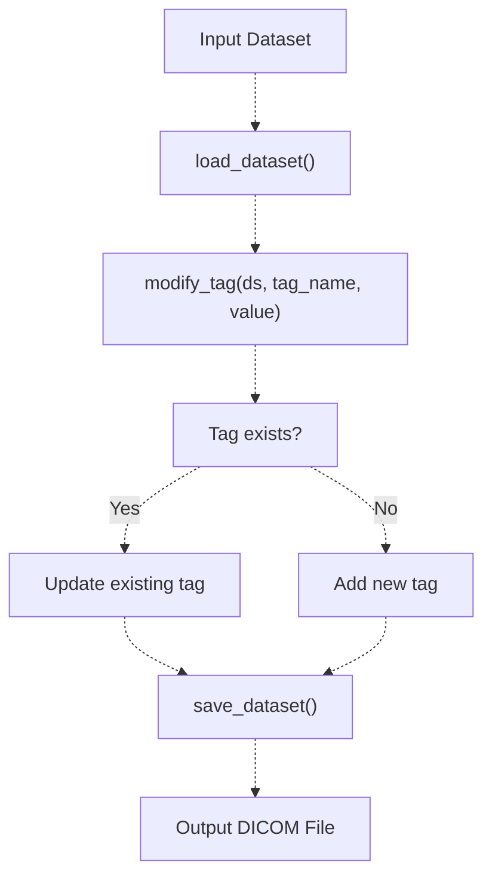
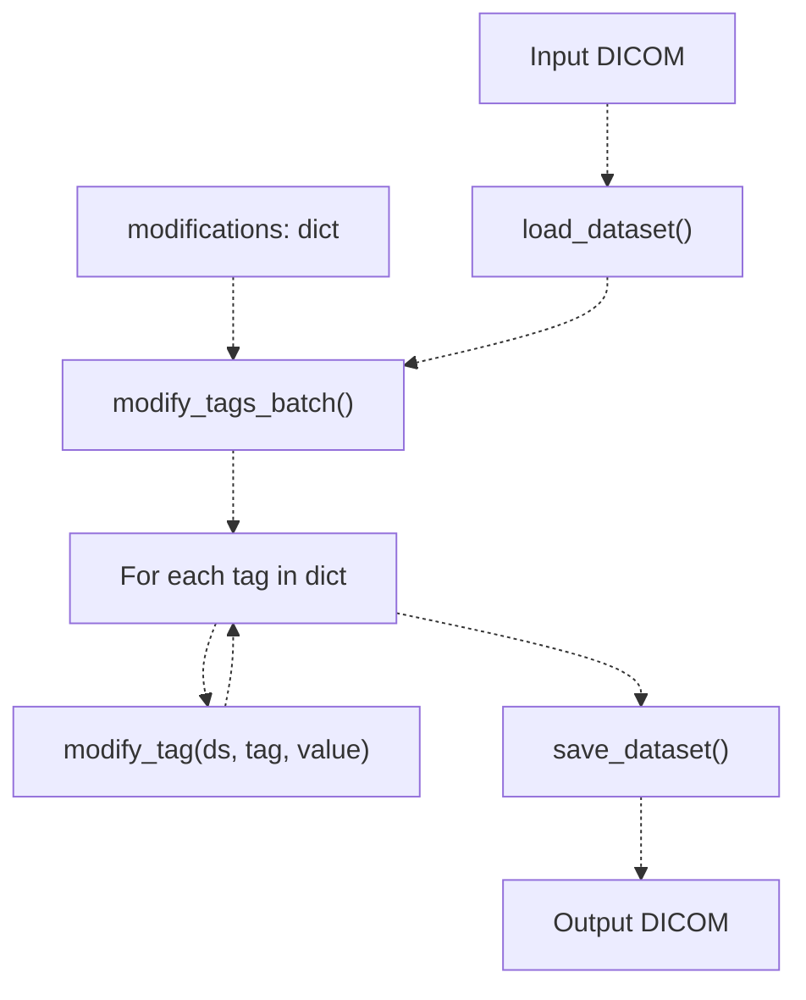
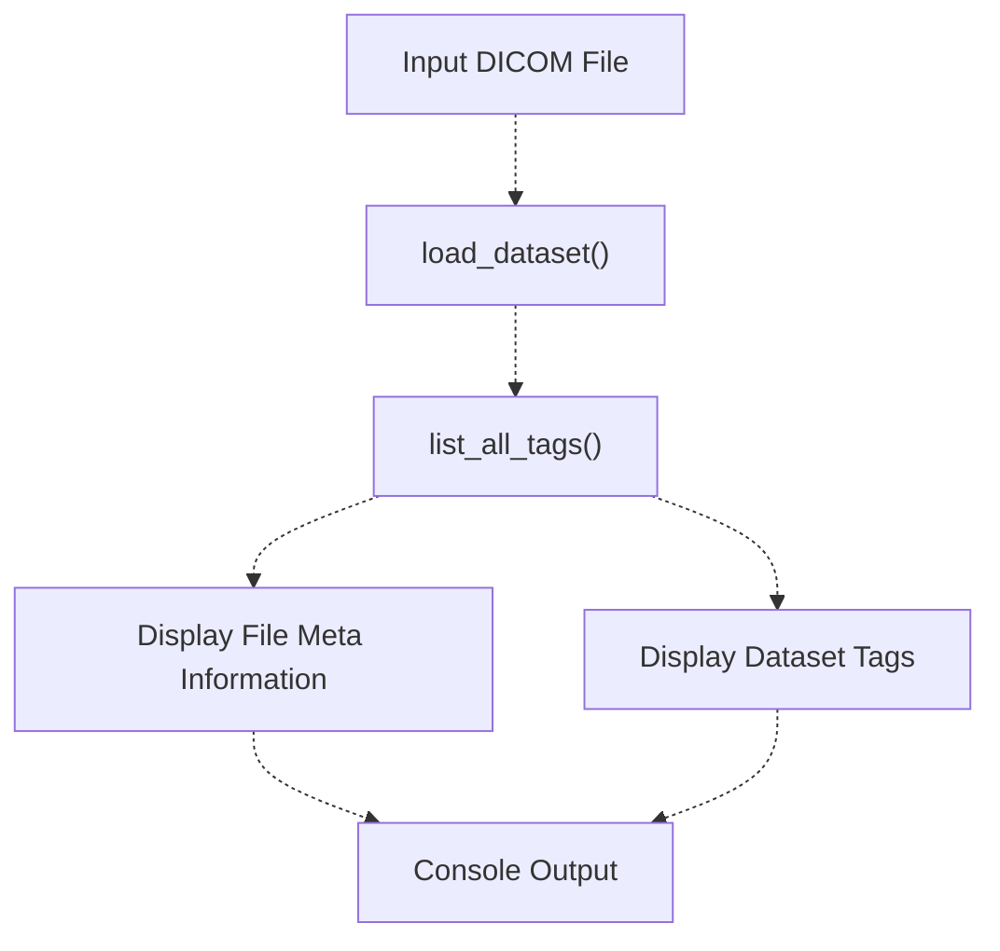
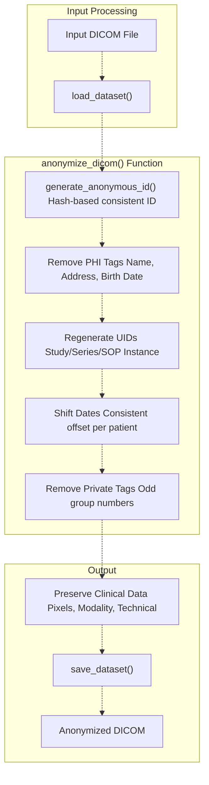
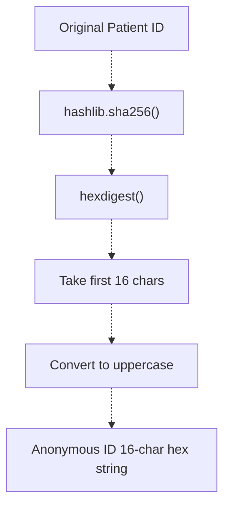
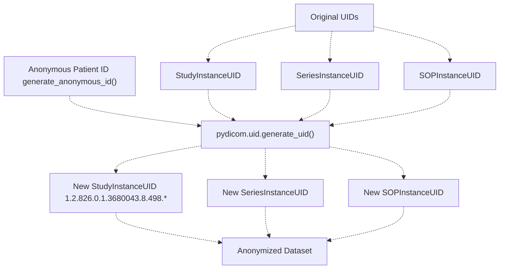
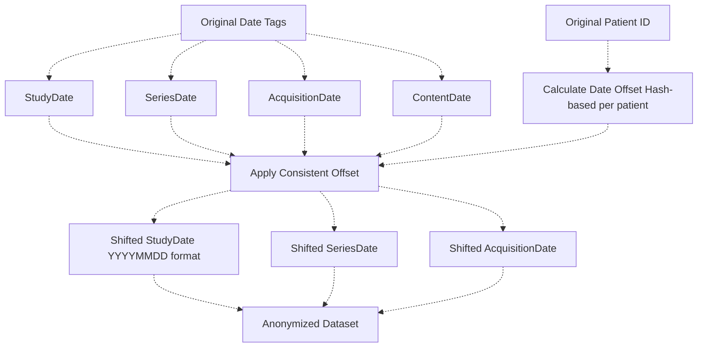
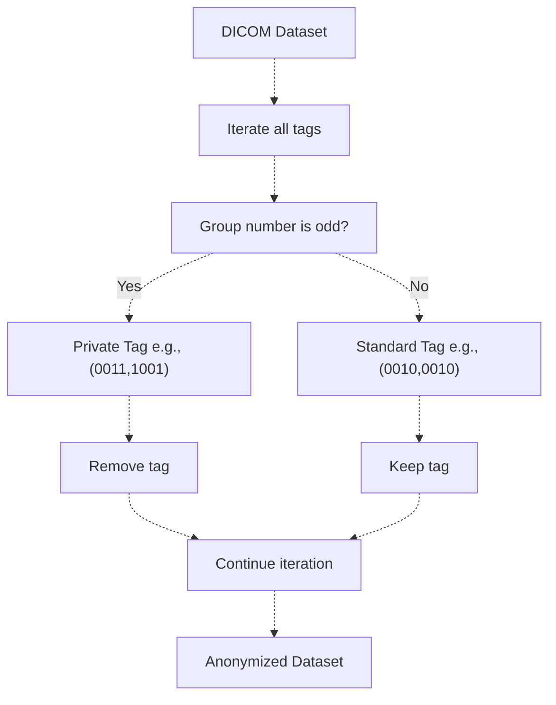
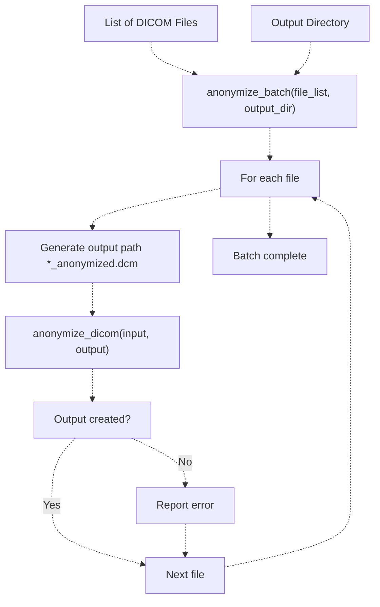

# 5c Tag Modification and Anonymization

> **Relevant source files**
> * [python/tests/test_anonymize_dicom.py](https://github.com/ThalesMMS/Dicom-Tools/blob/c7b4cbd8/python/tests/test_anonymize_dicom.py)
> * [python/tests/test_batch_process.py](https://github.com/ThalesMMS/Dicom-Tools/blob/c7b4cbd8/python/tests/test_batch_process.py)
> * [python/tests/test_convert_to_image.py](https://github.com/ThalesMMS/Dicom-Tools/blob/c7b4cbd8/python/tests/test_convert_to_image.py)
> * [python/tests/test_core_modules.py](https://github.com/ThalesMMS/Dicom-Tools/blob/c7b4cbd8/python/tests/test_core_modules.py)
> * [python/tests/test_extract_metadata.py](https://github.com/ThalesMMS/Dicom-Tools/blob/c7b4cbd8/python/tests/test_extract_metadata.py)
> * [python/tests/test_modify_tags.py](https://github.com/ThalesMMS/Dicom-Tools/blob/c7b4cbd8/python/tests/test_modify_tags.py)
> * [python/tests/test_organize_dicom.py](https://github.com/ThalesMMS/Dicom-Tools/blob/c7b4cbd8/python/tests/test_organize_dicom.py)
> * [python/tests/test_pixel_stats.py](https://github.com/ThalesMMS/Dicom-Tools/blob/c7b4cbd8/python/tests/test_pixel_stats.py)

This page covers DICOM tag modification and anonymization operations. Tag modification allows editing individual or multiple DICOM tags, while anonymization provides systematic removal of Protected Health Information (PHI) with UID regeneration and date shifting. For general file inspection and validation, see [Core File Operations](5a%20Core-File-Operations.md). For pixel data processing, see [Image Conversion and Processing](5b%20Image-Conversion-and-Processing.md). For batch processing of multiple files, see [Batch Processing](5f%20Batch-Processing.md).

**Sources:** [python/tests/test_modify_tags.py L1-L219](https://github.com/ThalesMMS/Dicom-Tools/blob/c7b4cbd8/python/tests/test_modify_tags.py#L1-L219)

 [python/tests/test_anonymize_dicom.py L1-L328](https://github.com/ThalesMMS/Dicom-Tools/blob/c7b4cbd8/python/tests/test_anonymize_dicom.py#L1-L328)

## Tag Modification Operations

The Python backend provides comprehensive tag modification capabilities through the `DICOM_reencoder.modify_tags` module. Tags can be modified individually or in batches, with support for all DICOM Value Representations (VRs).

### Single Tag Modification

The `modify_tag()` function modifies or adds individual DICOM tags in a dataset:



**Sources:** [python/tests/test_modify_tags.py L19-L60](https://github.com/ThalesMMS/Dicom-Tools/blob/c7b4cbd8/python/tests/test_modify_tags.py#L19-L60)

**Function Signature:**

```
modify_tag(ds: Dataset, tag_name: str, value: Any) -> bool
```

The function accepts both existing and new tags. Common tag types include:

| Tag Category | Example Tags | Value Type |
| --- | --- | --- |
| Patient Info | `PatientName`, `PatientID`, `PatientBirthDate` | String, DA |
| Study Info | `StudyDescription`, `StudyDate`, `StudyInstanceUID` | String, DA, UI |
| Series Info | `SeriesDescription`, `Modality`, `SeriesNumber` | String, CS, IS |
| Image Info | `InstanceNumber`, `SliceThickness`, `KVP` | IS, DS, DS |
| Custom | `PatientComments`, any valid DICOM tag | Various |

**Sources:** [python/tests/test_modify_tags.py L22-L60](https://github.com/ThalesMMS/Dicom-Tools/blob/c7b4cbd8/python/tests/test_modify_tags.py#L22-L60)

### Batch Tag Modification

The `modify_tags_batch()` function applies multiple tag modifications in a single operation:



**Sources:** [python/tests/test_modify_tags.py L62-L114](https://github.com/ThalesMMS/Dicom-Tools/blob/c7b4cbd8/python/tests/test_modify_tags.py#L62-L114)

**Function Signature:**

```
modify_tags_batch(input_path: str, modifications: dict, output_path: str) -> Dataset
```

Example usage:

```
modifications = {    "PatientName": "Batch^Patient",    "PatientID": "BATCH-001",    "StudyDescription": "Batch Study"}modify_tags_batch(input_file, modifications, output_file)
```

The function preserves pixel data and all unmodified tags while applying the requested changes.

**Sources:** [python/tests/test_modify_tags.py L65-L102](https://github.com/ThalesMMS/Dicom-Tools/blob/c7b4cbd8/python/tests/test_modify_tags.py#L65-L102)

### Tag Listing

The `list_all_tags()` function displays all tags in a DICOM file:



**Sources:** [python/tests/test_modify_tags.py L116-L155](https://github.com/ThalesMMS/Dicom-Tools/blob/c7b4cbd8/python/tests/test_modify_tags.py#L116-L155)

**Function Signature:**

```
list_all_tags(input_path: str) -> None
```

The output includes both file meta information (transfer syntax, SOP class) and dataset tags (patient, study, series, image information).

**Sources:** [python/tests/test_modify_tags.py L119-L143](https://github.com/ThalesMMS/Dicom-Tools/blob/c7b4cbd8/python/tests/test_modify_tags.py#L119-L143)

## Anonymization Operations

Anonymization systematically removes PHI while preserving clinical data integrity. The `DICOM_reencoder.anonymize_dicom` module implements comprehensive anonymization following DICOM PS3.15 guidelines.

### Anonymization Architecture



**Sources:** [python/tests/test_anonymize_dicom.py L1-L328](https://github.com/ThalesMMS/Dicom-Tools/blob/c7b4cbd8/python/tests/test_anonymize_dicom.py#L1-L328)

### PHI Removal Strategy

The anonymization process removes or replaces the following PHI elements:

| Tag Category | Action | Result |
| --- | --- | --- |
| Patient Name | Replace | `"ANONYMOUS^PATIENT"` |
| Patient ID | Replace | `"ANON_" + hash(original_id)[:16]` |
| Patient Birth Date | Remove | Empty string |
| Patient Address | Remove | Empty string |
| Patient Telephone | Remove | Empty string |
| Patient Age | Remove | Empty string |
| Institution Name | Replace | `"ANONYMIZED"` |
| Institution Address | Remove | Empty string |
| Referring Physician | Replace | `"ANONYMIZED"` |
| Performing Physician | Replace | `"ANONYMIZED"` |

**Sources:** [python/tests/test_anonymize_dicom.py L48-L103](https://github.com/ThalesMMS/Dicom-Tools/blob/c7b4cbd8/python/tests/test_anonymize_dicom.py#L48-L103)

**Function Signature:**

```
anonymize_dicom(input_path: str, output_path: str, patient_prefix: str = "ANON") -> str
```

### Anonymous ID Generation

The `generate_anonymous_id()` function creates consistent, deterministic anonymous identifiers:



**Sources:** [python/tests/test_anonymize_dicom.py L21-L46](https://github.com/ThalesMMS/Dicom-Tools/blob/c7b4cbd8/python/tests/test_anonymize_dicom.py#L21-L46)

**Key Properties:**

* **Consistency:** Same input always produces same output
* **Uniqueness:** Different inputs produce different outputs (cryptographic hash)
* **Format:** 16-character hexadecimal string (uppercase)
* **Irreversibility:** Cannot reverse to original ID

**Sources:** [python/tests/test_anonymize_dicom.py L24-L46](https://github.com/ThalesMMS/Dicom-Tools/blob/c7b4cbd8/python/tests/test_anonymize_dicom.py#L24-L46)

### UID Regeneration

All UIDs are regenerated to prevent linking to original studies:



**Sources:** [python/tests/test_anonymize_dicom.py L105-L154](https://github.com/ThalesMMS/Dicom-Tools/blob/c7b4cbd8/python/tests/test_anonymize_dicom.py#L105-L154)

**UID Regeneration Properties:**

* **Consistency:** Files from the same original study/series receive consistent new UIDs
* **Uniqueness:** Each anonymization session generates new UIDs
* **DICOM Compliance:** Generated UIDs follow pydicom UID root (1.2.826.0.1.3680043.8.498)
* **Relationship Preservation:** Study/series hierarchy is maintained

**Sources:** [python/tests/test_anonymize_dicom.py L108-L154](https://github.com/ThalesMMS/Dicom-Tools/blob/c7b4cbd8/python/tests/test_anonymize_dicom.py#L108-L154)

### Date Shifting

Date tags are shifted by a consistent offset per patient to preserve temporal relationships:



**Sources:** [python/tests/test_anonymize_dicom.py L156-L199](https://github.com/ThalesMMS/Dicom-Tools/blob/c7b4cbd8/python/tests/test_anonymize_dicom.py#L156-L199)

**Date Shifting Properties:**

* **Consistency:** All dates for the same patient are shifted by the same offset
* **Temporal Relationships:** Time intervals between studies/series are preserved
* **Format Preservation:** DICOM date format (YYYYMMDD) is maintained
* **Deterministic:** Same patient ID always produces the same date shift

Example:

```python
Original StudyDate: 20230115
Date offset: -1234 days (derived from patient ID hash)
Shifted StudyDate: 20190627
```

**Sources:** [python/tests/test_anonymize_dicom.py L159-L199](https://github.com/ThalesMMS/Dicom-Tools/blob/c7b4cbd8/python/tests/test_anonymize_dicom.py#L159-L199)

### Private Tag Removal

Private tags (with odd group numbers) are removed during anonymization:



**Sources:** [python/tests/test_anonymize_dicom.py L201-L218](https://github.com/ThalesMMS/Dicom-Tools/blob/c7b4cbd8/python/tests/test_anonymize_dicom.py#L201-L218)

Private tags may contain vendor-specific patient information and are removed to ensure complete anonymization. Standard DICOM tags (even group numbers) are processed according to the PHI removal strategy.

**Sources:** [python/tests/test_anonymize_dicom.py L204-L218](https://github.com/ThalesMMS/Dicom-Tools/blob/c7b4cbd8/python/tests/test_anonymize_dicom.py#L204-L218)

### Data Preservation

Critical clinical data is preserved during anonymization:

| Preserved Data | Rationale |
| --- | --- |
| Pixel Data | Clinical image content |
| Image Dimensions (Rows, Columns) | Geometric properties |
| Modality | Imaging technique |
| Bits Allocated/Stored | Pixel representation |
| Transfer Syntax UID | Encoding format |
| Technical Parameters (KVP, Slice Thickness, etc.) | Scan parameters |
| Window/Level Settings | Display recommendations |
| Photometric Interpretation | Color space |

**Sources:** [python/tests/test_anonymize_dicom.py L220-L269](https://github.com/ThalesMMS/Dicom-Tools/blob/c7b4cbd8/python/tests/test_anonymize_dicom.py#L220-L269)

**Verification Example:**

```
# Load original and anonymized datasetsoriginal = load_dataset(original_path)anonymized = load_dataset(anonymized_path)# Verify preservationassert anonymized.pixel_array.shape == original.pixel_array.shapeassert anonymized.Modality == original.Modalityassert anonymized.Rows == original.Rowsassert anonymized.Columns == original.Columns
```

**Sources:** [python/tests/test_anonymize_dicom.py L223-L269](https://github.com/ThalesMMS/Dicom-Tools/blob/c7b4cbd8/python/tests/test_anonymize_dicom.py#L223-L269)

## Batch Anonymization

The `anonymize_batch()` function processes multiple DICOM files with consistent anonymization:



**Sources:** [python/tests/test_batch_process.py L108-L154](https://github.com/ThalesMMS/Dicom-Tools/blob/c7b4cbd8/python/tests/test_batch_process.py#L108-L154)

**Function Signature:**

```
anonymize_batch(file_list: List[str], output_dir: Optional[str] = None) -> None
```

**Batch Properties:**

* **Consistency:** All files from the same patient receive consistent anonymous IDs
* **Error Handling:** Individual file errors don't stop batch processing
* **Output Naming:** Files are suffixed with `_anonymized.dcm`
* **Series Preservation:** Files from the same series maintain relationships

**Sources:** [python/tests/test_batch_process.py L111-L154](https://github.com/ThalesMMS/Dicom-Tools/blob/c7b4cbd8/python/tests/test_batch_process.py#L111-L154)

## Edge Cases and Error Handling

The implementation handles various edge cases:

| Scenario | Behavior |
| --- | --- |
| Missing Patient ID | Uses fallback or generates from other identifiers |
| Missing Date Tags | Skips date shifting for missing tags |
| No Pixel Data | Anonymizes metadata only |
| Invalid Tag Names | Skips invalid tags in batch operations |
| Multiframe Images | Anonymizes while preserving all frames |
| Custom Patient Prefix | Supports configurable prefix via `patient_prefix` parameter |

**Sources:** [python/tests/test_anonymize_dicom.py L271-L328](https://github.com/ThalesMMS/Dicom-Tools/blob/c7b4cbd8/python/tests/test_anonymize_dicom.py#L271-L328)

 [python/tests/test_modify_tags.py L157-L218](https://github.com/ThalesMMS/Dicom-Tools/blob/c7b4cbd8/python/tests/test_modify_tags.py#L157-L218)

**Custom Prefix Example:**

```
anonymize_dicom(input_path, output_path, patient_prefix="CUSTOM")# Results in PatientID: "CUSTOM_" + hash
```

**Sources:** [python/tests/test_anonymize_dicom.py L305-L311](https://github.com/ThalesMMS/Dicom-Tools/blob/c7b4cbd8/python/tests/test_anonymize_dicom.py#L305-L311)

## Implementation Files

The tag modification and anonymization functionality is primarily implemented in the Python backend:

| Module | Purpose | Key Functions |
| --- | --- | --- |
| `DICOM_reencoder.modify_tags` | Tag editing | `modify_tag()`, `modify_tags_batch()`, `list_all_tags()` |
| `DICOM_reencoder.anonymize_dicom` | Anonymization | `anonymize_dicom()`, `generate_anonymous_id()` |
| `DICOM_reencoder.batch_process` | Batch operations | `anonymize_batch()` |
| `DICOM_reencoder.core.datasets` | Dataset I/O | `load_dataset()`, `save_dataset()` |

**Sources:** [python/tests/test_modify_tags.py L1-L16](https://github.com/ThalesMMS/Dicom-Tools/blob/c7b4cbd8/python/tests/test_modify_tags.py#L1-L16)

 [python/tests/test_anonymize_dicom.py L1-L18](https://github.com/ThalesMMS/Dicom-Tools/blob/c7b4cbd8/python/tests/test_anonymize_dicom.py#L1-L18)

 [python/tests/test_batch_process.py L1-L21](https://github.com/ThalesMMS/Dicom-Tools/blob/c7b4cbd8/python/tests/test_batch_process.py#L1-L21)


### On this page

* [Tag Modification and Anonymization](#5.3-tag-modification-and-anonymization)
* [Tag Modification Operations](#5.3-tag-modification-operations)
* [Single Tag Modification](#5.3-single-tag-modification)
* [Batch Tag Modification](#5.3-batch-tag-modification)
* [Tag Listing](#5.3-tag-listing)
* [Anonymization Operations](#5.3-anonymization-operations)
* [Anonymization Architecture](#5.3-anonymization-architecture)
* [PHI Removal Strategy](#5.3-phi-removal-strategy)
* [Anonymous ID Generation](#5.3-anonymous-id-generation)
* [UID Regeneration](#5.3-uid-regeneration)
* [Date Shifting](#5.3-date-shifting)
* [Private Tag Removal](#5.3-private-tag-removal)
* [Data Preservation](#5.3-data-preservation)
* [Batch Anonymization](#5.3-batch-anonymization)
* [Edge Cases and Error Handling](#5.3-edge-cases-and-error-handling)
* [Implementation Files](#5.3-implementation-files)

Ask Devin about Dicom-Tools