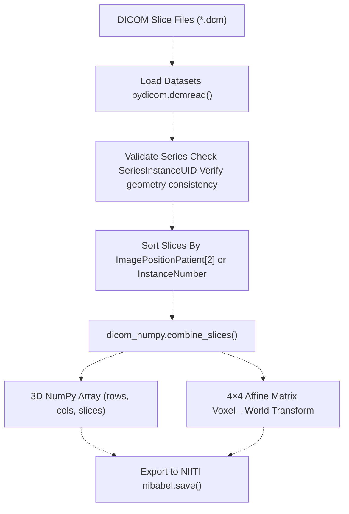
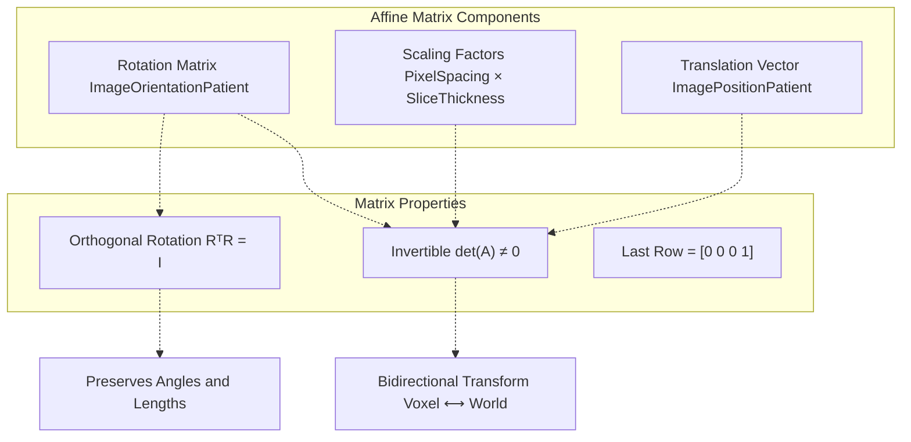
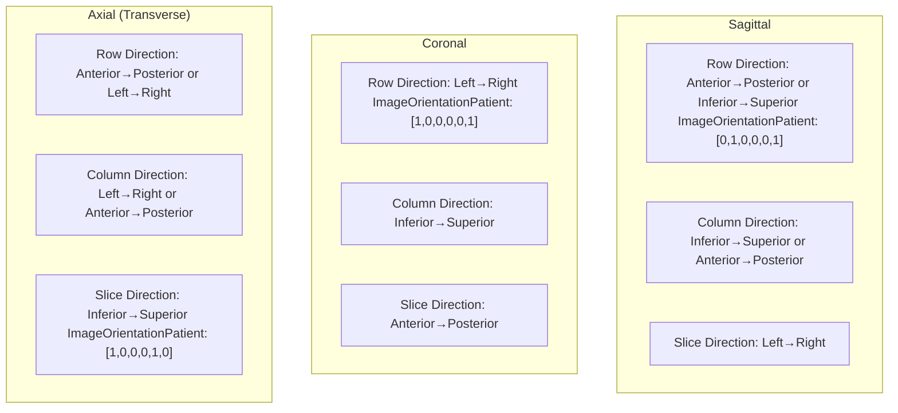
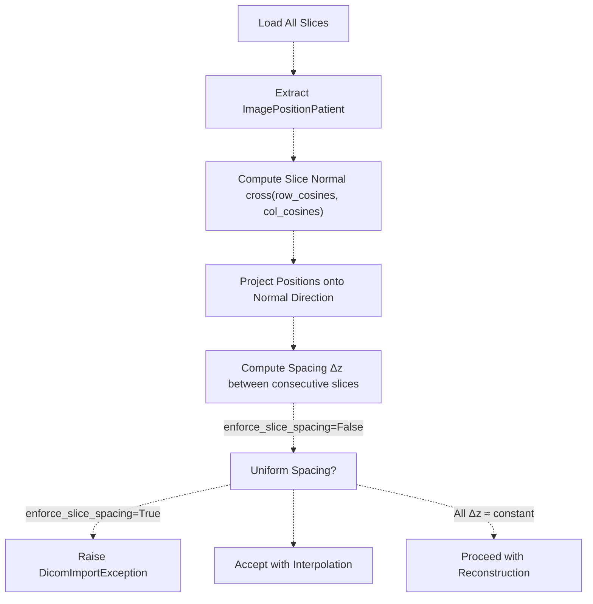
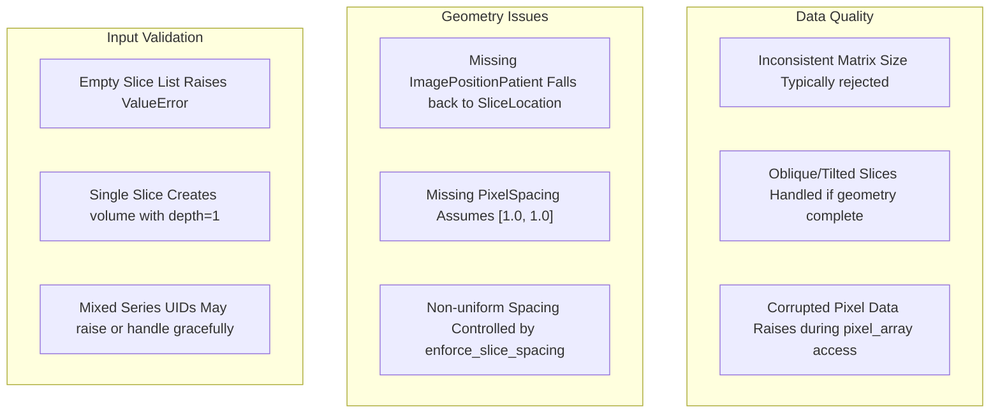
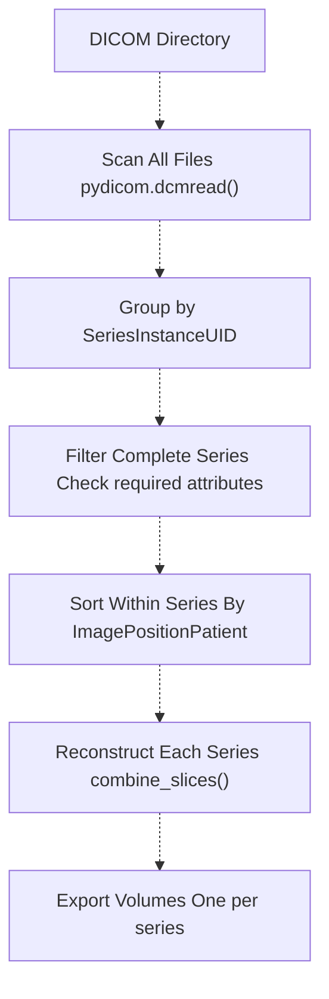

# 5d 3D Volume Reconstruction

> **Relevant source files**
> * [BUILD.md](https://github.com/ThalesMMS/Dicom-Tools/blob/c7b4cbd8/BUILD.md)
> * [README.md](https://github.com/ThalesMMS/Dicom-Tools/blob/c7b4cbd8/README.md)
> * [python/DICOM_reencoder/core/factories.py](https://github.com/ThalesMMS/Dicom-Tools/blob/c7b4cbd8/python/DICOM_reencoder/core/factories.py)
> * [python/tests/test_dicom_numpy_advanced.py](https://github.com/ThalesMMS/Dicom-Tools/blob/c7b4cbd8/python/tests/test_dicom_numpy_advanced.py)
> * [python/tests/test_gdcm_advanced.py](https://github.com/ThalesMMS/Dicom-Tools/blob/c7b4cbd8/python/tests/test_gdcm_advanced.py)
> * [python/tests/test_pydicom_advanced.py](https://github.com/ThalesMMS/Dicom-Tools/blob/c7b4cbd8/python/tests/test_pydicom_advanced.py)
> * [python/tests/test_pynetdicom_advanced.py](https://github.com/ThalesMMS/Dicom-Tools/blob/c7b4cbd8/python/tests/test_pynetdicom_advanced.py)
> * [scripts/setup_all.sh](https://github.com/ThalesMMS/Dicom-Tools/blob/c7b4cbd8/scripts/setup_all.sh)

## Purpose and Scope

This page explains how to reconstruct 3D volumes from 2D DICOM slice series. Topics covered include the `dicom_numpy.combine_slices()` function, affine transformation matrices, coordinate system conversions, and NIfTI format export.

For pixel-level image processing operations, see [Image Conversion and Processing](5b%20Image-Conversion-and-Processing.md). For visualization of reconstructed volumes, see [3D Volume Rendering](6b%203D-Volume-Rendering.md).

---

## Overview

3D volume reconstruction combines a series of 2D DICOM slices into a single 3D volume with consistent spatial geometry. This process:

* Assembles slices in correct anatomical order using `ImagePositionPatient` and `ImageOrientationPatient`
* Computes a 4×4 affine transformation matrix encoding voxel-to-world coordinate mappings
* Produces a NumPy array with shape `(rows, columns, slices)` and corresponding affine matrix
* Enables export to research formats like NIfTI for use in analysis pipelines

Volume reconstruction is essential for:

* Multi-planar reconstruction (MPR) displaying arbitrary slice orientations
* 3D visualization and rendering
* Volumetric measurements and analysis
* Integration with neuroimaging tools (FSL, SPM, AFNI)
* Machine learning workflows requiring volumetric input

**Sources:** [README.md L1-L43](https://github.com/ThalesMMS/Dicom-Tools/blob/c7b4cbd8/README.md#L1-L43)

 [python/tests/test_dicom_numpy_advanced.py L1-L447](https://github.com/ThalesMMS/Dicom-Tools/blob/c7b4cbd8/python/tests/test_dicom_numpy_advanced.py#L1-L447)

---

## Core Workflow



**Sources:** [python/tests/test_dicom_numpy_advanced.py L22-L68](https://github.com/ThalesMMS/Dicom-Tools/blob/c7b4cbd8/python/tests/test_dicom_numpy_advanced.py#L22-L68)

 [python/tests/test_dicom_numpy_advanced.py L314-L351](https://github.com/ThalesMMS/Dicom-Tools/blob/c7b4cbd8/python/tests/test_dicom_numpy_advanced.py#L314-L351)

---

## dicom-numpy Integration

### The combine_slices() Function

The primary function for volume reconstruction is `dicom_numpy.combine_slices()`, which takes a list of pydicom `Dataset` objects and returns a volume array and affine matrix.

```
import dicom_numpyimport pydicom# Load DICOM slicesdatasets = [pydicom.dcmread(path) for path in slice_paths]# Reconstruct volumevolume, affine = dicom_numpy.combine_slices(    datasets,    rescale=True,                    # Apply RescaleSlope/Intercept    enforce_slice_spacing=True       # Reject non-uniform spacing)
```

**Function Signature:**

* **Input:** `List[pydicom.Dataset]` - DICOM datasets to combine
* **Output:** `Tuple[np.ndarray, np.ndarray]` - (volume, affine_matrix)
* **Parameters:** * `rescale`: Apply modality LUT (RescaleSlope/RescaleIntercept) * `enforce_slice_spacing`: Raise exception if slice gaps detected

**Sources:** [python/tests/test_dicom_numpy_advanced.py L22-L26](https://github.com/ThalesMMS/Dicom-Tools/blob/c7b4cbd8/python/tests/test_dicom_numpy_advanced.py#L22-L26)

 [python/tests/test_dicom_numpy_advanced.py L140-L168](https://github.com/ThalesMMS/Dicom-Tools/blob/c7b4cbd8/python/tests/test_dicom_numpy_advanced.py#L140-L168)

---

## Required DICOM Metadata

Volume reconstruction requires specific DICOM attributes for spatial registration:

| Attribute | Tag | Purpose | Fallback |
| --- | --- | --- | --- |
| `ImagePositionPatient` | (0020,0032) | Origin of slice in patient space (mm) | `SliceLocation` |
| `ImageOrientationPatient` | (0020,0037) | Row/column direction cosines | [1,0,0,0,1,0] |
| `PixelSpacing` | (0028,0030) | In-plane spacing (mm) | [1.0, 1.0] |
| `SliceThickness` | (0018,0050) | Distance between slices (mm) | Computed from positions |
| `Rows` | (0028,0010) | Matrix height | Required |
| `Columns` | (0028,0011) | Matrix width | Required |
| `InstanceNumber` | (0020,0013) | Slice ordering hint | Not required |

**Slice Ordering Algorithm:**

1. Extract `ImagePositionPatient` for each slice
2. Compute slice normal vector: `cross(row_cosines, col_cosines)`
3. Project positions onto normal to get slice coordinate
4. Sort slices by projected coordinate
5. Validate uniform spacing (if `enforce_slice_spacing=True`)

**Sources:** [python/tests/test_dicom_numpy_advanced.py L296-L309](https://github.com/ThalesMMS/Dicom-Tools/blob/c7b4cbd8/python/tests/test_dicom_numpy_advanced.py#L296-L309)

 [python/tests/test_dicom_numpy_advanced.py L414-L446](https://github.com/ThalesMMS/Dicom-Tools/blob/c7b4cbd8/python/tests/test_dicom_numpy_advanced.py#L414-L446)

---

## Affine Transformation Matrices

### Matrix Structure

The affine matrix is a 4×4 homogeneous transformation matrix encoding the voxel-to-world coordinate mapping:

```
┌                          ┐
│ R₀₀·sx  R₀₁·sy  R₀₂·sz  tx │
│ R₁₀·sx  R₁₁·sy  R₁₂·sz  ty │
│ R₂₀·sx  R₂₁·sy  R₂₂·sz  tz │
│   0       0       0      1  │
└                          ┘
```

Where:

* **R** = 3×3 rotation matrix (from `ImageOrientationPatient`)
* **s** = scaling factors (from `PixelSpacing` and slice thickness)
* **t** = translation vector (from first slice `ImagePositionPatient`)

**Coordinate Transformation:**

```
# Voxel indices to world coordinatesvoxel_coords = np.array([i, j, k, 1])  # Homogeneous coordinatesworld_coords = affine @ voxel_coordsx, y, z = world_coords[:3]
```

**Sources:** [python/tests/test_dicom_numpy_advanced.py L22-L68](https://github.com/ThalesMMS/Dicom-Tools/blob/c7b4cbd8/python/tests/test_dicom_numpy_advanced.py#L22-L68)

 [python/tests/test_dicom_numpy_advanced.py L373-L384](https://github.com/ThalesMMS/Dicom-Tools/blob/c7b4cbd8/python/tests/test_dicom_numpy_advanced.py#L373-L384)

---

## Affine Matrix Properties



### Validation Tests

The affine matrix must satisfy several mathematical properties:

| Property | Verification | Test Reference |
| --- | --- | --- |
| Shape | `affine.shape == (4, 4)` | [test_dicom_numpy_advanced.py L22-L27](https://github.com/ThalesMMS/Dicom-Tools/blob/c7b4cbd8/test_dicom_numpy_advanced.py#L22-L27) |
| Homogeneous | `affine[3, :] == [0, 0, 0, 1]` | [test_dicom_numpy_advanced.py L26-L27](https://github.com/ThalesMMS/Dicom-Tools/blob/c7b4cbd8/test_dicom_numpy_advanced.py#L26-L27) |
| Invertible | `det(affine) ≠ 0` | [test_dicom_numpy_advanced.py L29-L38](https://github.com/ThalesMMS/Dicom-Tools/blob/c7b4cbd8/test_dicom_numpy_advanced.py#L29-L38) |
| Orthogonal | `norm(columns) == spacing` | [test_dicom_numpy_advanced.py L40-L52](https://github.com/ThalesMMS/Dicom-Tools/blob/c7b4cbd8/test_dicom_numpy_advanced.py#L40-L52) |
| Origin Match | `affine[:3, 3] ≈ first_slice_position` | [test_dicom_numpy_advanced.py L54-L68](https://github.com/ThalesMMS/Dicom-Tools/blob/c7b4cbd8/test_dicom_numpy_advanced.py#L54-L68) |

**Sources:** [python/tests/test_dicom_numpy_advanced.py L19-L68](https://github.com/ThalesMMS/Dicom-Tools/blob/c7b4cbd8/python/tests/test_dicom_numpy_advanced.py#L19-L68)

---

## Slice Orientations

### Standard Anatomical Planes



### Orientation Vectors

`ImageOrientationPatient` encodes two 3D unit vectors `[Xx, Xy, Xz, Yx, Yy, Yz]`:

* **X-vector** (first 3 values): row direction in patient space
* **Y-vector** (last 3 values): column direction in patient space
* **Z-vector** (computed): slice normal = `X × Y` (cross product)

**Computing Slice Normal:**

```
iop = dataset.ImageOrientationPatientrow_cosines = np.array(iop[:3])col_cosines = np.array(iop[3:])slice_normal = np.cross(row_cosines, col_cosines)
```

**Sources:** [python/tests/test_dicom_numpy_advanced.py L73-L131](https://github.com/ThalesMMS/Dicom-Tools/blob/c7b4cbd8/python/tests/test_dicom_numpy_advanced.py#L73-L131)

---

## Oblique and Non-Standard Orientations

### Oblique Slices

Oblique slices have non-orthogonal orientations relative to standard anatomical axes. The `combine_slices()` function handles arbitrary orientations by:

1. Computing the slice normal from orientation vectors
2. Projecting slice positions onto the normal direction
3. Sorting by projected distance
4. Building affine matrix from actual geometry (not assumptions)

**Example: 30° Rotated Acquisition**

```
angle = np.pi / 6  # 30 degreesrotated_iop = [    np.cos(angle), np.sin(angle), 0,   # Row vector rotated    -np.sin(angle), np.cos(angle), 0,  # Column vector rotated]dataset.ImageOrientationPatient = rotated_iop
```

### Gantry Tilt Correction

Gantry tilt occurs when the scanner gantry is angled relative to the patient table. This creates non-parallel slices. Handle by:

* Setting `enforce_slice_spacing=False` to allow non-uniform spacing
* Affine matrix automatically encodes the tilted geometry
* Consider using scanner-specific tilt correction if available

**Sources:** [python/tests/test_dicom_numpy_advanced.py L87-L106](https://github.com/ThalesMMS/Dicom-Tools/blob/c7b4cbd8/python/tests/test_dicom_numpy_advanced.py#L87-L106)

 [python/tests/test_dicom_numpy_advanced.py L205-L218](https://github.com/ThalesMMS/Dicom-Tools/blob/c7b4cbd8/python/tests/test_dicom_numpy_advanced.py#L205-L218)

---

## Volume Data Types and Rescaling

### Pixel Representation Handling

| DICOM Attribute | Value | NumPy dtype | Usage |
| --- | --- | --- | --- |
| `PixelRepresentation` | 0 | `uint8`, `uint16` | Unsigned (CT, MR magnitude) |
| `PixelRepresentation` | 1 | `int16`, `int32` | Signed (CT with air) |
| `BitsAllocated` | 8 | `uint8` / `int8` | Single byte storage |
| `BitsAllocated` | 16 | `uint16` / `int16` | Two byte storage |

### Modality LUT Application

The `rescale` parameter applies the modality LUT transformation:

```
output_value = stored_value × RescaleSlope + RescaleIntercept
```

**Common Use Cases:**

* **CT Hounsfield Units:** `RescaleSlope=1.0, RescaleIntercept=-1024.0`
* **PET SUV Conversion:** Variable slope/intercept per manufacturer
* **MR Signal Intensity:** Often `slope=1.0, intercept=0.0`

```
# With rescaling (produces float32 or float64)volume_hu, affine = dicom_numpy.combine_slices(datasets, rescale=True)# Without rescaling (preserves stored integer type)volume_raw, affine = dicom_numpy.combine_slices(datasets, rescale=False)
```

**Sources:** [python/tests/test_dicom_numpy_advanced.py L134-L168](https://github.com/ThalesMMS/Dicom-Tools/blob/c7b4cbd8/python/tests/test_dicom_numpy_advanced.py#L134-L168)

---

## Slice Spacing Validation



### Spacing Tolerance

The library checks for uniform spacing with tolerance:

```
# Compute spacing between consecutive slicesdiffs = np.diff(sorted_positions)mean_spacing = np.mean(diffs)std_spacing = np.std(diffs)# Reject if std deviation > 10% of mean (approximate threshold)if std_spacing > 0.1 * mean_spacing:    raise DicomImportException("Non-uniform slice spacing")
```

**Common Spacing Issues:**

* **Missing slices:** Gaps in instance numbers or positions
* **Overlapping slices:** Duplicate or nearly identical positions
* **Variable scan protocols:** Dynamic acquisitions with changing thickness

**Sources:** [python/tests/test_dicom_numpy_advanced.py L414-L446](https://github.com/ThalesMMS/Dicom-Tools/blob/c7b4cbd8/python/tests/test_dicom_numpy_advanced.py#L414-L446)

---

## NIfTI Export Workflow

### Converting DICOM to NIfTI

NIfTI (Neuroimaging Informatics Technology Initiative) is a standard format for neuroimaging data. The conversion workflow:

```sql
import dicom_numpyimport nibabel as nibimport pydicom# Step 1: Load DICOM seriesslice_paths = sorted(Path("series_dir").glob("*.dcm"))datasets = [pydicom.dcmread(p) for p in slice_paths]# Step 2: Reconstruct volumevolume, affine = dicom_numpy.combine_slices(datasets, rescale=True)# Step 3: Create NIfTI imagenifti_img = nib.Nifti1Image(volume, affine)# Step 4: Save to filenib.save(nifti_img, "output.nii.gz")
```

### NIfTI Affine Compatibility

The affine matrix from `dicom_numpy` is directly compatible with NIfTI conventions:

* Both use RAS+ coordinate system (Right, Anterior, Superior)
* Affine encodes voxel→world transformation
* NIfTI stores in `qform` or `sform` header fields

**Affine Coordinate System Conversion:**

| DICOM (LPS) | NIfTI (RAS) | Conversion |
| --- | --- | --- |
| Left → Right | Right → Left | Flip X |
| Posterior → Anterior | Anterior → Posterior | Flip Y |
| Inferior → Superior | Superior → Inferior | Keep Z |

The `dicom_numpy` library handles this conversion automatically.

**Sources:** [python/tests/test_dicom_numpy_advanced.py L357-L384](https://github.com/ThalesMMS/Dicom-Tools/blob/c7b4cbd8/python/tests/test_dicom_numpy_advanced.py#L357-L384)

---

## Backend Support

### Python Implementation

The Python backend provides the most comprehensive volume reconstruction support through the `dicom-numpy` library:

**CLI Command:**

```
python -m DICOM_reencoder.cli volume \    --input series_dir/ \    --output volume.nii.gz \    --format nifti
```

**Optional Dependencies:**

* `dicom-numpy`: Core volume reconstruction
* `nibabel`: NIfTI file I/O
* `SimpleITK`: Alternative reconstruction with more format support (NRRD, MHA)

**Installation:**

```
pip install "dicom-tools[volume]"  # Includes dicom-numpypip install nibabel                # For NIfTI export
```

**Sources:** [README.md L9](https://github.com/ThalesMMS/Dicom-Tools/blob/c7b4cbd8/README.md#L9-L9)

 [README.md L16](https://github.com/ThalesMMS/Dicom-Tools/blob/c7b4cbd8/README.md#L16-L16)

---

### C++ Implementation

The C++ backend uses ITK (Insight Segmentation and Registration Toolkit) for volume operations:

**Supported Operations:**

* DICOM series reading via `itk::ImageSeriesReader`
* Automatic slice ordering and orientation handling
* Export to multiple formats: NIfTI, NRRD, MetaImage, Analyze

**CLI Command:**

```
./DicomTools nifti \    --input input/dcm_series/ \    --output output/volume.nii.gz
```

**ITK Components Used:**

* `itk::GDCMSeriesFileNames`: Organizes DICOM files by series
* `itk::GDCMImageIO`: Reads DICOM pixel data and metadata
* `itk::ImageSeriesReader`: Assembles 3D volume from 2D slices
* `itk::NiftiImageIO`: Writes NIfTI format

**Sources:** [README.md L8](https://github.com/ThalesMMS/Dicom-Tools/blob/c7b4cbd8/README.md#L8-L8)

 [README.md L18](https://github.com/ThalesMMS/Dicom-Tools/blob/c7b4cbd8/README.md#L18-L18)

---

## Multi-Frame and 4D Data

### Enhanced Multi-Frame DICOM

Enhanced DICOM objects store multiple frames in a single file with functional groups:

**Key Attributes:**

* `NumberOfFrames`: Total frame count
* `PerFrameFunctionalGroupsSequence`: Per-frame metadata
* `SharedFunctionalGroupsSequence`: Common metadata
* `DimensionIndexValues`: Position in multi-dimensional space

**Handling Multi-Frame:**

```
ds = pydicom.dcmread("enhanced.dcm")num_frames = int(ds.NumberOfFrames)rows = int(ds.Rows)cols = int(ds.Columns)# Extract volume from pixel datapixel_array = ds.pixel_array  # Shape: (frames, rows, cols)volume = pixel_array  # Already 3D# Extract per-frame positions from functional groupspositions = []for fg in ds.PerFrameFunctionalGroupsSequence:    pos = fg.PlanePositionSequence[0].ImagePositionPatient    positions.append(pos)
```

### 4D Temporal Series

For dynamic acquisitions (DCE-MRI, fMRI, cardiac cine), separate volumes by temporal position:

**Temporal Attributes:**

* `AcquisitionTime`: Time of acquisition
* `TemporalPositionIdentifier`: Temporal index
* `TriggerTime`: Cardiac phase timing

**Reconstruction Strategy:**

1. Group slices by temporal position
2. Reconstruct volume for each time point separately
3. Stack into 4D array `(time, rows, cols, slices)`

**Sources:** [python/DICOM_reencoder/core/factories.py L168-L214](https://github.com/ThalesMMS/Dicom-Tools/blob/c7b4cbd8/python/DICOM_reencoder/core/factories.py#L168-L214)

 [python/tests/test_dicom_numpy_advanced.py L220-L268](https://github.com/ThalesMMS/Dicom-Tools/blob/c7b4cbd8/python/tests/test_dicom_numpy_advanced.py#L220-L268)

---

## Error Handling and Edge Cases

### Common Failure Modes



### Exception Types

| Exception | Trigger | Solution |
| --- | --- | --- |
| `ValueError` | Empty input list | Provide at least one dataset |
| `DicomImportException` | Missing required attributes | Ensure complete DICOM headers |
| `DicomImportException` | Non-uniform spacing (strict mode) | Use `enforce_slice_spacing=False` |
| `DicomImportException` | Mixed series UIDs | Filter to single series before combining |
| `KeyError` | Missing `ImagePositionPatient` | Ensure tag (0020,0032) present or use fallback |

**Robust Loading Pattern:**

```
def safe_combine(datasets):    try:        volume, affine = dicom_numpy.combine_slices(            datasets,            rescale=True,            enforce_slice_spacing=True        )    except dicom_numpy.DicomImportException as e:        # Retry with relaxed spacing        volume, affine = dicom_numpy.combine_slices(            datasets,            rescale=True,            enforce_slice_spacing=False        )    return volume, affine
```

**Sources:** [python/tests/test_dicom_numpy_advanced.py L312-L351](https://github.com/ThalesMMS/Dicom-Tools/blob/c7b4cbd8/python/tests/test_dicom_numpy_advanced.py#L312-L351)

---

## Advanced Use Cases

### Series Organization Pipeline



**Implementation:**

```css
from pathlib import Pathfrom collections import defaultdictimport pydicomimport dicom_numpydef organize_series(dicom_dir):    """Group DICOM files by SeriesInstanceUID."""    series_dict = defaultdict(list)        for path in Path(dicom_dir).rglob("*.dcm"):        ds = pydicom.dcmread(path, force=True)        series_uid = ds.get("SeriesInstanceUID")        if series_uid:            series_dict[series_uid].append(ds)        return series_dictdef reconstruct_all_series(dicom_dir, output_dir):    """Reconstruct all series in a directory."""    series_dict = organize_series(dicom_dir)        for series_uid, datasets in series_dict.items():        volume, affine = dicom_numpy.combine_slices(datasets)        output_path = Path(output_dir) / f"{series_uid}.nii.gz"                # Save using nibabel        import nibabel as nib        nib.save(nib.Nifti1Image(volume, affine), output_path)
```

### Memory-Efficient Large Volume Processing

For large datasets (e.g., whole-body CT, high-resolution MRI):

**Chunked Processing:**

```
def chunked_combine(datasets, chunk_size=50):    """Process large series in chunks to reduce memory usage."""    n_slices = len(datasets)    chunks = [datasets[i:i+chunk_size] for i in range(0, n_slices, chunk_size)]        volumes = []    affines = []        for chunk in chunks:        vol, aff = dicom_numpy.combine_slices(chunk, rescale=False)        volumes.append(vol)        affines.append(aff)        # Concatenate chunks along slice dimension    full_volume = np.concatenate(volumes, axis=2)    return full_volume, affines[0]  # Use first chunk's affine
```

**Memory-Mapped Arrays:**

```sql
import numpy as npdef create_memmap_volume(datasets, output_path):    """Create memory-mapped volume for out-of-core processing."""    rows = int(datasets[0].Rows)    cols = int(datasets[0].Columns)    slices = len(datasets)    dtype = np.uint16  # Adjust based on BitsAllocated        # Create memory-mapped array    volume = np.memmap(        output_path,        dtype=dtype,        mode='w+',        shape=(rows, cols, slices)    )        # Load slices one at a time    for i, ds in enumerate(datasets):        volume[:, :, i] = ds.pixel_array        return volume
```

**Sources:** [python/tests/test_dicom_numpy_advanced.py L388-L410](https://github.com/ThalesMMS/Dicom-Tools/blob/c7b4cbd8/python/tests/test_dicom_numpy_advanced.py#L388-L410)

---

## Testing and Validation

### Synthetic Test Data Generation

The test suite uses factories to generate consistent test datasets:

**Creating Test Slices:**

```
from DICOM_reencoder.core.factories import build_slice, build_synthetic_series# Single slice with specific geometryds = build_slice(    rows=32,    cols=32,    position=(0.0, 0.0, 10.0),    pixel_spacing=[0.7, 0.7],    study_uid="1.2.3.4",    series_uid="1.2.3.5",    instance=1)# Complete seriespaths = build_synthetic_series(    output_dir=Path("test_series"),    slices=10,    shape=(64, 64),    pixel_spacing=[0.5, 0.5])
```

### Volume Reconstruction Tests

Key test scenarios covered:

| Test Category | Test File Line Range | Validates |
| --- | --- | --- |
| Affine properties | [test_dicom_numpy_advanced.py L19-L68](https://github.com/ThalesMMS/Dicom-Tools/blob/c7b4cbd8/test_dicom_numpy_advanced.py#L19-L68) | Matrix structure and invertibility |
| Orientations | [test_dicom_numpy_advanced.py L73-L131](https://github.com/ThalesMMS/Dicom-Tools/blob/c7b4cbd8/test_dicom_numpy_advanced.py#L73-L131) | Axial, coronal, sagittal, oblique |
| Pixel types | [test_dicom_numpy_advanced.py L134-L168](https://github.com/ThalesMMS/Dicom-Tools/blob/c7b4cbd8/test_dicom_numpy_advanced.py#L134-L168) | Signed/unsigned, rescaling |
| Slice ordering | [test_dicom_numpy_advanced.py L170-L218](https://github.com/ThalesMMS/Dicom-Tools/blob/c7b4cbd8/test_dicom_numpy_advanced.py#L170-L218) | Reverse order, gaps, missing metadata |
| Multi-acquisitions | [test_dicom_numpy_advanced.py L220-L268](https://github.com/ThalesMMS/Dicom-Tools/blob/c7b4cbd8/test_dicom_numpy_advanced.py#L220-L268) | Temporal series, b-values |
| Geometry validation | [test_dicom_numpy_advanced.py L271-L310](https://github.com/ThalesMMS/Dicom-Tools/blob/c7b4cbd8/test_dicom_numpy_advanced.py#L271-L310) | Spacing, matrix size consistency |
| Error handling | [test_dicom_numpy_advanced.py L312-L351](https://github.com/ThalesMMS/Dicom-Tools/blob/c7b4cbd8/test_dicom_numpy_advanced.py#L312-L351) | Empty lists, mismatched series |
| NIfTI compatibility | [test_dicom_numpy_advanced.py L354-L384](https://github.com/ThalesMMS/Dicom-Tools/blob/c7b4cbd8/test_dicom_numpy_advanced.py#L354-L384) | Coordinate transforms, roundtrip |

**Sources:** [python/tests/test_dicom_numpy_advanced.py L1-L447](https://github.com/ThalesMMS/Dicom-Tools/blob/c7b4cbd8/python/tests/test_dicom_numpy_advanced.py#L1-L447)

 [python/DICOM_reencoder/core/factories.py L41-L100](https://github.com/ThalesMMS/Dicom-Tools/blob/c7b4cbd8/python/DICOM_reencoder/core/factories.py#L41-L100)


### On this page

* [3D Volume Reconstruction](#5.4-3d-volume-reconstruction)
* [Purpose and Scope](#5.4-purpose-and-scope)
* [Overview](#5.4-overview)
* [Core Workflow](#5.4-core-workflow)
* [dicom-numpy Integration](#5.4-dicom-numpy-integration)
* [The combine_slices() Function](#5.4-the-object-object-function)
* [Required DICOM Metadata](#5.4-required-dicom-metadata)
* [Affine Transformation Matrices](#5.4-affine-transformation-matrices)
* [Matrix Structure](#5.4-matrix-structure)
* [Affine Matrix Properties](#5.4-affine-matrix-properties)
* [Validation Tests](#5.4-validation-tests)
* [Slice Orientations](#5.4-slice-orientations)
* [Standard Anatomical Planes](#5.4-standard-anatomical-planes)
* [Orientation Vectors](#5.4-orientation-vectors)
* [Oblique and Non-Standard Orientations](#5.4-oblique-and-non-standard-orientations)
* [Oblique Slices](#5.4-oblique-slices)
* [Gantry Tilt Correction](#5.4-gantry-tilt-correction)
* [Volume Data Types and Rescaling](#5.4-volume-data-types-and-rescaling)
* [Pixel Representation Handling](#5.4-pixel-representation-handling)
* [Modality LUT Application](#5.4-modality-lut-application)
* [Slice Spacing Validation](#5.4-slice-spacing-validation)
* [Spacing Tolerance](#5.4-spacing-tolerance)
* [NIfTI Export Workflow](#5.4-nifti-export-workflow)
* [Converting DICOM to NIfTI](#5.4-converting-dicom-to-nifti)
* [NIfTI Affine Compatibility](#5.4-nifti-affine-compatibility)
* [Backend Support](#5.4-backend-support)
* [Python Implementation](#5.4-python-implementation)
* [C++ Implementation](#5.4-c-implementation)
* [Multi-Frame and 4D Data](#5.4-multi-frame-and-4d-data)
* [Enhanced Multi-Frame DICOM](#5.4-enhanced-multi-frame-dicom)
* [4D Temporal Series](#5.4-4d-temporal-series)
* [Error Handling and Edge Cases](#5.4-error-handling-and-edge-cases)
* [Common Failure Modes](#5.4-common-failure-modes)
* [Exception Types](#5.4-exception-types)
* [Advanced Use Cases](#5.4-advanced-use-cases)
* [Series Organization Pipeline](#5.4-series-organization-pipeline)
* [Memory-Efficient Large Volume Processing](#5.4-memory-efficient-large-volume-processing)
* [Testing and Validation](#5.4-testing-and-validation)
* [Synthetic Test Data Generation](#5.4-synthetic-test-data-generation)
* [Volume Reconstruction Tests](#5.4-volume-reconstruction-tests)

Ask Devin about Dicom-Tools