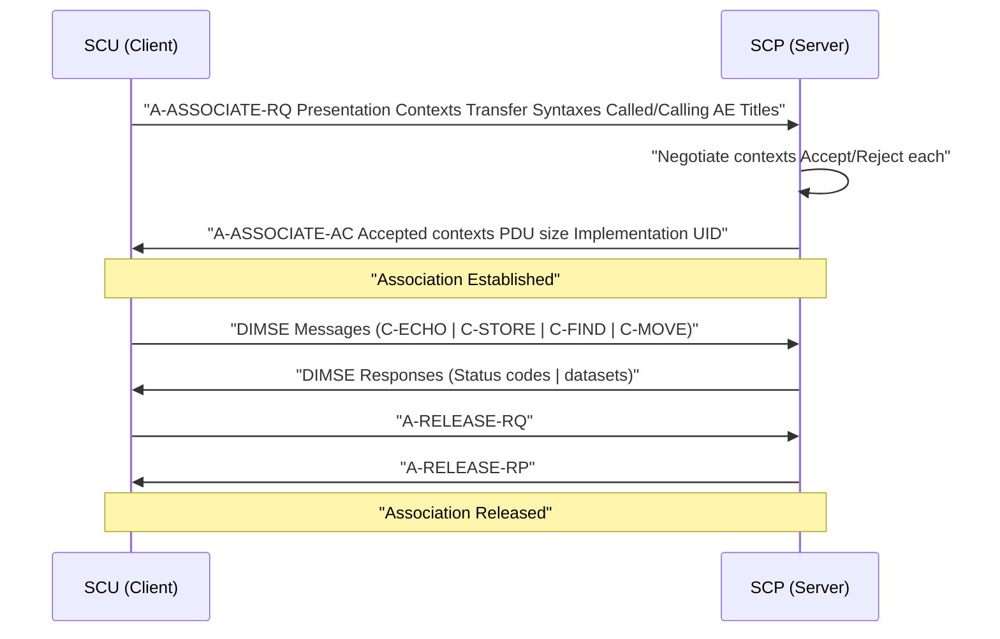
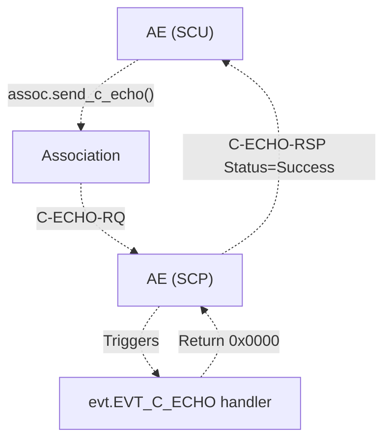
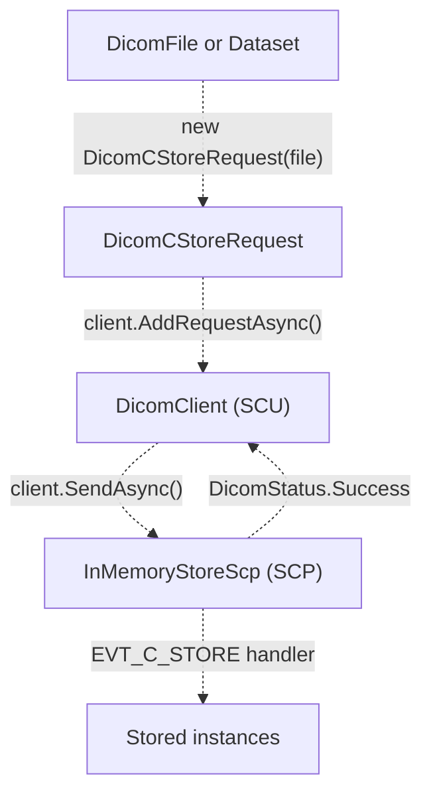
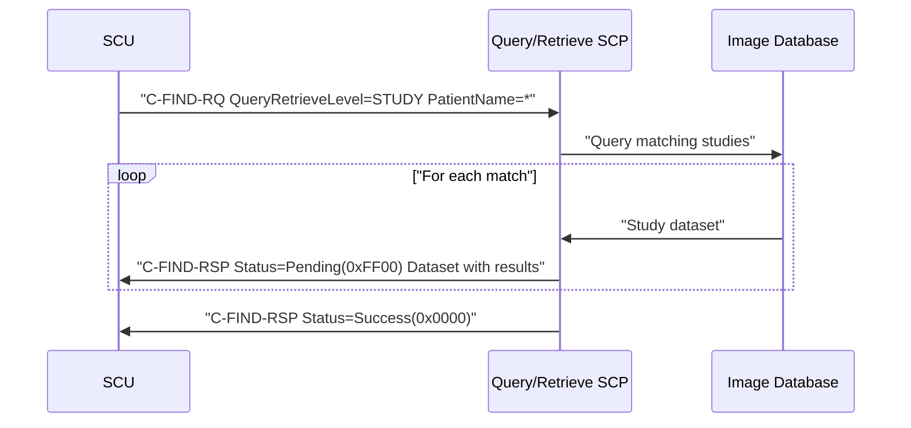
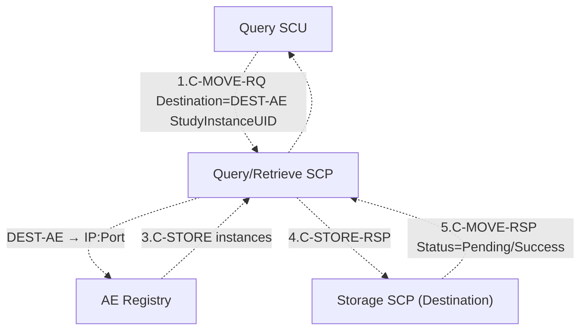
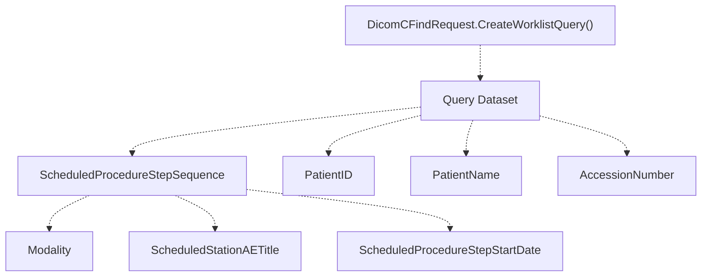
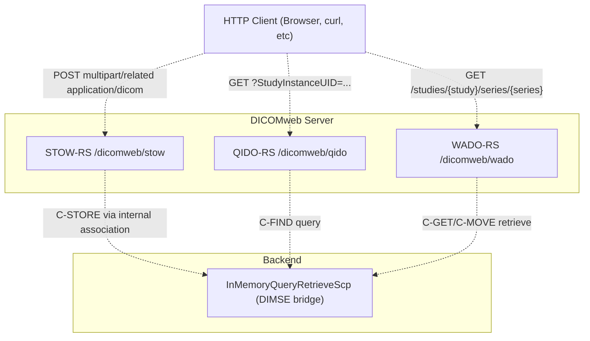
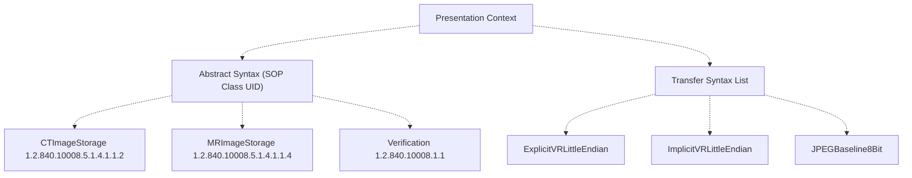
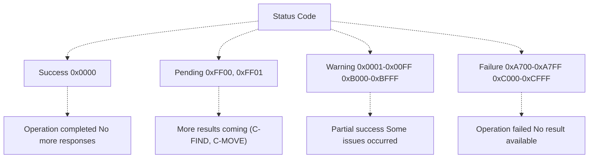

# Network Operations

> **Relevant source files**
> * [cs/DicomTools.Tests/DicomWebIntegrationTests.cs](https://github.com/ThalesMMS/Dicom-Tools/blob/c7b4cbd8/cs/DicomTools.Tests/DicomWebIntegrationTests.cs)
> * [cs/DicomTools.Tests/NetworkStoreTests.cs](https://github.com/ThalesMMS/Dicom-Tools/blob/c7b4cbd8/cs/DicomTools.Tests/NetworkStoreTests.cs)
> * [cs/DicomTools.Tests/QueryRetrieveTests.cs](https://github.com/ThalesMMS/Dicom-Tools/blob/c7b4cbd8/cs/DicomTools.Tests/QueryRetrieveTests.cs)
> * [cs/DicomTools.Tests/WorklistTests.cs](https://github.com/ThalesMMS/Dicom-Tools/blob/c7b4cbd8/cs/DicomTools.Tests/WorklistTests.cs)
> * [interface/tests/test_meta_docs.py](https://github.com/ThalesMMS/Dicom-Tools/blob/c7b4cbd8/interface/tests/test_meta_docs.py)
> * [python/DICOM_reencoder/core/factories.py](https://github.com/ThalesMMS/Dicom-Tools/blob/c7b4cbd8/python/DICOM_reencoder/core/factories.py)
> * [python/tests/test_dicom_numpy_advanced.py](https://github.com/ThalesMMS/Dicom-Tools/blob/c7b4cbd8/python/tests/test_dicom_numpy_advanced.py)
> * [python/tests/test_gdcm_advanced.py](https://github.com/ThalesMMS/Dicom-Tools/blob/c7b4cbd8/python/tests/test_gdcm_advanced.py)
> * [python/tests/test_pydicom_advanced.py](https://github.com/ThalesMMS/Dicom-Tools/blob/c7b4cbd8/python/tests/test_pydicom_advanced.py)
> * [python/tests/test_pynetdicom_advanced.py](https://github.com/ThalesMMS/Dicom-Tools/blob/c7b4cbd8/python/tests/test_pynetdicom_advanced.py)

This page documents DICOM network services supported in the Dicom-Tools repository, including DIMSE protocol operations (C-ECHO, C-STORE, C-FIND, C-MOVE, Worklist) and modern DICOMweb RESTful services (QIDO-RS, STOW-RS, WADO-RS). For file-based operations like metadata extraction and validation, see [Core File Operations](#5.1). For batch processing workflows that may combine network transfers with local file operations, see [Batch Processing](#5.6).

## DIMSE Protocol Overview

DICOM Message Service Element (DIMSE) defines message-based network services for medical imaging. Operations occur within associations between Service Class Users (SCU, clients) and Service Class Providers (SCP, servers). The repository implements both SCU and SCP roles across multiple language backends.

### Association Model



**Sources:**

* [python/tests/test_pynetdicom_advanced.py L99-L198](https://github.com/ThalesMMS/Dicom-Tools/blob/c7b4cbd8/python/tests/test_pynetdicom_advanced.py#L99-L198)
* [cs/DicomTools.Tests/QueryRetrieveTests.cs L13-L119](https://github.com/ThalesMMS/Dicom-Tools/blob/c7b4cbd8/cs/DicomTools.Tests/QueryRetrieveTests.cs#L13-L119)

### Key Network Components

| Component | Python Class | C# Class | Purpose |
| --- | --- | --- | --- |
| Application Entity | `AE` | `DicomClient` | Represents a network node with AE title |
| Association | `Association` | N/A (implicit) | Active network connection between SCU/SCP |
| Presentation Context | `build_context()` | `PresentationContext` | SOP Class + Transfer Syntax negotiation |
| Request | `DicomCStoreRequest`, `DicomCFindRequest`, etc. | `DicomCStoreRequest`, `DicomCFindRequest`, etc. | DIMSE command message |
| Response | `DicomCStoreResponse`, `DicomCFindResponse`, etc. | `DicomCStoreResponse`, `DicomCFindResponse`, etc. | Status and dataset response |
| SCP Handler | Event handler function | `DicomService<T>` subclass | Server-side operation implementation |

**Sources:**

* [python/tests/test_pynetdicom_advanced.py L1-L517](https://github.com/ThalesMMS/Dicom-Tools/blob/c7b4cbd8/python/tests/test_pynetdicom_advanced.py#L1-L517)
* [cs/DicomTools.Tests/NetworkStoreTests.cs L1-L90](https://github.com/ThalesMMS/Dicom-Tools/blob/c7b4cbd8/cs/DicomTools.Tests/NetworkStoreTests.cs#L1-L90)

---

## C-ECHO Verification

C-ECHO verifies network connectivity and DICOM association establishment without transferring data. Used for SCP availability checks and network diagnostics.

### Python Implementation

The Python backend uses `pynetdicom.AE` to create both SCU and SCP endpoints. Event handlers respond to incoming C-ECHO requests.



**Example Test Code Pattern:**

The `test_c_echo_handler_invocation` test demonstrates typical usage:

* SCP created with `ae_scp.add_supported_context(Verification)`
* Handler registered via `evt_handlers=[(evt.EVT_C_ECHO, handle_echo)]`
* SCU sends echo: `status = assoc.send_c_echo()`
* Success indicated by `status.Status == 0x0000`

**Sources:**

* [python/tests/test_pynetdicom_advanced.py L203-L234](https://github.com/ThalesMMS/Dicom-Tools/blob/c7b4cbd8/python/tests/test_pynetdicom_advanced.py#L203-L234)

### C# Implementation

C# uses `DicomClientFactory.Create()` for SCU and `DicomServerFactory.Create<T>()` for SCP. The server type parameter specifies the SCP handler class.

**Sources:**

* [cs/DicomTools.Tests/NetworkStoreTests.cs L12-L90](https://github.com/ThalesMMS/Dicom-Tools/blob/c7b4cbd8/cs/DicomTools.Tests/NetworkStoreTests.cs#L12-L90)

---

## C-STORE Storage Service

C-STORE transfers DICOM instances from SCU to SCP. Used for PACS archiving, forwarding, and backup operations.

### Storage SCU Pattern



**Python SCU Usage:**

* Create `DicomCStoreRequest` with dataset
* Add to association: `assoc.send_c_store(dataset)`
* Receive status response

**C# SCU Usage:**

* Create `DicomCStoreRequest` from `DicomFile`
* Add to client: `await client.AddRequestAsync(request)`
* Send: `await client.SendAsync(cts.Token)`

**Sources:**

* [python/tests/test_pynetdicom_advanced.py L236-L273](https://github.com/ThalesMMS/Dicom-Tools/blob/c7b4cbd8/python/tests/test_pynetdicom_advanced.py#L236-L273)
* [cs/DicomTools.Tests/NetworkStoreTests.cs L13-L50](https://github.com/ThalesMMS/Dicom-Tools/blob/c7b4cbd8/cs/DicomTools.Tests/NetworkStoreTests.cs#L13-L50)

### Storage SCP Implementation

SCP handlers receive C-STORE requests via event callbacks. The handler must:

1. Access dataset: `event.dataset`
2. Access file meta: `event.file_meta`
3. Perform storage logic (database insert, file save, etc.)
4. Return status code (0x0000 for success)

**Python SCP Pattern:**

```
def handle_store(event):    ds = event.dataset    ds.file_meta = event.file_meta    # Storage logic here    return 0x0000  # Success
```

Handler registered via: `evt_handlers=[(evt.EVT_C_STORE, handle_store)]`

**C# SCP Pattern:**

Custom SCP class inherits from `DicomService<T>`. The test suite uses `InMemoryStoreScp` which accumulates stored files in `InMemoryStoreScp.StoredFiles` list.

**Sources:**

* [python/tests/test_pynetdicom_advanced.py L236-L273](https://github.com/ThalesMMS/Dicom-Tools/blob/c7b4cbd8/python/tests/test_pynetdicom_advanced.py#L236-L273)
* [cs/DicomTools.Tests/NetworkStoreTests.cs L20-L50](https://github.com/ThalesMMS/Dicom-Tools/blob/c7b4cbd8/cs/DicomTools.Tests/NetworkStoreTests.cs#L20-L50)

### Concurrent Store Operations

Both Python and C# support concurrent C-STORE operations through multiple simultaneous associations. The SCP `maximum_associations` parameter controls concurrency limits.

**Python Configuration:**

```
ae_scp.maximum_associations = 10
```

**Test Coverage:**
The `test_multiple_concurrent_stores` test validates that an SCP can handle 5 concurrent store operations using `ThreadPoolExecutor`.

**Sources:**

* [python/tests/test_pynetdicom_advanced.py L396-L463](https://github.com/ThalesMMS/Dicom-Tools/blob/c7b4cbd8/python/tests/test_pynetdicom_advanced.py#L396-L463)

---

## Query/Retrieve Services

C-FIND and C-MOVE provide DICOM Query/Retrieve (Q/R) functionality for locating and retrieving instances from remote archives.

### Query Hierarchy

DICOM defines hierarchical query levels for navigating the information model:

| Level | Purpose | Key Identifiers |
| --- | --- | --- |
| PATIENT | Patient demographics | PatientID, PatientName |
| STUDY | Imaging study | StudyInstanceUID, StudyDate, Modality |
| SERIES | Acquisition series | SeriesInstanceUID, SeriesNumber |
| IMAGE | Individual instance | SOPInstanceUID, InstanceNumber |

**Sources:**

* [python/tests/test_pynetdicom_advanced.py L466-L496](https://github.com/ThalesMMS/Dicom-Tools/blob/c7b4cbd8/python/tests/test_pynetdicom_advanced.py#L466-L496)

### C-FIND Query Operations

C-FIND searches for instances matching query criteria. The SCU sends a query dataset with matching keys, and the SCP returns matching results.



**Python Query Pattern:**

```
query = Dataset()query.QueryRetrieveLevel = "STUDY"query.PatientName = "*"query.StudyDate = ""for status, identifier in assoc.send_c_find(query, StudyRootQueryRetrieveInformationModelFind):    if status.Status in (0xFF00, 0xFF01):  # Pending        # Process identifier dataset
```

**C# Query Pattern:**

```javascript
var request = new DicomCFindRequest(DicomQueryRetrieveLevel.Study);request.Dataset.AddOrUpdate(DicomTag.StudyInstanceUID, studyUid);request.OnResponseReceived += (_, response) => {    if (response.Status == DicomStatus.Pending) {        // Process response.Dataset    }};await client.AddRequestAsync(request);await client.SendAsync();
```

**Sources:**

* [python/tests/test_pynetdicom_advanced.py L274-L318](https://github.com/ThalesMMS/Dicom-Tools/blob/c7b4cbd8/python/tests/test_pynetdicom_advanced.py#L274-L318)
* [cs/DicomTools.Tests/QueryRetrieveTests.cs L34-L57](https://github.com/ThalesMMS/Dicom-Tools/blob/c7b4cbd8/cs/DicomTools.Tests/QueryRetrieveTests.cs#L34-L57)

### C-FIND SCP Handler

SCP handlers yield multiple results for C-FIND operations. Each yield produces a pending response until the final success status.

**Python SCP Pattern:**

```
def handle_find(event):    query = event.identifier    # Search database    for match in results:        identifier = Dataset()        # Populate identifier from match        yield 0xFF00, identifier  # Pending + data    yield 0x0000, None  # Success
```

**Sources:**

* [python/tests/test_pynetdicom_advanced.py L274-L318](https://github.com/ThalesMMS/Dicom-Tools/blob/c7b4cbd8/python/tests/test_pynetdicom_advanced.py#L274-L318)

### C-MOVE Retrieve Operations

C-MOVE retrieves instances by instructing the SCP to send them to a destination AE. Unlike C-GET, C-MOVE requires a third-party destination SCP.



**Key Requirements:**

1. Destination AE must be pre-registered with Q/R SCP
2. Destination SCP must be reachable and accepting associations
3. Q/R SCP acts as Store SCU to destination

**Python Move Request:**

```
move_request = DicomCMoveRequest("DEST-AE", study_uid)move_request.OnResponseReceived += handler
```

**C# Move Request:**

```javascript
var moveRequest = new DicomCMoveRequest("DEST-AE", studyUid);moveRequest.OnResponseReceived += (_, response) => {    // Track pending/success status};
```

**Test Pattern:**

The test suite validates C-MOVE by:

1. Configuring sources in `InMemoryQueryRetrieveScp.ConfigureSources(files)`
2. Registering destination: `InMemoryQueryRetrieveScp.RegisterDestination("DEST-AE", ip, port)`
3. Starting both Q/R SCP and Storage SCP
4. Sending C-MOVE request
5. Verifying instances arrive at `InMemoryStoreScp.StoredFiles`

**Sources:**

* [python/tests/test_pynetdicom_advanced.py L320-L341](https://github.com/ThalesMMS/Dicom-Tools/blob/c7b4cbd8/python/tests/test_pynetdicom_advanced.py#L320-L341)
* [cs/DicomTools.Tests/QueryRetrieveTests.cs L59-L101](https://github.com/ThalesMMS/Dicom-Tools/blob/c7b4cbd8/cs/DicomTools.Tests/QueryRetrieveTests.cs#L59-L101)

### Query Retrieve Information Models

Two standard information models define query/retrieve hierarchies:

**Patient Root Model:**

* Hierarchy: PATIENT → STUDY → SERIES → IMAGE
* SOP Class: `PatientRootQueryRetrieveInformationModelFind`
* Use case: Patient-centric queries

**Study Root Model:**

* Hierarchy: STUDY → SERIES → IMAGE (no PATIENT level)
* SOP Class: `StudyRootQueryRetrieveInformationModelFind`
* Use case: Study-centric queries

**Sources:**

* [python/tests/test_pynetdicom_advanced.py L466-L496](https://github.com/ThalesMMS/Dicom-Tools/blob/c7b4cbd8/python/tests/test_pynetdicom_advanced.py#L466-L496)

---

## Modality Worklist (MWL)

Modality Worklist provides scheduled procedure step information to imaging modalities. MWL uses C-FIND with specialized query structure.

### Worklist Query Structure



**Query Dataset Requirements:**

* Patient demographics: PatientID, PatientName, PatientSex
* Accession number for procedure tracking
* Nested ScheduledProcedureStepSequence with: * Modality filter (e.g., "MR", "CT") * Scheduled station AE title * Start date/time

**C# Worklist Query Pattern:**

```
var request = DicomCFindRequest.CreateWorklistQuery(    patientId: "WL-001",    patientName: "WORKLIST^PATIENT",    accessionNumber: "ACC-123",    sex: "F",    modality: "MR",    scheduledDate: null);
```

**Sources:**

* [cs/DicomTools.Tests/WorklistTests.cs L14-L63](https://github.com/ThalesMMS/Dicom-Tools/blob/c7b4cbd8/cs/DicomTools.Tests/WorklistTests.cs#L14-L63)

### Worklist SCP Response

SCP returns matching scheduled procedure steps with full scheduling details:

**Response Dataset Structure:**

```yaml
PatientName: "WORKLIST^PATIENT"
PatientID: "WL-001"
AccessionNumber: "ACC-123"
StudyInstanceUID: <generated>
RequestedProcedureID: "REQ-1"
ScheduledProcedureStepSequence:
  - Modality: "MR"
    ScheduledProcedureStepStartDate: "20240201"
    ScheduledProcedureStepStartTime: "093000"
    ScheduledStationAETitle: "MAIN-STATION"
    ScheduledProcedureStepDescription: "BRAIN MRI"
```

**Test Implementation:**

The `InMemoryWorklistScp` class provides in-memory worklist storage:

* `InMemoryWorklistScp.Reset()` clears entries
* `InMemoryWorklistScp.ConfigureEntries(entries)` loads worklist items
* SCP matches queries against configured entries

**Sources:**

* [cs/DicomTools.Tests/WorklistTests.cs L65-L87](https://github.com/ThalesMMS/Dicom-Tools/blob/c7b4cbd8/cs/DicomTools.Tests/WorklistTests.cs#L65-L87)

---

## DICOMweb Services

DICOMweb provides RESTful HTTP/HTTPS alternatives to DIMSE operations. The repository supports QIDO-RS (query), STOW-RS (store), and WADO-RS (retrieve).

### DICOMweb Architecture



**Sources:**

* [cs/DicomTools.Tests/DicomWebIntegrationTests.cs L17-L74](https://github.com/ThalesMMS/Dicom-Tools/blob/c7b4cbd8/cs/DicomTools.Tests/DicomWebIntegrationTests.cs#L17-L74)

### STOW-RS (Store Over Web)

STOW-RS uploads DICOM instances via HTTP POST with `multipart/related` content type.

**Request Format:**

```
POST /dicomweb/stow HTTP/1.1
Content-Type: multipart/related; type="application/dicom"

--boundary
Content-Type: application/dicom

<DICOM file bytes>
--boundary--
```

**C# Client Pattern:**

```
using var http = new HttpClient();var content = new ByteArrayContent(dicomBytes);content.Headers.ContentType = new MediaTypeHeaderValue("application/dicom");var response = await http.PostAsync($"http://localhost:{port}/dicomweb/stow", content);
```

**Server Implementation:**

The `DicomWebStowServer` class provides STOW-RS endpoint:

* `await DicomWebStowServer.StartAsync(port)` starts server
* Internally converts HTTP POST to C-STORE DIMSE operation
* Stores to configured backend (e.g., `InMemoryQueryRetrieveScp`)

**Sources:**

* [cs/DicomTools.Tests/DicomWebIntegrationTests.cs L33-L43](https://github.com/ThalesMMS/Dicom-Tools/blob/c7b4cbd8/cs/DicomTools.Tests/DicomWebIntegrationTests.cs#L33-L43)

### STOW + DIMSE Bridge

The test `Stow_Then_CMove_DeliversInstance` demonstrates DICOMweb-to-DIMSE bridging:

1. Upload via STOW-RS to `DicomWebStowServer`
2. STOW converts to C-STORE and stores in `InMemoryQueryRetrieveScp`
3. C-MOVE request retrieves from same backend
4. Instance delivered to destination SCP
5. Verify stored instance matches original

This validates that DICOMweb and DIMSE services can share common backend storage.

**Sources:**

* [cs/DicomTools.Tests/DicomWebIntegrationTests.cs L18-L73](https://github.com/ThalesMMS/Dicom-Tools/blob/c7b4cbd8/cs/DicomTools.Tests/DicomWebIntegrationTests.cs#L18-L73)

### Language Backend DICOMweb Support

| Language | QIDO-RS | STOW-RS | WADO-RS | Implementation |
| --- | --- | --- | --- | --- |
| Python | ✓ | ✓ | ✓ | pynetdicom + custom HTTP handlers |
| Rust | ✓ | ✓ | ✓ | Native HTTP server with dicom-rs |
| C# | ✓ | ✓ | ✓ | fo-dicom with ASP.NET Core integration |
| Java | ✓ | ✓ | ✓ | dcm4che3 REST endpoints |

**Sources:**

* [cs/DicomTools.Tests/DicomWebIntegrationTests.cs L1-L75](https://github.com/ThalesMMS/Dicom-Tools/blob/c7b4cbd8/cs/DicomTools.Tests/DicomWebIntegrationTests.cs#L1-L75)

---

## Presentation Context Negotiation

Presentation contexts define which SOP Classes and Transfer Syntaxes the association supports. Negotiation occurs during A-ASSOCIATE.

### Context Structure



**Python Context Creation:**

```
from pynetdicom import build_contextfrom pydicom.uid import CTImageStorage, ExplicitVRLittleEndian, ImplicitVRLittleEndiancontext = build_context(    CTImageStorage,    [ExplicitVRLittleEndian, ImplicitVRLittleEndian])ae.add_requested_context(context.abstract_syntax, context.transfer_syntax)
```

**Bulk Context Setup:**

Python provides `StoragePresentationContexts` with over 100 pre-defined storage SOP classes:

```
from pynetdicom import StoragePresentationContextsae.requested_contexts = StoragePresentationContexts
```

**Sources:**

* [python/tests/test_pynetdicom_advanced.py L53-L97](https://github.com/ThalesMMS/Dicom-Tools/blob/c7b4cbd8/python/tests/test_pynetdicom_advanced.py#L53-L97)

### Context Acceptance/Rejection

During association, the SCP accepts or rejects each proposed context:

**Accepted Context:**

* Abstract syntax is supported
* At least one transfer syntax is acceptable
* Context ID assigned for use in DIMSE messages

**Rejected Context:**

* Abstract syntax not supported
* No acceptable transfer syntax
* Cannot be used for operations

**Test Pattern:**

The `test_context_rejection_handling` test validates:

* SCU proposes `CTImageStorage` (not supported) and `Verification` (supported)
* After association: `assoc.accepted_contexts` contains `Verification`
* `assoc.rejected_contexts` contains `CTImageStorage`

**Sources:**

* [python/tests/test_pynetdicom_advanced.py L67-L92](https://github.com/ThalesMMS/Dicom-Tools/blob/c7b4cbd8/python/tests/test_pynetdicom_advanced.py#L67-L92)

---

## Advanced Association Features

### Maximum PDU Size Negotiation

Protocol Data Unit (PDU) size determines maximum message fragment size. Both peers propose maximum PDU size during association.

**Python Configuration:**

```
ae_scp.maximum_pdu_size = 32768  # 32 KBae_scu.maximum_pdu_size = 16384  # 16 KB
```

**Negotiated Size:**
The actual PDU size is the minimum of both peers' maximum sizes. In the example above, 16384 bytes would be negotiated.

**Sources:**

* [python/tests/test_pynetdicom_advanced.py L177-L197](https://github.com/ThalesMMS/Dicom-Tools/blob/c7b4cbd8/python/tests/test_pynetdicom_advanced.py#L177-L197)

### User Identity Negotiation

User identity allows authentication via username/password or Kerberos tickets.

**Identity Types:**

| Type | Description | Fields |
| --- | --- | --- |
| 1 | Username only | primary_field = username |
| 2 | Username + Password | primary_field = username, secondary_field = password |
| 3 | Kerberos ticket | primary_field = kerberos ticket data |
| 4 | SAML assertion | primary_field = SAML XML |

**Python Configuration:**

```
from pynetdicom.pdu_primitives import UserIdentityNegotiationuser_id = UserIdentityNegotiation()user_id.user_identity_type = 2  # Username and passworduser_id.primary_field = b"testuser"user_id.secondary_field = b"testpass"
```

**Sources:**

* [python/tests/test_pynetdicom_advanced.py L354-L372](https://github.com/ThalesMMS/Dicom-Tools/blob/c7b4cbd8/python/tests/test_pynetdicom_advanced.py#L354-L372)

### SOP Class Extended Negotiation

Extended negotiation allows SOP Class-specific configuration beyond standard presentation contexts.

**Python Configuration:**

```
from pynetdicom.pdu_primitives import SOPClassExtendedNegotiationfrom pydicom.uid import CTImageStorageext_neg = SOPClassExtendedNegotiation()ext_neg.sop_class_uid = CTImageStorageext_neg.service_class_application_information = b"\x01\x00"  # Implementation-specific
```

**Sources:**

* [python/tests/test_pynetdicom_advanced.py L345-L351](https://github.com/ThalesMMS/Dicom-Tools/blob/c7b4cbd8/python/tests/test_pynetdicom_advanced.py#L345-L351)

### Role Selection

Role selection negotiates whether each peer acts as SCU, SCP, or both for a given SOP Class.

**Use Case: C-GET**

C-GET requires the requestor (typically SCU) to also act as Storage SCP to receive instances:

```
from pynetdicom import build_rolefrom pydicom.uid import SecondaryCaptureImageStorageroles = [    build_role(SecondaryCaptureImageStorage, scp_role=True)]# Include roles in association request
```

**Sources:**

* [python/tests/test_pynetdicom_advanced.py L320-L341](https://github.com/ThalesMMS/Dicom-Tools/blob/c7b4cbd8/python/tests/test_pynetdicom_advanced.py#L320-L341)

---

## Event Handling

Network operations trigger events that can be intercepted for logging, validation, or custom processing.

### Python Event Types

| Event | Trigger | Handler Return |
| --- | --- | --- |
| `evt.EVT_C_ECHO` | C-ECHO request received | Status code (0x0000 for success) |
| `evt.EVT_C_STORE` | C-STORE request received | Status code |
| `evt.EVT_C_FIND` | C-FIND request received | Generator yielding (status, dataset) |
| `evt.EVT_C_MOVE` | C-MOVE request received | Generator yielding (status, dataset) |
| `evt.EVT_REQUESTED` | Association requested | None (informational) |
| `evt.EVT_ABORTED` | Association aborted | None |
| `evt.EVT_RELEASED` | Association released | None |

**Handler Registration:**

```
def handle_echo(event):    # Custom logic    return 0x0000  # Successserver = ae_scp.start_server(    ("127.0.0.1", port),    block=False,    evt_handlers=[(evt.EVT_C_ECHO, handle_echo)])
```

**Event Object Properties:**

* `event.assoc`: Current association
* `event.dataset`: Received dataset (for C-STORE, C-FIND, C-MOVE)
* `event.file_meta`: File meta information (for C-STORE)
* `event.identifier`: Query identifier (for C-FIND, C-MOVE)

**Sources:**

* [python/tests/test_pynetdicom_advanced.py L200-L318](https://github.com/ThalesMMS/Dicom-Tools/blob/c7b4cbd8/python/tests/test_pynetdicom_advanced.py#L200-L318)

---

## Status Codes

DIMSE responses include status codes indicating operation results.

### Status Categories



**Common Status Values:**

| Code | Name | Meaning |
| --- | --- | --- |
| 0x0000 | Success | Operation completed successfully |
| 0xFF00 | Pending | Sub-operations continuing |
| 0xFF01 | Pending | Optional matching complete, operations continuing |
| 0xA700 | Failure | Out of resources |
| 0xA701 | Failure | Unable to calculate number of matches |
| 0xB000 | Warning | Sub-operations completed with failures |
| 0xC000 | Failure | Unable to process |

**Sources:**

* [python/tests/test_pynetdicom_advanced.py L374-L391](https://github.com/ThalesMMS/Dicom-Tools/blob/c7b4cbd8/python/tests/test_pynetdicom_advanced.py#L374-L391)

---

## Timeout Configuration

Network operations support configurable timeouts to handle unresponsive peers.

### Python Timeout Types

| Timeout | Parameter | Purpose |
| --- | --- | --- |
| ACSE | `ae.acse_timeout` | Association establishment timeout |
| Network | `ae.network_timeout` | Socket-level connection timeout |
| DIMSE | `ae.dimse_timeout` | DIMSE message response timeout |

**Configuration Example:**

```
ae = AE(ae_title="TIMEOUT_SCU")ae.acse_timeout = 30      # 30 seconds for associationae.network_timeout = 10   # 10 seconds for socket operationsae.dimse_timeout = 60     # 60 seconds for DIMSE responses
```

**Sources:**

* [python/tests/test_pynetdicom_advanced.py L498-L517](https://github.com/ThalesMMS/Dicom-Tools/blob/c7b4cbd8/python/tests/test_pynetdicom_advanced.py#L498-L517)

---

## Concurrent Operations

Both Python and C# backends support multiple simultaneous associations for high-throughput scenarios.

### Concurrency Limits

**Python SCP Configuration:**

```
ae_scp.maximum_associations = 10  # Allow up to 10 simultaneous connections
```

**Test Pattern:**

The `test_multiple_concurrent_stores` test validates concurrent operations:

1. Configure SCP with `maximum_associations = 10`
2. Use `ThreadPoolExecutor` to send 5 parallel C-STORE requests
3. Verify all 5 instances are received
4. Validate no collisions or data corruption

**Association Limit Enforcement:**

The `test_association_limit_enforcement` test validates:

1. SCP configured with `maximum_associations = 2`
2. Attempt 4 simultaneous associations
3. At most 2 associations established
4. Additional requests queue or reject

**Sources:**

* [python/tests/test_pynetdicom_advanced.py L393-L463](https://github.com/ThalesMMS/Dicom-Tools/blob/c7b4cbd8/python/tests/test_pynetdicom_advanced.py#L393-L463)

---

## Network Operation CLI Commands

The CLI contract defines standardized commands for network operations across all backends.

### Command Reference

| Operation | Command | Parameters | Output |
| --- | --- | --- | --- |
| Verification | `echo` | `--host`, `--port`, `--aet`, `--aec` | Success/failure status |
| Store | `store_scu` | `--host`, `--port`, `--aet`, `--aec`, `--input` | Transfer status |
| Query | `find` | `--host`, `--port`, `--level`, `--query` | Matching datasets |
| Retrieve | `move` | `--host`, `--port`, `--dest`, `--query` | Transfer progress |
| Worklist | `worklist` | `--host`, `--port`, `--query` | Worklist entries |
| DICOMweb Query | `qido` | `--url`, `--study`, `--series` | JSON response |
| DICOMweb Store | `stow` | `--url`, `--input` | Upload status |
| DICOMweb Retrieve | `wado` | `--url`, `--study`, `--series`, `--output` | Download status |

**Sources:**
Based on patterns in test files and high-level diagrams showing operation coverage.

---

## Code Entity Reference

### Python (pynetdicom)

**Core Classes:**

* `AE` [python/tests/test_pynetdicom_advanced.py L27](https://github.com/ThalesMMS/Dicom-Tools/blob/c7b4cbd8/python/tests/test_pynetdicom_advanced.py#L27-L27)  - Application Entity for SCU/SCP
* `Association` - Active network connection
* `build_context()` [python/tests/test_pynetdicom_advanced.py L29](https://github.com/ThalesMMS/Dicom-Tools/blob/c7b4cbd8/python/tests/test_pynetdicom_advanced.py#L29-L29)  - Create presentation context
* `build_role()` [python/tests/test_pynetdicom_advanced.py L30](https://github.com/ThalesMMS/Dicom-Tools/blob/c7b4cbd8/python/tests/test_pynetdicom_advanced.py#L30-L30)  - Configure SCP/SCU roles

**Request Classes:**

* `DicomCStoreRequest` - Storage request
* `DicomCFindRequest` - Query request
* `DicomCMoveRequest` - Retrieve request

**Event Constants:**

* `evt.EVT_C_ECHO` [python/tests/test_pynetdicom_advanced.py L31](https://github.com/ThalesMMS/Dicom-Tools/blob/c7b4cbd8/python/tests/test_pynetdicom_advanced.py#L31-L31)
* `evt.EVT_C_STORE` [python/tests/test_pynetdicom_advanced.py L31](https://github.com/ThalesMMS/Dicom-Tools/blob/c7b4cbd8/python/tests/test_pynetdicom_advanced.py#L31-L31)
* `evt.EVT_C_FIND` [python/tests/test_pynetdicom_advanced.py L31](https://github.com/ThalesMMS/Dicom-Tools/blob/c7b4cbd8/python/tests/test_pynetdicom_advanced.py#L31-L31)
* `evt.EVT_REQUESTED` [python/tests/test_pynetdicom_advanced.py L31](https://github.com/ThalesMMS/Dicom-Tools/blob/c7b4cbd8/python/tests/test_pynetdicom_advanced.py#L31-L31)
* `evt.EVT_ABORTED` [python/tests/test_pynetdicom_advanced.py L31](https://github.com/ThalesMMS/Dicom-Tools/blob/c7b4cbd8/python/tests/test_pynetdicom_advanced.py#L31-L31)

**Status and SOP Classes:**

* `Status` [python/tests/test_pynetdicom_advanced.py L45](https://github.com/ThalesMMS/Dicom-Tools/blob/c7b4cbd8/python/tests/test_pynetdicom_advanced.py#L45-L45)  - Status code constants
* `Verification` [python/tests/test_pynetdicom_advanced.py L43](https://github.com/ThalesMMS/Dicom-Tools/blob/c7b4cbd8/python/tests/test_pynetdicom_advanced.py#L43-L43)  - C-ECHO SOP Class
* `PatientRootQueryRetrieveInformationModelFind` [python/tests/test_pynetdicom_advanced.py L39](https://github.com/ThalesMMS/Dicom-Tools/blob/c7b4cbd8/python/tests/test_pynetdicom_advanced.py#L39-L39)
* `StudyRootQueryRetrieveInformationModelFind` [python/tests/test_pynetdicom_advanced.py L42](https://github.com/ThalesMMS/Dicom-Tools/blob/c7b4cbd8/python/tests/test_pynetdicom_advanced.py#L42-L42)

**Sources:**

* [python/tests/test_pynetdicom_advanced.py L1-L517](https://github.com/ThalesMMS/Dicom-Tools/blob/c7b4cbd8/python/tests/test_pynetdicom_advanced.py#L1-L517)

### C# (fo-dicom)

**Factory Classes:**

* `DicomClientFactory.Create()` [cs/DicomTools.Tests/NetworkStoreTests.cs L29](https://github.com/ThalesMMS/Dicom-Tools/blob/c7b4cbd8/cs/DicomTools.Tests/NetworkStoreTests.cs#L29-L29)  - Create SCU client
* `DicomServerFactory.Create<T>()` [cs/DicomTools.Tests/NetworkStoreTests.cs L23](https://github.com/ThalesMMS/Dicom-Tools/blob/c7b4cbd8/cs/DicomTools.Tests/NetworkStoreTests.cs#L23-L23)  - Create SCP server

**Request Classes:**

* `DicomCStoreRequest` [cs/DicomTools.Tests/NetworkStoreTests.cs L27](https://github.com/ThalesMMS/Dicom-Tools/blob/c7b4cbd8/cs/DicomTools.Tests/NetworkStoreTests.cs#L27-L27)
* `DicomCFindRequest` [cs/DicomTools.Tests/QueryRetrieveTests.cs L106](https://github.com/ThalesMMS/Dicom-Tools/blob/c7b4cbd8/cs/DicomTools.Tests/QueryRetrieveTests.cs#L106-L106)
* `DicomCMoveRequest` [cs/DicomTools.Tests/QueryRetrieveTests.cs L82](https://github.com/ThalesMMS/Dicom-Tools/blob/c7b4cbd8/cs/DicomTools.Tests/QueryRetrieveTests.cs#L82-L82)
* `DicomCFindRequest.CreateWorklistQuery()` [cs/DicomTools.Tests/WorklistTests.cs L29](https://github.com/ThalesMMS/Dicom-Tools/blob/c7b4cbd8/cs/DicomTools.Tests/WorklistTests.cs#L29-L29)

**Test SCP Implementations:**

* `InMemoryStoreScp` [cs/DicomTools.Tests/NetworkStoreTests.cs L20](https://github.com/ThalesMMS/Dicom-Tools/blob/c7b4cbd8/cs/DicomTools.Tests/NetworkStoreTests.cs#L20-L20)  - Storage SCP
* `InMemoryQueryRetrieveScp` [cs/DicomTools.Tests/QueryRetrieveTests.cs L21](https://github.com/ThalesMMS/Dicom-Tools/blob/c7b4cbd8/cs/DicomTools.Tests/QueryRetrieveTests.cs#L21-L21)  - Q/R SCP
* `InMemoryWorklistScp` [cs/DicomTools.Tests/WorklistTests.cs L21](https://github.com/ThalesMMS/Dicom-Tools/blob/c7b4cbd8/cs/DicomTools.Tests/WorklistTests.cs#L21-L21)  - Worklist SCP
* `DicomWebStowServer` [cs/DicomTools.Tests/DicomWebIntegrationTests.cs L34](https://github.com/ThalesMMS/Dicom-Tools/blob/c7b4cbd8/cs/DicomTools.Tests/DicomWebIntegrationTests.cs#L34-L34)  - DICOMweb server

**Status and Enumerations:**

* `DicomStatus.Success` [cs/DicomTools.Tests/NetworkStoreTests.cs L38](https://github.com/ThalesMMS/Dicom-Tools/blob/c7b4cbd8/cs/DicomTools.Tests/NetworkStoreTests.cs#L38-L38)
* `DicomStatus.Pending` [cs/DicomTools.Tests/QueryRetrieveTests.cs L89](https://github.com/ThalesMMS/Dicom-Tools/blob/c7b4cbd8/cs/DicomTools.Tests/QueryRetrieveTests.cs#L89-L89)
* `DicomQueryRetrieveLevel.Study` [cs/DicomTools.Tests/QueryRetrieveTests.cs L34](https://github.com/ThalesMMS/Dicom-Tools/blob/c7b4cbd8/cs/DicomTools.Tests/QueryRetrieveTests.cs#L34-L34)
* `DicomQueryRetrieveLevel.Series` [cs/DicomTools.Tests/QueryRetrieveTests.cs L41](https://github.com/ThalesMMS/Dicom-Tools/blob/c7b4cbd8/cs/DicomTools.Tests/QueryRetrieveTests.cs#L41-L41)
* `DicomQueryRetrieveLevel.Image` [cs/DicomTools.Tests/QueryRetrieveTests.cs L49](https://github.com/ThalesMMS/Dicom-Tools/blob/c7b4cbd8/cs/DicomTools.Tests/QueryRetrieveTests.cs#L49-L49)

**Sources:**

* [cs/DicomTools.Tests/NetworkStoreTests.cs L1-L90](https://github.com/ThalesMMS/Dicom-Tools/blob/c7b4cbd8/cs/DicomTools.Tests/NetworkStoreTests.cs#L1-L90)
* [cs/DicomTools.Tests/QueryRetrieveTests.cs L1-L120](https://github.com/ThalesMMS/Dicom-Tools/blob/c7b4cbd8/cs/DicomTools.Tests/QueryRetrieveTests.cs#L1-L120)
* [cs/DicomTools.Tests/WorklistTests.cs L1-L88](https://github.com/ThalesMMS/Dicom-Tools/blob/c7b4cbd8/cs/DicomTools.Tests/WorklistTests.cs#L1-L88)
* [cs/DicomTools.Tests/DicomWebIntegrationTests.cs L1-L75](https://github.com/ThalesMMS/Dicom-Tools/blob/c7b4cbd8/cs/DicomTools.Tests/DicomWebIntegrationTests.cs#L1-L75)

Refresh this wiki

Last indexed: 5 January 2026 ([c7b4cb](https://github.com/ThalesMMS/Dicom-Tools/commit/c7b4cbd8))

### On this page

* [Network Operations](#5.5-network-operations)
* [DIMSE Protocol Overview](#5.5-dimse-protocol-overview)
* [Association Model](#5.5-association-model)
* [Key Network Components](#5.5-key-network-components)
* [C-ECHO Verification](#5.5-c-echo-verification)
* [Python Implementation](#5.5-python-implementation)
* [C# Implementation](#5.5-c-implementation)
* [C-STORE Storage Service](#5.5-c-store-storage-service)
* [Storage SCU Pattern](#5.5-storage-scu-pattern)
* [Storage SCP Implementation](#5.5-storage-scp-implementation)
* [Concurrent Store Operations](#5.5-concurrent-store-operations)
* [Query/Retrieve Services](#5.5-queryretrieve-services)
* [Query Hierarchy](#5.5-query-hierarchy)
* [C-FIND Query Operations](#5.5-c-find-query-operations)
* [C-FIND SCP Handler](#5.5-c-find-scp-handler)
* [C-MOVE Retrieve Operations](#5.5-c-move-retrieve-operations)
* [Query Retrieve Information Models](#5.5-query-retrieve-information-models)
* [Modality Worklist (MWL)](#5.5-modality-worklist-mwl)
* [Worklist Query Structure](#5.5-worklist-query-structure)
* [Worklist SCP Response](#5.5-worklist-scp-response)
* [DICOMweb Services](#5.5-dicomweb-services)
* [DICOMweb Architecture](#5.5-dicomweb-architecture)
* [STOW-RS (Store Over Web)](#5.5-stow-rs-store-over-web)
* [STOW + DIMSE Bridge](#5.5-stow-dimse-bridge)
* [Language Backend DICOMweb Support](#5.5-language-backend-dicomweb-support)
* [Presentation Context Negotiation](#5.5-presentation-context-negotiation)
* [Context Structure](#5.5-context-structure)
* [Context Acceptance/Rejection](#5.5-context-acceptancerejection)
* [Advanced Association Features](#5.5-advanced-association-features)
* [Maximum PDU Size Negotiation](#5.5-maximum-pdu-size-negotiation)
* [User Identity Negotiation](#5.5-user-identity-negotiation)
* [SOP Class Extended Negotiation](#5.5-sop-class-extended-negotiation)
* [Role Selection](#5.5-role-selection)
* [Event Handling](#5.5-event-handling)
* [Python Event Types](#5.5-python-event-types)
* [Status Codes](#5.5-status-codes)
* [Status Categories](#5.5-status-categories)
* [Timeout Configuration](#5.5-timeout-configuration)
* [Python Timeout Types](#5.5-python-timeout-types)
* [Concurrent Operations](#5.5-concurrent-operations)
* [Concurrency Limits](#5.5-concurrency-limits)
* [Network Operation CLI Commands](#5.5-network-operation-cli-commands)
* [Command Reference](#5.5-command-reference)
* [Code Entity Reference](#5.5-code-entity-reference)
* [Python (pynetdicom)](#5.5-python-pynetdicom)
* [C# (fo-dicom)](#5.5-c-fo-dicom)

Ask Devin about Dicom-Tools