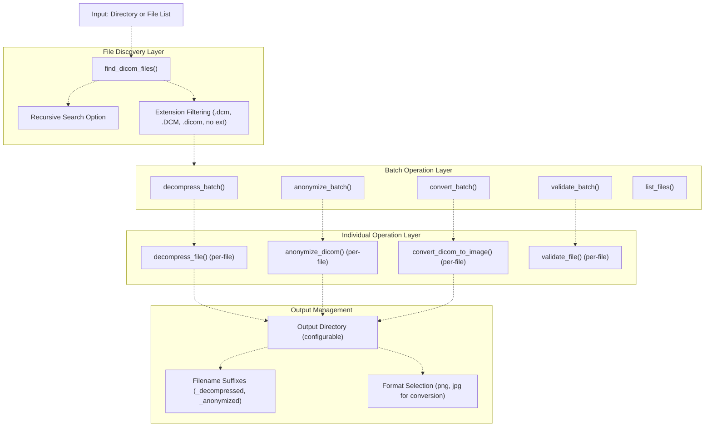
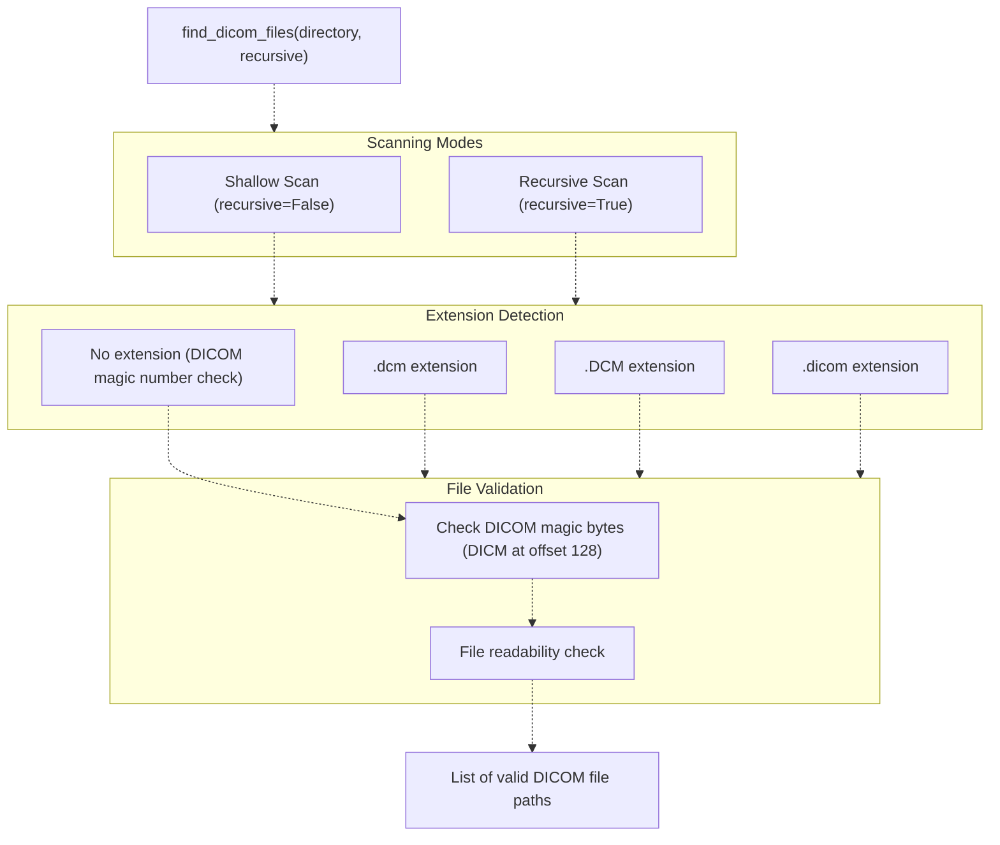
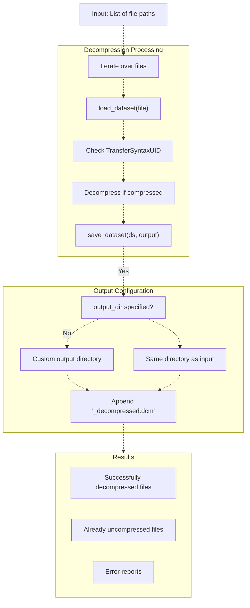
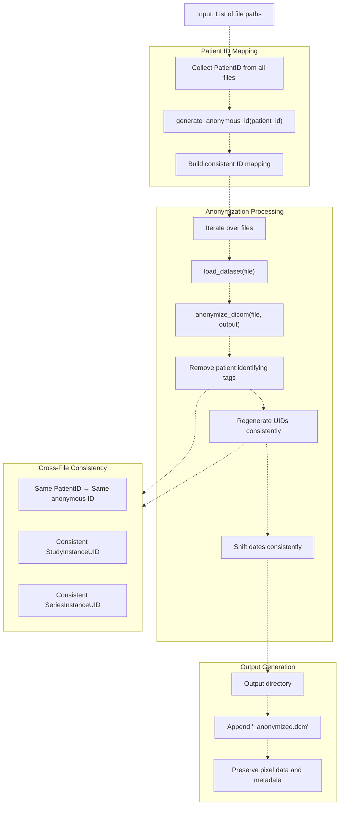
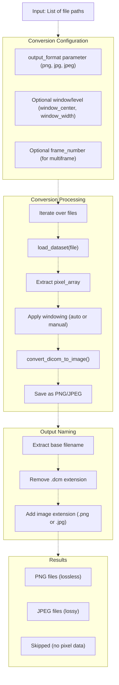
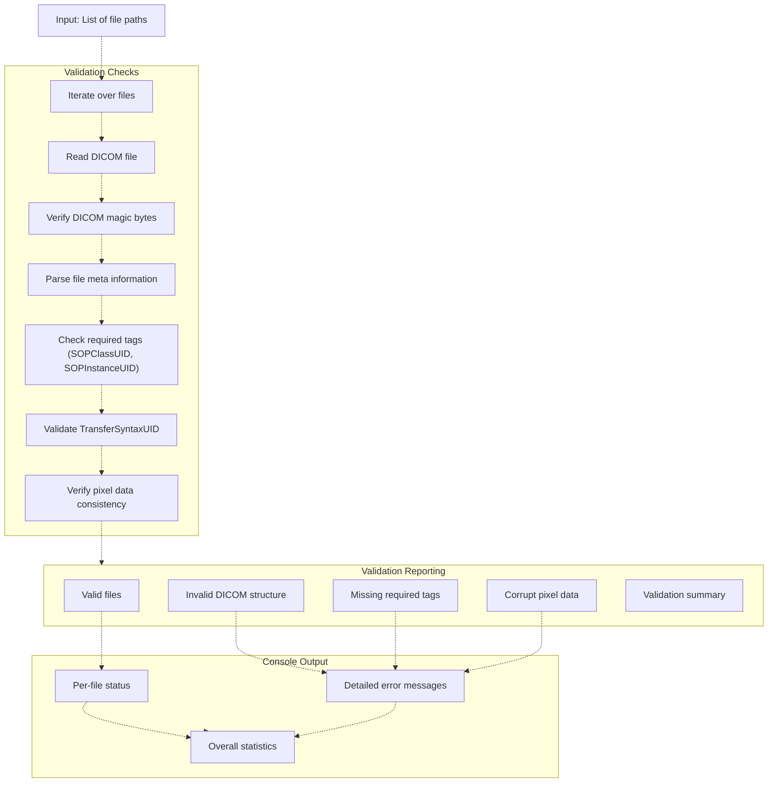
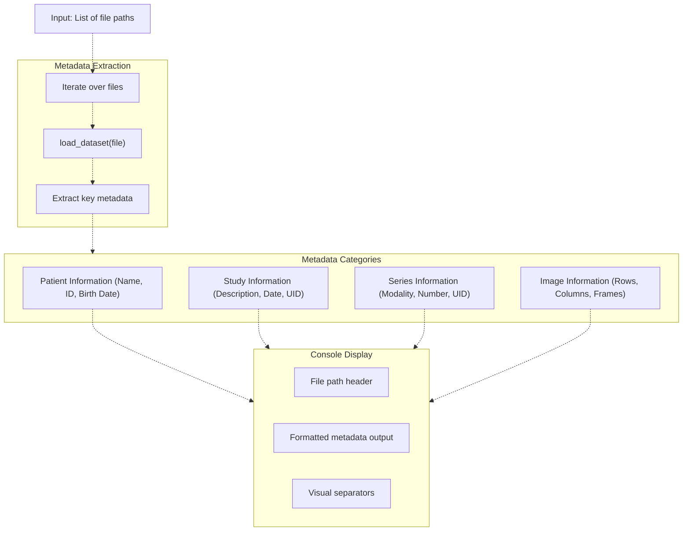
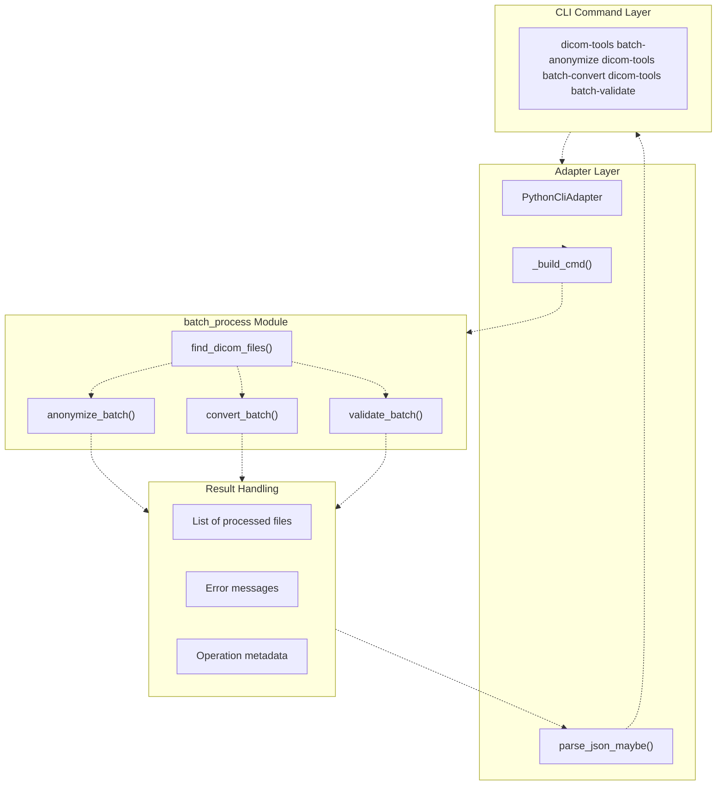
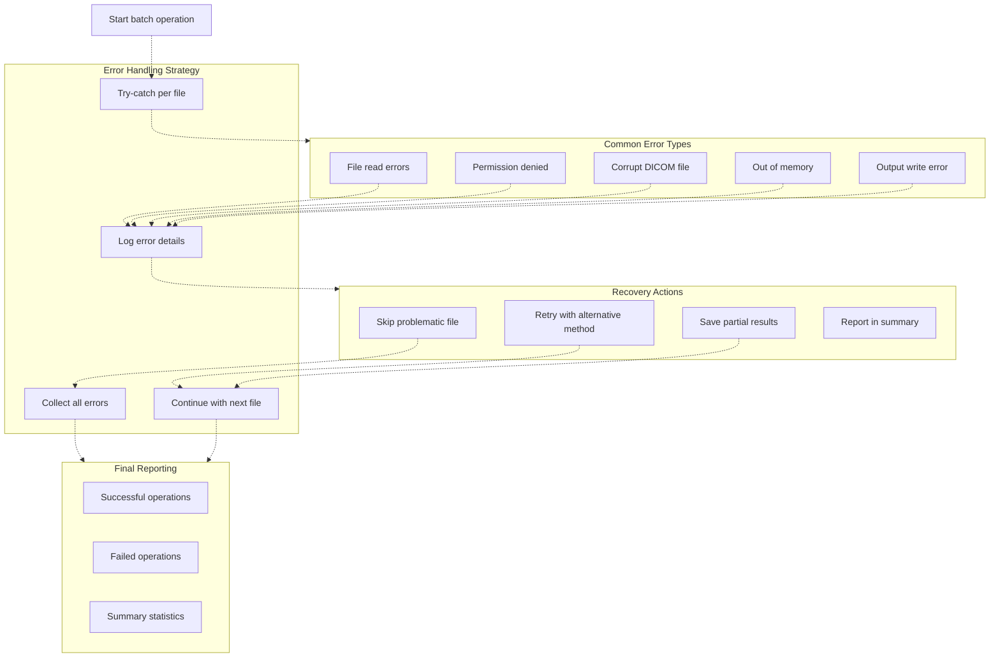

# Batch Processing

> **Relevant source files**
> * [python/tests/test_anonymize_dicom.py](https://github.com/ThalesMMS/Dicom-Tools/blob/c7b4cbd8/python/tests/test_anonymize_dicom.py)
> * [python/tests/test_batch_process.py](https://github.com/ThalesMMS/Dicom-Tools/blob/c7b4cbd8/python/tests/test_batch_process.py)
> * [python/tests/test_convert_to_image.py](https://github.com/ThalesMMS/Dicom-Tools/blob/c7b4cbd8/python/tests/test_convert_to_image.py)
> * [python/tests/test_core_modules.py](https://github.com/ThalesMMS/Dicom-Tools/blob/c7b4cbd8/python/tests/test_core_modules.py)
> * [python/tests/test_extract_metadata.py](https://github.com/ThalesMMS/Dicom-Tools/blob/c7b4cbd8/python/tests/test_extract_metadata.py)
> * [python/tests/test_modify_tags.py](https://github.com/ThalesMMS/Dicom-Tools/blob/c7b4cbd8/python/tests/test_modify_tags.py)
> * [python/tests/test_organize_dicom.py](https://github.com/ThalesMMS/Dicom-Tools/blob/c7b4cbd8/python/tests/test_organize_dicom.py)
> * [python/tests/test_pixel_stats.py](https://github.com/ThalesMMS/Dicom-Tools/blob/c7b4cbd8/python/tests/test_pixel_stats.py)

This page documents the batch processing capabilities for handling multiple DICOM files in a single operation. Batch processing includes automated file discovery, bulk decompression, anonymization, image conversion, and validation operations.

For individual file operations, see [Core File Operations](#5.1), [Image Conversion and Processing](#5.2), and [Tag Modification and Anonymization](#5.3). For organizing DICOM files by hierarchy, see the organization functions in the Python backend.

**Sources:** [python/tests/test_batch_process.py L1-L263](https://github.com/ThalesMMS/Dicom-Tools/blob/c7b4cbd8/python/tests/test_batch_process.py#L1-L263)

---

## Overview

The batch processing system provides efficient bulk operations on collections of DICOM files. All batch operations are implemented in the Python backend through the `DICOM_reencoder.batch_process` module.

### Core Capabilities

| Function | Purpose | Output Naming |
| --- | --- | --- |
| `find_dicom_files()` | Discovers DICOM files in directories | N/A (returns list) |
| `decompress_batch()` | Decompresses transfer syntaxes | `*_decompressed.dcm` |
| `anonymize_batch()` | Removes PHI from multiple files | `*_anonymized.dcm` |
| `convert_batch()` | Exports to image formats | `*.png`, `*.jpg` |
| `validate_batch()` | Validates DICOM conformance | Console output |
| `list_files()` | Displays file metadata | Console output |

**Sources:** [python/tests/test_batch_process.py L14-L21](https://github.com/ThalesMMS/Dicom-Tools/blob/c7b4cbd8/python/tests/test_batch_process.py#L14-L21)

---

## Batch Processing Architecture

The following diagram illustrates how batch operations build upon individual file operations:



**Sources:** [python/tests/test_batch_process.py L1-L263](https://github.com/ThalesMMS/Dicom-Tools/blob/c7b4cbd8/python/tests/test_batch_process.py#L1-L263)

---

## File Discovery System

### Finding DICOM Files

The `find_dicom_files()` function discovers DICOM files in directories with support for recursive traversal and flexible extension matching:



**Key Features:**

* **Recursive Search**: Traverses subdirectories when `recursive=True` [python/tests/test_batch_process.py L36-L48](https://github.com/ThalesMMS/Dicom-Tools/blob/c7b4cbd8/python/tests/test_batch_process.py#L36-L48)
* **Extension Tolerance**: Accepts `.dcm`, `.DCM`, `.dicom`, and files without extensions [python/tests/test_batch_process.py L50-L73](https://github.com/ThalesMMS/Dicom-Tools/blob/c7b4cbd8/python/tests/test_batch_process.py#L50-L73)
* **Content Validation**: Verifies DICOM magic bytes for extensionless files
* **Cross-Platform**: Handles path separators correctly on all platforms

**Sources:** [python/tests/test_batch_process.py L24-L74](https://github.com/ThalesMMS/Dicom-Tools/blob/c7b4cbd8/python/tests/test_batch_process.py#L24-L74)

---

## Batch Decompression

### Overview

The `decompress_batch()` function converts compressed DICOM files to explicit VR little endian transfer syntax:



### Usage Patterns

**With Output Directory:**

```
decompress_batch(file_paths, output_dir="/path/to/output")# Creates: /path/to/output/file1_decompressed.dcm#          /path/to/output/file2_decompressed.dcm
```

**Without Output Directory:**

```
decompress_batch(file_paths, output_dir=None)# Prints decompression status to console
```

**Sources:** [python/tests/test_batch_process.py L76-L106](https://github.com/ThalesMMS/Dicom-Tools/blob/c7b4cbd8/python/tests/test_batch_process.py#L76-L106)

---

## Batch Anonymization

### Overview

The `anonymize_batch()` function applies PHI removal to multiple files, maintaining consistency across series:



### Anonymization Guarantees

The batch anonymization maintains critical consistency across files:

| Property | Guarantee |
| --- | --- |
| **Patient ID** | Same original ID → Same anonymous ID |
| **Study UID** | Files from same study → Same new UID |
| **Series UID** | Files from same series → Same new UID |
| **Date Shift** | All dates shifted by consistent offset |
| **Pixel Data** | Preserved exactly |
| **Technical Parameters** | Preserved (KVP, SliceThickness, etc.) |

**Example Consistency Test:**

```
# All files in a series get same anonymous PatientIDanonymize_batch(series_paths, output_dir="anonymized/")anon_files = list(Path("anonymized/").glob("*.dcm"))patient_ids = {pydicom.dcmread(f).PatientID for f in anon_files}assert len(patient_ids) == 1  # All have same ID
```

**Sources:** [python/tests/test_batch_process.py L108-L154](https://github.com/ThalesMMS/Dicom-Tools/blob/c7b4cbd8/python/tests/test_batch_process.py#L108-L154)

 [python/tests/test_anonymize_dicom.py L312-L327](https://github.com/ThalesMMS/Dicom-Tools/blob/c7b4cbd8/python/tests/test_anonymize_dicom.py#L312-L327)

---

## Batch Image Conversion

### Overview

The `convert_batch()` function exports DICOM pixel data to standard image formats:



### Format Selection

| Format | Use Case | Quality | Size | Notes |
| --- | --- | --- | --- | --- |
| **PNG** | Archival, web display | Lossless | Larger | Default format |
| **JPEG** | Web thumbnails | Lossy | Smaller | Quality parameter available |

### Windowing Behavior

The conversion applies window/level transformation to map pixel values to display range:

1. **Auto-windowing** (default): Uses median and IQR from pixel data [python/tests/test_convert_to_image.py L59-L87](https://github.com/ThalesMMS/Dicom-Tools/blob/c7b4cbd8/python/tests/test_convert_to_image.py#L59-L87)
2. **Manual windowing**: Accepts `window_center` and `window_width` parameters [python/tests/test_convert_to_image.py L109-L122](https://github.com/ThalesMMS/Dicom-Tools/blob/c7b4cbd8/python/tests/test_convert_to_image.py#L109-L122)
3. **DICOM metadata**: Falls back to WindowCenter/WindowWidth tags if present

**Sources:** [python/tests/test_batch_process.py L156-L189](https://github.com/ThalesMMS/Dicom-Tools/blob/c7b4cbd8/python/tests/test_batch_process.py#L156-L189)

 [python/tests/test_convert_to_image.py L1-L184](https://github.com/ThalesMMS/Dicom-Tools/blob/c7b4cbd8/python/tests/test_convert_to_image.py#L1-L184)

---

## Batch Validation

### Overview

The `validate_batch()` function performs conformance checking on multiple DICOM files:



### Validation Errors Detected

The validation process identifies:

* **Structural Errors**: Invalid DICOM file structure, missing magic bytes
* **Tag Errors**: Missing required tags (SOPClassUID, SOPInstanceUID, StudyInstanceUID, SeriesInstanceUID)
* **Transfer Syntax Errors**: Invalid or unsupported transfer syntax UIDs
* **Pixel Data Errors**: Inconsistent pixel data dimensions or bit depth
* **VR Errors**: Incorrect value representation for tags

**Sources:** [python/tests/test_batch_process.py L191-L218](https://github.com/ThalesMMS/Dicom-Tools/blob/c7b4cbd8/python/tests/test_batch_process.py#L191-L218)

---

## File Listing and Metadata Display

### Overview

The `list_files()` function displays comprehensive metadata for multiple files:



### Metadata Fields Displayed

The listing includes (when present):

**Patient Level:**

* PatientName
* PatientID
* PatientBirthDate
* PatientSex

**Study Level:**

* StudyDescription
* StudyDate
* StudyTime
* StudyInstanceUID

**Series Level:**

* SeriesDescription
* SeriesNumber
* Modality
* SeriesInstanceUID

**Image Level:**

* Rows, Columns
* NumberOfFrames
* BitsAllocated, BitsStored
* PhotometricInterpretation
* TransferSyntaxUID

**Sources:** [python/tests/test_batch_process.py L221-L263](https://github.com/ThalesMMS/Dicom-Tools/blob/c7b4cbd8/python/tests/test_batch_process.py#L221-L263)

---

## Integration with CLI and Adapters

The batch processing functions integrate with the CLI contract system through wrapper commands:



### Batch Operation Request Format

When invoked through the CLI contract, batch operations follow this request structure:

```
{  "op": "batch_anonymize",  "input": "/path/to/directory",  "output": "/path/to/output",  "options": {    "recursive": true,    "patient_prefix": "ANON"  }}
```

**Response Format:**

```
{  "ok": true,  "returncode": 0,  "output_files": [    "/path/to/output/file1_anonymized.dcm",    "/path/to/output/file2_anonymized.dcm"  ],  "metadata": {    "files_processed": 2,    "files_skipped": 0,    "errors": []  }}
```

**Sources:** [python/tests/test_batch_process.py L1-L263](https://github.com/ThalesMMS/Dicom-Tools/blob/c7b4cbd8/python/tests/test_batch_process.py#L1-L263)

---

## Error Handling and Recovery

Batch operations implement robust error handling to continue processing despite individual file failures:



### Error Handling Behavior

| Error Type | Batch Response | Individual File | Affects Completion |
| --- | --- | --- | --- |
| **Read Error** | Log and continue | Skipped | No |
| **Corrupt DICOM** | Log and continue | Skipped | No |
| **Permission Error** | Log and continue | Skipped | No |
| **Out of Memory** | Abort batch | All remaining skipped | Yes |
| **Output Write Error** | Log and continue | Skipped | No |

**Sources:** [python/tests/test_batch_process.py L203-L218](https://github.com/ThalesMMS/Dicom-Tools/blob/c7b4cbd8/python/tests/test_batch_process.py#L203-L218)

---

## Performance Considerations

### Memory Management

Batch operations process files sequentially to manage memory usage:

* **Sequential Processing**: Files loaded one at a time [python/tests/test_batch_process.py L111-L122](https://github.com/ThalesMMS/Dicom-Tools/blob/c7b4cbd8/python/tests/test_batch_process.py#L111-L122)
* **Dataset Cleanup**: Each dataset released after processing
* **Pixel Array Handling**: Large pixel arrays not kept in memory simultaneously

### Optimization Strategies

**For Large Batches:**

1. Use recursive file discovery once, store paths
2. Process in chunks if memory constrained
3. Use output directory to avoid in-place modifications
4. Disable verbose logging for faster execution

**For Series Processing:**

1. Group files by SeriesInstanceUID before processing
2. Maintain UID consistency within series
3. Process series sequentially to ensure consistency

**Sources:** [python/tests/test_batch_process.py L1-L263](https://github.com/ThalesMMS/Dicom-Tools/blob/c7b4cbd8/python/tests/test_batch_process.py#L1-L263)

Refresh this wiki

Last indexed: 5 January 2026 ([c7b4cb](https://github.com/ThalesMMS/Dicom-Tools/commit/c7b4cbd8))

### On this page

* [Batch Processing](#5.6-batch-processing)
* [Overview](#5.6-overview)
* [Core Capabilities](#5.6-core-capabilities)
* [Batch Processing Architecture](#5.6-batch-processing-architecture)
* [File Discovery System](#5.6-file-discovery-system)
* [Finding DICOM Files](#5.6-finding-dicom-files)
* [Batch Decompression](#5.6-batch-decompression)
* [Overview](#5.6-overview-1)
* [Usage Patterns](#5.6-usage-patterns)
* [Batch Anonymization](#5.6-batch-anonymization)
* [Overview](#5.6-overview-2)
* [Anonymization Guarantees](#5.6-anonymization-guarantees)
* [Batch Image Conversion](#5.6-batch-image-conversion)
* [Overview](#5.6-overview-3)
* [Format Selection](#5.6-format-selection)
* [Windowing Behavior](#5.6-windowing-behavior)
* [Batch Validation](#5.6-batch-validation)
* [Overview](#5.6-overview-4)
* [Validation Errors Detected](#5.6-validation-errors-detected)
* [File Listing and Metadata Display](#5.6-file-listing-and-metadata-display)
* [Overview](#5.6-overview-5)
* [Metadata Fields Displayed](#5.6-metadata-fields-displayed)
* [Integration with CLI and Adapters](#5.6-integration-with-cli-and-adapters)
* [Batch Operation Request Format](#5.6-batch-operation-request-format)
* [Error Handling and Recovery](#5.6-error-handling-and-recovery)
* [Error Handling Behavior](#5.6-error-handling-behavior)
* [Performance Considerations](#5.6-performance-considerations)
* [Memory Management](#5.6-memory-management)
* [Optimization Strategies](#5.6-optimization-strategies)

Ask Devin about Dicom-Tools