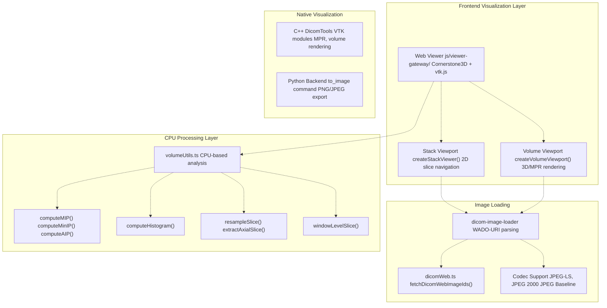
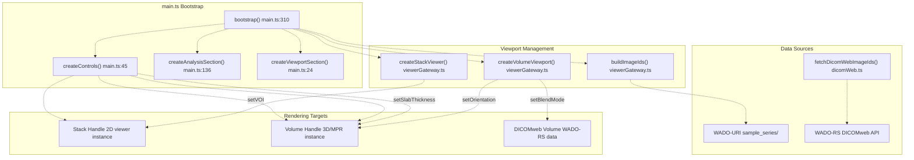
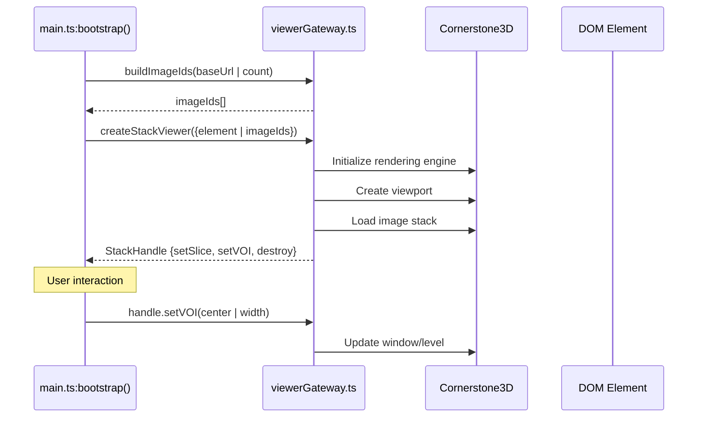
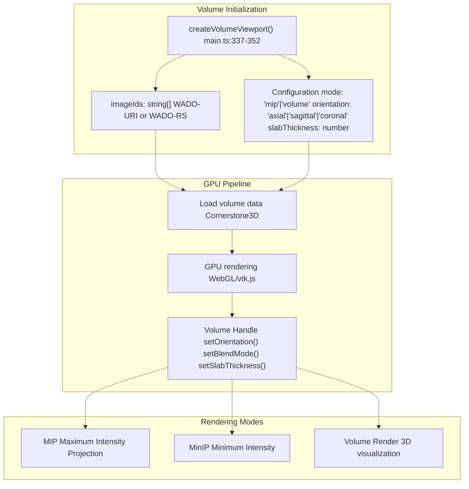
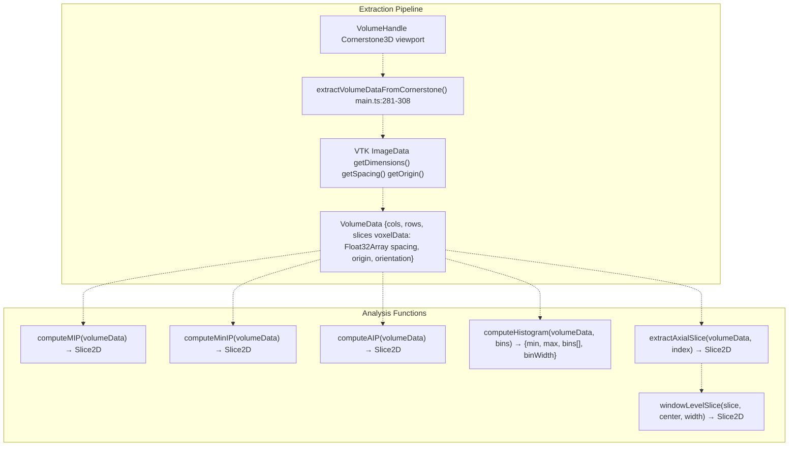
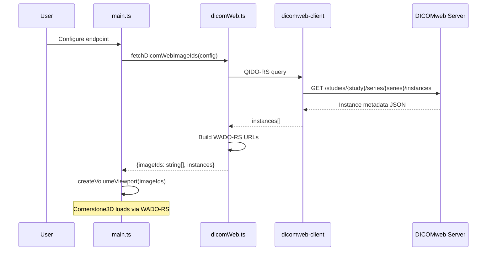
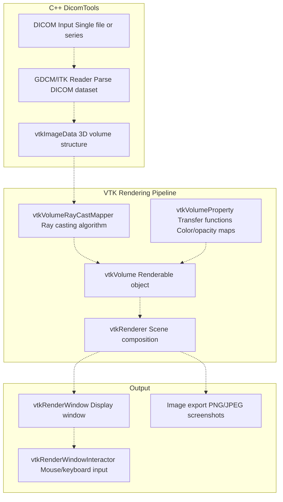
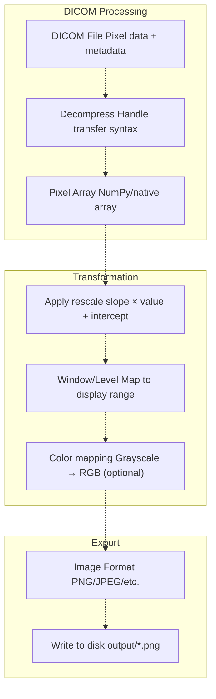
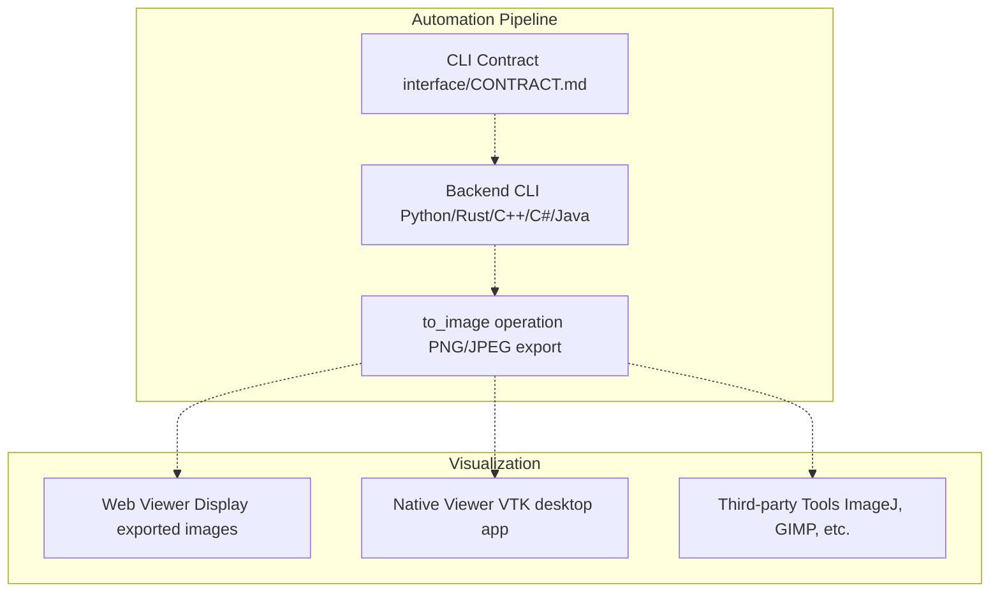

# 6 Visualization

> **Relevant source files**
> * [BUILD.md](https://github.com/ThalesMMS/Dicom-Tools/blob/c7b4cbd8/BUILD.md)
> * [README.md](https://github.com/ThalesMMS/Dicom-Tools/blob/c7b4cbd8/README.md)
> * [js/viewer-gateway/src/main.ts](https://github.com/ThalesMMS/Dicom-Tools/blob/c7b4cbd8/js/viewer-gateway/src/main.ts)
> * [js/viewer-gateway/tests/main.entry.test.ts](https://github.com/ThalesMMS/Dicom-Tools/blob/c7b4cbd8/js/viewer-gateway/tests/main.entry.test.ts)
> * [python/screenshots/ui.png](https://github.com/ThalesMMS/Dicom-Tools/blob/c7b4cbd8/python/screenshots/ui.png)
> * [scripts/setup_all.sh](https://github.com/ThalesMMS/Dicom-Tools/blob/c7b4cbd8/scripts/setup_all.sh)

## Purpose and Scope

This page covers the visualization capabilities available in the Dicom-Tools repository, focusing on how DICOM medical images are rendered and interacted with. The system provides both web-based GPU-accelerated viewers and native desktop visualization tools.

For information about converting DICOM files to standard image formats (PNG, JPEG), see [Image Conversion and Processing](5b%20Image-Conversion-and-Processing.md). For network-based image retrieval (DICOMweb, WADO), see [Network Operations](5e%20Network-Operations.md).

**Sources:** [README.md L1-L43](https://github.com/ThalesMMS/Dicom-Tools/blob/c7b4cbd8/README.md#L1-L43)

---

## Visualization Architecture

The Dicom-Tools repository provides multiple visualization approaches depending on deployment requirements and performance needs:

| Visualization Mode | Technology Stack | Use Case |
| --- | --- | --- |
| **Web Viewer** | Cornerstone3D, vtk.js, WebGL | Browser-based, no installation required |
| **C++ VTK Desktop** | VTK, ITK, OpenGL | High-performance native applications |
| **Image Export** | All backends | Integration with external viewers |

### Component Overview

**Sources:** [js/viewer-gateway/src/main.ts L1-L490](https://github.com/ThalesMMS/Dicom-Tools/blob/c7b4cbd8/js/viewer-gateway/src/main.ts#L1-L490)

 [README.md L14-L22](https://github.com/ThalesMMS/Dicom-Tools/blob/c7b4cbd8/README.md#L14-L22)

---

## Web Viewer Architecture

The web-based viewer is built on Cornerstone3D and provides GPU-accelerated medical image rendering in the browser. The main entry point is [js/viewer-gateway/src/main.ts L310-L490](https://github.com/ThalesMMS/Dicom-Tools/blob/c7b4cbd8/js/viewer-gateway/src/main.ts#L310-L490)

### Core Components

**Sources:** [js/viewer-gateway/src/main.ts L310-L353](https://github.com/ThalesMMS/Dicom-Tools/blob/c7b4cbd8/js/viewer-gateway/src/main.ts#L310-L353)

 [js/viewer-gateway/tests/main.entry.test.ts L1-L173](https://github.com/ThalesMMS/Dicom-Tools/blob/c7b4cbd8/js/viewer-gateway/tests/main.entry.test.ts#L1-L173)

---

## Stack Viewport (2D Viewing)

The stack viewport provides traditional 2D slice-by-slice navigation through DICOM series, similar to PACS workstations.

### Initialization

The `createStackViewer()` function from `viewerGateway.ts` creates a 2D viewport:

### Window/Level Controls

VOI (Value of Interest) presets are defined in [js/viewer-gateway/src/presets.ts](https://github.com/ThalesMMS/Dicom-Tools/blob/c7b4cbd8/js/viewer-gateway/src/presets.ts)

:

| Preset | Center | Width | Use Case |
| --- | --- | --- | --- |
| `soft` | 40 | 400 | Soft tissue |
| `bone` | 400 | 1800 | Skeletal structures |
| `lung` | -600 | 1500 | Lung parenchyma |

Users can apply presets via buttons or manually adjust center/width values [js/viewer-gateway/src/main.ts L76-L82](https://github.com/ThalesMMS/Dicom-Tools/blob/c7b4cbd8/js/viewer-gateway/src/main.ts#L76-L82)

**Sources:** [js/viewer-gateway/src/main.ts L327-L334](https://github.com/ThalesMMS/Dicom-Tools/blob/c7b4cbd8/js/viewer-gateway/src/main.ts#L327-L334)

 [js/viewer-gateway/src/main.ts L395-L410](https://github.com/ThalesMMS/Dicom-Tools/blob/c7b4cbd8/js/viewer-gateway/src/main.ts#L395-L410)

---

## Volume Viewport (3D/MPR Rendering)

The volume viewport provides GPU-accelerated 3D rendering with support for multi-planar reconstruction (MPR), maximum intensity projection (MIP), and volume rendering.

### Viewport Creation

### Orientation Control

The volume viewport supports three standard anatomical orientations:

* **Axial**: Horizontal slices (head to foot)
* **Sagittal**: Vertical slices (left to right)
* **Coronal**: Vertical slices (front to back)

Users can switch orientations at runtime [js/viewer-gateway/src/main.ts L52-L58](https://github.com/ThalesMMS/Dicom-Tools/blob/c7b4cbd8/js/viewer-gateway/src/main.ts#L52-L58)

 and the system applies the transformation via `volumeHandle.setOrientation()` [js/viewer-gateway/src/main.ts L385-L393](https://github.com/ThalesMMS/Dicom-Tools/blob/c7b4cbd8/js/viewer-gateway/src/main.ts#L385-L393)

### Slab Thickness

For MIP/MinIP rendering, slab thickness controls how many slices are projected together. The default is 25 slices [js/viewer-gateway/src/main.ts L72-L74](https://github.com/ThalesMMS/Dicom-Tools/blob/c7b4cbd8/js/viewer-gateway/src/main.ts#L72-L74)

 adjustable via numeric input.

**Sources:** [js/viewer-gateway/src/main.ts L337-L352](https://github.com/ThalesMMS/Dicom-Tools/blob/c7b4cbd8/js/viewer-gateway/src/main.ts#L337-L352)

 [js/viewer-gateway/src/main.ts L385-L393](https://github.com/ThalesMMS/Dicom-Tools/blob/c7b4cbd8/js/viewer-gateway/src/main.ts#L385-L393)

---

## CPU-Based Volume Analysis

The `volumeUtils.ts` module provides CPU-based image processing operations for scenarios where GPU processing is unavailable or when custom algorithms are needed [js/viewer-gateway/src/main.ts L7-L17](https://github.com/ThalesMMS/Dicom-Tools/blob/c7b4cbd8/js/viewer-gateway/src/main.ts#L7-L17)

### Data Extraction

Volume data is extracted from Cornerstone3D's internal structures:

### Projection Types

The system implements three projection algorithms [js/viewer-gateway/src/main.ts L434-L447](https://github.com/ThalesMMS/Dicom-Tools/blob/c7b4cbd8/js/viewer-gateway/src/main.ts#L434-L447)

:

| Function | Algorithm | Output |
| --- | --- | --- |
| `computeMIP()` | Maximum intensity across depth | Highlights bright structures |
| `computeMinIP()` | Minimum intensity across depth | Highlights dark structures |
| `computeAIP()` | Average intensity across depth | Balanced representation |

### Histogram Computation

The histogram function [js/viewer-gateway/src/main.ts L479-L486](https://github.com/ThalesMMS/Dicom-Tools/blob/c7b4cbd8/js/viewer-gateway/src/main.ts#L479-L486)

 bins the voxel intensities and returns statistics:

* **Bins**: Configurable count (default 256)
* **Range**: `[min, max]` of voxel values
* **Bin width**: `(max - min) / bins`

Visual rendering is handled by `drawHistogram()` [js/viewer-gateway/src/main.ts L256-L279](https://github.com/ThalesMMS/Dicom-Tools/blob/c7b4cbd8/js/viewer-gateway/src/main.ts#L256-L279)

 which draws a bar chart to canvas.

### Slice Resampling

The `resampleSlice()` function [js/viewer-gateway/src/main.ts L465-L477](https://github.com/ThalesMMS/Dicom-Tools/blob/c7b4cbd8/js/viewer-gateway/src/main.ts#L465-L477)

 provides bilinear interpolation to resize 2D slices to arbitrary dimensions, useful for:

* Thumbnail generation
* Uniform spacing across mixed-resolution series
* Export to fixed-size formats

**Sources:** [js/viewer-gateway/src/main.ts L281-L308](https://github.com/ThalesMMS/Dicom-Tools/blob/c7b4cbd8/js/viewer-gateway/src/main.ts#L281-L308)

 [js/viewer-gateway/src/main.ts L434-L487](https://github.com/ThalesMMS/Dicom-Tools/blob/c7b4cbd8/js/viewer-gateway/src/main.ts#L434-L487)

---

## DICOMweb Integration

The viewer supports loading images directly from DICOMweb servers using QIDO-RS (query) and WADO-RS (retrieve) [js/viewer-gateway/src/main.ts L354-L383](https://github.com/ThalesMMS/Dicom-Tools/blob/c7b4cbd8/js/viewer-gateway/src/main.ts#L354-L383)

### Configuration

DICOMweb endpoints can be configured via:

1. **Environment variables**: `VITE_DICOMWEB_BASE`, `VITE_DICOMWEB_STUDY`, `VITE_DICOMWEB_SERIES` [js/viewer-gateway/src/config.ts](https://github.com/ThalesMMS/Dicom-Tools/blob/c7b4cbd8/js/viewer-gateway/src/config.ts)
2. **Runtime UI**: Input fields for base URL, StudyInstanceUID, SeriesInstanceUID [js/viewer-gateway/src/main.ts L97-L105](https://github.com/ThalesMMS/Dicom-Tools/blob/c7b4cbd8/js/viewer-gateway/src/main.ts#L97-L105)

### Loading Flow

**Sources:** [js/viewer-gateway/src/main.ts L354-L383](https://github.com/ThalesMMS/Dicom-Tools/blob/c7b4cbd8/js/viewer-gateway/src/main.ts#L354-L383)

 [js/viewer-gateway/src/main.ts L413-L420](https://github.com/ThalesMMS/Dicom-Tools/blob/c7b4cbd8/js/viewer-gateway/src/main.ts#L413-L420)

---

## C++ VTK Visualization

The C++ backend provides native desktop visualization using VTK for high-performance rendering [README.md L18](https://github.com/ThalesMMS/Dicom-Tools/blob/c7b4cbd8/README.md#L18-L18)

### Capabilities

| Feature | Implementation | Command |
| --- | --- | --- |
| **MPR** | Multi-planar reconstruction | `DicomTools vtk_mpr ...` |
| **Volume Rendering** | Direct volume rendering with transfer functions | `DicomTools vtk_volume_render ...` |
| **Surface Rendering** | Marching cubes isosurface extraction | Via VTK modules |

### VTK Pipeline

The C++ implementation is particularly suited for:

* **Large datasets**: Native memory management
* **Custom algorithms**: Direct VTK API access
* **Batch processing**: Automated rendering pipelines
* **SR/RT support**: Structured reports and radiotherapy visualization [README.md L18](https://github.com/ThalesMMS/Dicom-Tools/blob/c7b4cbd8/README.md#L18-L18)

**Sources:** [README.md L18](https://github.com/ThalesMMS/Dicom-Tools/blob/c7b4cbd8/README.md#L18-L18)

 [BUILD.md L27](https://github.com/ThalesMMS/Dicom-Tools/blob/c7b4cbd8/BUILD.md#L27-L27)

---

## Image Export and Conversion

All backends provide image export capabilities for integration with external viewers and analysis tools.

### Backend Comparison

| Backend | Command | Supported Formats | Special Features |
| --- | --- | --- | --- |
| **Python** | `to_image` | PNG, JPEG, BMP, TIFF | Window/level, frame selection |
| **Rust** | `to-image` | PNG, JPEG | Multi-frame support |
| **C++** | `to_image` | PNG, JPEG | ITK/VTK integration |
| **C#** | `to-image` | PNG, JPEG, BMP | fo-dicom codecs |
| **Java** | `to_image` | PNG, JPEG | dcm4che imaging |

### Python Backend Example

The Python `to_image` command [README.md L16](https://github.com/ThalesMMS/Dicom-Tools/blob/c7b4cbd8/README.md#L16-L16)

 supports:

* **Window/level adjustment**: `--window-center`, `--window-width`
* **Frame selection**: `--frame` for multi-frame images
* **Grayscale/RGB**: Automatic detection
* **Rescale slope/intercept**: Applied automatically

### Export Workflow

**Sources:** [README.md L16-L20](https://github.com/ThalesMMS/Dicom-Tools/blob/c7b4cbd8/README.md#L16-L20)

 [BUILD.md L25-L32](https://github.com/ThalesMMS/Dicom-Tools/blob/c7b4cbd8/BUILD.md#L25-L32)

---

## Testing and Validation

### Web Viewer Tests

The web viewer includes comprehensive Vitest tests [js/viewer-gateway/tests/main.entry.test.ts L1-L173](https://github.com/ThalesMMS/Dicom-Tools/blob/c7b4cbd8/js/viewer-gateway/tests/main.entry.test.ts#L1-L173)

:

* **Viewport mounting**: Verifies `createStackViewer()` and `createVolumeViewport()` are called
* **DICOMweb flow**: Tests configuration and image loading
* **Error handling**: Validates failure scenarios
* **Control interactions**: Simulates button clicks and input changes

### C++ VTK Tests

The C++ test suite [BUILD.md L27](https://github.com/ThalesMMS/Dicom-Tools/blob/c7b4cbd8/BUILD.md#L27-L27)

 includes:

* **Rendering validation**: Screenshots compared against baselines
* **Memory checks**: VTK object lifecycle verification
* **Module loading**: Ensures all VTK modules are available

### Cross-Backend Validation

The interface tests validate that all backends produce consistent visual output:

1. **Convert DICOM to PNG** using each backend
2. **Compare pixel values** (allowing for minor codec differences)
3. **Validate metadata** preservation in exported images

**Sources:** [js/viewer-gateway/tests/main.entry.test.ts L70-L172](https://github.com/ThalesMMS/Dicom-Tools/blob/c7b4cbd8/js/viewer-gateway/tests/main.entry.test.ts#L70-L172)

 [BUILD.md L24-L33](https://github.com/ThalesMMS/Dicom-Tools/blob/c7b4cbd8/BUILD.md#L24-L33)

---

## Performance Considerations

### GPU vs. CPU Processing

| Scenario | Recommendation | Rationale |
| --- | --- | --- |
| Real-time interaction | GPU (Cornerstone3D) | Hardware-accelerated rendering |
| Batch analysis | CPU (volumeUtils) | Predictable memory usage |
| Large volumes (>1000 slices) | C++ VTK | Native performance, disk paging |
| Remote viewing | Web viewer + streaming | Progressive loading, no installation |

### Memory Management

The volume extraction function [js/viewer-gateway/src/main.ts L281-L308](https://github.com/ThalesMMS/Dicom-Tools/blob/c7b4cbd8/js/viewer-gateway/src/main.ts#L281-L308)

 creates a cached `VolumeData` structure [js/viewer-gateway/src/main.ts L322-L432](https://github.com/ThalesMMS/Dicom-Tools/blob/c7b4cbd8/js/viewer-gateway/src/main.ts#L322-L432)

 to avoid repeated extraction. This cache is invalidated when:

* New volume is loaded
* DICOMweb data refreshes
* Viewport is destroyed

### Codec Performance

Cornerstone3D supports hardware-accelerated codecs via WebAssembly [README.md L21](https://github.com/ThalesMMS/Dicom-Tools/blob/c7b4cbd8/README.md#L21-L21)

:

* **JPEG-LS**: `codec-charls`
* **JPEG 2000**: `codec-openjpeg`
* **JPEG Baseline**: `codec-libjpeg-turbo`

These codecs are loaded on-demand and cached by the browser.

**Sources:** [js/viewer-gateway/src/main.ts L281-L308](https://github.com/ThalesMMS/Dicom-Tools/blob/c7b4cbd8/js/viewer-gateway/src/main.ts#L281-L308)

 [js/viewer-gateway/src/main.ts L422-L432](https://github.com/ThalesMMS/Dicom-Tools/blob/c7b4cbd8/js/viewer-gateway/src/main.ts#L422-L432)

 [README.md L21](https://github.com/ThalesMMS/Dicom-Tools/blob/c7b4cbd8/README.md#L21-L21)

---

## Integration with CLI Contract

The visualization components can be integrated with the CLI contract system (see [CLI Contract System](3%20CLI-Contract-System.md)) for automated workflows:

The contract runner [Contract Runner](2b%20Contract-Runner-%28Headless-CLI%29.md) can be used to batch-convert entire DICOM series to standard image formats, which are then loaded into visualization tools.

**Sources:** [README.md L42](https://github.com/ThalesMMS/Dicom-Tools/blob/c7b4cbd8/README.md#L42-L42)

 [BUILD.md L34-L41](https://github.com/ThalesMMS/Dicom-Tools/blob/c7b4cbd8/BUILD.md#L34-L41)

### On this page

* [Visualization](6%20Visualization.md)
* [Purpose and Scope](6%20Visualization.md)
* [Visualization Architecture](6%20Visualization.md)
* [Component Overview](6%20Visualization.md)
* [Web Viewer Architecture](6%20Visualization.md)
* [Core Components](6%20Visualization.md)
* [Stack Viewport (2D Viewing)](6%20Visualization.md)
* [Initialization](6%20Visualization.md)
* [Window/Level Controls](6%20Visualization.md)
* [Volume Viewport (3D/MPR Rendering)](6%20Visualization.md)
* [Viewport Creation](6%20Visualization.md)
* [Orientation Control](6%20Visualization.md)
* [Slab Thickness](6%20Visualization.md)
* [CPU-Based Volume Analysis](6%20Visualization.md)
* [Data Extraction](6%20Visualization.md)
* [Projection Types](6%20Visualization.md)
* [Histogram Computation](6%20Visualization.md)
* [Slice Resampling](6%20Visualization.md)
* [DICOMweb Integration](6%20Visualization.md)
* [Configuration](6%20Visualization.md)
* [Loading Flow](6%20Visualization.md)
* [C++ VTK Visualization](6%20Visualization.md)
* [Capabilities](6%20Visualization.md)
* [VTK Pipeline](6%20Visualization.md)
* [Image Export and Conversion](6%20Visualization.md)
* [Backend Comparison](6%20Visualization.md)
* [Python Backend Example](6%20Visualization.md)
* [Export Workflow](6%20Visualization.md)
* [Testing and Validation](6%20Visualization.md)
* [Web Viewer Tests](6%20Visualization.md)
* [C++ VTK Tests](6%20Visualization.md)
* [Cross-Backend Validation](6%20Visualization.md)
* [Performance Considerations](6%20Visualization.md)
* [GPU vs. CPU Processing](6%20Visualization.md)
* [Memory Management](6%20Visualization.md)
* [Codec Performance](6%20Visualization.md)
* [Integration with CLI Contract](6%20Visualization.md)

Ask Devin about Dicom-Tools