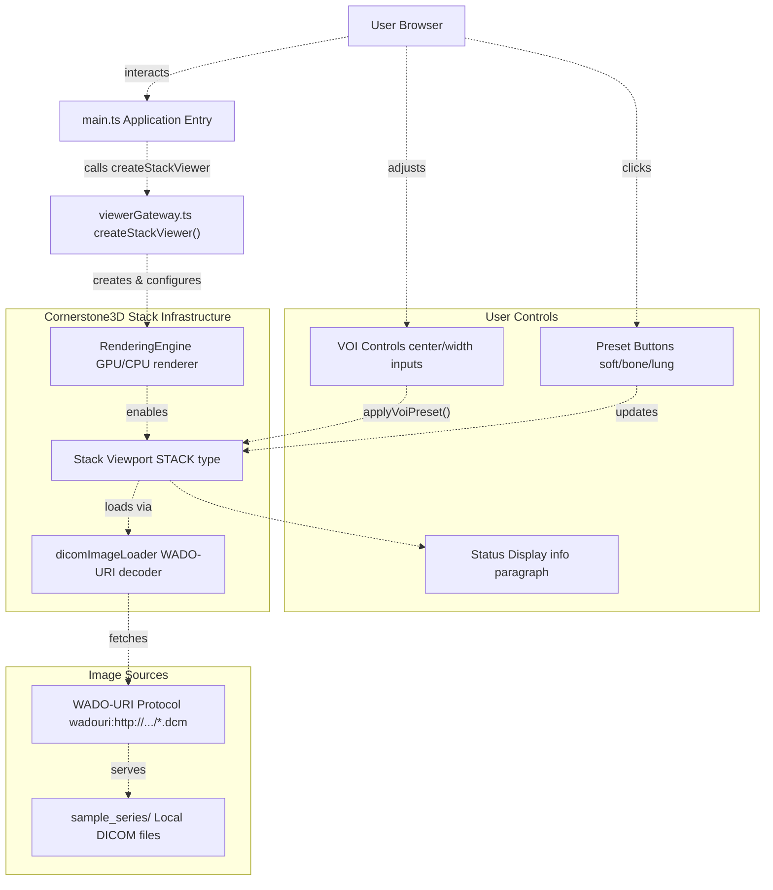
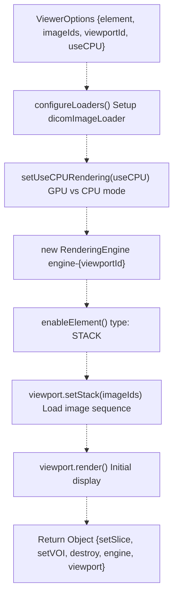
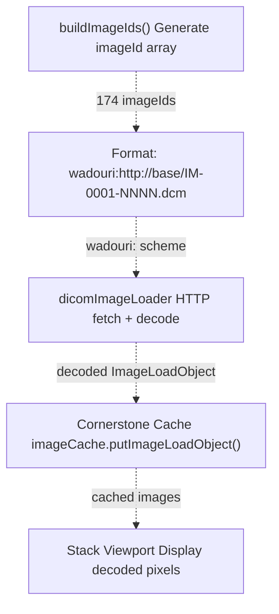
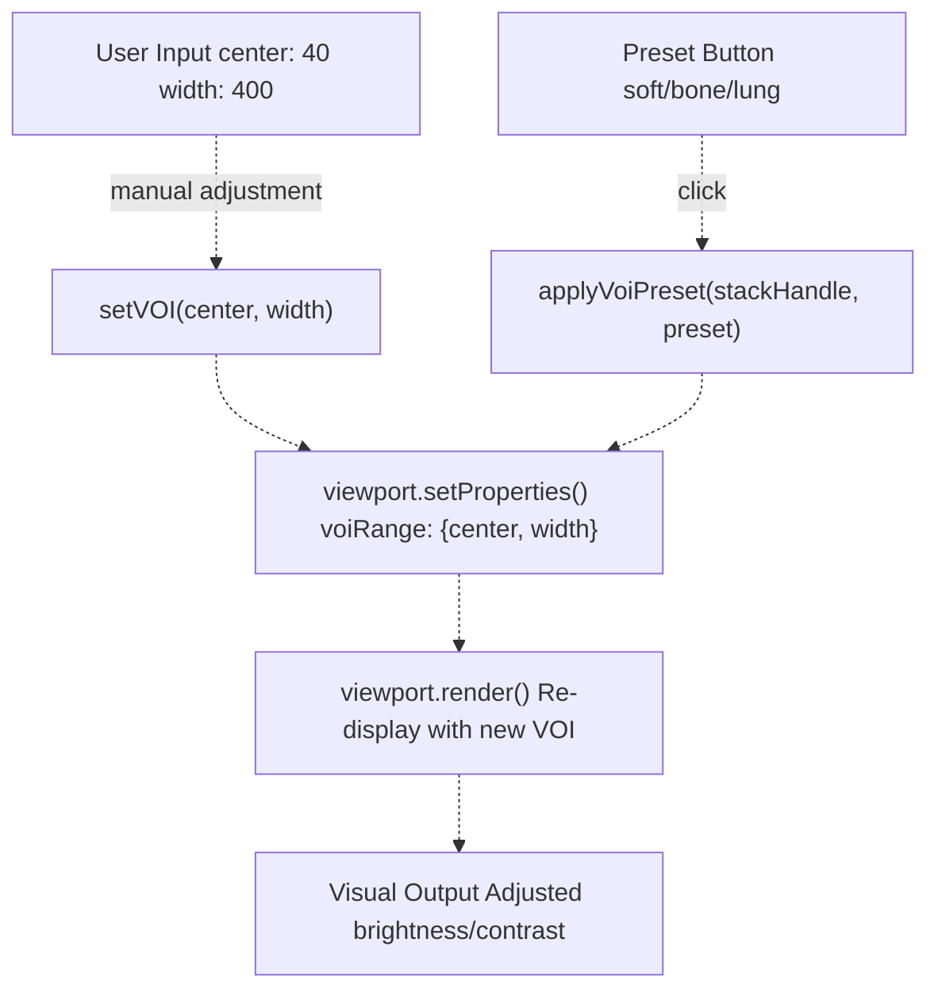
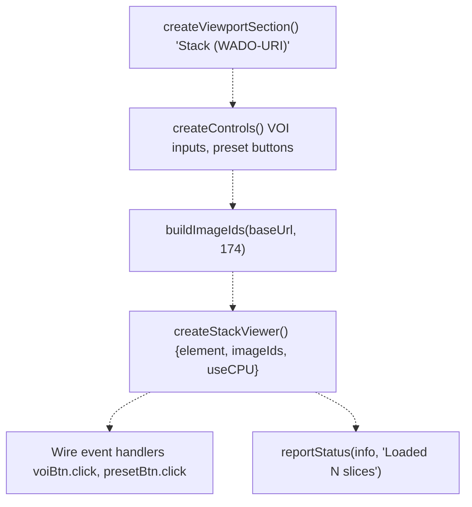
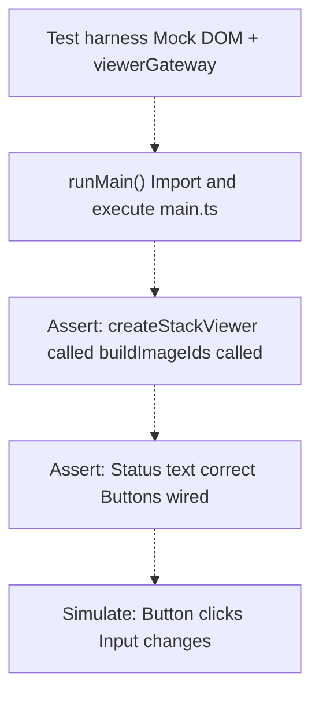

# 2D Stack Viewing

> **Relevant source files**
> * [js/INTEGRATION.md](https://github.com/ThalesMMS/Dicom-Tools/blob/c7b4cbd8/js/INTEGRATION.md)
> * [js/viewer-gateway/src/imageIds.ts](https://github.com/ThalesMMS/Dicom-Tools/blob/c7b4cbd8/js/viewer-gateway/src/imageIds.ts)
> * [js/viewer-gateway/src/main.ts](https://github.com/ThalesMMS/Dicom-Tools/blob/c7b4cbd8/js/viewer-gateway/src/main.ts)
> * [js/viewer-gateway/src/viewerGateway.ts](https://github.com/ThalesMMS/Dicom-Tools/blob/c7b4cbd8/js/viewer-gateway/src/viewerGateway.ts)
> * [js/viewer-gateway/tests/main.entry.test.ts](https://github.com/ThalesMMS/Dicom-Tools/blob/c7b4cbd8/js/viewer-gateway/tests/main.entry.test.ts)
> * [js/viewer-gateway/tests/sampleSeries.integration.test.ts](https://github.com/ThalesMMS/Dicom-Tools/blob/c7b4cbd8/js/viewer-gateway/tests/sampleSeries.integration.test.ts)
> * [python/screenshots/ui.png](https://github.com/ThalesMMS/Dicom-Tools/blob/c7b4cbd8/python/screenshots/ui.png)

## Purpose and Scope

This document describes the 2D stack viewing capability in the JavaScript web viewer, which enables slice-by-slice navigation through DICOM series in the browser. Stack viewing is the fundamental mode for displaying sequential medical images (CT, MR, etc.) where the user scrolls through individual slices along an acquisition axis.

For 3D volume rendering and multi-planar reconstruction capabilities, see [3D Volume Rendering](#6.2). For CPU-based image analysis operations (projections, histograms, windowing), see [CPU-Based Analysis](#6.3).

**Sources:** [js/viewer-gateway/src/main.ts L1-L490](https://github.com/ThalesMMS/Dicom-Tools/blob/c7b4cbd8/js/viewer-gateway/src/main.ts#L1-L490)

 [js/INTEGRATION.md L1-L94](https://github.com/ThalesMMS/Dicom-Tools/blob/c7b4cbd8/js/INTEGRATION.md#L1-L94)

---

## Architecture Overview

The stack viewer is built on Cornerstone3D and operates within the larger viewer-gateway architecture:



**Diagram: Stack Viewer Component Architecture**

The stack viewer follows a rendering pipeline where DICOM images are loaded via WADO-URI, decoded by the DICOM image loader, and rendered through a GPU-accelerated stack viewport. User interactions (VOI adjustments, slice navigation) trigger viewport updates and re-renders.

**Sources:** [js/viewer-gateway/src/viewerGateway.ts L1-L147](https://github.com/ThalesMMS/Dicom-Tools/blob/c7b4cbd8/js/viewer-gateway/src/viewerGateway.ts#L1-L147)

 [js/viewer-gateway/src/main.ts L310-L334](https://github.com/ThalesMMS/Dicom-Tools/blob/c7b4cbd8/js/viewer-gateway/src/main.ts#L310-L334)

---

## Stack Viewer Implementation

### Core Function: createStackViewer

The `createStackViewer` function is the primary API for initializing a 2D stack viewport:



**Diagram: createStackViewer Initialization Flow**

**Sources:** [js/viewer-gateway/src/viewerGateway.ts L33-L63](https://github.com/ThalesMMS/Dicom-Tools/blob/c7b4cbd8/js/viewer-gateway/src/viewerGateway.ts#L33-L63)

### Implementation Details

| Component | Purpose | Key Configuration |
| --- | --- | --- |
| `RenderingEngine` | Manages rendering lifecycle | Engine ID: `engine-{viewportId}` |
| `STACK` viewport type | Enables slice-by-slice display | `Enums.ViewportType.STACK` |
| `dicomImageLoader` | Decodes DICOM pixel data | Web workers enabled, cornerstone/dicomParser external |
| `setUseCPURendering()` | Rendering mode selection | GPU (default) or CPU fallback |

The function configures loaders, creates a rendering engine, enables the viewport element with STACK type, loads the image sequence, and returns an interface for viewport control.

**Sources:** [js/viewer-gateway/src/viewerGateway.ts L25-L63](https://github.com/ThalesMMS/Dicom-Tools/blob/c7b4cbd8/js/viewer-gateway/src/viewerGateway.ts#L25-L63)

### Return Interface

The stack viewer returns an object with methods for viewport manipulation:

```javascript
{  setSlice: async (index: number) => void    // Navigate to specific slice  setVOI: (center: number, width: number) => void  // Adjust window/level  destroy: () => void                        // Cleanup rendering engine  engine: RenderingEngine                    // Access to rendering engine  viewport: StackViewport                    // Direct viewport access}
```

**Sources:** [js/viewer-gateway/src/viewerGateway.ts L50-L62](https://github.com/ThalesMMS/Dicom-Tools/blob/c7b4cbd8/js/viewer-gateway/src/viewerGateway.ts#L50-L62)

---

## Image Loading Pipeline

### WADO-URI Protocol

Stack viewers load DICOM images via the WADO-URI protocol, where each image has a URI-based identifier:



**Diagram: Image Loading and Caching Pipeline**

**Sources:** [js/viewer-gateway/src/imageIds.ts L1-L9](https://github.com/ThalesMMS/Dicom-Tools/blob/c7b4cbd8/js/viewer-gateway/src/imageIds.ts#L1-L9)

 [js/viewer-gateway/src/viewerGateway.ts L25-L31](https://github.com/ThalesMMS/Dicom-Tools/blob/c7b4cbd8/js/viewer-gateway/src/viewerGateway.ts#L25-L31)

### Image ID Construction

The `buildImageIds` function generates WADO-URI identifiers for a DICOM series:

```javascript
// js/viewer-gateway/src/imageIds.tsfunction buildImageIds(baseUrl: string, count: number) {  const normalizedBase = baseUrl.replace(/\/$/, '');  return Array.from({ length: count }, (_, i) => {    const num = String(i + 1).padStart(4, '0');    return `wadouri:${normalizedBase}/IM-0001-${num}.dcm`;  });}
```

For the default `sample_series` with 174 slices:

* Base URL: `http://localhost:8080/sample_series`
* Image IDs: `wadouri:http://localhost:8080/sample_series/IM-0001-0001.dcm` through `IM-0001-0174.dcm`

**Sources:** [js/viewer-gateway/src/imageIds.ts L1-L9](https://github.com/ThalesMMS/Dicom-Tools/blob/c7b4cbd8/js/viewer-gateway/src/imageIds.ts#L1-L9)

 [js/viewer-gateway/src/main.ts L324](https://github.com/ThalesMMS/Dicom-Tools/blob/c7b4cbd8/js/viewer-gateway/src/main.ts#L324-L324)

### Loader Configuration

The DICOM image loader requires configuration before use:

| Configuration | Value | Purpose |
| --- | --- | --- |
| `external.cornerstone` | `cornerstoneCore` | Integration with Cornerstone3D API |
| `external.dicomParser` | `dicomParser` | DICOM tag parsing library |
| `useWebWorkers` | `true` | Decode images in background workers |

This configuration is performed in `configureLoaders()` [js/viewer-gateway/src/viewerGateway.ts L25-L31](https://github.com/ThalesMMS/Dicom-Tools/blob/c7b4cbd8/js/viewer-gateway/src/viewerGateway.ts#L25-L31)

 and must be called before creating any viewports.

**Sources:** [js/viewer-gateway/src/viewerGateway.ts L25-L31](https://github.com/ThalesMMS/Dicom-Tools/blob/c7b4cbd8/js/viewer-gateway/src/viewerGateway.ts#L25-L31)

---

## Window/Level Controls

### VOI (Value of Interest) Adjustment

Window/level controls modify the brightness and contrast of displayed images by mapping pixel values to display intensities. The stack viewport accepts VOI parameters:



**Diagram: Window/Level Control Flow**

**Sources:** [js/viewer-gateway/src/viewerGateway.ts L55-L58](https://github.com/ThalesMMS/Dicom-Tools/blob/c7b4cbd8/js/viewer-gateway/src/viewerGateway.ts#L55-L58)

 [js/viewer-gateway/src/main.ts L395-L410](https://github.com/ThalesMMS/Dicom-Tools/blob/c7b4cbd8/js/viewer-gateway/src/main.ts#L395-L410)

### VOI Implementation

The `setVOI` method adjusts viewport properties and triggers a re-render:

```javascript
setVOI: (center: number, width: number) => {  viewport.setProperties({ voiRange: { center, width } });  viewport.render();}
```

**Window Center:** The midpoint of the intensity range displayed.
**Window Width:** The span of intensities mapped to the display range.

Example: For soft tissue viewing, center=40 HU, width=400 HU displays intensities from -160 to 240 HU across the full grayscale range.

**Sources:** [js/viewer-gateway/src/viewerGateway.ts L55-L58](https://github.com/ThalesMMS/Dicom-Tools/blob/c7b4cbd8/js/viewer-gateway/src/viewerGateway.ts#L55-L58)

### VOI Presets

Predefined window/level settings optimize viewing for different tissue types:

| Preset Key | Center | Width | Tissue Type |
| --- | --- | --- | --- |
| `soft` | 40 | 400 | Soft tissue, general CT |
| `bone` | 400 | 1800 | Bone structures |
| `lung` | -600 | 1500 | Lung parenchyma |

The `applyVoiPreset` function applies these presets to the stack viewport, and the UI syncs input fields with the applied values.

**Sources:** [js/viewer-gateway/src/main.ts L402-L410](https://github.com/ThalesMMS/Dicom-Tools/blob/c7b4cbd8/js/viewer-gateway/src/main.ts#L402-L410)

 [js/viewer-gateway/src/presets.ts](https://github.com/ThalesMMS/Dicom-Tools/blob/c7b4cbd8/js/viewer-gateway/src/presets.ts)

 (referenced)

---

## User Interface Integration

### Main Application Setup

The main application creates the stack viewer section and wires up controls:



**Diagram: Main Application Stack Viewer Initialization**

**Sources:** [js/viewer-gateway/src/main.ts L310-L334](https://github.com/ThalesMMS/Dicom-Tools/blob/c7b4cbd8/js/viewer-gateway/src/main.ts#L310-L334)

### Control Wiring

The application wires UI controls to viewport methods:

| Control Element | Event | Handler Action |
| --- | --- | --- |
| "Apply VOI" button | `click` | Reads `voiCenter.value` and `voiWidth.value`, calls `stackHandle.setVOI(center, width)` |
| "Preset soft/bone/lung" buttons | `click` | Calls `applyVoiPreset()` with preset key, updates input fields |
| Status info `<p>` | N/A (display only) | Updated by `reportStatus()` on load/error |

Event handler example [js/viewer-gateway/src/main.ts L395-L400](https://github.com/ThalesMMS/Dicom-Tools/blob/c7b4cbd8/js/viewer-gateway/src/main.ts#L395-L400)

:

```javascript
controls.voiBtn.addEventListener('click', () => {  if (!stackHandle || typeof stackHandle.setVOI !== 'function') return;  const center = Number(controls.voiCenter.value);  const width = Number(controls.voiWidth.value);  stackHandle.setVOI(center, width);});
```

**Sources:** [js/viewer-gateway/src/main.ts L395-L410](https://github.com/ThalesMMS/Dicom-Tools/blob/c7b4cbd8/js/viewer-gateway/src/main.ts#L395-L410)

### Status Display

The `reportStatus` function updates the viewport info paragraph with loading progress, errors, or success messages:

```
reportStatus(stackSection.info, 'info', `Loaded ${imageIds.length} slices from ${config.sampleBaseUrl}`)
```

Possible status types:

* `'info'`: Normal informational messages (blue/neutral styling)
* `'error'`: Error messages (red styling)

**Sources:** [js/viewer-gateway/src/main.ts L325-L334](https://github.com/ThalesMMS/Dicom-Tools/blob/c7b4cbd8/js/viewer-gateway/src/main.ts#L325-L334)

 [js/viewer-gateway/src/logging.ts](https://github.com/ThalesMMS/Dicom-Tools/blob/c7b4cbd8/js/viewer-gateway/src/logging.ts)

 (referenced)

---

## Testing and Validation

### Integration Tests

The stack viewer integration is validated through automated tests:



**Diagram: Stack Viewer Test Strategy**

**Sources:** [js/viewer-gateway/tests/main.entry.test.ts L1-L172](https://github.com/ThalesMMS/Dicom-Tools/blob/c7b4cbd8/js/viewer-gateway/tests/main.entry.test.ts#L1-L172)

### Sample Series Validation

The test suite validates the integrity of the `sample_series` used by the stack viewer:

| Validation Check | Assertion |
| --- | --- |
| File count | 174 DICOM files present |
| Series consistency | All files share same StudyInstanceUID, SeriesInstanceUID, Modality |
| Image dimensions | All slices have consistent rows/cols (512x512 typical) |
| Pixel spacing | Consistent in-plane spacing across slices |
| Z-spacing | Uniform slice spacing (~1mm) |
| Instance ordering | InstanceNumber increases monotonically |

These checks ensure that the stack viewer receives a valid, spatially consistent series for display.

**Sources:** [js/viewer-gateway/tests/sampleSeries.integration.test.ts L1-L84](https://github.com/ThalesMMS/Dicom-Tools/blob/c7b4cbd8/js/viewer-gateway/tests/sampleSeries.integration.test.ts#L1-L84)

---

## Configuration Options

### ViewerOptions Interface

The `createStackViewer` function accepts the following configuration:

| Option | Type | Default | Description |
| --- | --- | --- | --- |
| `element` | `HTMLElement` | Required | DOM element to render viewport into |
| `imageIds` | `string[]` | Required | Array of WADO-URI imageId strings |
| `viewportId` | `string` | `'stack'` | Unique identifier for viewport |
| `useCPU` | `boolean` | `false` | Use CPU rendering instead of GPU |

**Sources:** [js/viewer-gateway/src/viewerGateway.ts L8-L13](https://github.com/ThalesMMS/Dicom-Tools/blob/c7b4cbd8/js/viewer-gateway/src/viewerGateway.ts#L8-L13)

### CPU vs GPU Rendering

The stack viewer supports both rendering modes:

* **GPU Rendering (default):** Uses WebGL for hardware-accelerated display. Recommended for performance.
* **CPU Rendering:** Software-based rendering as fallback. Set `useCPU: true` if GPU is unavailable or for headless environments.

The mode is configured via `setUseCPURendering(useCPU)` before creating the rendering engine.

**Sources:** [js/viewer-gateway/src/viewerGateway.ts L37](https://github.com/ThalesMMS/Dicom-Tools/blob/c7b4cbd8/js/viewer-gateway/src/viewerGateway.ts#L37-L37)

---

## Code Entity Reference

### Key Classes and Functions

| Entity | Location | Role |
| --- | --- | --- |
| `createStackViewer` | [js/viewer-gateway/src/viewerGateway.ts L33-L63](https://github.com/ThalesMMS/Dicom-Tools/blob/c7b4cbd8/js/viewer-gateway/src/viewerGateway.ts#L33-L63) | Main stack viewer factory function |
| `buildImageIds` | [js/viewer-gateway/src/imageIds.ts L2-L8](https://github.com/ThalesMMS/Dicom-Tools/blob/c7b4cbd8/js/viewer-gateway/src/imageIds.ts#L2-L8) | Generates WADO-URI imageId array |
| `RenderingEngine` | `@cornerstonejs/core` | Manages viewport lifecycle |
| `dicomImageLoader` | `@cornerstonejs/dicom-image-loader` | Decodes DICOM pixel data |
| `createViewportSection` | [js/viewer-gateway/src/main.ts L24-L43](https://github.com/ThalesMMS/Dicom-Tools/blob/c7b4cbd8/js/viewer-gateway/src/main.ts#L24-L43) | Creates viewport DOM structure |
| `createControls` | [js/viewer-gateway/src/main.ts L45-L134](https://github.com/ThalesMMS/Dicom-Tools/blob/c7b4cbd8/js/viewer-gateway/src/main.ts#L45-L134) | Creates UI control elements |
| `applyVoiPreset` | [js/viewer-gateway/src/presets.ts](https://github.com/ThalesMMS/Dicom-Tools/blob/c7b4cbd8/js/viewer-gateway/src/presets.ts) <br>  (referenced) | Applies predefined window/level |
| `reportStatus` | [js/viewer-gateway/src/logging.ts](https://github.com/ThalesMMS/Dicom-Tools/blob/c7b4cbd8/js/viewer-gateway/src/logging.ts) <br>  (referenced) | Updates status display |

**Sources:** [js/viewer-gateway/src/viewerGateway.ts L1-L147](https://github.com/ThalesMMS/Dicom-Tools/blob/c7b4cbd8/js/viewer-gateway/src/viewerGateway.ts#L1-L147)

 [js/viewer-gateway/src/main.ts L1-L490](https://github.com/ThalesMMS/Dicom-Tools/blob/c7b4cbd8/js/viewer-gateway/src/main.ts#L1-L490)

### Stack Viewport Methods

Methods available on the returned stack viewer handle:

```
interface StackViewerHandle {  setSlice(index: number): Promise<void>     // Navigate to slice at index  setVOI(center: number, width: number): void  // Set window/level  destroy(): void                             // Cleanup and destroy engine  engine: RenderingEngine                     // Access to engine instance  viewport: StackViewport                     // Direct viewport access}
```

The `viewport` property provides access to the underlying Cornerstone3D stack viewport for advanced operations beyond the provided convenience methods.

**Sources:** [js/viewer-gateway/src/viewerGateway.ts L50-L62](https://github.com/ThalesMMS/Dicom-Tools/blob/c7b4cbd8/js/viewer-gateway/src/viewerGateway.ts#L50-L62)

Refresh this wiki

Last indexed: 5 January 2026 ([c7b4cb](https://github.com/ThalesMMS/Dicom-Tools/commit/c7b4cbd8))

### On this page

* [2D Stack Viewing](#6.1-2d-stack-viewing)
* [Purpose and Scope](#6.1-purpose-and-scope)
* [Architecture Overview](#6.1-architecture-overview)
* [Stack Viewer Implementation](#6.1-stack-viewer-implementation)
* [Core Function: createStackViewer](#6.1-core-function-createstackviewer)
* [Implementation Details](#6.1-implementation-details)
* [Return Interface](#6.1-return-interface)
* [Image Loading Pipeline](#6.1-image-loading-pipeline)
* [WADO-URI Protocol](#6.1-wado-uri-protocol)
* [Image ID Construction](#6.1-image-id-construction)
* [Loader Configuration](#6.1-loader-configuration)
* [Window/Level Controls](#6.1-windowlevel-controls)
* [VOI (Value of Interest) Adjustment](#6.1-voi-value-of-interest-adjustment)
* [VOI Implementation](#6.1-voi-implementation)
* [VOI Presets](#6.1-voi-presets)
* [User Interface Integration](#6.1-user-interface-integration)
* [Main Application Setup](#6.1-main-application-setup)
* [Control Wiring](#6.1-control-wiring)
* [Status Display](#6.1-status-display)
* [Testing and Validation](#6.1-testing-and-validation)
* [Integration Tests](#6.1-integration-tests)
* [Sample Series Validation](#6.1-sample-series-validation)
* [Configuration Options](#6.1-configuration-options)
* [ViewerOptions Interface](#6.1-vieweroptions-interface)
* [CPU vs GPU Rendering](#6.1-cpu-vs-gpu-rendering)
* [Code Entity Reference](#6.1-code-entity-reference)
* [Key Classes and Functions](#6.1-key-classes-and-functions)
* [Stack Viewport Methods](#6.1-stack-viewport-methods)

Ask Devin about Dicom-Tools