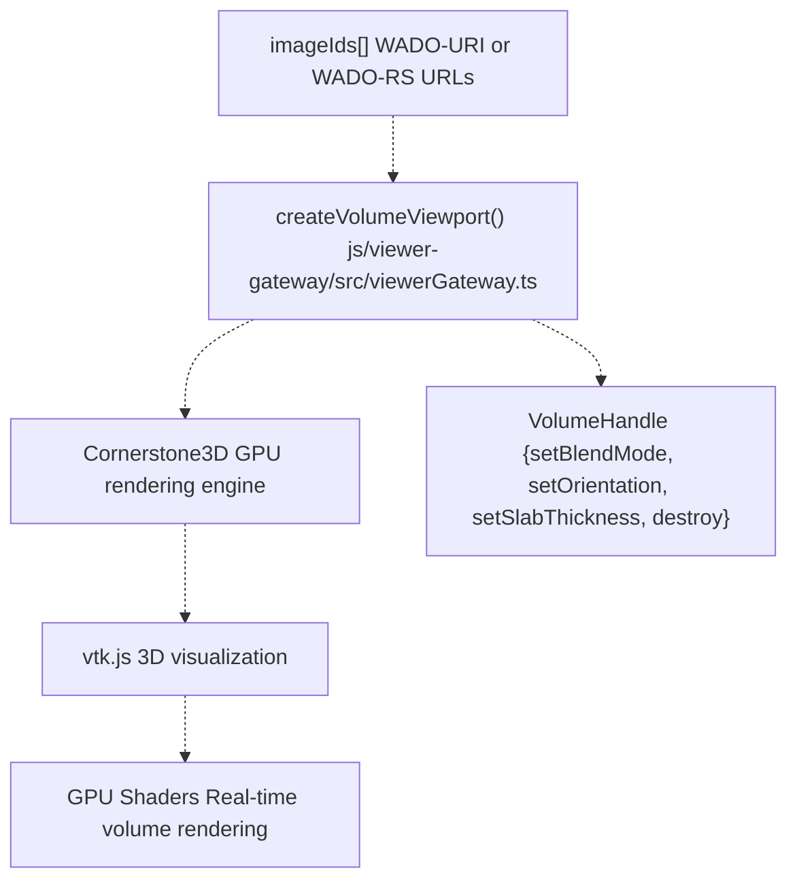
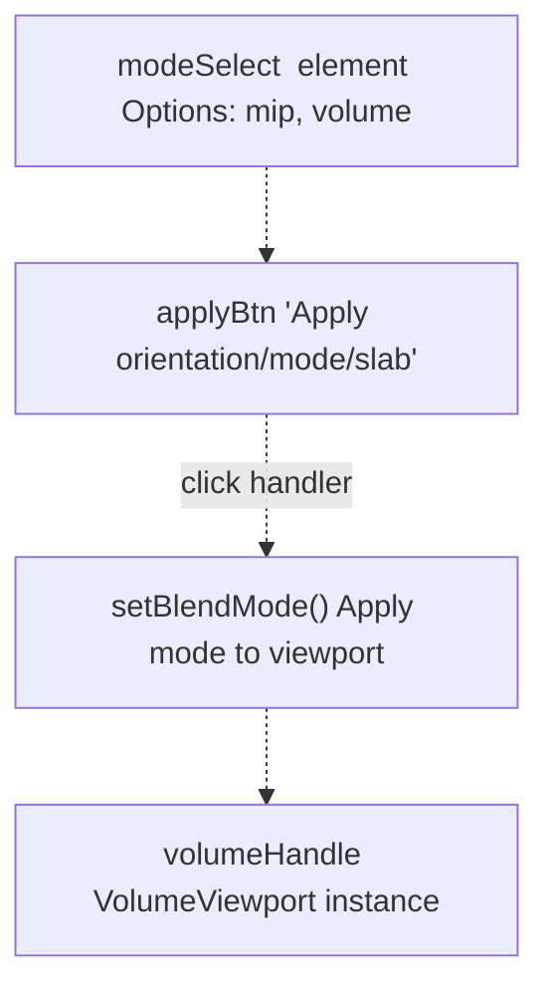
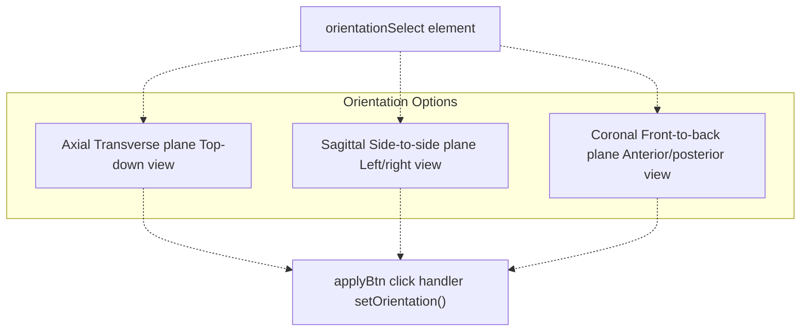
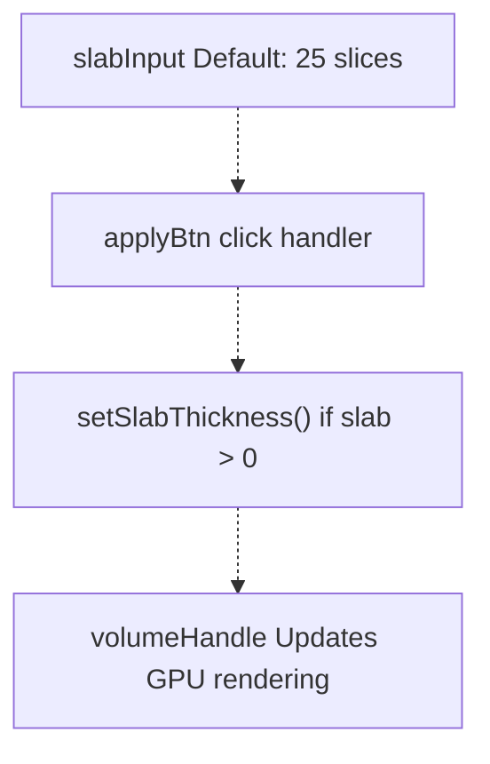
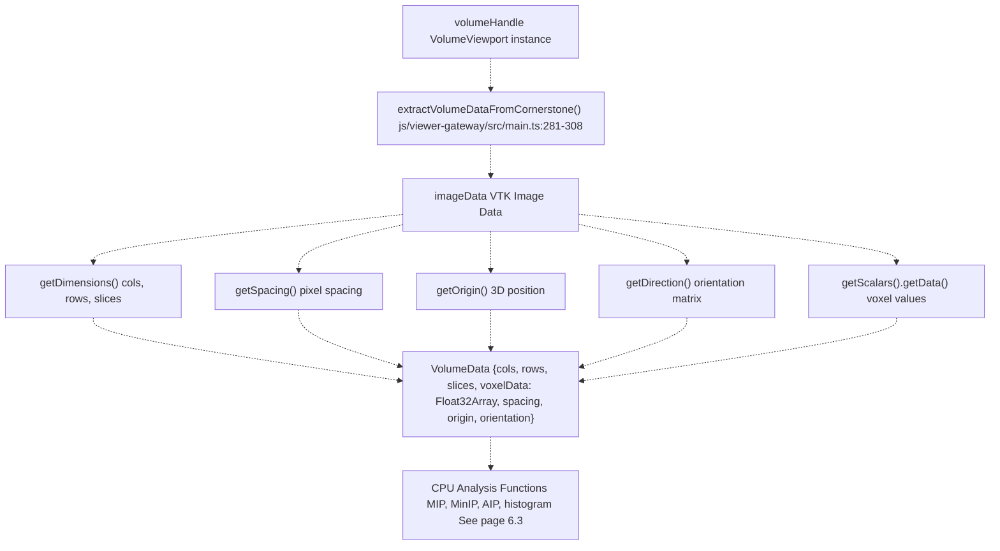
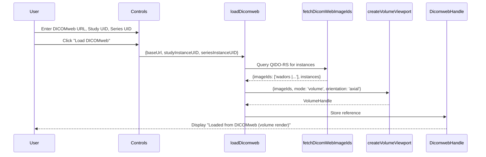
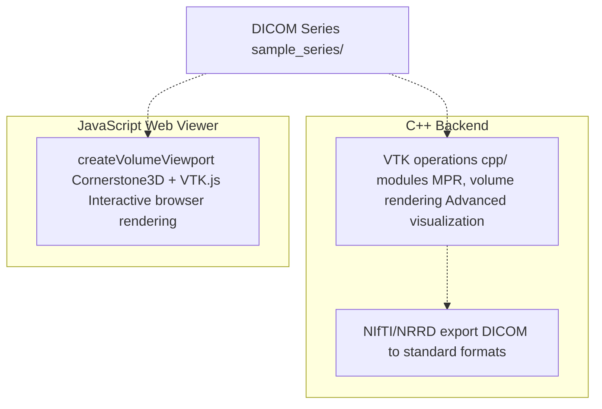

# 3D Volume Rendering

> **Relevant source files**
> * [BUILD.md](https://github.com/ThalesMMS/Dicom-Tools/blob/c7b4cbd8/BUILD.md)
> * [README.md](https://github.com/ThalesMMS/Dicom-Tools/blob/c7b4cbd8/README.md)
> * [js/viewer-gateway/src/main.ts](https://github.com/ThalesMMS/Dicom-Tools/blob/c7b4cbd8/js/viewer-gateway/src/main.ts)
> * [js/viewer-gateway/tests/main.entry.test.ts](https://github.com/ThalesMMS/Dicom-Tools/blob/c7b4cbd8/js/viewer-gateway/tests/main.entry.test.ts)
> * [python/screenshots/ui.png](https://github.com/ThalesMMS/Dicom-Tools/blob/c7b4cbd8/python/screenshots/ui.png)
> * [scripts/setup_all.sh](https://github.com/ThalesMMS/Dicom-Tools/blob/c7b4cbd8/scripts/setup_all.sh)

## Purpose and Scope

This page documents the 3D volume rendering capabilities in the JavaScript web viewer. The volume viewport enables GPU-accelerated visualization of DICOM series as 3D volumes with support for Maximum Intensity Projection (MIP), Multi-Planar Reconstruction (MPR), and direct volume rendering. For 2D slice-by-slice navigation, see [2D Stack Viewing](#6.1). For CPU-based volume analysis operations, see [CPU-Based Analysis](#6.3).

The volume rendering system is built on Cornerstone3D and VTK.js, providing real-time interaction with medical imaging volumes in a web browser.

---

## Volume Viewport Architecture

The volume viewport is initialized through the `createVolumeViewport` function, which constructs a GPU-accelerated 3D rendering environment:



**Sources:** [js/viewer-gateway/src/main.ts L2](https://github.com/ThalesMMS/Dicom-Tools/blob/c7b4cbd8/js/viewer-gateway/src/main.ts#L2-L2)

 [js/viewer-gateway/src/main.ts L336-L352](https://github.com/ThalesMMS/Dicom-Tools/blob/c7b4cbd8/js/viewer-gateway/src/main.ts#L336-L352)

 Diagram 5 from high-level architecture

The volume viewport encapsulates the entire 3D volume in GPU memory, enabling fast interactive rotation, zooming, and mode switching without reloading data.

---

## Rendering Modes

The volume viewport supports two primary rendering modes, controlled via `setBlendMode`:

| Mode | Description | Use Case |
| --- | --- | --- |
| **MIP** | Maximum Intensity Projection | Visualize high-density structures (bones, contrast-enhanced vessels) |
| **volume** | Direct volume rendering | Full 3D visualization with opacity transfer functions |

### Mode Selection Controls

The UI provides a dropdown selector for switching between modes:



**Sources:** [js/viewer-gateway/src/main.ts L60-L69](https://github.com/ThalesMMS/Dicom-Tools/blob/c7b4cbd8/js/viewer-gateway/src/main.ts#L60-L69)

 [js/viewer-gateway/src/main.ts L385-L393](https://github.com/ThalesMMS/Dicom-Tools/blob/c7b4cbd8/js/viewer-gateway/src/main.ts#L385-L393)

The mode selection is applied when the user clicks the "Apply orientation/mode/slab" button, which reads the selected value and calls `volumeHandle.setBlendMode(controls.modeSelect.value)`.

---

## Orientation Controls

The volume viewport supports three standard anatomical orientations for Multi-Planar Reconstruction (MPR):



**Sources:** [js/viewer-gateway/src/main.ts L52-L58](https://github.com/ThalesMMS/Dicom-Tools/blob/c7b4cbd8/js/viewer-gateway/src/main.ts#L52-L58)

 [js/viewer-gateway/src/main.ts L385-L393](https://github.com/ThalesMMS/Dicom-Tools/blob/c7b4cbd8/js/viewer-gateway/src/main.ts#L385-L393)

The orientation is set programmatically:

```
volumeHandle.setOrientation(controls.orientationSelect.value as any);
```

This enables instant switching between standard medical imaging planes without reloading the volume data.

---

## Slab Thickness Control

Slab thickness determines how many slices are combined when rendering MIP or average intensity projections. A thicker slab includes more volume data in the projection, useful for visualizing extended anatomical structures:



**Sources:** [js/viewer-gateway/src/main.ts L71-L75](https://github.com/ThalesMMS/Dicom-Tools/blob/c7b4cbd8/js/viewer-gateway/src/main.ts#L71-L75)

 [js/viewer-gateway/src/main.ts L389-L392](https://github.com/ThalesMMS/Dicom-Tools/blob/c7b4cbd8/js/viewer-gateway/src/main.ts#L389-L392)

The slab thickness control is applied alongside orientation and mode changes. The implementation checks that the slab value is positive before applying:

```
const slab = Number(controls.slabInput.value);if (slab > 0 && volumeHandle.setSlabThickness) {  volumeHandle.setSlabThickness(slab);}
```

---

## Volume Data Extraction

For CPU-based analysis operations, volume data can be extracted from the Cornerstone volume viewport:



**Sources:** [js/viewer-gateway/src/main.ts L281-L308](https://github.com/ThalesMMS/Dicom-Tools/blob/c7b4cbd8/js/viewer-gateway/src/main.ts#L281-L308)

 [js/viewer-gateway/src/main.ts L422-L432](https://github.com/ThalesMMS/Dicom-Tools/blob/c7b4cbd8/js/viewer-gateway/src/main.ts#L422-L432)

### VolumeData Interface

The extracted volume data structure contains all necessary metadata for CPU processing:

| Field | Type | Description |
| --- | --- | --- |
| `cols` | `number` | Number of columns (X dimension) |
| `rows` | `number` | Number of rows (Y dimension) |
| `slices` | `number` | Number of slices (Z dimension) |
| `voxelData` | `Float32Array` | Flattened voxel intensity values |
| `spacing` | `{col, row, slice}` | Physical spacing between voxels |
| `origin` | `[x, y, z]` | 3D position of first voxel |
| `orientation` | `{row, col}` | Direction cosines for patient orientation |

The extraction function safely accesses VTK's internal data structures and converts them to a standardized format used by the CPU analysis utilities.

---

## DICOMweb Volume Loading

Volume viewports can load data from DICOMweb servers using WADO-RS:



**Sources:** [js/viewer-gateway/src/main.ts L354-L374](https://github.com/ThalesMMS/Dicom-Tools/blob/c7b4cbd8/js/viewer-gateway/src/main.ts#L354-L374)

 [js/viewer-gateway/src/main.ts L413-L420](https://github.com/ThalesMMS/Dicom-Tools/blob/c7b4cbd8/js/viewer-gateway/src/main.ts#L413-L420)

The DICOMweb loading flow:

1. User provides DICOMweb configuration (base URL, study UID, series UID)
2. `fetchDicomWebImageIds` queries the server using QIDO-RS to enumerate instances
3. WADO-RS image URLs are constructed for each instance
4. `createVolumeViewport` loads all instances into a single volume
5. Volume viewport is initialized in "volume" mode with axial orientation

The system supports both initial configuration (via `window.DICOMWEB_CONFIG` or environment variables) and runtime loading through the UI controls.

---

## Integration with C++ Backend

While the JavaScript viewer provides web-based 3D rendering, the C++ backend offers advanced VTK operations for offline volume processing:



**Sources:** Diagram 3 from high-level architecture, [README.md L18](https://github.com/ThalesMMS/Dicom-Tools/blob/c7b4cbd8/README.md#L18-L18)

The C++ backend (see [C++ Backend](#4.3)) provides complementary functionality:

* Server-side volume rendering
* Export to NIfTI and NRRD formats
* Advanced VTK pipeline operations
* Specialized medical visualization (SR/RT support)

---

## Control Flow Summary

The complete control flow for volume viewport interaction:

```css
#mermaid-kke06w23kkp{font-family:ui-sans-serif,-apple-system,system-ui,Segoe UI,Helvetica;font-size:16px;fill:#ccc;}@keyframes edge-animation-frame{from{stroke-dashoffset:0;}}@keyframes dash{to{stroke-dashoffset:0;}}#mermaid-kke06w23kkp .edge-animation-slow{stroke-dasharray:9,5!important;stroke-dashoffset:900;animation:dash 50s linear infinite;stroke-linecap:round;}#mermaid-kke06w23kkp .edge-animation-fast{stroke-dasharray:9,5!important;stroke-dashoffset:900;animation:dash 20s linear infinite;stroke-linecap:round;}#mermaid-kke06w23kkp .error-icon{fill:#a44141;}#mermaid-kke06w23kkp .error-text{fill:#ddd;stroke:#ddd;}#mermaid-kke06w23kkp .edge-thickness-normal{stroke-width:1px;}#mermaid-kke06w23kkp .edge-thickness-thick{stroke-width:3.5px;}#mermaid-kke06w23kkp .edge-pattern-solid{stroke-dasharray:0;}#mermaid-kke06w23kkp .edge-thickness-invisible{stroke-width:0;fill:none;}#mermaid-kke06w23kkp .edge-pattern-dashed{stroke-dasharray:3;}#mermaid-kke06w23kkp .edge-pattern-dotted{stroke-dasharray:2;}#mermaid-kke06w23kkp .marker{fill:lightgrey;stroke:lightgrey;}#mermaid-kke06w23kkp .marker.cross{stroke:lightgrey;}#mermaid-kke06w23kkp svg{font-family:ui-sans-serif,-apple-system,system-ui,Segoe UI,Helvetica;font-size:16px;}#mermaid-kke06w23kkp p{margin:0;}#mermaid-kke06w23kkp defs #statediagram-barbEnd{fill:lightgrey;stroke:lightgrey;}#mermaid-kke06w23kkp g.stateGroup text{fill:#ccc;stroke:none;font-size:10px;}#mermaid-kke06w23kkp g.stateGroup text{fill:#ccc;stroke:none;font-size:10px;}#mermaid-kke06w23kkp g.stateGroup .state-title{font-weight:bolder;fill:#e0dfdf;}#mermaid-kke06w23kkp g.stateGroup rect{fill:#1f2020;stroke:#ccc;}#mermaid-kke06w23kkp g.stateGroup line{stroke:lightgrey;stroke-width:1;}#mermaid-kke06w23kkp .transition{stroke:lightgrey;stroke-width:1;fill:none;}#mermaid-kke06w23kkp .stateGroup .composit{fill:#333;border-bottom:1px;}#mermaid-kke06w23kkp .stateGroup .alt-composit{fill:#e0e0e0;border-bottom:1px;}#mermaid-kke06w23kkp .state-note{stroke:hsl(180, 0%, 18.3529411765%);fill:hsl(180, 1.5873015873%, 28.3529411765%);}#mermaid-kke06w23kkp .state-note text{fill:rgb(183.8476190475, 181.5523809523, 181.5523809523);stroke:none;font-size:10px;}#mermaid-kke06w23kkp .stateLabel .box{stroke:none;stroke-width:0;fill:#1f2020;opacity:0.5;}#mermaid-kke06w23kkp .edgeLabel .label rect{fill:#1f2020;opacity:0.5;}#mermaid-kke06w23kkp .edgeLabel{background-color:hsl(0, 0%, 34.4117647059%);text-align:center;}#mermaid-kke06w23kkp .edgeLabel p{background-color:hsl(0, 0%, 34.4117647059%);}#mermaid-kke06w23kkp .edgeLabel rect{opacity:0.5;background-color:hsl(0, 0%, 34.4117647059%);fill:hsl(0, 0%, 34.4117647059%);}#mermaid-kke06w23kkp .edgeLabel .label text{fill:#ccc;}#mermaid-kke06w23kkp .label div .edgeLabel{color:#ccc;}#mermaid-kke06w23kkp .stateLabel text{fill:#e0dfdf;font-size:10px;font-weight:bold;}#mermaid-kke06w23kkp .node circle.state-start{fill:#f4f4f4;stroke:#f4f4f4;}#mermaid-kke06w23kkp .node .fork-join{fill:#f4f4f4;stroke:#f4f4f4;}#mermaid-kke06w23kkp .node circle.state-end{fill:#cccccc;stroke:#333;stroke-width:1.5;}#mermaid-kke06w23kkp .end-state-inner{fill:#333;stroke-width:1.5;}#mermaid-kke06w23kkp .node rect{fill:#1f2020;stroke:#ccc;stroke-width:1px;}#mermaid-kke06w23kkp .node polygon{fill:#1f2020;stroke:#ccc;stroke-width:1px;}#mermaid-kke06w23kkp #statediagram-barbEnd{fill:lightgrey;}#mermaid-kke06w23kkp .statediagram-cluster rect{fill:#1f2020;stroke:#ccc;stroke-width:1px;}#mermaid-kke06w23kkp .cluster-label,#mermaid-kke06w23kkp .nodeLabel{color:#e0dfdf;}#mermaid-kke06w23kkp .statediagram-cluster rect.outer{rx:5px;ry:5px;}#mermaid-kke06w23kkp .statediagram-state .divider{stroke:#ccc;}#mermaid-kke06w23kkp .statediagram-state .title-state{rx:5px;ry:5px;}#mermaid-kke06w23kkp .statediagram-cluster.statediagram-cluster .inner{fill:#333;}#mermaid-kke06w23kkp .statediagram-cluster.statediagram-cluster-alt .inner{fill:#555;}#mermaid-kke06w23kkp .statediagram-cluster .inner{rx:0;ry:0;}#mermaid-kke06w23kkp .statediagram-state rect.basic{rx:5px;ry:5px;}#mermaid-kke06w23kkp .statediagram-state rect.divider{stroke-dasharray:10,10;fill:#555;}#mermaid-kke06w23kkp .note-edge{stroke-dasharray:5;}#mermaid-kke06w23kkp .statediagram-note rect{fill:hsl(180, 1.5873015873%, 28.3529411765%);stroke:hsl(180, 0%, 18.3529411765%);stroke-width:1px;rx:0;ry:0;}#mermaid-kke06w23kkp .statediagram-note rect{fill:hsl(180, 1.5873015873%, 28.3529411765%);stroke:hsl(180, 0%, 18.3529411765%);stroke-width:1px;rx:0;ry:0;}#mermaid-kke06w23kkp .statediagram-note text{fill:rgb(183.8476190475, 181.5523809523, 181.5523809523);}#mermaid-kke06w23kkp .statediagram-note .nodeLabel{color:rgb(183.8476190475, 181.5523809523, 181.5523809523);}#mermaid-kke06w23kkp .statediagram .edgeLabel{color:red;}#mermaid-kke06w23kkp #dependencyStart,#mermaid-kke06w23kkp #dependencyEnd{fill:lightgrey;stroke:lightgrey;stroke-width:1;}#mermaid-kke06w23kkp .statediagramTitleText{text-anchor:middle;font-size:18px;fill:#ccc;}#mermaid-kke06w23kkp :root{--mermaid-font-family:ui-sans-serif,-apple-system,system-ui,Segoe UI,Helvetica;}createVolumeViewport(imageIds)GPU loading completesetOrientation(axial|sagittal|coronal)setBlendMode(mip|volume)setSlabThickness(n)extractVolumeDataFromCornerstone()MPR plane updatedRendering mode updatedProjection depth updatedVolumeData for processingResults displayedInitializeVolumeVolumeReadyChangeOrientationChangeModeChangeSlabExtractDataCPUAnalysis
```

**Sources:** [js/viewer-gateway/src/main.ts L310-L490](https://github.com/ThalesMMS/Dicom-Tools/blob/c7b4cbd8/js/viewer-gateway/src/main.ts#L310-L490)

 [js/viewer-gateway/tests/main.entry.test.ts L70-L172](https://github.com/ThalesMMS/Dicom-Tools/blob/c7b4cbd8/js/viewer-gateway/tests/main.entry.test.ts#L70-L172)

All volume operations maintain the GPU-resident volume data, enabling instant updates to the visualization without reloading from the network or filesystem. The volume handle returned by `createVolumeViewport` serves as the primary interface for runtime control of the 3D rendering.

Refresh this wiki

Last indexed: 5 January 2026 ([c7b4cb](https://github.com/ThalesMMS/Dicom-Tools/commit/c7b4cbd8))

### On this page

* [3D Volume Rendering](#6.2-3d-volume-rendering)
* [Purpose and Scope](#6.2-purpose-and-scope)
* [Volume Viewport Architecture](#6.2-volume-viewport-architecture)
* [Rendering Modes](#6.2-rendering-modes)
* [Mode Selection Controls](#6.2-mode-selection-controls)
* [Orientation Controls](#6.2-orientation-controls)
* [Slab Thickness Control](#6.2-slab-thickness-control)
* [Volume Data Extraction](#6.2-volume-data-extraction)
* [VolumeData Interface](#6.2-volumedata-interface)
* [DICOMweb Volume Loading](#6.2-dicomweb-volume-loading)
* [Integration with C++ Backend](#6.2-integration-with-c-backend)
* [Control Flow Summary](#6.2-control-flow-summary)

Ask Devin about Dicom-Tools