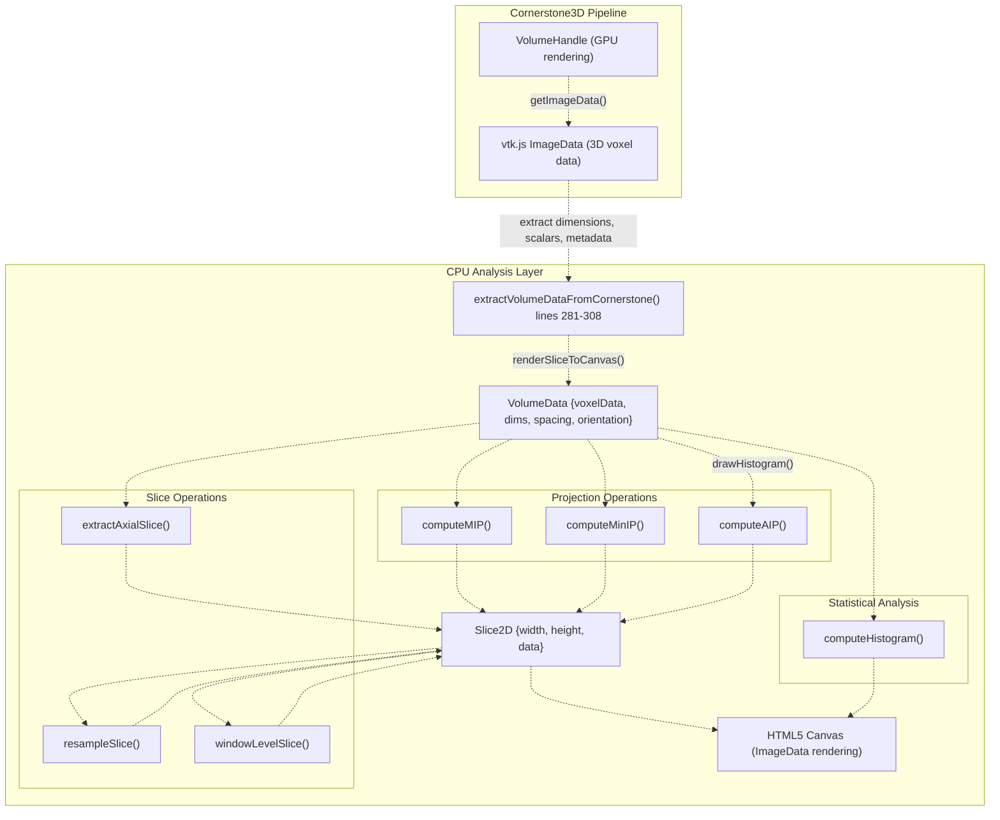
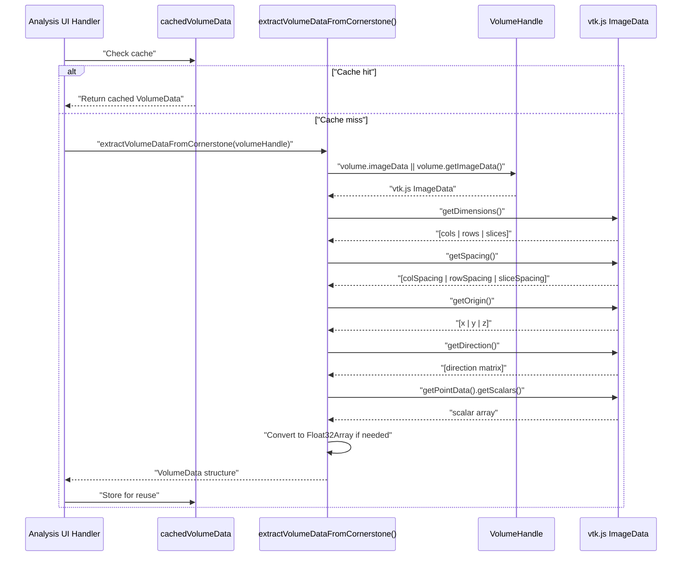
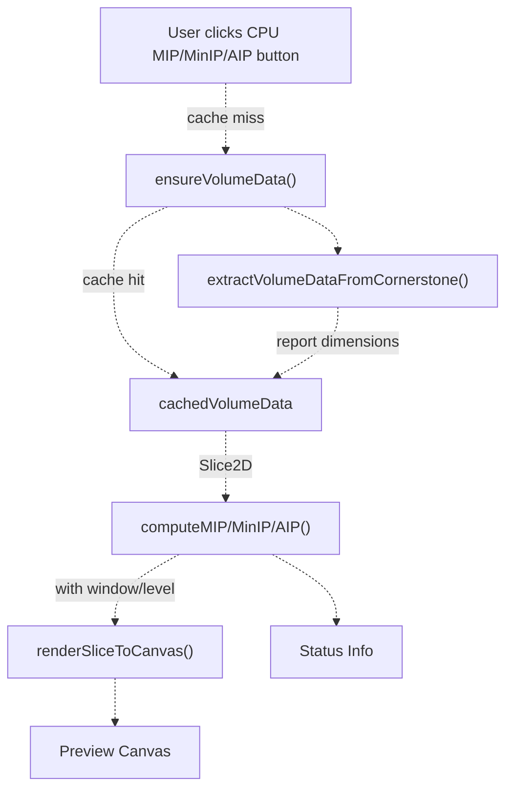
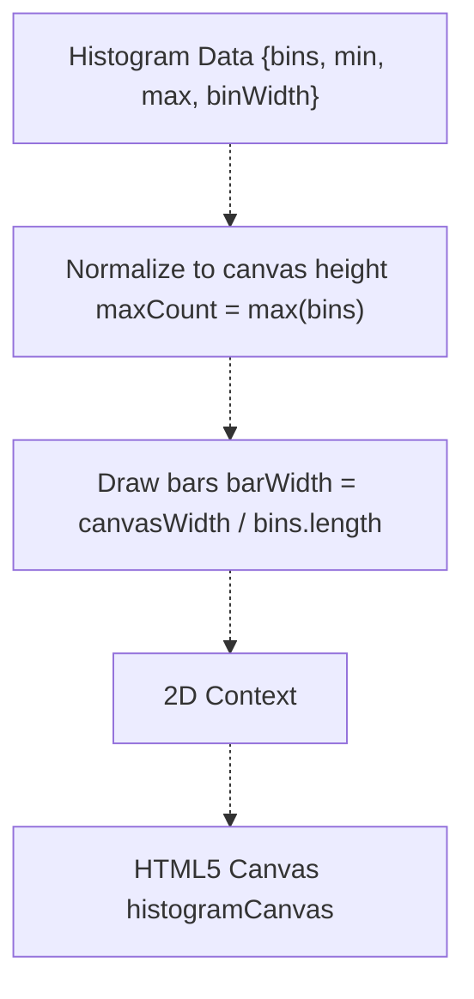
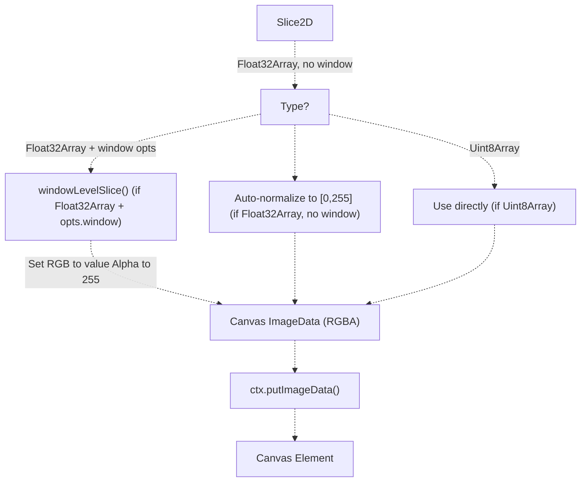
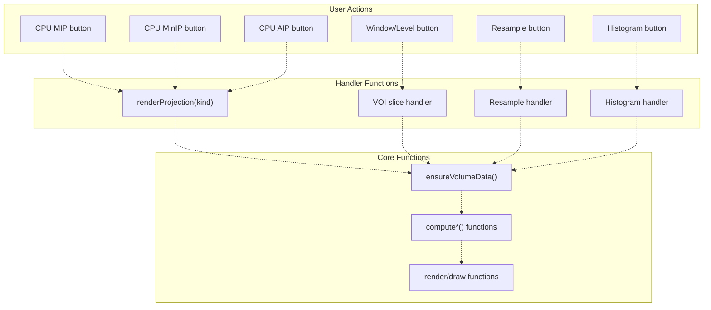

# CPU-Based Analysis

> **Relevant source files**
> * [js/viewer-gateway/src/main.ts](https://github.com/ThalesMMS/Dicom-Tools/blob/c7b4cbd8/js/viewer-gateway/src/main.ts)
> * [js/viewer-gateway/tests/main.entry.test.ts](https://github.com/ThalesMMS/Dicom-Tools/blob/c7b4cbd8/js/viewer-gateway/tests/main.entry.test.ts)
> * [python/screenshots/ui.png](https://github.com/ThalesMMS/Dicom-Tools/blob/c7b4cbd8/python/screenshots/ui.png)

## Purpose and Scope

This page documents the CPU-based volume analysis capabilities provided by the `volumeUtils` module in the JavaScript viewer. These functions perform computationally intensive operations on DICOM volume data using pure JavaScript/TypeScript, without requiring GPU acceleration or WebGL contexts. This is useful for generating specific outputs like projection images, histograms, and resampled slices that may not be supported by the GPU rendering pipeline, or when running in environments where GPU access is limited.

For GPU-accelerated 2D and 3D rendering capabilities, see [2D Stack Viewing](#6.1) and [3D Volume Rendering](#6.2). For detailed information on the web viewer architecture, see [Web Viewer (JavaScript)](#2.3).

**Sources:** [js/viewer-gateway/src/main.ts L1-L17](https://github.com/ThalesMMS/Dicom-Tools/blob/c7b4cbd8/js/viewer-gateway/src/main.ts#L1-L17)

---

## Architecture Overview

The CPU-based analysis system operates as a separate analysis layer alongside the GPU-accelerated Cornerstone3D rendering pipeline. It extracts raw voxel data from loaded volumes, performs CPU computations, and renders results to HTML5 canvas elements.



**Figure 1: CPU Analysis Data Flow**

The system maintains a cached `VolumeData` structure that is lazily initialized on first use and reused for subsequent operations to avoid redundant extraction overhead.

**Sources:** [js/viewer-gateway/src/main.ts L281-L308](https://github.com/ThalesMMS/Dicom-Tools/blob/c7b4cbd8/js/viewer-gateway/src/main.ts#L281-L308)

 [js/viewer-gateway/src/main.ts L422-L432](https://github.com/ThalesMMS/Dicom-Tools/blob/c7b4cbd8/js/viewer-gateway/src/main.ts#L422-L432)

---

## Core Data Structures

### VolumeData Interface

The `VolumeData` interface represents a 3D volume in a format optimized for CPU processing:

```
interface VolumeData {  cols: number;           // Width (X dimension)  rows: number;           // Height (Y dimension)  slices: number;         // Depth (Z dimension)  voxelData: Float32Array; // Flattened voxel array  spacing?: {             // Physical spacing    col: number;    row: number;    slice: number;  };  origin?: [number, number, number];  orientation?: {    row: [number, number, number];    col: [number, number, number];  };}
```

The `voxelData` array stores voxels in a flattened format with index calculation: `index = z * (rows * cols) + y * cols + x`.

### Slice2D Interface

The `Slice2D<T>` interface represents a 2D image extracted or computed from the volume:

```
interface Slice2D<T extends Float32Array | Uint8Array> {  width: number;  height: number;  data: T;}
```

Type parameter `T` indicates whether the data is floating-point (raw values) or 8-bit (windowed/displayable).

**Sources:** [js/viewer-gateway/src/main.ts L7-L17](https://github.com/ThalesMMS/Dicom-Tools/blob/c7b4cbd8/js/viewer-gateway/src/main.ts#L7-L17)

 [js/viewer-gateway/src/main.ts L213](https://github.com/ThalesMMS/Dicom-Tools/blob/c7b4cbd8/js/viewer-gateway/src/main.ts#L213-L213)

---

## Volume Data Extraction

### Extracting from Cornerstone

The `extractVolumeDataFromCornerstone()` function bridges the GPU rendering layer to the CPU analysis layer by extracting raw voxel data from a Cornerstone volume handle:



**Figure 2: Volume Data Extraction Sequence**

The extraction process handles multiple accessor patterns because vtk.js objects may use different internal representations. Key implementation details:

| Step | Lines | Purpose |
| --- | --- | --- |
| Access ImageData | 284 | Get vtk.js ImageData from volume or call `getImageData()` |
| Extract Dimensions | 285 | Call `getDimensions()` for `[cols, rows, slices]` |
| Extract Spacing | 286 | Call `getSpacing()` for physical voxel dimensions |
| Extract Origin | 287 | Call `getOrigin()` for volume position in space |
| Extract Direction | 288 | Call `getDirection()` for orientation matrix |
| Get Scalars | 289-291 | Navigate `getPointData().getScalars()` with fallbacks |
| Type Conversion | 295 | Convert to Float32Array for consistent processing |
| Build Orientation | 297 | Extract row/column direction vectors from matrix |

**Sources:** [js/viewer-gateway/src/main.ts L281-L308](https://github.com/ThalesMMS/Dicom-Tools/blob/c7b4cbd8/js/viewer-gateway/src/main.ts#L281-L308)

 [js/viewer-gateway/src/main.ts L422-L432](https://github.com/ThalesMMS/Dicom-Tools/blob/c7b4cbd8/js/viewer-gateway/src/main.ts#L422-L432)

---

## Projection Operations

Projection operations reduce a 3D volume to a 2D image by aggregating voxel intensities along one axis. The viewer supports three types:

### Maximum Intensity Projection (MIP)

```
const mipSlice = computeMIP(volumeData);
```

Computes the maximum value across all slices for each (x, y) position. MIP is particularly useful for visualizing high-contrast structures like contrast-enhanced vessels or calcifications.

### Minimum Intensity Projection (MinIP)

```
const minipSlice = computeMinIP(volumeData);
```

Computes the minimum value across all slices. MinIP is useful for visualizing air-filled structures in CT (e.g., airways, emphysema).

### Average Intensity Projection (AIP)

```
const aipSlice = computeAIP(volumeData);
```

Computes the mean value across all slices. AIP provides a smoothed representation and is useful for reducing noise.

### Usage Pattern



**Figure 3: Projection Operation Flow**

The projection buttons are wired in the analysis section:

* **MIP Button**: [js/viewer-gateway/src/main.ts L449](https://github.com/ThalesMMS/Dicom-Tools/blob/c7b4cbd8/js/viewer-gateway/src/main.ts#L449-L449)
* **MinIP Button**: [js/viewer-gateway/src/main.ts L450](https://github.com/ThalesMMS/Dicom-Tools/blob/c7b4cbd8/js/viewer-gateway/src/main.ts#L450-L450)
* **AIP Button**: [js/viewer-gateway/src/main.ts L451](https://github.com/ThalesMMS/Dicom-Tools/blob/c7b4cbd8/js/viewer-gateway/src/main.ts#L451-L451)

All projections render to the same preview canvas with configurable window/level settings.

**Sources:** [js/viewer-gateway/src/main.ts L434-L451](https://github.com/ThalesMMS/Dicom-Tools/blob/c7b4cbd8/js/viewer-gateway/src/main.ts#L434-L451)

 [js/viewer-gateway/src/main.ts L8-L11](https://github.com/ThalesMMS/Dicom-Tools/blob/c7b4cbd8/js/viewer-gateway/src/main.ts#L8-L11)

---

## Histogram Analysis

The `computeHistogram()` function generates a frequency distribution of voxel intensities across the entire volume.

### Histogram Computation

```
const histogram = computeHistogram(volumeData, numBins);
```

Returns:

```
{  bins: number[];      // Frequency count for each bin  min: number;         // Minimum voxel value  max: number;         // Maximum voxel value  binWidth: number;    // Width of each histogram bin}
```

### Histogram Rendering

The `drawHistogram()` function visualizes the distribution on a canvas:



**Figure 4: Histogram Rendering Pipeline**

Implementation details:

| Component | Lines | Description |
| --- | --- | --- |
| Canvas Setup | 262-263 | Dynamic width based on bin count, fixed height |
| Normalization | 265 | Find max count for vertical scaling |
| Bar Drawing | 273-278 | Each bin rendered as vertical bar |
| Styling | 268-271 | Light background with blue bars |

The histogram provides insight into contrast distribution, useful for:

* Setting appropriate window/level parameters
* Detecting clipping or quantization artifacts
* Assessing image quality

**Sources:** [js/viewer-gateway/src/main.ts L256-L279](https://github.com/ThalesMMS/Dicom-Tools/blob/c7b4cbd8/js/viewer-gateway/src/main.ts#L256-L279)

 [js/viewer-gateway/src/main.ts L479-L487](https://github.com/ThalesMMS/Dicom-Tools/blob/c7b4cbd8/js/viewer-gateway/src/main.ts#L479-L487)

---

## Slice Operations

### Axial Slice Extraction

```
const sliceIndex = Math.floor(volumeData.slices / 2);const slice = extractAxialSlice(volumeData, sliceIndex);
```

Extracts a single 2D slice from the volume at the specified z-index. Returns a `Slice2D<Float32Array>` with raw voxel values.

### Resampling

```
const resampled = resampleSlice(slice, targetWidth, targetHeight, 'bilinear');
```

Resizes a slice to target dimensions using bilinear interpolation. This is useful for:

* Creating thumbnails
* Matching slice dimensions across different series
* Preparing data for specific display requirements

Supported interpolation modes:

* `'bilinear'` - Smooth, suitable for most medical images
* `'nearest'` - Fast, preserves exact voxel values (assumed based on common implementations)

### Window/Level Application

```
const windowed = windowLevelSlice(slice, center, width);
```

Applies DICOM window/level transformation to convert floating-point voxel values to 8-bit display values:

```
For each voxel v:
  lower = center - width/2
  upper = center + width/2
  normalized = (v - lower) / width
  clamped = clamp(normalized, 0, 1)
  display = round(clamped * 255)
```

Returns `Slice2D<Uint8Array>` with values in [0, 255] range.

**Sources:** [js/viewer-gateway/src/main.ts L453-L477](https://github.com/ThalesMMS/Dicom-Tools/blob/c7b4cbd8/js/viewer-gateway/src/main.ts#L453-L477)

 [js/viewer-gateway/src/main.ts L12-L16](https://github.com/ThalesMMS/Dicom-Tools/blob/c7b4cbd8/js/viewer-gateway/src/main.ts#L12-L16)

---

## Canvas Rendering

### Slice to Canvas Conversion

The `renderSliceToCanvas()` function converts a `Slice2D` to displayable pixels:



**Figure 5: Slice Rendering Decision Tree**

The rendering function handles three cases:

1. **Windowed Float32**: If floating-point data and window options provided, apply window/level [lines 223-225](https://github.com/ThalesMMS/Dicom-Tools/blob/c7b4cbd8/lines 223-225)
2. **Auto-normalized Float32**: If floating-point without window, auto-scale to min-max [lines 229-240](https://github.com/ThalesMMS/Dicom-Tools/blob/c7b4cbd8/lines 229-240)
3. **Direct Uint8**: If already 8-bit, use directly [lines 226-227](https://github.com/ThalesMMS/Dicom-Tools/blob/c7b4cbd8/lines 226-227)

Final conversion creates RGBA ImageData where R=G=B=value (grayscale) and A=255 (opaque) [lines 243-251](https://github.com/ThalesMMS/Dicom-Tools/blob/c7b4cbd8/lines 243-251)

**Sources:** [js/viewer-gateway/src/main.ts L215-L254](https://github.com/ThalesMMS/Dicom-Tools/blob/c7b4cbd8/js/viewer-gateway/src/main.ts#L215-L254)

---

## User Interface Integration

### Analysis Section Layout

The analysis UI section provides controls for all CPU operations:

| Control Group | Elements | Lines |
| --- | --- | --- |
| Projections | MIP, MinIP, AIP buttons | 144-150 |
| Slice Processing | Resample inputs, Window/Level button | 152-168 |
| Histogram | Bin count input, compute button | 170-179 |
| Visualization | Preview canvas (512×512), Histogram canvas | 181-189 |

### Event Handler Wiring



**Figure 6: Analysis UI Event Flow**

All handlers follow the pattern:

1. Call `ensureVolumeData()` to get or cache volume data
2. Perform computation with user-configured parameters
3. Render result to appropriate canvas
4. Update status info element

**Sources:** [js/viewer-gateway/src/main.ts L136-L211](https://github.com/ThalesMMS/Dicom-Tools/blob/c7b4cbd8/js/viewer-gateway/src/main.ts#L136-L211)

 [js/viewer-gateway/src/main.ts L449-L487](https://github.com/ThalesMMS/Dicom-Tools/blob/c7b4cbd8/js/viewer-gateway/src/main.ts#L449-L487)

---

## Performance Considerations

### Caching Strategy

The volume data extraction is expensive (requires vtk.js API calls and array copies), so the system implements single-level caching:

```
let cachedVolumeData: VolumeData | null = null;async function ensureVolumeData() {  if (cachedVolumeData) return cachedVolumeData;  const extracted = extractVolumeDataFromCornerstone(sourceHandle);  cachedVolumeData = extracted;  return extracted;}
```

Cache invalidation occurs when:

* A new volume is loaded in either viewport [lines 347, 369](https://github.com/ThalesMMS/Dicom-Tools/blob/c7b4cbd8/lines 347, 369)
* The volume changes (not automatically detected)

### Memory Usage

For a typical CT volume (512×512×174 slices):

* VolumeData storage: ~180 MB (512 × 512 × 174 × 4 bytes)
* Temporary slice allocations: ~1-4 MB per operation
* Canvas ImageData: ~1 MB per canvas

All operations work with views or create new arrays rather than modifying in place, ensuring the cached volume data remains pristine.

### Computation Complexity

| Operation | Complexity | Notes |
| --- | --- | --- |
| MIP/MinIP/AIP | O(n³) | Scans all voxels once |
| Histogram | O(n³) | Scans all voxels once |
| Extract Slice | O(n²) | Single slice only |
| Resample | O(m²) | m = target dimensions |
| Window/Level | O(n²) | Single slice only |

Operations typically complete in:

* Projections: 50-200ms for typical volumes
* Histogram: 50-200ms for typical volumes
* Slice operations: 5-50ms depending on dimensions

**Sources:** [js/viewer-gateway/src/main.ts L322-L369](https://github.com/ThalesMMS/Dicom-Tools/blob/c7b4cbd8/js/viewer-gateway/src/main.ts#L322-L369)

 [js/viewer-gateway/src/main.ts L422-L432](https://github.com/ThalesMMS/Dicom-Tools/blob/c7b4cbd8/js/viewer-gateway/src/main.ts#L422-L432)

---

## Testing

The test suite validates the CPU analysis integration in the main application entry point:

### Test Coverage

| Test Case | File | Purpose |
| --- | --- | --- |
| Volume extraction | main.entry.test.ts | Verifies `extractVolumeDataFromCornerstone` integration |
| Canvas rendering | main.entry.test.ts | Validates projection rendering to preview canvas |
| UI wiring | main.entry.test.ts:79-98 | Tests button event handlers |
| Error handling | main.entry.test.ts:163-171 | Ensures failures are surfaced properly |

The test harness mocks Cornerstone components while testing the full analysis UI flow, ensuring that:

1. Volume data is correctly extracted
2. Projections are computed and rendered
3. Status messages reflect operation results
4. User interactions trigger appropriate handlers

**Sources:** [js/viewer-gateway/tests/main.entry.test.ts L1-L172](https://github.com/ThalesMMS/Dicom-Tools/blob/c7b4cbd8/js/viewer-gateway/tests/main.entry.test.ts#L1-L172)

---

## Summary

The CPU-based analysis system provides a comprehensive suite of volume processing capabilities that complement the GPU-accelerated rendering pipeline. Key features include:

* **Projection Operations**: MIP, MinIP, AIP for different clinical visualization needs
* **Histogram Analysis**: Intensity distribution analysis for quality assessment and window/level tuning
* **Slice Operations**: Extraction, resampling, and windowing for flexible image processing
* **Efficient Caching**: Single-extraction, multiple-use pattern minimizes overhead
* **Canvas Integration**: Direct rendering to HTML5 canvas for flexible display options

This architecture allows the web viewer to perform sophisticated analysis tasks that would be difficult or impossible with GPU pipelines alone, while maintaining reasonable performance through TypedArray optimizations and caching strategies.

Refresh this wiki

Last indexed: 5 January 2026 ([c7b4cb](https://github.com/ThalesMMS/Dicom-Tools/commit/c7b4cbd8))

### On this page

* [CPU-Based Analysis](#6.3-cpu-based-analysis)
* [Purpose and Scope](#6.3-purpose-and-scope)
* [Architecture Overview](#6.3-architecture-overview)
* [Core Data Structures](#6.3-core-data-structures)
* [VolumeData Interface](#6.3-volumedata-interface)
* [Slice2D Interface](#6.3-slice2d-interface)
* [Volume Data Extraction](#6.3-volume-data-extraction)
* [Extracting from Cornerstone](#6.3-extracting-from-cornerstone)
* [Projection Operations](#6.3-projection-operations)
* [Maximum Intensity Projection (MIP)](#6.3-maximum-intensity-projection-mip)
* [Minimum Intensity Projection (MinIP)](#6.3-minimum-intensity-projection-minip)
* [Average Intensity Projection (AIP)](#6.3-average-intensity-projection-aip)
* [Usage Pattern](#6.3-usage-pattern)
* [Histogram Analysis](#6.3-histogram-analysis)
* [Histogram Computation](#6.3-histogram-computation)
* [Histogram Rendering](#6.3-histogram-rendering)
* [Slice Operations](#6.3-slice-operations)
* [Axial Slice Extraction](#6.3-axial-slice-extraction)
* [Resampling](#6.3-resampling)
* [Window/Level Application](#6.3-windowlevel-application)
* [Canvas Rendering](#6.3-canvas-rendering)
* [Slice to Canvas Conversion](#6.3-slice-to-canvas-conversion)
* [User Interface Integration](#6.3-user-interface-integration)
* [Analysis Section Layout](#6.3-analysis-section-layout)
* [Event Handler Wiring](#6.3-event-handler-wiring)
* [Performance Considerations](#6.3-performance-considerations)
* [Caching Strategy](#6.3-caching-strategy)
* [Memory Usage](#6.3-memory-usage)
* [Computation Complexity](#6.3-computation-complexity)
* [Testing](#6.3-testing)
* [Test Coverage](#6.3-test-coverage)
* [Summary](#6.3-summary)

Ask Devin about Dicom-Tools