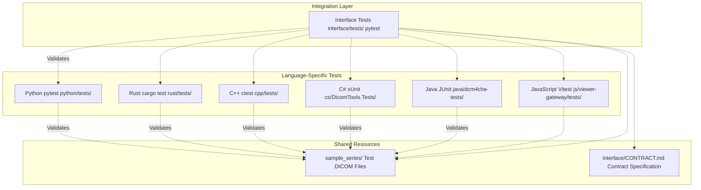
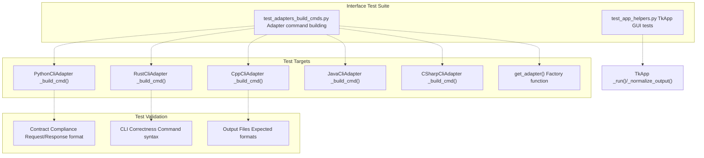
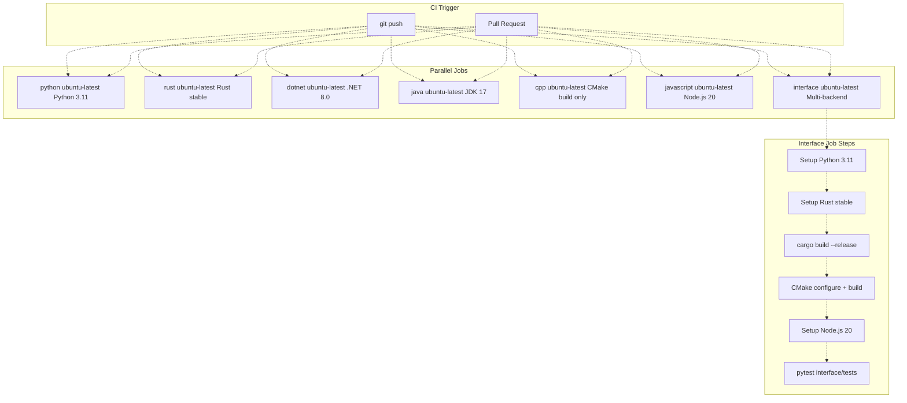
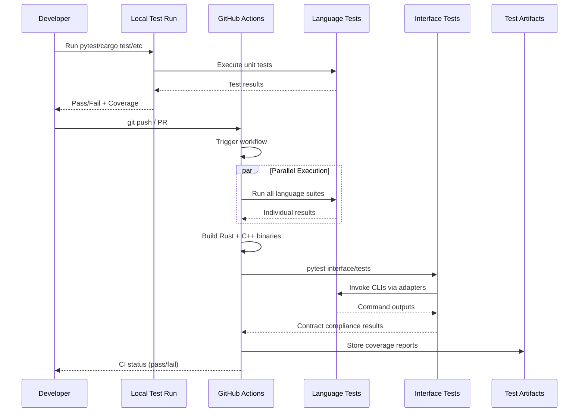

# 7 Testing

> **Relevant source files**
> * [.github/workflows/ci.yml](https://github.com/ThalesMMS/Dicom-Tools/blob/c7b4cbd8/.github/workflows/ci.yml)
> * [cs/DicomTools.Cli/CliApp.cs](https://github.com/ThalesMMS/Dicom-Tools/blob/c7b4cbd8/cs/DicomTools.Cli/CliApp.cs)
> * [interface/tests/test_adapters_build_cmds.py](https://github.com/ThalesMMS/Dicom-Tools/blob/c7b4cbd8/interface/tests/test_adapters_build_cmds.py)
> * [interface/tests/test_app_helpers.py](https://github.com/ThalesMMS/Dicom-Tools/blob/c7b4cbd8/interface/tests/test_app_helpers.py)
> * [java/dcm4che-tests/pom.xml](https://github.com/ThalesMMS/Dicom-Tools/blob/c7b4cbd8/java/dcm4che-tests/pom.xml)
> * [js/viewer-gateway/package-lock.json](https://github.com/ThalesMMS/Dicom-Tools/blob/c7b4cbd8/js/viewer-gateway/package-lock.json)

## Purpose and Scope

This document describes the comprehensive testing strategy for the Dicom-Tools repository, including unit tests, integration tests, and cross-language contract validation. The testing infrastructure ensures that all six language implementations (Python, Rust, C++, C#, Java, JavaScript) maintain correctness and interoperability through the shared CLI contract.

For information about the CLI contract specification itself, see [CLI Contract System](3%20CLI-Contract-System.md). For details on the CI/CD pipeline configuration, see [CI/CD Pipeline](8b%20CI-CD-Pipeline.md). For development guidelines on adding tests for new features, see [Adding a New Operation](8d%20Adding-a-New-Operation.md).

## Testing Philosophy

The Dicom-Tools repository employs a two-tier testing strategy:

1. **Language-Specific Tests**: Each backend maintains its own test suite using native testing frameworks, validating implementation-specific functionality
2. **Interface Tests**: Cross-language integration tests ensure all backends conform to the same CLI contract specification

This approach balances the need for comprehensive unit testing with the requirement that all implementations produce consistent, interoperable results.



**Sources**: [.github/workflows/ci.yml L1-L138](https://github.com/ThalesMMS/Dicom-Tools/blob/c7b4cbd8/.github/workflows/ci.yml#L1-L138)

 [interface/tests/test_app_helpers.py L1-L175](https://github.com/ThalesMMS/Dicom-Tools/blob/c7b4cbd8/interface/tests/test_app_helpers.py#L1-L175)

## Test Organization

### Language-Specific Test Suites

Each language implementation maintains its own test suite with framework-specific conventions:

| Language | Framework | Test Location | Test Command | Coverage Tool |
| --- | --- | --- | --- | --- |
| Python | pytest | `python/tests/` | `pytest` | pytest-cov |
| Rust | cargo test | `rust/tests/` | `cargo test` | cargo-tarpaulin |
| C++ | ctest | `cpp/tests/` | `ctest` | lcov/gcov |
| C# | xUnit | `cs/DicomTools.Tests/` | `dotnet test` | coverlet |
| Java | JUnit 5 | `java/dcm4che-tests/src/test/` | `mvn test` | JaCoCo |
| JavaScript | Vitest | `js/viewer-gateway/tests/` | `npm test` | @vitest/coverage-v8 |

These tests validate:

* Core library functionality (DICOM parsing, network operations, image processing)
* CLI command-line parsing and argument handling
* Error handling and edge cases
* Library-specific features unique to each implementation

**Sources**: [.github/workflows/ci.yml L8-L93](https://github.com/ThalesMMS/Dicom-Tools/blob/c7b4cbd8/.github/workflows/ci.yml#L8-L93)

 [java/dcm4che-tests/pom.xml L140-L146](https://github.com/ThalesMMS/Dicom-Tools/blob/c7b4cbd8/java/dcm4che-tests/pom.xml#L140-L146)

### Interface Tests

The interface test suite validates that all language backends conform to the CLI contract specification. These tests are implementation-agnostic and focus on input/output behavior.



**Sources**: [interface/tests/test_app_helpers.py L1-L175](https://github.com/ThalesMMS/Dicom-Tools/blob/c7b4cbd8/interface/tests/test_app_helpers.py#L1-L175)

 [interface/tests/test_adapters_build_cmds.py L1-L99](https://github.com/ThalesMMS/Dicom-Tools/blob/c7b4cbd8/interface/tests/test_adapters_build_cmds.py#L1-L99)

#### Test Coverage: Adapter Command Building

The `test_adapters_build_cmds.py` suite validates that each adapter correctly translates contract requests into backend-specific CLI invocations:

```mermaid
flowchart TD

TestPython["test_python_cli_builds_commands Lines 9-25"]
TestRust["test_rust_cli_builds_commands Lines 27-36"]
TestCpp["test_cpp_cli_builds_commands Lines 39-47"]
TestJava["test_java_cli_builds_commands Lines 50-65"]
TestCSharp["test_csharp_cli_builds_commands Lines 68-83"]
TestFactory["test_get_adapter_invalid Lines 86-98"]
Info["info Metadata extraction"]
ToImage["to_image PNG/JPEG export"]
Transcode["transcode Transfer syntax change"]
Validate["validate DICOM compliance"]
Echo["echo C-ECHO network test"]
StoreSCU["store_scu C-STORE send"]
DICOMweb["qido/stow/wado DICOMweb operations"]
Advanced["sr_summary/rt_check Specialized ops"]

TestPython -.-> Info
TestPython -.-> ToImage
TestPython -.-> Transcode
TestPython -.-> Validate
TestPython -.-> Echo
TestRust -.-> Info
TestRust -.-> Validate
TestRust -.-> Echo
TestCpp -.-> ToImage
TestCpp -.-> Transcode
TestJava -.-> DICOMweb
TestJava -.-> Advanced
TestCSharp -.-> DICOMweb
TestCSharp -.-> Advanced

subgraph subGraph1 ["Operations Tested"]
    Info
    ToImage
    Transcode
    Validate
    Echo
    StoreSCU
    DICOMweb
    Advanced
end

subgraph subGraph0 ["Adapter Tests"]
    TestPython
    TestRust
    TestCpp
    TestJava
    TestCSharp
    TestFactory
end
```



**Key Test Functions**:

* `test_python_cli_builds_commands`: Validates Python CLI command construction for operations like `info`, `to_image`, `transcode`, `validate`, `echo`, `volume`, `nifti`, `stats`, `dump` [interface/tests/test_adapters_build_cmds.py L9-L25](https://github.com/ThalesMMS/Dicom-Tools/blob/c7b4cbd8/interface/tests/test_adapters_build_cmds.py#L9-L25)
* `test_rust_cli_builds_commands`: Validates Rust CLI with kebab-case operations like `to-image`, `validate`, `histogram`, `echo` [interface/tests/test_adapters_build_cmds.py L27-L36](https://github.com/ThalesMMS/Dicom-Tools/blob/c7b4cbd8/interface/tests/test_adapters_build_cmds.py#L27-L36)
* `test_cpp_cli_builds_commands`: Validates C++ CLI output file generation for `preview`, `anonymize`, `transcode` [interface/tests/test_adapters_build_cmds.py L39-L47](https://github.com/ThalesMMS/Dicom-Tools/blob/c7b4cbd8/interface/tests/test_adapters_build_cmds.py#L39-L47)
* `test_java_cli_builds_commands`: Validates comprehensive Java CLI including DICOMweb operations and specialized SR/RT commands [interface/tests/test_adapters_build_cmds.py L50-L65](https://github.com/ThalesMMS/Dicom-Tools/blob/c7b4cbd8/interface/tests/test_adapters_build_cmds.py#L50-L65)
* `test_csharp_cli_builds_commands`: Validates C# CLI with similar comprehensive coverage [interface/tests/test_adapters_build_cmds.py L68-L83](https://github.com/ThalesMMS/Dicom-Tools/blob/c7b4cbd8/interface/tests/test_adapters_build_cmds.py#L68-L83)
* `test_get_adapter_invalid`: Validates adapter factory function returns correct adapter instances and rejects invalid backend names [interface/tests/test_adapters_build_cmds.py L86-L98](https://github.com/ThalesMMS/Dicom-Tools/blob/c7b4cbd8/interface/tests/test_adapters_build_cmds.py#L86-L98)

**Sources**: [interface/tests/test_adapters_build_cmds.py L1-L99](https://github.com/ThalesMMS/Dicom-Tools/blob/c7b4cbd8/interface/tests/test_adapters_build_cmds.py#L1-L99)

#### Test Coverage: TkApp GUI Helpers

The `test_app_helpers.py` suite validates the TkApp GUI's helper functions using mock objects to avoid Tkinter dependencies:

**Mock Infrastructure**:

* `DummyText`: Simulates Tkinter Text widget [interface/tests/test_app_helpers.py L8-L19](https://github.com/ThalesMMS/Dicom-Tools/blob/c7b4cbd8/interface/tests/test_app_helpers.py#L8-L19)
* `DummyVar`: Simulates Tkinter StringVar [interface/tests/test_app_helpers.py L22-L27](https://github.com/ThalesMMS/Dicom-Tools/blob/c7b4cbd8/interface/tests/test_app_helpers.py#L22-L27)
* `DummyLabel`: Simulates Tkinter Label with configure() [interface/tests/test_app_helpers.py L30-L35](https://github.com/ThalesMMS/Dicom-Tools/blob/c7b4cbd8/interface/tests/test_app_helpers.py#L30-L35)
* `DummyEntry`: Simulates Tkinter Entry with set() method [interface/tests/test_app_helpers.py L38-L40](https://github.com/ThalesMMS/Dicom-Tools/blob/c7b4cbd8/interface/tests/test_app_helpers.py#L38-L40)
* `make_dummy_app`: Factory function creating a testable TkApp instance without Tk initialization [interface/tests/test_app_helpers.py L43-L60](https://github.com/ThalesMMS/Dicom-Tools/blob/c7b4cbd8/interface/tests/test_app_helpers.py#L43-L60)

**Test Functions**:

* `test_normalize_output_infers_by_op`: Validates that `_normalize_output()` correctly infers output file extensions based on operation type (`.png` for `to_image`, `_anon.dcm` for `anonymize`, etc.) [interface/tests/test_app_helpers.py L63-L71](https://github.com/ThalesMMS/Dicom-Tools/blob/c7b4cbd8/interface/tests/test_app_helpers.py#L63-L71)
* `test_parse_options_handles_invalid_json`: Validates that `_parse_options()` gracefully handles malformed JSON input [interface/tests/test_app_helpers.py L74-L79](https://github.com/ThalesMMS/Dicom-Tools/blob/c7b4cbd8/interface/tests/test_app_helpers.py#L74-L79)
* `test_render_result_sets_status`: Validates that `_render_result()` correctly sets status variable to "Success" or "Failure" [interface/tests/test_app_helpers.py L82-L97](https://github.com/ThalesMMS/Dicom-Tools/blob/c7b4cbd8/interface/tests/test_app_helpers.py#L82-L97)
* `test_require_and_directory_detection`: Validates operation classification functions like `_require_input()` and `_op_uses_directory_input()` [interface/tests/test_app_helpers.py L100-L115](https://github.com/ThalesMMS/Dicom-Tools/blob/c7b4cbd8/interface/tests/test_app_helpers.py#L100-L115)
* `test_run_handles_missing_input`: Validates that `_run()` exits early when required input is missing [interface/tests/test_app_helpers.py L118-L126](https://github.com/ThalesMMS/Dicom-Tools/blob/c7b4cbd8/interface/tests/test_app_helpers.py#L118-L126)
* `test_run_success`: Validates successful execution flow through adapter invocation [interface/tests/test_app_helpers.py L129-L149](https://github.com/ThalesMMS/Dicom-Tools/blob/c7b4cbd8/interface/tests/test_app_helpers.py#L129-L149)
* `test_run_suite_with_stub`: Validates batch operation execution via `_run_suite()` [interface/tests/test_app_helpers.py L152-L174](https://github.com/ThalesMMS/Dicom-Tools/blob/c7b4cbd8/interface/tests/test_app_helpers.py#L152-L174)

**Sources**: [interface/tests/test_app_helpers.py L1-L175](https://github.com/ThalesMMS/Dicom-Tools/blob/c7b4cbd8/interface/tests/test_app_helpers.py#L1-L175)

## Continuous Integration Pipeline

The GitHub Actions workflow orchestrates testing across all language implementations in parallel:



**Sources**: [.github/workflows/ci.yml L1-L138](https://github.com/ThalesMMS/Dicom-Tools/blob/c7b4cbd8/.github/workflows/ci.yml#L1-L138)

### CI Job Configuration

**Python Job** [.github/workflows/ci.yml L8-L23](https://github.com/ThalesMMS/Dicom-Tools/blob/c7b4cbd8/.github/workflows/ci.yml#L8-L23)

:

* Installs dependencies from `python/requirements-dev.txt`
* Installs package in editable mode: `pip install -e python`
* Runs `pytest` in `python/` directory

**Rust Job** [.github/workflows/ci.yml L25-L36](https://github.com/ThalesMMS/Dicom-Tools/blob/c7b4cbd8/.github/workflows/ci.yml#L25-L36)

:

* Uses `actions-rs/toolchain@v1` for Rust stable
* Runs `cargo test` in `rust/` directory

**Dotnet Job** [.github/workflows/ci.yml L38-L50](https://github.com/ThalesMMS/Dicom-Tools/blob/c7b4cbd8/.github/workflows/ci.yml#L38-L50)

:

* Uses .NET 8.0 SDK
* Sets `DOTNET_ROLL_FORWARD=Major` for version compatibility
* Runs `dotnet test` with `net8.0` target framework
* Includes blame-hang-timeout for deadlock detection

**Java Job** [.github/workflows/ci.yml L52-L64](https://github.com/ThalesMMS/Dicom-Tools/blob/c7b4cbd8/.github/workflows/ci.yml#L52-L64)

:

* Uses Temurin JDK 17 distribution
* Runs `mvn test -B` in `java/dcm4che-tests/` directory

**C++ Job** [.github/workflows/ci.yml L66-L73](https://github.com/ThalesMMS/Dicom-Tools/blob/c7b4cbd8/.github/workflows/ci.yml#L66-L73)

:

* Configures CMake with `BUILD_TESTING=OFF` (compile-only, no external deps)
* Builds with `cmake --build` using 2 parallel jobs

**JavaScript Job** [.github/workflows/ci.yml L75-L93](https://github.com/ThalesMMS/Dicom-Tools/blob/c7b4cbd8/.github/workflows/ci.yml#L75-L93)

:

* Uses Node.js 20 with npm caching
* Runs `npm ci` for clean install
* Executes `npm run build` and `npm run test:coverage`

**Interface Job** [.github/workflows/ci.yml L95-L137](https://github.com/ThalesMMS/Dicom-Tools/blob/c7b4cbd8/.github/workflows/ci.yml#L95-L137)

:

* Sets up Python 3.11, Rust stable, and Node.js 20
* Builds Rust and C++ binaries
* Sets environment variables for binary locations: * `RUST_DICOM_TOOLS_BIN=rust/target/release/dicom-tools` * `CPP_DICOM_TOOLS_BIN=cpp/build/DicomTools` * `JS_DICOM_TOOLS_CMD=node js/contract-cli/index.js`
* Runs `python -m pytest interface/tests`

**Sources**: [.github/workflows/ci.yml L1-L138](https://github.com/ThalesMMS/Dicom-Tools/blob/c7b4cbd8/.github/workflows/ci.yml#L1-L138)

## Test Data Management

The repository maintains a shared directory of test DICOM files at `sample_series/` that all test suites reference. This ensures consistent test coverage across implementations.

**Test Data Characteristics**:

* Various modalities (CT, MR, US, etc.)
* Different transfer syntaxes (compressed and uncompressed)
* Multi-frame and single-frame images
* Files with different metadata patterns for validation testing

All language-specific tests and interface tests use these files to ensure they're testing against the same inputs, making cross-language validation meaningful.

**Sources**: High-level architecture diagrams provided in context

## Running Tests Locally

### Individual Language Tests

**Python**:

```
cd pythonpip install -r requirements-dev.txtpip install -e .pytest
```

**Rust**:

```
cd rustcargo test
```

**C++**:

```
mkdir -p cpp/buildcd cpp/buildcmake .. -DCMAKE_BUILD_TYPE=Release -DBUILD_TESTING=ONmakectest
```

**C#**:

```
cd csdotnet test DicomTools.Tests/DicomTools.Tests.csproj
```

**Java**:

```
cd java/dcm4che-testsmvn test
```

**JavaScript**:

```
cd js/viewer-gatewaynpm cinpm test
```

### Interface Tests

The interface tests require building multiple backend binaries first:

```
# Build Rustcd rust && cargo build --release && cd ..# Build C++cmake -S cpp -B cpp/build -DCMAKE_BUILD_TYPE=Releasecmake --build cpp/build --config Release# Install Pythonpip install -e python# Set environment variables (optional, uses defaults otherwise)export RUST_DICOM_TOOLS_BIN=rust/target/release/dicom-toolsexport CPP_DICOM_TOOLS_BIN=cpp/build/DicomToolsexport JS_DICOM_TOOLS_CMD="node js/contract-cli/index.js"# Run interface testspip install -r interface/requirements-dev.txtpytest interface/tests
```

**Sources**: [.github/workflows/ci.yml L95-L137](https://github.com/ThalesMMS/Dicom-Tools/blob/c7b4cbd8/.github/workflows/ci.yml#L95-L137)

## Test Coverage Tools

### Java Coverage Configuration

The Java test suite uses JaCoCo for code coverage with a dedicated Maven profile:

**Coverage Profile Activation** [java/dcm4che-tests/pom.xml L173-L207](https://github.com/ThalesMMS/Dicom-Tools/blob/c7b4cbd8/java/dcm4che-tests/pom.xml#L173-L207)

:

```html
<profile>  <id>coverage</id>  <properties>    <excludedGroups></excludedGroups>  </properties>  <build>    <plugins>      <plugin>        <groupId>org.jacoco</groupId>        <artifactId>jacoco-maven-plugin</artifactId>        <configuration>          <includes>            <include>com/dicomtools/**</include>          </includes>        </configuration>      </plugin>    </plugins>  </build></profile>
```

**Running with Coverage**:

```
cd java/dcm4che-testsmvn test -Pcoveragemvn jacoco:report
```

The configuration excludes integration tests by default (`<excludedGroups>integration</excludedGroups>`) but includes them when the coverage profile is active [java/dcm4che-tests/pom.xml L14](https://github.com/ThalesMMS/Dicom-Tools/blob/c7b4cbd8/java/dcm4che-tests/pom.xml#L14-L14)

**Sources**: [java/dcm4che-tests/pom.xml L1-L209](https://github.com/ThalesMMS/Dicom-Tools/blob/c7b4cbd8/java/dcm4che-tests/pom.xml#L1-L209)

### JavaScript Coverage Configuration

The JavaScript viewer uses Vitest with V8 coverage:

**Dependencies** [js/viewer-gateway/package-lock.json L1-L23](https://github.com/ThalesMMS/Dicom-Tools/blob/c7b4cbd8/js/viewer-gateway/package-lock.json#L1-L23)

:

* `vitest`: Test runner
* `@vitest/coverage-v8`: V8-based coverage reporting
* `vite`: Build tool integration

**Running with Coverage**:

```
cd js/viewer-gatewaynpm run test:coverage
```

**Sources**: [js/viewer-gateway/package-lock.json L1-L50](https://github.com/ThalesMMS/Dicom-Tools/blob/c7b4cbd8/js/viewer-gateway/package-lock.json#L1-L50)

 [.github/workflows/ci.yml L89-L93](https://github.com/ThalesMMS/Dicom-Tools/blob/c7b4cbd8/.github/workflows/ci.yml#L89-L93)

## Test Execution Flow



**Sources**: [.github/workflows/ci.yml L1-L138](https://github.com/ThalesMMS/Dicom-Tools/blob/c7b4cbd8/.github/workflows/ci.yml#L1-L138)

 [interface/tests/test_adapters_build_cmds.py L1-L99](https://github.com/ThalesMMS/Dicom-Tools/blob/c7b4cbd8/interface/tests/test_adapters_build_cmds.py#L1-L99)


### On this page

* [Testing](7%20Testing.md)
* [Purpose and Scope](7%20Testing.md)
* [Testing Philosophy](7%20Testing.md)
* [Test Organization](7%20Testing.md)
* [Language-Specific Test Suites](7%20Testing.md)
* [Interface Tests](7%20Testing.md)
* [Continuous Integration Pipeline](7%20Testing.md)
* [CI Job Configuration](7%20Testing.md)
* [Test Data Management](7%20Testing.md)
* [Running Tests Locally](7%20Testing.md)
* [Individual Language Tests](7%20Testing.md)
* [Interface Tests](7%20Testing.md)
* [Test Coverage Tools](7%20Testing.md)
* [Java Coverage Configuration](7%20Testing.md)
* [JavaScript Coverage Configuration](7%20Testing.md)
* [Test Execution Flow](7%20Testing.md)

Ask Devin about Dicom-Tools