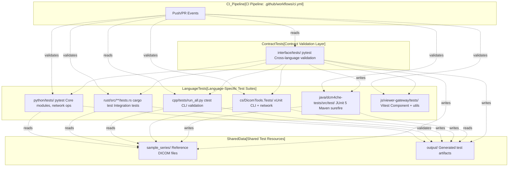
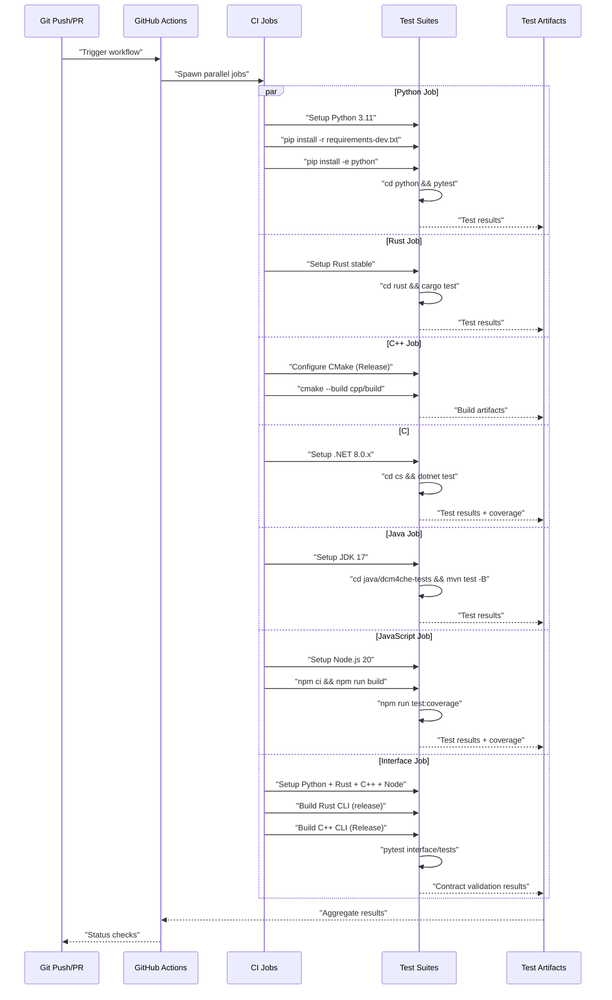
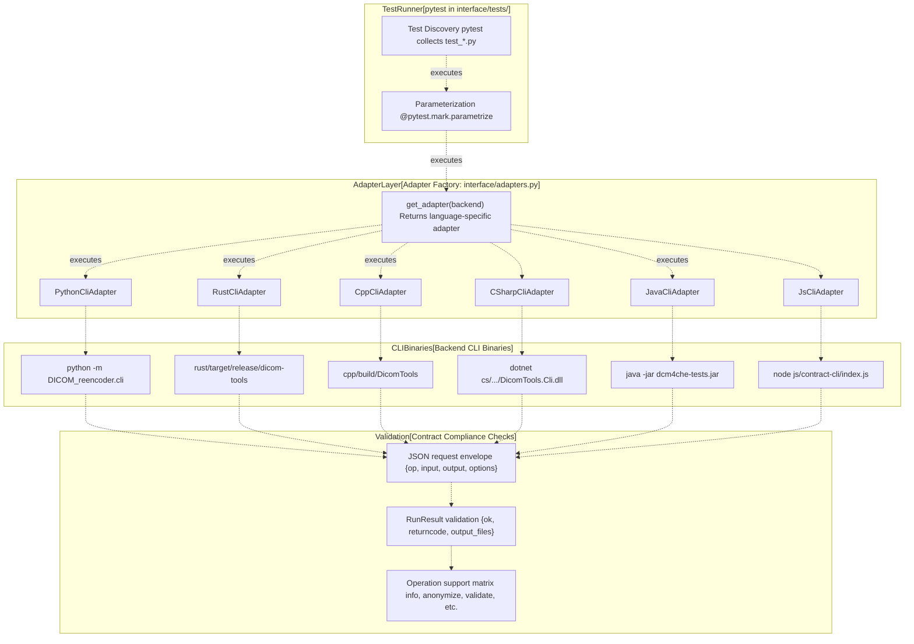
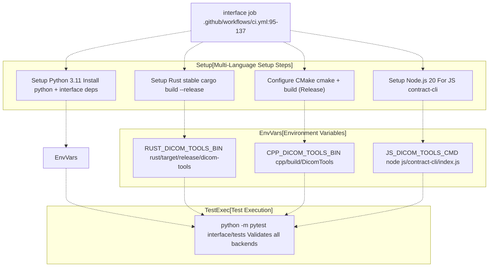

# 7a Testing Strategy

> **Relevant source files**
> * [.github/workflows/ci.yml](https://github.com/ThalesMMS/Dicom-Tools/blob/c7b4cbd8/.github/workflows/ci.yml)
> * [BUILD.md](https://github.com/ThalesMMS/Dicom-Tools/blob/c7b4cbd8/BUILD.md)
> * [README.md](https://github.com/ThalesMMS/Dicom-Tools/blob/c7b4cbd8/README.md)
> * [java/dcm4che-tests/pom.xml](https://github.com/ThalesMMS/Dicom-Tools/blob/c7b4cbd8/java/dcm4che-tests/pom.xml)
> * [scripts/setup_all.sh](https://github.com/ThalesMMS/Dicom-Tools/blob/c7b4cbd8/scripts/setup_all.sh)

This document explains the comprehensive testing approach used in the Dicom-Tools repository to ensure correctness, interoperability, and contract compliance across six language implementations (Python, Rust, C++, C#, Java, JavaScript).

For details on specific language test suites, see [Python Tests](7b%20Python-Tests.md), [C# Tests](7c%20C%23-Tests.md), [Interface and Contract Tests](7d%20Interface-and-Contract-Tests.md), and [JavaScript Tests](7e%20JavaScript-Tests.md). For information on the CLI contract that tests validate, see [Contract Specification](3a%20Contract-Specification.md).

---

## Testing Philosophy

The Dicom-Tools repository employs a **two-tier testing strategy** to ensure both individual backend correctness and cross-language interoperability:

1. **Language-Specific Tests**: Each language implementation has its own unit and integration tests that validate backend-specific functionality using native testing frameworks
2. **Contract Validation Tests**: Cross-language integration tests in [interface/tests/](https://github.com/ThalesMMS/Dicom-Tools/blob/c7b4cbd8/interface/tests/)  verify that all backends correctly implement the standardized CLI contract specified in [interface/CONTRACT.md](https://github.com/ThalesMMS/Dicom-Tools/blob/c7b4cbd8/interface/CONTRACT.md)

This dual approach allows language implementations to evolve independently while maintaining guaranteed compatibility through the shared contract interface.

**Sources**: [README.md L32-L40](https://github.com/ThalesMMS/Dicom-Tools/blob/c7b4cbd8/README.md#L32-L40)

 [.github/workflows/ci.yml L1-L138](https://github.com/ThalesMMS/Dicom-Tools/blob/c7b4cbd8/.github/workflows/ci.yml#L1-L138)

---

## Testing Architecture Overview



**Diagram: Two-Tier Testing Architecture**

The testing infrastructure separates concerns: language-specific tests focus on internal correctness, while contract tests ensure external consistency. All tests share the [sample_series/](https://github.com/ThalesMMS/Dicom-Tools/blob/c7b4cbd8/sample_series/)

 directory as a single source of truth for test data.

**Sources**: [README.md L32-L40](https://github.com/ThalesMMS/Dicom-Tools/blob/c7b4cbd8/README.md#L32-L40)

 [.github/workflows/ci.yml L1-L138](https://github.com/ThalesMMS/Dicom-Tools/blob/c7b4cbd8/.github/workflows/ci.yml#L1-L138)

 [BUILD.md L24-L33](https://github.com/ThalesMMS/Dicom-Tools/blob/c7b4cbd8/BUILD.md#L24-L33)

---

## Test Execution Methods

### Local Development Testing

Each language backend can be tested independently using native tooling:

| Language | Test Command | Working Directory | Test Framework |
| --- | --- | --- | --- |
| Python | `pytest` | `python/` | pytest |
| Rust | `cargo test` | `rust/` | cargo test + integration tests |
| C++ | `python3 tests/run_all.py` or `ctest` | `cpp/` or `cpp/build/` | Python runner + CTest |
| C# | `dotnet test DicomTools.Tests/DicomTools.Tests.csproj` | `cs/` | xUnit |
| Java | `mvn test` | `java/dcm4che-tests/` | JUnit 5 + Maven Surefire |
| JavaScript | `npm test` | `js/viewer-gateway/` | Vitest |
| Interface | `pytest` | `interface/` | pytest |

**Environment Variables for Test Configuration**:

The interface tests require environment variables to locate compiled binaries:

* `RUST_DICOM_TOOLS_BIN`: Path to Rust CLI binary (default: `rust/target/release/dicom-tools`)
* `CPP_DICOM_TOOLS_BIN`: Path to C++ CLI binary (default: `cpp/build/DicomTools`)
* `CS_DICOM_TOOLS_CMD`: Command to invoke C# CLI (default: `dotnet cs/bin/Debug/net8.0/DicomTools.Cli.dll`)
* `JAVA_DICOM_TOOLS_CMD`: Command to invoke Java CLI (default: `java -jar java/dcm4che-tests/target/dcm4che-tests.jar`)
* `JS_DICOM_TOOLS_CMD`: Command to invoke JS contract shim (default: `node js/contract-cli/index.js`)

**Sources**: [README.md L32-L40](https://github.com/ThalesMMS/Dicom-Tools/blob/c7b4cbd8/README.md#L32-L40)

 [BUILD.md L24-L33](https://github.com/ThalesMMS/Dicom-Tools/blob/c7b4cbd8/BUILD.md#L24-L33)

 [.github/workflows/ci.yml L132-L137](https://github.com/ThalesMMS/Dicom-Tools/blob/c7b4cbd8/.github/workflows/ci.yml#L132-L137)

### Automated CI Testing

The GitHub Actions CI pipeline [.github/workflows/ci.yml](https://github.com/ThalesMMS/Dicom-Tools/blob/c7b4cbd8/.github/workflows/ci.yml)

 runs all test suites on every push and pull request:



**Diagram: CI Pipeline Test Execution Flow**

The CI pipeline runs seven parallel jobs. The `interface` job is special: it builds multiple backends (Rust, C++, JavaScript) and validates contract compliance across all language implementations.

**Sources**: [.github/workflows/ci.yml L1-L138](https://github.com/ThalesMMS/Dicom-Tools/blob/c7b4cbd8/.github/workflows/ci.yml#L1-L138)

---

## Language-Specific Test Coverage

### Test Suite Characteristics

Each language implementation has distinct test characteristics aligned with its strengths:

| Backend | Test Location | Key Test Areas | Special Features |
| --- | --- | --- | --- |
| Python | [python/tests/](https://github.com/ThalesMMS/Dicom-Tools/blob/c7b4cbd8/python/tests/) | pydicom operations, pynetdicom C-ECHO/C-STORE, GDCM integration, SimpleITK volume ops, dicom-numpy | Network tests may be skipped if PACS unavailable |
| Rust | [rust/src/](https://github.com/ThalesMMS/Dicom-Tools/blob/c7b4cbd8/rust/src/) <br>  (inline `#[cfg(test)]`) | dicom-rs parsing, transfer syntax validation, JSON round-trip, multi-frame handling | Integration tests in [rust/tests/](https://github.com/ThalesMMS/Dicom-Tools/blob/c7b4cbd8/rust/tests/) |
| C++ | [cpp/tests/run_all.py](https://github.com/ThalesMMS/Dicom-Tools/blob/c7b4cbd8/cpp/tests/run_all.py) | DCMTK/GDCM transcode, ITK volume, VTK rendering, SR/RT parsing | Python test runner validates CLI output |
| C# | [cs/DicomTools.Tests/](https://github.com/ThalesMMS/Dicom-Tools/blob/c7b4cbd8/cs/DicomTools.Tests/) | fo-dicom core ops, network services (C-ECHO), DICOMweb (QIDO/STOW/WADO), codec validation | xUnit with timeout handling |
| Java | [java/dcm4che-tests/src/test/](https://github.com/ThalesMMS/Dicom-Tools/blob/c7b4cbd8/java/dcm4che-tests/src/test/) | dcm4che3 parsing, deidentification, network ops, JSON export | JUnit 5 with integration test groups |
| JavaScript | [js/viewer-gateway/tests/](https://github.com/ThalesMMS/Dicom-Tools/blob/c7b4cbd8/js/viewer-gateway/tests/) | Cornerstone3D integration, volume utilities, histogram computation, windowing | Vitest with coverage reporting |

**Sources**: [README.md L16-L22](https://github.com/ThalesMMS/Dicom-Tools/blob/c7b4cbd8/README.md#L16-L22)

 [BUILD.md L24-L33](https://github.com/ThalesMMS/Dicom-Tools/blob/c7b4cbd8/BUILD.md#L24-L33)

### Test Organization Pattern

```mermaid
flowchart TD

JSUnit["*.test.ts Component tests"]
JSConfig["vitest.config.ts Vitest configuration"]
JSUtils["utils.test.ts Utility tests"]
JavaUnit["*Test.java JUnit 5 tests"]
JavaPom["pom.xml Maven Surefire config"]
JavaGroups["@Tag annotations Test categorization"]
CSharpCli["CliTests.cs CLI operation tests"]
CSharpProj["DicomTools.Tests.csproj xUnit configuration"]
CSharpNet["NetworkTests.cs DIMSE/DICOMweb tests"]
CppRunner["run_all.py Test orchestrator"]
CppTests["test_*.py CLI validation scripts"]
RustInline["Inline #[cfg(test)] Unit tests with code"]
RustDoc["Doc tests in comments Example validation"]
RustInteg["tests/*.rs Integration tests"]
PythonUnit["test_core.py test_utils.py Unit tests"]
PythonConf["pytest.ini conftest.py Configuration"]
PythonInteg["test_network.py test_gdcm.py Integration tests"]

subgraph subGraph5 ["JSOrg[JavaScript: js/viewer-gateway/tests/]"]
    JSUnit
    JSConfig
    JSUtils
    JSUnit -.-> JSConfig
    JSUtils -.-> JSConfig
end

subgraph subGraph4 ["JavaOrg[Java: java/dcm4che-tests/src/test/]"]
    JavaUnit
    JavaPom
    JavaGroups
    JavaUnit -.-> JavaPom
    JavaGroups -.-> JavaPom
end

subgraph subGraph3 ["CSharpOrg[C#: cs/DicomTools.Tests/]"]
    CSharpCli
    CSharpProj
    CSharpNet
    CSharpCli -.-> CSharpProj
    CSharpNet -.-> CSharpProj
end

subgraph subGraph2 ["CppOrg[C++: cpp/tests/]"]
    CppRunner
    CppTests
    CppRunner -.-> CppTests
end

subgraph subGraph1 ["RustOrg[Rust: rust/src/ + rust/tests/]"]
    RustInline
    RustDoc
    RustInteg
    RustInline -.-> RustDoc
    RustInteg -.-> RustDoc
end

subgraph subGraph0 ["PythonOrg[Python: python/tests/]"]
    PythonUnit
    PythonConf
    PythonInteg
    PythonUnit -.-> PythonConf
    PythonInteg -.-> PythonConf
end
```



**Diagram: Test Organization Patterns by Language**

Each language follows idiomatic test organization: Rust uses inline unit tests, Python uses a dedicated `tests/` directory, C# separates by concern (CLI vs. Network), Java uses Maven conventions with test groups, and JavaScript uses Vitest with TypeScript.

**Sources**: [python/requirements-dev.txt](https://github.com/ThalesMMS/Dicom-Tools/blob/c7b4cbd8/python/requirements-dev.txt)

 [rust/Cargo.toml](https://github.com/ThalesMMS/Dicom-Tools/blob/c7b4cbd8/rust/Cargo.toml)

 [cpp/tests/run_all.py](https://github.com/ThalesMMS/Dicom-Tools/blob/c7b4cbd8/cpp/tests/run_all.py)

 [cs/DicomTools.Tests/](https://github.com/ThalesMMS/Dicom-Tools/blob/c7b4cbd8/cs/DicomTools.Tests/)

 [java/dcm4che-tests/pom.xml L140-L147](https://github.com/ThalesMMS/Dicom-Tools/blob/c7b4cbd8/java/dcm4che-tests/pom.xml#L140-L147)

 [js/viewer-gateway/package.json](https://github.com/ThalesMMS/Dicom-Tools/blob/c7b4cbd8/js/viewer-gateway/package.json)

---

## Contract Validation Testing

The [interface/tests/](https://github.com/ThalesMMS/Dicom-Tools/blob/c7b4cbd8/interface/tests/)

 directory contains cross-language integration tests that verify all backends conform to the CLI contract specification.

### Contract Test Execution Model



**Diagram: Contract Validation Test Flow**

Contract tests use parameterized pytest fixtures to execute the same test against all backends. The `get_adapter()` factory returns the appropriate adapter, which translates the request into backend-specific CLI invocations and validates the response format.

**Sources**: [interface/tests/](https://github.com/ThalesMMS/Dicom-Tools/blob/c7b4cbd8/interface/tests/)

 [interface/adapters.py](https://github.com/ThalesMMS/Dicom-Tools/blob/c7b4cbd8/interface/adapters.py)

 [.github/workflows/ci.yml L95-L137](https://github.com/ThalesMMS/Dicom-Tools/blob/c7b4cbd8/.github/workflows/ci.yml#L95-L137)

### Interface Test Configuration

The interface job in CI requires careful setup to ensure all backends are available:



**Diagram: Interface Test CI Configuration**

The interface job is the most complex CI job because it must build and coordinate multiple language backends. It sets environment variables to point adapters to the correct binaries.

**Sources**: [.github/workflows/ci.yml L95-L137](https://github.com/ThalesMMS/Dicom-Tools/blob/c7b4cbd8/.github/workflows/ci.yml#L95-L137)

 [BUILD.md L34-L41](https://github.com/ThalesMMS/Dicom-Tools/blob/c7b4cbd8/BUILD.md#L34-L41)

---

## Test Data Management

### Shared Test Dataset

All tests use the [sample_series/](https://github.com/ThalesMMS/Dicom-Tools/blob/c7b4cbd8/sample_series/)

 directory as a single source of truth for DICOM test data. This ensures:

* **Consistency**: All backends test against identical DICOM files
* **Reproducibility**: Tests produce deterministic results
* **Efficiency**: No need to duplicate test data per language

The [sample_series/](https://github.com/ThalesMMS/Dicom-Tools/blob/c7b4cbd8/sample_series/)

 directory contains:

* Multi-slice CT series (IM-0001-0001.dcm through IM-0001-0190.dcm)
* Various transfer syntaxes for codec testing
* Anonymization test cases
* Network operation test data

**Sources**: [README.md L24-L25](https://github.com/ThalesMMS/Dicom-Tools/blob/c7b4cbd8/README.md#L24-L25)

### Test Output Isolation

Each backend writes test outputs to backend-specific subdirectories under [output/](https://github.com/ThalesMMS/Dicom-Tools/blob/c7b4cbd8/output/)

:

```markdown
output/
├── python/          # Python test outputs
├── rust/            # Rust test outputs
├── cpp/             # C++ test outputs
├── cs/              # C# test outputs
├── java/            # Java test outputs
└── js/              # JavaScript test outputs
```

This prevents conflicts when running tests in parallel and allows easy cleanup between test runs.

**Sources**: [BUILD.md L43-L44](https://github.com/ThalesMMS/Dicom-Tools/blob/c7b4cbd8/BUILD.md#L43-L44)

---

## Test Quality and Coverage

### Coverage Reporting

Coverage tracking varies by language:

| Language | Coverage Tool | Activation | Report Location |
| --- | --- | --- | --- |
| Python | pytest-cov | `pytest --cov` | Terminal + HTML report |
| Rust | tarpaulin / llvm-cov | `cargo tarpaulin` | Terminal + cobertura.xml |
| C++ | gcov/lcov | CMake flag | build/coverage/ |
| C# | Built-in | `dotnet test --collect:"XPlat Code Coverage"` | TestResults/ |
| Java | JaCoCo | Maven profile `coverage` | target/site/jacoco/ |
| JavaScript | Vitest | `npm run test:coverage` | coverage/ |

The JavaScript CI job explicitly runs with coverage: [js/viewer-gateway L92-L93](https://github.com/ThalesMMS/Dicom-Tools/blob/c7b4cbd8/js/viewer-gateway#L92-L93)

The Java Maven configuration supports a `coverage` profile that enables JaCoCo: [java/dcm4che-tests/pom.xml L173-L208](https://github.com/ThalesMMS/Dicom-Tools/blob/c7b4cbd8/java/dcm4che-tests/pom.xml#L173-L208)

**Sources**: [.github/workflows/ci.yml L91-L93](https://github.com/ThalesMMS/Dicom-Tools/blob/c7b4cbd8/.github/workflows/ci.yml#L91-L93)

 [java/dcm4che-tests/pom.xml L173-L208](https://github.com/ThalesMMS/Dicom-Tools/blob/c7b4cbd8/java/dcm4che-tests/pom.xml#L173-L208)

### Test Categorization

Some backends categorize tests to allow selective execution:

**Java Test Groups**: The Maven Surefire plugin excludes `integration` tests by default:

```xml
<excludedGroups>integration</excludedGroups>
```

Tests can be annotated with `@Tag("integration")` to mark them as integration tests. The `coverage` profile clears this exclusion to run all tests.

**C# Timeout Handling**: The .NET tests include blame hang timeout configuration:

```
--blame-hang-timeout 2m --blame-hang-dump-type none
```

This prevents CI hangs from network tests that may timeout.

**Sources**: [java/dcm4che-tests/pom.xml L14-L145](https://github.com/ThalesMMS/Dicom-Tools/blob/c7b4cbd8/java/dcm4che-tests/pom.xml#L14-L145)

 [.github/workflows/ci.yml L50](https://github.com/ThalesMMS/Dicom-Tools/blob/c7b4cbd8/.github/workflows/ci.yml#L50-L50)

---

## Setup and Maintenance

### Initial Test Setup

The [scripts/setup_all.sh](https://github.com/ThalesMMS/Dicom-Tools/blob/c7b4cbd8/scripts/setup_all.sh)

 script prepares the entire testing environment:

1. Installs Python package with dev dependencies: `pip install -r requirements-dev.txt && pip install -e python`
2. Builds Rust release binary: `cargo build --release`
3. Configures and builds C++ binary: `cmake && make`
4. Restores C# dependencies: `dotnet restore && dotnet build`
5. Packages Java CLI: `mvn package -DskipTests`
6. Installs JavaScript dependencies: `npm ci`

**Sources**: [scripts/setup_all.sh L1-L60](https://github.com/ThalesMMS/Dicom-Tools/blob/c7b4cbd8/scripts/setup_all.sh#L1-L60)

### Test Maintenance Guidelines

1. **Add test data to sample_series/**: Keep the shared test dataset comprehensive
2. **Update contract tests when adding operations**: Ensure new operations are validated across all backends
3. **Maintain language-specific test coverage**: Each backend should test its unique features
4. **Keep CI configuration in sync**: Update [.github/workflows/ci.yml](https://github.com/ThalesMMS/Dicom-Tools/blob/c7b4cbd8/.github/workflows/ci.yml)  when adding new test requirements
5. **Document test prerequisites**: Update [BUILD.md](https://github.com/ThalesMMS/Dicom-Tools/blob/c7b4cbd8/BUILD.md)  with any new dependencies or setup steps

**Sources**: [README.md L1-L43](https://github.com/ThalesMMS/Dicom-Tools/blob/c7b4cbd8/README.md#L1-L43)

 [BUILD.md L1-L48](https://github.com/ThalesMMS/Dicom-Tools/blob/c7b4cbd8/BUILD.md#L1-L48)


### On this page

* [Testing Strategy](#7.1-testing-strategy)
* [Testing Philosophy](#7.1-testing-philosophy)
* [Testing Architecture Overview](#7.1-testing-architecture-overview)
* [Test Execution Methods](#7.1-test-execution-methods)
* [Local Development Testing](#7.1-local-development-testing)
* [Automated CI Testing](#7.1-automated-ci-testing)
* [Language-Specific Test Coverage](#7.1-language-specific-test-coverage)
* [Test Suite Characteristics](#7.1-test-suite-characteristics)
* [Test Organization Pattern](#7.1-test-organization-pattern)
* [Contract Validation Testing](#7.1-contract-validation-testing)
* [Contract Test Execution Model](#7.1-contract-test-execution-model)
* [Interface Test Configuration](#7.1-interface-test-configuration)
* [Test Data Management](#7.1-test-data-management)
* [Shared Test Dataset](#7.1-shared-test-dataset)
* [Test Output Isolation](#7.1-test-output-isolation)
* [Test Quality and Coverage](#7.1-test-quality-and-coverage)
* [Coverage Reporting](#7.1-coverage-reporting)
* [Test Categorization](#7.1-test-categorization)
* [Setup and Maintenance](#7.1-setup-and-maintenance)
* [Initial Test Setup](#7.1-initial-test-setup)
* [Test Maintenance Guidelines](#7.1-test-maintenance-guidelines)

Ask Devin about Dicom-Tools