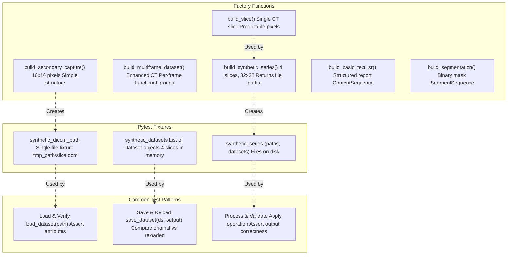
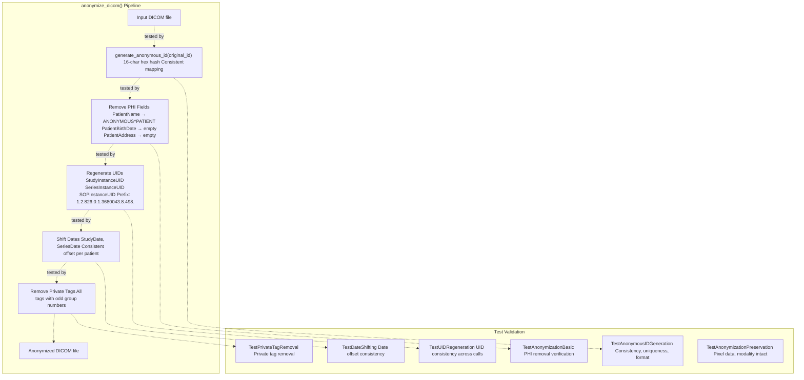
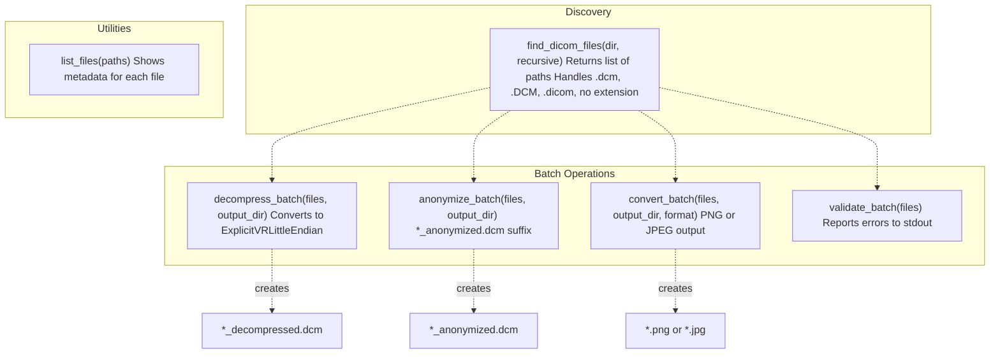

# 7b Python Tests

> **Relevant source files**
> * [python/DICOM_reencoder/core/factories.py](https://github.com/ThalesMMS/Dicom-Tools/blob/c7b4cbd8/python/DICOM_reencoder/core/factories.py)
> * [python/tests/test_anonymize_dicom.py](https://github.com/ThalesMMS/Dicom-Tools/blob/c7b4cbd8/python/tests/test_anonymize_dicom.py)
> * [python/tests/test_batch_process.py](https://github.com/ThalesMMS/Dicom-Tools/blob/c7b4cbd8/python/tests/test_batch_process.py)
> * [python/tests/test_convert_to_image.py](https://github.com/ThalesMMS/Dicom-Tools/blob/c7b4cbd8/python/tests/test_convert_to_image.py)
> * [python/tests/test_core_modules.py](https://github.com/ThalesMMS/Dicom-Tools/blob/c7b4cbd8/python/tests/test_core_modules.py)
> * [python/tests/test_dicom_numpy_advanced.py](https://github.com/ThalesMMS/Dicom-Tools/blob/c7b4cbd8/python/tests/test_dicom_numpy_advanced.py)
> * [python/tests/test_extract_metadata.py](https://github.com/ThalesMMS/Dicom-Tools/blob/c7b4cbd8/python/tests/test_extract_metadata.py)
> * [python/tests/test_gdcm_advanced.py](https://github.com/ThalesMMS/Dicom-Tools/blob/c7b4cbd8/python/tests/test_gdcm_advanced.py)
> * [python/tests/test_modify_tags.py](https://github.com/ThalesMMS/Dicom-Tools/blob/c7b4cbd8/python/tests/test_modify_tags.py)
> * [python/tests/test_organize_dicom.py](https://github.com/ThalesMMS/Dicom-Tools/blob/c7b4cbd8/python/tests/test_organize_dicom.py)
> * [python/tests/test_pixel_stats.py](https://github.com/ThalesMMS/Dicom-Tools/blob/c7b4cbd8/python/tests/test_pixel_stats.py)
> * [python/tests/test_pydicom_advanced.py](https://github.com/ThalesMMS/Dicom-Tools/blob/c7b4cbd8/python/tests/test_pydicom_advanced.py)
> * [python/tests/test_pynetdicom_advanced.py](https://github.com/ThalesMMS/Dicom-Tools/blob/c7b4cbd8/python/tests/test_pynetdicom_advanced.py)

## Purpose and Scope

This page documents the Python test suite for the Dicom-Tools repository. The Python backend provides the most comprehensive DICOM functionality with 20+ CLI commands, and the test suite ensures correctness across core modules, library integrations, and CLI operations. The tests validate pydicom, pynetdicom, GDCM, SimpleITK, and dicom-numpy integrations, as well as all CLI commands for anonymization, conversion, batch processing, and network operations.

For information about the overall testing strategy across all language backends, see [Testing Strategy](7a%20Testing-Strategy.md). For cross-language contract validation, see [Interface and Contract Tests](7d%20Interface-and-Contract-Tests.md).

---

## Test Organization

The Python test suite is organized into three main categories: library integration tests that validate external dependencies, core module tests that verify internal functionality, and CLI operation tests that ensure command-line tools work correctly.

### Test Suite Structure

```mermaid
flowchart TD

LibTests["Library Integration Tests"]
CoreTests["Core Module Tests"]
CLITests["CLI Operation Tests"]
PynetdicomTests["test_pynetdicom_advanced.py Network operations, associations event handlers, role selection"]
GDCMTests["test_gdcm_advanced.py Codec support, image manipulation anonymization, transcoding"]
DicomNumpyTests["test_dicom_numpy_advanced.py Volume reconstruction, affine matrices orientation handling"]
PydicomTests["test_pydicom_advanced.py UID handling, value representations dataset manipulation"]
CoreModuleTests["test_core_modules.py datasets I/O, images processing metadata extraction"]
MetadataTests["test_extract_metadata.py Patient, study, series, image info"]
PixelStatsTests["test_pixel_stats.py Statistics, histograms, comparisons"]
ModifyTagsTests["test_modify_tags.py Tag modification, batch updates"]
AnonymizeTests["test_anonymize_dicom.py PHI removal, UID regeneration date shifting"]
ConvertTests["test_convert_to_image.py PNG/JPEG export, windowing frame selection"]
BatchTests["test_batch_process.py File discovery, batch operations validation"]
OrganizeTests["test_organize_dicom.py Patient/study/series organization filename sanitization"]
Factories["factories.py build_slice, build_synthetic_series build_multiframe_dataset"]
Fixtures["conftest.py synthetic_dicom_path synthetic_datasets, synthetic_series"]

LibTests -.->|"uses"| PynetdicomTests
LibTests -.->|"uses"| GDCMTests
LibTests -.->|"uses"| DicomNumpyTests
LibTests -.->|"uses"| PydicomTests
CoreTests -.->|"uses"| CoreModuleTests
CoreTests -.->|"uses"| MetadataTests
CoreTests -.->|"uses"| PixelStatsTests
CoreTests -.->|"uses"| ModifyTagsTests
CLITests -.->|"uses"| AnonymizeTests
CLITests -.-> ConvertTests
CLITests -.->|"uses"| BatchTests
CLITests -.-> OrganizeTests
PynetdicomTests -.->|"uses"| Factories
GDCMTests -.-> Factories
DicomNumpyTests -.-> Factories
PydicomTests -.-> Factories
CoreModuleTests -.-> Factories
AnonymizeTests -.-> Factories
PynetdicomTests -.-> Fixtures
GDCMTests -.-> Fixtures
DicomNumpyTests -.-> Fixtures
CoreModuleTests -.-> Fixtures
AnonymizeTests -.-> Fixtures

subgraph subGraph4 ["Test Infrastructure"]
    Factories
    Fixtures
end

subgraph subGraph3 ["CLI Operations"]
    AnonymizeTests
    ConvertTests
    BatchTests
    OrganizeTests
end

subgraph subGraph2 ["Core Modules"]
    CoreModuleTests
    MetadataTests
    PixelStatsTests
    ModifyTagsTests
end

subgraph subGraph1 ["Library Integration"]
    PynetdicomTests
    GDCMTests
    DicomNumpyTests
    PydicomTests
end

subgraph subGraph0 ["Test Categories"]
    LibTests
    CoreTests
    CLITests
end
```



**Sources:** [python/tests/test_pynetdicom_advanced.py L1-L517](https://github.com/ThalesMMS/Dicom-Tools/blob/c7b4cbd8/python/tests/test_pynetdicom_advanced.py#L1-L517)

 [python/tests/test_gdcm_advanced.py L1-L463](https://github.com/ThalesMMS/Dicom-Tools/blob/c7b4cbd8/python/tests/test_gdcm_advanced.py#L1-L463)

 [python/tests/test_dicom_numpy_advanced.py L1-L447](https://github.com/ThalesMMS/Dicom-Tools/blob/c7b4cbd8/python/tests/test_dicom_numpy_advanced.py#L1-L447)

 [python/tests/test_pydicom_advanced.py L1-L363](https://github.com/ThalesMMS/Dicom-Tools/blob/c7b4cbd8/python/tests/test_pydicom_advanced.py#L1-L363)

 [python/tests/test_core_modules.py L1-L235](https://github.com/ThalesMMS/Dicom-Tools/blob/c7b4cbd8/python/tests/test_core_modules.py#L1-L235)

 [python/DICOM_reencoder/core/factories.py L1-L362](https://github.com/ThalesMMS/Dicom-Tools/blob/c7b4cbd8/python/DICOM_reencoder/core/factories.py#L1-L362)

### Test Module Mapping

| Test Module | Primary Focus | Key Classes | Lines of Code |
| --- | --- | --- | --- |
| `test_pynetdicom_advanced.py` | Network operations | `TestPresentationContexts`, `TestAssociationNegotiation`, `TestEventHandlers`, `TestRoleSelection`, `TestConcurrentAssociations` | 517 |
| `test_gdcm_advanced.py` | GDCM integration | `TestCodecSupport`, `TestImageManipulation`, `TestAnonymizer`, `TestTranscodingAdvanced` | 463 |
| `test_dicom_numpy_advanced.py` | Volume reconstruction | `TestAffineMatrixProperties`, `TestOrientationHandling`, `TestPixelRepresentations`, `TestSliceOrderingEdgeCases` | 447 |
| `test_pydicom_advanced.py` | Pydicom features | `TestUIDHandling`, `TestValueRepresentations`, `TestSequenceManipulation`, `TestPixelDataHandling` | 363 |
| `test_core_modules.py` | Core functionality | `TestDatasetsIO`, `TestDatasetJSON`, `TestImagesProcessing`, `TestMetadataExtraction` | 235 |
| `test_anonymize_dicom.py` | Anonymization | `TestAnonymousIDGeneration`, `TestAnonymizationBasic`, `TestUIDRegeneration`, `TestDateShifting` | 328 |
| `test_batch_process.py` | Batch operations | `TestFindDicomFiles`, `TestDecompressBatch`, `TestAnonymizeBatch`, `TestConvertBatch` | 263 |

**Sources:** [python/tests/test_pynetdicom_advanced.py L1-L10](https://github.com/ThalesMMS/Dicom-Tools/blob/c7b4cbd8/python/tests/test_pynetdicom_advanced.py#L1-L10)

 [python/tests/test_gdcm_advanced.py L1-L10](https://github.com/ThalesMMS/Dicom-Tools/blob/c7b4cbd8/python/tests/test_gdcm_advanced.py#L1-L10)

 [python/tests/test_dicom_numpy_advanced.py L1-L10](https://github.com/ThalesMMS/Dicom-Tools/blob/c7b4cbd8/python/tests/test_dicom_numpy_advanced.py#L1-L10)

 [python/tests/test_pydicom_advanced.py L1-L10](https://github.com/ThalesMMS/Dicom-Tools/blob/c7b4cbd8/python/tests/test_pydicom_advanced.py#L1-L10)

 [python/tests/test_core_modules.py L1-L10](https://github.com/ThalesMMS/Dicom-Tools/blob/c7b4cbd8/python/tests/test_core_modules.py#L1-L10)

 [python/tests/test_anonymize_dicom.py L1-L10](https://github.com/ThalesMMS/Dicom-Tools/blob/c7b4cbd8/python/tests/test_anonymize_dicom.py#L1-L10)

 [python/tests/test_batch_process.py L1-L10](https://github.com/ThalesMMS/Dicom-Tools/blob/c7b4cbd8/python/tests/test_batch_process.py#L1-L10)

---

## Test Infrastructure

### Test Data Generation

The test infrastructure relies on synthetic DICOM dataset factories defined in `factories.py`. These factories create predictable, deterministic test data that can be used across all test modules without requiring external DICOM files.



**Sources:** [python/DICOM_reencoder/core/factories.py L41-L101](https://github.com/ThalesMMS/Dicom-Tools/blob/c7b4cbd8/python/DICOM_reencoder/core/factories.py#L41-L101)

 [python/DICOM_reencoder/core/factories.py L217-L244](https://github.com/ThalesMMS/Dicom-Tools/blob/c7b4cbd8/python/DICOM_reencoder/core/factories.py#L217-L244)

 [python/DICOM_reencoder/core/factories.py L168-L214](https://github.com/ThalesMMS/Dicom-Tools/blob/c7b4cbd8/python/DICOM_reencoder/core/factories.py#L168-L214)

 [python/DICOM_reencoder/core/factories.py L132-L165](https://github.com/ThalesMMS/Dicom-Tools/blob/c7b4cbd8/python/DICOM_reencoder/core/factories.py#L132-L165)

### Key Factory Functions

**`build_slice(rows, cols, position, *, pixel_spacing, study_uid, series_uid, instance)`**

* Creates a single CT slice with predictable pixel values
* Pixels populated as `np.arange(rows * cols) + instance` for deterministic testing
* Includes proper file meta information and DICOM hierarchy UIDs
* Location: [python/DICOM_reencoder/core/factories.py L41-L78](https://github.com/ThalesMMS/Dicom-Tools/blob/c7b4cbd8/python/DICOM_reencoder/core/factories.py#L41-L78)

**`build_synthetic_series(output_dir, *, slices=4, shape=(32,32), pixel_spacing=(0.7,0.7))`**

* Generates a complete DICOM series with consistent StudyInstanceUID and SeriesInstanceUID
* Returns list of file paths for tests that need actual files on disk
* Default configuration: 4 slices, 32×32 pixels, 0.7mm spacing
* Location: [python/DICOM_reencoder/core/factories.py L81-L100](https://github.com/ThalesMMS/Dicom-Tools/blob/c7b4cbd8/python/DICOM_reencoder/core/factories.py#L81-L100)

**`build_multiframe_dataset(frames=3, shape=(8,8))`**

* Creates Enhanced CT Image Storage with PerFrameFunctionalGroupsSequence
* Each frame has unique DimensionIndexValues and ImagePositionPatient
* Tests multi-frame parsing and frame extraction logic
* Location: [python/DICOM_reencoder/core/factories.py L168-L214](https://github.com/ThalesMMS/Dicom-Tools/blob/c7b4cbd8/python/DICOM_reencoder/core/factories.py#L168-L214)

**Sources:** [python/DICOM_reencoder/core/factories.py L41-L214](https://github.com/ThalesMMS/Dicom-Tools/blob/c7b4cbd8/python/DICOM_reencoder/core/factories.py#L41-L214)

---

## Library Integration Tests

### pynetdicom Network Operations

The `test_pynetdicom_advanced.py` module validates DICOM network operations, focusing on association negotiation, presentation contexts, event handlers, and concurrent connections.

#### Test Class Organization

```mermaid
flowchart TD

PC1["test_multiple_transfer_syntaxes_per_context build_context with multiple syntaxes"]
PC2["test_context_rejection_handling accepted_contexts vs rejected_contexts"]
PC3["test_storage_presentation_contexts_count Verify >100 SOP classes"]
AN1["test_association_establishment_with_custom_ae_title AE() with custom ae_title"]
AN2["test_association_abort_handling assoc.abort() + EVT_ABORTED"]
AN3["test_maximum_pdu_length_negotiation ae.maximum_pdu_size validation"]
EH1["test_c_echo_handler_invocation EVT_C_ECHO handler"]
EH2["test_c_store_handler_receives_dataset event.dataset + event.file_meta"]
EH3["test_c_find_handler_yields_multiple_results Generator pattern, 0xFF00 pending status"]
CA1["test_multiple_concurrent_stores ThreadPoolExecutor with 5 workers"]
CA2["test_association_limit_enforcement ae.maximum_associations = 2"]
FreePort["free_port() Find available TCP port"]
BuildSC["build_secondary_capture() Test dataset factory"]
AESetup["AE setup pattern add_supported_context add_requested_context"]

PC1 -.->|"uses"| AESetup
AN1 -.->|"uses"| FreePort
EH2 -.->|"uses"| BuildSC
CA1 -.->|"uses"| FreePort
CA1 -.->|"uses"| BuildSC

subgraph subGraph4 ["Supporting Infrastructure"]
    FreePort
    BuildSC
    AESetup
end

subgraph TestConcurrentAssociations ["TestConcurrentAssociations"]
    CA1
    CA2
end

subgraph TestEventHandlers ["TestEventHandlers"]
    EH1
    EH2
    EH3
end

subgraph TestAssociationNegotiation ["TestAssociationNegotiation"]
    AN1
    AN2
    AN3
end

subgraph TestPresentationContexts ["TestPresentationContexts"]
    PC1
    PC2
    PC3
end
```



**Sources:** [python/tests/test_pynetdicom_advanced.py L53-L97](https://github.com/ThalesMMS/Dicom-Tools/blob/c7b4cbd8/python/tests/test_pynetdicom_advanced.py#L53-L97)

 [python/tests/test_pynetdicom_advanced.py L99-L198](https://github.com/ThalesMMS/Dicom-Tools/blob/c7b4cbd8/python/tests/test_pynetdicom_advanced.py#L99-L198)

 [python/tests/test_pynetdicom_advanced.py L200-L318](https://github.com/ThalesMMS/Dicom-Tools/blob/c7b4cbd8/python/tests/test_pynetdicom_advanced.py#L200-L318)

 [python/tests/test_pynetdicom_advanced.py L393-L463](https://github.com/ThalesMMS/Dicom-Tools/blob/c7b4cbd8/python/tests/test_pynetdicom_advanced.py#L393-L463)

#### Key Test Patterns

**Association Lifecycle Pattern**

```
# Pattern used throughout test_pynetdicom_advanced.pyae_scp = AE(ae_title="SERVER")ae_scp.add_supported_context(Verification)port = free_port()server = ae_scp.start_server(("127.0.0.1", port), block=False)ae_scu = AE(ae_title="CLIENT")ae_scu.add_requested_context(Verification)assoc = ae_scu.associate("127.0.0.1", port)if assoc.is_established:    # Perform DICOM operations    assoc.release()ae_scu.shutdown()server.shutdown()
```

This pattern appears in: [python/tests/test_pynetdicom_advanced.py L102-L146](https://github.com/ThalesMMS/Dicom-Tools/blob/c7b4cbd8/python/tests/test_pynetdicom_advanced.py#L102-L146)

 [python/tests/test_pynetdicom_advanced.py L203-L234](https://github.com/ThalesMMS/Dicom-Tools/blob/c7b4cbd8/python/tests/test_pynetdicom_advanced.py#L203-L234)

 [python/tests/test_pynetdicom_advanced.py L236-L272](https://github.com/ThalesMMS/Dicom-Tools/blob/c7b4cbd8/python/tests/test_pynetdicom_advanced.py#L236-L272)

**Event Handler Registration**

* `EVT_C_ECHO` validates C-ECHO requests: [python/tests/test_pynetdicom_advanced.py L203-L234](https://github.com/ThalesMMS/Dicom-Tools/blob/c7b4cbd8/python/tests/test_pynetdicom_advanced.py#L203-L234)
* `EVT_C_STORE` captures received datasets: [python/tests/test_pynetdicom_advanced.py L236-L272](https://github.com/ThalesMMS/Dicom-Tools/blob/c7b4cbd8/python/tests/test_pynetdicom_advanced.py#L236-L272)
* `EVT_C_FIND` yields multiple results with pending status: [python/tests/test_pynetdicom_advanced.py L274-L317](https://github.com/ThalesMMS/Dicom-Tools/blob/c7b4cbd8/python/tests/test_pynetdicom_advanced.py#L274-L317)
* `EVT_ABORTED` tracks association aborts: [python/tests/test_pynetdicom_advanced.py L147-L175](https://github.com/ThalesMMS/Dicom-Tools/blob/c7b4cbd8/python/tests/test_pynetdicom_advanced.py#L147-L175)

**Sources:** [python/tests/test_pynetdicom_advanced.py L1-L517](https://github.com/ThalesMMS/Dicom-Tools/blob/c7b4cbd8/python/tests/test_pynetdicom_advanced.py#L1-L517)

### GDCM Integration Tests

The `test_gdcm_advanced.py` module validates GDCM functionality including codec detection, image manipulation, anonymization, and transcoding operations.

#### Test Coverage

| Test Class | Primary Methods | Validation Focus |
| --- | --- | --- |
| `TestCodecSupport` | `JPEGCodec.CanDecode()`, `TransferSyntax` | JPEG baseline availability |
| `TestImageManipulation` | `ImageReader.Read()`, `image.GetDimensions()` | Pixel buffer extraction |
| `TestStringFilter` | `StringFilter.ToString()`, tag lookup | Tag value retrieval |
| `TestScanner` | `Scanner.Scan()`, `Scanner.GetValue()` | Batch metadata extraction |
| `TestAnonymizer` | `Anonymizer.Empty()`, `RemovePrivateTags()` | PHI removal |
| `TestTranscodingAdvanced` | `transcode()` function | Transfer syntax conversion |

**Sources:** [python/tests/test_gdcm_advanced.py L35-L67](https://github.com/ThalesMMS/Dicom-Tools/blob/c7b4cbd8/python/tests/test_gdcm_advanced.py#L35-L67)

 [python/tests/test_gdcm_advanced.py L69-L120](https://github.com/ThalesMMS/Dicom-Tools/blob/c7b4cbd8/python/tests/test_gdcm_advanced.py#L69-L120)

 [python/tests/test_gdcm_advanced.py L122-L155](https://github.com/ThalesMMS/Dicom-Tools/blob/c7b4cbd8/python/tests/test_gdcm_advanced.py#L122-L155)

 [python/tests/test_gdcm_advanced.py L157-L208](https://github.com/ThalesMMS/Dicom-Tools/blob/c7b4cbd8/python/tests/test_gdcm_advanced.py#L157-L208)

 [python/tests/test_gdcm_advanced.py L210-L260](https://github.com/ThalesMMS/Dicom-Tools/blob/c7b4cbd8/python/tests/test_gdcm_advanced.py#L210-L260)

 [python/tests/test_gdcm_advanced.py L262-L299](https://github.com/ThalesMMS/Dicom-Tools/blob/c7b4cbd8/python/tests/test_gdcm_advanced.py#L262-L299)

#### Scanner Pattern for Batch Operations

The GDCM Scanner provides efficient batch metadata extraction without fully parsing datasets:

```
# Pattern from test_scanner_series_organizationscanner = gdcm.Scanner()scanner.AddTag(gdcm.Tag(0x0020, 0x000E))  # SeriesInstanceUIDsuccess = scanner.Scan([str(p) for p in paths])for path in paths:    uid = scanner.GetValue(str(path), gdcm.Tag(0x0020, 0x000E))    # Process without loading full dataset
```

This pattern enables efficient series organization and metadata queries. Location: [python/tests/test_gdcm_advanced.py L191-L208](https://github.com/ThalesMMS/Dicom-Tools/blob/c7b4cbd8/python/tests/test_gdcm_advanced.py#L191-L208)

**Sources:** [python/tests/test_gdcm_advanced.py L157-L208](https://github.com/ThalesMMS/Dicom-Tools/blob/c7b4cbd8/python/tests/test_gdcm_advanced.py#L157-L208)

### dicom-numpy Volume Reconstruction

The `test_dicom_numpy_advanced.py` module validates 3D volume reconstruction from DICOM slices, focusing on affine transformation matrices, orientation handling, and edge cases.

#### Affine Matrix Testing

```mermaid
flowchart TD

Shape["affine.shape == (4,4) Last row [0,0,0,1]"]
Invertible["det(affine) ≠ 0 Invertible transformation"]
Spacing["Extract spacing from columns norm(affine[:3,:3], axis=0)"]
Origin["affine[:3,3] matches ImagePositionPatient"]
Axial["test_axial_orientation Standard rows=AP, cols=LR"]
Oblique["test_oblique_slices_combine Rotated orientation matrices"]
Coronal["test_coronal_orientation ImageOrientationPatient [1,0,0,0,0,1]"]
Sagittal["test_sagittal_orientation ImageOrientationPatient [0,1,0,0,0,1]"]
Reverse["test_reverse_slice_order Non-sequential positions"]
Gantry["test_gantry_tilt_handling enforce_slice_spacing=False"]
Gaps["test_enforce_spacing_detects_gaps Raises DicomImportException"]
Temporal["test_temporal_series_separation Multiple time points"]
CombineSlices["combine_slices(datasets) Returns (volume, affine)"]

Shape -.-> CombineSlices
Invertible -.-> CombineSlices
Axial -.-> CombineSlices
Oblique -.-> CombineSlices
Reverse -.-> CombineSlices
Gantry -.-> CombineSlices

subgraph subGraph3 ["Core Function"]
    CombineSlices
end

subgraph subGraph2 ["Edge Cases"]
    Reverse
    Gantry
    Gaps
    Temporal
end

subgraph subGraph1 ["Orientation Support"]
    Axial
    Oblique
    Coronal
    Sagittal
end

subgraph subGraph0 ["Affine Matrix Properties"]
    Shape
    Invertible
    Spacing
    Origin
end
```



**Sources:** [python/tests/test_dicom_numpy_advanced.py L19-L68](https://github.com/ThalesMMS/Dicom-Tools/blob/c7b4cbd8/python/tests/test_dicom_numpy_advanced.py#L19-L68)

 [python/tests/test_dicom_numpy_advanced.py L71-L132](https://github.com/ThalesMMS/Dicom-Tools/blob/c7b4cbd8/python/tests/test_dicom_numpy_advanced.py#L71-L132)

 [python/tests/test_dicom_numpy_advanced.py L170-L218](https://github.com/ThalesMMS/Dicom-Tools/blob/c7b4cbd8/python/tests/test_dicom_numpy_advanced.py#L170-L218)

#### Key Validation Tests

**Affine Matrix Invertibility**

* Validates `det(affine) != 0` for valid transformations
* Tests roundtrip: `voxel → world → voxel` preserves coordinates
* Extracts spacing from column norms
* Location: [python/tests/test_dicom_numpy_advanced.py L28-L38](https://github.com/ThalesMMS/Dicom-Tools/blob/c7b4cbd8/python/tests/test_dicom_numpy_advanced.py#L28-L38)

**Slice Ordering Edge Cases**

* Non-sequential instance numbers: `(idx+1)*10` instead of `idx+1`
* Missing instance numbers: Some slices lack InstanceNumber tag
* Reverse acquisition order: `reversed(datasets)` still produces valid volume
* Gantry tilt: Non-uniform z-positions with `enforce_slice_spacing=False`
* Location: [python/tests/test_dicom_numpy_advanced.py L170-L218](https://github.com/ThalesMMS/Dicom-Tools/blob/c7b4cbd8/python/tests/test_dicom_numpy_advanced.py#L170-L218)

**Pixel Representation Handling**

* Unsigned 16-bit: `PixelRepresentation=0`, validates `volume.min() >= 0`
* Signed 16-bit: `PixelRepresentation=1`, handles negative values
* Rescale application: `RescaleSlope=2.0, RescaleIntercept=-1000`
* Location: [python/tests/test_dicom_numpy_advanced.py L134-L168](https://github.com/ThalesMMS/Dicom-Tools/blob/c7b4cbd8/python/tests/test_dicom_numpy_advanced.py#L134-L168)

**Sources:** [python/tests/test_dicom_numpy_advanced.py L1-L447](https://github.com/ThalesMMS/Dicom-Tools/blob/c7b4cbd8/python/tests/test_dicom_numpy_advanced.py#L1-L447)

### pydicom Advanced Features

The `test_pydicom_advanced.py` module validates pydicom-specific functionality including UID handling, value representations, sequences, and DICOM conformance.

#### UID Handling Tests

| Test | Function | Validation |
| --- | --- | --- |
| `test_generate_uid_uniqueness` | `generate_uid()` | 100 UIDs all unique |
| `test_generate_uid_with_prefix` | `generate_uid(prefix=...)` | UID starts with prefix |
| `test_uid_validation_rejects_invalid` | `UID.is_valid` | Rejects double dots, leading zeros, >64 chars |
| `test_well_known_uid_properties` | `UID.name`, `UID.keyword` | CT Image Storage attributes |

**Sources:** [python/tests/test_pydicom_advanced.py L38-L75](https://github.com/ThalesMMS/Dicom-Tools/blob/c7b4cbd8/python/tests/test_pydicom_advanced.py#L38-L75)

#### Value Representation Tests

**Date/Time VR Parsing**

* `DA("20231115").year == 2023, .month == 11`
* `TM("143025.123456").hour == 14, .minute == 30`
* `DT("20231115143025.123456").second == 25`
* Location: [python/tests/test_pydicom_advanced.py L80-L90](https://github.com/ThalesMMS/Dicom-Tools/blob/c7b4cbd8/python/tests/test_pydicom_advanced.py#L80-L90)

**PersonName Components**

* Input: `"Doe^John^M^Dr^Jr"`
* Extracts: `family_name="Doe"`, `given_name="John"`, `middle_name="M"`, `name_prefix="Dr"`, `name_suffix="Jr"`
* Location: [python/tests/test_pydicom_advanced.py L92-L98](https://github.com/ThalesMMS/Dicom-Tools/blob/c7b4cbd8/python/tests/test_pydicom_advanced.py#L92-L98)

**Decimal String (DS) Precision**

* Preserves `"1.5000001"` precision through string representation
* Location: [python/tests/test_pydicom_advanced.py L100-L103](https://github.com/ThalesMMS/Dicom-Tools/blob/c7b4cbd8/python/tests/test_pydicom_advanced.py#L100-L103)

**Sources:** [python/tests/test_pydicom_advanced.py L77-L111](https://github.com/ThalesMMS/Dicom-Tools/blob/c7b4cbd8/python/tests/test_pydicom_advanced.py#L77-L111)

#### Sequence Manipulation

**Nested Sequence Access**

```
# Pattern for nested sequencesds.AnatomicRegionSequence[0].CodeValue == "T-A0100"ds.AnatomicRegionSequence[0].MappingResourceIdentificationSequence[0].MappingResource == "DCMR"
```

This validates deep nesting and sequence indexing. Location: [python/tests/test_pydicom_advanced.py L148-L158](https://github.com/ThalesMMS/Dicom-Tools/blob/c7b4cbd8/python/tests/test_pydicom_advanced.py#L148-L158)

**Sequence Copy Independence**

* `copy.deepcopy(ds)` creates independent copy
* Modifications to copy don't affect original
* Location: [python/tests/test_pydicom_advanced.py L160-L168](https://github.com/ThalesMMS/Dicom-Tools/blob/c7b4cbd8/python/tests/test_pydicom_advanced.py#L160-L168)

**Sources:** [python/tests/test_pydicom_advanced.py L136-L169](https://github.com/ThalesMMS/Dicom-Tools/blob/c7b4cbd8/python/tests/test_pydicom_advanced.py#L136-L169)

---

## Core Module Tests

### Datasets I/O and JSON Serialization

The `test_core_modules.py` module validates core functionality for loading, saving, and serializing DICOM datasets.

#### Core Functions Under Test

```mermaid
flowchart TD

LoadDS["load_dataset(path) Returns Dataset"]
SaveDS["save_dataset(ds, path) Creates parent dirs Returns Path"]
EnsurePixels["ensure_pixel_data(ds) Raises ValueError if missing"]
ToJSON["dataset_to_dicom_json(ds) Returns JSON string"]
FromJSON["dataset_from_dicom_json(json) Accepts str or dict"]
GetFrame["get_frame(ds, frame_idx) Returns 2D ndarray"]
WindowFrame["window_frame(ds, idx, center, width) Returns uint8 array"]
ToPNG["frame_to_png_bytes(ds, idx) Returns BytesIO PNG"]
CalcStats["calculate_statistics(pixels) Returns dict with min/max/mean"]
Summarize["summarize_metadata(ds) Returns dict patient/study/series/image"]
TestIO["TestDatasetsIO Load, save, roundtrip"]
TestJSON["TestDatasetJSON Serialization roundtrip"]
TestImages["TestImagesProcessing Frame extraction, windowing"]
TestMeta["TestMetadataExtraction Summary structure"]

TestIO -.->|"validates"| LoadDS
TestIO -.->|"validates"| SaveDS
TestIO -.->|"validates"| EnsurePixels
TestJSON -.->|"validates"| ToJSON
TestJSON -.->|"validates"| FromJSON
TestImages -.->|"validates"| GetFrame
TestImages -.->|"validates"| WindowFrame
TestImages -.->|"validates"| ToPNG
TestMeta -.->|"validates"| Summarize

subgraph subGraph3 ["Test Classes"]
    TestIO
    TestJSON
    TestImages
    TestMeta
end

subgraph subGraph2 ["metadata.py Functions"]
    Summarize
end

subgraph subGraph1 ["images.py Functions"]
    GetFrame
    WindowFrame
    ToPNG
    CalcStats
end

subgraph subGraph0 ["datasets.py Functions"]
    LoadDS
    SaveDS
    EnsurePixels
    ToJSON
    FromJSON
end
```



**Sources:** [python/tests/test_core_modules.py L17-L31](https://github.com/ThalesMMS/Dicom-Tools/blob/c7b4cbd8/python/tests/test_core_modules.py#L17-L31)

 [python/tests/test_core_modules.py L33-L82](https://github.com/ThalesMMS/Dicom-Tools/blob/c7b4cbd8/python/tests/test_core_modules.py#L33-L82)

 [python/tests/test_core_modules.py L84-L112](https://github.com/ThalesMMS/Dicom-Tools/blob/c7b4cbd8/python/tests/test_core_modules.py#L84-L112)

 [python/tests/test_core_modules.py L114-L180](https://github.com/ThalesMMS/Dicom-Tools/blob/c7b4cbd8/python/tests/test_core_modules.py#L114-L180)

 [python/tests/test_core_modules.py L182-L235](https://github.com/ThalesMMS/Dicom-Tools/blob/c7b4cbd8/python/tests/test_core_modules.py#L182-L235)

#### JSON Serialization Roundtrip

The DICOM JSON format preserves all dataset information through serialization:

```
# Roundtrip patternds = load_dataset(synthetic_dicom_path)json_str = dataset_to_dicom_json(ds)reloaded = dataset_from_dicom_json(json_str)assert reloaded.PatientName == ds.PatientNameassert reloaded.Modality == ds.Modality
```

Location: [python/tests/test_core_modules.py L95-L102](https://github.com/ThalesMMS/Dicom-Tools/blob/c7b4cbd8/python/tests/test_core_modules.py#L95-L102)

**Sources:** [python/tests/test_core_modules.py L84-L112](https://github.com/ThalesMMS/Dicom-Tools/blob/c7b4cbd8/python/tests/test_core_modules.py#L84-L112)

### Metadata Extraction Tests

The `test_extract_metadata.py` module validates metadata extraction and formatting across patient, study, series, and image levels.

#### Metadata Structure

| Module | Extracted Fields | Test Class |
| --- | --- | --- |
| **Patient** | PatientName, PatientID, PatientBirthDate, PatientSex | `TestExtractMetadataFields` |
| **Study** | StudyInstanceUID, StudyDate, StudyTime, StudyDescription | `TestExtractMetadata` |
| **Series** | SeriesInstanceUID, SeriesNumber, Modality | `TestExtractMetadata` |
| **Image** | Rows, Columns, PixelSpacing, ImagePositionPatient | `TestExtractMetadata` |
| **Equipment** | Manufacturer, ManufacturerModelName, StationName | `TestExtractMetadata` |

**Sources:** [python/tests/test_extract_metadata.py L42-L141](https://github.com/ThalesMMS/Dicom-Tools/blob/c7b4cbd8/python/tests/test_extract_metadata.py#L42-L141)

 [python/tests/test_extract_metadata.py L143-L203](https://github.com/ThalesMMS/Dicom-Tools/blob/c7b4cbd8/python/tests/test_extract_metadata.py#L143-L203)

#### Value Formatting

The `format_value()` function handles various DICOM data types:

* Strings: Return as-is
* `MultiValue`: Join with commas
* Bytes: Decode or represent as hex
* None: Return `"None"` or empty string

Location: [python/tests/test_extract_metadata.py L17-L39](https://github.com/ThalesMMS/Dicom-Tools/blob/c7b4cbd8/python/tests/test_extract_metadata.py#L17-L39)

**Sources:** [python/tests/test_extract_metadata.py L1-L260](https://github.com/ThalesMMS/Dicom-Tools/blob/c7b4cbd8/python/tests/test_extract_metadata.py#L1-L260)

### Pixel Statistics Tests

The `test_pixel_stats.py` module validates pixel-level analysis including basic statistics, histograms, and comparisons between files.

#### Statistics Computed

The `calculate_statistics()` function computes comprehensive pixel statistics:

| Statistic | Description | Field Name |
| --- | --- | --- |
| Min/Max | Pixel value range | `min`, `max` |
| Mean | Average pixel value | `mean` |
| Median | Middle value | `median` |
| Std Dev | Standard deviation | `std` |
| Range | Max - Min | `range` |
| IQR | P75 - P25 | `iqr` |
| Percentiles | 1st, 5th, 25th, 75th, 95th, 99th | `p1`, `p5`, `p25`, `p75`, `p95`, `p99` |
| Zero Pixels | Count and percentage of zero values | `zero_pixels`, `zero_percent` |
| Unique Values | Number of distinct pixel values | `unique_values` |

**Sources:** [python/tests/test_pixel_stats.py L20-L85](https://github.com/ThalesMMS/Dicom-Tools/blob/c7b4cbd8/python/tests/test_pixel_stats.py#L20-L85)

#### Multiframe Support

Statistics can be computed for specific frames in multiframe datasets:

```
# Frame-specific statisticsdisplay_statistics(multiframe_path, frame_number=0)
```

This validates frame extraction before computing statistics. Location: [python/tests/test_pixel_stats.py L130-L146](https://github.com/ThalesMMS/Dicom-Tools/blob/c7b4cbd8/python/tests/test_pixel_stats.py#L130-L146)

**Sources:** [python/tests/test_pixel_stats.py L1-L215](https://github.com/ThalesMMS/Dicom-Tools/blob/c7b4cbd8/python/tests/test_pixel_stats.py#L1-L215)

---

## CLI Operation Tests

### Anonymization Tests

The `test_anonymize_dicom.py` module validates the anonymization pipeline including PHI removal, UID regeneration, date shifting, and private tag removal.

#### Anonymization Components



**Sources:** [python/tests/test_anonymize_dicom.py L22-L46](https://github.com/ThalesMMS/Dicom-Tools/blob/c7b4cbd8/python/tests/test_anonymize_dicom.py#L22-L46)

 [python/tests/test_anonymize_dicom.py L48-L103](https://github.com/ThalesMMS/Dicom-Tools/blob/c7b4cbd8/python/tests/test_anonymize_dicom.py#L48-L103)

 [python/tests/test_anonymize_dicom.py L105-L154](https://github.com/ThalesMMS/Dicom-Tools/blob/c7b4cbd8/python/tests/test_anonymize_dicom.py#L105-L154)

 [python/tests/test_anonymize_dicom.py L156-L199](https://github.com/ThalesMMS/Dicom-Tools/blob/c7b4cbd8/python/tests/test_anonymize_dicom.py#L156-L199)

 [python/tests/test_anonymize_dicom.py L201-L218](https://github.com/ThalesMMS/Dicom-Tools/blob/c7b4cbd8/python/tests/test_anonymize_dicom.py#L201-L218)

 [python/tests/test_anonymize_dicom.py L220-L269](https://github.com/ThalesMMS/Dicom-Tools/blob/c7b4cbd8/python/tests/test_anonymize_dicom.py#L220-L269)

#### Consistency Guarantees

The anonymization process provides deterministic output for the same input:

**UID Consistency Test**

```
# Anonymize same file twiceanonymize_dicom(input_path, output1)anonymize_dicom(input_path, output2)ds1 = load_dataset(output1)ds2 = load_dataset(output2)# Same anonymous ID generates same UIDsassert ds1.StudyInstanceUID == ds2.StudyInstanceUIDassert ds1.SeriesInstanceUID == ds2.SeriesInstanceUID
```

Location: [python/tests/test_anonymize_dicom.py L139-L153](https://github.com/ThalesMMS/Dicom-Tools/blob/c7b4cbd8/python/tests/test_anonymize_dicom.py#L139-L153)

**Date Shifting Consistency Test**

```
# Date shift is consistentassert ds1.StudyDate == ds2.StudyDate  # Same offset applied
```

Location: [python/tests/test_anonymize_dicom.py L187-L198](https://github.com/ThalesMMS/Dicom-Tools/blob/c7b4cbd8/python/tests/test_anonymize_dicom.py#L187-L198)

**Sources:** [python/tests/test_anonymize_dicom.py L105-L199](https://github.com/ThalesMMS/Dicom-Tools/blob/c7b4cbd8/python/tests/test_anonymize_dicom.py#L105-L199)

### Image Conversion Tests

The `test_convert_to_image.py` module validates DICOM to image conversion with windowing, frame selection, and format support.

#### Windowing Functions

| Function | Purpose | Return Type |
| --- | --- | --- |
| `apply_windowing(pixels, center, width)` | Applies window/level transformation | `np.uint8` array |
| `auto_window(pixels)` | Calculates center/width from pixel statistics | `(int, int)` tuple |
| `convert_dicom_to_image(path, output, format)` | Full conversion pipeline | Path or None |

**Sources:** [python/tests/test_convert_to_image.py L15-L19](https://github.com/ThalesMMS/Dicom-Tools/blob/c7b4cbd8/python/tests/test_convert_to_image.py#L15-L19)

 [python/tests/test_convert_to_image.py L22-L87](https://github.com/ThalesMMS/Dicom-Tools/blob/c7b4cbd8/python/tests/test_convert_to_image.py#L22-L87)

 [python/tests/test_convert_to_image.py L89-L184](https://github.com/ThalesMMS/Dicom-Tools/blob/c7b4cbd8/python/tests/test_convert_to_image.py#L89-L184)

#### Windowing Algorithm

The windowing process transforms raw pixel values to displayable 8-bit range:

```
# Windowing transformationlower = window_center - window_width / 2upper = window_center + window_width / 2windowed = np.clip(pixels, lower, upper)normalized = ((windowed - lower) / (upper - lower) * 255).astype(np.uint8)
```

This ensures proper visualization of medical images. Location: [python/tests/test_convert_to_image.py L25-L35](https://github.com/ThalesMMS/Dicom-Tools/blob/c7b4cbd8/python/tests/test_convert_to_image.py#L25-L35)

**Auto-Window Calculation**

* Center: Median pixel value
* Width: Percentile range (typically P5 to P95)
* Handles outliers by using percentiles instead of min/max
* Location: [python/tests/test_convert_to_image.py L59-L86](https://github.com/ThalesMMS/Dicom-Tools/blob/c7b4cbd8/python/tests/test_convert_to_image.py#L59-L86)

**Sources:** [python/tests/test_convert_to_image.py L22-L87](https://github.com/ThalesMMS/Dicom-Tools/blob/c7b4cbd8/python/tests/test_convert_to_image.py#L22-L87)

### Batch Processing Tests

The `test_batch_process.py` module validates batch operations for file discovery, decompression, anonymization, conversion, and validation.

#### Batch Functions



**Sources:** [python/tests/test_batch_process.py L14-L21](https://github.com/ThalesMMS/Dicom-Tools/blob/c7b4cbd8/python/tests/test_batch_process.py#L14-L21)

 [python/tests/test_batch_process.py L24-L74](https://github.com/ThalesMMS/Dicom-Tools/blob/c7b4cbd8/python/tests/test_batch_process.py#L24-L74)

 [python/tests/test_batch_process.py L76-L106](https://github.com/ThalesMMS/Dicom-Tools/blob/c7b4cbd8/python/tests/test_batch_process.py#L76-L106)

 [python/tests/test_batch_process.py L108-L155](https://github.com/ThalesMMS/Dicom-Tools/blob/c7b4cbd8/python/tests/test_batch_process.py#L108-L155)

 [python/tests/test_batch_process.py L157-L189](https://github.com/ThalesMMS/Dicom-Tools/blob/c7b4cbd8/python/tests/test_batch_process.py#L157-L189)

 [python/tests/test_batch_process.py L191-L219](https://github.com/ThalesMMS/Dicom-Tools/blob/c7b4cbd8/python/tests/test_batch_process.py#L191-L219)

#### File Discovery Pattern

The `find_dicom_files()` function supports multiple use cases:

**Extension Handling**

* Finds `.dcm`, `.DCM`, `.dicom` files
* Also finds files without extensions using DICOM magic bytes
* Location: [python/tests/test_batch_process.py L50-L73](https://github.com/ThalesMMS/Dicom-Tools/blob/c7b4cbd8/python/tests/test_batch_process.py#L50-L73)

**Recursive Discovery**

* `recursive=False`: Only specified directory
* `recursive=True`: Walks entire directory tree
* Location: [python/tests/test_batch_process.py L36-L48](https://github.com/ThalesMMS/Dicom-Tools/blob/c7b4cbd8/python/tests/test_batch_process.py#L36-L48)

**Sources:** [python/tests/test_batch_process.py L1-L263](https://github.com/ThalesMMS/Dicom-Tools/blob/c7b4cbd8/python/tests/test_batch_process.py#L1-L263)

### Tag Modification Tests

The `test_modify_tags.py` module validates single and batch tag modifications with preservation of other dataset components.

#### Tag Modification Functions

| Function | Parameters | Behavior |
| --- | --- | --- |
| `modify_tag(ds, keyword, value)` | In-memory Dataset | Modifies or adds single tag |
| `modify_tags_batch(path, mods, output)` | File paths, dict of modifications | Saves modified dataset to output |
| `list_all_tags(path)` | File path | Prints all tags to stdout |

**Sources:** [python/tests/test_modify_tags.py L16-L17](https://github.com/ThalesMMS/Dicom-Tools/blob/c7b4cbd8/python/tests/test_modify_tags.py#L16-L17)

#### Modification Patterns

**Single Tag Modification**

```
ds = load_dataset(path)result = modify_tag(ds, "PatientName", "Modified^Name")assert result is Trueassert ds.PatientName == "Modified^Name"
```

This pattern preserves all other tags. Location: [python/tests/test_modify_tags.py L22-L30](https://github.com/ThalesMMS/Dicom-Tools/blob/c7b4cbd8/python/tests/test_modify_tags.py#L22-L30)

**Batch Modification**

```
modifications = {    "PatientName": "Batch^Patient",    "PatientID": "BATCH-001",    "StudyDescription": "Batch Study"}result = modify_tags_batch(input_path, modifications, output_path)
```

All modifications applied atomically. Location: [python/tests/test_modify_tags.py L65-L79](https://github.com/ThalesMMS/Dicom-Tools/blob/c7b4cbd8/python/tests/test_modify_tags.py#L65-L79)

**Sources:** [python/tests/test_modify_tags.py L19-L114](https://github.com/ThalesMMS/Dicom-Tools/blob/c7b4cbd8/python/tests/test_modify_tags.py#L19-L114)

### Organization Tests

The `test_organize_dicom.py` module validates file organization by patient, study, series, and modality with filename sanitization.

#### Organization Functions

| Function | Organization Level | Directory Structure |
| --- | --- | --- |
| `organize_by_patient(src, dst)` | Patient | `{PatientID}/` |
| `organize_by_study(src, dst)` | Study | `{PatientID}/{StudyInstanceUID}/` |
| `organize_by_series(src, dst)` | Series | `{PatientID}/{StudyInstanceUID}/{SeriesInstanceUID}/` |
| `organize_by_modality(src, dst)` | Modality | `{Modality}/` |

All functions support `copy_mode` (True/False) and `recursive` (True/False) parameters.

**Sources:** [python/tests/test_organize_dicom.py L14-L20](https://github.com/ThalesMMS/Dicom-Tools/blob/c7b4cbd8/python/tests/test_organize_dicom.py#L14-L20)

#### Filename Sanitization

The `sanitize_filename()` function ensures valid filenames:

* Removes invalid characters: `<>:"/\|?*`
* Replaces multiple spaces with single space
* Limits length to 100 characters
* Returns `"Unknown"` for empty or `"N/A"` inputs

Location: [python/tests/test_organize_dicom.py L23-L56](https://github.com/ThalesMMS/Dicom-Tools/blob/c7b4cbd8/python/tests/test_organize_dicom.py#L23-L56)

**Sources:** [python/tests/test_organize_dicom.py L1-L183](https://github.com/ThalesMMS/Dicom-Tools/blob/c7b4cbd8/python/tests/test_organize_dicom.py#L1-L183)

---

## Running the Tests

### Pytest Configuration

The Python tests use pytest with the following execution patterns:

```
# Run all Python testspytest python/tests/# Run specific test modulepytest python/tests/test_pynetdicom_advanced.py# Run specific test classpytest python/tests/test_anonymize_dicom.py::TestUIDRegeneration# Run with coveragepytest --cov=DICOM_reencoder --cov-report=html python/tests/# Run with verbose outputpytest -v python/tests/# Run tests matching patternpytest -k "test_anonymize" python/tests/
```

**Sources:** Based on standard pytest conventions

### Test Dependencies

The Python test suite requires the following packages:

* `pytest` - Test framework
* `pytest-cov` - Coverage reporting
* `pydicom` - Core DICOM library
* `pynetdicom` - Network operations
* `gdcm` - Image processing (optional, skipped if unavailable)
* `dicom_numpy` - Volume reconstruction (optional, skipped if unavailable)
* `numpy` - Array operations
* `PIL` (Pillow) - Image format conversion

Optional dependencies are handled with `pytest.importorskip()` to gracefully skip tests when libraries are unavailable.

**Sources:** [python/tests/test_gdcm_advanced.py L32](https://github.com/ThalesMMS/Dicom-Tools/blob/c7b4cbd8/python/tests/test_gdcm_advanced.py#L32-L32)

 [python/tests/test_dicom_numpy_advanced.py L16](https://github.com/ThalesMMS/Dicom-Tools/blob/c7b4cbd8/python/tests/test_dicom_numpy_advanced.py#L16-L16)


### On this page

* [Python Tests](#7.2-python-tests)
* [Purpose and Scope](#7.2-purpose-and-scope)
* [Test Organization](#7.2-test-organization)
* [Test Suite Structure](#7.2-test-suite-structure)
* [Test Module Mapping](#7.2-test-module-mapping)
* [Test Infrastructure](#7.2-test-infrastructure)
* [Test Data Generation](#7.2-test-data-generation)
* [Key Factory Functions](#7.2-key-factory-functions)
* [Library Integration Tests](#7.2-library-integration-tests)
* [pynetdicom Network Operations](#7.2-pynetdicom-network-operations)
* [GDCM Integration Tests](#7.2-gdcm-integration-tests)
* [dicom-numpy Volume Reconstruction](#7.2-dicom-numpy-volume-reconstruction)
* [pydicom Advanced Features](#7.2-pydicom-advanced-features)
* [Core Module Tests](#7.2-core-module-tests)
* [Datasets I/O and JSON Serialization](#7.2-datasets-io-and-json-serialization)
* [Metadata Extraction Tests](#7.2-metadata-extraction-tests)
* [Pixel Statistics Tests](#7.2-pixel-statistics-tests)
* [CLI Operation Tests](#7.2-cli-operation-tests)
* [Anonymization Tests](#7.2-anonymization-tests)
* [Image Conversion Tests](#7.2-image-conversion-tests)
* [Batch Processing Tests](#7.2-batch-processing-tests)
* [Tag Modification Tests](#7.2-tag-modification-tests)
* [Organization Tests](#7.2-organization-tests)
* [Running the Tests](#7.2-running-the-tests)
* [Pytest Configuration](#7.2-pytest-configuration)
* [Test Dependencies](#7.2-test-dependencies)

Ask Devin about Dicom-Tools