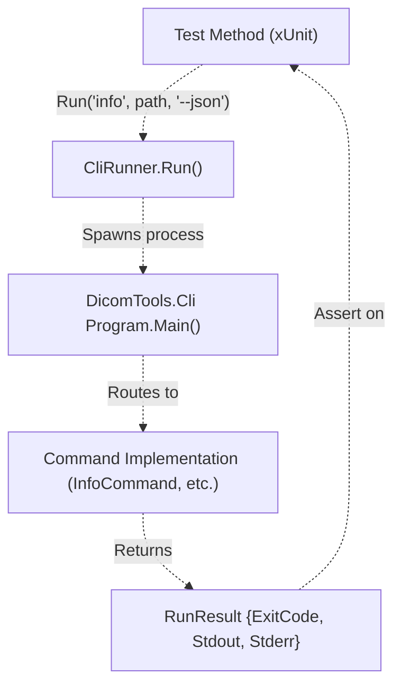
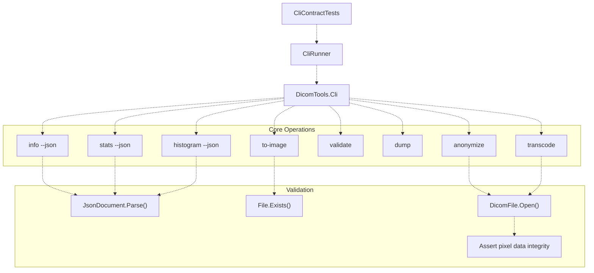
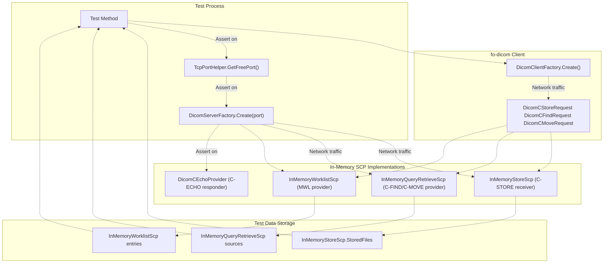
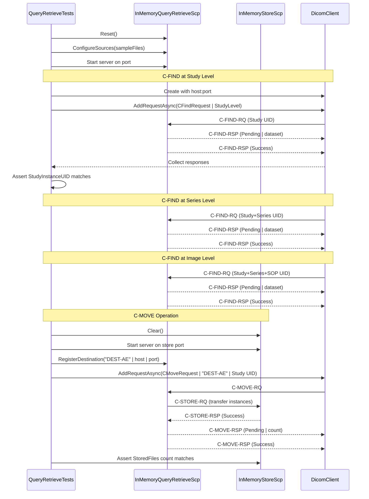
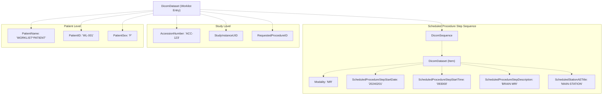
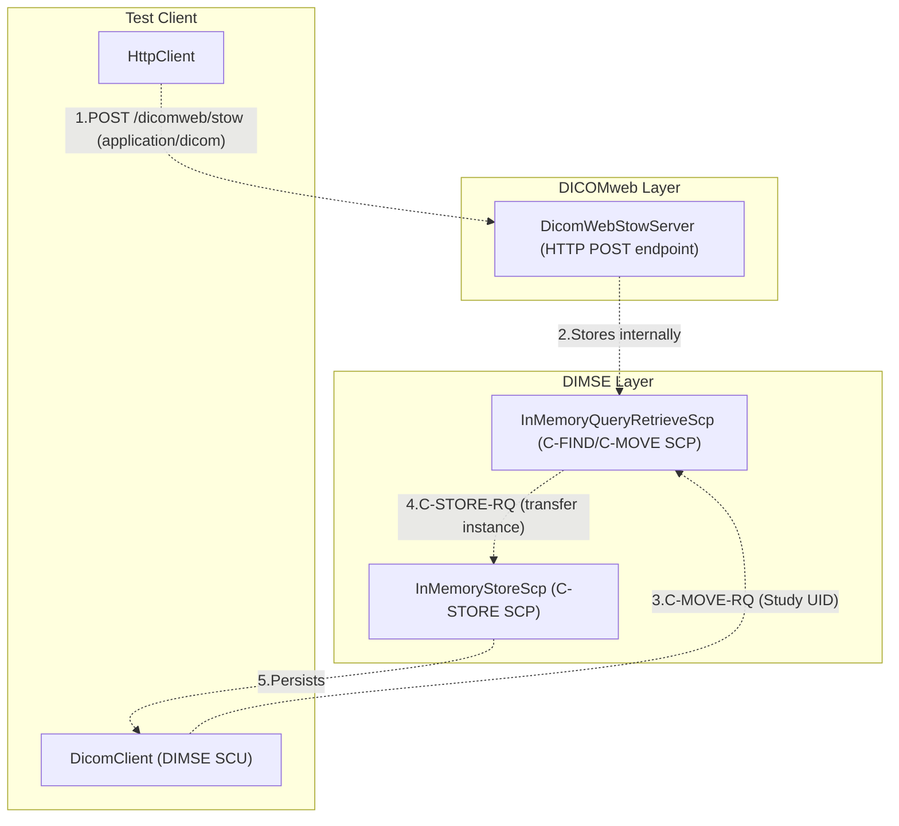

# C# Tests

> **Relevant source files**
> * [cs/DicomTools.Tests/CiEnvironment.cs](https://github.com/ThalesMMS/Dicom-Tools/blob/c7b4cbd8/cs/DicomTools.Tests/CiEnvironment.cs)
> * [cs/DicomTools.Tests/CliContractTests.cs](https://github.com/ThalesMMS/Dicom-Tools/blob/c7b4cbd8/cs/DicomTools.Tests/CliContractTests.cs)
> * [cs/DicomTools.Tests/CliHelpersTests.cs](https://github.com/ThalesMMS/Dicom-Tools/blob/c7b4cbd8/cs/DicomTools.Tests/CliHelpersTests.cs)
> * [cs/DicomTools.Tests/CliUnitTests.cs](https://github.com/ThalesMMS/Dicom-Tools/blob/c7b4cbd8/cs/DicomTools.Tests/CliUnitTests.cs)
> * [cs/DicomTools.Tests/DicomWebIntegrationTests.cs](https://github.com/ThalesMMS/Dicom-Tools/blob/c7b4cbd8/cs/DicomTools.Tests/DicomWebIntegrationTests.cs)
> * [cs/DicomTools.Tests/NetworkStoreTests.cs](https://github.com/ThalesMMS/Dicom-Tools/blob/c7b4cbd8/cs/DicomTools.Tests/NetworkStoreTests.cs)
> * [cs/DicomTools.Tests/QueryRetrieveTests.cs](https://github.com/ThalesMMS/Dicom-Tools/blob/c7b4cbd8/cs/DicomTools.Tests/QueryRetrieveTests.cs)
> * [cs/DicomTools.Tests/WorklistTests.cs](https://github.com/ThalesMMS/Dicom-Tools/blob/c7b4cbd8/cs/DicomTools.Tests/WorklistTests.cs)
> * [interface/tests/test_meta_docs.py](https://github.com/ThalesMMS/Dicom-Tools/blob/c7b4cbd8/interface/tests/test_meta_docs.py)

The C# test suite validates the fo-dicom-based CLI implementation across multiple dimensions: contract compliance, network operations (DIMSE and DICOMweb), core file operations, and helper utilities. Tests use xUnit with in-memory DICOM service providers to avoid external dependencies.

This page documents the C# backend's testing approach. For the overall testing strategy across all backends, see [Testing Strategy](#7.1). For cross-language contract validation, see [Interface and Contract Tests](#7.4).

---

## Test Suite Organization

The C# test suite is organized into seven primary test classes, each targeting specific functionality areas. All tests use xUnit as the testing framework and are located in [cs/DicomTools.Tests/](https://github.com/ThalesMMS/Dicom-Tools/blob/c7b4cbd8/cs/DicomTools.Tests/)

### Test Class Overview

| Test Class | Purpose | Key Operations Tested | Network Tests |
| --- | --- | --- | --- |
| `CliContractTests` | Validates CLI contract compliance | info, anonymize, to_image, transcode, validate, dump, stats, histogram, echo | Yes (C-ECHO) |
| `CliUnitTests` | Unit tests for CLI commands | transcode, info, to_image, echo, dump, validate, option parsing | Yes (C-ECHO) |
| `CliHelpersTests` | Tests helper functions | echo, stats, histogram, dump, pixel data parsing | Yes (C-ECHO) |
| `NetworkStoreTests` | C-STORE operations | Single and multi-instance storage | Yes (C-STORE) |
| `QueryRetrieveTests` | Query/Retrieve services | C-FIND (Study/Series/Image), C-MOVE | Yes (C-FIND, C-MOVE) |
| `WorklistTests` | Modality Worklist | C-FIND worklist queries | Yes (C-FIND MWL) |
| `DicomWebIntegrationTests` | DICOMweb integration | STOW → DIMSE bridge | Yes (STOW, C-MOVE) |

**Sources:** [cs/DicomTools.Tests/CliContractTests.cs](https://github.com/ThalesMMS/Dicom-Tools/blob/c7b4cbd8/cs/DicomTools.Tests/CliContractTests.cs)

 [cs/DicomTools.Tests/CliUnitTests.cs](https://github.com/ThalesMMS/Dicom-Tools/blob/c7b4cbd8/cs/DicomTools.Tests/CliUnitTests.cs)

 [cs/DicomTools.Tests/CliHelpersTests.cs](https://github.com/ThalesMMS/Dicom-Tools/blob/c7b4cbd8/cs/DicomTools.Tests/CliHelpersTests.cs)

 [cs/DicomTools.Tests/NetworkStoreTests.cs](https://github.com/ThalesMMS/Dicom-Tools/blob/c7b4cbd8/cs/DicomTools.Tests/NetworkStoreTests.cs)

 [cs/DicomTools.Tests/QueryRetrieveTests.cs](https://github.com/ThalesMMS/Dicom-Tools/blob/c7b4cbd8/cs/DicomTools.Tests/QueryRetrieveTests.cs)

 [cs/DicomTools.Tests/WorklistTests.cs](https://github.com/ThalesMMS/Dicom-Tools/blob/c7b4cbd8/cs/DicomTools.Tests/WorklistTests.cs)

 [cs/DicomTools.Tests/DicomWebIntegrationTests.cs](https://github.com/ThalesMMS/Dicom-Tools/blob/c7b4cbd8/cs/DicomTools.Tests/DicomWebIntegrationTests.cs)

---

## Test Infrastructure

### CLI Execution Framework

The `CliRunner` class provides a standardized way to execute CLI commands and capture results. Tests invoke CLI operations through this runner, which handles process spawning, output capture, and exit code collection.



**Sources:** [cs/DicomTools.Tests/CliContractTests.cs L18](https://github.com/ThalesMMS/Dicom-Tools/blob/c7b4cbd8/cs/DicomTools.Tests/CliContractTests.cs#L18-L18)

 [cs/DicomTools.Tests/CliUnitTests.cs L24](https://github.com/ThalesMMS/Dicom-Tools/blob/c7b4cbd8/cs/DicomTools.Tests/CliUnitTests.cs#L24-L24)

### Test Data Management

Tests use `SampleSeriesHelper` to access shared DICOM test files from the `sample_series/` directory. This ensures consistent test data across all language backends.

* `GetFirstFilePath()` - Returns path to a single sample DICOM file
* `GetSeriesFiles(count)` - Returns paths to multiple files from the same series

**Sources:** [cs/DicomTools.Tests/NetworkStoreTests.cs L26](https://github.com/ThalesMMS/Dicom-Tools/blob/c7b4cbd8/cs/DicomTools.Tests/NetworkStoreTests.cs#L26-L26)

 [cs/DicomTools.Tests/QueryRetrieveTests.cs L20](https://github.com/ThalesMMS/Dicom-Tools/blob/c7b4cbd8/cs/DicomTools.Tests/QueryRetrieveTests.cs#L20-L20)

### CI Environment Handling

The `CiEnvironment` utility conditionally skips network tests in CI environments to avoid socket restrictions and flaky network behavior.

```
if (CiEnvironment.ShouldSkip("Reason for skipping")){    return; // Test skips gracefully}
```

**Sources:** [cs/DicomTools.Tests/CiEnvironment.cs L1-L9](https://github.com/ThalesMMS/Dicom-Tools/blob/c7b4cbd8/cs/DicomTools.Tests/CiEnvironment.cs#L1-L9)

 [cs/DicomTools.Tests/NetworkStoreTests.cs L16-L19](https://github.com/ThalesMMS/Dicom-Tools/blob/c7b4cbd8/cs/DicomTools.Tests/NetworkStoreTests.cs#L16-L19)

---

## CLI Contract Tests

The `CliContractTests` class validates that the C# CLI adheres to the standardized contract specification. These tests ensure cross-language compatibility by verifying JSON output formats and operation behavior.

### Contract Test Architecture



**Sources:** [cs/DicomTools.Tests/CliContractTests.cs](https://github.com/ThalesMMS/Dicom-Tools/blob/c7b4cbd8/cs/DicomTools.Tests/CliContractTests.cs)

### Key Contract Tests

#### Info Operation - JSON Metadata Extraction

[cs/DicomTools.Tests/CliContractTests.cs L16-L29](https://github.com/ThalesMMS/Dicom-Tools/blob/c7b4cbd8/cs/DicomTools.Tests/CliContractTests.cs#L16-L29)

 validates that `info --json` produces a complete JSON metadata document with required DICOM attributes:

* `Rows`, `Columns` - Image dimensions
* `StudyInstanceUid`, `SopInstanceUid` - DICOM identifiers
* `PhotometricInterpretation` - Color space
* `NumberOfFrames` - Frame count

#### Anonymize Operation - PHI Removal

[cs/DicomTools.Tests/CliContractTests.cs L32-L62](https://github.com/ThalesMMS/Dicom-Tools/blob/c7b4cbd8/cs/DicomTools.Tests/CliContractTests.cs#L32-L62)

 verifies that `anonymize` creates a new file with:

* Different `SOPInstanceUID`
* Different `PatientName`
* Identical pixel data (no image degradation)

#### Image Export Operations

[cs/DicomTools.Tests/CliContractTests.cs L65-L86](https://github.com/ThalesMMS/Dicom-Tools/blob/c7b4cbd8/cs/DicomTools.Tests/CliContractTests.cs#L65-L86)

 confirms `to-image` generates valid PNG files by checking the PNG signature bytes: `{0x89, 0x50, 0x4E, 0x47, 0x0D, 0x0A, 0x1A, 0x0A}`.

#### Transcode Operation - Transfer Syntax Conversion

[cs/DicomTools.Tests/CliContractTests.cs L89-L111](https://github.com/ThalesMMS/Dicom-Tools/blob/c7b4cbd8/cs/DicomTools.Tests/CliContractTests.cs#L89-L111)

 validates that `transcode` correctly changes transfer syntax while preserving pixel data integrity.

#### Statistical Operations - JSON Output

[cs/DicomTools.Tests/CliContractTests.cs L131-L165](https://github.com/ThalesMMS/Dicom-Tools/blob/c7b4cbd8/cs/DicomTools.Tests/CliContractTests.cs#L131-L165)

 ensures `stats --json` and `histogram --json` return structured data with:

* Statistical bounds (min, max, mean, stddev)
* Histogram bin counts matching requested bin count
* Count totals matching pixel count

**Sources:** [cs/DicomTools.Tests/CliContractTests.cs](https://github.com/ThalesMMS/Dicom-Tools/blob/c7b4cbd8/cs/DicomTools.Tests/CliContractTests.cs)

---

## CLI Unit Tests

The `CliUnitTests` class provides focused unit tests for individual CLI command behaviors, edge cases, and error handling.

### Transfer Syntax Alias Handling

[cs/DicomTools.Tests/CliUnitTests.cs L7-L38](https://github.com/ThalesMMS/Dicom-Tools/blob/c7b4cbd8/cs/DicomTools.Tests/CliUnitTests.cs#L7-L38)

 uses theory-based testing to validate that transcode accepts both human-readable aliases and DICOM UIDs:

| Alias | DICOM UID |
| --- | --- |
| `explicit` | 1.2.840.10008.1.2.1 |
| `implicit` | 1.2.840.10008.1.2 |
| `big` | 1.2.840.10008.1.2.2 |
| `jpeg2000` | 1.2.840.10008.1.2.4.90 |
| `rle` | 1.2.840.10008.1.2.5 |
| `jpegls` | 1.2.840.10008.1.2.4.80 |
| `jpeg-lossless` | 1.2.840.10008.1.2.4.70 |

### Edge Case Handling

The unit tests validate proper handling of edge cases:

* **Files without pixel data** [cs/DicomTools.Tests/CliUnitTests.cs L41-L66](https://github.com/ThalesMMS/Dicom-Tools/blob/c7b4cbd8/cs/DicomTools.Tests/CliUnitTests.cs#L41-L66)  - `info` command handles DICOM files that contain only metadata
* **Out-of-range frame indices** [cs/DicomTools.Tests/CliUnitTests.cs L69-L86](https://github.com/ThalesMMS/Dicom-Tools/blob/c7b4cbd8/cs/DicomTools.Tests/CliUnitTests.cs#L69-L86)  - `to-image` falls back to frame 0 when requested frame doesn't exist
* **Closed network ports** [cs/DicomTools.Tests/CliUnitTests.cs L89-L99](https://github.com/ThalesMMS/Dicom-Tools/blob/c7b4cbd8/cs/DicomTools.Tests/CliUnitTests.cs#L89-L99)  - `echo` command returns non-zero exit code when target is unreachable
* **Sequence depth limiting** [cs/DicomTools.Tests/CliUnitTests.cs L102-L132](https://github.com/ThalesMMS/Dicom-Tools/blob/c7b4cbd8/cs/DicomTools.Tests/CliUnitTests.cs#L102-L132)  - `dump --depth` respects max depth and doesn't print nested sequence items
* **Missing required tags** [cs/DicomTools.Tests/CliUnitTests.cs L149-L172](https://github.com/ThalesMMS/Dicom-Tools/blob/c7b4cbd8/cs/DicomTools.Tests/CliUnitTests.cs#L149-L172)  - `validate` fails with proper error message when required tags are absent

### Option Parser Validation

[cs/DicomTools.Tests/CliUnitTests.cs L135-L146](https://github.com/ThalesMMS/Dicom-Tools/blob/c7b4cbd8/cs/DicomTools.Tests/CliUnitTests.cs#L135-L146)

 tests the `OptionParser` class for correct parsing of:

* Boolean flags (`--json`)
* Named options (`--output path/file.dcm`)
* Short options (`-f png`)
* Positional arguments (`input1`, `input2`)

**Sources:** [cs/DicomTools.Tests/CliUnitTests.cs](https://github.com/ThalesMMS/Dicom-Tools/blob/c7b4cbd8/cs/DicomTools.Tests/CliUnitTests.cs)

---

## Network Operations Tests

Network tests use in-memory DICOM service providers to validate DIMSE operations without requiring external PACS systems. Tests are organized by DICOM service class.

### In-Memory Test Server Architecture



**Sources:** [cs/DicomTools.Tests/NetworkStoreTests.cs](https://github.com/ThalesMMS/Dicom-Tools/blob/c7b4cbd8/cs/DicomTools.Tests/NetworkStoreTests.cs)

 [cs/DicomTools.Tests/QueryRetrieveTests.cs](https://github.com/ThalesMMS/Dicom-Tools/blob/c7b4cbd8/cs/DicomTools.Tests/QueryRetrieveTests.cs)

 [cs/DicomTools.Tests/WorklistTests.cs](https://github.com/ThalesMMS/Dicom-Tools/blob/c7b4cbd8/cs/DicomTools.Tests/WorklistTests.cs)

### C-STORE Tests

The `NetworkStoreTests` class validates the Storage Service Class (C-STORE) operations.

**Single Instance Storage** [cs/DicomTools.Tests/NetworkStoreTests.cs L13-L50](https://github.com/ThalesMMS/Dicom-Tools/blob/c7b4cbd8/cs/DicomTools.Tests/NetworkStoreTests.cs#L13-L50)

:

1. Clear `InMemoryStoreScp.StoredFiles`
2. Start in-memory storage server on free port
3. Create `DicomCStoreRequest` with sample DICOM file
4. Send request via `DicomClient`
5. Assert success status and verify stored SOP Instance UID
6. Validate pixel data integrity

**Multi-Instance Storage** [cs/DicomTools.Tests/NetworkStoreTests.cs L53-L88](https://github.com/ThalesMMS/Dicom-Tools/blob/c7b4cbd8/cs/DicomTools.Tests/NetworkStoreTests.cs#L53-L88)

:

* Validates batch storage of multiple instances
* Confirms all instances are stored with correct UIDs

### C-FIND and C-MOVE Tests

The `QueryRetrieveTests` class validates Query/Retrieve operations across three query levels.

**Query/Retrieve Test Flow:**



**Sources:** [cs/DicomTools.Tests/QueryRetrieveTests.cs L14-L119](https://github.com/ThalesMMS/Dicom-Tools/blob/c7b4cbd8/cs/DicomTools.Tests/QueryRetrieveTests.cs#L14-L119)

**C-FIND Multi-Level Query** [cs/DicomTools.Tests/QueryRetrieveTests.cs L14-L57](https://github.com/ThalesMMS/Dicom-Tools/blob/c7b4cbd8/cs/DicomTools.Tests/QueryRetrieveTests.cs#L14-L57)

:

* Tests query at Study, Series, and Image levels
* Validates matching logic and response datasets
* Uses helper method `SendFindAsync()` for request orchestration

**C-MOVE Transfer** [cs/DicomTools.Tests/QueryRetrieveTests.cs L60-L101](https://github.com/ThalesMMS/Dicom-Tools/blob/c7b4cbd8/cs/DicomTools.Tests/QueryRetrieveTests.cs#L60-L101)

:

* Configures source and destination SCPs
* Issues C-MOVE request with destination AE title
* Validates all matching instances are transferred to destination
* Confirms SOP Instance UIDs match between source and destination

### Worklist Tests

The `WorklistTests` class validates Modality Worklist (MWL) query operations.

[cs/DicomTools.Tests/WorklistTests.cs L14-L63](https://github.com/ThalesMMS/Dicom-Tools/blob/c7b4cbd8/cs/DicomTools.Tests/WorklistTests.cs#L14-L63)

 tests the complete worklist workflow:

1. Build worklist entry with patient and scheduled procedure step (SPS) information
2. Configure `InMemoryWorklistScp` with test entries
3. Create worklist C-FIND request using `DicomCFindRequest.CreateWorklistQuery()`
4. Send query and collect responses
5. Validate response contains matching patient and SPS attributes: * `PatientID`, `PatientName`, `AccessionNumber` * `Modality`, `ScheduledProcedureStepStartDate`, `ScheduledStationAETitle`

**Worklist Entry Structure:**



**Sources:** [cs/DicomTools.Tests/WorklistTests.cs L65-L86](https://github.com/ThalesMMS/Dicom-Tools/blob/c7b4cbd8/cs/DicomTools.Tests/WorklistTests.cs#L65-L86)

---

## DICOMweb Integration Tests

The `DicomWebIntegrationTests` class validates the integration between DICOMweb (STOW-RS) and traditional DIMSE services.

### STOW-to-DIMSE Bridge Test

[cs/DicomTools.Tests/DicomWebIntegrationTests.cs L18-L73](https://github.com/ThalesMMS/Dicom-Tools/blob/c7b4cbd8/cs/DicomTools.Tests/DicomWebIntegrationTests.cs#L18-L73)

 validates a complex workflow that bridges modern DICOMweb and legacy DIMSE protocols:

**Test Architecture:**



**Workflow Steps:**

1. **STOW Upload**: POST DICOM bytes to `http://localhost:{port}/dicomweb/stow` with `application/dicom` content type
2. **Internal Storage**: Verify instance is stored in `InMemoryQueryRetrieveScp` (count = 1)
3. **Destination Registration**: Register C-STORE destination with `RegisterDestination("DEST-AE", host, port)`
4. **C-MOVE Request**: Query for study and request transfer to destination AE
5. **Validation**: Confirm instance arrives at destination SCP with matching SOP Instance UID

**Error Handling**: The test checks for `DicomStatus.ProcessingFailure` and retrieves error details via `InMemoryQueryRetrieveScp.GetLastMoveError()`.

**Sources:** [cs/DicomTools.Tests/DicomWebIntegrationTests.cs](https://github.com/ThalesMMS/Dicom-Tools/blob/c7b4cbd8/cs/DicomTools.Tests/DicomWebIntegrationTests.cs)

---

## Helper Tests and Utilities

The `CliHelpersTests` class validates utility functions and edge cases in CLI helper implementations.

### Echo Operation

[cs/DicomTools.Tests/CliHelpersTests.cs L9-L22](https://github.com/ThalesMMS/Dicom-Tools/blob/c7b4cbd8/cs/DicomTools.Tests/CliHelpersTests.cs#L9-L22)

 verifies C-ECHO against in-memory store SCP, confirming basic DICOM association establishment.

### Stats and Histogram Commands

[cs/DicomTools.Tests/CliHelpersTests.cs L25-L36](https://github.com/ThalesMMS/Dicom-Tools/blob/c7b4cbd8/cs/DicomTools.Tests/CliHelpersTests.cs#L25-L36)

 validates text output format for statistical operations:

* `stats` command includes "Size:", "Min:", "Max:" labels
* `histogram --bins N` command includes "Histogram" label

### Dump Command with Sequences

[cs/DicomTools.Tests/CliHelpersTests.cs L39-L69](https://github.com/ThalesMMS/Dicom-Tools/blob/c7b4cbd8/cs/DicomTools.Tests/CliHelpersTests.cs#L39-L69)

 validates that `dump` correctly displays sequence items with configurable depth and value truncation.

### Edge Case Handling

[cs/DicomTools.Tests/CliHelpersTests.cs L72-L90](https://github.com/ThalesMMS/Dicom-Tools/blob/c7b4cbd8/cs/DicomTools.Tests/CliHelpersTests.cs#L72-L90)

 tests helper function robustness:

**PixelDataHelpers** [cs/DicomTools.Tests/CliHelpersTests.cs L73-L75](https://github.com/ThalesMMS/Dicom-Tools/blob/c7b4cbd8/cs/DicomTools.Tests/CliHelpersTests.cs#L73-L75)

:

* `ParseHostPort()` throws `ArgumentException` for invalid input

**StatsHelpers** [cs/DicomTools.Tests/CliHelpersTests.cs L78-L90](https://github.com/ThalesMMS/Dicom-Tools/blob/c7b4cbd8/cs/DicomTools.Tests/CliHelpersTests.cs#L78-L90)

:

* `CalculateStats()` handles empty arrays gracefully (returns zeros)
* `BuildHistogram()` handles constant data (all values in single bin)
* `BuildHistogram()` with zero bins returns empty array

**Sources:** [cs/DicomTools.Tests/CliHelpersTests.cs](https://github.com/ThalesMMS/Dicom-Tools/blob/c7b4cbd8/cs/DicomTools.Tests/CliHelpersTests.cs)

---

## Test Collection Configuration

Network tests use xUnit's collection feature to control test isolation and parallelization. The `[Collection("Network")]` attribute groups tests that use network resources to prevent port conflicts.

```
[Collection("Network")]public class NetworkStoreTests { ... }[Collection("Network")]public class QueryRetrieveTests { ... }
```

This ensures network-based tests run sequentially within the "Network" collection while allowing parallel execution of other test classes.

**Sources:** [cs/DicomTools.Tests/NetworkStoreTests.cs L10](https://github.com/ThalesMMS/Dicom-Tools/blob/c7b4cbd8/cs/DicomTools.Tests/NetworkStoreTests.cs#L10-L10)

 [cs/DicomTools.Tests/QueryRetrieveTests.cs L10](https://github.com/ThalesMMS/Dicom-Tools/blob/c7b4cbd8/cs/DicomTools.Tests/QueryRetrieveTests.cs#L10-L10)

 [cs/DicomTools.Tests/WorklistTests.cs L10](https://github.com/ThalesMMS/Dicom-Tools/blob/c7b4cbd8/cs/DicomTools.Tests/WorklistTests.cs#L10-L10)

 [cs/DicomTools.Tests/DicomWebIntegrationTests.cs L14](https://github.com/ThalesMMS/Dicom-Tools/blob/c7b4cbd8/cs/DicomTools.Tests/DicomWebIntegrationTests.cs#L14-L14)

---

## Running the Tests

Execute tests using the .NET CLI:

```
cd csdotnet test
```

For verbose output with test names:

```
dotnet test --logger "console;verbosity=detailed"
```

Filter tests by category or name:

```
dotnet test --filter "FullyQualifiedName~Network"dotnet test --filter "FullyQualifiedName~Contract"
```

**Sources:** Standard .NET testing conventions

Refresh this wiki

Last indexed: 5 January 2026 ([c7b4cb](https://github.com/ThalesMMS/Dicom-Tools/commit/c7b4cbd8))

### On this page

* [C# Tests](#7.3-c-tests)
* [Test Suite Organization](#7.3-test-suite-organization)
* [Test Class Overview](#7.3-test-class-overview)
* [Test Infrastructure](#7.3-test-infrastructure)
* [CLI Execution Framework](#7.3-cli-execution-framework)
* [Test Data Management](#7.3-test-data-management)
* [CI Environment Handling](#7.3-ci-environment-handling)
* [CLI Contract Tests](#7.3-cli-contract-tests)
* [Contract Test Architecture](#7.3-contract-test-architecture)
* [Key Contract Tests](#7.3-key-contract-tests)
* [CLI Unit Tests](#7.3-cli-unit-tests)
* [Transfer Syntax Alias Handling](#7.3-transfer-syntax-alias-handling)
* [Edge Case Handling](#7.3-edge-case-handling)
* [Option Parser Validation](#7.3-option-parser-validation)
* [Network Operations Tests](#7.3-network-operations-tests)
* [In-Memory Test Server Architecture](#7.3-in-memory-test-server-architecture)
* [C-STORE Tests](#7.3-c-store-tests)
* [C-FIND and C-MOVE Tests](#7.3-c-find-and-c-move-tests)
* [Worklist Tests](#7.3-worklist-tests)
* [DICOMweb Integration Tests](#7.3-dicomweb-integration-tests)
* [STOW-to-DIMSE Bridge Test](#7.3-stow-to-dimse-bridge-test)
* [Helper Tests and Utilities](#7.3-helper-tests-and-utilities)
* [Echo Operation](#7.3-echo-operation)
* [Stats and Histogram Commands](#7.3-stats-and-histogram-commands)
* [Dump Command with Sequences](#7.3-dump-command-with-sequences)
* [Edge Case Handling](#7.3-edge-case-handling-1)
* [Test Collection Configuration](#7.3-test-collection-configuration)
* [Running the Tests](#7.3-running-the-tests)

Ask Devin about Dicom-Tools