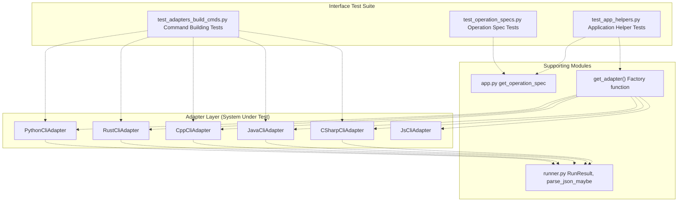
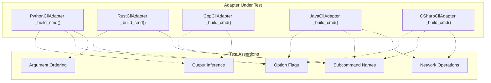
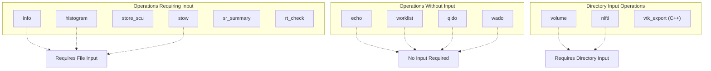
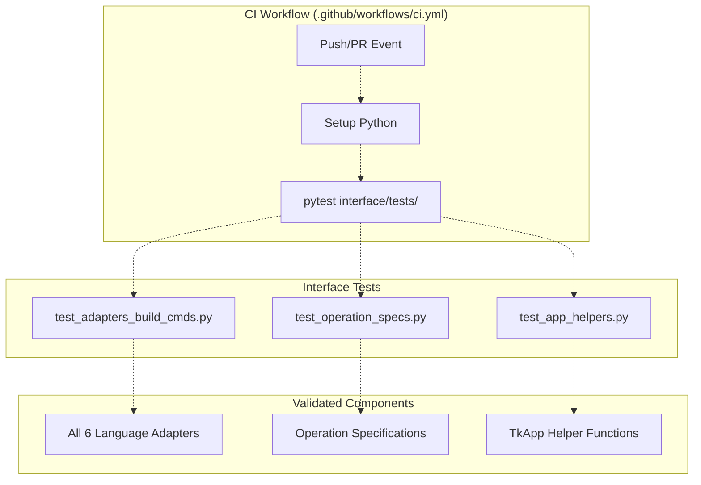

# Interface and Contract Tests

> **Relevant source files**
> * [cs/DicomTools.Cli/CliApp.cs](https://github.com/ThalesMMS/Dicom-Tools/blob/c7b4cbd8/cs/DicomTools.Cli/CliApp.cs)
> * [interface/adapters/csharp_cli.py](https://github.com/ThalesMMS/Dicom-Tools/blob/c7b4cbd8/interface/adapters/csharp_cli.py)
> * [interface/adapters/java_cli.py](https://github.com/ThalesMMS/Dicom-Tools/blob/c7b4cbd8/interface/adapters/java_cli.py)
> * [interface/adapters/rust_cli.py](https://github.com/ThalesMMS/Dicom-Tools/blob/c7b4cbd8/interface/adapters/rust_cli.py)
> * [interface/tests/test_adapters_build_cmds.py](https://github.com/ThalesMMS/Dicom-Tools/blob/c7b4cbd8/interface/tests/test_adapters_build_cmds.py)
> * [interface/tests/test_app_helpers.py](https://github.com/ThalesMMS/Dicom-Tools/blob/c7b4cbd8/interface/tests/test_app_helpers.py)
> * [interface/tests/test_operation_specs.py](https://github.com/ThalesMMS/Dicom-Tools/blob/c7b4cbd8/interface/tests/test_operation_specs.py)
> * [js/viewer-gateway/package-lock.json](https://github.com/ThalesMMS/Dicom-Tools/blob/c7b4cbd8/js/viewer-gateway/package-lock.json)

This document describes the interface and contract testing layer that validates cross-language interoperability in the Dicom-Tools repository. These tests ensure all language backends correctly implement the CLI contract and that adapters properly translate generic requests into backend-specific commands.

For language-specific unit tests, see [Python Tests](#7.2), [C# Tests](#7.3), and [JavaScript Tests](#7.5). For the overall testing philosophy, see [Testing Strategy](#7.1). For details on the contract specification itself, see [Contract Specification](#3.1).

---

## Test Architecture Overview

The interface tests validate the adapter layer between the TkApp GUI and language-specific backends. These tests ensure that:

1. **Adapters correctly build CLI commands** for each operation
2. **Operation specifications** define correct input/output requirements
3. **Application helpers** properly validate and normalize user inputs
4. **Contract compliance** is maintained across all backends



**Sources:** [interface/tests/test_adapters_build_cmds.py L1-L99](https://github.com/ThalesMMS/Dicom-Tools/blob/c7b4cbd8/interface/tests/test_adapters_build_cmds.py#L1-L99)

 [interface/tests/test_operation_specs.py L1-L56](https://github.com/ThalesMMS/Dicom-Tools/blob/c7b4cbd8/interface/tests/test_operation_specs.py#L1-L56)

 [interface/tests/test_app_helpers.py L1-L175](https://github.com/ThalesMMS/Dicom-Tools/blob/c7b4cbd8/interface/tests/test_app_helpers.py#L1-L175)

---

## Adapter Command Building Tests

The `test_adapters_build_cmds.py` module validates that each adapter correctly constructs CLI commands from operation requests. These tests ensure the adapter pattern properly translates generic contract requests into backend-specific invocations.

### Test Structure

| Test Function | Backend | Operations Tested | Validations |
| --- | --- | --- | --- |
| `test_python_cli_builds_commands` | Python | info, to_image, transcode, validate, echo, volume, nifti, stats, dump | Command structure, argument ordering, option flags |
| `test_rust_cli_builds_commands` | Rust | info, to_image, transcode, validate, histogram, echo, stats | Subcommand names, hyphenated options |
| `test_cpp_cli_builds_commands` | C++ | to_image, anonymize, transcode | Output file inference, multi-output handling |
| `test_java_cli_builds_commands` | Java | info, validate, histogram, to_image, transcode, echo, store_scu, worklist, qido, stow, wado, sr_summary, rt_check | JAR invocation, network operations, DICOMweb |
| `test_csharp_cli_builds_commands` | C# | info, validate, histogram, to_image, transcode, echo, store_scu, worklist, qido, stow, wado, sr_summary, rt_check | .NET binary invocation, fo-dicom CLI syntax |
| `test_get_adapter_invalid` | Factory | All backends | Adapter instantiation, error handling |

**Test Coverage by Adapter:**



**Sources:** [interface/tests/test_adapters_build_cmds.py L9-L99](https://github.com/ThalesMMS/Dicom-Tools/blob/c7b4cbd8/interface/tests/test_adapters_build_cmds.py#L9-L99)

### Python Adapter Command Tests

The Python adapter test validates command construction for the most comprehensive backend:

[interface/tests/test_adapters_build_cmds.py L9-L25](https://github.com/ThalesMMS/Dicom-Tools/blob/c7b4cbd8/interface/tests/test_adapters_build_cmds.py#L9-L25)

Key validations:

* **Verbose flag handling**: `info` operation with `{"verbose": True}` appends `--verbose`
* **Frame selection**: `to_image` with `{"frame": 1}` generates frame-specific PNG command
* **Transfer syntax**: `transcode` with `{"syntax": "explicit"}` includes syntax specification
* **Module naming**: Validates Python module names like `dicom_echo`, `validate_dicom`
* **Directory inputs**: `volume` and `nifti` operations accept directory inputs

**Sources:** [interface/tests/test_adapters_build_cmds.py L9-L25](https://github.com/ThalesMMS/Dicom-Tools/blob/c7b4cbd8/interface/tests/test_adapters_build_cmds.py#L9-L25)

 [interface/adapters/python_cli.py L1-L287](https://github.com/ThalesMMS/Dicom-Tools/blob/c7b4cbd8/interface/adapters/python_cli.py#L1-L287)

### Rust Adapter Command Tests

[interface/tests/test_adapters_build_cmds.py L27-L37](https://github.com/ThalesMMS/Dicom-Tools/blob/c7b4cbd8/interface/tests/test_adapters_build_cmds.py#L27-L37)

Rust-specific validations:

* **Hyphenated subcommands**: Commands like `to-image`, `transcode` use hyphens not underscores
* **Option positioning**: Flags appear after the subcommand (e.g., `info input --verbose`)
* **Histogram binning**: `{"bins": 8}` correctly passed to histogram operation

**Sources:** [interface/tests/test_adapters_build_cmds.py L27-L37](https://github.com/ThalesMMS/Dicom-Tools/blob/c7b4cbd8/interface/tests/test_adapters_build_cmds.py#L27-L37)

 [interface/adapters/rust_cli.py L52-L151](https://github.com/ThalesMMS/Dicom-Tools/blob/c7b4cbd8/interface/adapters/rust_cli.py#L52-L151)

### C++ Adapter Command Tests

[interface/tests/test_adapters_build_cmds.py L39-L48](https://github.com/ThalesMMS/Dicom-Tools/blob/c7b4cbd8/interface/tests/test_adapters_build_cmds.py#L39-L48)

C++ adapter has unique characteristics:

* **Multi-output operations**: `_build_cmd()` returns tuple `(cmd, outputs)`
* **Preview file inference**: `to_image` automatically generates `preview.pgm` output
* **Transfer syntax mapping**: Maps generic syntax names to DCMTK identifiers

**Sources:** [interface/tests/test_adapters_build_cmds.py L39-L48](https://github.com/ThalesMMS/Dicom-Tools/blob/c7b4cbd8/interface/tests/test_adapters_build_cmds.py#L39-L48)

 [interface/adapters/cpp_cli.py L1-L241](https://github.com/ThalesMMS/Dicom-Tools/blob/c7b4cbd8/interface/adapters/cpp_cli.py#L1-L241)

### Java Adapter Command Tests

[interface/tests/test_adapters_build_cmds.py L50-L66](https://github.com/ThalesMMS/Dicom-Tools/blob/c7b4cbd8/interface/tests/test_adapters_build_cmds.py#L50-L66)

Validates dcm4che3-based commands:

* **JAR invocation**: Commands start with `java -jar <jar-path>`
* **Network operations**: Tests `echo`, `store-scu`, `mwl` (worklist)
* **DICOMweb support**: Validates `qido`, `stow`, `wado` URL-based operations
* **Specialized operations**: `sr-summary`, `rt-check` for structured reports and radiotherapy

**Sources:** [interface/tests/test_adapters_build_cmds.py L50-L66](https://github.com/ThalesMMS/Dicom-Tools/blob/c7b4cbd8/interface/tests/test_adapters_build_cmds.py#L50-L66)

 [interface/adapters/java_cli.py L47-L167](https://github.com/ThalesMMS/Dicom-Tools/blob/c7b4cbd8/interface/adapters/java_cli.py#L47-L167)

### C# Adapter Command Tests

[interface/tests/test_adapters_build_cmds.py L68-L84](https://github.com/ThalesMMS/Dicom-Tools/blob/c7b4cbd8/interface/tests/test_adapters_build_cmds.py#L68-L84)

fo-dicom adapter validations:

* **Binary path resolution**: Tests `DicomTools.Cli` executable location
* **Network parameters**: AET (Application Entity Title) configuration
* **DICOMweb operations**: Similar to Java backend coverage
* **SR/RT support**: Structured report and radiotherapy plan validation

**Sources:** [interface/tests/test_adapters_build_cmds.py L68-L84](https://github.com/ThalesMMS/Dicom-Tools/blob/c7b4cbd8/interface/tests/test_adapters_build_cmds.py#L68-L84)

 [interface/adapters/csharp_cli.py L69-L181](https://github.com/ThalesMMS/Dicom-Tools/blob/c7b4cbd8/interface/adapters/csharp_cli.py#L69-L181)

---

## Operation Specification Tests

The `test_operation_specs.py` module validates that operation metadata correctly defines input/output requirements, enabling the TkApp GUI to present appropriate controls.

### Operation Specification Schema

Each operation spec defines:

| Field | Type | Purpose |
| --- | --- | --- |
| `input` | enum | `"file"`, `"directory"`, or `"none"` |
| `output` | enum | `"file"`, `"directory"`, `"display"`, or `"none"` |
| `output_required` | bool | Whether output path must be provided |
| `has_options` | bool | Whether operation accepts JSON options |
| `option_keys` | list | Valid option key names |

### Test Coverage

```mermaid
flowchart TD

T1["test_cpp_info_uses_directory_output"]
T2["test_volume_requires_directory_input"]
T3["test_rust_to_image_exposes_window_level_options"]
T4["test_echo_has_no_input_and_display_only_output"]
T5["test_histogram_inherits_display_output_and_options"]
T6["test_vtk_ops_use_directory_io"]
T7["test_wado_requires_output_but_no_input"]
T8["test_worklist_and_store_scu_input_requirements"]
IOType["I/O Type Validation"]
OptKeys["Option Keys Validation"]
ReqVal["Requirement Validation"]

T1 -.-> IOType
T2 -.-> IOType
T3 -.-> OptKeys
T4 -.-> IOType
T5 -.-> IOType
T5 -.-> OptKeys
T6 -.-> IOType
T7 -.-> IOType
T7 -.-> ReqVal
T8 -.-> ReqVal

subgraph subGraph1 ["Validation Types"]
    IOType
    OptKeys
    ReqVal
end

subgraph subGraph0 ["Test Cases"]
    T1
    T2
    T3
    T4
    T5
    T6
    T7
    T8
end
```



**Sources:** [interface/tests/test_operation_specs.py L1-L56](https://github.com/ThalesMMS/Dicom-Tools/blob/c7b4cbd8/interface/tests/test_operation_specs.py#L1-L56)

### Directory I/O Operations

[interface/tests/test_operation_specs.py L4-L7](https://github.com/ThalesMMS/Dicom-Tools/blob/c7b4cbd8/interface/tests/test_operation_specs.py#L4-L7)

The C++ backend's `info` operation outputs to directories:

* Returns `{"output": "directory"}` for C++ info operation
* Enables batch processing of entire series
* GUI presents directory chooser instead of file chooser

[interface/tests/test_operation_specs.py L10-L14](https://github.com/ThalesMMS/Dicom-Tools/blob/c7b4cbd8/interface/tests/test_operation_specs.py#L10-L14)

Volume reconstruction requires directory input:

* `{"input": "directory", "output": "file"}` for volume/nifti operations
* Input: directory of DICOM slices
* Output: single `.npy` or `.nii.gz` volume file

**Sources:** [interface/tests/test_operation_specs.py L4-L14](https://github.com/ThalesMMS/Dicom-Tools/blob/c7b4cbd8/interface/tests/test_operation_specs.py#L4-L14)

### Window/Level Options

[interface/tests/test_operation_specs.py L16-L20](https://github.com/ThalesMMS/Dicom-Tools/blob/c7b4cbd8/interface/tests/test_operation_specs.py#L16-L20)

Rust's `to_image` operation exposes advanced imaging options:

* `window_center`, `window_width`, `normalize` in `option_keys`
* Enables GUI to provide window/level controls
* Supports VOI LUT and modality LUT disable flags

**Sources:** [interface/tests/test_operation_specs.py L16-L20](https://github.com/ThalesMMS/Dicom-Tools/blob/c7b4cbd8/interface/tests/test_operation_specs.py#L16-L20)

 [interface/adapters/rust_cli.py L72-L86](https://github.com/ThalesMMS/Dicom-Tools/blob/c7b4cbd8/interface/adapters/rust_cli.py#L72-L86)

### Network Operations

[interface/tests/test_operation_specs.py L22-L26](https://github.com/ThalesMMS/Dicom-Tools/blob/c7b4cbd8/interface/tests/test_operation_specs.py#L22-L26)

Echo operation has unique I/O requirements:

* `{"input": "none", "output": "display"}`
* No file input required (only host:port in options)
* Output displayed in GUI, not saved to file

[interface/tests/test_operation_specs.py L42-L56](https://github.com/ThalesMMS/Dicom-Tools/blob/c7b4cbd8/interface/tests/test_operation_specs.py#L42-L56)

DICOMweb and DIMSE operations:

* **WADO**: Requires output file but no input (`input: "none"`, `output_required: True`)
* **Worklist**: No input file, options specify query parameters
* **Store SCU**: Requires input file to transmit

**Sources:** [interface/tests/test_operation_specs.py L22-L56](https://github.com/ThalesMMS/Dicom-Tools/blob/c7b4cbd8/interface/tests/test_operation_specs.py#L22-L56)

### VTK Operations

[interface/tests/test_operation_specs.py L36-L40](https://github.com/ThalesMMS/Dicom-Tools/blob/c7b4cbd8/interface/tests/test_operation_specs.py#L36-L40)

C++ VTK operations use directory-to-directory I/O:

* `{"input": "directory", "output": "directory"}`
* Processes entire series for 3D visualization
* Outputs multiple files (MPR slices, volume renders)

**Sources:** [interface/tests/test_operation_specs.py L36-L40](https://github.com/ThalesMMS/Dicom-Tools/blob/c7b4cbd8/interface/tests/test_operation_specs.py#L36-L40)

---

## Application Helper Tests

The `test_app_helpers.py` module validates TkApp GUI helper functions using mock Tkinter widgets. These tests ensure proper input validation, output normalization, and result rendering without requiring a graphical environment.

### Test Infrastructure

[interface/tests/test_app_helpers.py L8-L60](https://github.com/ThalesMMS/Dicom-Tools/blob/c7b4cbd8/interface/tests/test_app_helpers.py#L8-L60)

The test infrastructure creates mock Tkinter widgets:

| Mock Class | Purpose | Methods |
| --- | --- | --- |
| `DummyText` | Text widget mock | `get()`, `delete()`, `insert()` |
| `DummyVar` | StringVar mock | `set()`, `get()` |
| `DummyLabel` | Label widget mock | `configure()` |
| `DummyEntry` | Entry widget mock | `set()`, `get()` |

The `make_dummy_app()` factory creates a fully-mocked `TkApp` instance for testing without Tk initialization.

**Sources:** [interface/tests/test_app_helpers.py L8-L60](https://github.com/ThalesMMS/Dicom-Tools/blob/c7b4cbd8/interface/tests/test_app_helpers.py#L8-L60)

### Output Path Normalization

[interface/tests/test_app_helpers.py L63-L72](https://github.com/ThalesMMS/Dicom-Tools/blob/c7b4cbd8/interface/tests/test_app_helpers.py#L63-L72)

Tests for `_normalize_output()` validate operation-specific output inference:

| Operation | Input | Output Directory | Inferred Output |
| --- | --- | --- | --- |
| `to_image` | `input.dcm` | `/out` | `/out/input.png` |
| `anonymize` | `input.dcm` | `/out` | `/out/input_anon.dcm` |
| `transcode` | `input.dcm` | `/out` | `/out/input_transcoded.dcm` |
| `volume` | `input.dcm` | `/out` | `/out/input_volume.npy` |
| `nifti` | `input.dcm` | `/out` | `/out/input_volume.nii.gz` |

**Sources:** [interface/tests/test_app_helpers.py L63-L72](https://github.com/ThalesMMS/Dicom-Tools/blob/c7b4cbd8/interface/tests/test_app_helpers.py#L63-L72)

### JSON Options Parsing

[interface/tests/test_app_helpers.py L74-L80](https://github.com/ThalesMMS/Dicom-Tools/blob/c7b4cbd8/interface/tests/test_app_helpers.py#L74-L80)

The `_parse_options()` method handles malformed JSON:

* Invalid JSON (e.g., `"{bad json"`) returns empty dict `{}`
* Valid JSON parsed correctly: `{"a": 1}` → `{"a": 1}`
* Graceful degradation prevents GUI crashes from syntax errors

**Sources:** [interface/tests/test_app_helpers.py L74-L80](https://github.com/ThalesMMS/Dicom-Tools/blob/c7b4cbd8/interface/tests/test_app_helpers.py#L74-L80)

### Result Rendering

[interface/tests/test_app_helpers.py L82-L98](https://github.com/ThalesMMS/Dicom-Tools/blob/c7b4cbd8/interface/tests/test_app_helpers.py#L82-L98)

The `_render_result()` method updates GUI status:

* Success result (`ok=True`) sets status to `"Success"`
* Failure result (`ok=False`) sets status to `"Failure"`
* Validates `RunResult.as_dict()` serialization

**Sources:** [interface/tests/test_app_helpers.py L82-L98](https://github.com/ThalesMMS/Dicom-Tools/blob/c7b4cbd8/interface/tests/test_app_helpers.py#L82-L98)

### Input Requirement Detection

[interface/tests/test_app_helpers.py L100-L116](https://github.com/ThalesMMS/Dicom-Tools/blob/c7b4cbd8/interface/tests/test_app_helpers.py#L100-L116)

Tests for `_require_input()` and `_op_uses_directory_input()`:



**Sources:** [interface/tests/test_app_helpers.py L100-L116](https://github.com/ThalesMMS/Dicom-Tools/blob/c7b4cbd8/interface/tests/test_app_helpers.py#L100-L116)

### Integration Test Scenarios

[interface/tests/test_app_helpers.py L118-L150](https://github.com/ThalesMMS/Dicom-Tools/blob/c7b4cbd8/interface/tests/test_app_helpers.py#L118-L150)

End-to-end test scenarios:

**Missing Input Validation:**

* User attempts `info` operation without input file
* `_run()` detects missing input
* Adapter never invoked, preventing spurious errors

**Successful Execution:**

* Valid input file provided
* Adapter returns success `RunResult`
* Status updated to "Success"

**Sources:** [interface/tests/test_app_helpers.py L118-L150](https://github.com/ThalesMMS/Dicom-Tools/blob/c7b4cbd8/interface/tests/test_app_helpers.py#L118-L150)

### Test Suite Execution

[interface/tests/test_app_helpers.py L152-L175](https://github.com/ThalesMMS/Dicom-Tools/blob/c7b4cbd8/interface/tests/test_app_helpers.py#L152-L175)

The `_run_suite()` method executes batch operations:

* Iterates through `SUITE_OPS[backend]` operation list
* Uses `DEFAULTS[backend][op]` for each operation's parameters
* Aggregates results: `"Suite completed: X passed, Y failed"`

**Sources:** [interface/tests/test_app_helpers.py L152-L175](https://github.com/ThalesMMS/Dicom-Tools/blob/c7b4cbd8/interface/tests/test_app_helpers.py#L152-L175)

---

## Contract Compliance Validation

The interface tests collectively enforce contract compliance through several mechanisms:

### Command Structure Consistency

All adapters must implement `_build_cmd(op, input_path, output, options)`:

| Adapter | Return Type | Command Prefix | Notes |
| --- | --- | --- | --- |
| PythonCliAdapter | `List[str]` | `python -m dicom_tools.<module>` | Module per operation |
| RustCliAdapter | `List[str]` | `dicom-tools <subcommand>` | Single binary with subcommands |
| CppCliAdapter | `Tuple[List[str], List[str]]` | `./DicomTools <subcommand>` | Returns (cmd, output_files) |
| JavaCliAdapter | `List[str]` | `java -jar dcm4che-tests.jar` | JAR invocation |
| CSharpCliAdapter | `List[str]` | `DicomTools.Cli <subcommand>` | .NET binary |

### Options Mapping Validation

Tests verify that generic option names map correctly to backend-specific flags:

```mermaid
flowchart TD

GenFrame["frame"]
GenBins["bins"]
GenSyntax["syntax"]
GenHost["host"]
GenPort["port"]
PyFrame["--frame"]
PyBins["--bins"]
PySyntax["--syntax"]
PyHost["--host"]
PyPort["--port"]
RustFrame["--frame"]
RustBins["--bins"]
RustSyntax["--transfer-syntax"]
RustHost["host:port combined"]
RustPort["host:port combined"]
CsFrame["--frame"]
CsBins["--bins"]
CsSyntax["--transfer-syntax"]
CsHost["--host"]
CsPort["--port"]

GenFrame -.-> PyFrame
GenFrame -.-> RustFrame
GenFrame -.-> CsFrame
GenBins -.-> PyBins
GenBins -.-> RustBins
GenBins -.-> CsBins
GenSyntax -.-> PySyntax
GenSyntax -.-> RustSyntax
GenSyntax -.-> CsSyntax
GenHost -.-> PyHost
GenHost -.-> RustHost
GenHost -.-> CsHost
GenPort -.-> PyPort
GenPort -.-> RustPort
GenPort -.-> CsPort

subgraph subGraph3 ["C# Backend"]
    CsFrame
    CsBins
    CsSyntax
    CsHost
    CsPort
end

subgraph subGraph2 ["Rust Backend"]
    RustFrame
    RustBins
    RustSyntax
    RustHost
    RustPort
end

subgraph subGraph1 ["Python Backend"]
    PyFrame
    PyBins
    PySyntax
    PyHost
    PyPort
end

subgraph subGraph0 ["Generic Contract Options"]
    GenFrame
    GenBins
    GenSyntax
    GenHost
    GenPort
end
```



**Sources:** [interface/tests/test_adapters_build_cmds.py L9-L84](https://github.com/ThalesMMS/Dicom-Tools/blob/c7b4cbd8/interface/tests/test_adapters_build_cmds.py#L9-L84)

### Error Handling Validation

[interface/tests/test_adapters_build_cmds.py L86-L99](https://github.com/ThalesMMS/Dicom-Tools/blob/c7b4cbd8/interface/tests/test_adapters_build_cmds.py#L86-L99)

The `test_get_adapter_invalid()` validates factory behavior:

* All valid backend names instantiate successfully
* Invalid backend name raises `ValueError`
* Prevents runtime errors from typos in backend selection

**Sources:** [interface/tests/test_adapters_build_cmds.py L86-L99](https://github.com/ThalesMMS/Dicom-Tools/blob/c7b4cbd8/interface/tests/test_adapters_build_cmds.py#L86-L99)

---

## Test Execution

### Local Execution

Interface tests run via pytest:

```
# Run all interface testspytest interface/tests/# Run specific test modulepytest interface/tests/test_adapters_build_cmds.py# Run with coveragepytest interface/tests/ --cov=interface/adapters --cov=interface/app.py
```

### CI Integration

The interface tests execute in the CI pipeline as part of broader test validation:



**Sources:** [.github/workflows/ci.yml](https://github.com/ThalesMMS/Dicom-Tools/blob/c7b4cbd8/.github/workflows/ci.yml)

 (referenced in Diagram 4)

### Dependencies

Interface tests require:

* **Python 3.x** with pytest
* **Adapter modules**: All adapter implementations must be importable
* **Mock libraries**: No actual CLI binaries needed (tests validate command construction only)

**Sources:** [interface/tests/test_adapters_build_cmds.py L1-L6](https://github.com/ThalesMMS/Dicom-Tools/blob/c7b4cbd8/interface/tests/test_adapters_build_cmds.py#L1-L6)

 [interface/tests/test_app_helpers.py L1-L6](https://github.com/ThalesMMS/Dicom-Tools/blob/c7b4cbd8/interface/tests/test_app_helpers.py#L1-L6)

 [interface/tests/test_operation_specs.py L1-L2](https://github.com/ThalesMMS/Dicom-Tools/blob/c7b4cbd8/interface/tests/test_operation_specs.py#L1-L2)

---

## Test Data and Fixtures

### Temporary Paths

Tests use pytest's `tmp_path` fixture for file operations:

[interface/tests/test_adapters_build_cmds.py L9-L10](https://github.com/ThalesMMS/Dicom-Tools/blob/c7b4cbd8/interface/tests/test_adapters_build_cmds.py#L9-L10)

```
def test_python_cli_builds_commands(tmp_path):    adapter = PythonCliAdapter()    input_path = str(tmp_path / "in.dcm")
```

File paths used in command construction but not actually created (tests validate CLI syntax, not execution).

### Mock Data Structures

[interface/tests/test_app_helpers.py L85-L93](https://github.com/ThalesMMS/Dicom-Tools/blob/c7b4cbd8/interface/tests/test_app_helpers.py#L85-L93)

Mock `RunResult` objects for testing result rendering:

```
class Result:    def __init__(self, ok=True):        self.ok = ok        self.returncode = 0 if ok else 1        self.output_files = []
```

**Sources:** [interface/tests/test_adapters_build_cmds.py L9-L10](https://github.com/ThalesMMS/Dicom-Tools/blob/c7b4cbd8/interface/tests/test_adapters_build_cmds.py#L9-L10)

 [interface/tests/test_app_helpers.py L85-L93](https://github.com/ThalesMMS/Dicom-Tools/blob/c7b4cbd8/interface/tests/test_app_helpers.py#L85-L93)

---

## Coverage and Completeness

### Adapter Coverage Matrix

| Adapter | Command Building | Options Mapping | Network Ops | DICOMweb | Specialized |
| --- | --- | --- | --- | --- | --- |
| Python | ✓ (10 ops) | ✓ | ✓ | ✗ | ✓ (volume, nifti) |
| Rust | ✓ (7 ops) | ✓ | ✓ | ✗ | ✓ (JSON round-trip) |
| C++ | ✓ (3 ops) | ✓ | ✗ | ✗ | ✓ (VTK) |
| Java | ✓ (14 ops) | ✓ | ✓ | ✓ | ✓ (SR, RT) |
| C# | ✓ (14 ops) | ✓ | ✓ | ✓ | ✓ (SR, RT) |
| JS | ✗ (shim only) | N/A | N/A | N/A | N/A |

**Notes:**

* JS adapter not directly tested (delegates to Python)
* C++ focuses on VTK operations not covered by other backends
* Java and C# have most complete network/DICOMweb coverage

**Sources:** [interface/tests/test_adapters_build_cmds.py L9-L99](https://github.com/ThalesMMS/Dicom-Tools/blob/c7b4cbd8/interface/tests/test_adapters_build_cmds.py#L9-L99)

### Operation Specification Coverage

8 test cases cover:

* **I/O type validation** (file vs. directory vs. none)
* **Output requirement validation** (required vs. optional)
* **Option key validation** (exposed options match backend capabilities)
* **Backend-specific variations** (C++ VTK, Rust windowing)

**Sources:** [interface/tests/test_operation_specs.py L1-L56](https://github.com/ThalesMMS/Dicom-Tools/blob/c7b4cbd8/interface/tests/test_operation_specs.py#L1-L56)

---

## Related Documentation

* **[Testing Strategy](#7.1)**: Overall testing philosophy and two-tier approach
* **[Python Tests](#7.2)**: Language-specific unit tests for Python backend
* **[C# Tests](#7.3)**: xUnit tests for fo-dicom implementation
* **[JavaScript Tests](#7.5)**: Vitest tests for web viewer components
* **[Contract Specification](#3.1)**: Detailed contract format and operation definitions
* **[Adapter Pattern](#3.2)**: How adapters implement the abstraction layer

Refresh this wiki

Last indexed: 5 January 2026 ([c7b4cb](https://github.com/ThalesMMS/Dicom-Tools/commit/c7b4cbd8))

### On this page

* [Interface and Contract Tests](#7.4-interface-and-contract-tests)
* [Test Architecture Overview](#7.4-test-architecture-overview)
* [Adapter Command Building Tests](#7.4-adapter-command-building-tests)
* [Test Structure](#7.4-test-structure)
* [Python Adapter Command Tests](#7.4-python-adapter-command-tests)
* [Rust Adapter Command Tests](#7.4-rust-adapter-command-tests)
* [C++ Adapter Command Tests](#7.4-c-adapter-command-tests)
* [Java Adapter Command Tests](#7.4-java-adapter-command-tests)
* [C# Adapter Command Tests](#7.4-c-adapter-command-tests-1)
* [Operation Specification Tests](#7.4-operation-specification-tests)
* [Operation Specification Schema](#7.4-operation-specification-schema)
* [Test Coverage](#7.4-test-coverage)
* [Directory I/O Operations](#7.4-directory-io-operations)
* [Window/Level Options](#7.4-windowlevel-options)
* [Network Operations](#7.4-network-operations)
* [VTK Operations](#7.4-vtk-operations)
* [Application Helper Tests](#7.4-application-helper-tests)
* [Test Infrastructure](#7.4-test-infrastructure)
* [Output Path Normalization](#7.4-output-path-normalization)
* [JSON Options Parsing](#7.4-json-options-parsing)
* [Result Rendering](#7.4-result-rendering)
* [Input Requirement Detection](#7.4-input-requirement-detection)
* [Integration Test Scenarios](#7.4-integration-test-scenarios)
* [Test Suite Execution](#7.4-test-suite-execution)
* [Contract Compliance Validation](#7.4-contract-compliance-validation)
* [Command Structure Consistency](#7.4-command-structure-consistency)
* [Options Mapping Validation](#7.4-options-mapping-validation)
* [Error Handling Validation](#7.4-error-handling-validation)
* [Test Execution](#7.4-test-execution)
* [Local Execution](#7.4-local-execution)
* [CI Integration](#7.4-ci-integration)
* [Dependencies](#7.4-dependencies)
* [Test Data and Fixtures](#7.4-test-data-and-fixtures)
* [Temporary Paths](#7.4-temporary-paths)
* [Mock Data Structures](#7.4-mock-data-structures)
* [Coverage and Completeness](#7.4-coverage-and-completeness)
* [Adapter Coverage Matrix](#7.4-adapter-coverage-matrix)
* [Operation Specification Coverage](#7.4-operation-specification-coverage)
* [Related Documentation](#7.4-related-documentation)

Ask Devin about Dicom-Tools