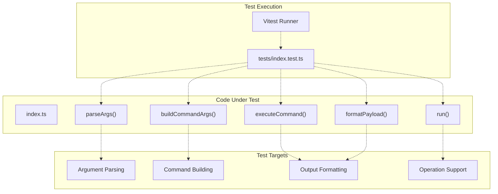
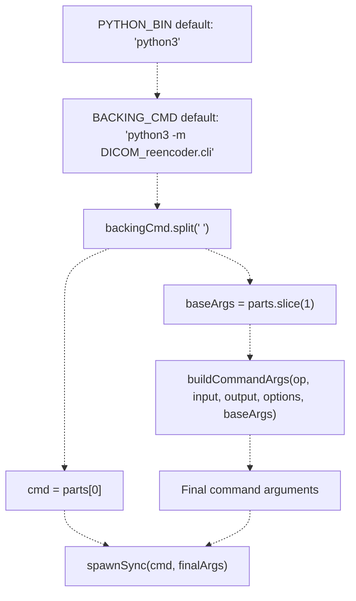
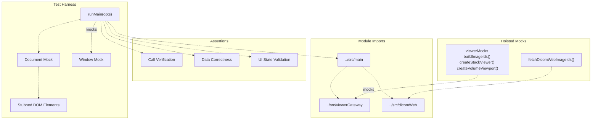
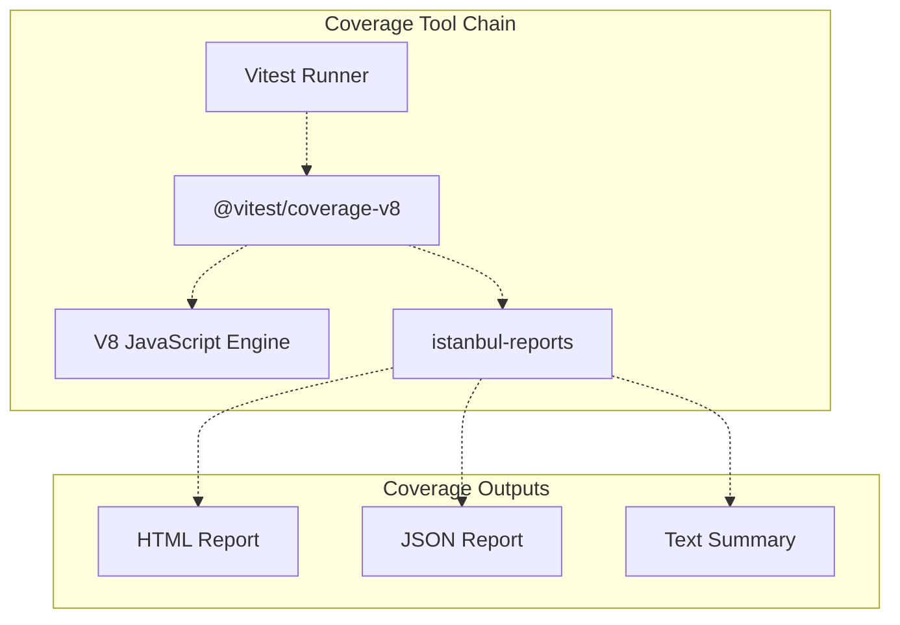
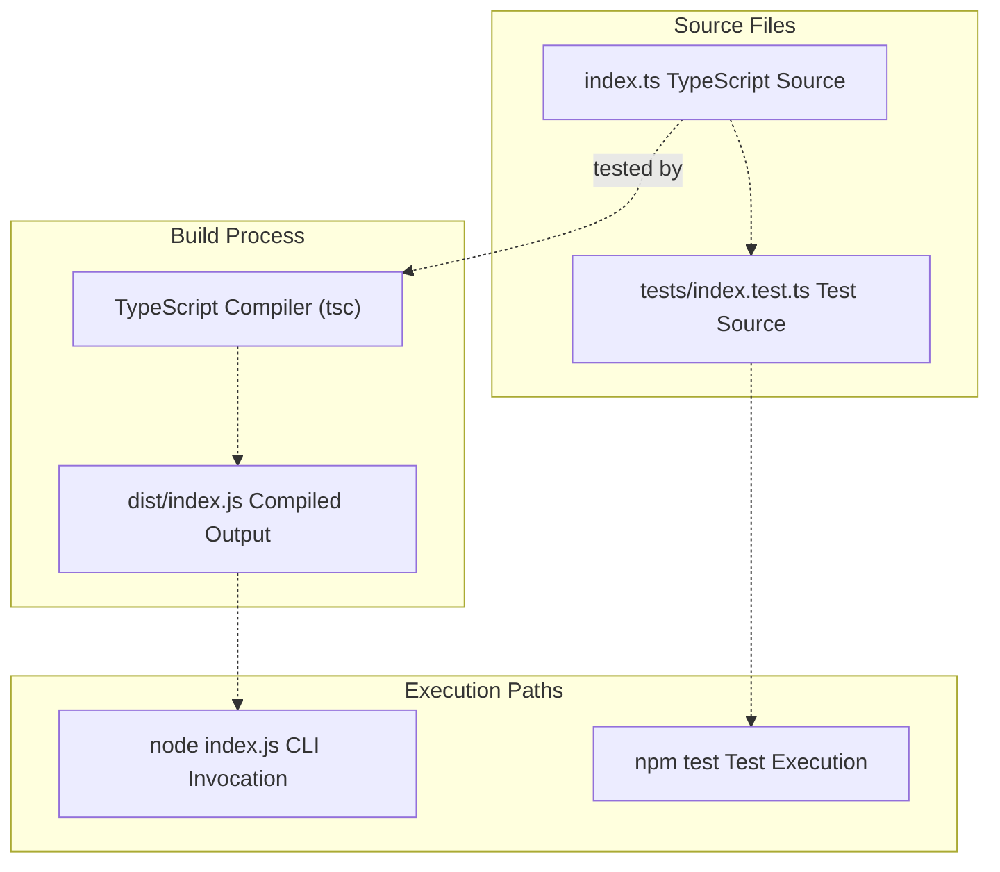
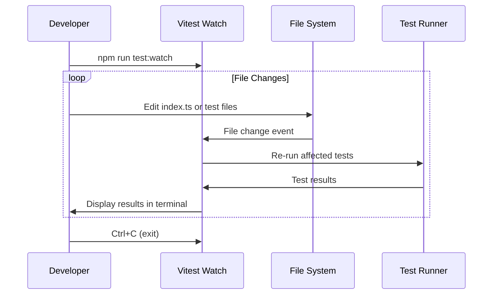
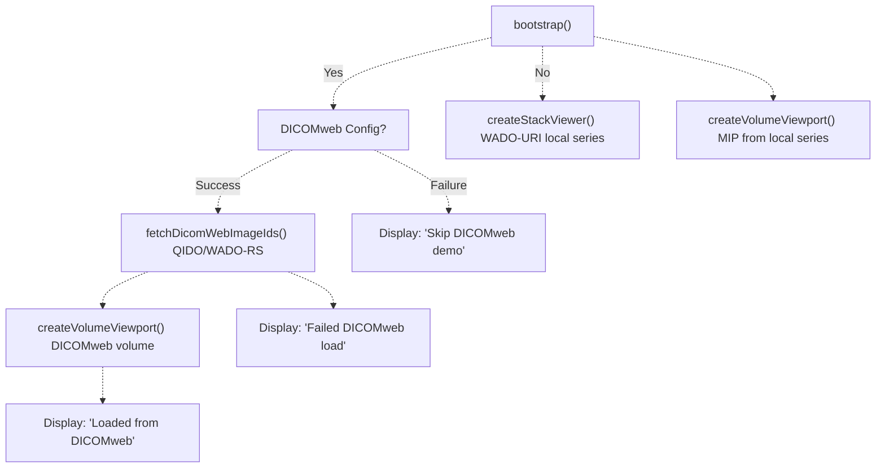
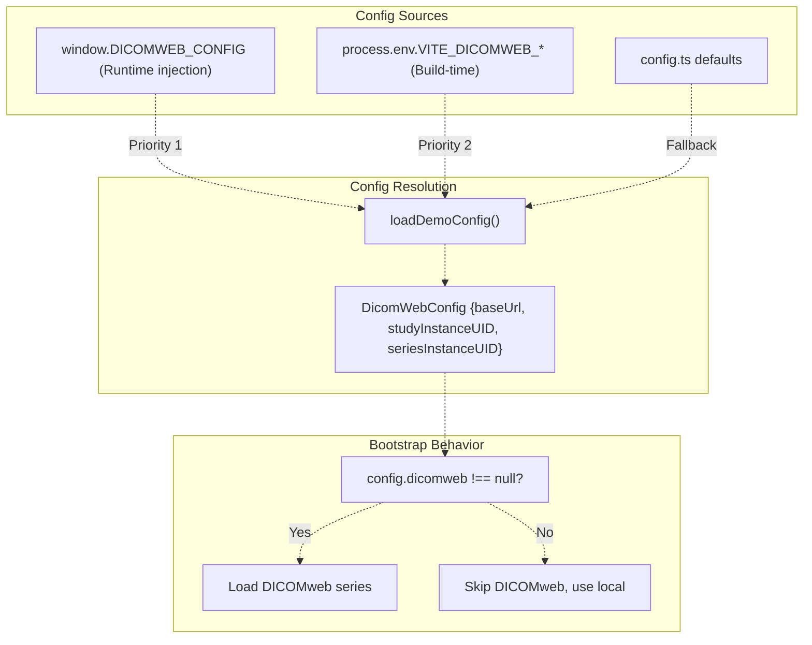
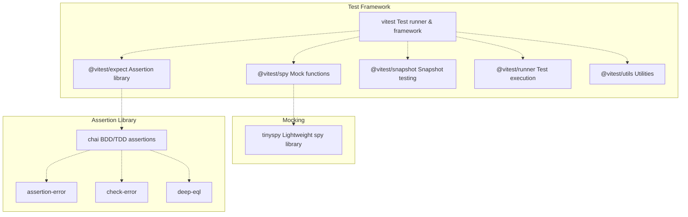

# 7e JavaScript Tests

> **Relevant source files**
> * [js/contract-cli/README.md](https://github.com/ThalesMMS/Dicom-Tools/blob/c7b4cbd8/js/contract-cli/README.md)
> * [js/contract-cli/index.js](https://github.com/ThalesMMS/Dicom-Tools/blob/c7b4cbd8/js/contract-cli/index.js)
> * [js/contract-cli/index.ts](https://github.com/ThalesMMS/Dicom-Tools/blob/c7b4cbd8/js/contract-cli/index.ts)
> * [js/contract-cli/package-lock.json](https://github.com/ThalesMMS/Dicom-Tools/blob/c7b4cbd8/js/contract-cli/package-lock.json)
> * [js/viewer-gateway/src/main.ts](https://github.com/ThalesMMS/Dicom-Tools/blob/c7b4cbd8/js/viewer-gateway/src/main.ts)
> * [js/viewer-gateway/tests/main.entry.test.ts](https://github.com/ThalesMMS/Dicom-Tools/blob/c7b4cbd8/js/viewer-gateway/tests/main.entry.test.ts)
> * [python/screenshots/ui.png](https://github.com/ThalesMMS/Dicom-Tools/blob/c7b4cbd8/python/screenshots/ui.png)

This page documents the JavaScript testing infrastructure for the Dicom-Tools repository, covering unit tests for both the `contract-cli` shim and the `viewer-gateway` web application. For language-specific backend tests (Python, Rust, C++, etc.), see [7.2](7b%20Python-Tests.md). For cross-language contract validation, see [7.4](7d%20Interface-and-Contract-Tests.md).

## Testing Framework

The JavaScript components use **Vitest** as the primary testing framework, providing fast unit tests with TypeScript support, module mocking, and coverage reporting. The test configuration is distributed across two sub-projects:

| Component | Test Runner | Location | Purpose |
| --- | --- | --- | --- |
| `contract-cli` | Vitest | `js/contract-cli/tests/` | Tests CLI shim operations and command building |
| `viewer-gateway` | Vitest | `js/viewer-gateway/tests/` | Tests web viewer initialization and rendering logic |

**Sources:** [js/contract-cli/package-lock.json L1-L15](https://github.com/ThalesMMS/Dicom-Tools/blob/c7b4cbd8/js/contract-cli/package-lock.json#L1-L15)

 [js/contract-cli/README.md L22-L27](https://github.com/ThalesMMS/Dicom-Tools/blob/c7b4cbd8/js/contract-cli/README.md#L22-L27)

## Contract CLI Test Suite

### Test Structure

The contract CLI tests validate the TypeScript shim that delegates DICOM operations to the Python backend. The main test file is [js/contract-cli/tests/index.test.ts](https://github.com/ThalesMMS/Dicom-Tools/blob/c7b4cbd8/js/contract-cli/tests/index.test.ts)

 (not shown in provided files, but referenced in README).



**Sources:** [js/contract-cli/index.ts L1-L200](https://github.com/ThalesMMS/Dicom-Tools/blob/c7b4cbd8/js/contract-cli/index.ts#L1-L200)

 [js/contract-cli/README.md L22-L27](https://github.com/ThalesMMS/Dicom-Tools/blob/c7b4cbd8/js/contract-cli/README.md#L22-L27)

### Tested Functions

The contract CLI exports several testable functions that construct commands for the backing Python implementation:

| Function | Signature | Purpose |
| --- | --- | --- |
| `parseArgs()` | `(argv: string[]) => ParsedArgs` | Parses CLI arguments into structured format |
| `buildCommandArgs()` | `(op: string, input?: string, output?: string, options?: OperationOptions, baseArgs?: string[]) => string[]` | Constructs backend command arguments |
| `executeCommand()` | `(cmd: string, args: string[], output?: string) => SpawnSyncReturns<string>` | Executes subprocess via Node.js `spawnSync` |
| `formatPayload()` | `(child: SpawnSyncReturns<string>, output?: string) => CommandPayload` | Formats subprocess result into contract-compliant JSON |
| `run()` | `() => void` | Main entry point that orchestrates the entire flow |

**Sources:** [js/contract-cli/index.ts L38-L199](https://github.com/ThalesMMS/Dicom-Tools/blob/c7b4cbd8/js/contract-cli/index.ts#L38-L199)

### Operation Command Mapping

The `buildCommandArgs()` function includes a mapping from canonical operation names to backend-specific command construction. Each operation produces different command-line arguments:

```mermaid
flowchart TD

Info["info"]
Anon["anonymize"]
ToImg["to_image"]
Trans["transcode"]
Valid["validate"]
Stats["stats"]
Dump["dump"]
Vol["volume"]
Nifti["nifti"]
Echo["echo"]
InfoCmd["['info', input, '--json']"]
AnonCmd["['anonymize', input, '-o', output]"]
ImgCmd["['to_image', input, '--format', fmt, '-o', out]"]
TransCmd["['transcode', input, '--syntax', syn, '-o', out]"]
ValidCmd["['validate', input, '--json']"]
StatsCmd["['stats', input]"]
DumpCmd["['info', input, '--json', '--verbose']"]
VolCmd["['volume', input, '-o', out, '--preview'?]"]
NiftiCmd["['nifti', input, '-o', out, '--series-uid'?, '--no-compress'?]"]
EchoCmd["['echo', host, '--port', port]"]

Info -.-> InfoCmd
Anon -.-> AnonCmd
ToImg -.-> ImgCmd
Trans -.-> TransCmd
Valid -.-> ValidCmd
Stats -.-> StatsCmd
Dump -.-> DumpCmd
Vol -.-> VolCmd
Nifti -.-> NiftiCmd
Echo -.-> EchoCmd

subgraph subGraph1 ["Command Construction"]
    InfoCmd
    AnonCmd
    ImgCmd
    TransCmd
    ValidCmd
    StatsCmd
    DumpCmd
    VolCmd
    NiftiCmd
    EchoCmd
end

subgraph subGraph0 ["Operation Map"]
    Info
    Anon
    ToImg
    Trans
    Valid
    Stats
    Dump
    Vol
    Nifti
    Echo
end
```



**Sources:** [js/contract-cli/index.ts L76-L126](https://github.com/ThalesMMS/Dicom-Tools/blob/c7b4cbd8/js/contract-cli/index.ts#L76-L126)

### Backing Command Resolution

The contract CLI resolves the backing command through environment variables:



**Sources:** [js/contract-cli/index.ts L161-L166](https://github.com/ThalesMMS/Dicom-Tools/blob/c7b4cbd8/js/contract-cli/index.ts#L161-L166)

## Viewer Gateway Test Suite

### Main Entry Point Tests

The viewer gateway has comprehensive tests for its initialization and user interaction flow in [js/viewer-gateway/tests/main.entry.test.ts L1-L173](https://github.com/ThalesMMS/Dicom-Tools/blob/c7b4cbd8/js/viewer-gateway/tests/main.entry.test.ts#L1-L173)

**Test Coverage:**

| Test Case | Purpose | Assertions |
| --- | --- | --- |
| `mounts stack/volume viewports and skips dicomweb when not configured` | Verifies default initialization without DICOMweb | Checks `buildImageIds()` called, both viewports created, info messages correct |
| `runs dicomweb flow when config is provided` | Tests DICOMweb integration path | Validates volume viewport receives DICOMweb image IDs, success message displayed |
| `reads dicomweb config from env variables` | Environment variable configuration | Confirms `VITE_DICOMWEB_*` variables are processed |
| `shows dicomweb failure message when fetch fails` | Error handling for DICOMweb | Ensures error messages appear in UI, graceful degradation |
| `surfaces stack/volume failures via status text` | Error handling for viewport initialization | Verifies failure messages propagated to UI |

**Sources:** [js/viewer-gateway/tests/main.entry.test.ts L70-L172](https://github.com/ThalesMMS/Dicom-Tools/blob/c7b4cbd8/js/viewer-gateway/tests/main.entry.test.ts#L70-L172)

### Test Harness Architecture

The test harness uses extensive mocking to isolate the main entry point from external dependencies:



**Sources:** [js/viewer-gateway/tests/main.entry.test.ts L3-L68](https://github.com/ThalesMMS/Dicom-Tools/blob/c7b4cbd8/js/viewer-gateway/tests/main.entry.test.ts#L3-L68)

### Mock Implementation Details

The test harness creates stub DOM elements with essential methods:

```javascript
// Element stub structure (lines 36-45)const el: any = {   tagName: tag,   style: {},   dataset: {},   textContent: '',   children: [] as any[],   value: '' };el.appendChild = vi.fn((child) => el.children.push(child));el.append = vi.fn((...nodes: any[]) => el.children.push(...nodes));el._handlers = {};el.addEventListener = vi.fn((event: string, cb: any) => {  el._handlers[event] = cb;});
```

This allows tests to:

* Verify DOM element creation patterns
* Simulate user interactions by calling `el._handlers.click?.({})`
* Inspect element hierarchy via `el.children`
* Check UI state through `el.textContent` and `el.value`

**Sources:** [js/viewer-gateway/tests/main.entry.test.ts L33-L45](https://github.com/ThalesMMS/Dicom-Tools/blob/c7b4cbd8/js/viewer-gateway/tests/main.entry.test.ts#L33-L45)

## Test Execution

### Running Tests

Both JavaScript sub-projects support standard npm test commands:

```
# Contract CLI testscd js/contract-clinpm test              # Run tests oncenpm run test:watch    # Watch mode for developmentnpm run test:coverage # Generate coverage report# Viewer Gateway tests  cd js/viewer-gatewaynpm test              # Run tests oncenpm run test:watch    # Watch modenpm run test:coverage # Coverage report
```

**Sources:** [js/contract-cli/README.md L22-L27](https://github.com/ThalesMMS/Dicom-Tools/blob/c7b4cbd8/js/contract-cli/README.md#L22-L27)

### Coverage Configuration

Vitest coverage is provided by `@vitest/coverage-v8`, which instruments code using V8's built-in coverage capabilities:



**Sources:** [js/contract-cli/package-lock.json L873-L900](https://github.com/ThalesMMS/Dicom-Tools/blob/c7b4cbd8/js/contract-cli/package-lock.json#L873-L900)

### Coverage Dependencies

The coverage infrastructure relies on several specialized libraries:

| Package | Version | Purpose |
| --- | --- | --- |
| `@vitest/coverage-v8` | 1.6.1 | Primary coverage plugin for Vitest |
| `@ampproject/remapping` | 2.3.0 | Source map remapping for transpiled code |
| `@bcoe/v8-coverage` | 0.2.3 | V8 coverage data structures |
| `istanbul-lib-coverage` | 3.2.2 | Coverage data model |
| `istanbul-lib-report` | 3.0.1 | Report generation infrastructure |
| `istanbul-lib-source-maps` | 5.0.4 | Source map support for reports |
| `istanbul-reports` | 3.1.6 | Standard report formats (HTML, JSON, text) |

**Sources:** [js/contract-cli/package-lock.json L873-L900](https://github.com/ThalesMMS/Dicom-Tools/blob/c7b4cbd8/js/contract-cli/package-lock.json#L873-L900)

## Build and Test Workflow

### TypeScript Compilation

The contract CLI requires TypeScript compilation before execution or testing:



**Sources:** [js/contract-cli/README.md L13-L19](https://github.com/ThalesMMS/Dicom-Tools/blob/c7b4cbd8/js/contract-cli/README.md#L13-L19)

 [js/contract-cli/index.js L1-L14](https://github.com/ThalesMMS/Dicom-Tools/blob/c7b4cbd8/js/contract-cli/index.js#L1-L14)

### Test-Driven Development Cycle

For active development, the watch mode enables rapid iteration:



**Sources:** [js/contract-cli/README.md L22-L27](https://github.com/ThalesMMS/Dicom-Tools/blob/c7b4cbd8/js/contract-cli/README.md#L22-L27)

## CI Integration

### GitHub Actions Workflow

JavaScript tests are executed as part of the main CI pipeline defined in `.github/workflows/ci.yml`. The CI workflow:

1. Sets up Node.js environment
2. Installs dependencies via `npm ci`
3. Runs TypeScript compilation (for contract-cli)
4. Executes test suites
5. Optionally generates coverage reports

The test execution is independent but coordinated with other language backend tests (Python, Rust, C++, C#, Java) to ensure comprehensive validation across the entire repository.

**Sources:** Architecture Diagram 4 (Testing Infrastructure), [js/contract-cli/README.md L29-L31](https://github.com/ThalesMMS/Dicom-Tools/blob/c7b4cbd8/js/contract-cli/README.md#L29-L31)

## Contract CLI Operations Support

### Supported Operations Matrix

The contract CLI implements a subset of DICOM operations by delegating to the Python backend:

| Operation | Input Required | Output Required | Options | Backend Command |
| --- | --- | --- | --- | --- |
| `info` | ✓ | ✗ | None | `info <input> --json` |
| `anonymize` | ✓ | Optional (inferred) | None | `anonymize <input> -o <output>` |
| `to_image` | ✓ | Optional (inferred) | `format`, `frame` | `to_image <input> --format <fmt> -o <out>` |
| `transcode` | ✓ | Optional (inferred) | `syntax` | `transcode <input> --syntax <syn> -o <out>` |
| `validate` | ✓ | ✗ | None | `validate <input> --json` |
| `stats` | ✓ | ✗ | None | `stats <input>` |
| `dump` | ✓ | ✗ | None | `info <input> --json --verbose` |
| `volume` | ✓ | Optional (default: `output/volume.npy`) | `preview` | `volume <input> -o <out> [--preview]` |
| `nifti` | ✓ | Optional (default: `output/volume.nii.gz`) | `series_uid`, `no_compress` | `nifti <input> -o <out> [--series-uid <uid>] [--no-compress]` |
| `echo` | ✗ | ✗ | `host`, `port` | `echo <host> --port <port>` |

**Sources:** [js/contract-cli/index.ts L83-L119](https://github.com/ThalesMMS/Dicom-Tools/blob/c7b4cbd8/js/contract-cli/index.ts#L83-L119)

 [js/contract-cli/README.md L35-L47](https://github.com/ThalesMMS/Dicom-Tools/blob/c7b4cbd8/js/contract-cli/README.md#L35-L47)

### Output File Inference

For operations requiring output files, the CLI automatically infers sensible defaults when output is not explicitly specified:

```
// inferredOutput function (lines 70-74)function inferredOutput(suffix: string, inputPath?: string): string {  if (!inputPath) return suffix;  const p = path.parse(inputPath);  return path.join(p.dir || '.', `${p.name}${suffix}`);}
```

**Examples:**

* `anonymize input.dcm` → `input_anon.dcm`
* `to_image input.dcm --format png` → `input.png`
* `transcode input.dcm` → `input_transcoded.dcm`

**Sources:** [js/contract-cli/index.ts L70-L74](https://github.com/ThalesMMS/Dicom-Tools/blob/c7b4cbd8/js/contract-cli/index.ts#L70-L74)

## Viewer Gateway Test Scenarios

### Initialization Scenarios

The main entry point tests cover multiple initialization paths:



**Sources:** [js/viewer-gateway/tests/main.entry.test.ts L79-L161](https://github.com/ThalesMMS/Dicom-Tools/blob/c7b4cbd8/js/viewer-gateway/tests/main.entry.test.ts#L79-L161)

 [js/viewer-gateway/src/main.ts L310-L383](https://github.com/ThalesMMS/Dicom-Tools/blob/c7b4cbd8/js/viewer-gateway/src/main.ts#L310-L383)

### User Interaction Testing

Tests simulate button clicks to verify control flow:

```javascript
// Example from test lines 92-98const applyBtn = created.find((el) =>   el.tagName === 'button' &&   el.textContent?.includes('Apply orientation'));applyBtn?._handlers.click?.({});const voiBtn = created.find((el) =>   el.tagName === 'button' &&   el.textContent?.includes('Apply VOI'));voiBtn?._handlers.click?.({});
```

This pattern validates that event handlers are properly attached and the UI responds to user actions.

**Sources:** [js/viewer-gateway/tests/main.entry.test.ts L92-L98](https://github.com/ThalesMMS/Dicom-Tools/blob/c7b4cbd8/js/viewer-gateway/tests/main.entry.test.ts#L92-L98)

### Configuration Sources

The viewer gateway loads configuration from multiple sources:



**Sources:** [js/viewer-gateway/tests/main.entry.test.ts L128-L150](https://github.com/ThalesMMS/Dicom-Tools/blob/c7b4cbd8/js/viewer-gateway/tests/main.entry.test.ts#L128-L150)

 [js/viewer-gateway/src/main.ts L4](https://github.com/ThalesMMS/Dicom-Tools/blob/c7b4cbd8/js/viewer-gateway/src/main.ts#L4-L4)

## Test Dependencies and Tooling

### Core Testing Libraries



**Sources:** [js/contract-cli/package-lock.json L873-L1070](https://github.com/ThalesMMS/Dicom-Tools/blob/c7b4cbd8/js/contract-cli/package-lock.json#L873-L1070)

### Test Utilities

Key testing utilities provided by the framework:

| Function | Purpose | Example |
| --- | --- | --- |
| `describe()` | Group related tests | `describe('main entrypoint wiring', ...)` |
| `it()` | Define individual test case | `it('mounts stack/volume viewports', ...)` |
| `expect()` | Create assertions | `expect(result).toBe(expected)` |
| `beforeEach()` | Setup before each test | `beforeEach(() => { vi.clearAllMocks(); })` |
| `vi.fn()` | Create mock function | `const mock = vi.fn(() => 'result')` |
| `vi.mock()` | Mock entire module | `vi.mock('../src/viewerGateway', ...)` |
| `vi.hoisted()` | Hoist mock definitions | Used for module-level mocks |
| `vi.stubGlobal()` | Mock global objects | `vi.stubGlobal('document', docStub)` |

**Sources:** [js/viewer-gateway/tests/main.entry.test.ts L1-L76](https://github.com/ThalesMMS/Dicom-Tools/blob/c7b4cbd8/js/viewer-gateway/tests/main.entry.test.ts#L1-L76)


### On this page

* [JavaScript Tests](#7.5-javascript-tests)
* [Testing Framework](#7.5-testing-framework)
* [Contract CLI Test Suite](#7.5-contract-cli-test-suite)
* [Test Structure](#7.5-test-structure)
* [Tested Functions](#7.5-tested-functions)
* [Operation Command Mapping](#7.5-operation-command-mapping)
* [Backing Command Resolution](#7.5-backing-command-resolution)
* [Viewer Gateway Test Suite](#7.5-viewer-gateway-test-suite)
* [Main Entry Point Tests](#7.5-main-entry-point-tests)
* [Test Harness Architecture](#7.5-test-harness-architecture)
* [Mock Implementation Details](#7.5-mock-implementation-details)
* [Test Execution](#7.5-test-execution)
* [Running Tests](#7.5-running-tests)
* [Coverage Configuration](#7.5-coverage-configuration)
* [Coverage Dependencies](#7.5-coverage-dependencies)
* [Build and Test Workflow](#7.5-build-and-test-workflow)
* [TypeScript Compilation](#7.5-typescript-compilation)
* [Test-Driven Development Cycle](#7.5-test-driven-development-cycle)
* [CI Integration](#7.5-ci-integration)
* [GitHub Actions Workflow](#7.5-github-actions-workflow)
* [Contract CLI Operations Support](#7.5-contract-cli-operations-support)
* [Supported Operations Matrix](#7.5-supported-operations-matrix)
* [Output File Inference](#7.5-output-file-inference)
* [Viewer Gateway Test Scenarios](#7.5-viewer-gateway-test-scenarios)
* [Initialization Scenarios](#7.5-initialization-scenarios)
* [User Interaction Testing](#7.5-user-interaction-testing)
* [Configuration Sources](#7.5-configuration-sources)
* [Test Dependencies and Tooling](#7.5-test-dependencies-and-tooling)
* [Core Testing Libraries](#7.5-core-testing-libraries)
* [Test Utilities](#7.5-test-utilities)

Ask Devin about Dicom-Tools