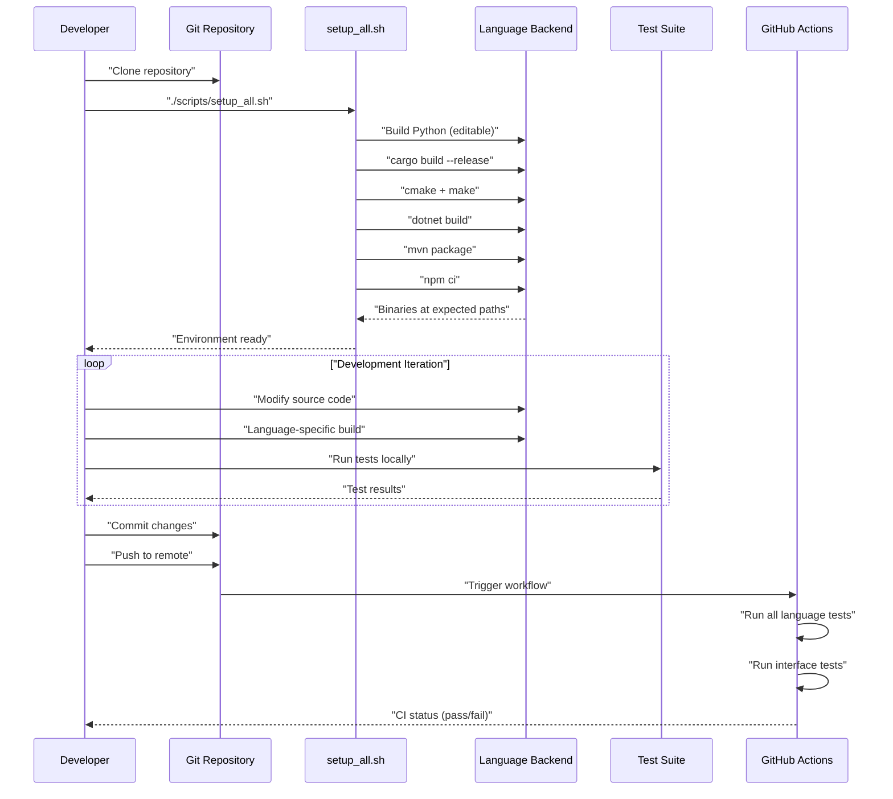
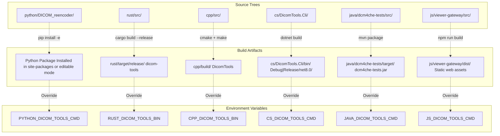
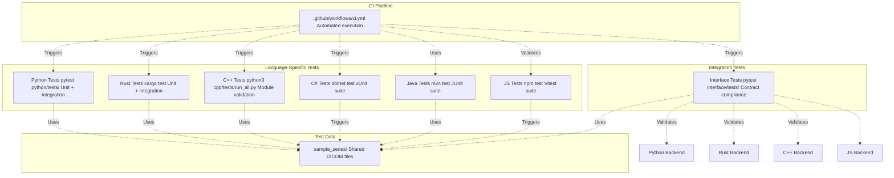
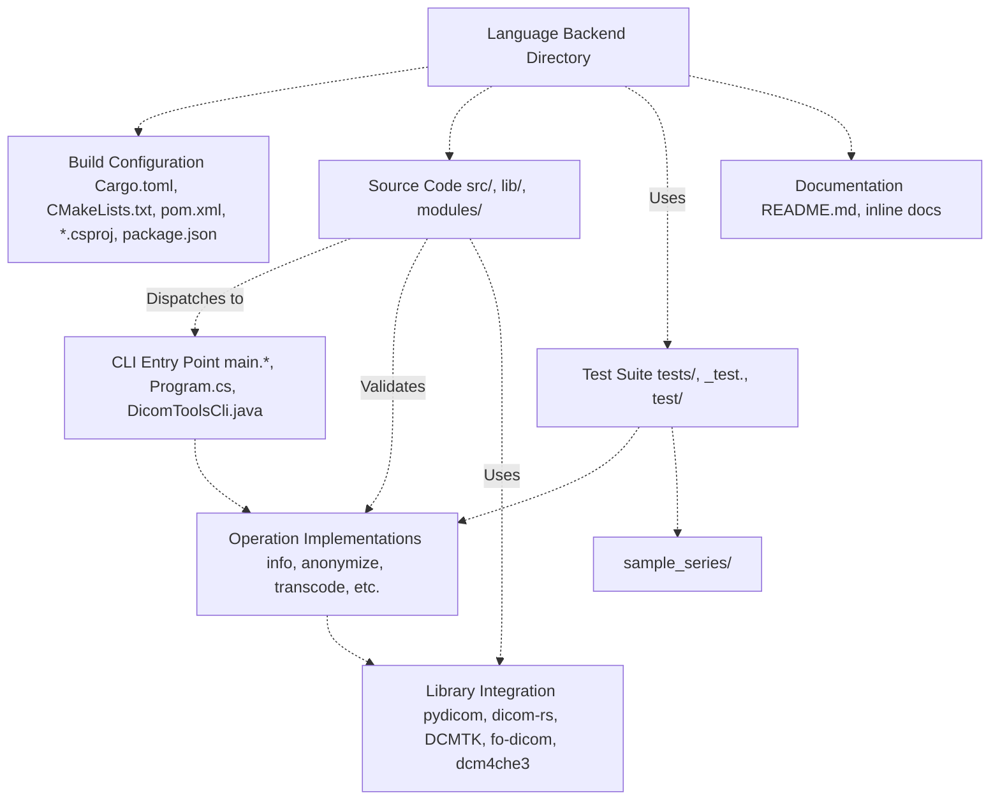
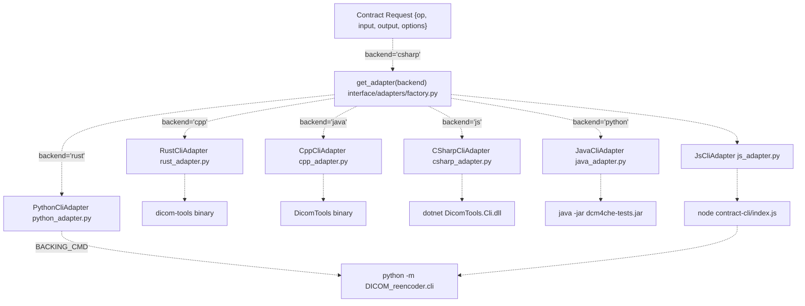

# 8 Development

> **Relevant source files**
> * [.github/workflows/ci.yml](https://github.com/ThalesMMS/Dicom-Tools/blob/c7b4cbd8/.github/workflows/ci.yml)
> * [BUILD.md](https://github.com/ThalesMMS/Dicom-Tools/blob/c7b4cbd8/BUILD.md)
> * [README.md](https://github.com/ThalesMMS/Dicom-Tools/blob/c7b4cbd8/README.md)
> * [java/dcm4che-tests/pom.xml](https://github.com/ThalesMMS/Dicom-Tools/blob/c7b4cbd8/java/dcm4che-tests/pom.xml)
> * [scripts/setup_all.sh](https://github.com/ThalesMMS/Dicom-Tools/blob/c7b4cbd8/scripts/setup_all.sh)

This page provides an overview of development practices, tools, and workflows for contributors to the Dicom-Tools repository. It covers the development environment setup, repository structure, build processes, and testing infrastructure. For detailed information about the build system, see [Build System](8a%20Build-System.md). For CI/CD pipeline configuration, see [CI/CD Pipeline](8b%20CI-CD-Pipeline.md). For guides on extending the toolkit, see [Adding a New Backend](8c%20Adding-a-New-Backend.md) and [Adding a New Operation](8d%20Adding-a-New-Operation.md).

---

## Development Environment Overview

Dicom-Tools is a polyglot project requiring multiple language toolchains. The [scripts/setup_all.sh L1-L60](https://github.com/ThalesMMS/Dicom-Tools/blob/c7b4cbd8/scripts/setup_all.sh#L1-L60)

 script automates the installation and build process across all backends.

### Required Tools

| Tool | Minimum Version | Purpose | Validation Command |
| --- | --- | --- | --- |
| `python3` | 3.10+ | Python backend and interface layer | `python3 --version` |
| `pip` | Latest | Python package management | `pip --version` |
| `cargo` | 1.75+ | Rust backend compilation | `cargo --version` |
| `cmake` | 3.15+ | C++ build configuration | `cmake --version` |
| C++ compiler | C++17 support | C++ backend compilation | `g++ --version` or `clang++ --version` |
| `dotnet` | SDK 8.0+ | C# backend compilation | `dotnet --version` |
| `mvn` | Latest | Java backend and dcm4che integration | `mvn --version` |
| `npm` | 18+ | JavaScript viewer and contract-cli | `npm --version` |

**Setup Invocation:**

```
./scripts/setup_all.sh
```

The script performs editable Python installation, release builds for Rust and C++, restoration and build for C#, Maven packaging for Java, and npm dependency installation for JavaScript components. [README.md L28-L30](https://github.com/ThalesMMS/Dicom-Tools/blob/c7b4cbd8/README.md#L28-L30)

Sources: [scripts/setup_all.sh L1-L60](https://github.com/ThalesMMS/Dicom-Tools/blob/c7b4cbd8/scripts/setup_all.sh#L1-L60)

 [README.md L28-L30](https://github.com/ThalesMMS/Dicom-Tools/blob/c7b4cbd8/README.md#L28-L30)

 [BUILD.md L1-L9](https://github.com/ThalesMMS/Dicom-Tools/blob/c7b4cbd8/BUILD.md#L1-L9)

---

## Repository Structure for Developers

```mermaid
flowchart TD

Root["Repository Root"]
Python["python/ DICOM_reencoder/"]
Rust["rust/ src/ + Cargo.toml"]
Cpp["cpp/ CMakeLists.txt + src/"]
CSharp["cs/ DicomTools.sln"]
Java["java/dcm4che-tests/ pom.xml + src/"]
JS["js/ viewer-gateway/ + contract-cli/"]
Interface["interface/ app.py + adapters/"]
Scripts["scripts/ setup_all.sh + package_all.sh"]
SampleData["sample_series/ IM-0001-*.dcm"]
Docs["BUILD.md + CONTRACT.md"]
PythonCli["cli.py 20+ commands"]
PythonModules["core/, network/, utils/ pydicom integration"]
PythonTests["tests/ pytest suite"]
RustSrc["main.rs + ops/ dicom-rs operations"]
RustTests["tests/ cargo test"]
RustTarget["target/release/ dicom-tools binary"]
CppModules["modules/ GDCM/DCMTK/ITK/VTK"]
CppTests["tests/run_all.py Python test harness"]
CppBuild["build/ DicomTools binary"]
CSharpCli["DicomTools.Cli/ Program.cs"]
CSharpTests["DicomTools.Tests/ xUnit tests"]
JavaCli["src/main/java/com/dicomtools/cli/ DicomToolsCli.java"]
JavaTests["src/test/java/ JUnit tests"]
JavaTarget["target/ dcm4che-tests.jar"]
ViewerGateway["viewer-gateway/ Cornerstone3D viewer"]
ContractCli["contract-cli/ Node.js shim"]
InterfaceApp["app.py TkApp GUI"]
InterfaceRunner["contract_runner.py Headless executor"]
InterfaceAdapters["adapters/ get_adapter factory"]
InterfaceTests["tests/ Contract validation"]

Root -.-> Python
Root -.-> Rust
Root -.-> Cpp
Root -.-> CSharp
Root -.-> Java
Root -.-> JS
Root -.-> Interface
Root -.-> Scripts
Root -.-> SampleData
Root -.-> Docs
Python -.-> PythonCli
Python -.-> PythonModules
Python -.-> PythonTests
Rust -.-> RustSrc
Rust -.-> RustTests
Rust -.-> RustTarget
Cpp -.-> CppModules
Cpp -.-> CppTests
Cpp -.-> CppBuild
CSharp -.-> CSharpCli
CSharp -.-> CSharpTests
Java -.-> JavaCli
Java -.-> JavaTests
Java -.-> JavaTarget
JS -.-> ViewerGateway
JS -.-> ContractCli
Interface -.-> InterfaceApp
Interface -.-> InterfaceRunner
Interface -.-> InterfaceAdapters
Interface -.-> InterfaceTests
```



**Key Development Directories:**

* **Language Backends**: Each top-level language directory (`python/`, `rust/`, `cpp/`, etc.) is self-contained with its own build configuration, source code, and tests
* **Interface Layer**: [interface/](https://github.com/ThalesMMS/Dicom-Tools/blob/c7b4cbd8/interface/)  contains the adapter pattern implementation and cross-language contract enforcement
* **Shared Resources**: [sample_series/](https://github.com/ThalesMMS/Dicom-Tools/blob/c7b4cbd8/sample_series/)  provides consistent test data across all backends
* **Build Scripts**: [scripts/](https://github.com/ThalesMMS/Dicom-Tools/blob/c7b4cbd8/scripts/)  contains automation for setup, packaging, and deployment

Sources: [README.md L15-L23](https://github.com/ThalesMMS/Dicom-Tools/blob/c7b4cbd8/README.md#L15-L23)

 [BUILD.md L20-L33](https://github.com/ThalesMMS/Dicom-Tools/blob/c7b4cbd8/BUILD.md#L20-L33)

---

## Development Workflow

### Standard Development Cycle



### Common Development Commands

| Task | Command | Notes |
| --- | --- | --- |
| **Initial Setup** | `./scripts/setup_all.sh` | One-time full environment setup |
| **Python Development** | `cd python && pip install -e .` | Editable install for live changes |
| **Python Tests** | `cd python && pytest` | Runs all Python unit tests |
| **Rust Development** | `cd rust && cargo build` | Debug build for faster iteration |
| **Rust Tests** | `cd rust && cargo test` | Runs Rust test suite |
| **C++ Development** | `cd cpp/build && make` | Incremental rebuild |
| **C++ Tests** | `python3 cpp/tests/run_all.py` | Python harness for C++ tests |
| **C# Development** | `cd cs && dotnet build` | Incremental build |
| **C# Tests** | `cd cs && dotnet test` | xUnit test execution |
| **Java Development** | `cd java/dcm4che-tests && mvn compile` | Incremental compilation |
| **Java Tests** | `cd java/dcm4che-tests && mvn test` | JUnit test execution |
| **JS Development** | `cd js/viewer-gateway && npm run dev` | Hot-reload dev server |
| **JS Tests** | `cd js/viewer-gateway && npm test` | Vitest execution |
| **Interface Tests** | `cd interface && pytest` | Contract compliance validation |
| **Launch GUI** | `python -m interface.app` | TkApp desktop application |
| **Contract Runner** | `python -m interface.contract_runner --backend python --op info --input sample_series/IM-0001-0001.dcm` | Headless CLI execution |

Sources: [README.md L32-L39](https://github.com/ThalesMMS/Dicom-Tools/blob/c7b4cbd8/README.md#L32-L39)

 [BUILD.md L10-L33](https://github.com/ThalesMMS/Dicom-Tools/blob/c7b4cbd8/BUILD.md#L10-L33)

---

## Build Artifacts and Locations

### Build Output Paths



**Expected Artifact Locations:**

| Backend | Artifact Path | Environment Variable Override |
| --- | --- | --- |
| Python | Site-packages or editable install | `PYTHON_DICOM_TOOLS_CMD` |
| Rust | `rust/target/release/dicom-tools` | `RUST_DICOM_TOOLS_BIN` |
| C++ | `cpp/build/DicomTools` | `CPP_DICOM_TOOLS_BIN` |
| C# | `cs/DicomTools.Cli/bin/*/net8.0/DicomTools.Cli.dll` | `CS_DICOM_TOOLS_CMD` |
| Java | `java/dcm4che-tests/target/dcm4che-tests.jar` | `JAVA_DICOM_TOOLS_CMD` |
| JavaScript | `js/contract-cli/index.js` (shim to Python) | `JS_DICOM_TOOLS_CMD` |

The adapter factory in [interface/adapters/factory.py](https://github.com/ThalesMMS/Dicom-Tools/blob/c7b4cbd8/interface/adapters/factory.py)

 uses these environment variables to locate backend executables at runtime. If not set, the factory falls back to default paths based on the repository structure.

Sources: [BUILD.md L36-L41](https://github.com/ThalesMMS/Dicom-Tools/blob/c7b4cbd8/BUILD.md#L36-L41)

 [scripts/setup_all.sh L53-L59](https://github.com/ThalesMMS/Dicom-Tools/blob/c7b4cbd8/scripts/setup_all.sh#L53-L59)

 [.github/workflows/ci.yml L133-L136](https://github.com/ThalesMMS/Dicom-Tools/blob/c7b4cbd8/.github/workflows/ci.yml#L133-L136)

---

## Environment Variables for Development

### Backend Configuration

| Variable | Default Behavior | Purpose |
| --- | --- | --- |
| `PYTHON_DICOM_TOOLS_CMD` | `python -m DICOM_reencoder.cli` | Override Python CLI invocation |
| `RUST_DICOM_TOOLS_BIN` | `rust/target/release/dicom-tools` | Override Rust binary path |
| `CPP_DICOM_TOOLS_BIN` | `cpp/build/DicomTools` | Override C++ binary path |
| `CS_DICOM_TOOLS_CMD` | `dotnet cs/bin/.../DicomTools.Cli.dll` | Override C# CLI invocation |
| `JAVA_DICOM_TOOLS_CMD` | `java -jar java/dcm4che-tests/target/dcm4che-tests.jar` | Override Java CLI invocation |
| `JS_DICOM_TOOLS_CMD` | `node js/contract-cli/index.js` | Override JavaScript shim invocation |
| `BACKING_CMD` | Python backend | JS contract-cli delegation target |

### Build Configuration

| Variable | Default | Purpose |
| --- | --- | --- |
| `BUILD_TYPE` | `Release` | C++ CMake build configuration (`Debug` or `Release`) |
| `PYTHON` | `python3` | Python interpreter for setup scripts |
| `DOTNET_ROLL_FORWARD` | (unset) | Set to `Major` to allow .NET version roll-forward |

These variables are used by:

* [scripts/setup_all.sh L6-L7](https://github.com/ThalesMMS/Dicom-Tools/blob/c7b4cbd8/scripts/setup_all.sh#L6-L7)  for build configuration
* [interface/adapters/](https://github.com/ThalesMMS/Dicom-Tools/blob/c7b4cbd8/interface/adapters/)  for runtime backend resolution
* [.github/workflows/ci.yml L133-L136](https://github.com/ThalesMMS/Dicom-Tools/blob/c7b4cbd8/.github/workflows/ci.yml#L133-L136)  for CI test execution

Sources: [scripts/setup_all.sh L6-L7](https://github.com/ThalesMMS/Dicom-Tools/blob/c7b4cbd8/scripts/setup_all.sh#L6-L7)

 [BUILD.md L34-L41](https://github.com/ThalesMMS/Dicom-Tools/blob/c7b4cbd8/BUILD.md#L34-L41)

 [.github/workflows/ci.yml L40-L136](https://github.com/ThalesMMS/Dicom-Tools/blob/c7b4cbd8/.github/workflows/ci.yml#L40-L136)

---

## Testing Infrastructure Overview

### Multi-Tier Testing Strategy



**Test Execution Commands:**

The CI pipeline defined in [.github/workflows/ci.yml L1-L138](https://github.com/ThalesMMS/Dicom-Tools/blob/c7b4cbd8/.github/workflows/ci.yml#L1-L138)

 executes all test suites on every push and pull request:

* **Python Job** [.github/workflows/ci.yml L8-L23](https://github.com/ThalesMMS/Dicom-Tools/blob/c7b4cbd8/.github/workflows/ci.yml#L8-L23) : Installs dependencies with `pip install -r python/requirements-dev.txt`, then runs `pytest` in the `python/` directory
* **Rust Job** [.github/workflows/ci.yml L25-L36](https://github.com/ThalesMMS/Dicom-Tools/blob/c7b4cbd8/.github/workflows/ci.yml#L25-L36) : Sets up Rust toolchain and runs `cargo test` in `rust/`
* **C# Job** [.github/workflows/ci.yml L38-L50](https://github.com/ThalesMMS/Dicom-Tools/blob/c7b4cbd8/.github/workflows/ci.yml#L38-L50) : Sets up .NET 8 SDK with `DOTNET_ROLL_FORWARD=Major` and runs `dotnet test` with blame hang timeout
* **Java Job** [.github/workflows/ci.yml L52-L64](https://github.com/ThalesMMS/Dicom-Tools/blob/c7b4cbd8/.github/workflows/ci.yml#L52-L64) : Sets up JDK 17 (Temurin distribution) and runs `mvn test -B`
* **C++ Job** [.github/workflows/ci.yml L66-L73](https://github.com/ThalesMMS/Dicom-Tools/blob/c7b4cbd8/.github/workflows/ci.yml#L66-L73) : Configures CMake with `BUILD_TESTING=OFF` and builds with `-j2` parallelism
* **JavaScript Job** [.github/workflows/ci.yml L75-L93](https://github.com/ThalesMMS/Dicom-Tools/blob/c7b4cbd8/.github/workflows/ci.yml#L75-L93) : Sets up Node.js 20 with npm cache, runs `npm ci`, builds, and executes coverage tests
* **Interface Job** [.github/workflows/ci.yml L95-L137](https://github.com/ThalesMMS/Dicom-Tools/blob/c7b4cbd8/.github/workflows/ci.yml#L95-L137) : Builds Rust and C++ backends, sets environment variables for binary paths, and runs `pytest interface/tests/` for cross-language validation

For detailed testing documentation, see [Testing](7%20Testing.md).

Sources: [.github/workflows/ci.yml L1-L138](https://github.com/ThalesMMS/Dicom-Tools/blob/c7b4cbd8/.github/workflows/ci.yml#L1-L138)

 [README.md L32-L39](https://github.com/ThalesMMS/Dicom-Tools/blob/c7b4cbd8/README.md#L32-L39)

---

## Code Organization Principles

### Language Backend Structure

Each language backend follows a consistent internal organization pattern:



**Key Patterns:**

1. **Entry Points**: Each backend has a main CLI entry point that parses arguments according to the contract specification in [interface/CONTRACT.md](https://github.com/ThalesMMS/Dicom-Tools/blob/c7b4cbd8/interface/CONTRACT.md)
2. **Operation Modules**: Operations are organized into modules (e.g., `info`, `anonymize`, `transcode`) with consistent naming across languages
3. **Library Facades**: Backends wrap third-party libraries (pydicom, dicom-rs, DCMTK, fo-dicom, dcm4che3) with operation-specific facades
4. **Test Co-location**: Tests are placed in `tests/` directories alongside source code, using language-specific frameworks (pytest, cargo test, xUnit, JUnit, Vitest)

Sources: [README.md L15-L23](https://github.com/ThalesMMS/Dicom-Tools/blob/c7b4cbd8/README.md#L15-L23)

---

## Adapter Pattern Implementation

The interface layer uses a factory pattern to instantiate backend-specific adapters that translate contract requests into CLI invocations.

### Adapter Factory Flow



Each adapter implements:

* `handle(request)`: Main entry point that translates contract request to CLI invocation
* `_build_cmd()`: Backend-specific command construction
* `_parse_output()`: Result parsing and metadata extraction

For implementation details of individual adapters, see the `interface/adapters/` directory.

Sources: [README.md L42](https://github.com/ThalesMMS/Dicom-Tools/blob/c7b4cbd8/README.md#L42-L42)

---

## Development Resources

### Additional Documentation

* **Build System Details**: See [Build System](8a%20Build-System.md) for comprehensive build configuration and artifact management
* **CI/CD Pipeline**: See [CI/CD Pipeline](8b%20CI-CD-Pipeline.md) for GitHub Actions workflow details and CI best practices
* **Extension Guides**: * [Adding a New Backend](8c%20Adding-a-New-Backend.md): Guide for implementing a new language backend * [Adding a New Operation](8d%20Adding-a-New-Operation.md): Guide for adding operations across all backends
* **Testing Strategy**: See [Testing](7%20Testing.md) for comprehensive testing documentation
* **CLI Contract**: [interface/CONTRACT.md](https://github.com/ThalesMMS/Dicom-Tools/blob/c7b4cbd8/interface/CONTRACT.md)  defines the request/response format for all backends

### Quick Reference Files

| File | Purpose |
| --- | --- |
| [README.md L1-L43](https://github.com/ThalesMMS/Dicom-Tools/blob/c7b4cbd8/README.md#L1-L43) | Repository overview and quickstart |
| [BUILD.md L1-L48](https://github.com/ThalesMMS/Dicom-Tools/blob/c7b4cbd8/BUILD.md#L1-L48) | Build and tooling reference |
| [scripts/setup_all.sh L1-L60](https://github.com/ThalesMMS/Dicom-Tools/blob/c7b4cbd8/scripts/setup_all.sh#L1-L60) | Universal setup automation |
| [.github/workflows/ci.yml L1-L138](https://github.com/ThalesMMS/Dicom-Tools/blob/c7b4cbd8/.github/workflows/ci.yml#L1-L138) | CI pipeline configuration |
| [interface/CONTRACT.md](https://github.com/ThalesMMS/Dicom-Tools/blob/c7b4cbd8/interface/CONTRACT.md) | CLI contract specification |

Sources: [README.md L1-L43](https://github.com/ThalesMMS/Dicom-Tools/blob/c7b4cbd8/README.md#L1-L43)

 [BUILD.md L1-L48](https://github.com/ThalesMMS/Dicom-Tools/blob/c7b4cbd8/BUILD.md#L1-L48)


### On this page

* [Development](8%20Development.md)
* [Development Environment Overview](8%20Development.md)
* [Required Tools](8%20Development.md)
* [Repository Structure for Developers](8%20Development.md)
* [Development Workflow](8%20Development.md)
* [Standard Development Cycle](8%20Development.md)
* [Common Development Commands](8%20Development.md)
* [Build Artifacts and Locations](8%20Development.md)
* [Build Output Paths](8%20Development.md)
* [Environment Variables for Development](8%20Development.md)
* [Backend Configuration](8%20Development.md)
* [Build Configuration](8%20Development.md)
* [Testing Infrastructure Overview](8%20Development.md)
* [Multi-Tier Testing Strategy](8%20Development.md)
* [Code Organization Principles](8%20Development.md)
* [Language Backend Structure](8%20Development.md)
* [Adapter Pattern Implementation](8%20Development.md)
* [Adapter Factory Flow](8%20Development.md)
* [Development Resources](8%20Development.md)
* [Additional Documentation](8%20Development.md)
* [Quick Reference Files](8%20Development.md)

Ask Devin about Dicom-Tools