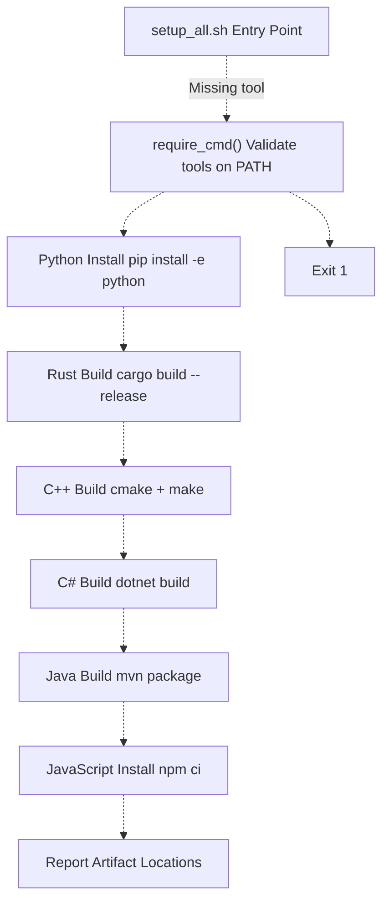
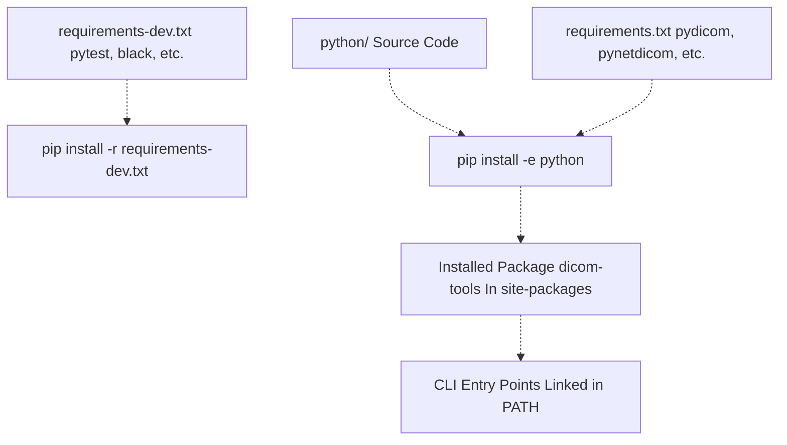
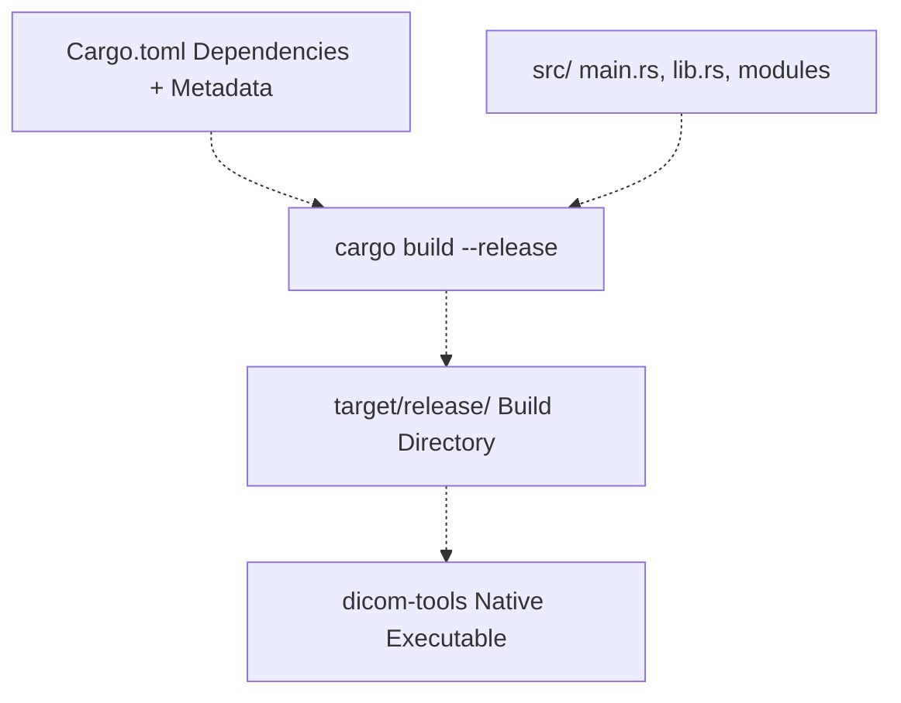
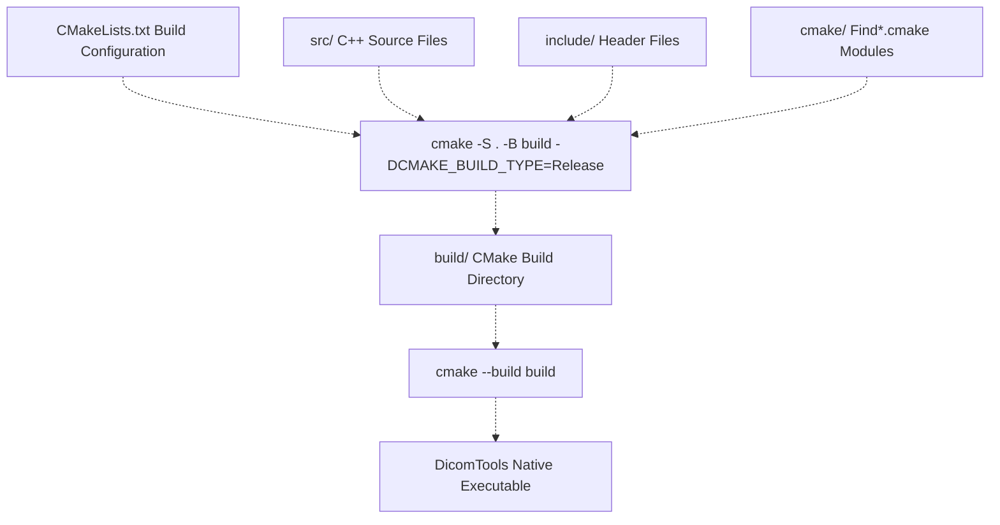
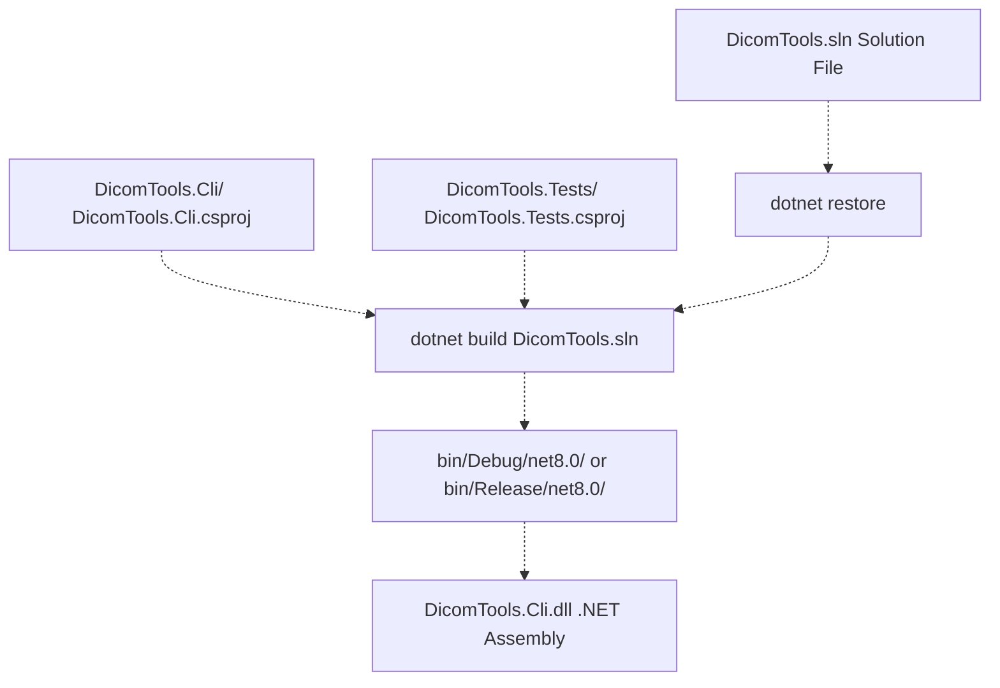
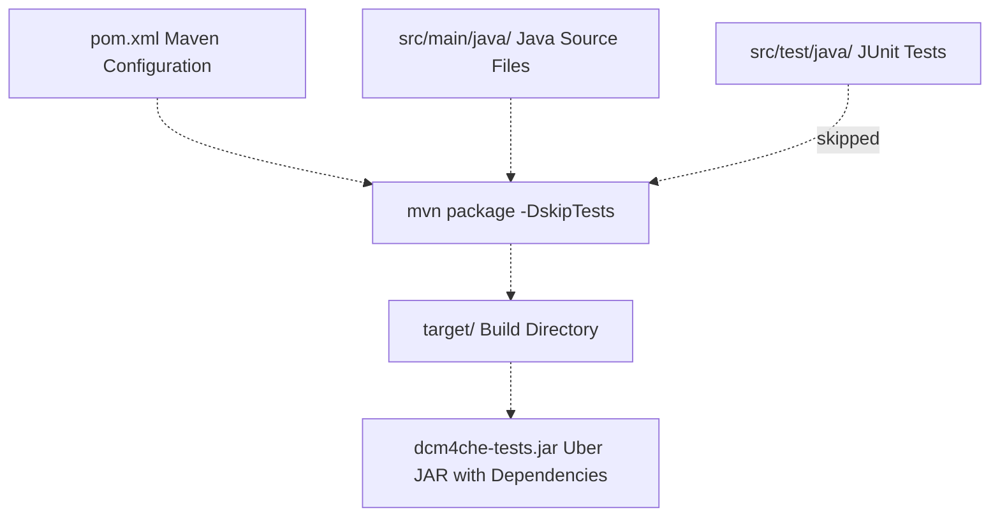
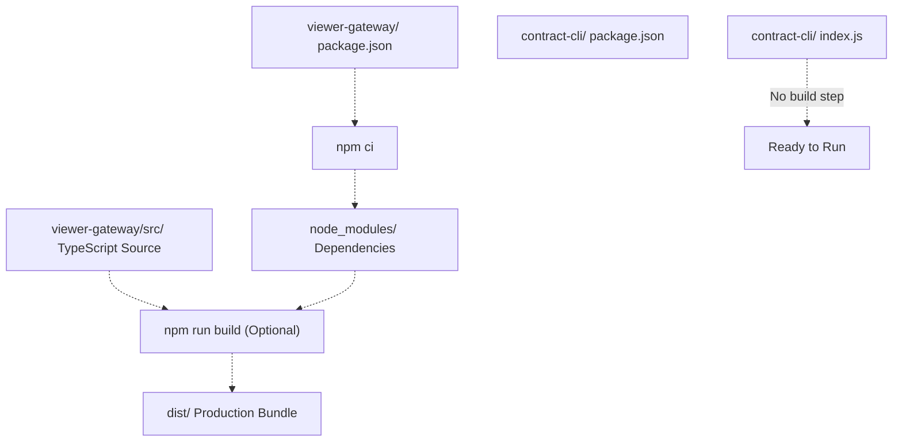
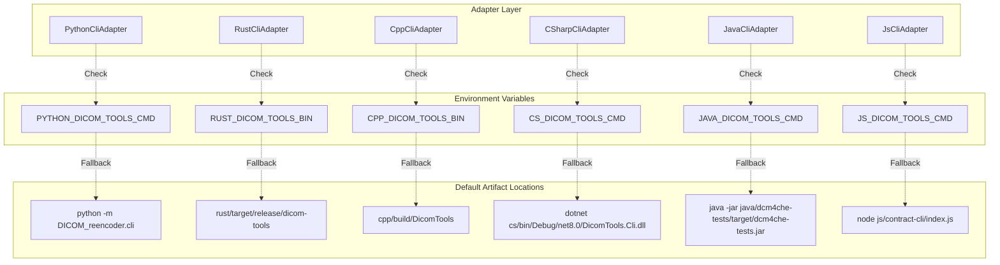

# Build System

> **Relevant source files**
> * [BUILD.md](https://github.com/ThalesMMS/Dicom-Tools/blob/c7b4cbd8/BUILD.md)
> * [README.md](https://github.com/ThalesMMS/Dicom-Tools/blob/c7b4cbd8/README.md)
> * [scripts/setup_all.sh](https://github.com/ThalesMMS/Dicom-Tools/blob/c7b4cbd8/scripts/setup_all.sh)

## Purpose and Scope

This document explains the build system for the Dicom-Tools repository, covering how each language backend is compiled or installed, where build artifacts are placed, and how the system locates executables at runtime. The build system is designed to support six language implementations (Python, Rust, C++, C#, Java, JavaScript) with a single-command setup via `setup_all.sh`.

For information about runtime configuration and how adapters locate these built artifacts, see [Environment Configuration](#3.3). For details on the CI/CD pipeline that automates these builds, see [CI/CD Pipeline](#8.2).

**Sources:** [README.md L1-L43](https://github.com/ThalesMMS/Dicom-Tools/blob/c7b4cbd8/README.md#L1-L43)

 [BUILD.md L1-L48](https://github.com/ThalesMMS/Dicom-Tools/blob/c7b4cbd8/BUILD.md#L1-L48)

---

## Build Orchestration

### Universal Setup Script

The `setup_all.sh` script serves as the primary entry point for building the entire multi-language toolkit. It orchestrates all language-specific build processes in sequence, validates required tools, and reports final artifact locations.



**Figure 1: Build Orchestration Flow**

**Sources:** [scripts/setup_all.sh L1-L60](https://github.com/ThalesMMS/Dicom-Tools/blob/c7b4cbd8/scripts/setup_all.sh#L1-L60)

### Required Tools

The script validates the presence of the following commands before proceeding:

| Tool | Command | Minimum Version | Purpose |
| --- | --- | --- | --- |
| Python | `python3` | 3.10+ | Python backend and interface |
| Rust | `cargo` | 1.75+ | Rust backend compilation |
| CMake | `cmake` | 3.15+ | C++ build configuration |
| .NET SDK | `dotnet` | 8.0+ | C# compilation (tests support .NET 10 with `DOTNET_ROLL_FORWARD=Major`) |
| Maven | `mvn` | 3.6+ | Java dependency management and packaging |
| Node.js | `npm` | 18+ | JavaScript dependencies |

**Sources:** [BUILD.md L3-L8](https://github.com/ThalesMMS/Dicom-Tools/blob/c7b4cbd8/BUILD.md#L3-L8)

 [scripts/setup_all.sh L11-L16](https://github.com/ThalesMMS/Dicom-Tools/blob/c7b4cbd8/scripts/setup_all.sh#L11-L16)

### Environment Variables

The setup script honors the following environment variables:

* **`PYTHON`**: Override Python interpreter (default: `python3`)
* **`BUILD_TYPE`**: C++ build configuration (default: `Release`, alternative: `Debug`)

Example usage:

```
PYTHON=python3.11 BUILD_TYPE=Debug ./scripts/setup_all.sh
```

**Sources:** [scripts/setup_all.sh L6-L7](https://github.com/ThalesMMS/Dicom-Tools/blob/c7b4cbd8/scripts/setup_all.sh#L6-L7)

---

## Language-Specific Build Processes

### Python Backend

The Python backend uses an editable install, allowing development changes to be immediately available without reinstallation.



**Figure 2: Python Build Process**

**Build Commands:**

```
# Via setup script./scripts/setup_all.sh# Manualcd pythonpip install -r requirements-dev.txt  # Optional: test dependenciespip install -e .                      # Editable install# Alternative: Makefilemake python-install
```

**Artifact Location:** Package installed into Python's `site-packages` directory with entry points added to `bin/` or `Scripts/`.

**Sources:** [scripts/setup_all.sh L18-L23](https://github.com/ThalesMMS/Dicom-Tools/blob/c7b4cbd8/scripts/setup_all.sh#L18-L23)

 [README.md L16](https://github.com/ThalesMMS/Dicom-Tools/blob/c7b4cbd8/README.md#L16-L16)

 [BUILD.md L10-L11](https://github.com/ThalesMMS/Dicom-Tools/blob/c7b4cbd8/BUILD.md#L10-L11)

---

### Rust Backend

The Rust backend compiles to a native executable using `cargo build --release`, producing an optimized binary.



**Figure 3: Rust Build Process**

**Build Commands:**

```
# Via setup script./scripts/setup_all.sh# Manualcd rustcargo build --release# Development build (faster, less optimized)cargo build# Alternative: Makefilemake rust-build
```

**Artifact Location:** [rust/target/release/dicom-tools](https://github.com/ThalesMMS/Dicom-Tools/blob/c7b4cbd8/rust/target/release/dicom-tools)

**Additional Commands:**

* `cargo test`: Run unit tests
* `cargo fmt --all`: Format code
* `cargo clippy --all-targets --all-features`: Lint checks

**Sources:** [scripts/setup_all.sh L25-L27](https://github.com/ThalesMMS/Dicom-Tools/blob/c7b4cbd8/scripts/setup_all.sh#L25-L27)

 [README.md L17](https://github.com/ThalesMMS/Dicom-Tools/blob/c7b4cbd8/README.md#L17-L17)

 [BUILD.md L13-L14](https://github.com/ThalesMMS/Dicom-Tools/blob/c7b4cbd8/BUILD.md#L13-L14)

---

### C++ Backend

The C++ backend uses CMake for configuration and build, producing the `DicomTools` executable with optional VTK, ITK, GDCM, and DCMTK support.



**Figure 4: C++ Build Process**

**Build Commands:**

```
# Via setup script./scripts/setup_all.sh# Manualmkdir -p cpp/buildcd cpp/buildcmake -DCMAKE_BUILD_TYPE=Release ..cmake --build .# Alternative: Makefilemake cpp-build
```

**Artifact Location:** [cpp/build/DicomTools](https://github.com/ThalesMMS/Dicom-Tools/blob/c7b4cbd8/cpp/build/DicomTools)

**Additional Setup:** The setup script creates a symbolic link `cpp/input -> sample_series` if it doesn't exist, allowing C++ tests to access shared test data.

**Sources:** [scripts/setup_all.sh L29-L38](https://github.com/ThalesMMS/Dicom-Tools/blob/c7b4cbd8/scripts/setup_all.sh#L29-L38)

 [README.md L18](https://github.com/ThalesMMS/Dicom-Tools/blob/c7b4cbd8/README.md#L18-L18)

 [BUILD.md L15-L16](https://github.com/ThalesMMS/Dicom-Tools/blob/c7b4cbd8/BUILD.md#L15-L16)

---

### C# Backend

The C# backend uses the .NET SDK to restore dependencies and build the `DicomTools.Cli` project along with its test suite.



**Figure 5: C# Build Process**

**Build Commands:**

```
# Via setup script./scripts/setup_all.sh# Manualcd csdotnet restoredotnet build DicomTools.sln# Build only CLI projectdotnet build DicomTools.Cli/DicomTools.Cli.csproj# Release builddotnet build -c Release
```

**Artifact Locations:**

* Debug: [cs/DicomTools.Cli/bin/Debug/net8.0/DicomTools.Cli.dll](https://github.com/ThalesMMS/Dicom-Tools/blob/c7b4cbd8/cs/DicomTools.Cli/bin/Debug/net8.0/DicomTools.Cli.dll)
* Release: [cs/DicomTools.Cli/bin/Release/net8.0/DicomTools.Cli.dll](https://github.com/ThalesMMS/Dicom-Tools/blob/c7b4cbd8/cs/DicomTools.Cli/bin/Release/net8.0/DicomTools.Cli.dll)

**Running the CLI:**

```
dotnet cs/bin/Debug/net8.0/DicomTools.Cli.dll --help
```

**Sources:** [scripts/setup_all.sh L40-L43](https://github.com/ThalesMMS/Dicom-Tools/blob/c7b4cbd8/scripts/setup_all.sh#L40-L43)

 [README.md L19](https://github.com/ThalesMMS/Dicom-Tools/blob/c7b4cbd8/README.md#L19-L19)

 [BUILD.md L30](https://github.com/ThalesMMS/Dicom-Tools/blob/c7b4cbd8/BUILD.md#L30-L30)

---

### Java Backend

The Java backend uses Maven to download dcm4che dependencies and package the application as an uber JAR.



**Figure 6: Java Build Process**

**Build Commands:**

```
# Via setup script./scripts/setup_all.sh# Manualcd java/dcm4che-testsmvn package -DskipTests  # Skip tests during buildmvn clean package        # Clean + build + test# Just run testsmvn test
```

**Artifact Location:** [java/dcm4che-tests/target/dcm4che-tests.jar](https://github.com/ThalesMMS/Dicom-Tools/blob/c7b4cbd8/java/dcm4che-tests/target/dcm4che-tests.jar)

**Running the CLI:**

```
java -jar java/dcm4che-tests/target/dcm4che-tests.jar --op info --input sample_series/IM-0001-0001.dcm
```

**Main Class:** `com.dicomtools.cli.DicomToolsCli`

**Sources:** [scripts/setup_all.sh L45-L47](https://github.com/ThalesMMS/Dicom-Tools/blob/c7b4cbd8/scripts/setup_all.sh#L45-L47)

 [README.md L20](https://github.com/ThalesMMS/Dicom-Tools/blob/c7b4cbd8/README.md#L20-L20)

 [BUILD.md L28-L29](https://github.com/ThalesMMS/Dicom-Tools/blob/c7b4cbd8/BUILD.md#L28-L29)

---

### JavaScript Backend

The JavaScript backend consists of two parts: the `viewer-gateway` web application and the `contract-cli` Node.js shim.



**Figure 7: JavaScript Build Process**

**Build Commands:**

```
# Via setup script (viewer-gateway only)./scripts/setup_all.sh# Manual - Viewercd js/viewer-gatewaynpm ci              # Install dependenciesnpm run build       # Build production bundlenpm run dev         # Run development servernpm test            # Run Vitest tests# Manual - Contract CLI (no build needed)node js/contract-cli/index.js --op info --input sample_series/IM-0001-0001.dcm --options '{}'
```

**Artifact Locations:**

* Development: [js/viewer-gateway/node_modules/](https://github.com/ThalesMMS/Dicom-Tools/blob/c7b4cbd8/js/viewer-gateway/node_modules/)
* Production: [js/viewer-gateway/dist/](https://github.com/ThalesMMS/Dicom-Tools/blob/c7b4cbd8/js/viewer-gateway/dist/)  (after `npm run build`)
* Contract CLI: [js/contract-cli/index.js](https://github.com/ThalesMMS/Dicom-Tools/blob/c7b4cbd8/js/contract-cli/index.js)  (no compilation needed)

**Sources:** [scripts/setup_all.sh L49-L51](https://github.com/ThalesMMS/Dicom-Tools/blob/c7b4cbd8/scripts/setup_all.sh#L49-L51)

 [README.md L21](https://github.com/ThalesMMS/Dicom-Tools/blob/c7b4cbd8/README.md#L21-L21)

 [BUILD.md L31-L32](https://github.com/ThalesMMS/Dicom-Tools/blob/c7b4cbd8/BUILD.md#L31-L32)

---

## Build Artifacts Summary

The following table shows where each language places its build artifacts:

| Language | Artifact Type | Location | Entry Point |
| --- | --- | --- | --- |
| **Python** | Package | `site-packages/` (system or venv) | `python -m DICOM_reencoder.cli` |
| **Rust** | Native binary | `rust/target/release/dicom-tools` | Direct execution |
| **C++** | Native binary | `cpp/build/DicomTools` | Direct execution |
| **C#** | .NET assembly | `cs/DicomTools.Cli/bin/Debug/net8.0/DicomTools.Cli.dll` | `dotnet <path>` |
| **Java** | Uber JAR | `java/dcm4che-tests/target/dcm4che-tests.jar` | `java -jar <path>` |
| **JavaScript** | Node modules + source | `js/viewer-gateway/node_modules/``js/contract-cli/index.js` | `node <path>` |

**Sources:** [BUILD.md L34-L41](https://github.com/ThalesMMS/Dicom-Tools/blob/c7b4cbd8/BUILD.md#L34-L41)

 [README.md L53-L59](https://github.com/ThalesMMS/Dicom-Tools/blob/c7b4cbd8/README.md#L53-L59)

---

## Runtime Configuration via Environment Variables

The adapter layer uses environment variables to locate built executables. This allows overriding default paths for different deployment scenarios (development, CI, production).



**Figure 8: Environment Variable Configuration**

### Environment Variable Reference

| Variable | Purpose | Example Override |
| --- | --- | --- |
| `PYTHON_DICOM_TOOLS_CMD` | Python CLI command | `python3.11 -m DICOM_reencoder.cli` |
| `RUST_DICOM_TOOLS_BIN` | Rust binary path | `/opt/dicom-tools/bin/dicom-tools` |
| `CPP_DICOM_TOOLS_BIN` | C++ binary path | `/usr/local/bin/DicomTools` |
| `CS_DICOM_TOOLS_CMD` | C# CLI command | `dotnet /app/DicomTools.Cli.dll` |
| `JAVA_DICOM_TOOLS_CMD` | Java CLI command | `java -jar /app/dcm4che-tests.jar` |
| `JS_DICOM_TOOLS_CMD` | JavaScript CLI command | `node /app/contract-cli/index.js` |

**Special Variable:**

* `BACKING_CMD`: Used by JavaScript contract CLI to override which backend it delegates to (default: Python)

**Sources:** [BUILD.md L34-L41](https://github.com/ThalesMMS/Dicom-Tools/blob/c7b4cbd8/BUILD.md#L34-L41)

 [interface/CONTRACT.md](https://github.com/ThalesMMS/Dicom-Tools/blob/c7b4cbd8/interface/CONTRACT.md)

---

## Common Build Scenarios

### Scenario 1: Initial Setup

```
# Clone repositorygit clone https://github.com/ThalesMMS/Dicom-Tools.gitcd Dicom-Tools# One-command setup./scripts/setup_all.sh# Verify buildsrust/target/release/dicom-tools --versioncpp/build/DicomTools --helppython -m DICOM_reencoder.cli --help
```

### Scenario 2: Development Build (C++)

```
# Debug build for faster compilation and debugging symbolsBUILD_TYPE=Debug ./scripts/setup_all.sh# Or manuallycd cpp/buildcmake -DCMAKE_BUILD_TYPE=Debug ..cmake --build .
```

### Scenario 3: Incremental Rust Changes

```
# Rust incremental compilation is automaticcd rustcargo build --release# Or for faster debug builds during developmentcargo build
```

### Scenario 4: Python Editable Install

```
# After modifying Python source, changes are immediately availablecd pythonpip install -e .# No rebuild needed; just runpython -m DICOM_reencoder.cli info sample_series/IM-0001-0001.dcm
```

### Scenario 5: CI/Production Release Build

```
# Set environment variables for production pathsexport RUST_DICOM_TOOLS_BIN=/usr/local/bin/dicom-toolsexport CPP_DICOM_TOOLS_BIN=/usr/local/bin/DicomToolsexport CS_DICOM_TOOLS_CMD="dotnet /opt/dicomtools/DicomTools.Cli.dll"# Build all with Release configurationBUILD_TYPE=Release ./scripts/setup_all.sh# Package artifacts./scripts/package_all.sh
```

**Sources:** [BUILD.md L20-L32](https://github.com/ThalesMMS/Dicom-Tools/blob/c7b4cbd8/BUILD.md#L20-L32)

 [scripts/setup_all.sh](https://github.com/ThalesMMS/Dicom-Tools/blob/c7b4cbd8/scripts/setup_all.sh)

---

## Makefile Targets

A `Makefile` in the repository root provides convenience targets for common operations:

| Target | Description | Equivalent Command |
| --- | --- | --- |
| `make python-install` | Install Python package | `pip install -e python` |
| `make python-test` | Run Python tests | `cd python && pytest` |
| `make rust-build` | Build Rust release | `cd rust && cargo build --release` |
| `make rust-test` | Run Rust tests | `cd rust && cargo test` |
| `make cpp-build` | Build C++ project | CMake configure + build in `cpp/build/` |
| `make cpp-test` | Run C++ tests | `ctest` in `cpp/build/` |
| `make interface-run` | Launch Tkinter UI | `python -m interface.app` |
| `make all` | Build Python + Rust + C++ | Equivalent to `setup_all.sh` subset |

**Sources:** [BUILD.md L10-L18](https://github.com/ThalesMMS/Dicom-Tools/blob/c7b4cbd8/BUILD.md#L10-L18)

---

## Build Dependencies and Optional Features

### C++ Optional Features

The C++ backend can be built with or without certain libraries, controlled by CMake options:

* **DCMTK**: Core DICOM operations
* **GDCM**: Advanced transcoding (JPEG 2000, JPEG-LS, RLE)
* **ITK**: Medical image processing, NIfTI export
* **VTK**: 3D visualization, MPR, volume rendering

A helper script builds these dependencies locally if system packages are unavailable:

```
./scripts/build_deps.sh
```

### Python Optional Dependencies

The Python backend has optional feature sets:

```
# Minimal installpip install -e python# With GDCM supportpip install -e python[gdcm]# With SimpleITK and dicom-numpypip install -e python[simpleitk,dicom-numpy]# All optional featurespip install -e python[all]
```

**Sources:** [README.md L16](https://github.com/ThalesMMS/Dicom-Tools/blob/c7b4cbd8/README.md#L16-L16)

 [BUILD.md L25-L27](https://github.com/ThalesMMS/Dicom-Tools/blob/c7b4cbd8/BUILD.md#L25-L27)

---

## Artifact Packaging

The `scripts/package_all.sh` script collects built artifacts into a central `artifacts/` directory for distribution:

```
./scripts/package_all.sh# Creates:# artifacts/#   ├── python/#   │   ├── dicom_tools-*.whl#   │   └── dicom_tools-*.tar.gz#   ├── rust/#   │   └── dicom-tools (or dicom-tools.exe)#   ├── cpp/#   │   └── DicomTools (or DicomTools.exe)#   └── ...
```

**Sources:** [BUILD.md L22](https://github.com/ThalesMMS/Dicom-Tools/blob/c7b4cbd8/BUILD.md#L22-L22)

---

## Build Troubleshooting

### Common Issues

**Issue 1: Missing Python dependencies**

```
# Solution: Install development requirementscd pythonpip install -r requirements-dev.txtpip install -e .
```

**Issue 2: .NET version mismatch**

```
# If only .NET 10 is installedDOTNET_ROLL_FORWARD=Major dotnet build cs/DicomTools.sln
```

**Issue 3: C++ dependency not found**

```
# Build dependencies locally./scripts/build_deps.sh# Then rebuildcd cpp/buildcmake -DCMAKE_BUILD_TYPE=Release ..cmake --build .
```

**Issue 4: Rust incremental compilation corruption**

```
# Clean and rebuildcd rustcargo cleancargo build --release
```

**Sources:** [BUILD.md L7](https://github.com/ThalesMMS/Dicom-Tools/blob/c7b4cbd8/BUILD.md#L7-L7)

 [README.md L18](https://github.com/ThalesMMS/Dicom-Tools/blob/c7b4cbd8/README.md#L18-L18)

---

## Summary

The Dicom-Tools build system supports six language implementations through:

1. **Universal Setup**: `setup_all.sh` builds all backends with one command
2. **Language-Specific Tools**: Each language uses its native build system (pip, cargo, cmake, dotnet, mvn, npm)
3. **Predictable Artifacts**: Build outputs are placed at consistent locations relative to the repository root
4. **Runtime Flexibility**: Environment variables allow overriding artifact locations for different deployment scenarios
5. **Make Targets**: Convenience targets for common operations
6. **CI Integration**: GitHub Actions workflow automates the full build and test cycle

For information on how these build artifacts are integrated into the testing pipeline, see [CI/CD Pipeline](#8.2). For details on how adapters locate and invoke these artifacts, see [Adapter Pattern](#3.2) and [Environment Configuration](#3.3).

Refresh this wiki

Last indexed: 5 January 2026 ([c7b4cb](https://github.com/ThalesMMS/Dicom-Tools/commit/c7b4cbd8))

### On this page

* [Build System](#8.1-build-system)
* [Purpose and Scope](#8.1-purpose-and-scope)
* [Build Orchestration](#8.1-build-orchestration)
* [Universal Setup Script](#8.1-universal-setup-script)
* [Required Tools](#8.1-required-tools)
* [Environment Variables](#8.1-environment-variables)
* [Language-Specific Build Processes](#8.1-language-specific-build-processes)
* [Python Backend](#8.1-python-backend)
* [Rust Backend](#8.1-rust-backend)
* [C++ Backend](#8.1-c-backend)
* [C# Backend](#8.1-c-backend-1)
* [Java Backend](#8.1-java-backend)
* [JavaScript Backend](#8.1-javascript-backend)
* [Build Artifacts Summary](#8.1-build-artifacts-summary)
* [Runtime Configuration via Environment Variables](#8.1-runtime-configuration-via-environment-variables)
* [Environment Variable Reference](#8.1-environment-variable-reference)
* [Common Build Scenarios](#8.1-common-build-scenarios)
* [Scenario 1: Initial Setup](#8.1-scenario-1-initial-setup)
* [Scenario 2: Development Build (C++)](#8.1-scenario-2-development-build-c)
* [Scenario 3: Incremental Rust Changes](#8.1-scenario-3-incremental-rust-changes)
* [Scenario 4: Python Editable Install](#8.1-scenario-4-python-editable-install)
* [Scenario 5: CI/Production Release Build](#8.1-scenario-5-ciproduction-release-build)
* [Makefile Targets](#8.1-makefile-targets)
* [Build Dependencies and Optional Features](#8.1-build-dependencies-and-optional-features)
* [C++ Optional Features](#8.1-c-optional-features)
* [Python Optional Dependencies](#8.1-python-optional-dependencies)
* [Artifact Packaging](#8.1-artifact-packaging)
* [Build Troubleshooting](#8.1-build-troubleshooting)
* [Common Issues](#8.1-common-issues)
* [Summary](#8.1-summary)

Ask Devin about Dicom-Tools