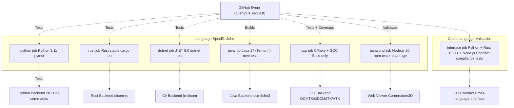
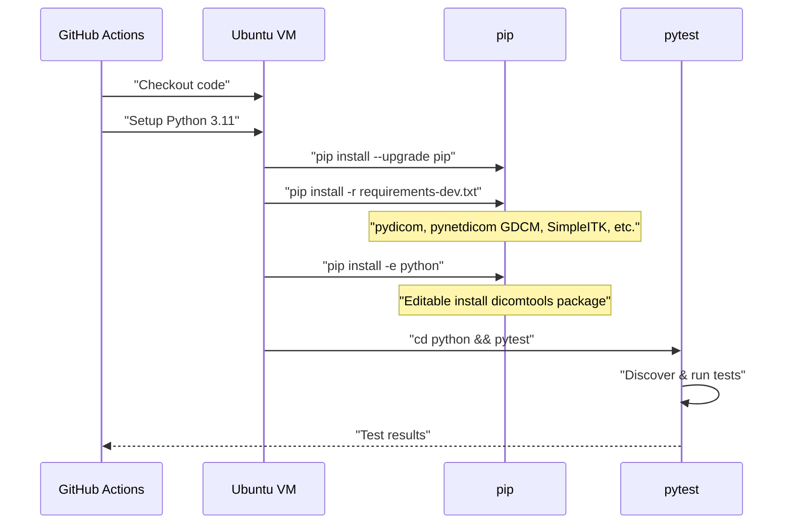
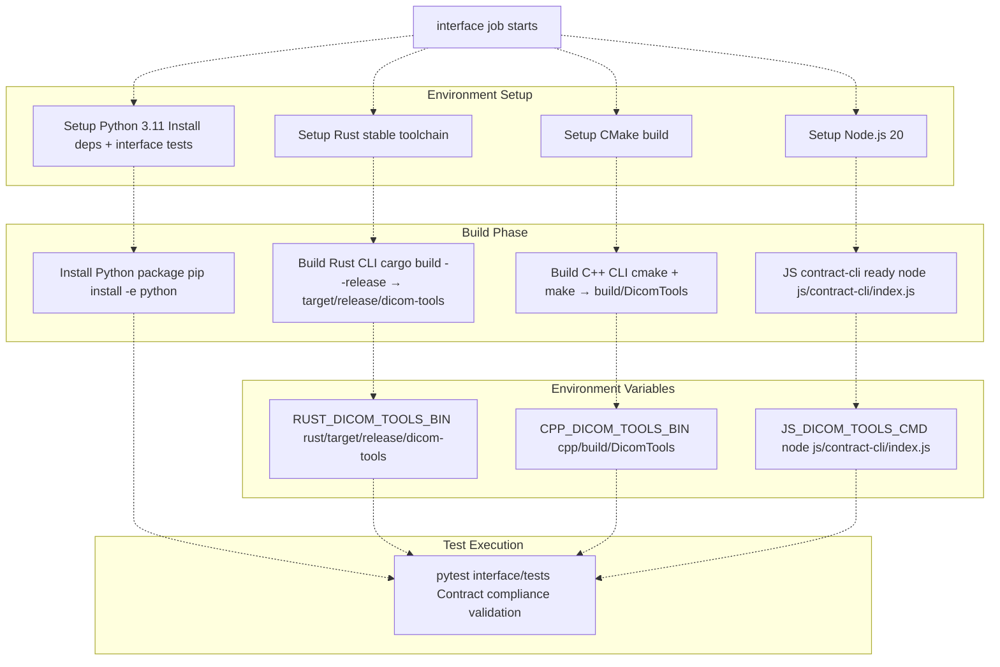
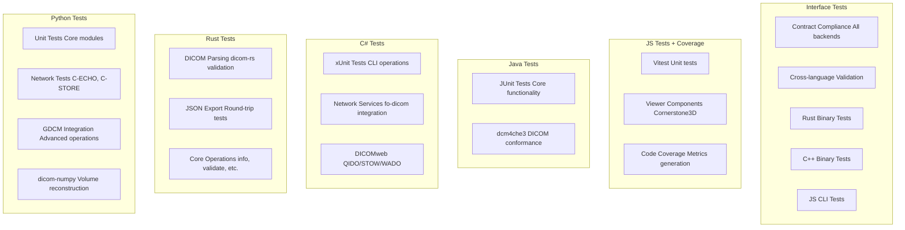

# CI/CD Pipeline

> **Relevant source files**
> * [.github/workflows/ci.yml](https://github.com/ThalesMMS/Dicom-Tools/blob/c7b4cbd8/.github/workflows/ci.yml)
> * [java/dcm4che-tests/pom.xml](https://github.com/ThalesMMS/Dicom-Tools/blob/c7b4cbd8/java/dcm4che-tests/pom.xml)

## Purpose and Scope

This page documents the automated Continuous Integration and Continuous Deployment (CI/CD) pipeline implemented using GitHub Actions. The pipeline validates all six language backends (Python, Rust, C++, C#, Java, JavaScript) and ensures cross-language contract compliance through integration tests. For information about the contract system that the pipeline validates, see [CLI Contract System](3%20CLI-Contract-System.md). For details on building the backends locally, see [Build System](8a%20Build-System.md).

---

## Pipeline Overview

The CI/CD pipeline is defined in [.github/workflows/ci.yml L1-L138](https://github.com/ThalesMMS/Dicom-Tools/blob/c7b4cbd8/.github/workflows/ci.yml#L1-L138)

 and triggers on all push and pull request events. The pipeline executes seven independent jobs in parallel, each responsible for validating a specific language implementation or the cross-language interface layer.

### Job Architecture



**Sources:** [.github/workflows/ci.yml L1-L138](https://github.com/ThalesMMS/Dicom-Tools/blob/c7b4cbd8/.github/workflows/ci.yml#L1-L138)

All jobs except `interface` run independently and validate their respective language implementations. The `interface` job performs integration testing by building multiple backends and validating their contract compliance.

---

## Language-Specific Jobs

### Python Job

The `python` job validates the Python backend, which provides the most comprehensive DICOM functionality with 20+ CLI commands.

**Job Configuration:**

* **Runner:** `ubuntu-latest`
* **Python Version:** 3.11
* **Test Framework:** pytest

**Execution Steps:**

| Step | Action | Command |
| --- | --- | --- |
| 1 | Checkout repository | `actions/checkout@v4` |
| 2 | Setup Python 3.11 | `actions/setup-python@v5` |
| 3 | Install dependencies | `pip install -r python/requirements-dev.txt` |
| 4 | Install package in editable mode | `pip install -e python` |
| 5 | Run test suite | `pytest` in `python/` directory |



**Sources:** [.github/workflows/ci.yml L8-L23](https://github.com/ThalesMMS/Dicom-Tools/blob/c7b4cbd8/.github/workflows/ci.yml#L8-L23)

### Rust Job

The `rust` job validates the Rust backend implementation using the `dicom-rs` library.

**Job Configuration:**

* **Runner:** `ubuntu-latest`
* **Toolchain:** Rust stable
* **Test Framework:** `cargo test`

**Execution Steps:**

| Step | Action | Command |
| --- | --- | --- |
| 1 | Checkout repository | `actions/checkout@v4` |
| 2 | Setup Rust toolchain | `actions-rs/toolchain@v1` with `stable` |
| 3 | Run cargo test | `cargo test` in `rust/` directory |

The Rust test suite validates DICOM parsing, JSON export, and core operations implemented in the Rust backend.

**Sources:** [.github/workflows/ci.yml L25-L36](https://github.com/ThalesMMS/Dicom-Tools/blob/c7b4cbd8/.github/workflows/ci.yml#L25-L36)

### .NET (C#) Job

The `dotnet` job validates the C# backend implementation using the `fo-dicom` library.

**Job Configuration:**

* **Runner:** `ubuntu-latest`
* **.NET Version:** 8.0.x
* **Test Framework:** xUnit via `dotnet test`
* **Environment Variables:** * `DOTNET_ROLL_FORWARD: Major` - Allows framework version roll-forward

**Execution Steps:**

| Step | Action | Command |
| --- | --- | --- |
| 1 | Checkout repository | `actions/checkout@v4` |
| 2 | Setup .NET 8.0 | `actions/setup-dotnet@v4` |
| 3 | Run tests with timeout protection | `dotnet test` with `--blame-hang-timeout 2m` |

The test command includes hang detection to prevent the pipeline from stalling on network operations or infinite loops:

```
dotnet test DicomTools.Tests/DicomTools.Tests.csproj \  -p:TargetFramework=net8.0 \  --blame-hang-timeout 2m \  --blame-hang-dump-type none
```

**Sources:** [.github/workflows/ci.yml L38-L50](https://github.com/ThalesMMS/Dicom-Tools/blob/c7b4cbd8/.github/workflows/ci.yml#L38-L50)

### Java Job

The `java` job validates the Java backend implementation using the `dcm4che3` library.

**Job Configuration:**

* **Runner:** `ubuntu-latest`
* **Java Version:** 17 (Eclipse Temurin distribution)
* **Build Tool:** Maven
* **Test Framework:** JUnit 5

**Execution Steps:**

| Step | Action | Command |
| --- | --- | --- |
| 1 | Checkout repository | `actions/checkout@v4` |
| 2 | Setup JDK 17 | `actions/setup-java@v4` with Temurin distribution |
| 3 | Run Maven test | `mvn test -B` in `java/dcm4che-tests/` directory |

The Maven configuration in [java/dcm4che-tests/pom.xml L142-L146](https://github.com/ThalesMMS/Dicom-Tools/blob/c7b4cbd8/java/dcm4che-tests/pom.xml#L142-L146)

 excludes integration tests by default using `<excludedGroups>integration</excludedGroups>`, running only unit tests in CI.

**Sources:** [.github/workflows/ci.yml L52-L64](https://github.com/ThalesMMS/Dicom-Tools/blob/c7b4cbd8/.github/workflows/ci.yml#L52-L64)

 [java/dcm4che-tests/pom.xml L1-L209](https://github.com/ThalesMMS/Dicom-Tools/blob/c7b4cbd8/java/dcm4che-tests/pom.xml#L1-L209)

### C++ Job

The `cpp` job validates that the C++ backend compiles successfully. Unlike other jobs, it only performs compilation without running tests, as the C++ tests require external dependencies (DCMTK, GDCM, ITK, VTK) that are not installed in the CI environment.

**Job Configuration:**

* **Runner:** `ubuntu-latest`
* **Build System:** CMake
* **Build Type:** Release
* **Testing:** Disabled (`-DBUILD_TESTING=OFF`)

**Execution Steps:**

| Step | Action | Command |
| --- | --- | --- |
| 1 | Checkout repository | `actions/checkout@v4` |
| 2 | Configure CMake | `cmake -S cpp -B cpp/build -DCMAKE_BUILD_TYPE=Release -DBUILD_TESTING=OFF` |
| 3 | Build project | `cmake --build cpp/build --config Release -- -j2` |

The build uses 2 parallel jobs (`-j2`) to optimize build time while staying within CI resource limits.

**Sources:** [.github/workflows/ci.yml L66-L73](https://github.com/ThalesMMS/Dicom-Tools/blob/c7b4cbd8/.github/workflows/ci.yml#L66-L73)

### JavaScript Job

The `javascript` job validates the web-based viewer implementation built on Cornerstone3D.

**Job Configuration:**

* **Runner:** `ubuntu-latest`
* **Node.js Version:** 20
* **Package Manager:** npm with dependency caching
* **Test Framework:** Vitest

**Execution Steps:**

| Step | Action | Command |
| --- | --- | --- |
| 1 | Checkout repository | `actions/checkout@v4` |
| 2 | Setup Node.js 20 with npm cache | `actions/setup-node@v4` with `cache: "npm"` |
| 3 | Install dependencies | `npm ci` in `js/viewer-gateway/` |
| 4 | Build TypeScript | `npm run build` |
| 5 | Run tests with coverage | `npm run test:coverage` |

The job uses `npm ci` (clean install) instead of `npm install` to ensure reproducible builds from the lock file. The cache configuration in [.github/workflows/ci.yml L81-L84](https://github.com/ThalesMMS/Dicom-Tools/blob/c7b4cbd8/.github/workflows/ci.yml#L81-L84)

 specifies the lock file path for cache key generation.

**Sources:** [.github/workflows/ci.yml L75-L93](https://github.com/ThalesMMS/Dicom-Tools/blob/c7b4cbd8/.github/workflows/ci.yml#L75-L93)

---

## Interface Integration Tests

The `interface` job is the most complex job in the pipeline. It builds multiple backends and validates that they all conform to the CLI contract specification.

### Multi-Backend Build Process



**Sources:** [.github/workflows/ci.yml L95-L137](https://github.com/ThalesMMS/Dicom-Tools/blob/c7b4cbd8/.github/workflows/ci.yml#L95-L137)

### Environment Variable Configuration

The interface tests use environment variables to locate backend executables. These variables override the default paths that the adapter layer would otherwise use:

| Environment Variable | Value | Purpose |
| --- | --- | --- |
| `RUST_DICOM_TOOLS_BIN` | `rust/target/release/dicom-tools` | Path to compiled Rust binary |
| `CPP_DICOM_TOOLS_BIN` | `cpp/build/DicomTools` | Path to compiled C++ binary |
| `JS_DICOM_TOOLS_CMD` | `node js/contract-cli/index.js` | Command to invoke JavaScript CLI shim |

The Python backend does not require an environment variable because it's installed as an editable package and available on the system PATH.

**Sources:** [.github/workflows/ci.yml L132-L136](https://github.com/ThalesMMS/Dicom-Tools/blob/c7b4cbd8/.github/workflows/ci.yml#L132-L136)

### Build Commands

The interface job executes the following build commands in sequence:

**Python Installation:**

```
python -m pip install --upgrade pippython -m pip install -r python/requirements-dev.txtpython -m pip install -r interface/requirements-dev.txtpython -m pip install -e python
```

**Rust Build:**

```
cd rustcargo build --release
```

**C++ Build:**

```
cmake -S cpp -B cpp/build -DCMAKE_BUILD_TYPE=Release -DBUILD_TESTING=OFFcmake --build cpp/build --config Release -- -j2
```

**Test Execution:**

```
python -m pytest interface/tests
```

**Sources:** [.github/workflows/ci.yml L104-L137](https://github.com/ThalesMMS/Dicom-Tools/blob/c7b4cbd8/.github/workflows/ci.yml#L104-L137)

---

## Pipeline Execution Flow

The following diagram shows the complete execution flow of the CI pipeline, including parallelization and dependencies:

```css
#mermaid-yjooymuwfnf{font-family:ui-sans-serif,-apple-system,system-ui,Segoe UI,Helvetica;font-size:16px;fill:#ccc;}@keyframes edge-animation-frame{from{stroke-dashoffset:0;}}@keyframes dash{to{stroke-dashoffset:0;}}#mermaid-yjooymuwfnf .edge-animation-slow{stroke-dasharray:9,5!important;stroke-dashoffset:900;animation:dash 50s linear infinite;stroke-linecap:round;}#mermaid-yjooymuwfnf .edge-animation-fast{stroke-dasharray:9,5!important;stroke-dashoffset:900;animation:dash 20s linear infinite;stroke-linecap:round;}#mermaid-yjooymuwfnf .error-icon{fill:#a44141;}#mermaid-yjooymuwfnf .error-text{fill:#ddd;stroke:#ddd;}#mermaid-yjooymuwfnf .edge-thickness-normal{stroke-width:1px;}#mermaid-yjooymuwfnf .edge-thickness-thick{stroke-width:3.5px;}#mermaid-yjooymuwfnf .edge-pattern-solid{stroke-dasharray:0;}#mermaid-yjooymuwfnf .edge-thickness-invisible{stroke-width:0;fill:none;}#mermaid-yjooymuwfnf .edge-pattern-dashed{stroke-dasharray:3;}#mermaid-yjooymuwfnf .edge-pattern-dotted{stroke-dasharray:2;}#mermaid-yjooymuwfnf .marker{fill:lightgrey;stroke:lightgrey;}#mermaid-yjooymuwfnf .marker.cross{stroke:lightgrey;}#mermaid-yjooymuwfnf svg{font-family:ui-sans-serif,-apple-system,system-ui,Segoe UI,Helvetica;font-size:16px;}#mermaid-yjooymuwfnf p{margin:0;}#mermaid-yjooymuwfnf defs #statediagram-barbEnd{fill:lightgrey;stroke:lightgrey;}#mermaid-yjooymuwfnf g.stateGroup text{fill:#ccc;stroke:none;font-size:10px;}#mermaid-yjooymuwfnf g.stateGroup text{fill:#ccc;stroke:none;font-size:10px;}#mermaid-yjooymuwfnf g.stateGroup .state-title{font-weight:bolder;fill:#e0dfdf;}#mermaid-yjooymuwfnf g.stateGroup rect{fill:#1f2020;stroke:#ccc;}#mermaid-yjooymuwfnf g.stateGroup line{stroke:lightgrey;stroke-width:1;}#mermaid-yjooymuwfnf .transition{stroke:lightgrey;stroke-width:1;fill:none;}#mermaid-yjooymuwfnf .stateGroup .composit{fill:#333;border-bottom:1px;}#mermaid-yjooymuwfnf .stateGroup .alt-composit{fill:#e0e0e0;border-bottom:1px;}#mermaid-yjooymuwfnf .state-note{stroke:hsl(180, 0%, 18.3529411765%);fill:hsl(180, 1.5873015873%, 28.3529411765%);}#mermaid-yjooymuwfnf .state-note text{fill:rgb(183.8476190475, 181.5523809523, 181.5523809523);stroke:none;font-size:10px;}#mermaid-yjooymuwfnf .stateLabel .box{stroke:none;stroke-width:0;fill:#1f2020;opacity:0.5;}#mermaid-yjooymuwfnf .edgeLabel .label rect{fill:#1f2020;opacity:0.5;}#mermaid-yjooymuwfnf .edgeLabel{background-color:hsl(0, 0%, 34.4117647059%);text-align:center;}#mermaid-yjooymuwfnf .edgeLabel p{background-color:hsl(0, 0%, 34.4117647059%);}#mermaid-yjooymuwfnf .edgeLabel rect{opacity:0.5;background-color:hsl(0, 0%, 34.4117647059%);fill:hsl(0, 0%, 34.4117647059%);}#mermaid-yjooymuwfnf .edgeLabel .label text{fill:#ccc;}#mermaid-yjooymuwfnf .label div .edgeLabel{color:#ccc;}#mermaid-yjooymuwfnf .stateLabel text{fill:#e0dfdf;font-size:10px;font-weight:bold;}#mermaid-yjooymuwfnf .node circle.state-start{fill:#f4f4f4;stroke:#f4f4f4;}#mermaid-yjooymuwfnf .node .fork-join{fill:#f4f4f4;stroke:#f4f4f4;}#mermaid-yjooymuwfnf .node circle.state-end{fill:#cccccc;stroke:#333;stroke-width:1.5;}#mermaid-yjooymuwfnf .end-state-inner{fill:#333;stroke-width:1.5;}#mermaid-yjooymuwfnf .node rect{fill:#1f2020;stroke:#ccc;stroke-width:1px;}#mermaid-yjooymuwfnf .node polygon{fill:#1f2020;stroke:#ccc;stroke-width:1px;}#mermaid-yjooymuwfnf #statediagram-barbEnd{fill:lightgrey;}#mermaid-yjooymuwfnf .statediagram-cluster rect{fill:#1f2020;stroke:#ccc;stroke-width:1px;}#mermaid-yjooymuwfnf .cluster-label,#mermaid-yjooymuwfnf .nodeLabel{color:#e0dfdf;}#mermaid-yjooymuwfnf .statediagram-cluster rect.outer{rx:5px;ry:5px;}#mermaid-yjooymuwfnf .statediagram-state .divider{stroke:#ccc;}#mermaid-yjooymuwfnf .statediagram-state .title-state{rx:5px;ry:5px;}#mermaid-yjooymuwfnf .statediagram-cluster.statediagram-cluster .inner{fill:#333;}#mermaid-yjooymuwfnf .statediagram-cluster.statediagram-cluster-alt .inner{fill:#555;}#mermaid-yjooymuwfnf .statediagram-cluster .inner{rx:0;ry:0;}#mermaid-yjooymuwfnf .statediagram-state rect.basic{rx:5px;ry:5px;}#mermaid-yjooymuwfnf .statediagram-state rect.divider{stroke-dasharray:10,10;fill:#555;}#mermaid-yjooymuwfnf .note-edge{stroke-dasharray:5;}#mermaid-yjooymuwfnf .statediagram-note rect{fill:hsl(180, 1.5873015873%, 28.3529411765%);stroke:hsl(180, 0%, 18.3529411765%);stroke-width:1px;rx:0;ry:0;}#mermaid-yjooymuwfnf .statediagram-note rect{fill:hsl(180, 1.5873015873%, 28.3529411765%);stroke:hsl(180, 0%, 18.3529411765%);stroke-width:1px;rx:0;ry:0;}#mermaid-yjooymuwfnf .statediagram-note text{fill:rgb(183.8476190475, 181.5523809523, 181.5523809523);}#mermaid-yjooymuwfnf .statediagram-note .nodeLabel{color:rgb(183.8476190475, 181.5523809523, 181.5523809523);}#mermaid-yjooymuwfnf .statediagram .edgeLabel{color:red;}#mermaid-yjooymuwfnf #dependencyStart,#mermaid-yjooymuwfnf #dependencyEnd{fill:lightgrey;stroke:lightgrey;stroke-width:1;}#mermaid-yjooymuwfnf .statediagramTitleText{text-anchor:middle;font-size:18px;fill:#ccc;}#mermaid-yjooymuwfnf :root{--mermaid-font-family:ui-sans-serif,-apple-system,system-ui,Segoe UI,Helvetica;}TriggerEventParallelExecutionPythonJobPSetupPInstallPTestPDoneRustJobRSetupRTestRDoneDotnetJobDSetupDTestDDoneJavaJobJSetupJTestJDoneCppJobCSetupCConfigCBuildCDoneJavascriptJobJSSetupJSInstallJSBuildJSTestJSDoneInterfaceJobISetupPythonISetupRustISetupCppISetupNodeIBuildAllITestIDoneAggregateResults
```

**Sources:** [.github/workflows/ci.yml L7-L138](https://github.com/ThalesMMS/Dicom-Tools/blob/c7b4cbd8/.github/workflows/ci.yml#L7-L138)

---

## Test Coverage and Validation Strategy

### Per-Language Test Scope

Each language job validates different aspects of the implementation:



**Sources:** [.github/workflows/ci.yml L1-L138](https://github.com/ThalesMMS/Dicom-Tools/blob/c7b4cbd8/.github/workflows/ci.yml#L1-L138)

### C++ Build-Only Strategy

The C++ job only validates compilation because:

1. External dependencies (DCMTK, GDCM, ITK, VTK) are not installed in the CI environment
2. Installing these dependencies would significantly increase build time (30+ minutes)
3. Compilation validation ensures the code is syntactically correct and links properly
4. Functional testing is performed locally by developers before committing

**Sources:** [.github/workflows/ci.yml L66-L73](https://github.com/ThalesMMS/Dicom-Tools/blob/c7b4cbd8/.github/workflows/ci.yml#L66-L73)

---

## Maven Coverage Profile

The Java Maven configuration includes an optional coverage profile that can be activated for local testing or enhanced CI runs:

```html
<profile>  <id>coverage</id>  <properties>    <excludedGroups></excludedGroups>  </properties>  <build>    <plugins>      <plugin>        <groupId>org.jacoco</groupId>        <artifactId>jacoco-maven-plugin</artifactId>        <version>0.8.11</version>      </plugin>    </plugins>  </build></profile>
```

This profile:

* Removes the `excludedGroups` property to run all tests including integration tests
* Configures JaCoCo for code coverage reporting
* Can be activated with `mvn test -Pcoverage`

The default CI run excludes integration tests to maintain fast feedback cycles. The profile is defined in [java/dcm4che-tests/pom.xml L173-L208](https://github.com/ThalesMMS/Dicom-Tools/blob/c7b4cbd8/java/dcm4che-tests/pom.xml#L173-L208)

**Sources:** [java/dcm4che-tests/pom.xml L173-L208](https://github.com/ThalesMMS/Dicom-Tools/blob/c7b4cbd8/java/dcm4che-tests/pom.xml#L173-L208)

---

## Failure Handling

### Hang Detection

The .NET job includes hang detection to prevent pipeline stalls:

```
--blame-hang-timeout 2m --blame-hang-dump-type none
```

This configuration:

* Times out tests that hang for more than 2 minutes
* Prevents dump file generation to avoid CI storage issues
* Marks the job as failed if a hang is detected

**Sources:** [.github/workflows/ci.yml L50](https://github.com/ThalesMMS/Dicom-Tools/blob/c7b4cbd8/.github/workflows/ci.yml#L50-L50)

### Test Isolation

Each job runs in an isolated Ubuntu VM with fresh checkout, ensuring:

* No cross-contamination between language tests
* Reproducible build environments
* Parallel execution without resource conflicts

### Parallel Execution Benefits

All jobs run in parallel, providing:

* Fast feedback (total pipeline time ≈ slowest job, not sum of all jobs)
* Independent failure isolation (one language failure doesn't block others)
* Efficient CI resource utilization

**Sources:** [.github/workflows/ci.yml L7-L138](https://github.com/ThalesMMS/Dicom-Tools/blob/c7b4cbd8/.github/workflows/ci.yml#L7-L138)

---

## Pipeline Triggers

The pipeline triggers on:

* **Push events:** All branches
* **Pull request events:** All PRs targeting any branch

```yaml
on:  push:  pull_request:
```

This ensures validation occurs for:

* Direct commits to main branch
* Feature branch pushes
* Pull requests before merging

**Sources:** [.github/workflows/ci.yml L3-L5](https://github.com/ThalesMMS/Dicom-Tools/blob/c7b4cbd8/.github/workflows/ci.yml#L3-L5)

---

## Summary

The CI/CD pipeline provides comprehensive validation of the multi-language DICOM toolkit through:

| Component | Validation Type | Duration |
| --- | --- | --- |
| Python | Full test suite via pytest | ~2-3 min |
| Rust | Cargo test suite | ~1-2 min |
| C# | xUnit tests with hang protection | ~2-3 min |
| Java | Maven/JUnit tests (unit only) | ~2-3 min |
| C++ | Compilation verification | ~5-6 min |
| JavaScript | Vitest with coverage | ~2-3 min |
| Interface | Cross-language contract tests | ~8-10 min |

The `interface` job is the most comprehensive, building and testing multiple backends to ensure cross-language compatibility. For information about running tests locally, see [Testing Strategy](7a%20Testing-Strategy.md).

**Sources:** [.github/workflows/ci.yml L1-L138](https://github.com/ThalesMMS/Dicom-Tools/blob/c7b4cbd8/.github/workflows/ci.yml#L1-L138)


### On this page

* [CI/CD Pipeline](#8.2-cicd-pipeline)
* [Purpose and Scope](#8.2-purpose-and-scope)
* [Pipeline Overview](#8.2-pipeline-overview)
* [Job Architecture](#8.2-job-architecture)
* [Language-Specific Jobs](#8.2-language-specific-jobs)
* [Python Job](#8.2-python-job)
* [Rust Job](#8.2-rust-job)
* [.NET (C#) Job](#8.2-net-c-job)
* [Java Job](#8.2-java-job)
* [C++ Job](#8.2-c-job)
* [JavaScript Job](#8.2-javascript-job)
* [Interface Integration Tests](#8.2-interface-integration-tests)
* [Multi-Backend Build Process](#8.2-multi-backend-build-process)
* [Environment Variable Configuration](#8.2-environment-variable-configuration)
* [Build Commands](#8.2-build-commands)
* [Pipeline Execution Flow](#8.2-pipeline-execution-flow)
* [Test Coverage and Validation Strategy](#8.2-test-coverage-and-validation-strategy)
* [Per-Language Test Scope](#8.2-per-language-test-scope)
* [C++ Build-Only Strategy](#8.2-c-build-only-strategy)
* [Maven Coverage Profile](#8.2-maven-coverage-profile)
* [Failure Handling](#8.2-failure-handling)
* [Hang Detection](#8.2-hang-detection)
* [Test Isolation](#8.2-test-isolation)
* [Parallel Execution Benefits](#8.2-parallel-execution-benefits)
* [Pipeline Triggers](#8.2-pipeline-triggers)
* [Summary](#8.2-summary)

Ask Devin about Dicom-Tools