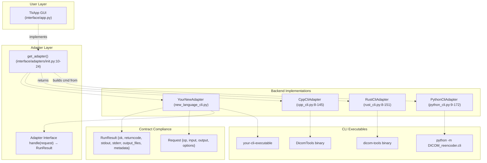
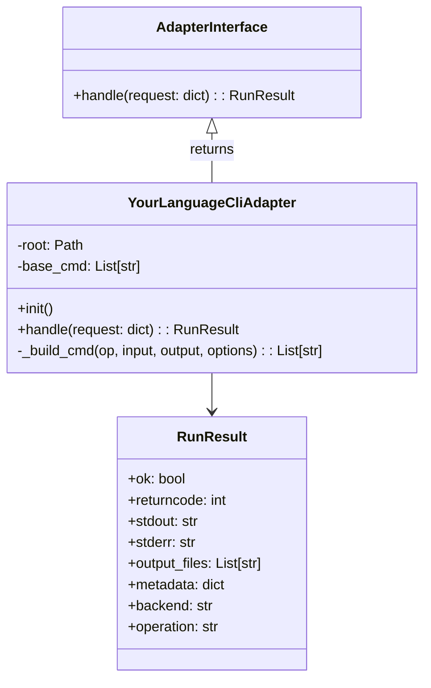
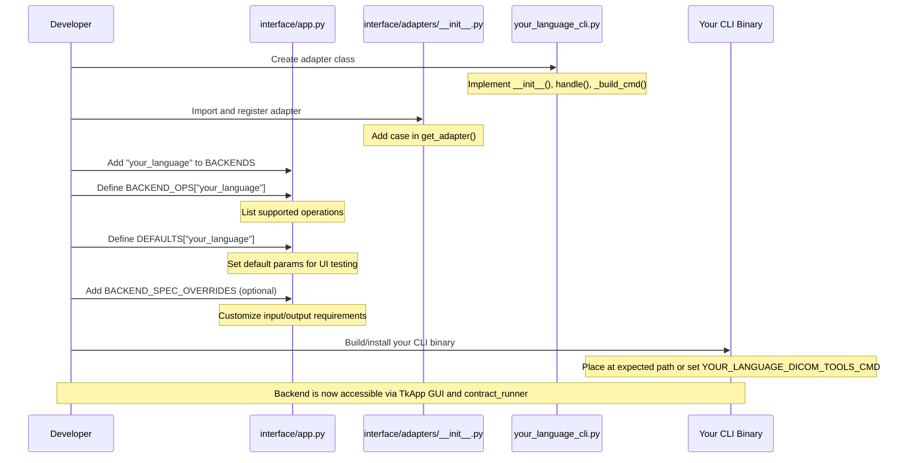

# Adding a New Backend

> **Relevant source files**
> * [interface/CONTRACT.md](https://github.com/ThalesMMS/Dicom-Tools/blob/c7b4cbd8/interface/CONTRACT.md)
> * [interface/adapters/__init__.py](https://github.com/ThalesMMS/Dicom-Tools/blob/c7b4cbd8/interface/adapters/__init__.py)
> * [interface/adapters/cpp_cli.py](https://github.com/ThalesMMS/Dicom-Tools/blob/c7b4cbd8/interface/adapters/cpp_cli.py)
> * [interface/adapters/csharp_cli.py](https://github.com/ThalesMMS/Dicom-Tools/blob/c7b4cbd8/interface/adapters/csharp_cli.py)
> * [interface/adapters/java_cli.py](https://github.com/ThalesMMS/Dicom-Tools/blob/c7b4cbd8/interface/adapters/java_cli.py)
> * [interface/adapters/js_cli.py](https://github.com/ThalesMMS/Dicom-Tools/blob/c7b4cbd8/interface/adapters/js_cli.py)
> * [interface/adapters/python_cli.py](https://github.com/ThalesMMS/Dicom-Tools/blob/c7b4cbd8/interface/adapters/python_cli.py)
> * [interface/adapters/rust_cli.py](https://github.com/ThalesMMS/Dicom-Tools/blob/c7b4cbd8/interface/adapters/rust_cli.py)
> * [interface/app.py](https://github.com/ThalesMMS/Dicom-Tools/blob/c7b4cbd8/interface/app.py)
> * [interface/tests/test_operation_specs.py](https://github.com/ThalesMMS/Dicom-Tools/blob/c7b4cbd8/interface/tests/test_operation_specs.py)

This guide explains how to add a new language backend to the Dicom-Tools system. A backend is a language-specific implementation (e.g., Python, Rust, C++) that exposes DICOM operations through a standardized CLI contract.

For information about the CLI contract specification itself, see [CLI Contract System](3%20CLI-Contract-System.md). For details on how adapters translate requests, see [Adapter Pattern](3b%20Adapter-Pattern.md). For adding new operations to existing backends, see [Adding a New Operation](8d%20Adding-a-New-Operation.md).

---

## Overview

Adding a new backend involves four main components:

| Component | Purpose | Artifacts |
| --- | --- | --- |
| **CLI Implementation** | Language-specific executable that processes DICOM operations | Binary, jar, or script that accepts contract-compliant arguments |
| **Adapter Class** | Python class that translates contract requests into CLI invocations | `interface/adapters/<language>_cli.py` |
| **Backend Registration** | UI configuration declaring supported operations | Updates to `BACKENDS`, `BACKEND_OPS`, `DEFAULTS` in `interface/app.py` |
| **Integration Tests** | Validation that the backend conforms to contract expectations | Tests in `interface/tests/` |

**Sources:** [interface/CONTRACT.md L1-L112](https://github.com/ThalesMMS/Dicom-Tools/blob/c7b4cbd8/interface/CONTRACT.md#L1-L112)

 [interface/adapters/__init__.py L1-L25](https://github.com/ThalesMMS/Dicom-Tools/blob/c7b4cbd8/interface/adapters/__init__.py#L1-L25)

 [interface/app.py L9-L129](https://github.com/ThalesMMS/Dicom-Tools/blob/c7b4cbd8/interface/app.py#L9-L129)

---

## Architecture: Backend Integration Points



**Sources:** [interface/adapters/__init__.py L1-L25](https://github.com/ThalesMMS/Dicom-Tools/blob/c7b4cbd8/interface/adapters/__init__.py#L1-L25)

 [interface/app.py L1-L805](https://github.com/ThalesMMS/Dicom-Tools/blob/c7b4cbd8/interface/app.py#L1-L805)

---

## Step 1: Implement the CLI Contract

Your backend must accept requests in the contract format and return responses accordingly.

### Request Format

The CLI must accept these arguments:

```html
your-cli-executable <op> <input> [--output <path>] [--options <json>]
```

Or via a JSON request file:

```
your-cli-executable --request request.json
```

### Response Format

The CLI should output JSON to `stdout`:

```
{  "ok": true,  "returncode": 0,  "stdout": "operation output",  "stderr": "warnings or errors",  "output_files": ["/path/to/generated/file.dcm"],  "metadata": { "PatientName": "ANONYMIZED", ... }}
```

For operations that don't naturally produce JSON (like `dump`), outputting plain text to `stdout` is acceptable. The adapter will wrap it in a `RunResult`.

**Sources:** [interface/CONTRACT.md L5-L27](https://github.com/ThalesMMS/Dicom-Tools/blob/c7b4cbd8/interface/CONTRACT.md#L5-L27)

### Canonical Operations

Your backend should implement a subset of these operations:

| Operation | Required | Purpose |
| --- | --- | --- |
| `info` | **Yes** | Extract DICOM metadata |
| `anonymize` | **Yes** | Remove PHI from DICOM file |
| `to_image` | **Yes** | Export frame to PNG/JPEG |
| `transcode` | **Yes** | Change transfer syntax |
| `validate` | **Yes** | Basic DICOM validation |
| `echo` | No | C-ECHO network test |
| `stats` | No | Pixel statistics/histogram |
| `dump` | No | Full dataset dump |

Additional operations like `volume`, `nifti`, network operations (`store_scu`, `worklist`), and DICOMweb (`qido`, `stow`, `wado`) are optional but enhance functionality.

**Sources:** [interface/CONTRACT.md L28-L75](https://github.com/ThalesMMS/Dicom-Tools/blob/c7b4cbd8/interface/CONTRACT.md#L28-L75)

 [interface/app.py L16-L129](https://github.com/ThalesMMS/Dicom-Tools/blob/c7b4cbd8/interface/app.py#L16-L129)

### Environment Variable Configuration

Define an environment variable for your CLI path:

```
YOUR_LANGUAGE_DICOM_TOOLS_CMD=/path/to/your/cli
```

This allows users to override the default location.

**Sources:** [interface/CONTRACT.md L84-L89](https://github.com/ThalesMMS/Dicom-Tools/blob/c7b4cbd8/interface/CONTRACT.md#L84-L89)

 [interface/adapters/python_cli.py L15-L16](https://github.com/ThalesMMS/Dicom-Tools/blob/c7b4cbd8/interface/adapters/python_cli.py#L15-L16)

 [interface/adapters/rust_cli.py L14-L26](https://github.com/ThalesMMS/Dicom-Tools/blob/c7b4cbd8/interface/adapters/rust_cli.py#L14-L26)

---

## Step 2: Create the Adapter Class

Create `interface/adapters/your_language_cli.py`:



**Sources:** [interface/adapters/python_cli.py L9-L172](https://github.com/ThalesMMS/Dicom-Tools/blob/c7b4cbd8/interface/adapters/python_cli.py#L9-L172)

 [interface/adapters/rust_cli.py L8-L151](https://github.com/ThalesMMS/Dicom-Tools/blob/c7b4cbd8/interface/adapters/rust_cli.py#L8-L151)

 [interface/adapters/cpp_cli.py L8-L145](https://github.com/ThalesMMS/Dicom-Tools/blob/c7b4cbd8/interface/adapters/cpp_cli.py#L8-L145)

### Adapter Implementation Pattern

Reference implementation structure from existing adapters:

```css
class YourLanguageCliAdapter:    def __init__(self) -> None:        # 1. Find repository root        self.root = Path(__file__).resolve().parents[2]                # 2. Resolve CLI command from environment or default        env_cmd = os.environ.get("YOUR_LANGUAGE_DICOM_TOOLS_CMD")        if env_cmd:            self.base_cmd = split_cmd(env_cmd)        else:            default_path = self.root / "your_language" / "bin" / "cli"            self.base_cmd = [str(default_path)]        def handle(self, request: Dict[str, Any]) -> RunResult:        # 3. Extract request fields        op = request.get("op")        input_path = request.get("input")        output = request.get("output")        options = request.get("options", {}) or {}                # 4. Validate required fields        requires_input = op not in {"echo", "custom"}        if not op or (requires_input and not input_path):            return RunResult(False, 1, "", "op e input são obrigatórios", [], None)                # 5. Build CLI command        cmd = self._build_cmd(op, input_path, output, options)        if cmd is None:            return RunResult(False, 1, "", f"unsupported operation: {op}", [], None)                # 6. Execute subprocess        result = run_process(cmd, cwd=self.root / "your_language")                # 7. Parse metadata if JSON output        meta = parse_json_maybe(result.stdout)        result.metadata = meta                # 8. Set backend identification        result.backend = "your_language"        result.operation = op                # 9. Track output files        if output:            result.output_files.append(str(Path(output)))                return result
```

**Sources:** [interface/adapters/python_cli.py L9-L43](https://github.com/ThalesMMS/Dicom-Tools/blob/c7b4cbd8/interface/adapters/python_cli.py#L9-L43)

 [interface/adapters/rust_cli.py L8-L50](https://github.com/ThalesMMS/Dicom-Tools/blob/c7b4cbd8/interface/adapters/rust_cli.py#L8-L50)

 [interface/adapters/csharp_cli.py L8-L67](https://github.com/ThalesMMS/Dicom-Tools/blob/c7b4cbd8/interface/adapters/csharp_cli.py#L8-L67)

### The _build_cmd Method

This method translates operations into CLI arguments. Example patterns:

```css
def _build_cmd(self, op: str, input_path: str, output: str | None,                options: Dict[str, Any]) -> List[str] | None:        # Operation: info    if op == "info":        cmd = [*self.base_cmd, "info", input_path]        if options.get("json"):            cmd.append("--json")        return cmd        # Operation: anonymize (infer output if not provided)    if op == "anonymize":        inferred_output = output or str(Path(input_path).with_name(            f"{Path(input_path).stem}_anon.dcm"        ))        return [*self.base_cmd, "anonymize", input_path, "--output", inferred_output]        # Operation: to_image (with options)    if op == "to_image":        inferred_output = output or str(Path(input_path).with_suffix(".png"))        cmd = [*self.base_cmd, "to-image", input_path, "--output", inferred_output]        if options.get("format"):            cmd.extend(["--format", str(options["format"])])        if options.get("frame") is not None:            cmd.extend(["--frame", str(options["frame"])])        return cmd        # Operation: echo (no input required)    if op == "echo":        host = options.get("host", "127.0.0.1")        port = options.get("port", 104)        return [*self.base_cmd, "echo", f"{host}:{port}"]        # Unsupported operation    return None
```

**Sources:** [interface/adapters/python_cli.py L45-L172](https://github.com/ThalesMMS/Dicom-Tools/blob/c7b4cbd8/interface/adapters/python_cli.py#L45-L172)

 [interface/adapters/rust_cli.py L52-L151](https://github.com/ThalesMMS/Dicom-Tools/blob/c7b4cbd8/interface/adapters/rust_cli.py#L52-L151)

 [interface/adapters/java_cli.py L47-L167](https://github.com/ThalesMMS/Dicom-Tools/blob/c7b4cbd8/interface/adapters/java_cli.py#L47-L167)

### Utility Functions

Use these helper functions from `interface/adapters/runner.py`:

| Function | Purpose | Usage |
| --- | --- | --- |
| `run_process(cmd, cwd)` | Execute subprocess and capture output | Returns `RunResult` with stdout/stderr |
| `parse_json_maybe(text)` | Try to parse JSON, return `None` if invalid | Extract metadata from CLI output |
| `split_cmd(cmd_str)` | Split command string respecting quotes | Parse environment variable commands |
| `ensure_dir(path)` | Create directory if it doesn't exist | Prepare output directories |

**Sources:** [interface/adapters/python_cli.py L1-L7](https://github.com/ThalesMMS/Dicom-Tools/blob/c7b4cbd8/interface/adapters/python_cli.py#L1-L7)

 [interface/adapters/rust_cli.py L1-L6](https://github.com/ThalesMMS/Dicom-Tools/blob/c7b4cbd8/interface/adapters/rust_cli.py#L1-L6)

---

## Step 3: Register the Backend

Update `interface/adapters/__init__.py` to include your adapter:

```css
from .your_language_cli import YourLanguageCliAdapterdef get_adapter(backend: str):    backend = backend.lower()    # ... existing backends ...    if backend in {"your_language", "yourlang"}:        return YourLanguageCliAdapter()    raise ValueError(f"Backend não suportado: {backend}")
```

**Sources:** [interface/adapters/__init__.py L1-L25](https://github.com/ThalesMMS/Dicom-Tools/blob/c7b4cbd8/interface/adapters/__init__.py#L1-L25)

Update `interface/app.py` to register operations:

### 3.1: Add Backend to BACKENDS List

```
BACKENDS = ["python", "rust", "cpp", "java", "csharp", "js", "your_language"]
```

**Sources:** [interface/app.py L9](https://github.com/ThalesMMS/Dicom-Tools/blob/c7b4cbd8/interface/app.py#L9-L9)

### 3.2: Define Supported Operations

```css
BACKEND_OPS = {    # ... existing backends ...    "your_language": [        "info",        "anonymize",        "to_image",        "transcode",        "validate",        "echo",        "stats",        "dump",        # Add other operations your backend supports    ],}
```

**Sources:** [interface/app.py L17-L129](https://github.com/ThalesMMS/Dicom-Tools/blob/c7b4cbd8/interface/app.py#L17-L129)

### 3.3: Configure Default Parameters

```css
DEFAULTS = {    # ... existing backends ...    "your_language": {        "info": {"input": DEFAULT_FILE, "options": {"json": True}},        "anonymize": {"input": DEFAULT_FILE, "output": OUTPUT_DIR / "yourlang_anon.dcm"},        "to_image": {            "input": DEFAULT_FILE,             "output": OUTPUT_DIR / "yourlang.png",            "options": {"format": "png", "frame": 0}        },        # ... other operations ...    },}
```

**Sources:** [interface/app.py L330-L466](https://github.com/ThalesMMS/Dicom-Tools/blob/c7b4cbd8/interface/app.py#L330-L466)

### 3.4: Configure Operation Specifications (Optional)

If your backend has unique input/output requirements or options, add overrides:

```css
BACKEND_SPEC_OVERRIDES = {    # ... existing backends ...    "your_language": {        "dump": {            "option_keys": ["max_depth", "format"],            "description": "Custom dump with special formatting."        },        "stats": {            "option_keys": ["bins", "percentiles"],            "has_options": True        },    },}
```

**Sources:** [interface/app.py L699-L767](https://github.com/ThalesMMS/Dicom-Tools/blob/c7b4cbd8/interface/app.py#L699-L767)

---

## Step 4: Backend Registration Flow



**Sources:** [interface/app.py L9-L767](https://github.com/ThalesMMS/Dicom-Tools/blob/c7b4cbd8/interface/app.py#L9-L767)

 [interface/adapters/__init__.py L1-L25](https://github.com/ThalesMMS/Dicom-Tools/blob/c7b4cbd8/interface/adapters/__init__.py#L1-L25)

---

## Step 5: Testing Requirements

### 5.1: Unit Tests for Adapter

Create `interface/tests/test_your_language_adapter.py`:

```css
import pytestfrom interface.adapters import get_adapterdef test_adapter_registration():    """Verify adapter can be retrieved."""    adapter = get_adapter("your_language")    assert adapter is not None    assert hasattr(adapter, "handle")def test_info_command_builds_correctly():    """Test command construction for info operation."""    adapter = get_adapter("your_language")    request = {        "op": "info",        "input": "/path/to/test.dcm",        "options": {"json": True}    }    # Mock or actually test command building    # Verify adapter._build_cmd returns expected command
```

**Sources:** [interface/tests/test_operation_specs.py L1-L56](https://github.com/ThalesMMS/Dicom-Tools/blob/c7b4cbd8/interface/tests/test_operation_specs.py#L1-L56)

### 5.2: Integration Tests

Add tests that verify contract compliance:

```
def test_your_language_info_returns_metadata():    """Verify info operation returns structured metadata."""    adapter = get_adapter("your_language")    result = adapter.handle({        "op": "info",        "input": "sample_series/IM-0001-0001.dcm",        "options": {"json": True}    })        assert result.ok is True    assert result.returncode == 0    assert result.metadata is not None    assert "PatientID" in result.metadata or "PatientName" in result.metadatadef test_your_language_anonymize_produces_output():    """Verify anonymize creates output file."""    adapter = get_adapter("your_language")    output_path = "output/test_anon.dcm"    result = adapter.handle({        "op": "anonymize",        "input": "sample_series/IM-0001-0001.dcm",        "output": output_path    })        assert result.ok is True    assert output_path in result.output_files    assert Path(output_path).exists()
```

### 5.3: Contract Compliance Tests

The repository includes cross-language integration tests in `interface/tests/` that validate all backends conform to the contract. Your backend should pass these tests.

**Sources:** [interface/tests/test_operation_specs.py L1-L56](https://github.com/ThalesMMS/Dicom-Tools/blob/c7b4cbd8/interface/tests/test_operation_specs.py#L1-L56)

---

## Step 6: Build System Integration

### 6.1: Add Build Instructions to scripts/setup_all.sh

```
# Your Language Backendecho "Building Your Language backend..."cd your_language/./build.sh || echo "Your Language build failed"cd ..
```

### 6.2: Environment Variable Documentation

Update `README.md` or setup documentation to include:

```
### Environment Variables- `YOUR_LANGUAGE_DICOM_TOOLS_CMD`: Path to your CLI executable  - Default: `your_language/bin/your-cli`  - Example: `YOUR_LANGUAGE_DICOM_TOOLS_CMD=/usr/local/bin/your-cli`
```

**Sources:** [interface/CONTRACT.md L84-L89](https://github.com/ThalesMMS/Dicom-Tools/blob/c7b4cbd8/interface/CONTRACT.md#L84-L89)

---

## Common Implementation Patterns

### Pattern 1: Binary Lookup with Fallback

```
def __init__(self) -> None:    self.root = Path(__file__).resolve().parents[2]    env_cmd = os.environ.get("YOUR_LANGUAGE_DICOM_TOOLS_CMD")        if env_cmd:        self.base_cmd = split_cmd(env_cmd)    else:        # Try multiple candidate paths        candidates = [            self.root / "your_language" / "bin" / "Release" / "cli",            self.root / "your_language" / "bin" / "Debug" / "cli",            self.root / "your_language" / "target" / "release" / "cli",        ]                for path in candidates:            if path.exists():                self.base_cmd = [str(path)]                return                # Fallback to system PATH        self.base_cmd = ["your-cli"]
```

**Sources:** [interface/adapters/csharp_cli.py L11-L29](https://github.com/ThalesMMS/Dicom-Tools/blob/c7b4cbd8/interface/adapters/csharp_cli.py#L11-L29)

 [interface/adapters/rust_cli.py L11-L26](https://github.com/ThalesMMS/Dicom-Tools/blob/c7b4cbd8/interface/adapters/rust_cli.py#L11-L26)

### Pattern 2: Operation Without Input

```css
if op == "echo":    host = options.get("host", "127.0.0.1")    port = options.get("port", 104)    return [*self.base_cmd, "echo", f"{host}:{port}"]if op == "worklist":    # Network operations don't require input file    host = options.get("host", "127.0.0.1")    port = options.get("port", 11112)    patient = options.get("patient")    cmd = [*self.base_cmd, "worklist", "--host", host, "--port", str(port)]    if patient:        cmd.extend(["--patient", patient])    return cmd
```

**Sources:** [interface/adapters/python_cli.py L72-L91](https://github.com/ThalesMMS/Dicom-Tools/blob/c7b4cbd8/interface/adapters/python_cli.py#L72-L91)

 [interface/adapters/csharp_cli.py L91-L134](https://github.com/ThalesMMS/Dicom-Tools/blob/c7b4cbd8/interface/adapters/csharp_cli.py#L91-L134)

### Pattern 3: Directory-Based Operations

```
if op == "volume":    # Input is a directory, output is a file    inferred_output = output or str(self.root / "output" / "volume.npy")    meta_path = str(Path(inferred_output).with_suffix(".json"))    cmd = [        *self.base_cmd, "volume",         input_path,  # directory path        "--output", inferred_output,        "--metadata", meta_path    ]    if options.get("preview"):        cmd.append("--preview")    return cmd
```

**Sources:** [interface/adapters/python_cli.py L93-L99](https://github.com/ThalesMMS/Dicom-Tools/blob/c7b4cbd8/interface/adapters/python_cli.py#L93-L99)

### Pattern 4: Test Operation Execution

```css
# Test operations map to test executablestest_map = {    "test_parser": "YourTestSuite.ParserTests",    "test_validation": "YourTestSuite.ValidationTests",    "run_all_tests": "YourTestSuite",}if op in test_map:    test_class = test_map[op]    # For .NET/Java: delegate to test runner    return ["dotnet", "test", f"--filter", f"ClassName={test_class}"]    # Or for native: execute test binary    # return [str(self.root / "your_language" / "tests" / test_map[op])]if op == "run_all_tests":    return ["your-test-runner", "run", "--all"]
```

**Sources:** [interface/adapters/csharp_cli.py L157-L173](https://github.com/ThalesMMS/Dicom-Tools/blob/c7b4cbd8/interface/adapters/csharp_cli.py#L157-L173)

 [interface/adapters/java_cli.py L147-L159](https://github.com/ThalesMMS/Dicom-Tools/blob/c7b4cbd8/interface/adapters/java_cli.py#L147-L159)

---

## Validation Checklist

Before submitting your backend implementation:

* **CLI Contract Compliance** * Accepts `--op`, `--input`, `--output`, `--options` arguments * Returns JSON response with `ok`, `returncode`, `stdout`, `stderr`, `output_files` * Supports at minimum: `info`, `anonymize`, `to_image`, `transcode`, `validate`
* **Adapter Implementation** * `__init__()` resolves CLI path from environment or default * `handle()` validates request and returns `RunResult` * `_build_cmd()` translates all supported operations correctly * Metadata extraction via `parse_json_maybe()` when applicable
* **Registration** * Added to `BACKENDS` list in `interface/app.py` * Operations declared in `BACKEND_OPS` * Defaults configured in `DEFAULTS` * Adapter registered in `interface/adapters/__init__.py`
* **Testing** * Unit tests for adapter command building * Integration tests with sample DICOM files * All tests pass in CI pipeline
* **Documentation** * Environment variable documented * Build/installation instructions added * Supported operations listed in README

**Sources:** [interface/CONTRACT.md L1-L112](https://github.com/ThalesMMS/Dicom-Tools/blob/c7b4cbd8/interface/CONTRACT.md#L1-L112)

 [interface/app.py L9-L767](https://github.com/ThalesMMS/Dicom-Tools/blob/c7b4cbd8/interface/app.py#L9-L767)

 [interface/adapters/__init__.py L1-L25](https://github.com/ThalesMMS/Dicom-Tools/blob/c7b4cbd8/interface/adapters/__init__.py#L1-L25)

---

## Example: Minimal Backend Implementation

Here's a complete minimal example for a hypothetical "Go" backend:

### File: interface/adapters/go_cli.py

```css
import osfrom pathlib import Pathfrom typing import Any, Dict, Listfrom .runner import RunResult, parse_json_maybe, run_process, split_cmdclass GoCliAdapter:    def __init__(self) -> None:        self.root = Path(__file__).resolve().parents[2]        env_cmd = os.environ.get("GO_DICOM_TOOLS_CMD")        if env_cmd:            self.base_cmd = split_cmd(env_cmd)        else:            default_bin = self.root / "go" / "bin" / "dicom-tools"            self.base_cmd = [str(default_bin)]    def handle(self, request: Dict[str, Any]) -> RunResult:        op = request.get("op")        input_path = request.get("input")        output = request.get("output")        options = request.get("options", {}) or {}        if not op or not input_path:            return RunResult(False, 1, "", "op and input required", [], None)        cmd = self._build_cmd(op, input_path, output, options)        if cmd is None:            return RunResult(False, 1, "", f"unsupported op: {op}", [], None)        result = run_process(cmd, cwd=self.root / "go")        result.metadata = parse_json_maybe(result.stdout)        result.backend = "go"        result.operation = op        if output:            result.output_files.append(str(output))        return result    def _build_cmd(self, op: str, input_path: str, output: str | None,                   options: Dict[str, Any]) -> List[str] | None:        if op == "info":            return [*self.base_cmd, "info", input_path, "--json"]        if op == "anonymize":            out = output or str(Path(input_path).with_name("anon.dcm"))            return [*self.base_cmd, "anonymize", input_path, "-o", out]        # ... other operations ...        return None
```

### File: interface/adapters/__init__.py (updated)

```css
from .go_cli import GoCliAdapterdef get_adapter(backend: str):    # ... existing cases ...    if backend == "go":        return GoCliAdapter()    raise ValueError(f"Backend não suportado: {backend}")
```

### File: interface/app.py (updated)

```css
BACKENDS = ["python", "rust", "cpp", "java", "csharp", "js", "go"]BACKEND_OPS = {    # ... existing backends ...    "go": ["info", "anonymize", "to_image", "transcode", "validate"],}DEFAULTS = {    # ... existing backends ...    "go": {        "info": {"input": DEFAULT_FILE, "options": {"json": True}},        "anonymize": {"input": DEFAULT_FILE, "output": OUTPUT_DIR / "go_anon.dcm"},    },}
```

**Sources:** [interface/adapters/python_cli.py L9-L172](https://github.com/ThalesMMS/Dicom-Tools/blob/c7b4cbd8/interface/adapters/python_cli.py#L9-L172)

 [interface/adapters/__init__.py L1-L25](https://github.com/ThalesMMS/Dicom-Tools/blob/c7b4cbd8/interface/adapters/__init__.py#L1-L25)

 [interface/app.py L9-L466](https://github.com/ThalesMMS/Dicom-Tools/blob/c7b4cbd8/interface/app.py#L9-L466)

---

## Summary

Adding a new backend requires:

1. **CLI Implementation**: Build a contract-compliant executable in your target language
2. **Adapter Creation**: Implement `YourLanguageCliAdapter` with `handle()` and `_build_cmd()`
3. **Registration**: Update `BACKENDS`, `BACKEND_OPS`, `DEFAULTS`, and `get_adapter()`
4. **Testing**: Write unit and integration tests to verify contract compliance
5. **Documentation**: Update environment variables and build instructions

The adapter pattern ensures the UI remains language-agnostic while each backend can leverage its ecosystem's strengths. Follow the patterns established by existing adapters for consistency.

**Sources:** [interface/CONTRACT.md L1-L112](https://github.com/ThalesMMS/Dicom-Tools/blob/c7b4cbd8/interface/CONTRACT.md#L1-L112)

 [interface/adapters/__init__.py L1-L25](https://github.com/ThalesMMS/Dicom-Tools/blob/c7b4cbd8/interface/adapters/__init__.py#L1-L25)

 [interface/app.py L1-L805](https://github.com/ThalesMMS/Dicom-Tools/blob/c7b4cbd8/interface/app.py#L1-L805)


### On this page

* [Adding a New Backend](#8.3-adding-a-new-backend)
* [Overview](#8.3-overview)
* [Architecture: Backend Integration Points](#8.3-architecture-backend-integration-points)
* [Step 1: Implement the CLI Contract](#8.3-step-1-implement-the-cli-contract)
* [Request Format](#8.3-request-format)
* [Response Format](#8.3-response-format)
* [Canonical Operations](#8.3-canonical-operations)
* [Environment Variable Configuration](#8.3-environment-variable-configuration)
* [Step 2: Create the Adapter Class](#8.3-step-2-create-the-adapter-class)
* [Adapter Implementation Pattern](#8.3-adapter-implementation-pattern)
* [The _build_cmd Method](#8.3-the-object-object-method)
* [Utility Functions](#8.3-utility-functions)
* [Step 3: Register the Backend](#8.3-step-3-register-the-backend)
* [3.1: Add Backend to BACKENDS List](#8.3-31-add-backend-to-backends-list)
* [3.2: Define Supported Operations](#8.3-32-define-supported-operations)
* [3.3: Configure Default Parameters](#8.3-33-configure-default-parameters)
* [3.4: Configure Operation Specifications (Optional)](#8.3-34-configure-operation-specifications-optional)
* [Step 4: Backend Registration Flow](#8.3-step-4-backend-registration-flow)
* [Step 5: Testing Requirements](#8.3-step-5-testing-requirements)
* [5.1: Unit Tests for Adapter](#8.3-51-unit-tests-for-adapter)
* [5.2: Integration Tests](#8.3-52-integration-tests)
* [5.3: Contract Compliance Tests](#8.3-53-contract-compliance-tests)
* [Step 6: Build System Integration](#8.3-step-6-build-system-integration)
* [6.1: Add Build Instructions to scripts/setup_all.sh](#8.3-61-add-build-instructions-to-object-object)
* [6.2: Environment Variable Documentation](#8.3-62-environment-variable-documentation)
* [Common Implementation Patterns](#8.3-common-implementation-patterns)
* [Pattern 1: Binary Lookup with Fallback](#8.3-pattern-1-binary-lookup-with-fallback)
* [Pattern 2: Operation Without Input](#8.3-pattern-2-operation-without-input)
* [Pattern 3: Directory-Based Operations](#8.3-pattern-3-directory-based-operations)
* [Pattern 4: Test Operation Execution](#8.3-pattern-4-test-operation-execution)
* [Validation Checklist](#8.3-validation-checklist)
* [Example: Minimal Backend Implementation](#8.3-example-minimal-backend-implementation)
* [File: interface/adapters/go_cli.py](#8.3-file-object-object)
* [File: interface/adapters/__init__.py (updated)](#8.3-file-object-object-updated)
* [File: interface/app.py (updated)](#8.3-file-object-object-updated-1)
* [Summary](#8.3-summary)

Ask Devin about Dicom-Tools