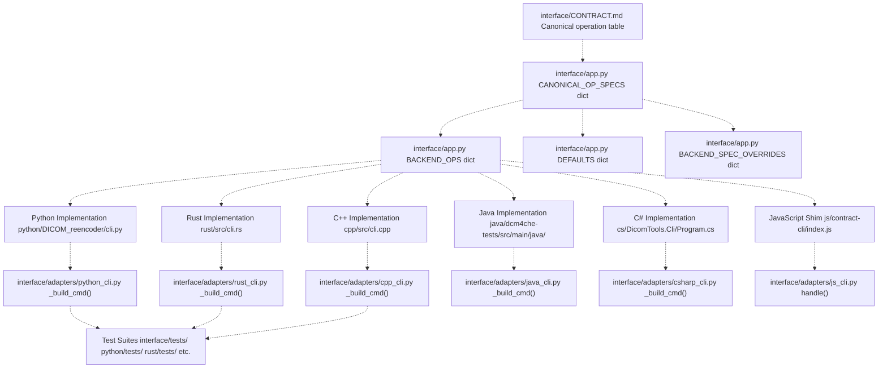
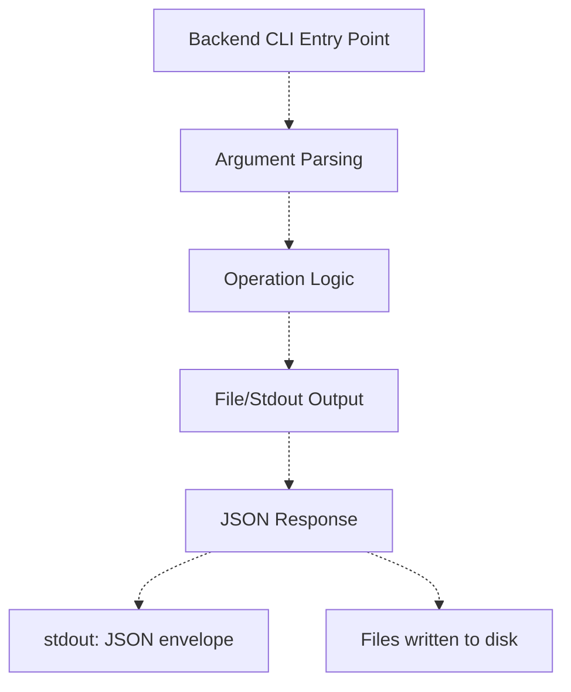
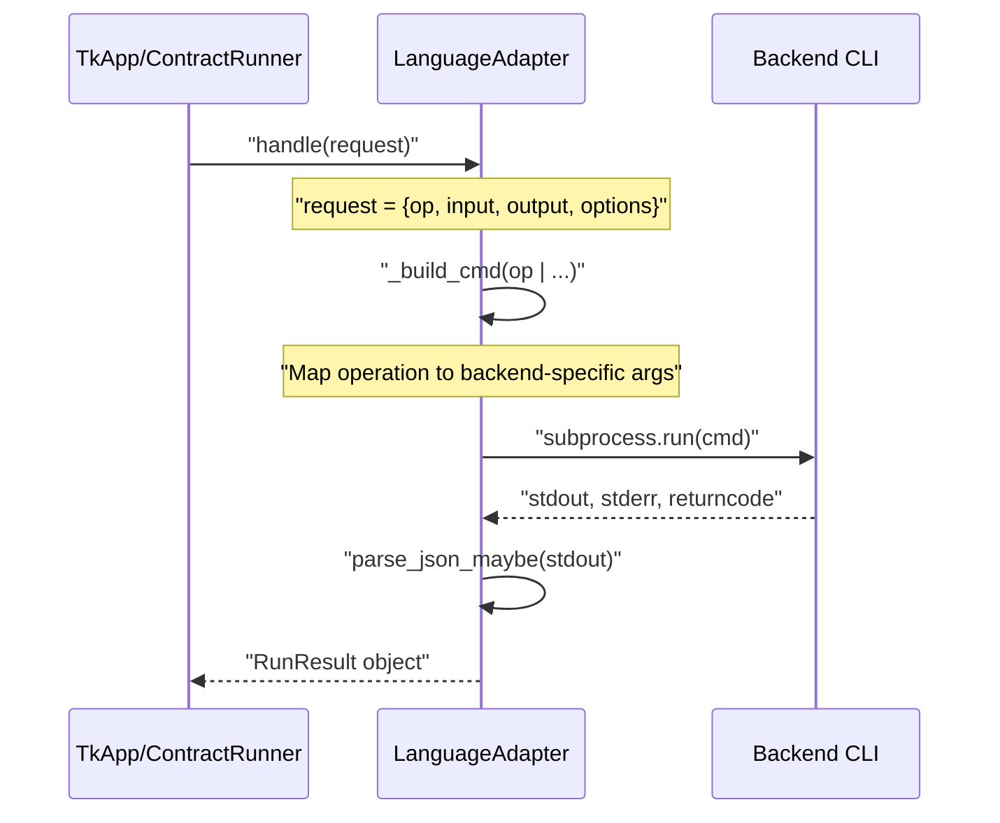
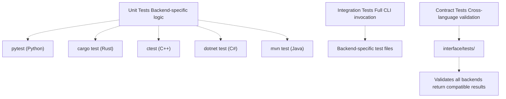
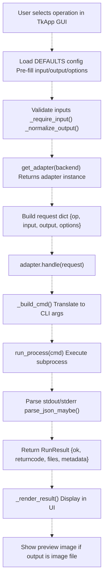

# Adding a New Operation

> **Relevant source files**
> * [interface/CONTRACT.md](https://github.com/ThalesMMS/Dicom-Tools/blob/c7b4cbd8/interface/CONTRACT.md)
> * [interface/adapters/__init__.py](https://github.com/ThalesMMS/Dicom-Tools/blob/c7b4cbd8/interface/adapters/__init__.py)
> * [interface/adapters/cpp_cli.py](https://github.com/ThalesMMS/Dicom-Tools/blob/c7b4cbd8/interface/adapters/cpp_cli.py)
> * [interface/adapters/js_cli.py](https://github.com/ThalesMMS/Dicom-Tools/blob/c7b4cbd8/interface/adapters/js_cli.py)
> * [interface/adapters/python_cli.py](https://github.com/ThalesMMS/Dicom-Tools/blob/c7b4cbd8/interface/adapters/python_cli.py)
> * [interface/app.py](https://github.com/ThalesMMS/Dicom-Tools/blob/c7b4cbd8/interface/app.py)

## Purpose and Scope

This page explains how to add a new DICOM operation to the Dicom-Tools repository. An "operation" is a canonical command (e.g., `info`, `anonymize`, `to_image`) that can be invoked through the unified interface and executed by one or more language backends.

Adding a new operation requires modifications across multiple layers:

* The **CLI Contract** specification
* The **UI configuration** (TkApp)
* **Backend implementations** (Python, Rust, C++, Java, C#, JavaScript)
* **Adapter translation** logic
* **Test suites**

For information about implementing a completely new language backend, see [Adding a New Backend](#8.3). For details on the contract system itself, see [CLI Contract System](#3) and [Contract Specification](#3.1).

---

## Overview of Required Changes

Adding a new operation touches several key components in the codebase. The following diagram shows the files and data structures that must be modified:



**Sources:** [interface/CONTRACT.md L1-L112](https://github.com/ThalesMMS/Dicom-Tools/blob/c7b4cbd8/interface/CONTRACT.md#L1-L112)

 [interface/app.py L1-L1500](https://github.com/ThalesMMS/Dicom-Tools/blob/c7b4cbd8/interface/app.py#L1-L1500)

 [interface/adapters/__init__.py L1-L25](https://github.com/ThalesMMS/Dicom-Tools/blob/c7b4cbd8/interface/adapters/__init__.py#L1-L25)

---

## Step 1: Define Operation Contract

The first step is to add the operation to the canonical contract specification. This establishes the operation's name, parameters, and expected behavior across all backends.

### Update CONTRACT.md

Add a row to the operations table in `interface/CONTRACT.md`:

| Field | Description |
| --- | --- |
| `op` | The canonical operation name (lowercase, underscore-separated) |
| `Descrição` | Brief description of what the operation does |
| `Parâmetros esperados` | Input requirements: `input`, `output`, `options` fields |
| `Saídas esperadas` | What the operation produces: files, stdout, metadata |

**Example entry for a hypothetical `pixel_shift` operation:**

```
| pixel_shift | Apply pixel intensity shift | `input`, `output`, `options.shift_value` | Modified DICOM in `output_files` |
```

### Update CANONICAL_OP_SPECS

Add the operation specification to [interface/app.py L548-L697](https://github.com/ThalesMMS/Dicom-Tools/blob/c7b4cbd8/interface/app.py#L548-L697)

:

```css
CANONICAL_OP_SPECS = {    # ... existing operations ...    "pixel_shift": {        "input": "file",        "output": "file",        "description": "Shift pixel intensities by a specified value.",        "option_keys": ["shift_value", "clamp"],        "has_options": True,    },}
```

**Key fields:**

* `input`: `"file"`, `"directory"`, `"none"`, or `"optional"`
* `output`: `"file"`, `"directory"`, `"display"`, or `"none"`
* `option_keys`: List of supported option parameter names
* `has_options`: Boolean indicating if options are supported
* `output_required`: Optional boolean (default `False`)

**Sources:** [interface/CONTRACT.md L28-L75](https://github.com/ThalesMMS/Dicom-Tools/blob/c7b4cbd8/interface/CONTRACT.md#L28-L75)

 [interface/app.py L548-L697](https://github.com/ThalesMMS/Dicom-Tools/blob/c7b4cbd8/interface/app.py#L548-L697)

---

## Step 2: Update UI Configuration

The TkApp GUI needs to know which backends support the operation and what default parameters to use.

### Update BACKEND_OPS

Add the operation to the list for each backend that will implement it in [interface/app.py L17-L129](https://github.com/ThalesMMS/Dicom-Tools/blob/c7b4cbd8/interface/app.py#L17-L129)

:

```css
BACKEND_OPS = {    "python": [        "info",        # ... existing ops ...        "pixel_shift",  # Add here if Python supports it    ],    "rust": [        "info",        # ... existing ops ...        "pixel_shift",  # Add here if Rust supports it    ],    # ... other backends ...}
```

### Add Default Recipes

Configure default values for the operation in [interface/app.py L330-L466](https://github.com/ThalesMMS/Dicom-Tools/blob/c7b4cbd8/interface/app.py#L330-L466)

:

```css
DEFAULTS = {    "python": {        # ... existing defaults ...        "pixel_shift": {            "input": DEFAULT_FILE,            "output": OUTPUT_DIR / "ui_python_shifted.dcm",            "options": {"shift_value": 100, "clamp": True}        },    },    "rust": {        # ... existing defaults ...        "pixel_shift": {            "input": DEFAULT_FILE,            "output": OUTPUT_DIR / "ui_rust_shifted.dcm",            "options": {"shift_value": 100}        },    },    # ... other backends ...}
```

### Add Backend-Specific Overrides (Optional)

If a backend has special behavior or different option keys, add to [interface/app.py L699-L767](https://github.com/ThalesMMS/Dicom-Tools/blob/c7b4cbd8/interface/app.py#L699-L767)

:

```css
BACKEND_SPEC_OVERRIDES = {    "cpp": {        "pixel_shift": {            "output": "directory",  # C++ backend writes to directory            "option_keys": ["shift"],  # Different option name            "description": "C++ implementation with directory output."        },    },    # ... other backend overrides ...}
```

**Sources:** [interface/app.py L17-L129](https://github.com/ThalesMMS/Dicom-Tools/blob/c7b4cbd8/interface/app.py#L17-L129)

 [interface/app.py L330-L466](https://github.com/ThalesMMS/Dicom-Tools/blob/c7b4cbd8/interface/app.py#L330-L466)

 [interface/app.py L699-L767](https://github.com/ThalesMMS/Dicom-Tools/blob/c7b4cbd8/interface/app.py#L699-L767)

---

## Step 3: Implement Backend CLI Commands

Each backend must implement the actual operation logic. The implementation varies by language but follows the same contract.

### Implementation Checklist



**Common patterns across backends:**

| Backend | Entry Point | Command Pattern |
| --- | --- | --- |
| Python | `python/DICOM_reencoder/cli.py` | Subcommand function |
| Rust | `rust/src/cli.rs` | `match` on operation name |
| C++ | `cpp/src/cli.cpp` | String comparison dispatch |
| Java | `java/.../Main.java` | Switch case |
| C# | `cs/DicomTools.Cli/Program.cs` | Switch expression |
| JavaScript | `js/contract-cli/index.js` | Delegates to Python |

### Python Implementation Example

Add a new subcommand or module to handle the operation:

```css
# In python/DICOM_reencoder/cli.py or new moduledef pixel_shift_command(input_path: str, output_path: str, shift_value: int, clamp: bool):    """Apply pixel intensity shift."""    ds = pydicom.dcmread(input_path)    pixels = ds.pixel_array        # Apply shift    shifted = pixels + shift_value    if clamp:        shifted = np.clip(shifted, 0, pixels.max())        ds.PixelData = shifted.tobytes()    ds.save_as(output_path)        return {"ok": True, "returncode": 0, "output_files": [output_path]}
```

Then register it in the CLI dispatcher.

### Rust Implementation Example

Add a new match arm in `rust/src/cli.rs`:

```javascript
match op.as_str() {    "info" => { /* ... */ }    "pixel_shift" => {        let shift_value = options.get("shift_value")            .and_then(|v| v.as_i64())            .unwrap_or(0);        pixel_shift::execute(input, output, shift_value)?;    }    // ... other operations}
```

**Sources:** Backend implementation files vary; see respective language directories.

---

## Step 4: Update Adapters

Adapters translate generic contract requests into backend-specific CLI invocations. Each adapter has a `_build_cmd()` or similar method that constructs the command-line arguments.

### Adapter Update Pattern

The following diagram shows how adapters translate operations:



### Python Adapter Update

In [interface/adapters/python_cli.py L45-L172](https://github.com/ThalesMMS/Dicom-Tools/blob/c7b4cbd8/interface/adapters/python_cli.py#L45-L172)

 add a new conditional block:

```
def _build_cmd(self, op: str, input_path: str, output: str | None, options: Dict[str, Any]) -> List[str] | None:    # ... existing operations ...        if op == "pixel_shift":        inferred_output = output or self._infer_output(input_path, suffix="_shifted.dcm")        cmd = [*self.base_cmd, "pixel_shift", input_path, "-o", inferred_output]        if options.get("shift_value") is not None:            cmd.extend(["--shift", str(options["shift_value"])])        if options.get("clamp"):            cmd.append("--clamp")        return cmd        return None
```

### Rust Adapter Update

In [interface/adapters/rust_cli.py](https://github.com/ThalesMMS/Dicom-Tools/blob/c7b4cbd8/interface/adapters/rust_cli.py)

 add similar logic:

```
def _build_cmd(self, op: str, input_path: str, output: str | None, options: Dict[str, Any]) -> List[str] | None:    # ... existing operations ...        if op == "pixel_shift":        cmd = [*self.base_cmd, "pixel-shift", input_path]        if output:            cmd.extend(["-o", output])        if options.get("shift_value") is not None:            cmd.extend(["--shift-value", str(options["shift_value"])])        return cmd        return None
```

### C++ Adapter Update

C++ operations often use a prefix pattern like `"gdcm:operation"` or `"vtk:operation"`. In [interface/adapters/cpp_cli.py L55-L144](https://github.com/ThalesMMS/Dicom-Tools/blob/c7b4cbd8/interface/adapters/cpp_cli.py#L55-L144)

:

```
def _build_cmd(self, op: str, input_path: str, output: str | None, options: Dict[str, Any]) -> tuple[List[str] | None, List[str]]:    output_dir = Path(output) if output else self.root / "cpp" / "output"    ensure_dir(output_dir)        if op == "pixel_shift":        cmd = [*self.base_cmd, "gdcm:pixel-shift", "-i", input_path, "-o", str(output_dir)]        if options.get("shift"):            cmd.extend(["--shift", str(options["shift"])])        return cmd, [str(output_dir / Path(input_path).name)]        # ... existing operations ...
```

**Note:** C++ operations typically output to a directory rather than a specific file.

**Sources:** [interface/adapters/python_cli.py L45-L172](https://github.com/ThalesMMS/Dicom-Tools/blob/c7b4cbd8/interface/adapters/python_cli.py#L45-L172)

 [interface/adapters/rust_cli.py](https://github.com/ThalesMMS/Dicom-Tools/blob/c7b4cbd8/interface/adapters/rust_cli.py)

 [interface/adapters/cpp_cli.py L55-L144](https://github.com/ThalesMMS/Dicom-Tools/blob/c7b4cbd8/interface/adapters/cpp_cli.py#L55-L144)

---

## Step 5: Add Test Suite Coverage

Adding tests ensures the operation works correctly across all supporting backends and maintains contract compliance.

### Test Types



### Python Tests

Add test cases to `python/tests/`:

```
def test_pixel_shift_command():    """Test pixel shift operation."""    from DICOM_reencoder.cli import pixel_shift_command        result = pixel_shift_command(        input_path="sample_series/IM-0001-0001.dcm",        output_path="output/test_shifted.dcm",        shift_value=100,        clamp=True    )        assert result["ok"] is True    assert Path(result["output_files"][0]).exists()
```

### Interface Contract Tests

Add cross-language validation to `interface/tests/`:

```
import pytestfrom interface.adapters import get_adapter@pytest.mark.parametrize("backend", ["python", "rust", "cpp"])def test_pixel_shift_contract(backend, sample_dicom):    """Test pixel_shift operation across backends."""    adapter = get_adapter(backend)        request = {        "op": "pixel_shift",        "input": str(sample_dicom),        "output": f"output/test_{backend}_shift.dcm",        "options": {"shift_value": 100}    }        result = adapter.handle(request)        assert result.ok is True    assert result.returncode == 0    assert len(result.output_files) > 0
```

### Test Data Requirements

Use the shared test data in `sample_series/`:

* [sample_series/](https://github.com/ThalesMMS/Dicom-Tools/blob/c7b4cbd8/sample_series/)  contains reference DICOM files
* All tests should use this shared data for consistency
* Tests should clean up generated files in `output/`

**Sources:** [interface/tests/](https://github.com/ThalesMMS/Dicom-Tools/blob/c7b4cbd8/interface/tests/)

 language-specific test directories

---

## Cross-Language Consistency

Maintaining consistency across backends is critical for the unified interface to work correctly.

### Consistency Checklist

| Aspect | Requirement | Validation |
| --- | --- | --- |
| Operation Name | Same across all backends | CLI contract test |
| Option Keys | Documented in CANONICAL_OP_SPECS | Type checking in adapters |
| Output Format | JSON envelope for metadata | `parse_json_maybe()` in adapters |
| Error Handling | Non-zero returncode on failure | Integration tests |
| File Paths | Absolute or relative to cwd | Path normalization in adapters |

### Response Format Compliance

All backends must return results in the standard envelope format:

```
{  "ok": true,  "returncode": 0,  "stdout": "Operation completed successfully",  "stderr": "",  "output_files": ["/path/to/output.dcm"],  "metadata": {    "optional": "structured data"  }}
```

This is enforced by:

* [interface/adapters/runner.py](https://github.com/ThalesMMS/Dicom-Tools/blob/c7b4cbd8/interface/adapters/runner.py)  - `RunResult` dataclass
* [interface/adapters/python_cli.py L32-L43](https://github.com/ThalesMMS/Dicom-Tools/blob/c7b4cbd8/interface/adapters/python_cli.py#L32-L43)  - Result parsing
* Contract tests in `interface/tests/`

### Partial Implementation Strategy

Not all backends need to implement every operation. The system handles partial coverage gracefully:

1. Only add the operation to `BACKEND_OPS` for supporting backends
2. The UI will only show the operation when a supporting backend is selected
3. Unsupported operations return an error from the adapter's `_build_cmd()` method
4. Document which backends support the operation in `CONTRACT.md`

**Example of partial support:**

```css
BACKEND_OPS = {    "python": ["info", "pixel_shift"],  # Supports pixel_shift    "rust": ["info", "pixel_shift"],    # Supports pixel_shift    "cpp": ["info"],                    # Does NOT support pixel_shift}
```

**Sources:** [interface/app.py L17-L129](https://github.com/ThalesMMS/Dicom-Tools/blob/c7b4cbd8/interface/app.py#L17-L129)

 [interface/CONTRACT.md L28-L75](https://github.com/ThalesMMS/Dicom-Tools/blob/c7b4cbd8/interface/CONTRACT.md#L28-L75)

---

## Complete Operation Flow

The following diagram shows the complete flow from user interaction to result display:



**Sources:** [interface/app.py L906-L1065](https://github.com/ThalesMMS/Dicom-Tools/blob/c7b4cbd8/interface/app.py#L906-L1065)

 [interface/adapters/runner.py](https://github.com/ThalesMMS/Dicom-Tools/blob/c7b4cbd8/interface/adapters/runner.py)

---

## Summary

Adding a new operation requires coordinated changes across multiple system layers:

1. **Contract Layer**: Define in `CONTRACT.md` and `CANONICAL_OP_SPECS`
2. **UI Layer**: Update `BACKEND_OPS`, `DEFAULTS`, and optionally `BACKEND_SPEC_OVERRIDES`
3. **Backend Layer**: Implement CLI command in each supporting language
4. **Adapter Layer**: Add translation logic in each adapter's `_build_cmd()` method
5. **Test Layer**: Add unit tests, integration tests, and contract tests

The modular architecture allows operations to be implemented incrementally across backends. Not all backends need to support every operation, and the system gracefully handles partial coverage by only exposing operations when a supporting backend is selected.

**Sources:** [interface/app.py L1-L1500](https://github.com/ThalesMMS/Dicom-Tools/blob/c7b4cbd8/interface/app.py#L1-L1500)

 [interface/CONTRACT.md L1-L112](https://github.com/ThalesMMS/Dicom-Tools/blob/c7b4cbd8/interface/CONTRACT.md#L1-L112)

 [interface/adapters/](https://github.com/ThalesMMS/Dicom-Tools/blob/c7b4cbd8/interface/adapters/)

Refresh this wiki

Last indexed: 5 January 2026 ([c7b4cb](https://github.com/ThalesMMS/Dicom-Tools/commit/c7b4cbd8))

### On this page

* [Adding a New Operation](#8.4-adding-a-new-operation)
* [Purpose and Scope](#8.4-purpose-and-scope)
* [Overview of Required Changes](#8.4-overview-of-required-changes)
* [Step 1: Define Operation Contract](#8.4-step-1-define-operation-contract)
* [Update CONTRACT.md](#8.4-update-contractmd)
* [Update CANONICAL_OP_SPECS](#8.4-update-canonical_op_specs)
* [Step 2: Update UI Configuration](#8.4-step-2-update-ui-configuration)
* [Update BACKEND_OPS](#8.4-update-backend_ops)
* [Add Default Recipes](#8.4-add-default-recipes)
* [Add Backend-Specific Overrides (Optional)](#8.4-add-backend-specific-overrides-optional)
* [Step 3: Implement Backend CLI Commands](#8.4-step-3-implement-backend-cli-commands)
* [Implementation Checklist](#8.4-implementation-checklist)
* [Python Implementation Example](#8.4-python-implementation-example)
* [Rust Implementation Example](#8.4-rust-implementation-example)
* [Step 4: Update Adapters](#8.4-step-4-update-adapters)
* [Adapter Update Pattern](#8.4-adapter-update-pattern)
* [Python Adapter Update](#8.4-python-adapter-update)
* [Rust Adapter Update](#8.4-rust-adapter-update)
* [C++ Adapter Update](#8.4-c-adapter-update)
* [Step 5: Add Test Suite Coverage](#8.4-step-5-add-test-suite-coverage)
* [Test Types](#8.4-test-types)
* [Python Tests](#8.4-python-tests)
* [Interface Contract Tests](#8.4-interface-contract-tests)
* [Test Data Requirements](#8.4-test-data-requirements)
* [Cross-Language Consistency](#8.4-cross-language-consistency)
* [Consistency Checklist](#8.4-consistency-checklist)
* [Response Format Compliance](#8.4-response-format-compliance)
* [Partial Implementation Strategy](#8.4-partial-implementation-strategy)
* [Complete Operation Flow](#8.4-complete-operation-flow)
* [Summary](#8.4-summary)

Ask Devin about Dicom-Tools